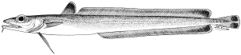
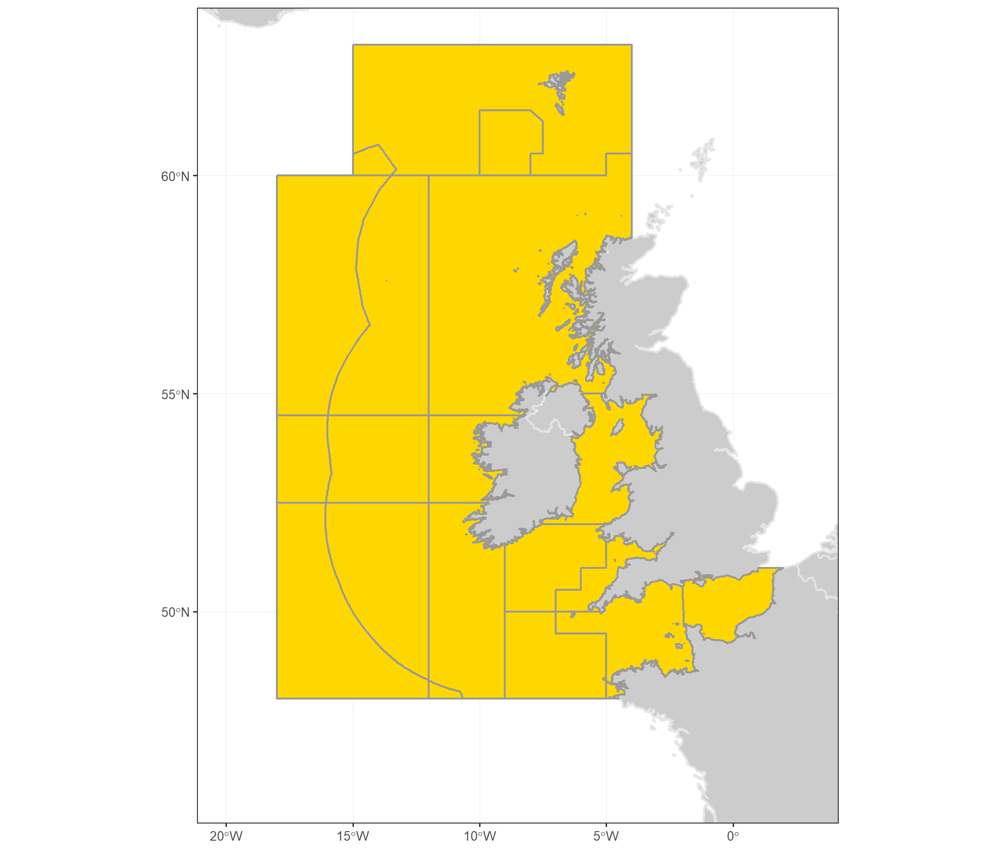

---
output:
  html_document:
    keep_md: true
    fig_height: 1
    fig_width: 1
    toc: yes
    toc_depth: 1
    toc_float: yes
    css: style.css
---

# ICES advice 2018

## *bli.27.5b67*

## Blue ling (*Molva dypterygia*) in subareas 6–7 and Division 5.b (Celtic Seas, English Channel, and Faroes grounds)

Published 7 June 2018

***

[See PDF version of advice sheet](http://ices.dk/sites/pub/Publication%20Reports/Advice/2018/2018/bli-5b67.pdf)  
[More information about this stock](http://sd.ices.dk/ViewStock.aspx?key=1592)   
[Detailed data and graphs for this stock assessment](http://standardgraphs.ices.dk/ViewCharts.aspx?key=9467)  
[Go to Transparent Assessment Framework page](https://github.com/ices-taf/2016_cod-347d)  
[See this stock in the ICES Spatial facility](http://gis.ices.dk/sf/index.html?widget=visa&assessmentKey=9467)

***

# ICES advice on fishing opportunities
ICES advises that when the MSY approach is applied, catches should be no more than **11 778** tonnes in 2019 and no more than **11 150** tonnes in 2020.
   

***

# Stock development over time
The spawning-stock biomass (SSB) has increased since 2004 and has been above MSY Btrigger since 2010. Fishing mortality has decreased since 2002 and has been lower than FMSY since 2004. Recruitment is estimated to be stable.

<table style="table-layout: fixed;width: 100%;">
<tr>
<td>
<!--html_preserve-->

<!--/html_preserve-->
</td>
<td>
<!--html_preserve-->

<!--/html_preserve-->
</td>
</tr>

<tr>
<td>
<!--html_preserve-->

<!--/html_preserve-->
</td>
<td>
<!--html_preserve-->

<!--/html_preserve-->
</td>
</tr>
</table>

**Figure 1**  Summary of stock assessment (weights in thousand tonnes and recruitment in millions) of blue ling in subareas 6–7 and Division 5.b. Assumed recruitment values are unshaded.
 

***

## Summary of the assessment

Blue ling in subareas 6–7 and Division 5.b. Assessment summary. Weights are in tonnes. Highs and lows are 95% confidence intervals
 
<button class="btn btn-primary" data-toggle="collapse" data-target="#BlockName1"> Show/Download Table </button>  

 
 

[Download CSV](data:text/csv;base64,IiIsIlllYXIiLCJyZWNydWl0bWVudCIsImhpZ2hfcmVjcnVpdG1lbnQiLCJsb3dfcmVjcnVpdG1lbnQiLCJsb3dfU1NCIiwiU1NCIiwiaGlnaF9TU0IiLCJjYXRjaGVzIiwibGFuZGluZ3MiLCJkaXNjYXJkcyIsImxvd19GIiwiRiIsImhpZ2hfRiIsIlN0b2NrUHVibGlzaE5vdGUiLCJQdXJwb3NlIiwiRmFnZSIsImZpc2hzdG9jayIsInJlY3J1aXRtZW50X2FnZSIsIkFzc2Vzc21lbnRZZWFyIiwidW5pdHMiLCJzdG9ja1NpemVEZXNjcmlwdGlvbiIsInN0b2NrU2l6ZVVuaXRzIiwiZmlzaGluZ1ByZXNzdXJlRGVzY3JpcHRpb24iLCJmaXNoaW5nUHJlc3N1cmVVbml0cyIKIjEiLDE5NjYsTkEsTkEsTkEsTkEsTkEsTkEsMTI4OSwxMjg5LE5BLE5BLE5BLE5BLCJTdG9jayBwdWJsaXNoZWQiLCJBZHZpY2UiLCI5LTE5IiwiYmxpLjI3LjViNjciLDksMjAxOCwidG9ubmVzIiwiU1NCIiwidG9ubmVzIiwiRiIsIlllYXItMSIKIjIiLDE5NjcsTkEsTkEsTkEsTkEsTkEsTkEsMTMxNiwxMzE2LE5BLE5BLE5BLE5BLCJTdG9jayBwdWJsaXNoZWQiLCJBZHZpY2UiLCI5LTE5IiwiYmxpLjI3LjViNjciLDksMjAxOCwidG9ubmVzIiwiU1NCIiwidG9ubmVzIiwiRiIsIlllYXItMSIKIjMiLDE5NjgsTkEsTkEsTkEsTkEsTkEsTkEsMjc4NywyNzg3LE5BLE5BLE5BLE5BLCJTdG9jayBwdWJsaXNoZWQiLCJBZHZpY2UiLCI5LTE5IiwiYmxpLjI3LjViNjciLDksMjAxOCwidG9ubmVzIiwiU1NCIiwidG9ubmVzIiwiRiIsIlllYXItMSIKIjQiLDE5NjksTkEsTkEsTkEsTkEsTkEsTkEsMTIxOSwxMjE5LE5BLE5BLE5BLE5BLCJTdG9jayBwdWJsaXNoZWQiLCJBZHZpY2UiLCI5LTE5IiwiYmxpLjI3LjViNjciLDksMjAxOCwidG9ubmVzIiwiU1NCIiwidG9ubmVzIiwiRiIsIlllYXItMSIKIjUiLDE5NzAsTkEsTkEsTkEsTkEsTkEsTkEsMzI0MiwzMjQyLE5BLE5BLE5BLE5BLCJTdG9jayBwdWJsaXNoZWQiLCJBZHZpY2UiLCI5LTE5IiwiYmxpLjI3LjViNjciLDksMjAxOCwidG9ubmVzIiwiU1NCIiwidG9ubmVzIiwiRiIsIlllYXItMSIKIjYiLDE5NzEsTkEsTkEsTkEsTkEsTkEsTkEsMTkzOSwxOTM5LE5BLE5BLE5BLE5BLCJTdG9jayBwdWJsaXNoZWQiLCJBZHZpY2UiLCI5LTE5IiwiYmxpLjI3LjViNjciLDksMjAxOCwidG9ubmVzIiwiU1NCIiwidG9ubmVzIiwiRiIsIlllYXItMSIKIjciLDE5NzIsTkEsTkEsTkEsTkEsTkEsTkEsNDY0Myw0NjQzLE5BLE5BLE5BLE5BLCJTdG9jayBwdWJsaXNoZWQiLCJBZHZpY2UiLCI5LTE5IiwiYmxpLjI3LjViNjciLDksMjAxOCwidG9ubmVzIiwiU1NCIiwidG9ubmVzIiwiRiIsIlllYXItMSIKIjgiLDE5NzMsTkEsTkEsTkEsTkEsTkEsTkEsMjUxNzIsMjUxNzIsTkEsTkEsTkEsTkEsIlN0b2NrIHB1Ymxpc2hlZCIsIkFkdmljZSIsIjktMTkiLCJibGkuMjcuNWI2NyIsOSwyMDE4LCJ0b25uZXMiLCJTU0IiLCJ0b25uZXMiLCJGIiwiWWVhci0xIgoiOSIsMTk3NCxOQSxOQSxOQSxOQSxOQSxOQSwyMDU3NSwyMDU3NSxOQSxOQSxOQSxOQSwiU3RvY2sgcHVibGlzaGVkIiwiQWR2aWNlIiwiOS0xOSIsImJsaS4yNy41YjY3Iiw5LDIwMTgsInRvbm5lcyIsIlNTQiIsInRvbm5lcyIsIkYiLCJZZWFyLTEiCiIxMCIsMTk3NSxOQSxOQSxOQSxOQSxOQSxOQSwxNDE5MywxNDE5MyxOQSxOQSxOQSxOQSwiU3RvY2sgcHVibGlzaGVkIiwiQWR2aWNlIiwiOS0xOSIsImJsaS4yNy41YjY3Iiw5LDIwMTgsInRvbm5lcyIsIlNTQiIsInRvbm5lcyIsIkYiLCJZZWFyLTEiCiIxMSIsMTk3NixOQSxOQSxOQSxOQSxOQSxOQSwxOTI0OCwxOTI0OCxOQSxOQSxOQSxOQSwiU3RvY2sgcHVibGlzaGVkIiwiQWR2aWNlIiwiOS0xOSIsImJsaS4yNy41YjY3Iiw5LDIwMTgsInRvbm5lcyIsIlNTQiIsInRvbm5lcyIsIkYiLCJZZWFyLTEiCiIxMiIsMTk3NyxOQSxOQSxOQSxOQSxOQSxOQSwzMDM0OSwzMDM0OSxOQSxOQSxOQSxOQSwiU3RvY2sgcHVibGlzaGVkIiwiQWR2aWNlIiwiOS0xOSIsImJsaS4yNy41YjY3Iiw5LDIwMTgsInRvbm5lcyIsIlNTQiIsInRvbm5lcyIsIkYiLCJZZWFyLTEiCiIxMyIsMTk3OCxOQSxOQSxOQSxOQSxOQSxOQSwxMzAwMCwxMzAwMCxOQSxOQSxOQSxOQSwiU3RvY2sgcHVibGlzaGVkIiwiQWR2aWNlIiwiOS0xOSIsImJsaS4yNy41YjY3Iiw5LDIwMTgsInRvbm5lcyIsIlNTQiIsInRvbm5lcyIsIkYiLCJZZWFyLTEiCiIxNCIsMTk3OSxOQSxOQSxOQSxOQSxOQSxOQSwxMDA4NywxMDA4NyxOQSxOQSxOQSxOQSwiU3RvY2sgcHVibGlzaGVkIiwiQWR2aWNlIiwiOS0xOSIsImJsaS4yNy41YjY3Iiw5LDIwMTgsInRvbm5lcyIsIlNTQiIsInRvbm5lcyIsIkYiLCJZZWFyLTEiCiIxNSIsMTk4MCxOQSxOQSxOQSxOQSxOQSxOQSwyMjI4NywyMjI4NyxOQSxOQSxOQSxOQSwiU3RvY2sgcHVibGlzaGVkIiwiQWR2aWNlIiwiOS0xOSIsImJsaS4yNy41YjY3Iiw5LDIwMTgsInRvbm5lcyIsIlNTQiIsInRvbm5lcyIsIkYiLCJZZWFyLTEiCiIxNiIsMTk4MSxOQSxOQSxOQSxOQSxOQSxOQSwxMzE5NSwxMzE5NSxOQSxOQSxOQSxOQSwiU3RvY2sgcHVibGlzaGVkIiwiQWR2aWNlIiwiOS0xOSIsImJsaS4yNy41YjY3Iiw5LDIwMTgsInRvbm5lcyIsIlNTQiIsInRvbm5lcyIsIkYiLCJZZWFyLTEiCiIxNyIsMTk4MixOQSxOQSxOQSxOQSxOQSxOQSwxMDkxMiwxMDkxMixOQSxOQSxOQSxOQSwiU3RvY2sgcHVibGlzaGVkIiwiQWR2aWNlIiwiOS0xOSIsImJsaS4yNy41YjY3Iiw5LDIwMTgsInRvbm5lcyIsIlNTQiIsInRvbm5lcyIsIkYiLCJZZWFyLTEiCiIxOCIsMTk4MyxOQSxOQSxOQSxOQSxOQSxOQSwxMTQzMiwxMTQzMixOQSxOQSxOQSxOQSwiU3RvY2sgcHVibGlzaGVkIiwiQWR2aWNlIiwiOS0xOSIsImJsaS4yNy41YjY3Iiw5LDIwMTgsInRvbm5lcyIsIlNTQiIsInRvbm5lcyIsIkYiLCJZZWFyLTEiCiIxOSIsMTk4NCxOQSxOQSxOQSxOQSxOQSxOQSwxNTQzNywxNTQzNyxOQSxOQSxOQSxOQSwiU3RvY2sgcHVibGlzaGVkIiwiQWR2aWNlIiwiOS0xOSIsImJsaS4yNy41YjY3Iiw5LDIwMTgsInRvbm5lcyIsIlNTQiIsInRvbm5lcyIsIkYiLCJZZWFyLTEiCiIyMCIsMTk4NSxOQSxOQSxOQSxOQSxOQSxOQSwxOTIwNSwxOTIwNSxOQSxOQSxOQSxOQSwiU3RvY2sgcHVibGlzaGVkIiwiQWR2aWNlIiwiOS0xOSIsImJsaS4yNy41YjY3Iiw5LDIwMTgsInRvbm5lcyIsIlNTQiIsInRvbm5lcyIsIkYiLCJZZWFyLTEiCiIyMSIsMTk4NixOQSxOQSxOQSxOQSxOQSxOQSwyMTAxOCwyMTAxOCxOQSxOQSxOQSxOQSwiU3RvY2sgcHVibGlzaGVkIiwiQWR2aWNlIiwiOS0xOSIsImJsaS4yNy41YjY3Iiw5LDIwMTgsInRvbm5lcyIsIlNTQiIsInRvbm5lcyIsIkYiLCJZZWFyLTEiCiIyMiIsMTk4NyxOQSxOQSxOQSxOQSxOQSxOQSwxNzQzMCwxNzQzMCxOQSxOQSxOQSxOQSwiU3RvY2sgcHVibGlzaGVkIiwiQWR2aWNlIiwiOS0xOSIsImJsaS4yNy41YjY3Iiw5LDIwMTgsInRvbm5lcyIsIlNTQiIsInRvbm5lcyIsIkYiLCJZZWFyLTEiCiIyMyIsMTk4OCxOQSxOQSxOQSxOQSxOQSxOQSwxODg0MiwxODg0MixOQSxOQSxOQSxOQSwiU3RvY2sgcHVibGlzaGVkIiwiQWR2aWNlIiwiOS0xOSIsImJsaS4yNy41YjY3Iiw5LDIwMTgsInRvbm5lcyIsIlNTQiIsInRvbm5lcyIsIkYiLCJZZWFyLTEiCiIyNCIsMTk4OSxOQSxOQSxOQSxOQSxOQSxOQSwxNTExNiwxNTExNixOQSxOQSxOQSxOQSwiU3RvY2sgcHVibGlzaGVkIiwiQWR2aWNlIiwiOS0xOSIsImJsaS4yNy41YjY3Iiw5LDIwMTgsInRvbm5lcyIsIlNTQiIsInRvbm5lcyIsIkYiLCJZZWFyLTEiCiIyNSIsMTk5MCxOQSxOQSxOQSxOQSxOQSxOQSwxMjQyNywxMjQyNyxOQSxOQSxOQSxOQSwiU3RvY2sgcHVibGlzaGVkIiwiQWR2aWNlIiwiOS0xOSIsImJsaS4yNy41YjY3Iiw5LDIwMTgsInRvbm5lcyIsIlNTQiIsInRvbm5lcyIsIkYiLCJZZWFyLTEiCiIyNiIsMTk5MSxOQSxOQSxOQSxOQSxOQSxOQSwxMjE4NSwxMjE4NSxOQSxOQSxOQSxOQSwiU3RvY2sgcHVibGlzaGVkIiwiQWR2aWNlIiwiOS0xOSIsImJsaS4yNy41YjY3Iiw5LDIwMTgsInRvbm5lcyIsIlNTQiIsInRvbm5lcyIsIkYiLCJZZWFyLTEiCiIyNyIsMTk5MixOQSxOQSxOQSxOQSxOQSxOQSwxMzY1OSwxMzY1OSxOQSxOQSxOQSxOQSwiU3RvY2sgcHVibGlzaGVkIiwiQWR2aWNlIiwiOS0xOSIsImJsaS4yNy41YjY3Iiw5LDIwMTgsInRvbm5lcyIsIlNTQiIsInRvbm5lcyIsIkYiLCJZZWFyLTEiCiIyOCIsMTk5MyxOQSxOQSxOQSxOQSxOQSxOQSwxMDc4OSwxMDc4OSxOQSxOQSxOQSxOQSwiU3RvY2sgcHVibGlzaGVkIiwiQWR2aWNlIiwiOS0xOSIsImJsaS4yNy41YjY3Iiw5LDIwMTgsInRvbm5lcyIsIlNTQiIsInRvbm5lcyIsIkYiLCJZZWFyLTEiCiIyOSIsMTk5NCxOQSxOQSxOQSxOQSxOQSxOQSw2MzE3LDYzMTcsTkEsTkEsTkEsTkEsIlN0b2NrIHB1Ymxpc2hlZCIsIkFkdmljZSIsIjktMTkiLCJibGkuMjcuNWI2NyIsOSwyMDE4LCJ0b25uZXMiLCJTU0IiLCJ0b25uZXMiLCJGIiwiWWVhci0xIgoiMzAiLDE5OTUsMzQ5Niw0MTEzLDI4ODAsNDcyMzQsNzA3NDgsOTQyNjEsNzU3MCw3NTcwLE5BLDAuMDg3LDAuMTEyLDAuMTM2LCJTdG9jayBwdWJsaXNoZWQiLCJBZHZpY2UiLCI5LTE5IiwiYmxpLjI3LjViNjciLDksMjAxOCwidG9ubmVzIiwiU1NCIiwidG9ubmVzIiwiRiIsIlllYXItMSIKIjMxIiwxOTk2LDM1MTQsNDE0MywyODg0LDQ4Njc5LDcxMjY1LDkzODUyLDg1MzEsODUzMSxOQSwwLjA5NSwwLjExNywwLjE0LCJTdG9jayBwdWJsaXNoZWQiLCJBZHZpY2UiLCI5LTE5IiwiYmxpLjI3LjViNjciLDksMjAxOCwidG9ubmVzIiwiU1NCIiwidG9ubmVzIiwiRiIsIlllYXItMSIKIjMyIiwxOTk3LDM1NjIsNDE5OSwyOTI0LDQ5OTQyLDcxNTMzLDkzMTI1LDEwMzY3LDEwMzY3LE5BLDAuMTMsMC4xNTYsMC4xODMsIlN0b2NrIHB1Ymxpc2hlZCIsIkFkdmljZSIsIjktMTkiLCJibGkuMjcuNWI2NyIsOSwyMDE4LCJ0b25uZXMiLCJTU0IiLCJ0b25uZXMiLCJGIiwiWWVhci0xIgoiMzMiLDE5OTgsMzUwNiw0MTI3LDI4ODUsNDkxODEsNjkyNzAsODkzNTksMTA2ODIsMTA2ODIsTkEsMC4xMzMsMC4xNTgsMC4xODQsIlN0b2NrIHB1Ymxpc2hlZCIsIkFkdmljZSIsIjktMTkiLCJibGkuMjcuNWI2NyIsOSwyMDE4LCJ0b25uZXMiLCJTU0IiLCJ0b25uZXMiLCJGIiwiWWVhci0xIgoiMzQiLDE5OTksMzU4Niw0MjIzLDI5NDksNDg3NDAsNjc1NzUsODY0MTAsMTI0MDYsMTI0MDYsTkEsMC4xNzEsMC4yMDIsMC4yMzIsIlN0b2NrIHB1Ymxpc2hlZCIsIkFkdmljZSIsIjktMTkiLCJibGkuMjcuNWI2NyIsOSwyMDE4LCJ0b25uZXMiLCJTU0IiLCJ0b25uZXMiLCJGIiwiWWVhci0xIgoiMzUiLDIwMDAsMzQ5OCw0MTA0LDI4OTMsNDY0MTksNjM2MTUsODA4MTEsMTExNjAsMTExNjAsTkEsMC4xNzQsMC4yMDUsMC4yMzYsIlN0b2NrIHB1Ymxpc2hlZCIsIkFkdmljZSIsIjktMTkiLCJibGkuMjcuNWI2NyIsOSwyMDE4LCJ0b25uZXMiLCJTU0IiLCJ0b25uZXMiLCJGIiwiWWVhci0xIgoiMzYiLDIwMDEsMzUzMSw0MTIyLDI5MzksNDQ2MjYsNjA0ODAsNzYzMzUsMTIxMjcsMTIxMjcsTkEsMC4xODcsMC4yMjEsMC4yNTUsIlN0b2NrIHB1Ymxpc2hlZCIsIkFkdmljZSIsIjktMTkiLCJibGkuMjcuNWI2NyIsOSwyMDE4LCJ0b25uZXMiLCJTU0IiLCJ0b25uZXMiLCJGIiwiWWVhci0xIgoiMzciLDIwMDIsMzM4MSw0MDQyLDI3MTksNDE5NDMsNTY4NjEsNzE3NzksODc1Myw4NzUzLE5BLDAuMTM4LDAuMTY1LDAuMTkyLCJTdG9jayBwdWJsaXNoZWQiLCJBZHZpY2UiLCI5LTE5IiwiYmxpLjI3LjViNjciLDksMjAxOCwidG9ubmVzIiwiU1NCIiwidG9ubmVzIiwiRiIsIlllYXItMSIKIjM4IiwyMDAzLDM0MDYsNDAzMCwyNzgxLDQyMDkyLDU2NjkyLDcxMjkyLDcyNzUsNzI3NSxOQSwwLjExOCwwLjE0MiwwLjE2NiwiU3RvY2sgcHVibGlzaGVkIiwiQWR2aWNlIiwiOS0xOSIsImJsaS4yNy41YjY3Iiw5LDIwMTgsInRvbm5lcyIsIlNTQiIsInRvbm5lcyIsIkYiLCJZZWFyLTEiCiIzOSIsMjAwNCwzNjMyLDQyMTIsMzA1Myw0MzkxNSw1ODM1MCw3Mjc4NSw2MjIyLDYyMjIsTkEsMC4wOTEsMC4xMDgsMC4xMjYsIlN0b2NrIHB1Ymxpc2hlZCIsIkFkdmljZSIsIjktMTkiLCJibGkuMjcuNWI2NyIsOSwyMDE4LCJ0b25uZXMiLCJTU0IiLCJ0b25uZXMiLCJGIiwiWWVhci0xIgoiNDAiLDIwMDUsMzc2NCw0NDIxLDMxMDcsNDcwODUsNjE4MzUsNzY1ODUsNTQ4MSw1NDgxLE5BLDAuMDgzLDAuMDk3LDAuMTEyLCJTdG9jayBwdWJsaXNoZWQiLCJBZHZpY2UiLCI5LTE5IiwiYmxpLjI3LjViNjciLDksMjAxOCwidG9ubmVzIiwiU1NCIiwidG9ubmVzIiwiRiIsIlllYXItMSIKIjQxIiwyMDA2LDM3MDIsNDI5NCwzMTEwLDUwMzAzLDY1MjAyLDgwMTAyLDU2NTAsNTY1MCxOQSwwLjA4NiwwLjEwMSwwLjExNiwiU3RvY2sgcHVibGlzaGVkIiwiQWR2aWNlIiwiOS0xOSIsImJsaS4yNy41YjY3Iiw5LDIwMTgsInRvbm5lcyIsIlNTQiIsInRvbm5lcyIsIkYiLCJZZWFyLTEiCiI0MiIsMjAwNywzNjQwLDQyMDMsMzA3Nyw1Mjc3MCw2NzcwNCw4MjYzNyw1NjQ4LDU2NDgsTkEsMC4wNzksMC4wOTIsMC4xMDYsIlN0b2NrIHB1Ymxpc2hlZCIsIkFkdmljZSIsIjktMTkiLCJibGkuMjcuNWI2NyIsOSwyMDE4LCJ0b25uZXMiLCJTU0IiLCJ0b25uZXMiLCJGIiwiWWVhci0xIgoiNDMiLDIwMDgsMzU5MSw0MTUwLDMwMzMsNTUxMzAsNzAyMTYsODUzMDIsMzk0MCwzOTQwLE5BLDAuMDU2LDAuMDY2LDAuMDc2LCJTdG9jayBwdWJsaXNoZWQiLCJBZHZpY2UiLCI5LTE5IiwiYmxpLjI3LjViNjciLDksMjAxOCwidG9ubmVzIiwiU1NCIiwidG9ubmVzIiwiRiIsIlllYXItMSIKIjQ0IiwyMDA5LDM0ODYsNDA1NSwyOTE3LDU4MTc3LDczNjU5LDg5MTQyLDQxMjEsNDEyMSxOQSwwLjA1NSwwLjA2NSwwLjA3NSwiU3RvY2sgcHVibGlzaGVkIiwiQWR2aWNlIiwiOS0xOSIsImJsaS4yNy41YjY3Iiw5LDIwMTgsInRvbm5lcyIsIlNTQiIsInRvbm5lcyIsIkYiLCJZZWFyLTEiCiI0NSIsMjAxMCwzNDA1LDQwMDcsMjgwNCw2MDUzOSw3NjUyOSw5MjUyMCw0NzU5LDQ3NTksTkEsMC4wNiwwLjA3MSwwLjA4MiwiU3RvY2sgcHVibGlzaGVkIiwiQWR2aWNlIiwiOS0xOSIsImJsaS4yNy41YjY3Iiw5LDIwMTgsInRvbm5lcyIsIlNTQiIsInRvbm5lcyIsIkYiLCJZZWFyLTEiCiI0NiIsMjAxMSwzNDI0LDQwMzIsMjgxNSw2MjI0Miw3ODcwNCw5NTE2NSwyODYxLDI4NjEsTkEsMC4wMzYsMC4wNDMsMC4wNDksIlN0b2NrIHB1Ymxpc2hlZCIsIkFkdmljZSIsIjktMTkiLCJibGkuMjcuNWI2NyIsOSwyMDE4LCJ0b25uZXMiLCJTU0IiLCJ0b25uZXMiLCJGIiwiWWVhci0xIgoiNDciLDIwMTIsMzMwMSwzOTc1LDI2MjcsNjQ5NTEsODIyNDIsOTk1MzIsMzAzMSwzMDMxLE5BLDAuMDM4LDAuMDQ2LDAuMDUzLCJTdG9jayBwdWJsaXNoZWQiLCJBZHZpY2UiLCI5LTE5IiwiYmxpLjI3LjViNjciLDksMjAxOCwidG9ubmVzIiwiU1NCIiwidG9ubmVzIiwiRiIsIlllYXItMSIKIjQ4IiwyMDEzLDMyMDMsMzk4OCwyNDE3LDY2NDI2LDg0ODQ5LDEwMzI3MiwyNTg4LDI1ODgsTkEsMC4wMywwLjAzNywwLjA0MywiU3RvY2sgcHVibGlzaGVkIiwiQWR2aWNlIiwiOS0xOSIsImJsaS4yNy41YjY3Iiw5LDIwMTgsInRvbm5lcyIsIlNTQiIsInRvbm5lcyIsIkYiLCJZZWFyLTEiCiI0OSIsMjAxNCwzMjk1LDQwMjksMjU2MCw2ODgxNCw4ODE0MywxMDc0NzEsMjk0OSwyOTQ5LE5BLDAuMDMzLDAuMDQsMC4wNDcsIlN0b2NrIHB1Ymxpc2hlZCIsIkFkdmljZSIsIjktMTkiLCJibGkuMjcuNWI2NyIsOSwyMDE4LCJ0b25uZXMiLCJTU0IiLCJ0b25uZXMiLCJGIiwiWWVhci0xIgoiNTAiLDIwMTUsMzYwNSw0MjMxLDI5ODAsNzIwNzcsOTE4MTIsMTExNTQ3LDI3NDgsMjc0OCxOQSwwLjAzLDAuMDM3LDAuMDQzLCJTdG9jayBwdWJsaXNoZWQiLCJBZHZpY2UiLCI5LTE5IiwiYmxpLjI3LjViNjciLDksMjAxOCwidG9ubmVzIiwiU1NCIiwidG9ubmVzIiwiRiIsIlllYXItMSIKIjUxIiwyMDE2LDM1NTEsNDE4MSwyOTIwLDc0OTY1LDk1MTg4LDExNTQxMiwzMDU5LDMwNTksTkEsMC4wMjksMC4wMzUsMC4wNDEsIlN0b2NrIHB1Ymxpc2hlZCIsIkFkdmljZSIsIjktMTkiLCJibGkuMjcuNWI2NyIsOSwyMDE4LCJ0b25uZXMiLCJTU0IiLCJ0b25uZXMiLCJGIiwiWWVhci0xIgoiNTIiLDIwMTcsMzU5OSw0MjQ4LDI5NTAsNzc3NDEsOTg1MTcsMTE5MjkzLDI2NjksMjY2OSxOQSwwLjAyNSwwLjAzLDAuMDM1LCJTdG9jayBwdWJsaXNoZWQiLCJBZHZpY2UiLCI5LTE5IiwiYmxpLjI3LjViNjciLDksMjAxOCwidG9ubmVzIiwiU1NCIiwidG9ubmVzIiwiRiIsIlllYXItMSIKIjUzIiwyMDE4LDM0NzksNDE0MiwyODE2LDgwMTYyLDEwMTUwMSwxMjI4NDEsTkEsTkEsTkEsTkEsTkEsTkEsIlN0b2NrIHB1Ymxpc2hlZCIsIkFkdmljZSIsIjktMTkiLCJibGkuMjcuNWI2NyIsOSwyMDE4LCJ0b25uZXMiLCJTU0IiLCJ0b25uZXMiLCJGIiwiWWVhci0xIg==)

<table class="table" style="margin-left: auto; margin-right: auto;">
 <thead>
  <tr>
   <th style="text-align:right;font-weight: bold;color: black;background-color: lightgrey;text-align: center;"> Year </th>
   <th style="text-align:right;font-weight: bold;color: black;background-color: lightgrey;text-align: center;"> recruitment </th>
   <th style="text-align:right;font-weight: bold;color: black;background-color: lightgrey;text-align: center;"> high_recruitment </th>
   <th style="text-align:right;font-weight: bold;color: black;background-color: lightgrey;text-align: center;"> low_recruitment </th>
   <th style="text-align:right;font-weight: bold;color: black;background-color: lightgrey;text-align: center;"> low_SSB </th>
   <th style="text-align:right;font-weight: bold;color: black;background-color: lightgrey;text-align: center;"> SSB </th>
   <th style="text-align:right;font-weight: bold;color: black;background-color: lightgrey;text-align: center;"> high_SSB </th>
   <th style="text-align:right;font-weight: bold;color: black;background-color: lightgrey;text-align: center;"> catches </th>
   <th style="text-align:right;font-weight: bold;color: black;background-color: lightgrey;text-align: center;"> landings </th>
   <th style="text-align:right;font-weight: bold;color: black;background-color: lightgrey;text-align: center;"> discards </th>
   <th style="text-align:right;font-weight: bold;color: black;background-color: lightgrey;text-align: center;"> low_F </th>
   <th style="text-align:right;font-weight: bold;color: black;background-color: lightgrey;text-align: center;"> F </th>
   <th style="text-align:right;font-weight: bold;color: black;background-color: lightgrey;text-align: center;"> high_F </th>
   <th style="text-align:left;font-weight: bold;color: black;background-color: lightgrey;text-align: center;"> StockPublishNote </th>
   <th style="text-align:left;font-weight: bold;color: black;background-color: lightgrey;text-align: center;"> Purpose </th>
   <th style="text-align:left;font-weight: bold;color: black;background-color: lightgrey;text-align: center;"> Fage </th>
   <th style="text-align:left;font-weight: bold;color: black;background-color: lightgrey;text-align: center;"> fishstock </th>
   <th style="text-align:right;font-weight: bold;color: black;background-color: lightgrey;text-align: center;"> recruitment_age </th>
   <th style="text-align:right;font-weight: bold;color: black;background-color: lightgrey;text-align: center;"> AssessmentYear </th>
   <th style="text-align:left;font-weight: bold;color: black;background-color: lightgrey;text-align: center;"> units </th>
   <th style="text-align:left;font-weight: bold;color: black;background-color: lightgrey;text-align: center;"> stockSizeDescription </th>
   <th style="text-align:left;font-weight: bold;color: black;background-color: lightgrey;text-align: center;"> stockSizeUnits </th>
   <th style="text-align:left;font-weight: bold;color: black;background-color: lightgrey;text-align: center;"> fishingPressureDescription </th>
   <th style="text-align:left;font-weight: bold;color: black;background-color: lightgrey;text-align: center;"> fishingPressureUnits </th>
  </tr>
 </thead>
<tbody>
  <tr>
   <td style="text-align:right;"> 1966 </td>
   <td style="text-align:right;"> NA </td>
   <td style="text-align:right;"> NA </td>
   <td style="text-align:right;"> NA </td>
   <td style="text-align:right;"> NA </td>
   <td style="text-align:right;"> NA </td>
   <td style="text-align:right;"> NA </td>
   <td style="text-align:right;"> 1289 </td>
   <td style="text-align:right;"> 1289 </td>
   <td style="text-align:right;"> NA </td>
   <td style="text-align:right;"> NA </td>
   <td style="text-align:right;"> NA </td>
   <td style="text-align:right;"> NA </td>
   <td style="text-align:left;"> Stock published </td>
   <td style="text-align:left;"> Advice </td>
   <td style="text-align:left;"> 9-19 </td>
   <td style="text-align:left;"> bli.27.5b67 </td>
   <td style="text-align:right;"> 9 </td>
   <td style="text-align:right;"> 2018 </td>
   <td style="text-align:left;"> tonnes </td>
   <td style="text-align:left;"> SSB </td>
   <td style="text-align:left;"> tonnes </td>
   <td style="text-align:left;"> F </td>
   <td style="text-align:left;"> Year-1 </td>
  </tr>
  <tr>
   <td style="text-align:right;"> 1967 </td>
   <td style="text-align:right;"> NA </td>
   <td style="text-align:right;"> NA </td>
   <td style="text-align:right;"> NA </td>
   <td style="text-align:right;"> NA </td>
   <td style="text-align:right;"> NA </td>
   <td style="text-align:right;"> NA </td>
   <td style="text-align:right;"> 1316 </td>
   <td style="text-align:right;"> 1316 </td>
   <td style="text-align:right;"> NA </td>
   <td style="text-align:right;"> NA </td>
   <td style="text-align:right;"> NA </td>
   <td style="text-align:right;"> NA </td>
   <td style="text-align:left;"> Stock published </td>
   <td style="text-align:left;"> Advice </td>
   <td style="text-align:left;"> 9-19 </td>
   <td style="text-align:left;"> bli.27.5b67 </td>
   <td style="text-align:right;"> 9 </td>
   <td style="text-align:right;"> 2018 </td>
   <td style="text-align:left;"> tonnes </td>
   <td style="text-align:left;"> SSB </td>
   <td style="text-align:left;"> tonnes </td>
   <td style="text-align:left;"> F </td>
   <td style="text-align:left;"> Year-1 </td>
  </tr>
  <tr>
   <td style="text-align:right;"> 1968 </td>
   <td style="text-align:right;"> NA </td>
   <td style="text-align:right;"> NA </td>
   <td style="text-align:right;"> NA </td>
   <td style="text-align:right;"> NA </td>
   <td style="text-align:right;"> NA </td>
   <td style="text-align:right;"> NA </td>
   <td style="text-align:right;"> 2787 </td>
   <td style="text-align:right;"> 2787 </td>
   <td style="text-align:right;"> NA </td>
   <td style="text-align:right;"> NA </td>
   <td style="text-align:right;"> NA </td>
   <td style="text-align:right;"> NA </td>
   <td style="text-align:left;"> Stock published </td>
   <td style="text-align:left;"> Advice </td>
   <td style="text-align:left;"> 9-19 </td>
   <td style="text-align:left;"> bli.27.5b67 </td>
   <td style="text-align:right;"> 9 </td>
   <td style="text-align:right;"> 2018 </td>
   <td style="text-align:left;"> tonnes </td>
   <td style="text-align:left;"> SSB </td>
   <td style="text-align:left;"> tonnes </td>
   <td style="text-align:left;"> F </td>
   <td style="text-align:left;"> Year-1 </td>
  </tr>
  <tr>
   <td style="text-align:right;"> 1969 </td>
   <td style="text-align:right;"> NA </td>
   <td style="text-align:right;"> NA </td>
   <td style="text-align:right;"> NA </td>
   <td style="text-align:right;"> NA </td>
   <td style="text-align:right;"> NA </td>
   <td style="text-align:right;"> NA </td>
   <td style="text-align:right;"> 1219 </td>
   <td style="text-align:right;"> 1219 </td>
   <td style="text-align:right;"> NA </td>
   <td style="text-align:right;"> NA </td>
   <td style="text-align:right;"> NA </td>
   <td style="text-align:right;"> NA </td>
   <td style="text-align:left;"> Stock published </td>
   <td style="text-align:left;"> Advice </td>
   <td style="text-align:left;"> 9-19 </td>
   <td style="text-align:left;"> bli.27.5b67 </td>
   <td style="text-align:right;"> 9 </td>
   <td style="text-align:right;"> 2018 </td>
   <td style="text-align:left;"> tonnes </td>
   <td style="text-align:left;"> SSB </td>
   <td style="text-align:left;"> tonnes </td>
   <td style="text-align:left;"> F </td>
   <td style="text-align:left;"> Year-1 </td>
  </tr>
  <tr>
   <td style="text-align:right;"> 1970 </td>
   <td style="text-align:right;"> NA </td>
   <td style="text-align:right;"> NA </td>
   <td style="text-align:right;"> NA </td>
   <td style="text-align:right;"> NA </td>
   <td style="text-align:right;"> NA </td>
   <td style="text-align:right;"> NA </td>
   <td style="text-align:right;"> 3242 </td>
   <td style="text-align:right;"> 3242 </td>
   <td style="text-align:right;"> NA </td>
   <td style="text-align:right;"> NA </td>
   <td style="text-align:right;"> NA </td>
   <td style="text-align:right;"> NA </td>
   <td style="text-align:left;"> Stock published </td>
   <td style="text-align:left;"> Advice </td>
   <td style="text-align:left;"> 9-19 </td>
   <td style="text-align:left;"> bli.27.5b67 </td>
   <td style="text-align:right;"> 9 </td>
   <td style="text-align:right;"> 2018 </td>
   <td style="text-align:left;"> tonnes </td>
   <td style="text-align:left;"> SSB </td>
   <td style="text-align:left;"> tonnes </td>
   <td style="text-align:left;"> F </td>
   <td style="text-align:left;"> Year-1 </td>
  </tr>
  <tr>
   <td style="text-align:right;"> 1971 </td>
   <td style="text-align:right;"> NA </td>
   <td style="text-align:right;"> NA </td>
   <td style="text-align:right;"> NA </td>
   <td style="text-align:right;"> NA </td>
   <td style="text-align:right;"> NA </td>
   <td style="text-align:right;"> NA </td>
   <td style="text-align:right;"> 1939 </td>
   <td style="text-align:right;"> 1939 </td>
   <td style="text-align:right;"> NA </td>
   <td style="text-align:right;"> NA </td>
   <td style="text-align:right;"> NA </td>
   <td style="text-align:right;"> NA </td>
   <td style="text-align:left;"> Stock published </td>
   <td style="text-align:left;"> Advice </td>
   <td style="text-align:left;"> 9-19 </td>
   <td style="text-align:left;"> bli.27.5b67 </td>
   <td style="text-align:right;"> 9 </td>
   <td style="text-align:right;"> 2018 </td>
   <td style="text-align:left;"> tonnes </td>
   <td style="text-align:left;"> SSB </td>
   <td style="text-align:left;"> tonnes </td>
   <td style="text-align:left;"> F </td>
   <td style="text-align:left;"> Year-1 </td>
  </tr>
  <tr>
   <td style="text-align:right;"> 1972 </td>
   <td style="text-align:right;"> NA </td>
   <td style="text-align:right;"> NA </td>
   <td style="text-align:right;"> NA </td>
   <td style="text-align:right;"> NA </td>
   <td style="text-align:right;"> NA </td>
   <td style="text-align:right;"> NA </td>
   <td style="text-align:right;"> 4643 </td>
   <td style="text-align:right;"> 4643 </td>
   <td style="text-align:right;"> NA </td>
   <td style="text-align:right;"> NA </td>
   <td style="text-align:right;"> NA </td>
   <td style="text-align:right;"> NA </td>
   <td style="text-align:left;"> Stock published </td>
   <td style="text-align:left;"> Advice </td>
   <td style="text-align:left;"> 9-19 </td>
   <td style="text-align:left;"> bli.27.5b67 </td>
   <td style="text-align:right;"> 9 </td>
   <td style="text-align:right;"> 2018 </td>
   <td style="text-align:left;"> tonnes </td>
   <td style="text-align:left;"> SSB </td>
   <td style="text-align:left;"> tonnes </td>
   <td style="text-align:left;"> F </td>
   <td style="text-align:left;"> Year-1 </td>
  </tr>
  <tr>
   <td style="text-align:right;"> 1973 </td>
   <td style="text-align:right;"> NA </td>
   <td style="text-align:right;"> NA </td>
   <td style="text-align:right;"> NA </td>
   <td style="text-align:right;"> NA </td>
   <td style="text-align:right;"> NA </td>
   <td style="text-align:right;"> NA </td>
   <td style="text-align:right;"> 25172 </td>
   <td style="text-align:right;"> 25172 </td>
   <td style="text-align:right;"> NA </td>
   <td style="text-align:right;"> NA </td>
   <td style="text-align:right;"> NA </td>
   <td style="text-align:right;"> NA </td>
   <td style="text-align:left;"> Stock published </td>
   <td style="text-align:left;"> Advice </td>
   <td style="text-align:left;"> 9-19 </td>
   <td style="text-align:left;"> bli.27.5b67 </td>
   <td style="text-align:right;"> 9 </td>
   <td style="text-align:right;"> 2018 </td>
   <td style="text-align:left;"> tonnes </td>
   <td style="text-align:left;"> SSB </td>
   <td style="text-align:left;"> tonnes </td>
   <td style="text-align:left;"> F </td>
   <td style="text-align:left;"> Year-1 </td>
  </tr>
  <tr>
   <td style="text-align:right;"> 1974 </td>
   <td style="text-align:right;"> NA </td>
   <td style="text-align:right;"> NA </td>
   <td style="text-align:right;"> NA </td>
   <td style="text-align:right;"> NA </td>
   <td style="text-align:right;"> NA </td>
   <td style="text-align:right;"> NA </td>
   <td style="text-align:right;"> 20575 </td>
   <td style="text-align:right;"> 20575 </td>
   <td style="text-align:right;"> NA </td>
   <td style="text-align:right;"> NA </td>
   <td style="text-align:right;"> NA </td>
   <td style="text-align:right;"> NA </td>
   <td style="text-align:left;"> Stock published </td>
   <td style="text-align:left;"> Advice </td>
   <td style="text-align:left;"> 9-19 </td>
   <td style="text-align:left;"> bli.27.5b67 </td>
   <td style="text-align:right;"> 9 </td>
   <td style="text-align:right;"> 2018 </td>
   <td style="text-align:left;"> tonnes </td>
   <td style="text-align:left;"> SSB </td>
   <td style="text-align:left;"> tonnes </td>
   <td style="text-align:left;"> F </td>
   <td style="text-align:left;"> Year-1 </td>
  </tr>
  <tr>
   <td style="text-align:right;"> 1975 </td>
   <td style="text-align:right;"> NA </td>
   <td style="text-align:right;"> NA </td>
   <td style="text-align:right;"> NA </td>
   <td style="text-align:right;"> NA </td>
   <td style="text-align:right;"> NA </td>
   <td style="text-align:right;"> NA </td>
   <td style="text-align:right;"> 14193 </td>
   <td style="text-align:right;"> 14193 </td>
   <td style="text-align:right;"> NA </td>
   <td style="text-align:right;"> NA </td>
   <td style="text-align:right;"> NA </td>
   <td style="text-align:right;"> NA </td>
   <td style="text-align:left;"> Stock published </td>
   <td style="text-align:left;"> Advice </td>
   <td style="text-align:left;"> 9-19 </td>
   <td style="text-align:left;"> bli.27.5b67 </td>
   <td style="text-align:right;"> 9 </td>
   <td style="text-align:right;"> 2018 </td>
   <td style="text-align:left;"> tonnes </td>
   <td style="text-align:left;"> SSB </td>
   <td style="text-align:left;"> tonnes </td>
   <td style="text-align:left;"> F </td>
   <td style="text-align:left;"> Year-1 </td>
  </tr>
  <tr>
   <td style="text-align:right;"> 1976 </td>
   <td style="text-align:right;"> NA </td>
   <td style="text-align:right;"> NA </td>
   <td style="text-align:right;"> NA </td>
   <td style="text-align:right;"> NA </td>
   <td style="text-align:right;"> NA </td>
   <td style="text-align:right;"> NA </td>
   <td style="text-align:right;"> 19248 </td>
   <td style="text-align:right;"> 19248 </td>
   <td style="text-align:right;"> NA </td>
   <td style="text-align:right;"> NA </td>
   <td style="text-align:right;"> NA </td>
   <td style="text-align:right;"> NA </td>
   <td style="text-align:left;"> Stock published </td>
   <td style="text-align:left;"> Advice </td>
   <td style="text-align:left;"> 9-19 </td>
   <td style="text-align:left;"> bli.27.5b67 </td>
   <td style="text-align:right;"> 9 </td>
   <td style="text-align:right;"> 2018 </td>
   <td style="text-align:left;"> tonnes </td>
   <td style="text-align:left;"> SSB </td>
   <td style="text-align:left;"> tonnes </td>
   <td style="text-align:left;"> F </td>
   <td style="text-align:left;"> Year-1 </td>
  </tr>
  <tr>
   <td style="text-align:right;"> 1977 </td>
   <td style="text-align:right;"> NA </td>
   <td style="text-align:right;"> NA </td>
   <td style="text-align:right;"> NA </td>
   <td style="text-align:right;"> NA </td>
   <td style="text-align:right;"> NA </td>
   <td style="text-align:right;"> NA </td>
   <td style="text-align:right;"> 30349 </td>
   <td style="text-align:right;"> 30349 </td>
   <td style="text-align:right;"> NA </td>
   <td style="text-align:right;"> NA </td>
   <td style="text-align:right;"> NA </td>
   <td style="text-align:right;"> NA </td>
   <td style="text-align:left;"> Stock published </td>
   <td style="text-align:left;"> Advice </td>
   <td style="text-align:left;"> 9-19 </td>
   <td style="text-align:left;"> bli.27.5b67 </td>
   <td style="text-align:right;"> 9 </td>
   <td style="text-align:right;"> 2018 </td>
   <td style="text-align:left;"> tonnes </td>
   <td style="text-align:left;"> SSB </td>
   <td style="text-align:left;"> tonnes </td>
   <td style="text-align:left;"> F </td>
   <td style="text-align:left;"> Year-1 </td>
  </tr>
  <tr>
   <td style="text-align:right;"> 1978 </td>
   <td style="text-align:right;"> NA </td>
   <td style="text-align:right;"> NA </td>
   <td style="text-align:right;"> NA </td>
   <td style="text-align:right;"> NA </td>
   <td style="text-align:right;"> NA </td>
   <td style="text-align:right;"> NA </td>
   <td style="text-align:right;"> 13000 </td>
   <td style="text-align:right;"> 13000 </td>
   <td style="text-align:right;"> NA </td>
   <td style="text-align:right;"> NA </td>
   <td style="text-align:right;"> NA </td>
   <td style="text-align:right;"> NA </td>
   <td style="text-align:left;"> Stock published </td>
   <td style="text-align:left;"> Advice </td>
   <td style="text-align:left;"> 9-19 </td>
   <td style="text-align:left;"> bli.27.5b67 </td>
   <td style="text-align:right;"> 9 </td>
   <td style="text-align:right;"> 2018 </td>
   <td style="text-align:left;"> tonnes </td>
   <td style="text-align:left;"> SSB </td>
   <td style="text-align:left;"> tonnes </td>
   <td style="text-align:left;"> F </td>
   <td style="text-align:left;"> Year-1 </td>
  </tr>
  <tr>
   <td style="text-align:right;"> 1979 </td>
   <td style="text-align:right;"> NA </td>
   <td style="text-align:right;"> NA </td>
   <td style="text-align:right;"> NA </td>
   <td style="text-align:right;"> NA </td>
   <td style="text-align:right;"> NA </td>
   <td style="text-align:right;"> NA </td>
   <td style="text-align:right;"> 10087 </td>
   <td style="text-align:right;"> 10087 </td>
   <td style="text-align:right;"> NA </td>
   <td style="text-align:right;"> NA </td>
   <td style="text-align:right;"> NA </td>
   <td style="text-align:right;"> NA </td>
   <td style="text-align:left;"> Stock published </td>
   <td style="text-align:left;"> Advice </td>
   <td style="text-align:left;"> 9-19 </td>
   <td style="text-align:left;"> bli.27.5b67 </td>
   <td style="text-align:right;"> 9 </td>
   <td style="text-align:right;"> 2018 </td>
   <td style="text-align:left;"> tonnes </td>
   <td style="text-align:left;"> SSB </td>
   <td style="text-align:left;"> tonnes </td>
   <td style="text-align:left;"> F </td>
   <td style="text-align:left;"> Year-1 </td>
  </tr>
  <tr>
   <td style="text-align:right;"> 1980 </td>
   <td style="text-align:right;"> NA </td>
   <td style="text-align:right;"> NA </td>
   <td style="text-align:right;"> NA </td>
   <td style="text-align:right;"> NA </td>
   <td style="text-align:right;"> NA </td>
   <td style="text-align:right;"> NA </td>
   <td style="text-align:right;"> 22287 </td>
   <td style="text-align:right;"> 22287 </td>
   <td style="text-align:right;"> NA </td>
   <td style="text-align:right;"> NA </td>
   <td style="text-align:right;"> NA </td>
   <td style="text-align:right;"> NA </td>
   <td style="text-align:left;"> Stock published </td>
   <td style="text-align:left;"> Advice </td>
   <td style="text-align:left;"> 9-19 </td>
   <td style="text-align:left;"> bli.27.5b67 </td>
   <td style="text-align:right;"> 9 </td>
   <td style="text-align:right;"> 2018 </td>
   <td style="text-align:left;"> tonnes </td>
   <td style="text-align:left;"> SSB </td>
   <td style="text-align:left;"> tonnes </td>
   <td style="text-align:left;"> F </td>
   <td style="text-align:left;"> Year-1 </td>
  </tr>
  <tr>
   <td style="text-align:right;"> 1981 </td>
   <td style="text-align:right;"> NA </td>
   <td style="text-align:right;"> NA </td>
   <td style="text-align:right;"> NA </td>
   <td style="text-align:right;"> NA </td>
   <td style="text-align:right;"> NA </td>
   <td style="text-align:right;"> NA </td>
   <td style="text-align:right;"> 13195 </td>
   <td style="text-align:right;"> 13195 </td>
   <td style="text-align:right;"> NA </td>
   <td style="text-align:right;"> NA </td>
   <td style="text-align:right;"> NA </td>
   <td style="text-align:right;"> NA </td>
   <td style="text-align:left;"> Stock published </td>
   <td style="text-align:left;"> Advice </td>
   <td style="text-align:left;"> 9-19 </td>
   <td style="text-align:left;"> bli.27.5b67 </td>
   <td style="text-align:right;"> 9 </td>
   <td style="text-align:right;"> 2018 </td>
   <td style="text-align:left;"> tonnes </td>
   <td style="text-align:left;"> SSB </td>
   <td style="text-align:left;"> tonnes </td>
   <td style="text-align:left;"> F </td>
   <td style="text-align:left;"> Year-1 </td>
  </tr>
  <tr>
   <td style="text-align:right;"> 1982 </td>
   <td style="text-align:right;"> NA </td>
   <td style="text-align:right;"> NA </td>
   <td style="text-align:right;"> NA </td>
   <td style="text-align:right;"> NA </td>
   <td style="text-align:right;"> NA </td>
   <td style="text-align:right;"> NA </td>
   <td style="text-align:right;"> 10912 </td>
   <td style="text-align:right;"> 10912 </td>
   <td style="text-align:right;"> NA </td>
   <td style="text-align:right;"> NA </td>
   <td style="text-align:right;"> NA </td>
   <td style="text-align:right;"> NA </td>
   <td style="text-align:left;"> Stock published </td>
   <td style="text-align:left;"> Advice </td>
   <td style="text-align:left;"> 9-19 </td>
   <td style="text-align:left;"> bli.27.5b67 </td>
   <td style="text-align:right;"> 9 </td>
   <td style="text-align:right;"> 2018 </td>
   <td style="text-align:left;"> tonnes </td>
   <td style="text-align:left;"> SSB </td>
   <td style="text-align:left;"> tonnes </td>
   <td style="text-align:left;"> F </td>
   <td style="text-align:left;"> Year-1 </td>
  </tr>
  <tr>
   <td style="text-align:right;"> 1983 </td>
   <td style="text-align:right;"> NA </td>
   <td style="text-align:right;"> NA </td>
   <td style="text-align:right;"> NA </td>
   <td style="text-align:right;"> NA </td>
   <td style="text-align:right;"> NA </td>
   <td style="text-align:right;"> NA </td>
   <td style="text-align:right;"> 11432 </td>
   <td style="text-align:right;"> 11432 </td>
   <td style="text-align:right;"> NA </td>
   <td style="text-align:right;"> NA </td>
   <td style="text-align:right;"> NA </td>
   <td style="text-align:right;"> NA </td>
   <td style="text-align:left;"> Stock published </td>
   <td style="text-align:left;"> Advice </td>
   <td style="text-align:left;"> 9-19 </td>
   <td style="text-align:left;"> bli.27.5b67 </td>
   <td style="text-align:right;"> 9 </td>
   <td style="text-align:right;"> 2018 </td>
   <td style="text-align:left;"> tonnes </td>
   <td style="text-align:left;"> SSB </td>
   <td style="text-align:left;"> tonnes </td>
   <td style="text-align:left;"> F </td>
   <td style="text-align:left;"> Year-1 </td>
  </tr>
  <tr>
   <td style="text-align:right;"> 1984 </td>
   <td style="text-align:right;"> NA </td>
   <td style="text-align:right;"> NA </td>
   <td style="text-align:right;"> NA </td>
   <td style="text-align:right;"> NA </td>
   <td style="text-align:right;"> NA </td>
   <td style="text-align:right;"> NA </td>
   <td style="text-align:right;"> 15437 </td>
   <td style="text-align:right;"> 15437 </td>
   <td style="text-align:right;"> NA </td>
   <td style="text-align:right;"> NA </td>
   <td style="text-align:right;"> NA </td>
   <td style="text-align:right;"> NA </td>
   <td style="text-align:left;"> Stock published </td>
   <td style="text-align:left;"> Advice </td>
   <td style="text-align:left;"> 9-19 </td>
   <td style="text-align:left;"> bli.27.5b67 </td>
   <td style="text-align:right;"> 9 </td>
   <td style="text-align:right;"> 2018 </td>
   <td style="text-align:left;"> tonnes </td>
   <td style="text-align:left;"> SSB </td>
   <td style="text-align:left;"> tonnes </td>
   <td style="text-align:left;"> F </td>
   <td style="text-align:left;"> Year-1 </td>
  </tr>
  <tr>
   <td style="text-align:right;"> 1985 </td>
   <td style="text-align:right;"> NA </td>
   <td style="text-align:right;"> NA </td>
   <td style="text-align:right;"> NA </td>
   <td style="text-align:right;"> NA </td>
   <td style="text-align:right;"> NA </td>
   <td style="text-align:right;"> NA </td>
   <td style="text-align:right;"> 19205 </td>
   <td style="text-align:right;"> 19205 </td>
   <td style="text-align:right;"> NA </td>
   <td style="text-align:right;"> NA </td>
   <td style="text-align:right;"> NA </td>
   <td style="text-align:right;"> NA </td>
   <td style="text-align:left;"> Stock published </td>
   <td style="text-align:left;"> Advice </td>
   <td style="text-align:left;"> 9-19 </td>
   <td style="text-align:left;"> bli.27.5b67 </td>
   <td style="text-align:right;"> 9 </td>
   <td style="text-align:right;"> 2018 </td>
   <td style="text-align:left;"> tonnes </td>
   <td style="text-align:left;"> SSB </td>
   <td style="text-align:left;"> tonnes </td>
   <td style="text-align:left;"> F </td>
   <td style="text-align:left;"> Year-1 </td>
  </tr>
  <tr>
   <td style="text-align:right;"> 1986 </td>
   <td style="text-align:right;"> NA </td>
   <td style="text-align:right;"> NA </td>
   <td style="text-align:right;"> NA </td>
   <td style="text-align:right;"> NA </td>
   <td style="text-align:right;"> NA </td>
   <td style="text-align:right;"> NA </td>
   <td style="text-align:right;"> 21018 </td>
   <td style="text-align:right;"> 21018 </td>
   <td style="text-align:right;"> NA </td>
   <td style="text-align:right;"> NA </td>
   <td style="text-align:right;"> NA </td>
   <td style="text-align:right;"> NA </td>
   <td style="text-align:left;"> Stock published </td>
   <td style="text-align:left;"> Advice </td>
   <td style="text-align:left;"> 9-19 </td>
   <td style="text-align:left;"> bli.27.5b67 </td>
   <td style="text-align:right;"> 9 </td>
   <td style="text-align:right;"> 2018 </td>
   <td style="text-align:left;"> tonnes </td>
   <td style="text-align:left;"> SSB </td>
   <td style="text-align:left;"> tonnes </td>
   <td style="text-align:left;"> F </td>
   <td style="text-align:left;"> Year-1 </td>
  </tr>
  <tr>
   <td style="text-align:right;"> 1987 </td>
   <td style="text-align:right;"> NA </td>
   <td style="text-align:right;"> NA </td>
   <td style="text-align:right;"> NA </td>
   <td style="text-align:right;"> NA </td>
   <td style="text-align:right;"> NA </td>
   <td style="text-align:right;"> NA </td>
   <td style="text-align:right;"> 17430 </td>
   <td style="text-align:right;"> 17430 </td>
   <td style="text-align:right;"> NA </td>
   <td style="text-align:right;"> NA </td>
   <td style="text-align:right;"> NA </td>
   <td style="text-align:right;"> NA </td>
   <td style="text-align:left;"> Stock published </td>
   <td style="text-align:left;"> Advice </td>
   <td style="text-align:left;"> 9-19 </td>
   <td style="text-align:left;"> bli.27.5b67 </td>
   <td style="text-align:right;"> 9 </td>
   <td style="text-align:right;"> 2018 </td>
   <td style="text-align:left;"> tonnes </td>
   <td style="text-align:left;"> SSB </td>
   <td style="text-align:left;"> tonnes </td>
   <td style="text-align:left;"> F </td>
   <td style="text-align:left;"> Year-1 </td>
  </tr>
  <tr>
   <td style="text-align:right;"> 1988 </td>
   <td style="text-align:right;"> NA </td>
   <td style="text-align:right;"> NA </td>
   <td style="text-align:right;"> NA </td>
   <td style="text-align:right;"> NA </td>
   <td style="text-align:right;"> NA </td>
   <td style="text-align:right;"> NA </td>
   <td style="text-align:right;"> 18842 </td>
   <td style="text-align:right;"> 18842 </td>
   <td style="text-align:right;"> NA </td>
   <td style="text-align:right;"> NA </td>
   <td style="text-align:right;"> NA </td>
   <td style="text-align:right;"> NA </td>
   <td style="text-align:left;"> Stock published </td>
   <td style="text-align:left;"> Advice </td>
   <td style="text-align:left;"> 9-19 </td>
   <td style="text-align:left;"> bli.27.5b67 </td>
   <td style="text-align:right;"> 9 </td>
   <td style="text-align:right;"> 2018 </td>
   <td style="text-align:left;"> tonnes </td>
   <td style="text-align:left;"> SSB </td>
   <td style="text-align:left;"> tonnes </td>
   <td style="text-align:left;"> F </td>
   <td style="text-align:left;"> Year-1 </td>
  </tr>
  <tr>
   <td style="text-align:right;"> 1989 </td>
   <td style="text-align:right;"> NA </td>
   <td style="text-align:right;"> NA </td>
   <td style="text-align:right;"> NA </td>
   <td style="text-align:right;"> NA </td>
   <td style="text-align:right;"> NA </td>
   <td style="text-align:right;"> NA </td>
   <td style="text-align:right;"> 15116 </td>
   <td style="text-align:right;"> 15116 </td>
   <td style="text-align:right;"> NA </td>
   <td style="text-align:right;"> NA </td>
   <td style="text-align:right;"> NA </td>
   <td style="text-align:right;"> NA </td>
   <td style="text-align:left;"> Stock published </td>
   <td style="text-align:left;"> Advice </td>
   <td style="text-align:left;"> 9-19 </td>
   <td style="text-align:left;"> bli.27.5b67 </td>
   <td style="text-align:right;"> 9 </td>
   <td style="text-align:right;"> 2018 </td>
   <td style="text-align:left;"> tonnes </td>
   <td style="text-align:left;"> SSB </td>
   <td style="text-align:left;"> tonnes </td>
   <td style="text-align:left;"> F </td>
   <td style="text-align:left;"> Year-1 </td>
  </tr>
  <tr>
   <td style="text-align:right;"> 1990 </td>
   <td style="text-align:right;"> NA </td>
   <td style="text-align:right;"> NA </td>
   <td style="text-align:right;"> NA </td>
   <td style="text-align:right;"> NA </td>
   <td style="text-align:right;"> NA </td>
   <td style="text-align:right;"> NA </td>
   <td style="text-align:right;"> 12427 </td>
   <td style="text-align:right;"> 12427 </td>
   <td style="text-align:right;"> NA </td>
   <td style="text-align:right;"> NA </td>
   <td style="text-align:right;"> NA </td>
   <td style="text-align:right;"> NA </td>
   <td style="text-align:left;"> Stock published </td>
   <td style="text-align:left;"> Advice </td>
   <td style="text-align:left;"> 9-19 </td>
   <td style="text-align:left;"> bli.27.5b67 </td>
   <td style="text-align:right;"> 9 </td>
   <td style="text-align:right;"> 2018 </td>
   <td style="text-align:left;"> tonnes </td>
   <td style="text-align:left;"> SSB </td>
   <td style="text-align:left;"> tonnes </td>
   <td style="text-align:left;"> F </td>
   <td style="text-align:left;"> Year-1 </td>
  </tr>
  <tr>
   <td style="text-align:right;"> 1991 </td>
   <td style="text-align:right;"> NA </td>
   <td style="text-align:right;"> NA </td>
   <td style="text-align:right;"> NA </td>
   <td style="text-align:right;"> NA </td>
   <td style="text-align:right;"> NA </td>
   <td style="text-align:right;"> NA </td>
   <td style="text-align:right;"> 12185 </td>
   <td style="text-align:right;"> 12185 </td>
   <td style="text-align:right;"> NA </td>
   <td style="text-align:right;"> NA </td>
   <td style="text-align:right;"> NA </td>
   <td style="text-align:right;"> NA </td>
   <td style="text-align:left;"> Stock published </td>
   <td style="text-align:left;"> Advice </td>
   <td style="text-align:left;"> 9-19 </td>
   <td style="text-align:left;"> bli.27.5b67 </td>
   <td style="text-align:right;"> 9 </td>
   <td style="text-align:right;"> 2018 </td>
   <td style="text-align:left;"> tonnes </td>
   <td style="text-align:left;"> SSB </td>
   <td style="text-align:left;"> tonnes </td>
   <td style="text-align:left;"> F </td>
   <td style="text-align:left;"> Year-1 </td>
  </tr>
  <tr>
   <td style="text-align:right;"> 1992 </td>
   <td style="text-align:right;"> NA </td>
   <td style="text-align:right;"> NA </td>
   <td style="text-align:right;"> NA </td>
   <td style="text-align:right;"> NA </td>
   <td style="text-align:right;"> NA </td>
   <td style="text-align:right;"> NA </td>
   <td style="text-align:right;"> 13659 </td>
   <td style="text-align:right;"> 13659 </td>
   <td style="text-align:right;"> NA </td>
   <td style="text-align:right;"> NA </td>
   <td style="text-align:right;"> NA </td>
   <td style="text-align:right;"> NA </td>
   <td style="text-align:left;"> Stock published </td>
   <td style="text-align:left;"> Advice </td>
   <td style="text-align:left;"> 9-19 </td>
   <td style="text-align:left;"> bli.27.5b67 </td>
   <td style="text-align:right;"> 9 </td>
   <td style="text-align:right;"> 2018 </td>
   <td style="text-align:left;"> tonnes </td>
   <td style="text-align:left;"> SSB </td>
   <td style="text-align:left;"> tonnes </td>
   <td style="text-align:left;"> F </td>
   <td style="text-align:left;"> Year-1 </td>
  </tr>
  <tr>
   <td style="text-align:right;"> 1993 </td>
   <td style="text-align:right;"> NA </td>
   <td style="text-align:right;"> NA </td>
   <td style="text-align:right;"> NA </td>
   <td style="text-align:right;"> NA </td>
   <td style="text-align:right;"> NA </td>
   <td style="text-align:right;"> NA </td>
   <td style="text-align:right;"> 10789 </td>
   <td style="text-align:right;"> 10789 </td>
   <td style="text-align:right;"> NA </td>
   <td style="text-align:right;"> NA </td>
   <td style="text-align:right;"> NA </td>
   <td style="text-align:right;"> NA </td>
   <td style="text-align:left;"> Stock published </td>
   <td style="text-align:left;"> Advice </td>
   <td style="text-align:left;"> 9-19 </td>
   <td style="text-align:left;"> bli.27.5b67 </td>
   <td style="text-align:right;"> 9 </td>
   <td style="text-align:right;"> 2018 </td>
   <td style="text-align:left;"> tonnes </td>
   <td style="text-align:left;"> SSB </td>
   <td style="text-align:left;"> tonnes </td>
   <td style="text-align:left;"> F </td>
   <td style="text-align:left;"> Year-1 </td>
  </tr>
  <tr>
   <td style="text-align:right;"> 1994 </td>
   <td style="text-align:right;"> NA </td>
   <td style="text-align:right;"> NA </td>
   <td style="text-align:right;"> NA </td>
   <td style="text-align:right;"> NA </td>
   <td style="text-align:right;"> NA </td>
   <td style="text-align:right;"> NA </td>
   <td style="text-align:right;"> 6317 </td>
   <td style="text-align:right;"> 6317 </td>
   <td style="text-align:right;"> NA </td>
   <td style="text-align:right;"> NA </td>
   <td style="text-align:right;"> NA </td>
   <td style="text-align:right;"> NA </td>
   <td style="text-align:left;"> Stock published </td>
   <td style="text-align:left;"> Advice </td>
   <td style="text-align:left;"> 9-19 </td>
   <td style="text-align:left;"> bli.27.5b67 </td>
   <td style="text-align:right;"> 9 </td>
   <td style="text-align:right;"> 2018 </td>
   <td style="text-align:left;"> tonnes </td>
   <td style="text-align:left;"> SSB </td>
   <td style="text-align:left;"> tonnes </td>
   <td style="text-align:left;"> F </td>
   <td style="text-align:left;"> Year-1 </td>
  </tr>
  <tr>
   <td style="text-align:right;"> 1995 </td>
   <td style="text-align:right;"> 3496 </td>
   <td style="text-align:right;"> 4113 </td>
   <td style="text-align:right;"> 2880 </td>
   <td style="text-align:right;"> 47234 </td>
   <td style="text-align:right;"> 70748 </td>
   <td style="text-align:right;"> 94261 </td>
   <td style="text-align:right;"> 7570 </td>
   <td style="text-align:right;"> 7570 </td>
   <td style="text-align:right;"> NA </td>
   <td style="text-align:right;"> 0.087 </td>
   <td style="text-align:right;"> 0.112 </td>
   <td style="text-align:right;"> 0.136 </td>
   <td style="text-align:left;"> Stock published </td>
   <td style="text-align:left;"> Advice </td>
   <td style="text-align:left;"> 9-19 </td>
   <td style="text-align:left;"> bli.27.5b67 </td>
   <td style="text-align:right;"> 9 </td>
   <td style="text-align:right;"> 2018 </td>
   <td style="text-align:left;"> tonnes </td>
   <td style="text-align:left;"> SSB </td>
   <td style="text-align:left;"> tonnes </td>
   <td style="text-align:left;"> F </td>
   <td style="text-align:left;"> Year-1 </td>
  </tr>
  <tr>
   <td style="text-align:right;"> 1996 </td>
   <td style="text-align:right;"> 3514 </td>
   <td style="text-align:right;"> 4143 </td>
   <td style="text-align:right;"> 2884 </td>
   <td style="text-align:right;"> 48679 </td>
   <td style="text-align:right;"> 71265 </td>
   <td style="text-align:right;"> 93852 </td>
   <td style="text-align:right;"> 8531 </td>
   <td style="text-align:right;"> 8531 </td>
   <td style="text-align:right;"> NA </td>
   <td style="text-align:right;"> 0.095 </td>
   <td style="text-align:right;"> 0.117 </td>
   <td style="text-align:right;"> 0.140 </td>
   <td style="text-align:left;"> Stock published </td>
   <td style="text-align:left;"> Advice </td>
   <td style="text-align:left;"> 9-19 </td>
   <td style="text-align:left;"> bli.27.5b67 </td>
   <td style="text-align:right;"> 9 </td>
   <td style="text-align:right;"> 2018 </td>
   <td style="text-align:left;"> tonnes </td>
   <td style="text-align:left;"> SSB </td>
   <td style="text-align:left;"> tonnes </td>
   <td style="text-align:left;"> F </td>
   <td style="text-align:left;"> Year-1 </td>
  </tr>
  <tr>
   <td style="text-align:right;"> 1997 </td>
   <td style="text-align:right;"> 3562 </td>
   <td style="text-align:right;"> 4199 </td>
   <td style="text-align:right;"> 2924 </td>
   <td style="text-align:right;"> 49942 </td>
   <td style="text-align:right;"> 71533 </td>
   <td style="text-align:right;"> 93125 </td>
   <td style="text-align:right;"> 10367 </td>
   <td style="text-align:right;"> 10367 </td>
   <td style="text-align:right;"> NA </td>
   <td style="text-align:right;"> 0.130 </td>
   <td style="text-align:right;"> 0.156 </td>
   <td style="text-align:right;"> 0.183 </td>
   <td style="text-align:left;"> Stock published </td>
   <td style="text-align:left;"> Advice </td>
   <td style="text-align:left;"> 9-19 </td>
   <td style="text-align:left;"> bli.27.5b67 </td>
   <td style="text-align:right;"> 9 </td>
   <td style="text-align:right;"> 2018 </td>
   <td style="text-align:left;"> tonnes </td>
   <td style="text-align:left;"> SSB </td>
   <td style="text-align:left;"> tonnes </td>
   <td style="text-align:left;"> F </td>
   <td style="text-align:left;"> Year-1 </td>
  </tr>
  <tr>
   <td style="text-align:right;"> 1998 </td>
   <td style="text-align:right;"> 3506 </td>
   <td style="text-align:right;"> 4127 </td>
   <td style="text-align:right;"> 2885 </td>
   <td style="text-align:right;"> 49181 </td>
   <td style="text-align:right;"> 69270 </td>
   <td style="text-align:right;"> 89359 </td>
   <td style="text-align:right;"> 10682 </td>
   <td style="text-align:right;"> 10682 </td>
   <td style="text-align:right;"> NA </td>
   <td style="text-align:right;"> 0.133 </td>
   <td style="text-align:right;"> 0.158 </td>
   <td style="text-align:right;"> 0.184 </td>
   <td style="text-align:left;"> Stock published </td>
   <td style="text-align:left;"> Advice </td>
   <td style="text-align:left;"> 9-19 </td>
   <td style="text-align:left;"> bli.27.5b67 </td>
   <td style="text-align:right;"> 9 </td>
   <td style="text-align:right;"> 2018 </td>
   <td style="text-align:left;"> tonnes </td>
   <td style="text-align:left;"> SSB </td>
   <td style="text-align:left;"> tonnes </td>
   <td style="text-align:left;"> F </td>
   <td style="text-align:left;"> Year-1 </td>
  </tr>
  <tr>
   <td style="text-align:right;"> 1999 </td>
   <td style="text-align:right;"> 3586 </td>
   <td style="text-align:right;"> 4223 </td>
   <td style="text-align:right;"> 2949 </td>
   <td style="text-align:right;"> 48740 </td>
   <td style="text-align:right;"> 67575 </td>
   <td style="text-align:right;"> 86410 </td>
   <td style="text-align:right;"> 12406 </td>
   <td style="text-align:right;"> 12406 </td>
   <td style="text-align:right;"> NA </td>
   <td style="text-align:right;"> 0.171 </td>
   <td style="text-align:right;"> 0.202 </td>
   <td style="text-align:right;"> 0.232 </td>
   <td style="text-align:left;"> Stock published </td>
   <td style="text-align:left;"> Advice </td>
   <td style="text-align:left;"> 9-19 </td>
   <td style="text-align:left;"> bli.27.5b67 </td>
   <td style="text-align:right;"> 9 </td>
   <td style="text-align:right;"> 2018 </td>
   <td style="text-align:left;"> tonnes </td>
   <td style="text-align:left;"> SSB </td>
   <td style="text-align:left;"> tonnes </td>
   <td style="text-align:left;"> F </td>
   <td style="text-align:left;"> Year-1 </td>
  </tr>
  <tr>
   <td style="text-align:right;"> 2000 </td>
   <td style="text-align:right;"> 3498 </td>
   <td style="text-align:right;"> 4104 </td>
   <td style="text-align:right;"> 2893 </td>
   <td style="text-align:right;"> 46419 </td>
   <td style="text-align:right;"> 63615 </td>
   <td style="text-align:right;"> 80811 </td>
   <td style="text-align:right;"> 11160 </td>
   <td style="text-align:right;"> 11160 </td>
   <td style="text-align:right;"> NA </td>
   <td style="text-align:right;"> 0.174 </td>
   <td style="text-align:right;"> 0.205 </td>
   <td style="text-align:right;"> 0.236 </td>
   <td style="text-align:left;"> Stock published </td>
   <td style="text-align:left;"> Advice </td>
   <td style="text-align:left;"> 9-19 </td>
   <td style="text-align:left;"> bli.27.5b67 </td>
   <td style="text-align:right;"> 9 </td>
   <td style="text-align:right;"> 2018 </td>
   <td style="text-align:left;"> tonnes </td>
   <td style="text-align:left;"> SSB </td>
   <td style="text-align:left;"> tonnes </td>
   <td style="text-align:left;"> F </td>
   <td style="text-align:left;"> Year-1 </td>
  </tr>
  <tr>
   <td style="text-align:right;"> 2001 </td>
   <td style="text-align:right;"> 3531 </td>
   <td style="text-align:right;"> 4122 </td>
   <td style="text-align:right;"> 2939 </td>
   <td style="text-align:right;"> 44626 </td>
   <td style="text-align:right;"> 60480 </td>
   <td style="text-align:right;"> 76335 </td>
   <td style="text-align:right;"> 12127 </td>
   <td style="text-align:right;"> 12127 </td>
   <td style="text-align:right;"> NA </td>
   <td style="text-align:right;"> 0.187 </td>
   <td style="text-align:right;"> 0.221 </td>
   <td style="text-align:right;"> 0.255 </td>
   <td style="text-align:left;"> Stock published </td>
   <td style="text-align:left;"> Advice </td>
   <td style="text-align:left;"> 9-19 </td>
   <td style="text-align:left;"> bli.27.5b67 </td>
   <td style="text-align:right;"> 9 </td>
   <td style="text-align:right;"> 2018 </td>
   <td style="text-align:left;"> tonnes </td>
   <td style="text-align:left;"> SSB </td>
   <td style="text-align:left;"> tonnes </td>
   <td style="text-align:left;"> F </td>
   <td style="text-align:left;"> Year-1 </td>
  </tr>
  <tr>
   <td style="text-align:right;"> 2002 </td>
   <td style="text-align:right;"> 3381 </td>
   <td style="text-align:right;"> 4042 </td>
   <td style="text-align:right;"> 2719 </td>
   <td style="text-align:right;"> 41943 </td>
   <td style="text-align:right;"> 56861 </td>
   <td style="text-align:right;"> 71779 </td>
   <td style="text-align:right;"> 8753 </td>
   <td style="text-align:right;"> 8753 </td>
   <td style="text-align:right;"> NA </td>
   <td style="text-align:right;"> 0.138 </td>
   <td style="text-align:right;"> 0.165 </td>
   <td style="text-align:right;"> 0.192 </td>
   <td style="text-align:left;"> Stock published </td>
   <td style="text-align:left;"> Advice </td>
   <td style="text-align:left;"> 9-19 </td>
   <td style="text-align:left;"> bli.27.5b67 </td>
   <td style="text-align:right;"> 9 </td>
   <td style="text-align:right;"> 2018 </td>
   <td style="text-align:left;"> tonnes </td>
   <td style="text-align:left;"> SSB </td>
   <td style="text-align:left;"> tonnes </td>
   <td style="text-align:left;"> F </td>
   <td style="text-align:left;"> Year-1 </td>
  </tr>
  <tr>
   <td style="text-align:right;"> 2003 </td>
   <td style="text-align:right;"> 3406 </td>
   <td style="text-align:right;"> 4030 </td>
   <td style="text-align:right;"> 2781 </td>
   <td style="text-align:right;"> 42092 </td>
   <td style="text-align:right;"> 56692 </td>
   <td style="text-align:right;"> 71292 </td>
   <td style="text-align:right;"> 7275 </td>
   <td style="text-align:right;"> 7275 </td>
   <td style="text-align:right;"> NA </td>
   <td style="text-align:right;"> 0.118 </td>
   <td style="text-align:right;"> 0.142 </td>
   <td style="text-align:right;"> 0.166 </td>
   <td style="text-align:left;"> Stock published </td>
   <td style="text-align:left;"> Advice </td>
   <td style="text-align:left;"> 9-19 </td>
   <td style="text-align:left;"> bli.27.5b67 </td>
   <td style="text-align:right;"> 9 </td>
   <td style="text-align:right;"> 2018 </td>
   <td style="text-align:left;"> tonnes </td>
   <td style="text-align:left;"> SSB </td>
   <td style="text-align:left;"> tonnes </td>
   <td style="text-align:left;"> F </td>
   <td style="text-align:left;"> Year-1 </td>
  </tr>
  <tr>
   <td style="text-align:right;"> 2004 </td>
   <td style="text-align:right;"> 3632 </td>
   <td style="text-align:right;"> 4212 </td>
   <td style="text-align:right;"> 3053 </td>
   <td style="text-align:right;"> 43915 </td>
   <td style="text-align:right;"> 58350 </td>
   <td style="text-align:right;"> 72785 </td>
   <td style="text-align:right;"> 6222 </td>
   <td style="text-align:right;"> 6222 </td>
   <td style="text-align:right;"> NA </td>
   <td style="text-align:right;"> 0.091 </td>
   <td style="text-align:right;"> 0.108 </td>
   <td style="text-align:right;"> 0.126 </td>
   <td style="text-align:left;"> Stock published </td>
   <td style="text-align:left;"> Advice </td>
   <td style="text-align:left;"> 9-19 </td>
   <td style="text-align:left;"> bli.27.5b67 </td>
   <td style="text-align:right;"> 9 </td>
   <td style="text-align:right;"> 2018 </td>
   <td style="text-align:left;"> tonnes </td>
   <td style="text-align:left;"> SSB </td>
   <td style="text-align:left;"> tonnes </td>
   <td style="text-align:left;"> F </td>
   <td style="text-align:left;"> Year-1 </td>
  </tr>
  <tr>
   <td style="text-align:right;"> 2005 </td>
   <td style="text-align:right;"> 3764 </td>
   <td style="text-align:right;"> 4421 </td>
   <td style="text-align:right;"> 3107 </td>
   <td style="text-align:right;"> 47085 </td>
   <td style="text-align:right;"> 61835 </td>
   <td style="text-align:right;"> 76585 </td>
   <td style="text-align:right;"> 5481 </td>
   <td style="text-align:right;"> 5481 </td>
   <td style="text-align:right;"> NA </td>
   <td style="text-align:right;"> 0.083 </td>
   <td style="text-align:right;"> 0.097 </td>
   <td style="text-align:right;"> 0.112 </td>
   <td style="text-align:left;"> Stock published </td>
   <td style="text-align:left;"> Advice </td>
   <td style="text-align:left;"> 9-19 </td>
   <td style="text-align:left;"> bli.27.5b67 </td>
   <td style="text-align:right;"> 9 </td>
   <td style="text-align:right;"> 2018 </td>
   <td style="text-align:left;"> tonnes </td>
   <td style="text-align:left;"> SSB </td>
   <td style="text-align:left;"> tonnes </td>
   <td style="text-align:left;"> F </td>
   <td style="text-align:left;"> Year-1 </td>
  </tr>
  <tr>
   <td style="text-align:right;"> 2006 </td>
   <td style="text-align:right;"> 3702 </td>
   <td style="text-align:right;"> 4294 </td>
   <td style="text-align:right;"> 3110 </td>
   <td style="text-align:right;"> 50303 </td>
   <td style="text-align:right;"> 65202 </td>
   <td style="text-align:right;"> 80102 </td>
   <td style="text-align:right;"> 5650 </td>
   <td style="text-align:right;"> 5650 </td>
   <td style="text-align:right;"> NA </td>
   <td style="text-align:right;"> 0.086 </td>
   <td style="text-align:right;"> 0.101 </td>
   <td style="text-align:right;"> 0.116 </td>
   <td style="text-align:left;"> Stock published </td>
   <td style="text-align:left;"> Advice </td>
   <td style="text-align:left;"> 9-19 </td>
   <td style="text-align:left;"> bli.27.5b67 </td>
   <td style="text-align:right;"> 9 </td>
   <td style="text-align:right;"> 2018 </td>
   <td style="text-align:left;"> tonnes </td>
   <td style="text-align:left;"> SSB </td>
   <td style="text-align:left;"> tonnes </td>
   <td style="text-align:left;"> F </td>
   <td style="text-align:left;"> Year-1 </td>
  </tr>
  <tr>
   <td style="text-align:right;"> 2007 </td>
   <td style="text-align:right;"> 3640 </td>
   <td style="text-align:right;"> 4203 </td>
   <td style="text-align:right;"> 3077 </td>
   <td style="text-align:right;"> 52770 </td>
   <td style="text-align:right;"> 67704 </td>
   <td style="text-align:right;"> 82637 </td>
   <td style="text-align:right;"> 5648 </td>
   <td style="text-align:right;"> 5648 </td>
   <td style="text-align:right;"> NA </td>
   <td style="text-align:right;"> 0.079 </td>
   <td style="text-align:right;"> 0.092 </td>
   <td style="text-align:right;"> 0.106 </td>
   <td style="text-align:left;"> Stock published </td>
   <td style="text-align:left;"> Advice </td>
   <td style="text-align:left;"> 9-19 </td>
   <td style="text-align:left;"> bli.27.5b67 </td>
   <td style="text-align:right;"> 9 </td>
   <td style="text-align:right;"> 2018 </td>
   <td style="text-align:left;"> tonnes </td>
   <td style="text-align:left;"> SSB </td>
   <td style="text-align:left;"> tonnes </td>
   <td style="text-align:left;"> F </td>
   <td style="text-align:left;"> Year-1 </td>
  </tr>
  <tr>
   <td style="text-align:right;"> 2008 </td>
   <td style="text-align:right;"> 3591 </td>
   <td style="text-align:right;"> 4150 </td>
   <td style="text-align:right;"> 3033 </td>
   <td style="text-align:right;"> 55130 </td>
   <td style="text-align:right;"> 70216 </td>
   <td style="text-align:right;"> 85302 </td>
   <td style="text-align:right;"> 3940 </td>
   <td style="text-align:right;"> 3940 </td>
   <td style="text-align:right;"> NA </td>
   <td style="text-align:right;"> 0.056 </td>
   <td style="text-align:right;"> 0.066 </td>
   <td style="text-align:right;"> 0.076 </td>
   <td style="text-align:left;"> Stock published </td>
   <td style="text-align:left;"> Advice </td>
   <td style="text-align:left;"> 9-19 </td>
   <td style="text-align:left;"> bli.27.5b67 </td>
   <td style="text-align:right;"> 9 </td>
   <td style="text-align:right;"> 2018 </td>
   <td style="text-align:left;"> tonnes </td>
   <td style="text-align:left;"> SSB </td>
   <td style="text-align:left;"> tonnes </td>
   <td style="text-align:left;"> F </td>
   <td style="text-align:left;"> Year-1 </td>
  </tr>
  <tr>
   <td style="text-align:right;"> 2009 </td>
   <td style="text-align:right;"> 3486 </td>
   <td style="text-align:right;"> 4055 </td>
   <td style="text-align:right;"> 2917 </td>
   <td style="text-align:right;"> 58177 </td>
   <td style="text-align:right;"> 73659 </td>
   <td style="text-align:right;"> 89142 </td>
   <td style="text-align:right;"> 4121 </td>
   <td style="text-align:right;"> 4121 </td>
   <td style="text-align:right;"> NA </td>
   <td style="text-align:right;"> 0.055 </td>
   <td style="text-align:right;"> 0.065 </td>
   <td style="text-align:right;"> 0.075 </td>
   <td style="text-align:left;"> Stock published </td>
   <td style="text-align:left;"> Advice </td>
   <td style="text-align:left;"> 9-19 </td>
   <td style="text-align:left;"> bli.27.5b67 </td>
   <td style="text-align:right;"> 9 </td>
   <td style="text-align:right;"> 2018 </td>
   <td style="text-align:left;"> tonnes </td>
   <td style="text-align:left;"> SSB </td>
   <td style="text-align:left;"> tonnes </td>
   <td style="text-align:left;"> F </td>
   <td style="text-align:left;"> Year-1 </td>
  </tr>
  <tr>
   <td style="text-align:right;"> 2010 </td>
   <td style="text-align:right;"> 3405 </td>
   <td style="text-align:right;"> 4007 </td>
   <td style="text-align:right;"> 2804 </td>
   <td style="text-align:right;"> 60539 </td>
   <td style="text-align:right;"> 76529 </td>
   <td style="text-align:right;"> 92520 </td>
   <td style="text-align:right;"> 4759 </td>
   <td style="text-align:right;"> 4759 </td>
   <td style="text-align:right;"> NA </td>
   <td style="text-align:right;"> 0.060 </td>
   <td style="text-align:right;"> 0.071 </td>
   <td style="text-align:right;"> 0.082 </td>
   <td style="text-align:left;"> Stock published </td>
   <td style="text-align:left;"> Advice </td>
   <td style="text-align:left;"> 9-19 </td>
   <td style="text-align:left;"> bli.27.5b67 </td>
   <td style="text-align:right;"> 9 </td>
   <td style="text-align:right;"> 2018 </td>
   <td style="text-align:left;"> tonnes </td>
   <td style="text-align:left;"> SSB </td>
   <td style="text-align:left;"> tonnes </td>
   <td style="text-align:left;"> F </td>
   <td style="text-align:left;"> Year-1 </td>
  </tr>
  <tr>
   <td style="text-align:right;"> 2011 </td>
   <td style="text-align:right;"> 3424 </td>
   <td style="text-align:right;"> 4032 </td>
   <td style="text-align:right;"> 2815 </td>
   <td style="text-align:right;"> 62242 </td>
   <td style="text-align:right;"> 78704 </td>
   <td style="text-align:right;"> 95165 </td>
   <td style="text-align:right;"> 2861 </td>
   <td style="text-align:right;"> 2861 </td>
   <td style="text-align:right;"> NA </td>
   <td style="text-align:right;"> 0.036 </td>
   <td style="text-align:right;"> 0.043 </td>
   <td style="text-align:right;"> 0.049 </td>
   <td style="text-align:left;"> Stock published </td>
   <td style="text-align:left;"> Advice </td>
   <td style="text-align:left;"> 9-19 </td>
   <td style="text-align:left;"> bli.27.5b67 </td>
   <td style="text-align:right;"> 9 </td>
   <td style="text-align:right;"> 2018 </td>
   <td style="text-align:left;"> tonnes </td>
   <td style="text-align:left;"> SSB </td>
   <td style="text-align:left;"> tonnes </td>
   <td style="text-align:left;"> F </td>
   <td style="text-align:left;"> Year-1 </td>
  </tr>
  <tr>
   <td style="text-align:right;"> 2012 </td>
   <td style="text-align:right;"> 3301 </td>
   <td style="text-align:right;"> 3975 </td>
   <td style="text-align:right;"> 2627 </td>
   <td style="text-align:right;"> 64951 </td>
   <td style="text-align:right;"> 82242 </td>
   <td style="text-align:right;"> 99532 </td>
   <td style="text-align:right;"> 3031 </td>
   <td style="text-align:right;"> 3031 </td>
   <td style="text-align:right;"> NA </td>
   <td style="text-align:right;"> 0.038 </td>
   <td style="text-align:right;"> 0.046 </td>
   <td style="text-align:right;"> 0.053 </td>
   <td style="text-align:left;"> Stock published </td>
   <td style="text-align:left;"> Advice </td>
   <td style="text-align:left;"> 9-19 </td>
   <td style="text-align:left;"> bli.27.5b67 </td>
   <td style="text-align:right;"> 9 </td>
   <td style="text-align:right;"> 2018 </td>
   <td style="text-align:left;"> tonnes </td>
   <td style="text-align:left;"> SSB </td>
   <td style="text-align:left;"> tonnes </td>
   <td style="text-align:left;"> F </td>
   <td style="text-align:left;"> Year-1 </td>
  </tr>
  <tr>
   <td style="text-align:right;"> 2013 </td>
   <td style="text-align:right;"> 3203 </td>
   <td style="text-align:right;"> 3988 </td>
   <td style="text-align:right;"> 2417 </td>
   <td style="text-align:right;"> 66426 </td>
   <td style="text-align:right;"> 84849 </td>
   <td style="text-align:right;"> 103272 </td>
   <td style="text-align:right;"> 2588 </td>
   <td style="text-align:right;"> 2588 </td>
   <td style="text-align:right;"> NA </td>
   <td style="text-align:right;"> 0.030 </td>
   <td style="text-align:right;"> 0.037 </td>
   <td style="text-align:right;"> 0.043 </td>
   <td style="text-align:left;"> Stock published </td>
   <td style="text-align:left;"> Advice </td>
   <td style="text-align:left;"> 9-19 </td>
   <td style="text-align:left;"> bli.27.5b67 </td>
   <td style="text-align:right;"> 9 </td>
   <td style="text-align:right;"> 2018 </td>
   <td style="text-align:left;"> tonnes </td>
   <td style="text-align:left;"> SSB </td>
   <td style="text-align:left;"> tonnes </td>
   <td style="text-align:left;"> F </td>
   <td style="text-align:left;"> Year-1 </td>
  </tr>
  <tr>
   <td style="text-align:right;"> 2014 </td>
   <td style="text-align:right;"> 3295 </td>
   <td style="text-align:right;"> 4029 </td>
   <td style="text-align:right;"> 2560 </td>
   <td style="text-align:right;"> 68814 </td>
   <td style="text-align:right;"> 88143 </td>
   <td style="text-align:right;"> 107471 </td>
   <td style="text-align:right;"> 2949 </td>
   <td style="text-align:right;"> 2949 </td>
   <td style="text-align:right;"> NA </td>
   <td style="text-align:right;"> 0.033 </td>
   <td style="text-align:right;"> 0.040 </td>
   <td style="text-align:right;"> 0.047 </td>
   <td style="text-align:left;"> Stock published </td>
   <td style="text-align:left;"> Advice </td>
   <td style="text-align:left;"> 9-19 </td>
   <td style="text-align:left;"> bli.27.5b67 </td>
   <td style="text-align:right;"> 9 </td>
   <td style="text-align:right;"> 2018 </td>
   <td style="text-align:left;"> tonnes </td>
   <td style="text-align:left;"> SSB </td>
   <td style="text-align:left;"> tonnes </td>
   <td style="text-align:left;"> F </td>
   <td style="text-align:left;"> Year-1 </td>
  </tr>
  <tr>
   <td style="text-align:right;"> 2015 </td>
   <td style="text-align:right;"> 3605 </td>
   <td style="text-align:right;"> 4231 </td>
   <td style="text-align:right;"> 2980 </td>
   <td style="text-align:right;"> 72077 </td>
   <td style="text-align:right;"> 91812 </td>
   <td style="text-align:right;"> 111547 </td>
   <td style="text-align:right;"> 2748 </td>
   <td style="text-align:right;"> 2748 </td>
   <td style="text-align:right;"> NA </td>
   <td style="text-align:right;"> 0.030 </td>
   <td style="text-align:right;"> 0.037 </td>
   <td style="text-align:right;"> 0.043 </td>
   <td style="text-align:left;"> Stock published </td>
   <td style="text-align:left;"> Advice </td>
   <td style="text-align:left;"> 9-19 </td>
   <td style="text-align:left;"> bli.27.5b67 </td>
   <td style="text-align:right;"> 9 </td>
   <td style="text-align:right;"> 2018 </td>
   <td style="text-align:left;"> tonnes </td>
   <td style="text-align:left;"> SSB </td>
   <td style="text-align:left;"> tonnes </td>
   <td style="text-align:left;"> F </td>
   <td style="text-align:left;"> Year-1 </td>
  </tr>
  <tr>
   <td style="text-align:right;"> 2016 </td>
   <td style="text-align:right;"> 3551 </td>
   <td style="text-align:right;"> 4181 </td>
   <td style="text-align:right;"> 2920 </td>
   <td style="text-align:right;"> 74965 </td>
   <td style="text-align:right;"> 95188 </td>
   <td style="text-align:right;"> 115412 </td>
   <td style="text-align:right;"> 3059 </td>
   <td style="text-align:right;"> 3059 </td>
   <td style="text-align:right;"> NA </td>
   <td style="text-align:right;"> 0.029 </td>
   <td style="text-align:right;"> 0.035 </td>
   <td style="text-align:right;"> 0.041 </td>
   <td style="text-align:left;"> Stock published </td>
   <td style="text-align:left;"> Advice </td>
   <td style="text-align:left;"> 9-19 </td>
   <td style="text-align:left;"> bli.27.5b67 </td>
   <td style="text-align:right;"> 9 </td>
   <td style="text-align:right;"> 2018 </td>
   <td style="text-align:left;"> tonnes </td>
   <td style="text-align:left;"> SSB </td>
   <td style="text-align:left;"> tonnes </td>
   <td style="text-align:left;"> F </td>
   <td style="text-align:left;"> Year-1 </td>
  </tr>
  <tr>
   <td style="text-align:right;"> 2017 </td>
   <td style="text-align:right;"> 3599 </td>
   <td style="text-align:right;"> 4248 </td>
   <td style="text-align:right;"> 2950 </td>
   <td style="text-align:right;"> 77741 </td>
   <td style="text-align:right;"> 98517 </td>
   <td style="text-align:right;"> 119293 </td>
   <td style="text-align:right;"> 2669 </td>
   <td style="text-align:right;"> 2669 </td>
   <td style="text-align:right;"> NA </td>
   <td style="text-align:right;"> 0.025 </td>
   <td style="text-align:right;"> 0.030 </td>
   <td style="text-align:right;"> 0.035 </td>
   <td style="text-align:left;"> Stock published </td>
   <td style="text-align:left;"> Advice </td>
   <td style="text-align:left;"> 9-19 </td>
   <td style="text-align:left;"> bli.27.5b67 </td>
   <td style="text-align:right;"> 9 </td>
   <td style="text-align:right;"> 2018 </td>
   <td style="text-align:left;"> tonnes </td>
   <td style="text-align:left;"> SSB </td>
   <td style="text-align:left;"> tonnes </td>
   <td style="text-align:left;"> F </td>
   <td style="text-align:left;"> Year-1 </td>
  </tr>
  <tr>
   <td style="text-align:right;"> 2018 </td>
   <td style="text-align:right;"> 3479 </td>
   <td style="text-align:right;"> 4142 </td>
   <td style="text-align:right;"> 2816 </td>
   <td style="text-align:right;"> 80162 </td>
   <td style="text-align:right;"> 101501 </td>
   <td style="text-align:right;"> 122841 </td>
   <td style="text-align:right;"> NA </td>
   <td style="text-align:right;"> NA </td>
   <td style="text-align:right;"> NA </td>
   <td style="text-align:right;"> NA </td>
   <td style="text-align:right;"> NA </td>
   <td style="text-align:right;"> NA </td>
   <td style="text-align:left;"> Stock published </td>
   <td style="text-align:left;"> Advice </td>
   <td style="text-align:left;"> 9-19 </td>
   <td style="text-align:left;"> bli.27.5b67 </td>
   <td style="text-align:right;"> 9 </td>
   <td style="text-align:right;"> 2018 </td>
   <td style="text-align:left;"> tonnes </td>
   <td style="text-align:left;"> SSB </td>
   <td style="text-align:left;"> tonnes </td>
   <td style="text-align:left;"> F </td>
   <td style="text-align:left;"> Year-1 </td>
  </tr>
</tbody>
</table>

  
[Go to Top](#top)

***

# Stock and explotation status

ICES assesses that fishing pressure on the stock is below FMSY and spawning stock size is above MSY Btrigger.

 
**Table 1** State of the stock and fishery relative to reference points for blue ling in subareas 6–7 and Division 5.b.

***  

# Catch scenarios

 
**Table 2** Assumptions made for the interim year and in the forecast. Blue ling in subareas 6–7 and Division 5.b.
 
<table class="table" style="margin-left: auto; margin-right: auto;">
 <thead>
  <tr>
   <th style="text-align:left;font-weight: bold;color: black;background-color: lightgrey;text-align: center;"> Variable </th>
   <th style="text-align:left;font-weight: bold;color: black;background-color: lightgrey;text-align: center;"> Value </th>
   <th style="text-align:left;font-weight: bold;color: black;background-color: lightgrey;text-align: center;"> Notes </th>
  </tr>
 </thead>
<tbody>
  <tr>
   <td style="text-align:left;"> F ages 9–19 (2018) </td>
   <td style="text-align:left;"> 0.03 </td>
   <td style="text-align:left;"> Fsq = F2017 </td>
  </tr>
  <tr>
   <td style="text-align:left;"> Total catch (2018) </td>
   <td style="text-align:left;"> 3 000 </td>
   <td style="text-align:left;"> Catch; tonnes </td>
  </tr>
  <tr>
   <td style="text-align:left;"> R age 9 (2018–2019) </td>
   <td style="text-align:left;"> 3 500 000 </td>
   <td style="text-align:left;"> geometric mean of recruitment 1995–2017 </td>
  </tr>
  <tr>
   <td style="text-align:left;"> SSB (2018) </td>
   <td style="text-align:left;"> 101 501 </td>
   <td style="text-align:left;"> Model output; tonnes </td>
  </tr>
  <tr>
   <td style="text-align:left;"> Discards (2018) </td>
   <td style="text-align:left;"> 0 </td>
   <td style="text-align:left;"> Discarding is negligible </td>
  </tr>
  <tr>
   <td style="text-align:left;"> F ages 9–19 (2019) </td>
   <td style="text-align:left;"> 0.12 </td>
   <td style="text-align:left;"> FMSY </td>
  </tr>
</tbody>
</table>

 

***

**Table 3a** Annual catch scenarios for 2019 for blue ling in subareas 6–7 and Division 5.b. All weights are in tonnes.
 
<button class="btn btn-primary" data-toggle="collapse" data-target="#BlockName2"> Show/Download Table </button>  

 
 

[Download CSV](data:text/csv;base64,UmF0aW9uYWxlLENhdGNoICgyMDE5KSxGICgyMDE5KSxTU0IgKDIwMjApKiwlIFNTQiBjaGFuZ2UgKiosJSBUQUMgY2hhbmdlKioqLCUgQWR2aWNlIGNoYW5nZV4KSUNFUyBhZHZpY2UgYmFzaXMsLCwsLCwKTVNZIGFwcHJvYWNoIChGID0gRk1TWSksMTEgNzc4LDAuMTIsOTggMzMxLD80LjclLDEuNSwxLjUKT3RoZXIgc2NlbmFyaW9zLCwsLCwsCkZwYSwxMSA3NzgsMC4xMiw5OCAzMzEsPzQuNyUsMS41LDEuNQpGMjAxOaA9IDAsMCwwLDEwOSA0NzAsNS4xLD8xMDAsPzEwMApGMjAxOaA9IEZsaW0sMTUgMTE1LDAuMTcsOTQgMDcwLD85LjcsKyw1MQpTU0IgKDIwMjApID0gQnBhLDM2IDUwOSwwLjQzLDc1IDAzNyw/MjgsMjM5LDIzOQpTU0IgKDIwMjApID0gQmxpbSw1OSAwMjMsMC44Myw1NCAwMDAsPzQ4JSw0NDglLDQ0OCUKU1NCICgyMDIwKSA9IE1TWSBCdHJpZ2dlciwzNiA1MDksMC40Myw3NSAwMzcsPzI4LDIzOSwyMzkKRjIwMTkgPSBGc3EsMyAwNzYsMC4wMywxMDYgNTU5LDIuMzAlLD83MSUsPzcxJQ==)

<table class="table" style="margin-left: auto; margin-right: auto;">
 <thead>
  <tr>
   <th style="text-align:left;font-weight: bold;color: black;background-color: lightgrey;">   </th>
   <th style="text-align:left;font-weight: bold;color: black;background-color: lightgrey;"> Catch (2019) </th>
   <th style="text-align:right;font-weight: bold;color: black;background-color: lightgrey;"> F (2019) </th>
   <th style="text-align:left;font-weight: bold;color: black;background-color: lightgrey;"> SSB (2020)* </th>
   <th style="text-align:left;font-weight: bold;color: black;background-color: lightgrey;"> % SSB change ** </th>
   <th style="text-align:left;font-weight: bold;color: black;background-color: lightgrey;"> % TAC change*** </th>
   <th style="text-align:left;font-weight: bold;color: black;background-color: lightgrey;"> % Advice change^ </th>
  </tr>
 </thead>
<tbody>
  <tr grouplength="1"><td colspan="7" style="border-bottom: 1px solid;"><strong>ICES advice basis</strong></td></tr>
<tr>
   <td style="text-align:left;width: 30em;  padding-left: 2em;" indentlevel="1"> MSY approach (F = FMSY) </td>
   <td style="text-align:left;width: 10em; "> 11 778 </td>
   <td style="text-align:right;width: 10em; "> 0.12 </td>
   <td style="text-align:left;width: 10em; "> 98 331 </td>
   <td style="text-align:left;width: 10em; "> ?4.7% </td>
   <td style="text-align:left;width: 10em; "> 1.5 </td>
   <td style="text-align:left;width: 10em; "> 1.5 </td>
  </tr>
  <tr grouplength="7"><td colspan="7" style="border-bottom: 1px solid;"><strong>Other scenarios</strong></td></tr>
<tr>
   <td style="text-align:left;width: 30em;  padding-left: 2em;" indentlevel="1"> Fpa </td>
   <td style="text-align:left;width: 10em; "> 11 778 </td>
   <td style="text-align:right;width: 10em; "> 0.12 </td>
   <td style="text-align:left;width: 10em; "> 98 331 </td>
   <td style="text-align:left;width: 10em; "> ?4.7% </td>
   <td style="text-align:left;width: 10em; "> 1.5 </td>
   <td style="text-align:left;width: 10em; "> 1.5 </td>
  </tr>
  <tr>
   <td style="text-align:left;width: 30em;  padding-left: 2em;" indentlevel="1"> F2019 = 0 </td>
   <td style="text-align:left;width: 10em; "> 0 </td>
   <td style="text-align:right;width: 10em; "> 0.00 </td>
   <td style="text-align:left;width: 10em; "> 109 470 </td>
   <td style="text-align:left;width: 10em; "> 5.1 </td>
   <td style="text-align:left;width: 10em; "> ?100 </td>
   <td style="text-align:left;width: 10em; "> ?100 </td>
  </tr>
  <tr>
   <td style="text-align:left;width: 30em;  padding-left: 2em;" indentlevel="1"> F2019 = Flim </td>
   <td style="text-align:left;width: 10em; "> 15 115 </td>
   <td style="text-align:right;width: 10em; "> 0.17 </td>
   <td style="text-align:left;width: 10em; "> 94 070 </td>
   <td style="text-align:left;width: 10em; "> ?9.7 </td>
   <td style="text-align:left;width: 10em; "> + </td>
   <td style="text-align:left;width: 10em; "> 51 </td>
  </tr>
  <tr>
   <td style="text-align:left;width: 30em;  padding-left: 2em;" indentlevel="1"> SSB (2020) = Bpa </td>
   <td style="text-align:left;width: 10em; "> 36 509 </td>
   <td style="text-align:right;width: 10em; "> 0.43 </td>
   <td style="text-align:left;width: 10em; "> 75 037 </td>
   <td style="text-align:left;width: 10em; "> ?28 </td>
   <td style="text-align:left;width: 10em; "> 239 </td>
   <td style="text-align:left;width: 10em; "> 239 </td>
  </tr>
  <tr>
   <td style="text-align:left;width: 30em;  padding-left: 2em;" indentlevel="1"> SSB (2020) = Blim </td>
   <td style="text-align:left;width: 10em; "> 59 023 </td>
   <td style="text-align:right;width: 10em; "> 0.83 </td>
   <td style="text-align:left;width: 10em; "> 54 000 </td>
   <td style="text-align:left;width: 10em; "> ?48% </td>
   <td style="text-align:left;width: 10em; "> 448% </td>
   <td style="text-align:left;width: 10em; "> 448% </td>
  </tr>
  <tr>
   <td style="text-align:left;width: 30em;  padding-left: 2em;" indentlevel="1"> SSB (2020) = MSY Btrigger </td>
   <td style="text-align:left;width: 10em; "> 36 509 </td>
   <td style="text-align:right;width: 10em; "> 0.43 </td>
   <td style="text-align:left;width: 10em; "> 75 037 </td>
   <td style="text-align:left;width: 10em; "> ?28 </td>
   <td style="text-align:left;width: 10em; "> 239 </td>
   <td style="text-align:left;width: 10em; "> 239 </td>
  </tr>
  <tr>
   <td style="text-align:left;width: 30em;  padding-left: 2em;" indentlevel="1"> F2019 = Fsq </td>
   <td style="text-align:left;width: 10em; "> 3 076 </td>
   <td style="text-align:right;width: 10em; "> 0.03 </td>
   <td style="text-align:left;width: 10em; "> 106 559 </td>
   <td style="text-align:left;width: 10em; "> 2.30% </td>
   <td style="text-align:left;width: 10em; "> ?71% </td>
   <td style="text-align:left;width: 10em; "> ?71% </td>
  </tr>
</tbody>
</table>
\* SSB is estimated from first of January and does not depend on fishing in the same year.

\** SSB in 2020 in relation to SSB in 2019.

\*** Catches (EU+ Faroes waters) in 2019 in relation to EU TAC in 2018.

\^ Advice value 2019 relative to advice value 2018.

 

 

**Table 3b** Annual catch scenarios for 2020 with F2019 = FMSY for blue ling in subareas 6–7 and Division 5.b. All weights are in tonnes.
 
<button class="btn btn-primary" data-toggle="collapse" data-target="#BlockName3"> Show/Download Table </button>  

 
 

[Download CSV](data:text/csv;base64,UmF0aW9uYWxlLENhdGNoICgyMDIwKSxGICgyMDIwKSxTU0IgKDIwMjEpKiwlIFNTQiBjaGFuZ2UgKiosJSBUQUMgY2hhbmdlKioqLCUgQWR2aWNlIGNoYW5nZV4KTVNZIGFwcHJvYWNoIChGMjAyMCA9IEZNU1kpLDExIDE1MCwwLjEyLDkzIDQwOCw/NS4wJSwsPzUuMyUKRnBhLDExIDE1MCwwLjEyLDkzIDQwOCw/NS4wJSwsPzUuMyUKRjIwMjCgPSAwLDAsMCwxMDMgOTIxLDUuNzAlLCw/MTAwJQpGMjAyMKA9IEZsaW0sMTUgNDIyLDAuMTcsODkgMzg3LD85LjElLCwzMSUKU1NCICgyMDIxKSA9IEJwYSwzMCA3MDAsMC4zN15eLDc1IDAzNyw/MjQlLCwxNjElClNTQiAoMjAyMSkgPSBCbGltLDUzIDI1OSwwLjc3Xl4sNTQgMDAwLD80NSUsLDM1MiUKU1NCICgyMDIxKSA9IE1TWSBCdHJpZ2dlciwzMCA3MDAsMC4zN15eLDc1IDAzNyw/MjQlLCwxNjElCkYyMDIwoD0gRnNxoD0gRjIwMTcsMiA5MTIsMC4wMywxMDEgMTczLDIuOTAlLCw/NzUl)

<table class="table" style="margin-left: auto; margin-right: auto;">
 <thead>
  <tr>
   <th style="text-align:left;font-weight: bold;color: black;background-color: lightgrey;">   </th>
   <th style="text-align:left;font-weight: bold;color: black;background-color: lightgrey;"> Catch (2020) </th>
   <th style="text-align:left;font-weight: bold;color: black;background-color: lightgrey;"> F (2020) </th>
   <th style="text-align:left;font-weight: bold;color: black;background-color: lightgrey;"> SSB (2021)* </th>
   <th style="text-align:left;font-weight: bold;color: black;background-color: lightgrey;"> % SSB change ** </th>
   <th style="text-align:left;font-weight: bold;color: black;background-color: lightgrey;"> % TAC change*** </th>
   <th style="text-align:left;font-weight: bold;color: black;background-color: lightgrey;"> % Advice change^ </th>
  </tr>
 </thead>
<tbody>
  <tr grouplength="1"><td colspan="7" style="border-bottom: 1px solid;"><strong>ICES advice basis</strong></td></tr>
<tr>
   <td style="text-align:left;width: 30em;  padding-left: 2em;" indentlevel="1"> MSY approach (F2020 = FMSY) </td>
   <td style="text-align:left;width: 10em; "> 11 150 </td>
   <td style="text-align:left;width: 10em; "> 0.12 </td>
   <td style="text-align:left;width: 10em; "> 93 408 </td>
   <td style="text-align:left;width: 10em; "> ?5.0% </td>
   <td style="text-align:left;width: 10em; "> NA </td>
   <td style="text-align:left;"> ?5.3% </td>
  </tr>
  <tr grouplength="7"><td colspan="7" style="border-bottom: 1px solid;"><strong>Other scenarios</strong></td></tr>
<tr>
   <td style="text-align:left;width: 30em;  padding-left: 2em;" indentlevel="1"> Fpa </td>
   <td style="text-align:left;width: 10em; "> 11 150 </td>
   <td style="text-align:left;width: 10em; "> 0.12 </td>
   <td style="text-align:left;width: 10em; "> 93 408 </td>
   <td style="text-align:left;width: 10em; "> ?5.0% </td>
   <td style="text-align:left;width: 10em; "> NA </td>
   <td style="text-align:left;"> ?5.3% </td>
  </tr>
  <tr>
   <td style="text-align:left;width: 30em;  padding-left: 2em;" indentlevel="1"> F2020 = 0 </td>
   <td style="text-align:left;width: 10em; "> 0 </td>
   <td style="text-align:left;width: 10em; "> 0 </td>
   <td style="text-align:left;width: 10em; "> 103 921 </td>
   <td style="text-align:left;width: 10em; "> 5.70% </td>
   <td style="text-align:left;width: 10em; "> NA </td>
   <td style="text-align:left;"> ?100% </td>
  </tr>
  <tr>
   <td style="text-align:left;width: 30em;  padding-left: 2em;" indentlevel="1"> F2020 = Flim </td>
   <td style="text-align:left;width: 10em; "> 15 422 </td>
   <td style="text-align:left;width: 10em; "> 0.17 </td>
   <td style="text-align:left;width: 10em; "> 89 387 </td>
   <td style="text-align:left;width: 10em; "> ?9.1% </td>
   <td style="text-align:left;width: 10em; "> NA </td>
   <td style="text-align:left;"> 31% </td>
  </tr>
  <tr>
   <td style="text-align:left;width: 30em;  padding-left: 2em;" indentlevel="1"> SSB (2021) = Bpa </td>
   <td style="text-align:left;width: 10em; "> 30 700 </td>
   <td style="text-align:left;width: 10em; "> 0.37^^ </td>
   <td style="text-align:left;width: 10em; "> 75 037 </td>
   <td style="text-align:left;width: 10em; "> ?24% </td>
   <td style="text-align:left;width: 10em; "> NA </td>
   <td style="text-align:left;"> 161% </td>
  </tr>
  <tr>
   <td style="text-align:left;width: 30em;  padding-left: 2em;" indentlevel="1"> SSB (2021) = Blim </td>
   <td style="text-align:left;width: 10em; "> 53 259 </td>
   <td style="text-align:left;width: 10em; "> 0.77^^ </td>
   <td style="text-align:left;width: 10em; "> 54 000 </td>
   <td style="text-align:left;width: 10em; "> ?45% </td>
   <td style="text-align:left;width: 10em; "> NA </td>
   <td style="text-align:left;"> 352% </td>
  </tr>
  <tr>
   <td style="text-align:left;width: 30em;  padding-left: 2em;" indentlevel="1"> SSB (2021) = MSY Btrigger </td>
   <td style="text-align:left;width: 10em; "> 30 700 </td>
   <td style="text-align:left;width: 10em; "> 0.37^^ </td>
   <td style="text-align:left;width: 10em; "> 75 037 </td>
   <td style="text-align:left;width: 10em; "> ?24% </td>
   <td style="text-align:left;width: 10em; "> NA </td>
   <td style="text-align:left;"> 161% </td>
  </tr>
  <tr>
   <td style="text-align:left;width: 30em;  padding-left: 2em;" indentlevel="1"> F2020 = Fsq = F2017 </td>
   <td style="text-align:left;width: 10em; "> 2 912 </td>
   <td style="text-align:left;width: 10em; "> 0.03 </td>
   <td style="text-align:left;width: 10em; "> 101 173 </td>
   <td style="text-align:left;width: 10em; "> 2.90% </td>
   <td style="text-align:left;width: 10em; "> NA </td>
   <td style="text-align:left;"> ?75% </td>
  </tr>
</tbody>
</table>
\* SSB is estimated from first of January and does not depend on fishing in the same year.

\** SSB in 2021 in relation to SSB in 2020 (98 331 t assuming FMSY in 2019).

\*** Not provided: TAC 2019 not predicted because of the imbroglio between advised catch (for EU and Faroese waters) and EU TAC.

\^ Advice value 2020 relative to advice value 2019.

\^^ F driving the stock down to Bpa, Blim, and MSY Btrigger in 2021 when applied in 2020.

 

 

**Table 3c** Annual catch scenarios for 2020 with F2019 = Fsq = F2017 for blue ling in subareas 6–7 and Division 5.b. All weights are in tonnes.
 
<button class="btn btn-primary" data-toggle="collapse" data-target="#BlockName4"> Show/Download Table </button>  

 
 

[Download CSV](data:text/csv;base64,UmF0aW9uYWxlLENhdGNoICgyMDIwKSxGICgyMDIwKSxTU0IgKDIwMjEpKiwlIFNTQiBjaGFuZ2UgKiosJSBUQUMgY2hhbmdlKioqLCUgQWR2aWNlIGNoYW5nZV4KTVNZIGFwcHJvYWNoIChGMjAyMKA9IEZNU1kpLDEyMDMyLDAuMTIsMTAwIDI2OCw/NS45JSwsMi4yMCUKRnBhLDEyMDMyLDAuMTIsMTAwIDI2OCw/NS45JSwsMi4yMCUKRjIwMjCgPSAwLDAsMCwxMTEgNjU0LDQuODAlLCw/MTAwJQpGMjAyMKA9IEZsaW0sMTYgNjQyLDAuMTcsOTUgOTEyLD8xMCUsLDQxJQpTU0IgKDIwMjEpID0gQnBhLDM4IDgwOSwwLjQ1Xl4sNzUgMDM3LD8zMCUsLDIzMCUKU1NCICgyMDIxKSA9IEJsaW0sNjEgMzI1LDAuODVeXiw1NCAwMDAsPzQ5JSwsNDIxJQpTU0IgKDIwMjEpID0gTVNZoEJ0cmlnZ2VyLDM4IDgwOSwwLjQ1Xl4sNzUgMDM3LD8zMCUsLDIzMCUKRjIwMjCgPSBGc3GgPSBGMjAxNywzIDE0MiwwLjAzLDEwOCA2NzgsMi4wMCUsLD83MyU=)

<table class="table" style="margin-left: auto; margin-right: auto;">
 <thead>
  <tr>
   <th style="text-align:left;font-weight: bold;color: black;background-color: lightgrey;">   </th>
   <th style="text-align:left;font-weight: bold;color: black;background-color: lightgrey;"> Catch (2020) </th>
   <th style="text-align:left;font-weight: bold;color: black;background-color: lightgrey;"> F (2020) </th>
   <th style="text-align:left;font-weight: bold;color: black;background-color: lightgrey;"> SSB (2021)* </th>
   <th style="text-align:left;font-weight: bold;color: black;background-color: lightgrey;"> % SSB change ** </th>
   <th style="text-align:left;font-weight: bold;color: black;background-color: lightgrey;"> % TAC change*** </th>
   <th style="text-align:left;font-weight: bold;color: black;background-color: lightgrey;"> % Advice change^ </th>
  </tr>
 </thead>
<tbody>
  <tr grouplength="1"><td colspan="7" style="border-bottom: 1px solid;"><strong>ICES advice basis</strong></td></tr>
<tr>
   <td style="text-align:left;width: 30em;  padding-left: 2em;" indentlevel="1"> MSY approach (F2020 = FMSY) </td>
   <td style="text-align:left;width: 10em; "> 12032 </td>
   <td style="text-align:left;width: 10em; "> 0.12 </td>
   <td style="text-align:left;width: 10em; "> 100 268 </td>
   <td style="text-align:left;width: 10em; "> ?5.9% </td>
   <td style="text-align:left;width: 10em; "> NA </td>
   <td style="text-align:left;"> 2.20% </td>
  </tr>
  <tr grouplength="7"><td colspan="7" style="border-bottom: 1px solid;"><strong>Other scenarios</strong></td></tr>
<tr>
   <td style="text-align:left;width: 30em;  padding-left: 2em;" indentlevel="1"> Fpa </td>
   <td style="text-align:left;width: 10em; "> 12032 </td>
   <td style="text-align:left;width: 10em; "> 0.12 </td>
   <td style="text-align:left;width: 10em; "> 100 268 </td>
   <td style="text-align:left;width: 10em; "> ?5.9% </td>
   <td style="text-align:left;width: 10em; "> NA </td>
   <td style="text-align:left;"> 2.20% </td>
  </tr>
  <tr>
   <td style="text-align:left;width: 30em;  padding-left: 2em;" indentlevel="1"> F2020 = 0 </td>
   <td style="text-align:left;width: 10em; "> 0 </td>
   <td style="text-align:left;width: 10em; "> 0 </td>
   <td style="text-align:left;width: 10em; "> 111 654 </td>
   <td style="text-align:left;width: 10em; "> 4.80% </td>
   <td style="text-align:left;width: 10em; "> NA </td>
   <td style="text-align:left;"> ?100% </td>
  </tr>
  <tr>
   <td style="text-align:left;width: 30em;  padding-left: 2em;" indentlevel="1"> F2020 = Flim </td>
   <td style="text-align:left;width: 10em; "> 16 642 </td>
   <td style="text-align:left;width: 10em; "> 0.17 </td>
   <td style="text-align:left;width: 10em; "> 95 912 </td>
   <td style="text-align:left;width: 10em; "> ?10% </td>
   <td style="text-align:left;width: 10em; "> NA </td>
   <td style="text-align:left;"> 41% </td>
  </tr>
  <tr>
   <td style="text-align:left;width: 30em;  padding-left: 2em;" indentlevel="1"> SSB (2021) = Bpa </td>
   <td style="text-align:left;width: 10em; "> 38 809 </td>
   <td style="text-align:left;width: 10em; "> 0.45^^ </td>
   <td style="text-align:left;width: 10em; "> 75 037 </td>
   <td style="text-align:left;width: 10em; "> ?30% </td>
   <td style="text-align:left;width: 10em; "> NA </td>
   <td style="text-align:left;"> 230% </td>
  </tr>
  <tr>
   <td style="text-align:left;width: 30em;  padding-left: 2em;" indentlevel="1"> SSB (2021) = Blim </td>
   <td style="text-align:left;width: 10em; "> 61 325 </td>
   <td style="text-align:left;width: 10em; "> 0.85^^ </td>
   <td style="text-align:left;width: 10em; "> 54 000 </td>
   <td style="text-align:left;width: 10em; "> ?49% </td>
   <td style="text-align:left;width: 10em; "> NA </td>
   <td style="text-align:left;"> 421% </td>
  </tr>
  <tr>
   <td style="text-align:left;width: 30em;  padding-left: 2em;" indentlevel="1"> SSB (2021) = MSY Btrigger </td>
   <td style="text-align:left;width: 10em; "> 38 809 </td>
   <td style="text-align:left;width: 10em; "> 0.45^^ </td>
   <td style="text-align:left;width: 10em; "> 75 037 </td>
   <td style="text-align:left;width: 10em; "> ?30% </td>
   <td style="text-align:left;width: 10em; "> NA </td>
   <td style="text-align:left;"> 230% </td>
  </tr>
  <tr>
   <td style="text-align:left;width: 30em;  padding-left: 2em;" indentlevel="1"> F2020 = Fsq = F2017 </td>
   <td style="text-align:left;width: 10em; "> 3 142 </td>
   <td style="text-align:left;width: 10em; "> 0.03 </td>
   <td style="text-align:left;width: 10em; "> 108 678 </td>
   <td style="text-align:left;width: 10em; "> 2.00% </td>
   <td style="text-align:left;width: 10em; "> NA </td>
   <td style="text-align:left;"> ?73% </td>
  </tr>
</tbody>
</table>
\* SSB is estimated from first of January and does not depend on fishing in the same year.

\** SSB in 2021 in relation to SSB in 2020 (106 559 t assuming Fsq in 2019).

\*** Not provided: TAC 2019 not predicted because of the imbroglio between the advised catch (for EU and Faroese waters) and the EU TAC.

\^ Advice value 2020 relative to advice value 2019.

\^^ F driving the stock down to Bpa, Blim, and MSY Btrigger in 2021 when applied in 2020.

 

 
The advised catch in 2019 is higher than the advice for 2018 because of an increase in biomass. However, between 2019 and
2020 the biomass declines, resulting in a decrease in advised catches.

 

***

## Catch scenarios plot for 2019

The following plot resumes Fishing mortality scenarios (see Table 3) and the related estimates of Catch and next years' Spawning Stock Biomass. Vertical and horizontal dashed lines show the available reference points (see also Reference Points section). 
In the hover text appearing in each point is indicated the value in tonnes (of Cath or of SSB) and the scenario represented. At the same time, in the horizontal axis will show up the corresponding F value.
 

**A. Annual catch scenarios for 2019 and for 2020 with F2019 = FMSY**

<!--html_preserve-->

<!--/html_preserve-->

**B. Annual catch scenarios for 2019 and for 2020 with F2019 = Fsq = F2017**

<!--html_preserve-->

<!--/html_preserve-->
 
 

[Go to Top](#top)

***

# Basis of the advice  

 
**Table 4**  The basis of the advice for blue ling in subareas 6–7 and Division 5.b.
<table class="table" style="margin-left: auto; margin-right: auto;">
<tbody>
  <tr>
   <td style="text-align:left;font-weight: bold;color: black;background-color: lightgrey;"> Advice basis </td>
   <td style="text-align:left;"> MSY approach. </td>
  </tr>
  <tr>
   <td style="text-align:left;font-weight: bold;color: black;background-color: lightgrey;"> Management plan </td>
   <td style="text-align:left;"> ICES is not aware of any agreed precautionary management plan for blue ling in this area. </td>
  </tr>
</tbody>
</table>

 

***

# Quality of the assessment  

**Figure 2**  Historical plots for blue ling in subareas 6–7 and Division 5.b.
 

***

# Issues relevant for the advice

In EU waters, catches lower than the TACs in 2015–2017 are considered to reflect a low level of fishing activity. The capacity of fleets has been decreasing and protection of spawning areas restricts catch opportunities at times where blue ling has a higher catchability.

Although ICES advice applies to all catches from the stock, in both EU and Faroese waters, the EU TAC has been set at the level of ICES advice since 2014. A management plan or a share of fishing opportunities between EU and Faroe Islands should be developed for the entire stock.

Because F in recent years has been much lower than the FMSY, the projections assume that the F in 2018 is equal to Fsq = F2017 for all catch scenarios. Catch advice is provided for two years: 2019 and 2020. As the future F level is unknown, catch scenarios for 2020 were simulated under two options in 2019: F2019 = FMSY and F2019 = Fsq = F2017; these two scenarios are presented in tables 3b and 3c, respectively.

***

# Reference Points  
 
**Table 5** Reference points, values, and their technical basis. Blue ling in subareas 6–7 and Division 5.b.
 
<button class="btn btn-primary" data-toggle="collapse" data-target="#BlockName5"> Show/Download Table </button>  

 
 
<table class="table" style="margin-left: auto; margin-right: auto;">
 <thead>
  <tr>
   <th style="text-align:left;font-weight: bold;color: black;background-color: lightgrey;"> Reference point </th>
   <th style="text-align:left;font-weight: bold;color: black;background-color: lightgrey;"> Value </th>
   <th style="text-align:left;font-weight: bold;color: black;background-color: lightgrey;"> Technical basis </th>
   <th style="text-align:left;font-weight: bold;color: black;background-color: lightgrey;"> Source </th>
  </tr>
 </thead>
<tbody>
  <tr>
   <td style="text-align:left;"> FMSY </td>
   <td style="text-align:left;"> 0.12 </td>
   <td style="text-align:left;"> FMSY and F intervals estimated without the Advice Rule (AR) </td>
   <td style="text-align:left;"> ICES </td>
  </tr>
  <tr>
   <td style="text-align:left;"> MSY Btrigger </td>
   <td style="text-align:left;"> 75 037 t </td>
   <td style="text-align:left;"> Set equal to Bpa </td>
   <td style="text-align:left;"> -2018 </td>
  </tr>
  <tr>
   <td style="text-align:left;"> Blim </td>
   <td style="text-align:left;"> 54 000 t </td>
   <td style="text-align:left;"> Set as Bloss </td>
   <td style="text-align:left;">  </td>
  </tr>
  <tr>
   <td style="text-align:left;"> Bpa </td>
   <td style="text-align:left;"> 75 037 t </td>
   <td style="text-align:left;"> Blim × e1.645?, ? = 0.20 </td>
   <td style="text-align:left;">  </td>
  </tr>
  <tr>
   <td style="text-align:left;"> Flim </td>
   <td style="text-align:left;"> 0.17 </td>
   <td style="text-align:left;"> Based on simulated SSB to Blim </td>
   <td style="text-align:left;">  </td>
  </tr>
  <tr>
   <td style="text-align:left;"> Fpa </td>
   <td style="text-align:left;"> 0.12 </td>
   <td style="text-align:left;"> Flim × exp(?1.645 × ?); ? = 0.2 </td>
   <td style="text-align:left;">  </td>
  </tr>
  <tr>
   <td style="text-align:left;"> SSBMGT </td>
   <td style="text-align:left;"> Not defined </td>
   <td style="text-align:left;">  </td>
   <td style="text-align:left;">  </td>
  </tr>
  <tr>
   <td style="text-align:left;"> FMGT </td>
   <td style="text-align:left;"> Not defined </td>
   <td style="text-align:left;">  </td>
   <td style="text-align:left;">  </td>
  </tr>
</tbody>
</table>

 
[Download CSV](data:text/csv;base64,RnJhbWV3b3JrLFJlZmVyZW5jZSBwb2ludCxWYWx1ZSxUZWNobmljYWwgYmFzaXMsU291cmNlCk1TWSBhcHByb2FjaCxGTVNZLDAuMTIsRk1TWSBhbmQgRiBpbnRlcnZhbHMgZXN0aW1hdGVkIHdpdGhvdXQgdGhlIEFkdmljZSBSdWxlIChBUiksSUNFUwosTVNZoEJ0cmlnZ2VyLDc1IDAzNyB0LFNldCBlcXVhbCB0byBCcGEsLTIwMTgKUHJlY2F1dGlvbmFyeSBhcHByb2FjaCxCbGltLDU0IDAwMCB0LFNldCBhcyBCbG9zcywKLEJwYSw3NSAwMzcgdCwiQmxpbSDXIGUxLjY0NT8sID8gPSAwLjIwIiwKLEZsaW0sMC4xNyxCYXNlZCBvbiBzaW11bGF0ZWQgU1NCIHRvIEJsaW0sCixGcGEsMC4xMixGbGltINcgZXhwKD8xLjY0NSDXID8pOyA/ID0gMC4yLApNYW5hZ2VtZW50IHBsYW4sU1NCTUdULE5vdCBkZWZpbmVkLCwKLEZNR1QsTm90IGRlZmluZWQsLA==)

***
# Basis of the assessment  

 
**Table 6** Basis of the assessment and advice for blue ling in subareas 6–7 and Division 5.b.
<table class="table" style="margin-left: auto; margin-right: auto;">
<tbody>
  <tr>
   <td style="text-align:left;width: 15em; font-weight: bold;color: black;background-color: lightgrey;"> Assessment type </td>
   <td style="text-align:left;"> Multi-Year Catch Curves (MYCC), a model fitted to age composition and total catch in order to estimate annual total mortality (Z) (ICES, 2016b). </td>
  </tr>
  <tr>
   <td style="text-align:left;width: 15em; font-weight: bold;color: black;background-color: lightgrey;"> Input data </td>
   <td style="text-align:left;"> International landings 1995–2017; age composition of French landings (2009–2017). </td>
  </tr>
  <tr>
   <td style="text-align:left;width: 15em; font-weight: bold;color: black;background-color: lightgrey;"> Discards and bycatch </td>
   <td style="text-align:left;"> Not included; discarding is considered negligible. </td>
  </tr>
  <tr>
   <td style="text-align:left;width: 15em; font-weight: bold;color: black;background-color: lightgrey;"> Indicators </td>
   <td style="text-align:left;"> None. </td>
  </tr>
  <tr>
   <td style="text-align:left;width: 15em; font-weight: bold;color: black;background-color: lightgrey;"> Other information </td>
   <td style="text-align:left;"> Last benchmarked in 2014 (ICES, 2014). </td>
  </tr>
  <tr>
   <td style="text-align:left;width: 15em; font-weight: bold;color: black;background-color: lightgrey;"> Working group </td>
   <td style="text-align:left;"> Working Group on the Biology and Assessment of Deep-Sea Fisheries Resources (WGDEEP). </td>
  </tr>
</tbody>
</table>

[Download CSV](data:text/csv;base64,IiIsIklDRVMgc3RvY2sgZGF0YSBjYXRlZ29yeSIsIjEgKElDRVMsIDIwMTYpLiIKIjEiLCJBc3Nlc3NtZW50IHR5cGUiLCJNdWx0aS1ZZWFyIENhdGNoIEN1cnZlcyAoTVlDQyksIGEgbW9kZWwgZml0dGVkIHRvIGFnZSBjb21wb3NpdGlvbiBhbmQgdG90YWwgY2F0Y2ggaW4gb3JkZXIgdG8gZXN0aW1hdGUgYW5udWFsIHRvdGFsIG1vcnRhbGl0eSAoWikgKElDRVMsIDIwMTZiKS4iCiIyIiwiSW5wdXQgZGF0YSIsIkludGVybmF0aW9uYWwgbGFuZGluZ3MgMTk5NZYyMDE3OyBhZ2UgY29tcG9zaXRpb24gb2YgRnJlbmNoIGxhbmRpbmdzICgyMDA5ljIwMTcpLiIKIjMiLCJEaXNjYXJkcyBhbmQgYnljYXRjaCIsIk5vdCBpbmNsdWRlZDsgZGlzY2FyZGluZyBpcyBjb25zaWRlcmVkIG5lZ2xpZ2libGUuIgoiNCIsIkluZGljYXRvcnMiLCJOb25lLiIKIjUiLCJPdGhlciBpbmZvcm1hdGlvbiIsIkxhc3QgYmVuY2htYXJrZWQgaW4gMjAxNCAoSUNFUywgMjAxNCkuIgoiNiIsIldvcmtpbmcgZ3JvdXAiLCJXb3JraW5nIEdyb3VwIG9uIHRoZSBCaW9sb2d5IGFuZCBBc3Nlc3NtZW50IG9mIERlZXAtU2VhIEZpc2hlcmllcyBSZXNvdXJjZXMgKFdHREVFUCkuIg==)

[Go to Top](#top)

***
# Information from stakeholders  

There is no additional information available.
 

***
# History of the advice, catch, and management   

**Table 7**  ICES advice and catch for blue ling in subareas 6–7 and Division 5.b. All weights are in tonnes. 
 
<button class="btn btn-primary" data-toggle="collapse" data-target="#BlockName6"> Show/Download Table </button>  

 
 

[Download CSV](data:text/csv;base64,WWVhcixJQ0VTIGFkdmljZSxDYXRjaCxUQUMsVEFDLFRBQyxUQUMsSUNFUyBjYXRjaGVzCiwsY29ycmVzcG9uZGluZyB0byBhZHZpY2UsRVUsRVUsRmFyb2VzZSxOb3J3YXksIjUuYiwgNiwgYW5kIDciCiwsLDUuYiAoRmFyb2VzZSB3YXRlcnMpKiw2IGFuZCA3KiosNiBhbmQgNywiMi5hLCA0LCA1LmIsIDYsIGFuZCA3IiwKMjAwMyxObyBkaXJlY3QgZmlzaGVyaWVzXiwsMzI0MCwzNjc4LDk0MCwsNzI3NQoyMDA0LEJpZW5uaWFsLCwzMjQwLDM2NzgsOTAwLC0sNjIyMgoyMDA1LE5vIGRpcmVjdCBmaXNoZXJpZXNeLC0sMzI0MCwzMTM3LDkwMCwyMDAsNTQ4MQoyMDA2LEJpZW5uaWFsLC0sMzA2NSwzMTM3LDQwMCwyMDAsNTY1MAoyMDA3LE5vIGRpcmVjdCBmaXNoZXJpZXMsLSwzMDY1LDI1MTAsMjAwLDE2MCw1NjQ4CjIwMDgsQmllbm5pYWwgLC0sMzA2NSwyMDA5LDIwMCwxNTAsMzk0MAoyMDA5LE5vIGRpcmVjdCBmaXNoZXJpZXMsLSwzMDY1LDIwMDksMTUwLDE1MCw0MTIxCjIwMTAsQmllbm5pYWwgLC0sMjcwMCwxNzMyLDE1MCwxNTAsNDc1OQoyMDExLE5vIGRpcmVjdCBmaXNoZXJ5IGFuZCBlZmZvcnQgdG8gbGltaXQgYnljYXRjaC4gQSByZWR1Y3Rpb24gaW4gY2F0Y2hlcyBzaG91bGQgYmUgY29uc2lkZXJlZC4sLSwwLDE3MTcsMCwxNTAsMjg2MQoyMDEyLCJObyBuZXcgYWR2aWNlLCBzYW1lIGFzIDIwMTEiLCwwLDE4ODIsMCwxNTAsMzAzMQoyMDEzLEF2ZXJhZ2UgY2F0Y2ggMjAwOCB0byAyMDExLDM5MDAsMCwyNTQwLDAsMTUwLDI1ODgKMjAxNCwiTm8gbmV3IGFkdmljZSwgc2FtZSBhcyAyMDEzIiwzOTAwLDE1MDAsMjU0MCwqKiosKioqLDI5NDkKMjAxNSxNU1kgYXBwcm9hY2gsPCA1MDQ2LDE1MDAsNTA0NiwqKiosKioqLDI3NDgKMjAxNiwiTm8gbmV3IGFkdmljZSwgc2FtZSBhcyAyMDE1Iiw8IDUwNDYsMjEwMCw1MDQ2LCoqKiwqKiosMzA1OQoyMDE3LE1TWSBhcHByb2FjaCw/IDExMzE0LDIwMDAsMTEzMTQsKioqLCoqKiwyNjY5CjIwMTgsTVNZIGFwcHJvYWNoLD8gMTA3NjMsMjAwMCwxMDc2MywqKiosKioqLAoyMDE5LE1TWSBhcHByb2FjaCw/IDExNzc4LCwsLCwKMjAyMCxNU1kgYXBwcm9hY2gsPyAxMTE1MCwsLCws) 

<table class="table" style="margin-left: auto; margin-right: auto;">
 <thead>
  <tr>
   <th style="text-align:right;font-weight: bold;color: black;background-color: lightgrey;"> Year </th>
   <th style="text-align:left;font-weight: bold;color: black;background-color: lightgrey;"> ICES advice </th>
   <th style="text-align:left;font-weight: bold;color: black;background-color: lightgrey;"> Catch </th>
   <th style="text-align:left;font-weight: bold;color: black;background-color: lightgrey;"> TAC </th>
   <th style="text-align:left;font-weight: bold;color: black;background-color: lightgrey;"> TAC </th>
   <th style="text-align:left;font-weight: bold;color: black;background-color: lightgrey;"> TAC </th>
   <th style="text-align:left;font-weight: bold;color: black;background-color: lightgrey;"> TAC </th>
   <th style="text-align:left;font-weight: bold;color: black;background-color: lightgrey;"> ICES catches </th>
  </tr>
 </thead>
<tbody>
  <tr>
   <td style="text-align:right;"> NA </td>
   <td style="text-align:left;width: 20em; ">  </td>
   <td style="text-align:left;"> corresponding to advice </td>
   <td style="text-align:left;"> EU </td>
   <td style="text-align:left;"> EU </td>
   <td style="text-align:left;"> Faroese </td>
   <td style="text-align:left;"> Norway </td>
   <td style="text-align:left;"> 5.b, 6, and 7 </td>
  </tr>
  <tr>
   <td style="text-align:right;"> NA </td>
   <td style="text-align:left;width: 20em; ">  </td>
   <td style="text-align:left;">  </td>
   <td style="text-align:left;"> 5.b (Faroese waters)* </td>
   <td style="text-align:left;"> 6 and 7** </td>
   <td style="text-align:left;"> 6 and 7 </td>
   <td style="text-align:left;"> 2.a, 4, 5.b, 6, and 7 </td>
   <td style="text-align:left;">  </td>
  </tr>
  <tr>
   <td style="text-align:right;"> 2003 </td>
   <td style="text-align:left;width: 20em; "> No direct fisheries^ </td>
   <td style="text-align:left;">  </td>
   <td style="text-align:left;"> 3240 </td>
   <td style="text-align:left;"> 3678 </td>
   <td style="text-align:left;"> 940 </td>
   <td style="text-align:left;">  </td>
   <td style="text-align:left;"> 7275 </td>
  </tr>
  <tr>
   <td style="text-align:right;"> 2004 </td>
   <td style="text-align:left;width: 20em; "> Biennial </td>
   <td style="text-align:left;">  </td>
   <td style="text-align:left;"> 3240 </td>
   <td style="text-align:left;"> 3678 </td>
   <td style="text-align:left;"> 900 </td>
   <td style="text-align:left;"> - </td>
   <td style="text-align:left;"> 6222 </td>
  </tr>
  <tr>
   <td style="text-align:right;"> 2005 </td>
   <td style="text-align:left;width: 20em; "> No direct fisheries^ </td>
   <td style="text-align:left;"> - </td>
   <td style="text-align:left;"> 3240 </td>
   <td style="text-align:left;"> 3137 </td>
   <td style="text-align:left;"> 900 </td>
   <td style="text-align:left;"> 200 </td>
   <td style="text-align:left;"> 5481 </td>
  </tr>
  <tr>
   <td style="text-align:right;"> 2006 </td>
   <td style="text-align:left;width: 20em; "> Biennial </td>
   <td style="text-align:left;"> - </td>
   <td style="text-align:left;"> 3065 </td>
   <td style="text-align:left;"> 3137 </td>
   <td style="text-align:left;"> 400 </td>
   <td style="text-align:left;"> 200 </td>
   <td style="text-align:left;"> 5650 </td>
  </tr>
  <tr>
   <td style="text-align:right;"> 2007 </td>
   <td style="text-align:left;width: 20em; "> No direct fisheries </td>
   <td style="text-align:left;"> - </td>
   <td style="text-align:left;"> 3065 </td>
   <td style="text-align:left;"> 2510 </td>
   <td style="text-align:left;"> 200 </td>
   <td style="text-align:left;"> 160 </td>
   <td style="text-align:left;"> 5648 </td>
  </tr>
  <tr>
   <td style="text-align:right;"> 2008 </td>
   <td style="text-align:left;width: 20em; "> Biennial </td>
   <td style="text-align:left;"> - </td>
   <td style="text-align:left;"> 3065 </td>
   <td style="text-align:left;"> 2009 </td>
   <td style="text-align:left;"> 200 </td>
   <td style="text-align:left;"> 150 </td>
   <td style="text-align:left;"> 3940 </td>
  </tr>
  <tr>
   <td style="text-align:right;"> 2009 </td>
   <td style="text-align:left;width: 20em; "> No direct fisheries </td>
   <td style="text-align:left;"> - </td>
   <td style="text-align:left;"> 3065 </td>
   <td style="text-align:left;"> 2009 </td>
   <td style="text-align:left;"> 150 </td>
   <td style="text-align:left;"> 150 </td>
   <td style="text-align:left;"> 4121 </td>
  </tr>
  <tr>
   <td style="text-align:right;"> 2010 </td>
   <td style="text-align:left;width: 20em; "> Biennial </td>
   <td style="text-align:left;"> - </td>
   <td style="text-align:left;"> 2700 </td>
   <td style="text-align:left;"> 1732 </td>
   <td style="text-align:left;"> 150 </td>
   <td style="text-align:left;"> 150 </td>
   <td style="text-align:left;"> 4759 </td>
  </tr>
  <tr>
   <td style="text-align:right;"> 2011 </td>
   <td style="text-align:left;width: 20em; "> No direct fishery and effort to limit bycatch. A reduction in catches should be considered. </td>
   <td style="text-align:left;"> - </td>
   <td style="text-align:left;"> 0 </td>
   <td style="text-align:left;"> 1717 </td>
   <td style="text-align:left;"> 0 </td>
   <td style="text-align:left;"> 150 </td>
   <td style="text-align:left;"> 2861 </td>
  </tr>
  <tr>
   <td style="text-align:right;"> 2012 </td>
   <td style="text-align:left;width: 20em; "> No new advice, same as 2011 </td>
   <td style="text-align:left;">  </td>
   <td style="text-align:left;"> 0 </td>
   <td style="text-align:left;"> 1882 </td>
   <td style="text-align:left;"> 0 </td>
   <td style="text-align:left;"> 150 </td>
   <td style="text-align:left;"> 3031 </td>
  </tr>
  <tr>
   <td style="text-align:right;"> 2013 </td>
   <td style="text-align:left;width: 20em; "> Average catch 2008 to 2011 </td>
   <td style="text-align:left;"> 3900 </td>
   <td style="text-align:left;"> 0 </td>
   <td style="text-align:left;"> 2540 </td>
   <td style="text-align:left;"> 0 </td>
   <td style="text-align:left;"> 150 </td>
   <td style="text-align:left;"> 2588 </td>
  </tr>
  <tr>
   <td style="text-align:right;"> 2014 </td>
   <td style="text-align:left;width: 20em; "> No new advice, same as 2013 </td>
   <td style="text-align:left;"> 3900 </td>
   <td style="text-align:left;"> 1500 </td>
   <td style="text-align:left;"> 2540 </td>
   <td style="text-align:left;"> *** </td>
   <td style="text-align:left;"> *** </td>
   <td style="text-align:left;"> 2949 </td>
  </tr>
  <tr>
   <td style="text-align:right;"> 2015 </td>
   <td style="text-align:left;width: 20em; "> MSY approach </td>
   <td style="text-align:left;"> &lt; 5046 </td>
   <td style="text-align:left;"> 1500 </td>
   <td style="text-align:left;"> 5046 </td>
   <td style="text-align:left;"> *** </td>
   <td style="text-align:left;"> *** </td>
   <td style="text-align:left;"> 2748 </td>
  </tr>
  <tr>
   <td style="text-align:right;"> 2016 </td>
   <td style="text-align:left;width: 20em; "> No new advice, same as 2015 </td>
   <td style="text-align:left;"> &lt; 5046 </td>
   <td style="text-align:left;"> 2100 </td>
   <td style="text-align:left;"> 5046 </td>
   <td style="text-align:left;"> *** </td>
   <td style="text-align:left;"> *** </td>
   <td style="text-align:left;"> 3059 </td>
  </tr>
  <tr>
   <td style="text-align:right;"> 2017 </td>
   <td style="text-align:left;width: 20em; "> MSY approach </td>
   <td style="text-align:left;"> ? 11314 </td>
   <td style="text-align:left;"> 2000 </td>
   <td style="text-align:left;"> 11314 </td>
   <td style="text-align:left;"> *** </td>
   <td style="text-align:left;"> *** </td>
   <td style="text-align:left;"> 2669 </td>
  </tr>
  <tr>
   <td style="text-align:right;"> 2018 </td>
   <td style="text-align:left;width: 20em; "> MSY approach </td>
   <td style="text-align:left;"> ? 10763 </td>
   <td style="text-align:left;"> 2000 </td>
   <td style="text-align:left;"> 10763 </td>
   <td style="text-align:left;"> *** </td>
   <td style="text-align:left;"> *** </td>
   <td style="text-align:left;">  </td>
  </tr>
  <tr>
   <td style="text-align:right;"> 2019 </td>
   <td style="text-align:left;width: 20em; "> MSY approach </td>
   <td style="text-align:left;"> ? 11778 </td>
   <td style="text-align:left;">  </td>
   <td style="text-align:left;">  </td>
   <td style="text-align:left;">  </td>
   <td style="text-align:left;">  </td>
   <td style="text-align:left;">  </td>
  </tr>
  <tr>
   <td style="text-align:right;"> 2020 </td>
   <td style="text-align:left;width: 20em; "> MSY approach </td>
   <td style="text-align:left;"> ? 11150 </td>
   <td style="text-align:left;">  </td>
   <td style="text-align:left;">  </td>
   <td style="text-align:left;">  </td>
   <td style="text-align:left;">  </td>
   <td style="text-align:left;">  </td>
  </tr>
</tbody>
</table>

\* 1987–2003 incl. Gulf of Riga herring.

\** TAC for subdivisions 22–29S and 32.

\*** TAC for subdivisions 25–28(2), 29, and 32.

\^ EU TAC for subdivisions 25–28(2), 29, and 32.

\^^ TAC is calculated as EU (subdivisions 25–28(2), 29, and 32) + Russian autonomous quotas.

 

***

# History of the catch and landings  

**Table 8** Official catch distribution by fleet in 2017 for blue ling in subareas 6–7 and Division 5.b.
 
<table class="table" style="margin-left: auto; margin-right: auto;">
 <thead>
  <tr>
   <th style="text-align:left;font-weight: bold;color: black;background-color: lightgrey;"> Total_catch </th>
   <th style="text-align:left;font-weight: bold;color: black;background-color: lightgrey;"> Landings </th>
   <th style="text-align:left;font-weight: bold;color: black;background-color: lightgrey;"> Discards </th>
  </tr>
 </thead>
<tbody>
  <tr>
   <td style="text-align:left;"> 2669 t </td>
   <td style="text-align:left;"> 5% longline fisheries     95% trawl fisheries </td>
   <td style="text-align:left;"> Negligible </td>
  </tr>
  <tr>
   <td style="text-align:left;">  </td>
   <td style="text-align:left;"> 2669 t </td>
   <td style="text-align:left;">  </td>
  </tr>
</tbody>
</table>

 

**Table 9** History of commercial catch as estimated by ICES for blue ling in subareas 6–7 and Division 5.b. All weights are in tonnes.
 
<button class="btn btn-primary" data-toggle="collapse" data-target="#BlockName7"> Show/Download Table </button>  

 
 

[Download CSV](data:text/csv;base64,WWVhcixGYXJvZSBJc2xhbmRzLEZyYW5jZSxHZXJtYW55LE5vcndheSxFICYgVyxTY290bGFuZCxJcmVsYW5kLFJ1c3NpYSxMaXRodWFuaWEsUG9sYW5kLEljZWxhbmQsRXN0b25pYSxTcGFpbixUb3RhbAoxOTY2LDAsODM5LDAsNDUwLDAsMCwwLDAsMCwsLCwsMTI4OQoxOTY3LDAsMCwxMDQzLDI3MywwLDAsMCwwLDAsLCwsLDEzMTYKMTk2OCwwLDAsMTgzOCw5NDksMCwwLDAsMCwwLCwsLCwyNzg3CjE5NjksMCwwLDMwOSw5MTAsMCwwLDAsMCwwLCwsLCwxMjE5CjE5NzAsMCwwLDM0OCwyODk0LDAsMCwwLDAsMCwsLCwsMzI0MgoxOTcxLDAsMCwxMzY3LDU3MiwwLDAsMCwwLDAsLCwsLDE5MzkKMTk3MiwwLDY5NiwyNzMwLDEyMTcsMCwwLDAsMCwwLCwsLCw0NjQzCjE5NzMsNTEsMTgwODAsMzAwOSw0MDI4LDQsMCwwLDAsMCwsLCwsMjUxNzIKMTk3NCw3NiwxNTM5MCwzMDI2LDE5MTYsMTY3LDAsMCwwLDAsLCwsLDIwNTc1CjE5NzUsMTksNzE0Nyw0NDY5LDI1NDksOSwwLDAsMCwwLDAsMCwwLCwxNDE5MwoxOTc2LDYxLDE1OTM3LDE3MTQsMTUzNSwxLDAsMCwwLDAsMCwwLDAsLDE5MjQ4CjE5NzcsMjksMTQ5NTMsMTM0MCw5NjcsNTYwLDAsMCwxMjUwMCwwLDAsMCwwLCwzMDM0OQoxOTc4LDQzMyw4OTIyLDMyNDIsMzQ3LDU2LDAsMCwwLDAsMCwwLDAsLDEzMDAwCjE5NzksMTA5MCw2Mzk5LDE4NzEsNDQ4LDI3OSwwLDAsMCwwLDAsMCwwLCwxMDA4NwoxOTgwLDEyMjMsODM3OCwxMjIwNCw0ODEsMCwxLDAsMCwwLDAsMCwwLCwyMjI4NwoxOTgxLDE1MjksNDI0Myw3MTQ2LDI3NiwwLDEsMCwwLDAsMCwwLDAsLDEzMTk1CjE5ODIsMjg4OSw0NTM2LDMxNzEsMjE2LDk5LDEsMCwwLDAsMCwwLDAsLDEwOTEyCjE5ODMsNDM5Niw2MTQ0LDI3MSw2MDYsMTMsMiwwLDAsMCwwLDAsMCwsMTE0MzIKMTk4NCw3MzQzLDc0NDksMzk3LDI0Myw1LDAsMCwwLDAsMCwwLDAsLDE1NDM3CjE5ODUsNDUwMSwxNDEyNiwyNTMsMzIzLDIsMCwwLDAsMCwwLDAsMCwsMTkyMDUKMTk4Niw2NzU2LDEzNzYwLDI0MywyNDgsOSwyLDAsMCwwLDAsMCwwLCwyMTAxOAoxOTg3LDM5MjAsMTI2NDUsNTUzLDI5OCw0LDEwLDAsMCwwLDAsMCwwLCwxNzQzMAoxOTg4LDgyODksMTAyMDEsODksMjM3LDExLDE1LDAsMCwwLDAsMCwwLDAsMTg4NDIKMTk4OSw0Mzg4LDk5NTIsNzUsNjg1LDAsMTYsMCwwLDAsMCwwLDAsMCwxNTExNgoxOTkwLDEzNzQsMTAxMTMsMTE1LDgyMiwwLDMsMCwwLDAsMCwwLDAsMCwxMjQyNwoxOTkxLDE3NjMsOTg3MSw2MCw0MTIsNyw3MiwwLDAsMCwwLDAsMCwwLDEyMTg1CjE5OTIsMzg1OCw4ODk1LDI3LDgyOCw2LDQ1LDAsMCwwLDAsMCwwLDAsMTM2NTkKMTk5MywyMzIxLDc2MzEsMTgxLDMxOSwxMTQsMjIwLDMsMCwwLDAsMCwwLDAsMTA3ODkKMTk5NCwxMzA5LDM4OTcsMTMxLDMxMywxMywxNDMsNzQsMCwwLDAsMCwwLDQzNyw2MzE3CjE5OTUsMTc2OSw0MTIxLDE5MSwxODIsOTIsNzk2LDE0LDAsMCwwLDAsMCw0MDUsNzU3MAoxOTk2LDExNDIsNDY5Myw5OSwyMDIsMTAzLDE1OTAsMCwwLDAsMCwwLDAsNzAyLDg1MzEKMTk5NywxMTQ1LDYyMTksOCwxNTAsMTAzNSwxNjA5LDEwLDAsMCwwLDEsMCwxOTAsMTAzNjcKMTk5OCwxMTY2LDY4NjcsNiw4OCw0ODUsMTc2MiwyMiwwLDAsMCwxMjIsMCwxNjQsMTA2ODIKMTk5OSwxOTQ5LDU1NjcsNiwxNTIsMzQ1LDM1NTgsNDEsMCwwLDAsNjEwLCwxNzgsMTI0MDYKMjAwMCwxNjc3LDU3MjQsOTcsNDkxLDU4OCwyMzIwLDg5LDEsMCwwLCwwLDE3MywxMTE2MAoyMDAxLDE2NDMsMzYwMSwxMyw1NzcsNDkzLDQwMTksODE5LDAsMTYsMCwsODUsODYxLDEyMTI3CjIwMDIsMTA4MiwzMTQwLDQsNjI5LDI0MiwyNzE5LDU3OSwzLDI4LDAsMCwwLDMyNyw4NzUzCjIwMDMsMjQ3MiwzNjgwLDEsMzA0LDI2LDY3NywzMCwyLDI5LDQsMCw1LDQ1LDcyNzUKMjAwNCwxNDc1LDM5MzMsMSw1MiwxNSw2NDcsMjAsMTgsMzgsMSwwLDMsMTksNjIyMgoyMDA1LDE2NTUsMzA3MiwwLDYzLDExLDUzOCwxMywxNSwxLDAsMCwwLDExMyw1NDgxCjIwMDYsMTkzOSwyOTc2LDAsMTA2LDEwLDQ3OCw1LDE2LDIsMCwwLDAsMTE4LDU2NTAKMjAwNywxODgwLDMyMTMsMCwyNTMsMTcsMTYwLDIsMzcsMSwwLDAsMCw4NSw1NjQ4CjIwMDgsOTc1LDI1MDEsMCwxMTAsMiwyMTIsMCwxMjIsMiwwLDAsMCwxNiwzOTQwCjIwMDksOTc4LDI1NDcsMCw4MywwLDM0NiwwLDEsMCwwLDAsMCwxNjYsNDEyMQoyMDEwLDE1MzksMjQ1MywwLDE2MCwwLDM2MCwwLDAsMCwwLDAsMCwyNDcsNDc1OQoyMDExLDExNjcsMTQ4MCwwLDEwNCwwLDc0LDAsMCwwLDAsMCwwLDM2LDI4NjEKMjAxMiwxMDE1LDE2MjQsMCwxMDIsMCw0NywwLDUsMCwwLDAsMCwyMzgsMzAzMQoyMDEzLDU3NSwxNjI4LDAsMTMyLDAsMjA1LDAsMywwLDAsMCwwLDQ1LDI1ODgKMjAxNCw4ODAsMTcyNywwLDUzLDMsMjg1LDAsMCwwLDAsMCwwLDEsMjk0OQoyMDE1LDcwMywxMTE5LDAsMzY2LDExLDM3MiwwLDAsMCwwLDAsMCwxNzcsMjc0OAoyMDE2LDExMTMsMTQxMCwwLDExMSwwLDI4MSwxLDAsMCwwLDAsMCwxNDMsMzA1OQoyMDE3LDg1NCwxMDQ0LDEsNjAsMSw2NDQsMCwwLDAsMCwwLDAsNjUsMjY2OQ==) 

<table class="table" style="margin-left: auto; margin-right: auto;">
 <thead>
  <tr>
   <th style="text-align:right;font-weight: bold;color: black;background-color: lightgrey;"> Year </th>
   <th style="text-align:right;font-weight: bold;color: black;background-color: lightgrey;"> Faroe Islands </th>
   <th style="text-align:right;font-weight: bold;color: black;background-color: lightgrey;"> France </th>
   <th style="text-align:right;font-weight: bold;color: black;background-color: lightgrey;"> Germany </th>
   <th style="text-align:right;font-weight: bold;color: black;background-color: lightgrey;"> Norway </th>
   <th style="text-align:right;font-weight: bold;color: black;background-color: lightgrey;"> E &amp; W </th>
   <th style="text-align:right;font-weight: bold;color: black;background-color: lightgrey;"> Scotland </th>
   <th style="text-align:right;font-weight: bold;color: black;background-color: lightgrey;"> Ireland </th>
   <th style="text-align:right;font-weight: bold;color: black;background-color: lightgrey;"> Russia </th>
   <th style="text-align:right;font-weight: bold;color: black;background-color: lightgrey;"> Lithuania </th>
   <th style="text-align:right;font-weight: bold;color: black;background-color: lightgrey;"> Poland </th>
   <th style="text-align:right;font-weight: bold;color: black;background-color: lightgrey;"> Iceland </th>
   <th style="text-align:right;font-weight: bold;color: black;background-color: lightgrey;"> Estonia </th>
   <th style="text-align:right;font-weight: bold;color: black;background-color: lightgrey;"> Spain </th>
   <th style="text-align:right;font-weight: bold;color: black;background-color: lightgrey;"> Total </th>
  </tr>
 </thead>
<tbody>
  <tr>
   <td style="text-align:right;"> 1966 </td>
   <td style="text-align:right;"> 0 </td>
   <td style="text-align:right;"> 839 </td>
   <td style="text-align:right;"> 0 </td>
   <td style="text-align:right;"> 450 </td>
   <td style="text-align:right;"> 0 </td>
   <td style="text-align:right;"> 0 </td>
   <td style="text-align:right;"> 0 </td>
   <td style="text-align:right;"> 0 </td>
   <td style="text-align:right;"> 0 </td>
   <td style="text-align:right;"> NA </td>
   <td style="text-align:right;"> NA </td>
   <td style="text-align:right;"> NA </td>
   <td style="text-align:right;"> NA </td>
   <td style="text-align:right;"> 1289 </td>
  </tr>
  <tr>
   <td style="text-align:right;"> 1967 </td>
   <td style="text-align:right;"> 0 </td>
   <td style="text-align:right;"> 0 </td>
   <td style="text-align:right;"> 1043 </td>
   <td style="text-align:right;"> 273 </td>
   <td style="text-align:right;"> 0 </td>
   <td style="text-align:right;"> 0 </td>
   <td style="text-align:right;"> 0 </td>
   <td style="text-align:right;"> 0 </td>
   <td style="text-align:right;"> 0 </td>
   <td style="text-align:right;"> NA </td>
   <td style="text-align:right;"> NA </td>
   <td style="text-align:right;"> NA </td>
   <td style="text-align:right;"> NA </td>
   <td style="text-align:right;"> 1316 </td>
  </tr>
  <tr>
   <td style="text-align:right;"> 1968 </td>
   <td style="text-align:right;"> 0 </td>
   <td style="text-align:right;"> 0 </td>
   <td style="text-align:right;"> 1838 </td>
   <td style="text-align:right;"> 949 </td>
   <td style="text-align:right;"> 0 </td>
   <td style="text-align:right;"> 0 </td>
   <td style="text-align:right;"> 0 </td>
   <td style="text-align:right;"> 0 </td>
   <td style="text-align:right;"> 0 </td>
   <td style="text-align:right;"> NA </td>
   <td style="text-align:right;"> NA </td>
   <td style="text-align:right;"> NA </td>
   <td style="text-align:right;"> NA </td>
   <td style="text-align:right;"> 2787 </td>
  </tr>
  <tr>
   <td style="text-align:right;"> 1969 </td>
   <td style="text-align:right;"> 0 </td>
   <td style="text-align:right;"> 0 </td>
   <td style="text-align:right;"> 309 </td>
   <td style="text-align:right;"> 910 </td>
   <td style="text-align:right;"> 0 </td>
   <td style="text-align:right;"> 0 </td>
   <td style="text-align:right;"> 0 </td>
   <td style="text-align:right;"> 0 </td>
   <td style="text-align:right;"> 0 </td>
   <td style="text-align:right;"> NA </td>
   <td style="text-align:right;"> NA </td>
   <td style="text-align:right;"> NA </td>
   <td style="text-align:right;"> NA </td>
   <td style="text-align:right;"> 1219 </td>
  </tr>
  <tr>
   <td style="text-align:right;"> 1970 </td>
   <td style="text-align:right;"> 0 </td>
   <td style="text-align:right;"> 0 </td>
   <td style="text-align:right;"> 348 </td>
   <td style="text-align:right;"> 2894 </td>
   <td style="text-align:right;"> 0 </td>
   <td style="text-align:right;"> 0 </td>
   <td style="text-align:right;"> 0 </td>
   <td style="text-align:right;"> 0 </td>
   <td style="text-align:right;"> 0 </td>
   <td style="text-align:right;"> NA </td>
   <td style="text-align:right;"> NA </td>
   <td style="text-align:right;"> NA </td>
   <td style="text-align:right;"> NA </td>
   <td style="text-align:right;"> 3242 </td>
  </tr>
  <tr>
   <td style="text-align:right;"> 1971 </td>
   <td style="text-align:right;"> 0 </td>
   <td style="text-align:right;"> 0 </td>
   <td style="text-align:right;"> 1367 </td>
   <td style="text-align:right;"> 572 </td>
   <td style="text-align:right;"> 0 </td>
   <td style="text-align:right;"> 0 </td>
   <td style="text-align:right;"> 0 </td>
   <td style="text-align:right;"> 0 </td>
   <td style="text-align:right;"> 0 </td>
   <td style="text-align:right;"> NA </td>
   <td style="text-align:right;"> NA </td>
   <td style="text-align:right;"> NA </td>
   <td style="text-align:right;"> NA </td>
   <td style="text-align:right;"> 1939 </td>
  </tr>
  <tr>
   <td style="text-align:right;"> 1972 </td>
   <td style="text-align:right;"> 0 </td>
   <td style="text-align:right;"> 696 </td>
   <td style="text-align:right;"> 2730 </td>
   <td style="text-align:right;"> 1217 </td>
   <td style="text-align:right;"> 0 </td>
   <td style="text-align:right;"> 0 </td>
   <td style="text-align:right;"> 0 </td>
   <td style="text-align:right;"> 0 </td>
   <td style="text-align:right;"> 0 </td>
   <td style="text-align:right;"> NA </td>
   <td style="text-align:right;"> NA </td>
   <td style="text-align:right;"> NA </td>
   <td style="text-align:right;"> NA </td>
   <td style="text-align:right;"> 4643 </td>
  </tr>
  <tr>
   <td style="text-align:right;"> 1973 </td>
   <td style="text-align:right;"> 51 </td>
   <td style="text-align:right;"> 18080 </td>
   <td style="text-align:right;"> 3009 </td>
   <td style="text-align:right;"> 4028 </td>
   <td style="text-align:right;"> 4 </td>
   <td style="text-align:right;"> 0 </td>
   <td style="text-align:right;"> 0 </td>
   <td style="text-align:right;"> 0 </td>
   <td style="text-align:right;"> 0 </td>
   <td style="text-align:right;"> NA </td>
   <td style="text-align:right;"> NA </td>
   <td style="text-align:right;"> NA </td>
   <td style="text-align:right;"> NA </td>
   <td style="text-align:right;"> 25172 </td>
  </tr>
  <tr>
   <td style="text-align:right;"> 1974 </td>
   <td style="text-align:right;"> 76 </td>
   <td style="text-align:right;"> 15390 </td>
   <td style="text-align:right;"> 3026 </td>
   <td style="text-align:right;"> 1916 </td>
   <td style="text-align:right;"> 167 </td>
   <td style="text-align:right;"> 0 </td>
   <td style="text-align:right;"> 0 </td>
   <td style="text-align:right;"> 0 </td>
   <td style="text-align:right;"> 0 </td>
   <td style="text-align:right;"> NA </td>
   <td style="text-align:right;"> NA </td>
   <td style="text-align:right;"> NA </td>
   <td style="text-align:right;"> NA </td>
   <td style="text-align:right;"> 20575 </td>
  </tr>
  <tr>
   <td style="text-align:right;"> 1975 </td>
   <td style="text-align:right;"> 19 </td>
   <td style="text-align:right;"> 7147 </td>
   <td style="text-align:right;"> 4469 </td>
   <td style="text-align:right;"> 2549 </td>
   <td style="text-align:right;"> 9 </td>
   <td style="text-align:right;"> 0 </td>
   <td style="text-align:right;"> 0 </td>
   <td style="text-align:right;"> 0 </td>
   <td style="text-align:right;"> 0 </td>
   <td style="text-align:right;"> 0 </td>
   <td style="text-align:right;"> 0 </td>
   <td style="text-align:right;"> 0 </td>
   <td style="text-align:right;"> NA </td>
   <td style="text-align:right;"> 14193 </td>
  </tr>
  <tr>
   <td style="text-align:right;"> 1976 </td>
   <td style="text-align:right;"> 61 </td>
   <td style="text-align:right;"> 15937 </td>
   <td style="text-align:right;"> 1714 </td>
   <td style="text-align:right;"> 1535 </td>
   <td style="text-align:right;"> 1 </td>
   <td style="text-align:right;"> 0 </td>
   <td style="text-align:right;"> 0 </td>
   <td style="text-align:right;"> 0 </td>
   <td style="text-align:right;"> 0 </td>
   <td style="text-align:right;"> 0 </td>
   <td style="text-align:right;"> 0 </td>
   <td style="text-align:right;"> 0 </td>
   <td style="text-align:right;"> NA </td>
   <td style="text-align:right;"> 19248 </td>
  </tr>
  <tr>
   <td style="text-align:right;"> 1977 </td>
   <td style="text-align:right;"> 29 </td>
   <td style="text-align:right;"> 14953 </td>
   <td style="text-align:right;"> 1340 </td>
   <td style="text-align:right;"> 967 </td>
   <td style="text-align:right;"> 560 </td>
   <td style="text-align:right;"> 0 </td>
   <td style="text-align:right;"> 0 </td>
   <td style="text-align:right;"> 12500 </td>
   <td style="text-align:right;"> 0 </td>
   <td style="text-align:right;"> 0 </td>
   <td style="text-align:right;"> 0 </td>
   <td style="text-align:right;"> 0 </td>
   <td style="text-align:right;"> NA </td>
   <td style="text-align:right;"> 30349 </td>
  </tr>
  <tr>
   <td style="text-align:right;"> 1978 </td>
   <td style="text-align:right;"> 433 </td>
   <td style="text-align:right;"> 8922 </td>
   <td style="text-align:right;"> 3242 </td>
   <td style="text-align:right;"> 347 </td>
   <td style="text-align:right;"> 56 </td>
   <td style="text-align:right;"> 0 </td>
   <td style="text-align:right;"> 0 </td>
   <td style="text-align:right;"> 0 </td>
   <td style="text-align:right;"> 0 </td>
   <td style="text-align:right;"> 0 </td>
   <td style="text-align:right;"> 0 </td>
   <td style="text-align:right;"> 0 </td>
   <td style="text-align:right;"> NA </td>
   <td style="text-align:right;"> 13000 </td>
  </tr>
  <tr>
   <td style="text-align:right;"> 1979 </td>
   <td style="text-align:right;"> 1090 </td>
   <td style="text-align:right;"> 6399 </td>
   <td style="text-align:right;"> 1871 </td>
   <td style="text-align:right;"> 448 </td>
   <td style="text-align:right;"> 279 </td>
   <td style="text-align:right;"> 0 </td>
   <td style="text-align:right;"> 0 </td>
   <td style="text-align:right;"> 0 </td>
   <td style="text-align:right;"> 0 </td>
   <td style="text-align:right;"> 0 </td>
   <td style="text-align:right;"> 0 </td>
   <td style="text-align:right;"> 0 </td>
   <td style="text-align:right;"> NA </td>
   <td style="text-align:right;"> 10087 </td>
  </tr>
  <tr>
   <td style="text-align:right;"> 1980 </td>
   <td style="text-align:right;"> 1223 </td>
   <td style="text-align:right;"> 8378 </td>
   <td style="text-align:right;"> 12204 </td>
   <td style="text-align:right;"> 481 </td>
   <td style="text-align:right;"> 0 </td>
   <td style="text-align:right;"> 1 </td>
   <td style="text-align:right;"> 0 </td>
   <td style="text-align:right;"> 0 </td>
   <td style="text-align:right;"> 0 </td>
   <td style="text-align:right;"> 0 </td>
   <td style="text-align:right;"> 0 </td>
   <td style="text-align:right;"> 0 </td>
   <td style="text-align:right;"> NA </td>
   <td style="text-align:right;"> 22287 </td>
  </tr>
  <tr>
   <td style="text-align:right;"> 1981 </td>
   <td style="text-align:right;"> 1529 </td>
   <td style="text-align:right;"> 4243 </td>
   <td style="text-align:right;"> 7146 </td>
   <td style="text-align:right;"> 276 </td>
   <td style="text-align:right;"> 0 </td>
   <td style="text-align:right;"> 1 </td>
   <td style="text-align:right;"> 0 </td>
   <td style="text-align:right;"> 0 </td>
   <td style="text-align:right;"> 0 </td>
   <td style="text-align:right;"> 0 </td>
   <td style="text-align:right;"> 0 </td>
   <td style="text-align:right;"> 0 </td>
   <td style="text-align:right;"> NA </td>
   <td style="text-align:right;"> 13195 </td>
  </tr>
  <tr>
   <td style="text-align:right;"> 1982 </td>
   <td style="text-align:right;"> 2889 </td>
   <td style="text-align:right;"> 4536 </td>
   <td style="text-align:right;"> 3171 </td>
   <td style="text-align:right;"> 216 </td>
   <td style="text-align:right;"> 99 </td>
   <td style="text-align:right;"> 1 </td>
   <td style="text-align:right;"> 0 </td>
   <td style="text-align:right;"> 0 </td>
   <td style="text-align:right;"> 0 </td>
   <td style="text-align:right;"> 0 </td>
   <td style="text-align:right;"> 0 </td>
   <td style="text-align:right;"> 0 </td>
   <td style="text-align:right;"> NA </td>
   <td style="text-align:right;"> 10912 </td>
  </tr>
  <tr>
   <td style="text-align:right;"> 1983 </td>
   <td style="text-align:right;"> 4396 </td>
   <td style="text-align:right;"> 6144 </td>
   <td style="text-align:right;"> 271 </td>
   <td style="text-align:right;"> 606 </td>
   <td style="text-align:right;"> 13 </td>
   <td style="text-align:right;"> 2 </td>
   <td style="text-align:right;"> 0 </td>
   <td style="text-align:right;"> 0 </td>
   <td style="text-align:right;"> 0 </td>
   <td style="text-align:right;"> 0 </td>
   <td style="text-align:right;"> 0 </td>
   <td style="text-align:right;"> 0 </td>
   <td style="text-align:right;"> NA </td>
   <td style="text-align:right;"> 11432 </td>
  </tr>
  <tr>
   <td style="text-align:right;"> 1984 </td>
   <td style="text-align:right;"> 7343 </td>
   <td style="text-align:right;"> 7449 </td>
   <td style="text-align:right;"> 397 </td>
   <td style="text-align:right;"> 243 </td>
   <td style="text-align:right;"> 5 </td>
   <td style="text-align:right;"> 0 </td>
   <td style="text-align:right;"> 0 </td>
   <td style="text-align:right;"> 0 </td>
   <td style="text-align:right;"> 0 </td>
   <td style="text-align:right;"> 0 </td>
   <td style="text-align:right;"> 0 </td>
   <td style="text-align:right;"> 0 </td>
   <td style="text-align:right;"> NA </td>
   <td style="text-align:right;"> 15437 </td>
  </tr>
  <tr>
   <td style="text-align:right;"> 1985 </td>
   <td style="text-align:right;"> 4501 </td>
   <td style="text-align:right;"> 14126 </td>
   <td style="text-align:right;"> 253 </td>
   <td style="text-align:right;"> 323 </td>
   <td style="text-align:right;"> 2 </td>
   <td style="text-align:right;"> 0 </td>
   <td style="text-align:right;"> 0 </td>
   <td style="text-align:right;"> 0 </td>
   <td style="text-align:right;"> 0 </td>
   <td style="text-align:right;"> 0 </td>
   <td style="text-align:right;"> 0 </td>
   <td style="text-align:right;"> 0 </td>
   <td style="text-align:right;"> NA </td>
   <td style="text-align:right;"> 19205 </td>
  </tr>
  <tr>
   <td style="text-align:right;"> 1986 </td>
   <td style="text-align:right;"> 6756 </td>
   <td style="text-align:right;"> 13760 </td>
   <td style="text-align:right;"> 243 </td>
   <td style="text-align:right;"> 248 </td>
   <td style="text-align:right;"> 9 </td>
   <td style="text-align:right;"> 2 </td>
   <td style="text-align:right;"> 0 </td>
   <td style="text-align:right;"> 0 </td>
   <td style="text-align:right;"> 0 </td>
   <td style="text-align:right;"> 0 </td>
   <td style="text-align:right;"> 0 </td>
   <td style="text-align:right;"> 0 </td>
   <td style="text-align:right;"> NA </td>
   <td style="text-align:right;"> 21018 </td>
  </tr>
  <tr>
   <td style="text-align:right;"> 1987 </td>
   <td style="text-align:right;"> 3920 </td>
   <td style="text-align:right;"> 12645 </td>
   <td style="text-align:right;"> 553 </td>
   <td style="text-align:right;"> 298 </td>
   <td style="text-align:right;"> 4 </td>
   <td style="text-align:right;"> 10 </td>
   <td style="text-align:right;"> 0 </td>
   <td style="text-align:right;"> 0 </td>
   <td style="text-align:right;"> 0 </td>
   <td style="text-align:right;"> 0 </td>
   <td style="text-align:right;"> 0 </td>
   <td style="text-align:right;"> 0 </td>
   <td style="text-align:right;"> NA </td>
   <td style="text-align:right;"> 17430 </td>
  </tr>
  <tr>
   <td style="text-align:right;"> 1988 </td>
   <td style="text-align:right;"> 8289 </td>
   <td style="text-align:right;"> 10201 </td>
   <td style="text-align:right;"> 89 </td>
   <td style="text-align:right;"> 237 </td>
   <td style="text-align:right;"> 11 </td>
   <td style="text-align:right;"> 15 </td>
   <td style="text-align:right;"> 0 </td>
   <td style="text-align:right;"> 0 </td>
   <td style="text-align:right;"> 0 </td>
   <td style="text-align:right;"> 0 </td>
   <td style="text-align:right;"> 0 </td>
   <td style="text-align:right;"> 0 </td>
   <td style="text-align:right;"> 0 </td>
   <td style="text-align:right;"> 18842 </td>
  </tr>
  <tr>
   <td style="text-align:right;"> 1989 </td>
   <td style="text-align:right;"> 4388 </td>
   <td style="text-align:right;"> 9952 </td>
   <td style="text-align:right;"> 75 </td>
   <td style="text-align:right;"> 685 </td>
   <td style="text-align:right;"> 0 </td>
   <td style="text-align:right;"> 16 </td>
   <td style="text-align:right;"> 0 </td>
   <td style="text-align:right;"> 0 </td>
   <td style="text-align:right;"> 0 </td>
   <td style="text-align:right;"> 0 </td>
   <td style="text-align:right;"> 0 </td>
   <td style="text-align:right;"> 0 </td>
   <td style="text-align:right;"> 0 </td>
   <td style="text-align:right;"> 15116 </td>
  </tr>
  <tr>
   <td style="text-align:right;"> 1990 </td>
   <td style="text-align:right;"> 1374 </td>
   <td style="text-align:right;"> 10113 </td>
   <td style="text-align:right;"> 115 </td>
   <td style="text-align:right;"> 822 </td>
   <td style="text-align:right;"> 0 </td>
   <td style="text-align:right;"> 3 </td>
   <td style="text-align:right;"> 0 </td>
   <td style="text-align:right;"> 0 </td>
   <td style="text-align:right;"> 0 </td>
   <td style="text-align:right;"> 0 </td>
   <td style="text-align:right;"> 0 </td>
   <td style="text-align:right;"> 0 </td>
   <td style="text-align:right;"> 0 </td>
   <td style="text-align:right;"> 12427 </td>
  </tr>
  <tr>
   <td style="text-align:right;"> 1991 </td>
   <td style="text-align:right;"> 1763 </td>
   <td style="text-align:right;"> 9871 </td>
   <td style="text-align:right;"> 60 </td>
   <td style="text-align:right;"> 412 </td>
   <td style="text-align:right;"> 7 </td>
   <td style="text-align:right;"> 72 </td>
   <td style="text-align:right;"> 0 </td>
   <td style="text-align:right;"> 0 </td>
   <td style="text-align:right;"> 0 </td>
   <td style="text-align:right;"> 0 </td>
   <td style="text-align:right;"> 0 </td>
   <td style="text-align:right;"> 0 </td>
   <td style="text-align:right;"> 0 </td>
   <td style="text-align:right;"> 12185 </td>
  </tr>
  <tr>
   <td style="text-align:right;"> 1992 </td>
   <td style="text-align:right;"> 3858 </td>
   <td style="text-align:right;"> 8895 </td>
   <td style="text-align:right;"> 27 </td>
   <td style="text-align:right;"> 828 </td>
   <td style="text-align:right;"> 6 </td>
   <td style="text-align:right;"> 45 </td>
   <td style="text-align:right;"> 0 </td>
   <td style="text-align:right;"> 0 </td>
   <td style="text-align:right;"> 0 </td>
   <td style="text-align:right;"> 0 </td>
   <td style="text-align:right;"> 0 </td>
   <td style="text-align:right;"> 0 </td>
   <td style="text-align:right;"> 0 </td>
   <td style="text-align:right;"> 13659 </td>
  </tr>
  <tr>
   <td style="text-align:right;"> 1993 </td>
   <td style="text-align:right;"> 2321 </td>
   <td style="text-align:right;"> 7631 </td>
   <td style="text-align:right;"> 181 </td>
   <td style="text-align:right;"> 319 </td>
   <td style="text-align:right;"> 114 </td>
   <td style="text-align:right;"> 220 </td>
   <td style="text-align:right;"> 3 </td>
   <td style="text-align:right;"> 0 </td>
   <td style="text-align:right;"> 0 </td>
   <td style="text-align:right;"> 0 </td>
   <td style="text-align:right;"> 0 </td>
   <td style="text-align:right;"> 0 </td>
   <td style="text-align:right;"> 0 </td>
   <td style="text-align:right;"> 10789 </td>
  </tr>
  <tr>
   <td style="text-align:right;"> 1994 </td>
   <td style="text-align:right;"> 1309 </td>
   <td style="text-align:right;"> 3897 </td>
   <td style="text-align:right;"> 131 </td>
   <td style="text-align:right;"> 313 </td>
   <td style="text-align:right;"> 13 </td>
   <td style="text-align:right;"> 143 </td>
   <td style="text-align:right;"> 74 </td>
   <td style="text-align:right;"> 0 </td>
   <td style="text-align:right;"> 0 </td>
   <td style="text-align:right;"> 0 </td>
   <td style="text-align:right;"> 0 </td>
   <td style="text-align:right;"> 0 </td>
   <td style="text-align:right;"> 437 </td>
   <td style="text-align:right;"> 6317 </td>
  </tr>
  <tr>
   <td style="text-align:right;"> 1995 </td>
   <td style="text-align:right;"> 1769 </td>
   <td style="text-align:right;"> 4121 </td>
   <td style="text-align:right;"> 191 </td>
   <td style="text-align:right;"> 182 </td>
   <td style="text-align:right;"> 92 </td>
   <td style="text-align:right;"> 796 </td>
   <td style="text-align:right;"> 14 </td>
   <td style="text-align:right;"> 0 </td>
   <td style="text-align:right;"> 0 </td>
   <td style="text-align:right;"> 0 </td>
   <td style="text-align:right;"> 0 </td>
   <td style="text-align:right;"> 0 </td>
   <td style="text-align:right;"> 405 </td>
   <td style="text-align:right;"> 7570 </td>
  </tr>
  <tr>
   <td style="text-align:right;"> 1996 </td>
   <td style="text-align:right;"> 1142 </td>
   <td style="text-align:right;"> 4693 </td>
   <td style="text-align:right;"> 99 </td>
   <td style="text-align:right;"> 202 </td>
   <td style="text-align:right;"> 103 </td>
   <td style="text-align:right;"> 1590 </td>
   <td style="text-align:right;"> 0 </td>
   <td style="text-align:right;"> 0 </td>
   <td style="text-align:right;"> 0 </td>
   <td style="text-align:right;"> 0 </td>
   <td style="text-align:right;"> 0 </td>
   <td style="text-align:right;"> 0 </td>
   <td style="text-align:right;"> 702 </td>
   <td style="text-align:right;"> 8531 </td>
  </tr>
  <tr>
   <td style="text-align:right;"> 1997 </td>
   <td style="text-align:right;"> 1145 </td>
   <td style="text-align:right;"> 6219 </td>
   <td style="text-align:right;"> 8 </td>
   <td style="text-align:right;"> 150 </td>
   <td style="text-align:right;"> 1035 </td>
   <td style="text-align:right;"> 1609 </td>
   <td style="text-align:right;"> 10 </td>
   <td style="text-align:right;"> 0 </td>
   <td style="text-align:right;"> 0 </td>
   <td style="text-align:right;"> 0 </td>
   <td style="text-align:right;"> 1 </td>
   <td style="text-align:right;"> 0 </td>
   <td style="text-align:right;"> 190 </td>
   <td style="text-align:right;"> 10367 </td>
  </tr>
  <tr>
   <td style="text-align:right;"> 1998 </td>
   <td style="text-align:right;"> 1166 </td>
   <td style="text-align:right;"> 6867 </td>
   <td style="text-align:right;"> 6 </td>
   <td style="text-align:right;"> 88 </td>
   <td style="text-align:right;"> 485 </td>
   <td style="text-align:right;"> 1762 </td>
   <td style="text-align:right;"> 22 </td>
   <td style="text-align:right;"> 0 </td>
   <td style="text-align:right;"> 0 </td>
   <td style="text-align:right;"> 0 </td>
   <td style="text-align:right;"> 122 </td>
   <td style="text-align:right;"> 0 </td>
   <td style="text-align:right;"> 164 </td>
   <td style="text-align:right;"> 10682 </td>
  </tr>
  <tr>
   <td style="text-align:right;"> 1999 </td>
   <td style="text-align:right;"> 1949 </td>
   <td style="text-align:right;"> 5567 </td>
   <td style="text-align:right;"> 6 </td>
   <td style="text-align:right;"> 152 </td>
   <td style="text-align:right;"> 345 </td>
   <td style="text-align:right;"> 3558 </td>
   <td style="text-align:right;"> 41 </td>
   <td style="text-align:right;"> 0 </td>
   <td style="text-align:right;"> 0 </td>
   <td style="text-align:right;"> 0 </td>
   <td style="text-align:right;"> 610 </td>
   <td style="text-align:right;"> NA </td>
   <td style="text-align:right;"> 178 </td>
   <td style="text-align:right;"> 12406 </td>
  </tr>
  <tr>
   <td style="text-align:right;"> 2000 </td>
   <td style="text-align:right;"> 1677 </td>
   <td style="text-align:right;"> 5724 </td>
   <td style="text-align:right;"> 97 </td>
   <td style="text-align:right;"> 491 </td>
   <td style="text-align:right;"> 588 </td>
   <td style="text-align:right;"> 2320 </td>
   <td style="text-align:right;"> 89 </td>
   <td style="text-align:right;"> 1 </td>
   <td style="text-align:right;"> 0 </td>
   <td style="text-align:right;"> 0 </td>
   <td style="text-align:right;"> NA </td>
   <td style="text-align:right;"> 0 </td>
   <td style="text-align:right;"> 173 </td>
   <td style="text-align:right;"> 11160 </td>
  </tr>
  <tr>
   <td style="text-align:right;"> 2001 </td>
   <td style="text-align:right;"> 1643 </td>
   <td style="text-align:right;"> 3601 </td>
   <td style="text-align:right;"> 13 </td>
   <td style="text-align:right;"> 577 </td>
   <td style="text-align:right;"> 493 </td>
   <td style="text-align:right;"> 4019 </td>
   <td style="text-align:right;"> 819 </td>
   <td style="text-align:right;"> 0 </td>
   <td style="text-align:right;"> 16 </td>
   <td style="text-align:right;"> 0 </td>
   <td style="text-align:right;"> NA </td>
   <td style="text-align:right;"> 85 </td>
   <td style="text-align:right;"> 861 </td>
   <td style="text-align:right;"> 12127 </td>
  </tr>
  <tr>
   <td style="text-align:right;"> 2002 </td>
   <td style="text-align:right;"> 1082 </td>
   <td style="text-align:right;"> 3140 </td>
   <td style="text-align:right;"> 4 </td>
   <td style="text-align:right;"> 629 </td>
   <td style="text-align:right;"> 242 </td>
   <td style="text-align:right;"> 2719 </td>
   <td style="text-align:right;"> 579 </td>
   <td style="text-align:right;"> 3 </td>
   <td style="text-align:right;"> 28 </td>
   <td style="text-align:right;"> 0 </td>
   <td style="text-align:right;"> 0 </td>
   <td style="text-align:right;"> 0 </td>
   <td style="text-align:right;"> 327 </td>
   <td style="text-align:right;"> 8753 </td>
  </tr>
  <tr>
   <td style="text-align:right;"> 2003 </td>
   <td style="text-align:right;"> 2472 </td>
   <td style="text-align:right;"> 3680 </td>
   <td style="text-align:right;"> 1 </td>
   <td style="text-align:right;"> 304 </td>
   <td style="text-align:right;"> 26 </td>
   <td style="text-align:right;"> 677 </td>
   <td style="text-align:right;"> 30 </td>
   <td style="text-align:right;"> 2 </td>
   <td style="text-align:right;"> 29 </td>
   <td style="text-align:right;"> 4 </td>
   <td style="text-align:right;"> 0 </td>
   <td style="text-align:right;"> 5 </td>
   <td style="text-align:right;"> 45 </td>
   <td style="text-align:right;"> 7275 </td>
  </tr>
  <tr>
   <td style="text-align:right;"> 2004 </td>
   <td style="text-align:right;"> 1475 </td>
   <td style="text-align:right;"> 3933 </td>
   <td style="text-align:right;"> 1 </td>
   <td style="text-align:right;"> 52 </td>
   <td style="text-align:right;"> 15 </td>
   <td style="text-align:right;"> 647 </td>
   <td style="text-align:right;"> 20 </td>
   <td style="text-align:right;"> 18 </td>
   <td style="text-align:right;"> 38 </td>
   <td style="text-align:right;"> 1 </td>
   <td style="text-align:right;"> 0 </td>
   <td style="text-align:right;"> 3 </td>
   <td style="text-align:right;"> 19 </td>
   <td style="text-align:right;"> 6222 </td>
  </tr>
  <tr>
   <td style="text-align:right;"> 2005 </td>
   <td style="text-align:right;"> 1655 </td>
   <td style="text-align:right;"> 3072 </td>
   <td style="text-align:right;"> 0 </td>
   <td style="text-align:right;"> 63 </td>
   <td style="text-align:right;"> 11 </td>
   <td style="text-align:right;"> 538 </td>
   <td style="text-align:right;"> 13 </td>
   <td style="text-align:right;"> 15 </td>
   <td style="text-align:right;"> 1 </td>
   <td style="text-align:right;"> 0 </td>
   <td style="text-align:right;"> 0 </td>
   <td style="text-align:right;"> 0 </td>
   <td style="text-align:right;"> 113 </td>
   <td style="text-align:right;"> 5481 </td>
  </tr>
  <tr>
   <td style="text-align:right;"> 2006 </td>
   <td style="text-align:right;"> 1939 </td>
   <td style="text-align:right;"> 2976 </td>
   <td style="text-align:right;"> 0 </td>
   <td style="text-align:right;"> 106 </td>
   <td style="text-align:right;"> 10 </td>
   <td style="text-align:right;"> 478 </td>
   <td style="text-align:right;"> 5 </td>
   <td style="text-align:right;"> 16 </td>
   <td style="text-align:right;"> 2 </td>
   <td style="text-align:right;"> 0 </td>
   <td style="text-align:right;"> 0 </td>
   <td style="text-align:right;"> 0 </td>
   <td style="text-align:right;"> 118 </td>
   <td style="text-align:right;"> 5650 </td>
  </tr>
  <tr>
   <td style="text-align:right;"> 2007 </td>
   <td style="text-align:right;"> 1880 </td>
   <td style="text-align:right;"> 3213 </td>
   <td style="text-align:right;"> 0 </td>
   <td style="text-align:right;"> 253 </td>
   <td style="text-align:right;"> 17 </td>
   <td style="text-align:right;"> 160 </td>
   <td style="text-align:right;"> 2 </td>
   <td style="text-align:right;"> 37 </td>
   <td style="text-align:right;"> 1 </td>
   <td style="text-align:right;"> 0 </td>
   <td style="text-align:right;"> 0 </td>
   <td style="text-align:right;"> 0 </td>
   <td style="text-align:right;"> 85 </td>
   <td style="text-align:right;"> 5648 </td>
  </tr>
  <tr>
   <td style="text-align:right;"> 2008 </td>
   <td style="text-align:right;"> 975 </td>
   <td style="text-align:right;"> 2501 </td>
   <td style="text-align:right;"> 0 </td>
   <td style="text-align:right;"> 110 </td>
   <td style="text-align:right;"> 2 </td>
   <td style="text-align:right;"> 212 </td>
   <td style="text-align:right;"> 0 </td>
   <td style="text-align:right;"> 122 </td>
   <td style="text-align:right;"> 2 </td>
   <td style="text-align:right;"> 0 </td>
   <td style="text-align:right;"> 0 </td>
   <td style="text-align:right;"> 0 </td>
   <td style="text-align:right;"> 16 </td>
   <td style="text-align:right;"> 3940 </td>
  </tr>
  <tr>
   <td style="text-align:right;"> 2009 </td>
   <td style="text-align:right;"> 978 </td>
   <td style="text-align:right;"> 2547 </td>
   <td style="text-align:right;"> 0 </td>
   <td style="text-align:right;"> 83 </td>
   <td style="text-align:right;"> 0 </td>
   <td style="text-align:right;"> 346 </td>
   <td style="text-align:right;"> 0 </td>
   <td style="text-align:right;"> 1 </td>
   <td style="text-align:right;"> 0 </td>
   <td style="text-align:right;"> 0 </td>
   <td style="text-align:right;"> 0 </td>
   <td style="text-align:right;"> 0 </td>
   <td style="text-align:right;"> 166 </td>
   <td style="text-align:right;"> 4121 </td>
  </tr>
  <tr>
   <td style="text-align:right;"> 2010 </td>
   <td style="text-align:right;"> 1539 </td>
   <td style="text-align:right;"> 2453 </td>
   <td style="text-align:right;"> 0 </td>
   <td style="text-align:right;"> 160 </td>
   <td style="text-align:right;"> 0 </td>
   <td style="text-align:right;"> 360 </td>
   <td style="text-align:right;"> 0 </td>
   <td style="text-align:right;"> 0 </td>
   <td style="text-align:right;"> 0 </td>
   <td style="text-align:right;"> 0 </td>
   <td style="text-align:right;"> 0 </td>
   <td style="text-align:right;"> 0 </td>
   <td style="text-align:right;"> 247 </td>
   <td style="text-align:right;"> 4759 </td>
  </tr>
  <tr>
   <td style="text-align:right;"> 2011 </td>
   <td style="text-align:right;"> 1167 </td>
   <td style="text-align:right;"> 1480 </td>
   <td style="text-align:right;"> 0 </td>
   <td style="text-align:right;"> 104 </td>
   <td style="text-align:right;"> 0 </td>
   <td style="text-align:right;"> 74 </td>
   <td style="text-align:right;"> 0 </td>
   <td style="text-align:right;"> 0 </td>
   <td style="text-align:right;"> 0 </td>
   <td style="text-align:right;"> 0 </td>
   <td style="text-align:right;"> 0 </td>
   <td style="text-align:right;"> 0 </td>
   <td style="text-align:right;"> 36 </td>
   <td style="text-align:right;"> 2861 </td>
  </tr>
  <tr>
   <td style="text-align:right;"> 2012 </td>
   <td style="text-align:right;"> 1015 </td>
   <td style="text-align:right;"> 1624 </td>
   <td style="text-align:right;"> 0 </td>
   <td style="text-align:right;"> 102 </td>
   <td style="text-align:right;"> 0 </td>
   <td style="text-align:right;"> 47 </td>
   <td style="text-align:right;"> 0 </td>
   <td style="text-align:right;"> 5 </td>
   <td style="text-align:right;"> 0 </td>
   <td style="text-align:right;"> 0 </td>
   <td style="text-align:right;"> 0 </td>
   <td style="text-align:right;"> 0 </td>
   <td style="text-align:right;"> 238 </td>
   <td style="text-align:right;"> 3031 </td>
  </tr>
  <tr>
   <td style="text-align:right;"> 2013 </td>
   <td style="text-align:right;"> 575 </td>
   <td style="text-align:right;"> 1628 </td>
   <td style="text-align:right;"> 0 </td>
   <td style="text-align:right;"> 132 </td>
   <td style="text-align:right;"> 0 </td>
   <td style="text-align:right;"> 205 </td>
   <td style="text-align:right;"> 0 </td>
   <td style="text-align:right;"> 3 </td>
   <td style="text-align:right;"> 0 </td>
   <td style="text-align:right;"> 0 </td>
   <td style="text-align:right;"> 0 </td>
   <td style="text-align:right;"> 0 </td>
   <td style="text-align:right;"> 45 </td>
   <td style="text-align:right;"> 2588 </td>
  </tr>
  <tr>
   <td style="text-align:right;"> 2014 </td>
   <td style="text-align:right;"> 880 </td>
   <td style="text-align:right;"> 1727 </td>
   <td style="text-align:right;"> 0 </td>
   <td style="text-align:right;"> 53 </td>
   <td style="text-align:right;"> 3 </td>
   <td style="text-align:right;"> 285 </td>
   <td style="text-align:right;"> 0 </td>
   <td style="text-align:right;"> 0 </td>
   <td style="text-align:right;"> 0 </td>
   <td style="text-align:right;"> 0 </td>
   <td style="text-align:right;"> 0 </td>
   <td style="text-align:right;"> 0 </td>
   <td style="text-align:right;"> 1 </td>
   <td style="text-align:right;"> 2949 </td>
  </tr>
  <tr>
   <td style="text-align:right;"> 2015 </td>
   <td style="text-align:right;"> 703 </td>
   <td style="text-align:right;"> 1119 </td>
   <td style="text-align:right;"> 0 </td>
   <td style="text-align:right;"> 366 </td>
   <td style="text-align:right;"> 11 </td>
   <td style="text-align:right;"> 372 </td>
   <td style="text-align:right;"> 0 </td>
   <td style="text-align:right;"> 0 </td>
   <td style="text-align:right;"> 0 </td>
   <td style="text-align:right;"> 0 </td>
   <td style="text-align:right;"> 0 </td>
   <td style="text-align:right;"> 0 </td>
   <td style="text-align:right;"> 177 </td>
   <td style="text-align:right;"> 2748 </td>
  </tr>
  <tr>
   <td style="text-align:right;"> 2016 </td>
   <td style="text-align:right;"> 1113 </td>
   <td style="text-align:right;"> 1410 </td>
   <td style="text-align:right;"> 0 </td>
   <td style="text-align:right;"> 111 </td>
   <td style="text-align:right;"> 0 </td>
   <td style="text-align:right;"> 281 </td>
   <td style="text-align:right;"> 1 </td>
   <td style="text-align:right;"> 0 </td>
   <td style="text-align:right;"> 0 </td>
   <td style="text-align:right;"> 0 </td>
   <td style="text-align:right;"> 0 </td>
   <td style="text-align:right;"> 0 </td>
   <td style="text-align:right;"> 143 </td>
   <td style="text-align:right;"> 3059 </td>
  </tr>
  <tr>
   <td style="text-align:right;"> 2017 </td>
   <td style="text-align:right;"> 854 </td>
   <td style="text-align:right;"> 1044 </td>
   <td style="text-align:right;"> 1 </td>
   <td style="text-align:right;"> 60 </td>
   <td style="text-align:right;"> 1 </td>
   <td style="text-align:right;"> 644 </td>
   <td style="text-align:right;"> 0 </td>
   <td style="text-align:right;"> 0 </td>
   <td style="text-align:right;"> 0 </td>
   <td style="text-align:right;"> 0 </td>
   <td style="text-align:right;"> 0 </td>
   <td style="text-align:right;"> 0 </td>
   <td style="text-align:right;"> 65 </td>
   <td style="text-align:right;"> 2669 </td>
  </tr>
</tbody>
</table>

\* Preliminary

 

 

**Table 10** Landings inside and outside the NEAFC Regulatory Area (RA) as estimated by
ICES as well as official landings for blue ling in subareas 6–7 and Division 5.b.Weights are in tonnes.
 
<button class="btn btn-primary" data-toggle="collapse" data-target="#BlockName8"> Show/Download Table </button>  

 
 
<table class="table" style="margin-left: auto; margin-right: auto;">
 <thead>
  <tr>
   <th style="text-align:right;font-weight: bold;color: black;background-color: lightgrey;"> Year </th>
   <th style="text-align:right;font-weight: bold;color: black;background-color: lightgrey;"> Inside the NEAFC RA </th>
   <th style="text-align:right;font-weight: bold;color: black;background-color: lightgrey;"> Outside the NEAFC RA </th>
   <th style="text-align:right;font-weight: bold;color: black;background-color: lightgrey;"> Total landings </th>
  </tr>
 </thead>
<tbody>
  <tr>
   <td style="text-align:right;"> 2014 </td>
   <td style="text-align:right;"> 4 </td>
   <td style="text-align:right;"> 2945 </td>
   <td style="text-align:right;"> 2949 </td>
  </tr>
  <tr>
   <td style="text-align:right;"> 2015 </td>
   <td style="text-align:right;"> 33 </td>
   <td style="text-align:right;"> 2725 </td>
   <td style="text-align:right;"> 2748 </td>
  </tr>
  <tr>
   <td style="text-align:right;"> 2016 </td>
   <td style="text-align:right;"> 18 </td>
   <td style="text-align:right;"> 3041 </td>
   <td style="text-align:right;"> 3059 </td>
  </tr>
  <tr>
   <td style="text-align:right;"> 2017 </td>
   <td style="text-align:right;"> 20 </td>
   <td style="text-align:right;"> 2649 </td>
   <td style="text-align:right;"> 2669 </td>
  </tr>
</tbody>
</table>
\* Preliminary

[Download CSV](data:text/csv;base64,WWVhcixJbnNpZGUgdGhlIE5FQUZDIFJBLE91dHNpZGUgdGhlIE5FQUZDIFJBLFRvdGFsIGxhbmRpbmdzCjIwMTQsNCwyOTQ1LDI5NDkKMjAxNSwzMywyNzI1LDI3NDgKMjAxNiwxOCwzMDQxLDMwNTkKMjAxNywyMCwyNjQ5LDI2Njk=) 
 

***

# Sources and references  

* ICES. 2014. Report of the Benchmark Workshop on Deep-sea Stocks (WKDEEP), 3–7 February 2014, Copenhagen, Denmark.
* ICES CM 2014/ACOM:44. 247 pp.
* ICES. 2016. Advice basis. In Report of the ICES Advisory Committee, 2016. ICES Advice 2016, Book 1, Section 1.2.
* ICES. 2016b. Report of the Working Group on the Biology and Assessment of Deep-Sea Fisheries Resources (WGDEEP), 20–27
April 2016, ICES Headquarters, Copenhagen. ICES CM 2016/ACOM:18. 648 pp.
* ICES. 2018. Report of the Working Group on the Biology and Assessment of Deep-sea Fisheries Resources (WGDEEP), 11–18
April 2018, ICES HQ, Copenhagen, Denmark. ICES CM 2018/ACOM:14. 624 pp.
