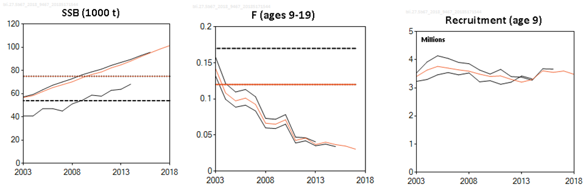

---
output:
  html_document:
    keep_md: true
    fig_height: 1
    fig_width: 1
    toc: yes
    toc_depth: 1
    toc_float: yes
    css: style.css
---
<style>
#TOC {
  background:url("http://www.ices.dk/_layouts/15/1033/images/icesimg/iceslogo.png") ;
  background-size: contain;
  padding-top: 100px !important;
  background-repeat: no-repeat;
  position: fixed;
  font-size: 12px;
  left: 0;
  top: 0;
  width: 200px;
  height: 80%;
  overflow:auto;
}
</style>

# ICES advice 2018

## *bli.27.5b67*

## Blue ling (*Molva dypterygia*) in subareas 6–7 and Division 5.b (Celtic Seas, English Channel, and Faroes grounds)

Published 7 June 2018

```{r setup, include=FALSE}
knitr::opts_chunk$set(
	echo = FALSE,
	message = FALSE,
	warning = FALSE
)
#<a href="#top">Back to top</a>
```

***
```{r  out.width = "50%"}
knitr::include_graphics("images/bli.png")
knitr::include_graphics("images/blimap.png")
```


[Go to latest advice](http://ices.dk/sites/pub/Publication%20Reports/Advice/2018/2018/bli-5b67.pdf)  
[Go to Stock Information Database](http://sd.ices.dk/ViewStock.aspx?key=1592)   
[Go to Standard Graphs page](http://standardgraphs.ices.dk/ViewCharts.aspx?key=9467)  
[Go to Transparent Assessment Framework page](https://github.com/ices-taf/2016_cod-347d)

***

# ICES advice on fishing opportunities
ICES advises that when the MSY approach is applied, catches should be no more than **11 778** tonnes in 2019 and no more than **11 150** tonnes in 2020.
 <br> 

***

# Stock development over time
The spawning-stock biomass (SSB) has increased since 2004 and has been above MSY Btrigger since 2010. Fishing mortality has decreased since 2002 and has been lower than FMSY since 2004. Recruitment is estimated to be stable.

<div class= "col2"
.col2 {
    columns: 2 220px;         /* number of columns and width in pixels*/
    -webkit-columns: 2 220px; /* chrome, safari */
    -moz-columns: 2 220px;    /* firefox */
  }>
```{r sag1, echo=FALSE, fig.height=3.5, fig.width=3.5}

 library(htmlwidgets)
 library(dplyr)
 library(ggplot2)
 library(dygraphs)
 library(htmltools)
 library(widgetframe)
library(icesSAG)

SAGsummary <- getSAG("bli.27.5b67", 2018, data = "summary", combine = TRUE, purpose = "Advice")
SAGrefpts <-getSAG("bli.27.5b67", 2018, data = "refpts", combine = TRUE, purpose = "Advice")
data <- cbind(SAGsummary, SAGrefpts)
data <- subset(data,select = -fishstock)
 dyBarChart <- function(dygraph) {
  dyPlotter(dygraph = dygraph,
            name = "BarChart",
            path = system.file("examples/plotters/barchart.js",
                               package = "dygraphs"))
}

 catches <- data %>% select(Year, catches)
 catches$catches <- catches[, "catches"]/1000
 recruitment<- data %>% select(Year, low_recruitment, recruitment, high_recruitment)
 recruitment <- recruitment[complete.cases(recruitment),]
 dygraph(catches, main = "Catches")%>%
   dyRangeSelector()%>%
   dyOptions(colors = RColorBrewer::brewer.pal(3, "Set2"), drawGrid = FALSE,maxNumberWidth = 4)%>%
   dyAxis("y")%>%
   dyBarChart()
 
 dygraph(recruitment, main = "Recruitment(age 9)") %>%
   dyRangeSelector()%>%
   # dyOptions(colors = RColorBrewer::brewer.pal(3, "Set2"))%>%
   dyAxis("y")%>%
   dyBarChart()

 
```
</div>
<div class="col2">
```{r sag3, echo = FALSE, fig.height = 3.5, fig.width = 3.5}
library(dygraphs)
library(htmlwidgets)
library(dplyr)
library(ggplot2)
library(gridExtra)
library(dygraphs)

dyBarChart <- function(dygraph) {
  dyPlotter(dygraph = dygraph,
            name = "BarChart",
            path = system.file("examples/plotters/barchart.js",
                               package = "dygraphs"))
} 

F <- data %>% select(Year, low_F, F,high_F, FLim, Fpa, FMSY )
F <- F[complete.cases(F),]
 dygraph(F, main = "F") %>%
  dySeries(c("low_F", "F", "high_F"))%>%
   dyLimit(as.numeric(F[, 5]), color = "red")%>%
   dyRangeSelector()%>%
   dyOptions(colors = RColorBrewer::brewer.pal(3, "Set2"),
             drawGrid= FALSE,maxNumberWidth = 4)%>%
   dyAxis("y")
SSB <- data %>% select(Year, low_SSB, SSB,high_SSB, Blim, Bpa, MSYBtrigger)
SSB <- SSB[complete.cases(SSB),]
 dygraph(SSB, main = "SSB") %>%
  dySeries(c("low_SSB", "SSB", "high_SSB"))%>%
   dyLimit(as.numeric(F[, 5]), color = "red")%>%
   dyRangeSelector()%>%
   dyOptions(colors = RColorBrewer::brewer.pal(3, "Set2"),
             drawGrid= FALSE,maxNumberWidth = 4)%>%
   dyAxis("y")
 
```
</div>


**Figure 1**  Summary of stock assessment (weights in thousand tonnes and recruitment in millions) of blue ling in subareas 6–7 and Division 5.b. Assumed recruitment values are unshaded.
<br>

***

## Summary of the assessment

Blue ling in subareas 6–7 and Division 5.b. Assessment summary. Weights are in tonnes. Highs and lows are 95% confidence intervals
<br>
<button class="btn btn-primary" data-toggle="collapse" data-target="#BlockName1"> Show/Download Table </button>  
<div id="BlockName1" class="collapse"> 
<br>
```{r download4}
library(magrittr)
 readLines("SAGsummary.csv") %>% 
   paste0(collapse="\n") %>% 
   openssl::base64_encode() -> encoded
```

[Download CSV](`r sprintf('data:text/csv;base64,%s', encoded)`)

```{r summarysag, echo=FALSE}
library(kableExtra)
write.csv(SAGsummary, file = "SAGsummary.csv")
kable(SAGsummary, "html")%>% 
  row_spec(0, bold = T, color = "black", background = "lightgrey", align = "c")%>%
        kable_styling(position = "center")%>%
  scroll_box(width = "100%", height = "400px")

```

</div>
<br> 
[Go to Top](#top)

***

# Stock and explotation status

ICES assesses that fishing pressure on the stock is below FMSY and spawning stock size is above MSY Btrigger.

<br>
**Table 1** State of the stock and fishery relative to reference points for blue ling in subareas 6–7 and Division 5.b.


***  

# Catch scenarios

<br>
**Table 2** Assumptions made for the interim year and in the forecast. Blue ling in subareas 6–7 and Division 5.b.
<br>
```{r catchoptionsbasis, echo=FALSE}
library(knitr)
library(readr)
library(kableExtra)
dt <- read.csv("Data/bli/blicatchoptionsbasis.csv",header = T, row.names = 1)
# dt <- dt [,-1] 
kable(dt, "html")%>% 
  row_spec(0, bold = T, color = "black", background = "lightgrey", align = "c")%>%
  # column_spec(1, width = "20em")%>%
  # column_spec(4, width = "45em")%>%
  # column_spec(3, width = "15em")%>%
  kable_styling(position = "center")

```

<br>

***

**Table 3a** Annual catch scenarios for 2019 for blue ling in subareas 6–7 and Division 5.b. All weights are in tonnes.
<br>
<button class="btn btn-primary" data-toggle="collapse" data-target="#BlockName2"> Show/Download Table </button>  
<div id="BlockName2" class="collapse"> 
<br>
```{r download}
library(magrittr)
 readLines("Data/bli/blicatchoptions.csv") %>% 
   paste0(collapse="\n") %>% 
   openssl::base64_encode() -> encoded
```

[Download CSV](`r sprintf('data:text/csv;base64,%s', encoded)`)

```{r catchoptionstable, echo=FALSE}
library(knitr)
library(readr)
library(kableExtra)
dt <- read.csv("Data/bli/blicatchoptions.csv", header = T, row.names = 1)
# dt <- dt [,-1]
dt <- dt[complete.cases(dt),]
 kable(dt, "html") %>% kable_styling(position = "center")%>%
   row_spec(0, bold = T, color = "black", background = "lightgrey")%>%
   column_spec(1, width = "30em")%>%
         column_spec(2:7, width = "10em")%>%
   group_rows("ICES advice basis",1,1) %>%
   group_rows("Other scenarios",2,8)
```
\* SSB is estimated from first of January and does not depend on fishing in the same year.

\** SSB in 2020 in relation to SSB in 2019.

\*** Catches (EU+ Faroes waters) in 2019 in relation to EU TAC in 2018.

\^ Advice value 2019 relative to advice value 2018.

<br>

</div>

<br>

**Table 3b** Annual catch scenarios for 2020 with F2019 = FMSY for blue ling in subareas 6–7 and Division 5.b. All weights are in tonnes.
<br>
<button class="btn btn-primary" data-toggle="collapse" data-target="#BlockName3"> Show/Download Table </button>  
<div id="BlockName3" class="collapse"> 
<br>
```{r download2}
library(magrittr)
 readLines("Data/bli/blicatchoptions2.csv") %>% 
   paste0(collapse="\n") %>% 
   openssl::base64_encode() -> encoded
```

[Download CSV](`r sprintf('data:text/csv;base64,%s', encoded)`)

```{r catchoptionstable2, echo=FALSE}
library(knitr)
library(readr)
library(kableExtra)
dt <- read.csv("Data/bli/blicatchoptions2.csv", header = T, row.names = 1)
# dt <- dt [,-1]
# dt <- dt[complete.cases(dt),]
 kable(dt, "html") %>% kable_styling(position = "center")%>%
   row_spec(0, bold = T, color = "black", background = "lightgrey")%>%
   column_spec(1, width = "30em")%>%
         column_spec(2:6, width = "10em")%>%
   group_rows("ICES advice basis",1,1) %>%
   group_rows("Other scenarios",2,8)
```
\* SSB is estimated from first of January and does not depend on fishing in the same year.

\** SSB in 2021 in relation to SSB in 2020 (98 331 t assuming FMSY in 2019).

\*** Not provided: TAC 2019 not predicted because of the imbroglio between advised catch (for EU and Faroese waters) and EU TAC.

\^ Advice value 2020 relative to advice value 2019.

\^^ F driving the stock down to Bpa, Blim, and MSY Btrigger in 2021 when applied in 2020.

<br>

</div>

<br>

**Table 3c** Annual catch scenarios for 2020 with F2019 = Fsq = F2017 for blue ling in subareas 6–7 and Division 5.b. All weights are in tonnes.
<br>
<button class="btn btn-primary" data-toggle="collapse" data-target="#BlockName4"> Show/Download Table </button>  
<div id="BlockName4" class="collapse"> 
<br>
```{r download3}
library(magrittr)
 readLines("Data/bli/blicatchoptions3.csv") %>% 
   paste0(collapse="\n") %>% 
   openssl::base64_encode() -> encoded
```

[Download CSV](`r sprintf('data:text/csv;base64,%s', encoded)`)

```{r catchoptionstable3, echo=FALSE}
library(knitr)
library(readr)
library(kableExtra)
dt <- read.csv("Data/bli/blicatchoptions3.csv", header = T, row.names = 1)
# dt <- dt [,-1]
# dt <- dt[complete.cases(dt),]
 kable(dt, "html") %>% kable_styling(position = "center")%>%
   row_spec(0, bold = T, color = "black", background = "lightgrey")%>%
   column_spec(1, width = "30em")%>%
         column_spec(2:6, width = "10em")%>%
   group_rows("ICES advice basis",1,1) %>%
   group_rows("Other scenarios",2,8)
```
\* SSB is estimated from first of January and does not depend on fishing in the same year.

\** SSB in 2021 in relation to SSB in 2020 (106 559 t assuming Fsq in 2019).

\*** Not provided: TAC 2019 not predicted because of the imbroglio between the advised catch (for EU and Faroese waters) and the EU TAC.

\^ Advice value 2020 relative to advice value 2019.

\^^ F driving the stock down to Bpa, Blim, and MSY Btrigger in 2021 when applied in 2020.

<br>

</div>

<br>
The advised catch in 2019 is higher than the advice for 2018 because of an increase in biomass. However, between 2019 and
2020 the biomass declines, resulting in a decrease in advised catches.

<br>

***

## Catch scenarios plot for 2019

The following plot resumes Fishing mortality scenarios (see Table 3) and the related estimates of Catch and next years' Spawning Stock Biomass. Vertical and horizontal dashed lines show the available reference points (see also Reference Points section). 
In the hover text appearing in each point is indicated the value in tonnes (of Cath or of SSB) and the scenario represented. At the same time, in the horizontal axis will show up the corresponding F value.
<br>

**A. Annual catch scenarios for 2019 and for 2020 with F2019 = FMSY**

```{r catchoptionsgraphv2, echo = FALSE,fig.height = 4.5, fig.width = 10}
library(ggplot2)
library(plotly)
catchoptions <- read.csv("Data/bli/bliscenariosplotALL.csv")
 labels <- catchoptions$Basis
 labels <- as.character(labels)
 mypalette<-ggthemes::tableau_color_pal('tableau20')
 
 data <- catchoptions[order(catchoptions$F),] 
 data$my_text=paste(data$Type , data$Basis, sep=": ")
 
 p1 <- plot_ly(data, x = ~F) %>%
         layout(hovermode="TRUE", showlegend = TRUE,
           shapes = list(
             list(type = "line", fillcolor = "red", 
               line    = list(color = "red",
               width = 3,
               dash = "dash"),
               opacity = 0.5,
               x0      = 0.17,
               x1      = 0.17,
               xref    = "Flim",
               y0      = 0,
               y1      = 112000,
               yref    = "y",
               name = "Flim"),
             list(type = "line", fillcolor = "green", 
               line    = list(color = "green",
               width = 3,
               dash = "dash"), 
               opacity = 0.5, 
               x0      = 0.12,
               x1      = 0.12,
               xref    = "Fmsy",
               y0      = 0,
               y1      = 112000,
               yref    = "y",
               name = "Fmsy"),
             list(type = "line", fillcolor = "orange", 
               line    = list(color = "orange",
               width = 3,
               dash = "dash"), 
               opacity = 0.5, 
               x0      = 0.12,
               x1      = 0.12,
               xref    = "Fpa",
               y0      = 0,
               y1      = 112000,
               yref    = "y",
               name = "Fpa"),
             list(type = "line", fillcolor = "red", 
               line    = list(color = "red",
               width = 3,
               dash = "dash"), 
               opacity = 0.5, 
               x0      = 0,
               x1      = 0.83,
               xref    = "x",
               y0      = 54000,
               y1      = 54000,
               yref    = "Blim",
               name = "Blim"),
             list(type = "line", fillcolor = "green", 
               line    = list(color = "green",
               width = 3,
               dash = "dash"), 
               opacity = 0.5, 
               x0      = 0,
               x1      = 0.83,
               xref    = "x",
               y0      = 75037,
               y1      = 75037,
               yref    = "Bpa = MSY Btrigger",
               text = "Bpa = MSY Btrigger",
               textposition = "bottom right")),
           yaxis= list(title = 'Tonnes', showgrid =FALSE),
    xaxis=list(title = 'Fishing mortality scenarios', showgrid= FALSE, tickmode = "array",tickvals = c(0.12,0.17), ticktext = c("Fmsy = Fpa", "Flim")),
    annotations=
        list(
            x= 0.86,
            y=c(54000,75037),
            xref= '1',
            yref='y',
            text=c('Blim            ','Bpa = MSY Btrigger'),
            showarrow = FALSE,
            ax= 70,
            ay= 0
        ) 
    )%>%
         add_trace(y = ~ SSB_2020, name= 'SSB 2020', mode = 'lines+markers',connectgaps = TRUE,text = data$my_text, hoverinfo = "text + x+ y") %>%
        add_trace(y = ~ Catch2019, name = 'Catch 2019', mode = 'lines+markers',connectgaps = TRUE,text = data$my_text, hoverinfo = "text + x+ y")%>%
 add_trace(y = ~ SSB_2021_Option1, name= 'SSB 2021 A', mode = 'lines+markers',connectgaps = TRUE,text = data$my_text, hoverinfo = "text + x+ y") %>%
        add_trace(y = ~ Catch2020_Option1, name = 'Catch 2020 A', mode = 'lines+markers',connectgaps = TRUE,text = data$my_text, hoverinfo = "text + x+ y")
 # %>%
 # add_trace(y = ~ SSB_2021_Option2, name= 'SSB 2021 B', mode = 'lines+markers',connectgaps = TRUE,text = data$my_text, hoverinfo = "text + x+ y") %>%
 #        add_trace(y = ~ Catch2020_Option2, name = 'Catch 2020 B', mode = 'lines+markers',connectgaps = TRUE,text = data$my_text, hoverinfo = "text + x+ y")
                  
  p1

```

**B. Annual catch scenarios for 2019 and for 2020 with F2019 = Fsq = F2017**

```{r catchoptionsgraphv2B, echo = FALSE, fig.height = 4.5, fig.width = 10}
library(ggplot2)
library(plotly)
catchoptions <- read.csv("Data/bli/bliscenariosplotALL.csv")
 labels <- catchoptions$Basis
 labels <- as.character(labels)
 mypalette<-ggthemes::tableau_color_pal('tableau20')
 
 data <- catchoptions[order(catchoptions$F),] 
 data$my_text=paste(data$Type , data$Basis, sep=": ")
 
 p1 <- plot_ly(data, x = ~F) %>%
         layout(hovermode="TRUE", showlegend = TRUE,
           shapes = list(
             list(type = "line", fillcolor = "red", 
               line    = list(color = "red",
               width = 3,
               dash = "dash"),
               opacity = 0.5,
               x0      = 0.17,
               x1      = 0.17,
               xref    = "Flim",
               y0      = 0,
               y1      = 112000,
               yref    = "y",
               name = "Flim"),
             list(type = "line", fillcolor = "green", 
               line    = list(color = "green",
               width = 3,
               dash = "dash"), 
               opacity = 0.5, 
               x0      = 0.12,
               x1      = 0.12,
               xref    = "Fmsy",
               y0      = 0,
               y1      = 112000,
               yref    = "y",
               name = "Fmsy"),
             list(type = "line", fillcolor = "orange", 
               line    = list(color = "orange",
               width = 3,
               dash = "dash"), 
               opacity = 0.5, 
               x0      = 0.12,
               x1      = 0.12,
               xref    = "Fpa",
               y0      = 0,
               y1      = 112000,
               yref    = "y",
               name = "Fpa"),
             list(type = "line", fillcolor = "red", 
               line    = list(color = "red",
               width = 3,
               dash = "dash"), 
               opacity = 0.5, 
               x0      = 0,
               x1      = 0.83,
               xref    = "x",
               y0      = 54000,
               y1      = 54000,
               yref    = "Blim",
               name = "Blim"),
             list(type = "line", fillcolor = "green", 
               line    = list(color = "green",
               width = 3,
               dash = "dash"), 
               opacity = 0.5, 
               x0      = 0,
               x1      = 0.83,
               xref    = "x",
               y0      = 75037,
               y1      = 75037,
               yref    = "Bpa = MSY Btrigger",
               text = "Bpa = MSY Btrigger",
               textposition = "bottom right")),
           yaxis= list(title = 'Tonnes', showgrid =FALSE),
    xaxis=list(title = 'Fishing mortality scenarios', showgrid= FALSE, tickmode = "array",tickvals = c(0.12,0.17), ticktext = c("Fmsy = Fpa", "Flim")),
    annotations=
        list(
            x= 0.86,
            y=c(54000,75037),
            xref= '1',
            yref='y',
            text=c('Blim            ','Bpa = MSY Btrigger'),
            showarrow = FALSE,
            ax= 70,
            ay= 0
        ) 
    )%>%
         add_trace(y = ~ SSB_2020, name= 'SSB 2020', mode = 'lines+markers',connectgaps = TRUE,text = data$my_text, hoverinfo = "text + x+ y") %>%
        add_trace(y = ~ Catch2019, name = 'Catch 2019', mode = 'lines+markers',connectgaps = TRUE,text = data$my_text, hoverinfo = "text + x+ y")%>%
 # add_trace(y = ~ SSB_2021_Option1, name= 'SSB 2021 A', mode = 'lines+markers',connectgaps = TRUE,text = data$my_text, hoverinfo = "text + x+ y") %>%
 #        add_trace(y = ~ Catch2020_Option1, name = 'Catch 2020 A', mode = 'lines+markers',connectgaps = TRUE,text = data$my_text, hoverinfo = "text + x+ y")
 # %>%
 add_trace(y = ~ SSB_2021_Option2, name= 'SSB 2021 B', mode = 'lines+markers',connectgaps = TRUE,text = data$my_text, hoverinfo = "text + x+ y") %>%
        add_trace(y = ~ Catch2020_Option2, name = 'Catch 2020 B', mode = 'lines+markers',connectgaps = TRUE,text = data$my_text, hoverinfo = "text + x+ y")
                  
  p1

```
 
<br>

[Go to Top](#top)

***

# Basis of the advice  

<br>
**Table 4**  The basis of the advice for blue ling in subareas 6–7 and Division 5.b.
```{r advicebasis, echo=FALSE}
library(knitr)
library(readr)
library(kableExtra)
dt <- read.csv("Data/bli/bliadvicebasis.csv", header = FALSE)
#dt <- dt [-1,] 
colnames(dt) <- NULL
kable(dt, "html")%>%kable_styling(position = "center")%>%
  column_spec(1, bold = T, color = "black", background = "lightgrey")

```

<br>

***

# Quality of the assessment  


```{r qualplots}

```

**Figure 2**  Historical plots for blue ling in subareas 6–7 and Division 5.b.
<br>

***

# Issues relevant for the advice

In EU waters, catches lower than the TACs in 2015–2017 are considered to reflect a low level of fishing activity. The capacity of fleets has been decreasing and protection of spawning areas restricts catch opportunities at times where blue ling has a higher catchability.

Although ICES advice applies to all catches from the stock, in both EU and Faroese waters, the EU TAC has been set at the level of ICES advice since 2014. A management plan or a share of fishing opportunities between EU and Faroe Islands should be developed for the entire stock.

Because F in recent years has been much lower than the FMSY, the projections assume that the F in 2018 is equal to Fsq = F2017 for all catch scenarios. Catch advice is provided for two years: 2019 and 2020. As the future F level is unknown, catch scenarios for 2020 were simulated under two options in 2019: F2019 = FMSY and F2019 = Fsq = F2017; these two scenarios are presented in tables 3b and 3c, respectively.

***

# Reference Points  
<br>
**Table 5** Reference points, values, and their technical basis. Blue ling in subareas 6–7 and Division 5.b.
<br>
<button class="btn btn-primary" data-toggle="collapse" data-target="#BlockName5"> Show/Download Table </button>  
<div id="BlockName5" class="collapse"> 
<br>
```{r referencepoints, echo=FALSE}
library(knitr)
library(readr)
library(kableExtra)
dt <- read.csv("Data/bli/blireferencepoints.csv")
dt <- dt [,-1] 
kable(dt, "html")%>%kable_styling(position = "center")%>%
  row_spec(0, bold = T, color = "black", background = "lightgrey")

```

```{r download5}
library(magrittr)
 readLines("Data/bli/blireferencepoints.csv") %>% 
   paste0(collapse="\n") %>% 
   openssl::base64_encode() -> encoded
```
<br>
[Download CSV](`r sprintf('data:text/csv;base64,%s', encoded)`)
</div>

***
# Basis of the assessment  

<br>
**Table 6** Basis of the assessment and advice for blue ling in subareas 6–7 and Division 5.b.
```{r advicebla, echo=FALSE}
library(knitr)
library(readr)
library(kableExtra)
dt <- read.csv("Data/bli/bliassessmentbasis.csv")
dt <- dt [,-1] 
colnames(dt) <- NULL
kable(dt, "html")%>%kable_styling(position = "center")%>%
  column_spec(1, width = "15em",bold = T, color = "black", background = "lightgrey")

```

```{r download6}
library(magrittr)
 readLines("Data/bli/bliassessmentbasis.csv") %>% 
   paste0(collapse="\n") %>% 
   openssl::base64_encode() -> encoded
```
[Download CSV](`r sprintf('data:text/csv;base64,%s', encoded)`)

[Go to Top](#top)

***
# Information from stakeholders  

There is no additional information available.
<br>

***
# History of the advice, catch, and management   

**Table 7**  ICES advice and catch for blue ling in subareas 6–7 and Division 5.b. All weights are in tonnes. 
<br>
<button class="btn btn-primary" data-toggle="collapse" data-target="#BlockName6"> Show/Download Table </button>  
<div id="BlockName6" class="collapse"> 
<br>
```{r downloadhistory}
library(magrittr)
 readLines("Data/bli/blicatchhistory.csv") %>% 
   paste0(collapse="\n") %>% 
   openssl::base64_encode() -> encoded
```
[Download CSV](`r sprintf('data:text/csv;base64,%s', encoded)`) 
```{r history, echo=FALSE }
library(icesSAG)
library(kableExtra)
dt <- read.csv("Data/bli/blicatchhistory.csv")
# dt <- dt [,-1] 
# colnames(dt) <- c("Year", "ICES advice", "Pred. Catch", "Pred. landings","TAC", "ICES landings", "Discards", "ICES catch")
kable(dt, "html")%>% 
  column_spec(2, width = "20em")%>%
        kable_styling(position = "center")%>%
        row_spec(0, bold = T, color = "black", background = "lightgrey")%>%
  scroll_box(width = "100%", height = "400px")
```
\* 1987–2003 incl. Gulf of Riga herring.

\** TAC for subdivisions 22–29S and 32.

\*** TAC for subdivisions 25–28(2), 29, and 32.

\^ EU TAC for subdivisions 25–28(2), 29, and 32.

\^^ TAC is calculated as EU (subdivisions 25–28(2), 29, and 32) + Russian autonomous quotas.


<br>
</div>

***

# History of the catch and landings  

**Table 8** Official catch distribution by fleet in 2017 for blue ling in subareas 6–7 and Division 5.b.
<br>
```{r catchlandings, echo = FALSE}
library(kableExtra)
dt <- read.csv("Data/bli/blilandhist.csv", header = TRUE)
# dt<-unname(dt)
# dt <- dt[,-7]
  kable(dt, "html")%>%kable_styling(position = "center")%>%
#          add_header_above(c( " " , "Catch" = 1, "Landings" = 4, "Discards" = 1))%>%
   row_spec(0, bold = T, color = "black", background = "lightgrey")
#          collapse_rows(columns = 1)
```

<br>

**Table 9** History of commercial catch as estimated by ICES for blue ling in subareas 6–7 and Division 5.b. All weights are in tonnes.
<br>
<button class="btn btn-primary" data-toggle="collapse" data-target="#BlockName7"> Show/Download Table </button>  
<div id="BlockName7" class="collapse"> 
<br>
```{r downloadlandhistorybis}
library(magrittr)
 readLines("Data/bli/blilandings.csv") %>% 
   paste0(collapse="\n") %>% 
   openssl::base64_encode() -> encoded
```

[Download CSV](`r sprintf('data:text/csv;base64,%s', encoded)`) 

```{r table9, echo=FALSE }
library(icesSAG)
library(kableExtra)
dt <- read.csv("Data/bli/blilandings.csv", header = TRUE)
# dt <- dt [,-1] 
# colnames(dt) <- c("Year", "ICES advice", "Pred. Catch", "Pred. landings","TAC", "ICES landings", "Discards", "ICES catch")
kable(dt, "html")%>% 
        kable_styling(position = "center")%>%
        row_spec(0, bold = T, color = "black", background = "lightgrey")%>%
  scroll_box(width = "100%", height = "400px")
```
\* Preliminary

<br>
</div>
<br>

**Table 10** Landings inside and outside the NEAFC Regulatory Area (RA) as estimated by
ICES as well as official landings for blue ling in subareas 6–7 and Division 5.b.Weights are in tonnes.
<br>
<button class="btn btn-primary" data-toggle="collapse" data-target="#BlockName8"> Show/Download Table </button>  
<div id="BlockName8" class="collapse"> 
<br>
```{r table10, echo=FALSE }
library(icesSAG)
library(kableExtra)
dt <- read.csv("Data/bli/blitable10.csv", header = TRUE)
# dt <- dt [,-1] 
# colnames(dt) <- c("Year", "ICES advice", "Pred. Catch", "Pred. landings","TAC", "ICES landings", "Discards", "ICES catch")
kable(dt, "html")%>% 
        kable_styling(position = "center")%>%
        row_spec(0, bold = T, color = "black", background = "lightgrey")
```
\* Preliminary

```{r downloadtable10}
library(magrittr)
 readLines("Data/bli/blitable10.csv") %>% 
   paste0(collapse="\n") %>% 
   openssl::base64_encode() -> encoded
```

[Download CSV](`r sprintf('data:text/csv;base64,%s', encoded)`) 
<br>
</div>
***

# Sources and references  

* ICES. 2014. Report of the Benchmark Workshop on Deep-sea Stocks (WKDEEP), 3–7 February 2014, Copenhagen, Denmark.
* ICES CM 2014/ACOM:44. 247 pp.
* ICES. 2016. Advice basis. In Report of the ICES Advisory Committee, 2016. ICES Advice 2016, Book 1, Section 1.2.
* ICES. 2016b. Report of the Working Group on the Biology and Assessment of Deep-Sea Fisheries Resources (WGDEEP), 20–27
April 2016, ICES Headquarters, Copenhagen. ICES CM 2016/ACOM:18. 648 pp.
* ICES. 2018. Report of the Working Group on the Biology and Assessment of Deep-sea Fisheries Resources (WGDEEP), 11–18
April 2018, ICES HQ, Copenhagen, Denmark. ICES CM 2018/ACOM:14. 624 pp.