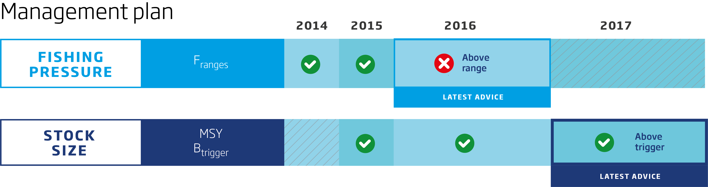

---
output:
  html_document:
    keep_md: true
    fig_height: 1
    fig_width: 1
    toc: yes
    toc_depth: 1
    toc_float: yes
    css: style.css
---

# ICES advice 2018

## *her.27.25-2932*

## Herring (*Clupea harengus*) in subdivisions 25–29 and 32, excluding the Gulf of Riga (central Baltic Sea)

Published 31 May 2018

***

[See PDF version of advice sheet](http://www.ices.dk/sites/pub/Publication%20Reports/Advice/2018/2018/her.27.25-2932.pdf)  
[More information about this stock](http://sd.ices.dk/ViewStock.aspx?key=1662)   
[Detailed data and graphs for this stock assessment](http://standardgraphs.ices.dk/ViewCharts.aspx?key=9428)  
[Go to Transparent Assessment Framework page](https://github.com/ices-taf/2016_cod-347d)  
[See this stock in the ICES Spatial facility](http://gis.ices.dk/sf/index.html?widget=visa&assessmentKey=9428)

***

# ICES advice on fishing opportunities
ICES advises that when the EU multiannual plan (MAP) is applied, catches in 2019 that correspond to the F ranges in the plan are between **115 591** tonnes and **192 787** tonnes. According to the MAP, catches higher than those corresponding to FMSY (155 333 tonnes) can only be taken under conditions specified in the MAP, whilst the entire range is considered precautionary when applying the ICES advice rule. This advice applies to all catches from the stock, including those taken in Subdivision 28.1.
   

***

# Stock development over time
Spawning-stock biomass (SSB) decreased until 2001 and then increased, and it has been above MSY Btrigger since 2007. Fishing mortality (F) increased until 2000 and then decreased, remaining below FMSY between 2004 to 2014. F has been above FMSY since 2015. Recruitment in 2015 is estimated to be the highest of the whole time-series.

<table style="table-layout: fixed;width: 100%;">
<tr>
<td>
<!--html_preserve-->

<!--/html_preserve-->
</td>
<td>

<!--html_preserve-->

<!--/html_preserve-->
</td>
</tr>

<tr>
<td>
<!--html_preserve-->

<!--/html_preserve-->
</td>
<td>
<!--html_preserve-->

<!--/html_preserve-->
</td>
</tr>
</table>

**Figure 1** Summary of the stock assessment. (SSB in 2018 is
predicted). Herring in subdivisions 25–29 and 32, excluding the Gulf of Riga.
 

***

## Summary of the assessment

 Assessment summary for herring in subdivisions 25–29 and 32, excluding the Gulf of Riga. Weights are in tonnes.
Recruitment in thousands.
 
<button class="btn btn-primary" data-toggle="collapse" data-target="#BlockName1"> Show/Download Table </button>  

 
 

[Download CSV](data:text/csv;base64,IiIsIlllYXIiLCJyZWNydWl0bWVudCIsImhpZ2hfcmVjcnVpdG1lbnQiLCJsb3dfcmVjcnVpdG1lbnQiLCJsb3dfU1NCIiwiU1NCIiwiaGlnaF9TU0IiLCJjYXRjaGVzIiwibGFuZGluZ3MiLCJkaXNjYXJkcyIsImxvd19GIiwiRiIsImhpZ2hfRiIsIlN0b2NrUHVibGlzaE5vdGUiLCJQdXJwb3NlIiwiRmFnZSIsImZpc2hzdG9jayIsInJlY3J1aXRtZW50X2FnZSIsIkFzc2Vzc21lbnRZZWFyIiwidW5pdHMiLCJzdG9ja1NpemVEZXNjcmlwdGlvbiIsInN0b2NrU2l6ZVVuaXRzIiwiZmlzaGluZ1ByZXNzdXJlRGVzY3JpcHRpb24iLCJmaXNoaW5nUHJlc3N1cmVVbml0cyIKIjEiLDE5ODEsTkEsTkEsTkEsTkEsTkEsTkEsMjg2MSwyODYxLE5BLE5BLE5BLE5BLCJTdG9jayBwdWJsaXNoZWQiLCJBZHZpY2UiLE5BLCJuZXAuZnUuMTEiLE5BLDIwMTgsInRvbm5lcyIsIlVXIFRWIGluZGV4IiwiaW5kaXZpZHVhbHMiLCJIYXJ2ZXN0IHJhdGUiLCJQZXJjZW50IgoiMiIsMTk4MixOQSxOQSxOQSxOQSxOQSxOQSwyNzk5LDI3OTksTkEsTkEsTkEsTkEsIlN0b2NrIHB1Ymxpc2hlZCIsIkFkdmljZSIsTkEsIm5lcC5mdS4xMSIsTkEsMjAxOCwidG9ubmVzIiwiVVcgVFYgaW5kZXgiLCJpbmRpdmlkdWFscyIsIkhhcnZlc3QgcmF0ZSIsIlBlcmNlbnQiCiIzIiwxOTgzLE5BLE5BLE5BLE5BLE5BLE5BLDMxOTcsMzE5NyxOQSxOQSxOQSxOQSwiU3RvY2sgcHVibGlzaGVkIiwiQWR2aWNlIixOQSwibmVwLmZ1LjExIixOQSwyMDE4LCJ0b25uZXMiLCJVVyBUViBpbmRleCIsImluZGl2aWR1YWxzIiwiSGFydmVzdCByYXRlIiwiUGVyY2VudCIKIjQiLDE5ODQsTkEsTkEsTkEsTkEsTkEsTkEsNDE0Myw0MTQzLE5BLE5BLE5BLE5BLCJTdG9jayBwdWJsaXNoZWQiLCJBZHZpY2UiLE5BLCJuZXAuZnUuMTEiLE5BLDIwMTgsInRvbm5lcyIsIlVXIFRWIGluZGV4IiwiaW5kaXZpZHVhbHMiLCJIYXJ2ZXN0IHJhdGUiLCJQZXJjZW50IgoiNSIsMTk4NSxOQSxOQSxOQSxOQSxOQSxOQSw0MDYwLDQwNjAsTkEsTkEsTkEsTkEsIlN0b2NrIHB1Ymxpc2hlZCIsIkFkdmljZSIsTkEsIm5lcC5mdS4xMSIsTkEsMjAxOCwidG9ubmVzIiwiVVcgVFYgaW5kZXgiLCJpbmRpdmlkdWFscyIsIkhhcnZlc3QgcmF0ZSIsIlBlcmNlbnQiCiI2IiwxOTg2LE5BLE5BLE5BLE5BLE5BLE5BLDMzODEsMzM4MSxOQSxOQSxOQSxOQSwiU3RvY2sgcHVibGlzaGVkIiwiQWR2aWNlIixOQSwibmVwLmZ1LjExIixOQSwyMDE4LCJ0b25uZXMiLCJVVyBUViBpbmRleCIsImluZGl2aWR1YWxzIiwiSGFydmVzdCByYXRlIiwiUGVyY2VudCIKIjciLDE5ODcsTkEsTkEsTkEsTkEsTkEsTkEsNDA4NCw0MDg0LE5BLE5BLE5BLE5BLCJTdG9jayBwdWJsaXNoZWQiLCJBZHZpY2UiLE5BLCJuZXAuZnUuMTEiLE5BLDIwMTgsInRvbm5lcyIsIlVXIFRWIGluZGV4IiwiaW5kaXZpZHVhbHMiLCJIYXJ2ZXN0IHJhdGUiLCJQZXJjZW50IgoiOCIsMTk4OCxOQSxOQSxOQSxOQSxOQSxOQSw0MDM1LDQwMzUsTkEsTkEsTkEsTkEsIlN0b2NrIHB1Ymxpc2hlZCIsIkFkdmljZSIsTkEsIm5lcC5mdS4xMSIsTkEsMjAxOCwidG9ubmVzIiwiVVcgVFYgaW5kZXgiLCJpbmRpdmlkdWFscyIsIkhhcnZlc3QgcmF0ZSIsIlBlcmNlbnQiCiI5IiwxOTg5LE5BLE5BLE5BLE5BLE5BLE5BLDMyMDUsMzIwNSxOQSxOQSxOQSxOQSwiU3RvY2sgcHVibGlzaGVkIiwiQWR2aWNlIixOQSwibmVwLmZ1LjExIixOQSwyMDE4LCJ0b25uZXMiLCJVVyBUViBpbmRleCIsImluZGl2aWR1YWxzIiwiSGFydmVzdCByYXRlIiwiUGVyY2VudCIKIjEwIiwxOTkwLE5BLE5BLE5BLE5BLE5BLE5BLDI3NDUsMjU0NiwxOTksTkEsTkEsTkEsIlN0b2NrIHB1Ymxpc2hlZCIsIkFkdmljZSIsTkEsIm5lcC5mdS4xMSIsTkEsMjAxOCwidG9ubmVzIiwiVVcgVFYgaW5kZXgiLCJpbmRpdmlkdWFscyIsIkhhcnZlc3QgcmF0ZSIsIlBlcmNlbnQiCiIxMSIsMTk5MSxOQSxOQSxOQSxOQSxOQSxOQSwzMjM0LDI3OTMsNDQxLE5BLE5BLE5BLCJTdG9jayBwdWJsaXNoZWQiLCJBZHZpY2UiLE5BLCJuZXAuZnUuMTEiLE5BLDIwMTgsInRvbm5lcyIsIlVXIFRWIGluZGV4IiwiaW5kaXZpZHVhbHMiLCJIYXJ2ZXN0IHJhdGUiLCJQZXJjZW50IgoiMTIiLDE5OTIsTkEsTkEsTkEsTkEsTkEsTkEsMzkxMiwzNTU5LDM1MyxOQSxOQSxOQSwiU3RvY2sgcHVibGlzaGVkIiwiQWR2aWNlIixOQSwibmVwLmZ1LjExIixOQSwyMDE4LCJ0b25uZXMiLCJVVyBUViBpbmRleCIsImluZGl2aWR1YWxzIiwiSGFydmVzdCByYXRlIiwiUGVyY2VudCIKIjEzIiwxOTkzLE5BLE5BLE5BLE5BLE5BLE5BLDMyMjIsMzE5MywyOSxOQSxOQSxOQSwiU3RvY2sgcHVibGlzaGVkIiwiQWR2aWNlIixOQSwibmVwLmZ1LjExIixOQSwyMDE4LCJ0b25uZXMiLCJVVyBUViBpbmRleCIsImluZGl2aWR1YWxzIiwiSGFydmVzdCByYXRlIiwiUGVyY2VudCIKIjE0IiwxOTk0LE5BLE5BLE5BLDY5OCw4MjAsOTQyLDUyNTEsMzYxNCwxNjM3LE5BLDMxLjUsTkEsIlN0b2NrIHB1Ymxpc2hlZCIsIkFkdmljZSIsTkEsIm5lcC5mdS4xMSIsTkEsMjAxOCwidG9ubmVzIiwiVVcgVFYgaW5kZXgiLCJpbmRpdmlkdWFscyIsIkhhcnZlc3QgcmF0ZSIsIlBlcmNlbnQiCiIxNSIsMTk5NSxOQSxOQSxOQSxOQSxOQSxOQSw0NTExLDM2NTUsODU2LE5BLE5BLE5BLCJTdG9jayBwdWJsaXNoZWQiLCJBZHZpY2UiLE5BLCJuZXAuZnUuMTEiLE5BLDIwMTgsInRvbm5lcyIsIlVXIFRWIGluZGV4IiwiaW5kaXZpZHVhbHMiLCJIYXJ2ZXN0IHJhdGUiLCJQZXJjZW50IgoiMTYiLDE5OTYsTkEsTkEsTkEsNDY1LDU0MSw2MTcsMzE5NSwyODcyLDMyMyxOQSwyMy41LE5BLCJTdG9jayBwdWJsaXNoZWQiLCJBZHZpY2UiLE5BLCJuZXAuZnUuMTEiLE5BLDIwMTgsInRvbm5lcyIsIlVXIFRWIGluZGV4IiwiaW5kaXZpZHVhbHMiLCJIYXJ2ZXN0IHJhdGUiLCJQZXJjZW50IgoiMTciLDE5OTcsTkEsTkEsTkEsTkEsTkEsTkEsMzMzMiwzMDQ2LDI4NixOQSxOQSxOQSwiU3RvY2sgcHVibGlzaGVkIiwiQWR2aWNlIixOQSwibmVwLmZ1LjExIixOQSwyMDE4LCJ0b25uZXMiLCJVVyBUViBpbmRleCIsImluZGl2aWR1YWxzIiwiSGFydmVzdCByYXRlIiwiUGVyY2VudCIKIjE4IiwxOTk4LE5BLE5BLE5BLDc3MSw4OTgsMTAyNSwyNTA4LDI0NDEsNjcsTkEsMTIuMixOQSwiU3RvY2sgcHVibGlzaGVkIiwiQWR2aWNlIixOQSwibmVwLmZ1LjExIixOQSwyMDE4LCJ0b25uZXMiLCJVVyBUViBpbmRleCIsImluZGl2aWR1YWxzIiwiSGFydmVzdCByYXRlIiwiUGVyY2VudCIKIjE5IiwxOTk5LE5BLE5BLE5BLDY0Nyw3OTQsOTQxLDM1MzAsMzI1NywyNzMsTkEsMjAuNyxOQSwiU3RvY2sgcHVibGlzaGVkIiwiQWR2aWNlIixOQSwibmVwLmZ1LjExIixOQSwyMDE4LCJ0b25uZXMiLCJVVyBUViBpbmRleCIsImluZGl2aWR1YWxzIiwiSGFydmVzdCByYXRlIiwiUGVyY2VudCIKIjIwIiwyMDAwLE5BLE5BLE5BLDEwMzIsMTE2NiwxMzAwLDMzNDcsMzI0NywxMDAsTkEsMTIuMSxOQSwiU3RvY2sgcHVibGlzaGVkIiwiQWR2aWNlIixOQSwibmVwLmZ1LjExIixOQSwyMDE4LCJ0b25uZXMiLCJVVyBUViBpbmRleCIsImluZGl2aWR1YWxzIiwiSGFydmVzdCByYXRlIiwiUGVyY2VudCIKIjIxIiwyMDAxLE5BLE5BLE5BLDk1OSwxMDkyLDEyMjUsMzQxOSwzMjU5LDE2MCxOQSwxMyxOQSwiU3RvY2sgcHVibGlzaGVkIiwiQWR2aWNlIixOQSwibmVwLmZ1LjExIixOQSwyMDE4LCJ0b25uZXMiLCJVVyBUViBpbmRleCIsImluZGl2aWR1YWxzIiwiSGFydmVzdCByYXRlIiwiUGVyY2VudCIKIjIyIiwyMDAyLE5BLE5BLE5BLDExODgsMTMzNywxNDg2LDM3MTcsMzQ0MCwyNzcsTkEsMTEuNSxOQSwiU3RvY2sgcHVibGlzaGVkIiwiQWR2aWNlIixOQSwibmVwLmZ1LjExIixOQSwyMDE4LCJ0b25uZXMiLCJVVyBUViBpbmRleCIsImluZGl2aWR1YWxzIiwiSGFydmVzdCByYXRlIiwiUGVyY2VudCIKIjIzIiwyMDAzLE5BLE5BLE5BLDE1NDAsMTc1MSwxOTYyLDM1NjgsMzI2OSwyOTksTkEsOC41LE5BLCJTdG9jayBwdWJsaXNoZWQiLCJBZHZpY2UiLE5BLCJuZXAuZnUuMTEiLE5BLDIwMTgsInRvbm5lcyIsIlVXIFRWIGluZGV4IiwiaW5kaXZpZHVhbHMiLCJIYXJ2ZXN0IHJhdGUiLCJQZXJjZW50IgoiMjQiLDIwMDQsTkEsTkEsTkEsMTU3NiwxNzUxLDE5MjYsMzI4NCwzMDgyLDIwMixOQSw3LjgsTkEsIlN0b2NrIHB1Ymxpc2hlZCIsIkFkdmljZSIsTkEsIm5lcC5mdS4xMSIsTkEsMjAxOCwidG9ubmVzIiwiVVcgVFYgaW5kZXgiLCJpbmRpdmlkdWFscyIsIkhhcnZlc3QgcmF0ZSIsIlBlcmNlbnQiCiIyNSIsMjAwNSxOQSxOQSxOQSwxMzc2LDE1NDAsMTcwNCwzNDU2LDI5NDksNTA3LE5BLDkuNCxOQSwiU3RvY2sgcHVibGlzaGVkIiwiQWR2aWNlIixOQSwibmVwLmZ1LjExIixOQSwyMDE4LCJ0b25uZXMiLCJVVyBUViBpbmRleCIsImluZGl2aWR1YWxzIiwiSGFydmVzdCByYXRlIiwiUGVyY2VudCIKIjI2IiwyMDA2LE5BLE5BLE5BLDE1OTcsMTc2MiwxOTI3LDQ5MjMsNDE2Niw3NTcsTkEsMTIuOCxOQSwiU3RvY2sgcHVibGlzaGVkIiwiQWR2aWNlIixOQSwibmVwLmZ1LjExIixOQSwyMDE4LCJ0b25uZXMiLCJVVyBUViBpbmRleCIsImluZGl2aWR1YWxzIiwiSGFydmVzdCByYXRlIiwiUGVyY2VudCIKIjI3IiwyMDA3LE5BLE5BLE5BLDEwNTYsMTIwNiwxMzU2LDQxOTIsMzk3OCwyMTQsTkEsMTQuNyxOQSwiU3RvY2sgcHVibGlzaGVkIiwiQWR2aWNlIixOQSwibmVwLmZ1LjExIixOQSwyMDE4LCJ0b25uZXMiLCJVVyBUViBpbmRleCIsImluZGl2aWR1YWxzIiwiSGFydmVzdCByYXRlIiwiUGVyY2VudCIKIjI4IiwyMDA4LE5BLE5BLE5BLDg5MCwxMDQ3LDEyMDQsMzk5MywzNzk5LDE5NCxOQSwxNi41LE5BLCJTdG9jayBwdWJsaXNoZWQiLCJBZHZpY2UiLE5BLCJuZXAuZnUuMTEiLE5BLDIwMTgsInRvbm5lcyIsIlVXIFRWIGluZGV4IiwiaW5kaXZpZHVhbHMiLCJIYXJ2ZXN0IHJhdGUiLCJQZXJjZW50IgoiMjkiLDIwMDksTkEsTkEsTkEsOTY4LDExOTUsMTQyMiwzODIzLDM0OTYsMzI3LE5BLDEzLjcsTkEsIlN0b2NrIHB1Ymxpc2hlZCIsIkFkdmljZSIsTkEsIm5lcC5mdS4xMSIsTkEsMjAxOCwidG9ubmVzIiwiVVcgVFYgaW5kZXgiLCJpbmRpdmlkdWFscyIsIkhhcnZlc3QgcmF0ZSIsIlBlcmNlbnQiCiIzMCIsMjAxMCxOQSxOQSxOQSwxMDYyLDEyOTMsMTUyNCwyNTQxLDI0MTMsMTI4LE5BLDcsTkEsIlN0b2NrIHB1Ymxpc2hlZCIsIkFkdmljZSIsTkEsIm5lcC5mdS4xMSIsTkEsMjAxOCwidG9ubmVzIiwiVVcgVFYgaW5kZXgiLCJpbmRpdmlkdWFscyIsIkhhcnZlc3QgcmF0ZSIsIlBlcmNlbnQiCiIzMSIsMjAxMSxOQSxOQSxOQSwxNTAwLDE3MjYsMTk1MiwyODUxLDI2OTcsMTU0LE5BLDYuMyxOQSwiU3RvY2sgcHVibGlzaGVkIiwiQWR2aWNlIixOQSwibmVwLmZ1LjExIixOQSwyMDE4LCJ0b25uZXMiLCJVVyBUViBpbmRleCIsImluZGl2aWR1YWxzIiwiSGFydmVzdCByYXRlIiwiUGVyY2VudCIKIjMyIiwyMDEyLE5BLE5BLE5BLDcxMCw4OTEsMTA3MiwzNzU1LDM1NDIsMjEzLE5BLDE4LjcsTkEsIlN0b2NrIHB1Ymxpc2hlZCIsIkFkdmljZSIsTkEsIm5lcC5mdS4xMSIsTkEsMjAxOCwidG9ubmVzIiwiVVcgVFYgaW5kZXgiLCJpbmRpdmlkdWFscyIsIkhhcnZlc3QgcmF0ZSIsIlBlcmNlbnQiCiIzMyIsMjAxMyxOQSxOQSxOQSwxMTk3LDE0MDMsMTYwOSwzNzc3LDM0MTMsMzY0LE5BLDEwLE5BLCJTdG9jayBwdWJsaXNoZWQiLCJBZHZpY2UiLE5BLCJuZXAuZnUuMTEiLE5BLDIwMTgsInRvbm5lcyIsIlVXIFRWIGluZGV4IiwiaW5kaXZpZHVhbHMiLCJIYXJ2ZXN0IHJhdGUiLCJQZXJjZW50IgoiMzQiLDIwMTQsTkEsTkEsTkEsMTA4MCwxMjUxLDE0MjIsMzMzNCwzMjU3LDc3LE5BLDkuNixOQSwiU3RvY2sgcHVibGlzaGVkIiwiQWR2aWNlIixOQSwibmVwLmZ1LjExIixOQSwyMDE4LCJ0b25uZXMiLCJVVyBUViBpbmRleCIsImluZGl2aWR1YWxzIiwiSGFydmVzdCByYXRlIiwiUGVyY2VudCIKIjM1IiwyMDE1LE5BLE5BLE5BLDEwNzUsMTQ0NSwxODE1LDMxNDUsMzAwMiwxNDMsTkEsNy45LE5BLCJTdG9jayBwdWJsaXNoZWQiLCJBZHZpY2UiLE5BLCJuZXAuZnUuMTEiLE5BLDIwMTgsInRvbm5lcyIsIlVXIFRWIGluZGV4IiwiaW5kaXZpZHVhbHMiLCJIYXJ2ZXN0IHJhdGUiLCJQZXJjZW50IgoiMzYiLDIwMTYsTkEsTkEsTkEsMTEzMiwxNDIyLDE3MTIsMzc5NSwzNTI5LDI2NixOQSwxMC43LE5BLCJTdG9jayBwdWJsaXNoZWQiLCJBZHZpY2UiLE5BLCJuZXAuZnUuMTEiLE5BLDIwMTgsInRvbm5lcyIsIlVXIFRWIGluZGV4IiwiaW5kaXZpZHVhbHMiLCJIYXJ2ZXN0IHJhdGUiLCJQZXJjZW50IgoiMzciLDIwMTcsTkEsTkEsTkEsOTAxLDEwNTAsMTE5OSwyNTEyLDI0NDgsNjQsTkEsOS4zLE5BLCJTdG9jayBwdWJsaXNoZWQiLCJBZHZpY2UiLE5BLCJuZXAuZnUuMTEiLE5BLDIwMTgsInRvbm5lcyIsIlVXIFRWIGluZGV4IiwiaW5kaXZpZHVhbHMiLCJIYXJ2ZXN0IHJhdGUiLCJQZXJjZW50Ig==)

<table class="table" style="margin-left: auto; margin-right: auto;">
 <thead>
  <tr>
   <th style="text-align:right;font-weight: bold;color: black;background-color: lightgrey;text-align: center;"> Year </th>
   <th style="text-align:right;font-weight: bold;color: black;background-color: lightgrey;text-align: center;"> recruitment </th>
   <th style="text-align:right;font-weight: bold;color: black;background-color: lightgrey;text-align: center;"> high_recruitment </th>
   <th style="text-align:right;font-weight: bold;color: black;background-color: lightgrey;text-align: center;"> low_recruitment </th>
   <th style="text-align:right;font-weight: bold;color: black;background-color: lightgrey;text-align: center;"> low_SSB </th>
   <th style="text-align:right;font-weight: bold;color: black;background-color: lightgrey;text-align: center;"> SSB </th>
   <th style="text-align:right;font-weight: bold;color: black;background-color: lightgrey;text-align: center;"> high_SSB </th>
   <th style="text-align:right;font-weight: bold;color: black;background-color: lightgrey;text-align: center;"> catches </th>
   <th style="text-align:right;font-weight: bold;color: black;background-color: lightgrey;text-align: center;"> landings </th>
   <th style="text-align:right;font-weight: bold;color: black;background-color: lightgrey;text-align: center;"> discards </th>
   <th style="text-align:right;font-weight: bold;color: black;background-color: lightgrey;text-align: center;"> low_F </th>
   <th style="text-align:right;font-weight: bold;color: black;background-color: lightgrey;text-align: center;"> F </th>
   <th style="text-align:right;font-weight: bold;color: black;background-color: lightgrey;text-align: center;"> high_F </th>
   <th style="text-align:left;font-weight: bold;color: black;background-color: lightgrey;text-align: center;"> StockPublishNote </th>
   <th style="text-align:left;font-weight: bold;color: black;background-color: lightgrey;text-align: center;"> Purpose </th>
   <th style="text-align:left;font-weight: bold;color: black;background-color: lightgrey;text-align: center;"> Fage </th>
   <th style="text-align:left;font-weight: bold;color: black;background-color: lightgrey;text-align: center;"> fishstock </th>
   <th style="text-align:right;font-weight: bold;color: black;background-color: lightgrey;text-align: center;"> recruitment_age </th>
   <th style="text-align:right;font-weight: bold;color: black;background-color: lightgrey;text-align: center;"> AssessmentYear </th>
   <th style="text-align:left;font-weight: bold;color: black;background-color: lightgrey;text-align: center;"> units </th>
   <th style="text-align:left;font-weight: bold;color: black;background-color: lightgrey;text-align: center;"> stockSizeDescription </th>
   <th style="text-align:left;font-weight: bold;color: black;background-color: lightgrey;text-align: center;"> stockSizeUnits </th>
   <th style="text-align:left;font-weight: bold;color: black;background-color: lightgrey;text-align: center;"> fishingPressureDescription </th>
   <th style="text-align:left;font-weight: bold;color: black;background-color: lightgrey;text-align: center;"> fishingPressureUnits </th>
  </tr>
 </thead>
<tbody>
  <tr>
   <td style="text-align:right;"> 1974 </td>
   <td style="text-align:right;"> 18113439 </td>
   <td style="text-align:right;"> NA </td>
   <td style="text-align:right;"> NA </td>
   <td style="text-align:right;"> NA </td>
   <td style="text-align:right;"> 1683199 </td>
   <td style="text-align:right;"> NA </td>
   <td style="text-align:right;"> 368652 </td>
   <td style="text-align:right;"> 368652 </td>
   <td style="text-align:right;"> NA </td>
   <td style="text-align:right;"> NA </td>
   <td style="text-align:right;"> 0.185 </td>
   <td style="text-align:right;"> NA </td>
   <td style="text-align:left;"> Stock published </td>
   <td style="text-align:left;"> Advice </td>
   <td style="text-align:left;"> 3-6 </td>
   <td style="text-align:left;"> her.27.25-2932 </td>
   <td style="text-align:right;"> 1 </td>
   <td style="text-align:right;"> 2018 </td>
   <td style="text-align:left;"> tonnes </td>
   <td style="text-align:left;"> SSB </td>
   <td style="text-align:left;"> tonnes </td>
   <td style="text-align:left;"> F </td>
   <td style="text-align:left;"> Year-1 </td>
  </tr>
  <tr>
   <td style="text-align:right;"> 1975 </td>
   <td style="text-align:right;"> 13328497 </td>
   <td style="text-align:right;"> NA </td>
   <td style="text-align:right;"> NA </td>
   <td style="text-align:right;"> NA </td>
   <td style="text-align:right;"> 1577243 </td>
   <td style="text-align:right;"> NA </td>
   <td style="text-align:right;"> 354851 </td>
   <td style="text-align:right;"> 354851 </td>
   <td style="text-align:right;"> NA </td>
   <td style="text-align:right;"> NA </td>
   <td style="text-align:right;"> 0.200 </td>
   <td style="text-align:right;"> NA </td>
   <td style="text-align:left;"> Stock published </td>
   <td style="text-align:left;"> Advice </td>
   <td style="text-align:left;"> 3-6 </td>
   <td style="text-align:left;"> her.27.25-2932 </td>
   <td style="text-align:right;"> 1 </td>
   <td style="text-align:right;"> 2018 </td>
   <td style="text-align:left;"> tonnes </td>
   <td style="text-align:left;"> SSB </td>
   <td style="text-align:left;"> tonnes </td>
   <td style="text-align:left;"> F </td>
   <td style="text-align:left;"> Year-1 </td>
  </tr>
  <tr>
   <td style="text-align:right;"> 1976 </td>
   <td style="text-align:right;"> 26357070 </td>
   <td style="text-align:right;"> NA </td>
   <td style="text-align:right;"> NA </td>
   <td style="text-align:right;"> NA </td>
   <td style="text-align:right;"> 1368713 </td>
   <td style="text-align:right;"> NA </td>
   <td style="text-align:right;"> 305420 </td>
   <td style="text-align:right;"> 305420 </td>
   <td style="text-align:right;"> NA </td>
   <td style="text-align:right;"> NA </td>
   <td style="text-align:right;"> 0.193 </td>
   <td style="text-align:right;"> NA </td>
   <td style="text-align:left;"> Stock published </td>
   <td style="text-align:left;"> Advice </td>
   <td style="text-align:left;"> 3-6 </td>
   <td style="text-align:left;"> her.27.25-2932 </td>
   <td style="text-align:right;"> 1 </td>
   <td style="text-align:right;"> 2018 </td>
   <td style="text-align:left;"> tonnes </td>
   <td style="text-align:left;"> SSB </td>
   <td style="text-align:left;"> tonnes </td>
   <td style="text-align:left;"> F </td>
   <td style="text-align:left;"> Year-1 </td>
  </tr>
  <tr>
   <td style="text-align:right;"> 1977 </td>
   <td style="text-align:right;"> 13398355 </td>
   <td style="text-align:right;"> NA </td>
   <td style="text-align:right;"> NA </td>
   <td style="text-align:right;"> NA </td>
   <td style="text-align:right;"> 1521763 </td>
   <td style="text-align:right;"> NA </td>
   <td style="text-align:right;"> 301952 </td>
   <td style="text-align:right;"> 301952 </td>
   <td style="text-align:right;"> NA </td>
   <td style="text-align:right;"> NA </td>
   <td style="text-align:right;"> 0.189 </td>
   <td style="text-align:right;"> NA </td>
   <td style="text-align:left;"> Stock published </td>
   <td style="text-align:left;"> Advice </td>
   <td style="text-align:left;"> 3-6 </td>
   <td style="text-align:left;"> her.27.25-2932 </td>
   <td style="text-align:right;"> 1 </td>
   <td style="text-align:right;"> 2018 </td>
   <td style="text-align:left;"> tonnes </td>
   <td style="text-align:left;"> SSB </td>
   <td style="text-align:left;"> tonnes </td>
   <td style="text-align:left;"> F </td>
   <td style="text-align:left;"> Year-1 </td>
  </tr>
  <tr>
   <td style="text-align:right;"> 1978 </td>
   <td style="text-align:right;"> 15699258 </td>
   <td style="text-align:right;"> NA </td>
   <td style="text-align:right;"> NA </td>
   <td style="text-align:right;"> NA </td>
   <td style="text-align:right;"> 1441563 </td>
   <td style="text-align:right;"> NA </td>
   <td style="text-align:right;"> 278966 </td>
   <td style="text-align:right;"> 278966 </td>
   <td style="text-align:right;"> NA </td>
   <td style="text-align:right;"> NA </td>
   <td style="text-align:right;"> 0.164 </td>
   <td style="text-align:right;"> NA </td>
   <td style="text-align:left;"> Stock published </td>
   <td style="text-align:left;"> Advice </td>
   <td style="text-align:left;"> 3-6 </td>
   <td style="text-align:left;"> her.27.25-2932 </td>
   <td style="text-align:right;"> 1 </td>
   <td style="text-align:right;"> 2018 </td>
   <td style="text-align:left;"> tonnes </td>
   <td style="text-align:left;"> SSB </td>
   <td style="text-align:left;"> tonnes </td>
   <td style="text-align:left;"> F </td>
   <td style="text-align:left;"> Year-1 </td>
  </tr>
  <tr>
   <td style="text-align:right;"> 1979 </td>
   <td style="text-align:right;"> 12852771 </td>
   <td style="text-align:right;"> NA </td>
   <td style="text-align:right;"> NA </td>
   <td style="text-align:right;"> NA </td>
   <td style="text-align:right;"> 1409790 </td>
   <td style="text-align:right;"> NA </td>
   <td style="text-align:right;"> 278182 </td>
   <td style="text-align:right;"> 278182 </td>
   <td style="text-align:right;"> NA </td>
   <td style="text-align:right;"> NA </td>
   <td style="text-align:right;"> 0.195 </td>
   <td style="text-align:right;"> NA </td>
   <td style="text-align:left;"> Stock published </td>
   <td style="text-align:left;"> Advice </td>
   <td style="text-align:left;"> 3-6 </td>
   <td style="text-align:left;"> her.27.25-2932 </td>
   <td style="text-align:right;"> 1 </td>
   <td style="text-align:right;"> 2018 </td>
   <td style="text-align:left;"> tonnes </td>
   <td style="text-align:left;"> SSB </td>
   <td style="text-align:left;"> tonnes </td>
   <td style="text-align:left;"> F </td>
   <td style="text-align:left;"> Year-1 </td>
  </tr>
  <tr>
   <td style="text-align:right;"> 1980 </td>
   <td style="text-align:right;"> 18709550 </td>
   <td style="text-align:right;"> NA </td>
   <td style="text-align:right;"> NA </td>
   <td style="text-align:right;"> NA </td>
   <td style="text-align:right;"> 1358669 </td>
   <td style="text-align:right;"> NA </td>
   <td style="text-align:right;"> 270282 </td>
   <td style="text-align:right;"> 270282 </td>
   <td style="text-align:right;"> NA </td>
   <td style="text-align:right;"> NA </td>
   <td style="text-align:right;"> 0.187 </td>
   <td style="text-align:right;"> NA </td>
   <td style="text-align:left;"> Stock published </td>
   <td style="text-align:left;"> Advice </td>
   <td style="text-align:left;"> 3-6 </td>
   <td style="text-align:left;"> her.27.25-2932 </td>
   <td style="text-align:right;"> 1 </td>
   <td style="text-align:right;"> 2018 </td>
   <td style="text-align:left;"> tonnes </td>
   <td style="text-align:left;"> SSB </td>
   <td style="text-align:left;"> tonnes </td>
   <td style="text-align:left;"> F </td>
   <td style="text-align:left;"> Year-1 </td>
  </tr>
  <tr>
   <td style="text-align:right;"> 1981 </td>
   <td style="text-align:right;"> 31182196 </td>
   <td style="text-align:right;"> NA </td>
   <td style="text-align:right;"> NA </td>
   <td style="text-align:right;"> NA </td>
   <td style="text-align:right;"> 1288090 </td>
   <td style="text-align:right;"> NA </td>
   <td style="text-align:right;"> 293615 </td>
   <td style="text-align:right;"> 293615 </td>
   <td style="text-align:right;"> NA </td>
   <td style="text-align:right;"> NA </td>
   <td style="text-align:right;"> 0.203 </td>
   <td style="text-align:right;"> NA </td>
   <td style="text-align:left;"> Stock published </td>
   <td style="text-align:left;"> Advice </td>
   <td style="text-align:left;"> 3-6 </td>
   <td style="text-align:left;"> her.27.25-2932 </td>
   <td style="text-align:right;"> 1 </td>
   <td style="text-align:right;"> 2018 </td>
   <td style="text-align:left;"> tonnes </td>
   <td style="text-align:left;"> SSB </td>
   <td style="text-align:left;"> tonnes </td>
   <td style="text-align:left;"> F </td>
   <td style="text-align:left;"> Year-1 </td>
  </tr>
  <tr>
   <td style="text-align:right;"> 1982 </td>
   <td style="text-align:right;"> 29084783 </td>
   <td style="text-align:right;"> NA </td>
   <td style="text-align:right;"> NA </td>
   <td style="text-align:right;"> NA </td>
   <td style="text-align:right;"> 1433825 </td>
   <td style="text-align:right;"> NA </td>
   <td style="text-align:right;"> 273134 </td>
   <td style="text-align:right;"> 273134 </td>
   <td style="text-align:right;"> NA </td>
   <td style="text-align:right;"> NA </td>
   <td style="text-align:right;"> 0.174 </td>
   <td style="text-align:right;"> NA </td>
   <td style="text-align:left;"> Stock published </td>
   <td style="text-align:left;"> Advice </td>
   <td style="text-align:left;"> 3-6 </td>
   <td style="text-align:left;"> her.27.25-2932 </td>
   <td style="text-align:right;"> 1 </td>
   <td style="text-align:right;"> 2018 </td>
   <td style="text-align:left;"> tonnes </td>
   <td style="text-align:left;"> SSB </td>
   <td style="text-align:left;"> tonnes </td>
   <td style="text-align:left;"> F </td>
   <td style="text-align:left;"> Year-1 </td>
  </tr>
  <tr>
   <td style="text-align:right;"> 1983 </td>
   <td style="text-align:right;"> 22117019 </td>
   <td style="text-align:right;"> NA </td>
   <td style="text-align:right;"> NA </td>
   <td style="text-align:right;"> NA </td>
   <td style="text-align:right;"> 1407419 </td>
   <td style="text-align:right;"> NA </td>
   <td style="text-align:right;"> 307601 </td>
   <td style="text-align:right;"> 307601 </td>
   <td style="text-align:right;"> NA </td>
   <td style="text-align:right;"> NA </td>
   <td style="text-align:right;"> 0.224 </td>
   <td style="text-align:right;"> NA </td>
   <td style="text-align:left;"> Stock published </td>
   <td style="text-align:left;"> Advice </td>
   <td style="text-align:left;"> 3-6 </td>
   <td style="text-align:left;"> her.27.25-2932 </td>
   <td style="text-align:right;"> 1 </td>
   <td style="text-align:right;"> 2018 </td>
   <td style="text-align:left;"> tonnes </td>
   <td style="text-align:left;"> SSB </td>
   <td style="text-align:left;"> tonnes </td>
   <td style="text-align:left;"> F </td>
   <td style="text-align:left;"> Year-1 </td>
  </tr>
  <tr>
   <td style="text-align:right;"> 1984 </td>
   <td style="text-align:right;"> 29432137 </td>
   <td style="text-align:right;"> NA </td>
   <td style="text-align:right;"> NA </td>
   <td style="text-align:right;"> NA </td>
   <td style="text-align:right;"> 1320444 </td>
   <td style="text-align:right;"> NA </td>
   <td style="text-align:right;"> 277926 </td>
   <td style="text-align:right;"> 277926 </td>
   <td style="text-align:right;"> NA </td>
   <td style="text-align:right;"> NA </td>
   <td style="text-align:right;"> 0.224 </td>
   <td style="text-align:right;"> NA </td>
   <td style="text-align:left;"> Stock published </td>
   <td style="text-align:left;"> Advice </td>
   <td style="text-align:left;"> 3-6 </td>
   <td style="text-align:left;"> her.27.25-2932 </td>
   <td style="text-align:right;"> 1 </td>
   <td style="text-align:right;"> 2018 </td>
   <td style="text-align:left;"> tonnes </td>
   <td style="text-align:left;"> SSB </td>
   <td style="text-align:left;"> tonnes </td>
   <td style="text-align:left;"> F </td>
   <td style="text-align:left;"> Year-1 </td>
  </tr>
  <tr>
   <td style="text-align:right;"> 1985 </td>
   <td style="text-align:right;"> 22861666 </td>
   <td style="text-align:right;"> NA </td>
   <td style="text-align:right;"> NA </td>
   <td style="text-align:right;"> NA </td>
   <td style="text-align:right;"> 1269393 </td>
   <td style="text-align:right;"> NA </td>
   <td style="text-align:right;"> 275760 </td>
   <td style="text-align:right;"> 275760 </td>
   <td style="text-align:right;"> NA </td>
   <td style="text-align:right;"> NA </td>
   <td style="text-align:right;"> 0.230 </td>
   <td style="text-align:right;"> NA </td>
   <td style="text-align:left;"> Stock published </td>
   <td style="text-align:left;"> Advice </td>
   <td style="text-align:left;"> 3-6 </td>
   <td style="text-align:left;"> her.27.25-2932 </td>
   <td style="text-align:right;"> 1 </td>
   <td style="text-align:right;"> 2018 </td>
   <td style="text-align:left;"> tonnes </td>
   <td style="text-align:left;"> SSB </td>
   <td style="text-align:left;"> tonnes </td>
   <td style="text-align:left;"> F </td>
   <td style="text-align:left;"> Year-1 </td>
  </tr>
  <tr>
   <td style="text-align:right;"> 1986 </td>
   <td style="text-align:right;"> 11512725 </td>
   <td style="text-align:right;"> NA </td>
   <td style="text-align:right;"> NA </td>
   <td style="text-align:right;"> NA </td>
   <td style="text-align:right;"> 1204273 </td>
   <td style="text-align:right;"> NA </td>
   <td style="text-align:right;"> 240516 </td>
   <td style="text-align:right;"> 240516 </td>
   <td style="text-align:right;"> NA </td>
   <td style="text-align:right;"> NA </td>
   <td style="text-align:right;"> 0.202 </td>
   <td style="text-align:right;"> NA </td>
   <td style="text-align:left;"> Stock published </td>
   <td style="text-align:left;"> Advice </td>
   <td style="text-align:left;"> 3-6 </td>
   <td style="text-align:left;"> her.27.25-2932 </td>
   <td style="text-align:right;"> 1 </td>
   <td style="text-align:right;"> 2018 </td>
   <td style="text-align:left;"> tonnes </td>
   <td style="text-align:left;"> SSB </td>
   <td style="text-align:left;"> tonnes </td>
   <td style="text-align:left;"> F </td>
   <td style="text-align:left;"> Year-1 </td>
  </tr>
  <tr>
   <td style="text-align:right;"> 1987 </td>
   <td style="text-align:right;"> 20979742 </td>
   <td style="text-align:right;"> NA </td>
   <td style="text-align:right;"> NA </td>
   <td style="text-align:right;"> NA </td>
   <td style="text-align:right;"> 1148973 </td>
   <td style="text-align:right;"> NA </td>
   <td style="text-align:right;"> 248653 </td>
   <td style="text-align:right;"> 248653 </td>
   <td style="text-align:right;"> NA </td>
   <td style="text-align:right;"> NA </td>
   <td style="text-align:right;"> 0.231 </td>
   <td style="text-align:right;"> NA </td>
   <td style="text-align:left;"> Stock published </td>
   <td style="text-align:left;"> Advice </td>
   <td style="text-align:left;"> 3-6 </td>
   <td style="text-align:left;"> her.27.25-2932 </td>
   <td style="text-align:right;"> 1 </td>
   <td style="text-align:right;"> 2018 </td>
   <td style="text-align:left;"> tonnes </td>
   <td style="text-align:left;"> SSB </td>
   <td style="text-align:left;"> tonnes </td>
   <td style="text-align:left;"> F </td>
   <td style="text-align:left;"> Year-1 </td>
  </tr>
  <tr>
   <td style="text-align:right;"> 1988 </td>
   <td style="text-align:right;"> 9385674 </td>
   <td style="text-align:right;"> NA </td>
   <td style="text-align:right;"> NA </td>
   <td style="text-align:right;"> NA </td>
   <td style="text-align:right;"> 1152968 </td>
   <td style="text-align:right;"> NA </td>
   <td style="text-align:right;"> 255734 </td>
   <td style="text-align:right;"> 255734 </td>
   <td style="text-align:right;"> NA </td>
   <td style="text-align:right;"> NA </td>
   <td style="text-align:right;"> 0.219 </td>
   <td style="text-align:right;"> NA </td>
   <td style="text-align:left;"> Stock published </td>
   <td style="text-align:left;"> Advice </td>
   <td style="text-align:left;"> 3-6 </td>
   <td style="text-align:left;"> her.27.25-2932 </td>
   <td style="text-align:right;"> 1 </td>
   <td style="text-align:right;"> 2018 </td>
   <td style="text-align:left;"> tonnes </td>
   <td style="text-align:left;"> SSB </td>
   <td style="text-align:left;"> tonnes </td>
   <td style="text-align:left;"> F </td>
   <td style="text-align:left;"> Year-1 </td>
  </tr>
  <tr>
   <td style="text-align:right;"> 1989 </td>
   <td style="text-align:right;"> 14180038 </td>
   <td style="text-align:right;"> NA </td>
   <td style="text-align:right;"> NA </td>
   <td style="text-align:right;"> NA </td>
   <td style="text-align:right;"> 1015712 </td>
   <td style="text-align:right;"> NA </td>
   <td style="text-align:right;"> 275501 </td>
   <td style="text-align:right;"> 275501 </td>
   <td style="text-align:right;"> NA </td>
   <td style="text-align:right;"> NA </td>
   <td style="text-align:right;"> 0.290 </td>
   <td style="text-align:right;"> NA </td>
   <td style="text-align:left;"> Stock published </td>
   <td style="text-align:left;"> Advice </td>
   <td style="text-align:left;"> 3-6 </td>
   <td style="text-align:left;"> her.27.25-2932 </td>
   <td style="text-align:right;"> 1 </td>
   <td style="text-align:right;"> 2018 </td>
   <td style="text-align:left;"> tonnes </td>
   <td style="text-align:left;"> SSB </td>
   <td style="text-align:left;"> tonnes </td>
   <td style="text-align:left;"> F </td>
   <td style="text-align:left;"> Year-1 </td>
  </tr>
  <tr>
   <td style="text-align:right;"> 1990 </td>
   <td style="text-align:right;"> 18987100 </td>
   <td style="text-align:right;"> NA </td>
   <td style="text-align:right;"> NA </td>
   <td style="text-align:right;"> NA </td>
   <td style="text-align:right;"> 872894 </td>
   <td style="text-align:right;"> NA </td>
   <td style="text-align:right;"> 228572 </td>
   <td style="text-align:right;"> 228572 </td>
   <td style="text-align:right;"> NA </td>
   <td style="text-align:right;"> NA </td>
   <td style="text-align:right;"> 0.275 </td>
   <td style="text-align:right;"> NA </td>
   <td style="text-align:left;"> Stock published </td>
   <td style="text-align:left;"> Advice </td>
   <td style="text-align:left;"> 3-6 </td>
   <td style="text-align:left;"> her.27.25-2932 </td>
   <td style="text-align:right;"> 1 </td>
   <td style="text-align:right;"> 2018 </td>
   <td style="text-align:left;"> tonnes </td>
   <td style="text-align:left;"> SSB </td>
   <td style="text-align:left;"> tonnes </td>
   <td style="text-align:left;"> F </td>
   <td style="text-align:left;"> Year-1 </td>
  </tr>
  <tr>
   <td style="text-align:right;"> 1991 </td>
   <td style="text-align:right;"> 14566106 </td>
   <td style="text-align:right;"> NA </td>
   <td style="text-align:right;"> NA </td>
   <td style="text-align:right;"> NA </td>
   <td style="text-align:right;"> 785359 </td>
   <td style="text-align:right;"> NA </td>
   <td style="text-align:right;"> 197676 </td>
   <td style="text-align:right;"> 197676 </td>
   <td style="text-align:right;"> NA </td>
   <td style="text-align:right;"> NA </td>
   <td style="text-align:right;"> 0.284 </td>
   <td style="text-align:right;"> NA </td>
   <td style="text-align:left;"> Stock published </td>
   <td style="text-align:left;"> Advice </td>
   <td style="text-align:left;"> 3-6 </td>
   <td style="text-align:left;"> her.27.25-2932 </td>
   <td style="text-align:right;"> 1 </td>
   <td style="text-align:right;"> 2018 </td>
   <td style="text-align:left;"> tonnes </td>
   <td style="text-align:left;"> SSB </td>
   <td style="text-align:left;"> tonnes </td>
   <td style="text-align:left;"> F </td>
   <td style="text-align:left;"> Year-1 </td>
  </tr>
  <tr>
   <td style="text-align:right;"> 1992 </td>
   <td style="text-align:right;"> 17837719 </td>
   <td style="text-align:right;"> NA </td>
   <td style="text-align:right;"> NA </td>
   <td style="text-align:right;"> NA </td>
   <td style="text-align:right;"> 805439 </td>
   <td style="text-align:right;"> NA </td>
   <td style="text-align:right;"> 189781 </td>
   <td style="text-align:right;"> 189781 </td>
   <td style="text-align:right;"> NA </td>
   <td style="text-align:right;"> NA </td>
   <td style="text-align:right;"> 0.253 </td>
   <td style="text-align:right;"> NA </td>
   <td style="text-align:left;"> Stock published </td>
   <td style="text-align:left;"> Advice </td>
   <td style="text-align:left;"> 3-6 </td>
   <td style="text-align:left;"> her.27.25-2932 </td>
   <td style="text-align:right;"> 1 </td>
   <td style="text-align:right;"> 2018 </td>
   <td style="text-align:left;"> tonnes </td>
   <td style="text-align:left;"> SSB </td>
   <td style="text-align:left;"> tonnes </td>
   <td style="text-align:left;"> F </td>
   <td style="text-align:left;"> Year-1 </td>
  </tr>
  <tr>
   <td style="text-align:right;"> 1993 </td>
   <td style="text-align:right;"> 16412629 </td>
   <td style="text-align:right;"> NA </td>
   <td style="text-align:right;"> NA </td>
   <td style="text-align:right;"> NA </td>
   <td style="text-align:right;"> 757457 </td>
   <td style="text-align:right;"> NA </td>
   <td style="text-align:right;"> 209094 </td>
   <td style="text-align:right;"> 209094 </td>
   <td style="text-align:right;"> NA </td>
   <td style="text-align:right;"> NA </td>
   <td style="text-align:right;"> 0.286 </td>
   <td style="text-align:right;"> NA </td>
   <td style="text-align:left;"> Stock published </td>
   <td style="text-align:left;"> Advice </td>
   <td style="text-align:left;"> 3-6 </td>
   <td style="text-align:left;"> her.27.25-2932 </td>
   <td style="text-align:right;"> 1 </td>
   <td style="text-align:right;"> 2018 </td>
   <td style="text-align:left;"> tonnes </td>
   <td style="text-align:left;"> SSB </td>
   <td style="text-align:left;"> tonnes </td>
   <td style="text-align:left;"> F </td>
   <td style="text-align:left;"> Year-1 </td>
  </tr>
  <tr>
   <td style="text-align:right;"> 1994 </td>
   <td style="text-align:right;"> 14849303 </td>
   <td style="text-align:right;"> NA </td>
   <td style="text-align:right;"> NA </td>
   <td style="text-align:right;"> NA </td>
   <td style="text-align:right;"> 766079 </td>
   <td style="text-align:right;"> NA </td>
   <td style="text-align:right;"> 218260 </td>
   <td style="text-align:right;"> 218260 </td>
   <td style="text-align:right;"> NA </td>
   <td style="text-align:right;"> NA </td>
   <td style="text-align:right;"> 0.345 </td>
   <td style="text-align:right;"> NA </td>
   <td style="text-align:left;"> Stock published </td>
   <td style="text-align:left;"> Advice </td>
   <td style="text-align:left;"> 3-6 </td>
   <td style="text-align:left;"> her.27.25-2932 </td>
   <td style="text-align:right;"> 1 </td>
   <td style="text-align:right;"> 2018 </td>
   <td style="text-align:left;"> tonnes </td>
   <td style="text-align:left;"> SSB </td>
   <td style="text-align:left;"> tonnes </td>
   <td style="text-align:left;"> F </td>
   <td style="text-align:left;"> Year-1 </td>
  </tr>
  <tr>
   <td style="text-align:right;"> 1995 </td>
   <td style="text-align:right;"> 19786861 </td>
   <td style="text-align:right;"> NA </td>
   <td style="text-align:right;"> NA </td>
   <td style="text-align:right;"> NA </td>
   <td style="text-align:right;"> 663649 </td>
   <td style="text-align:right;"> NA </td>
   <td style="text-align:right;"> 188181 </td>
   <td style="text-align:right;"> 188181 </td>
   <td style="text-align:right;"> NA </td>
   <td style="text-align:right;"> NA </td>
   <td style="text-align:right;"> 0.323 </td>
   <td style="text-align:right;"> NA </td>
   <td style="text-align:left;"> Stock published </td>
   <td style="text-align:left;"> Advice </td>
   <td style="text-align:left;"> 3-6 </td>
   <td style="text-align:left;"> her.27.25-2932 </td>
   <td style="text-align:right;"> 1 </td>
   <td style="text-align:right;"> 2018 </td>
   <td style="text-align:left;"> tonnes </td>
   <td style="text-align:left;"> SSB </td>
   <td style="text-align:left;"> tonnes </td>
   <td style="text-align:left;"> F </td>
   <td style="text-align:left;"> Year-1 </td>
  </tr>
  <tr>
   <td style="text-align:right;"> 1996 </td>
   <td style="text-align:right;"> 16624113 </td>
   <td style="text-align:right;"> NA </td>
   <td style="text-align:right;"> NA </td>
   <td style="text-align:right;"> NA </td>
   <td style="text-align:right;"> 607555 </td>
   <td style="text-align:right;"> NA </td>
   <td style="text-align:right;"> 162578 </td>
   <td style="text-align:right;"> 162578 </td>
   <td style="text-align:right;"> NA </td>
   <td style="text-align:right;"> NA </td>
   <td style="text-align:right;"> 0.329 </td>
   <td style="text-align:right;"> NA </td>
   <td style="text-align:left;"> Stock published </td>
   <td style="text-align:left;"> Advice </td>
   <td style="text-align:left;"> 3-6 </td>
   <td style="text-align:left;"> her.27.25-2932 </td>
   <td style="text-align:right;"> 1 </td>
   <td style="text-align:right;"> 2018 </td>
   <td style="text-align:left;"> tonnes </td>
   <td style="text-align:left;"> SSB </td>
   <td style="text-align:left;"> tonnes </td>
   <td style="text-align:left;"> F </td>
   <td style="text-align:left;"> Year-1 </td>
  </tr>
  <tr>
   <td style="text-align:right;"> 1997 </td>
   <td style="text-align:right;"> 9806995 </td>
   <td style="text-align:right;"> NA </td>
   <td style="text-align:right;"> NA </td>
   <td style="text-align:right;"> NA </td>
   <td style="text-align:right;"> 568069 </td>
   <td style="text-align:right;"> NA </td>
   <td style="text-align:right;"> 160002 </td>
   <td style="text-align:right;"> 160002 </td>
   <td style="text-align:right;"> NA </td>
   <td style="text-align:right;"> NA </td>
   <td style="text-align:right;"> 0.361 </td>
   <td style="text-align:right;"> NA </td>
   <td style="text-align:left;"> Stock published </td>
   <td style="text-align:left;"> Advice </td>
   <td style="text-align:left;"> 3-6 </td>
   <td style="text-align:left;"> her.27.25-2932 </td>
   <td style="text-align:right;"> 1 </td>
   <td style="text-align:right;"> 2018 </td>
   <td style="text-align:left;"> tonnes </td>
   <td style="text-align:left;"> SSB </td>
   <td style="text-align:left;"> tonnes </td>
   <td style="text-align:left;"> F </td>
   <td style="text-align:left;"> Year-1 </td>
  </tr>
  <tr>
   <td style="text-align:right;"> 1998 </td>
   <td style="text-align:right;"> 15396681 </td>
   <td style="text-align:right;"> NA </td>
   <td style="text-align:right;"> NA </td>
   <td style="text-align:right;"> NA </td>
   <td style="text-align:right;"> 518262 </td>
   <td style="text-align:right;"> NA </td>
   <td style="text-align:right;"> 185780 </td>
   <td style="text-align:right;"> 185780 </td>
   <td style="text-align:right;"> NA </td>
   <td style="text-align:right;"> NA </td>
   <td style="text-align:right;"> 0.383 </td>
   <td style="text-align:right;"> NA </td>
   <td style="text-align:left;"> Stock published </td>
   <td style="text-align:left;"> Advice </td>
   <td style="text-align:left;"> 3-6 </td>
   <td style="text-align:left;"> her.27.25-2932 </td>
   <td style="text-align:right;"> 1 </td>
   <td style="text-align:right;"> 2018 </td>
   <td style="text-align:left;"> tonnes </td>
   <td style="text-align:left;"> SSB </td>
   <td style="text-align:left;"> tonnes </td>
   <td style="text-align:left;"> F </td>
   <td style="text-align:left;"> Year-1 </td>
  </tr>
  <tr>
   <td style="text-align:right;"> 1999 </td>
   <td style="text-align:right;"> 8423950 </td>
   <td style="text-align:right;"> NA </td>
   <td style="text-align:right;"> NA </td>
   <td style="text-align:right;"> NA </td>
   <td style="text-align:right;"> 438376 </td>
   <td style="text-align:right;"> NA </td>
   <td style="text-align:right;"> 145922 </td>
   <td style="text-align:right;"> 145922 </td>
   <td style="text-align:right;"> NA </td>
   <td style="text-align:right;"> NA </td>
   <td style="text-align:right;"> 0.329 </td>
   <td style="text-align:right;"> NA </td>
   <td style="text-align:left;"> Stock published </td>
   <td style="text-align:left;"> Advice </td>
   <td style="text-align:left;"> 3-6 </td>
   <td style="text-align:left;"> her.27.25-2932 </td>
   <td style="text-align:right;"> 1 </td>
   <td style="text-align:right;"> 2018 </td>
   <td style="text-align:left;"> tonnes </td>
   <td style="text-align:left;"> SSB </td>
   <td style="text-align:left;"> tonnes </td>
   <td style="text-align:left;"> F </td>
   <td style="text-align:left;"> Year-1 </td>
  </tr>
  <tr>
   <td style="text-align:right;"> 2000 </td>
   <td style="text-align:right;"> 15608640 </td>
   <td style="text-align:right;"> NA </td>
   <td style="text-align:right;"> NA </td>
   <td style="text-align:right;"> NA </td>
   <td style="text-align:right;"> 438584 </td>
   <td style="text-align:right;"> NA </td>
   <td style="text-align:right;"> 175646 </td>
   <td style="text-align:right;"> 175646 </td>
   <td style="text-align:right;"> NA </td>
   <td style="text-align:right;"> NA </td>
   <td style="text-align:right;"> 0.436 </td>
   <td style="text-align:right;"> NA </td>
   <td style="text-align:left;"> Stock published </td>
   <td style="text-align:left;"> Advice </td>
   <td style="text-align:left;"> 3-6 </td>
   <td style="text-align:left;"> her.27.25-2932 </td>
   <td style="text-align:right;"> 1 </td>
   <td style="text-align:right;"> 2018 </td>
   <td style="text-align:left;"> tonnes </td>
   <td style="text-align:left;"> SSB </td>
   <td style="text-align:left;"> tonnes </td>
   <td style="text-align:left;"> F </td>
   <td style="text-align:left;"> Year-1 </td>
  </tr>
  <tr>
   <td style="text-align:right;"> 2001 </td>
   <td style="text-align:right;"> 11115702 </td>
   <td style="text-align:right;"> NA </td>
   <td style="text-align:right;"> NA </td>
   <td style="text-align:right;"> NA </td>
   <td style="text-align:right;"> 402051 </td>
   <td style="text-align:right;"> NA </td>
   <td style="text-align:right;"> 148404 </td>
   <td style="text-align:right;"> 148404 </td>
   <td style="text-align:right;"> NA </td>
   <td style="text-align:right;"> NA </td>
   <td style="text-align:right;"> 0.368 </td>
   <td style="text-align:right;"> NA </td>
   <td style="text-align:left;"> Stock published </td>
   <td style="text-align:left;"> Advice </td>
   <td style="text-align:left;"> 3-6 </td>
   <td style="text-align:left;"> her.27.25-2932 </td>
   <td style="text-align:right;"> 1 </td>
   <td style="text-align:right;"> 2018 </td>
   <td style="text-align:left;"> tonnes </td>
   <td style="text-align:left;"> SSB </td>
   <td style="text-align:left;"> tonnes </td>
   <td style="text-align:left;"> F </td>
   <td style="text-align:left;"> Year-1 </td>
  </tr>
  <tr>
   <td style="text-align:right;"> 2002 </td>
   <td style="text-align:right;"> 10624693 </td>
   <td style="text-align:right;"> NA </td>
   <td style="text-align:right;"> NA </td>
   <td style="text-align:right;"> NA </td>
   <td style="text-align:right;"> 414221 </td>
   <td style="text-align:right;"> NA </td>
   <td style="text-align:right;"> 129222 </td>
   <td style="text-align:right;"> 129222 </td>
   <td style="text-align:right;"> NA </td>
   <td style="text-align:right;"> NA </td>
   <td style="text-align:right;"> 0.320 </td>
   <td style="text-align:right;"> NA </td>
   <td style="text-align:left;"> Stock published </td>
   <td style="text-align:left;"> Advice </td>
   <td style="text-align:left;"> 3-6 </td>
   <td style="text-align:left;"> her.27.25-2932 </td>
   <td style="text-align:right;"> 1 </td>
   <td style="text-align:right;"> 2018 </td>
   <td style="text-align:left;"> tonnes </td>
   <td style="text-align:left;"> SSB </td>
   <td style="text-align:left;"> tonnes </td>
   <td style="text-align:left;"> F </td>
   <td style="text-align:left;"> Year-1 </td>
  </tr>
  <tr>
   <td style="text-align:right;"> 2003 </td>
   <td style="text-align:right;"> 20989359 </td>
   <td style="text-align:right;"> NA </td>
   <td style="text-align:right;"> NA </td>
   <td style="text-align:right;"> NA </td>
   <td style="text-align:right;"> 474095 </td>
   <td style="text-align:right;"> NA </td>
   <td style="text-align:right;"> 113584 </td>
   <td style="text-align:right;"> 113584 </td>
   <td style="text-align:right;"> NA </td>
   <td style="text-align:right;"> NA </td>
   <td style="text-align:right;"> 0.248 </td>
   <td style="text-align:right;"> NA </td>
   <td style="text-align:left;"> Stock published </td>
   <td style="text-align:left;"> Advice </td>
   <td style="text-align:left;"> 3-6 </td>
   <td style="text-align:left;"> her.27.25-2932 </td>
   <td style="text-align:right;"> 1 </td>
   <td style="text-align:right;"> 2018 </td>
   <td style="text-align:left;"> tonnes </td>
   <td style="text-align:left;"> SSB </td>
   <td style="text-align:left;"> tonnes </td>
   <td style="text-align:left;"> F </td>
   <td style="text-align:left;"> Year-1 </td>
  </tr>
  <tr>
   <td style="text-align:right;"> 2004 </td>
   <td style="text-align:right;"> 13391691 </td>
   <td style="text-align:right;"> NA </td>
   <td style="text-align:right;"> NA </td>
   <td style="text-align:right;"> NA </td>
   <td style="text-align:right;"> 478235 </td>
   <td style="text-align:right;"> NA </td>
   <td style="text-align:right;"> 93006 </td>
   <td style="text-align:right;"> 93006 </td>
   <td style="text-align:right;"> NA </td>
   <td style="text-align:right;"> NA </td>
   <td style="text-align:right;"> 0.208 </td>
   <td style="text-align:right;"> NA </td>
   <td style="text-align:left;"> Stock published </td>
   <td style="text-align:left;"> Advice </td>
   <td style="text-align:left;"> 3-6 </td>
   <td style="text-align:left;"> her.27.25-2932 </td>
   <td style="text-align:right;"> 1 </td>
   <td style="text-align:right;"> 2018 </td>
   <td style="text-align:left;"> tonnes </td>
   <td style="text-align:left;"> SSB </td>
   <td style="text-align:left;"> tonnes </td>
   <td style="text-align:left;"> F </td>
   <td style="text-align:left;"> Year-1 </td>
  </tr>
  <tr>
   <td style="text-align:right;"> 2005 </td>
   <td style="text-align:right;"> 8899602 </td>
   <td style="text-align:right;"> NA </td>
   <td style="text-align:right;"> NA </td>
   <td style="text-align:right;"> NA </td>
   <td style="text-align:right;"> 538093 </td>
   <td style="text-align:right;"> NA </td>
   <td style="text-align:right;"> 91592 </td>
   <td style="text-align:right;"> 91592 </td>
   <td style="text-align:right;"> NA </td>
   <td style="text-align:right;"> NA </td>
   <td style="text-align:right;"> 0.189 </td>
   <td style="text-align:right;"> NA </td>
   <td style="text-align:left;"> Stock published </td>
   <td style="text-align:left;"> Advice </td>
   <td style="text-align:left;"> 3-6 </td>
   <td style="text-align:left;"> her.27.25-2932 </td>
   <td style="text-align:right;"> 1 </td>
   <td style="text-align:right;"> 2018 </td>
   <td style="text-align:left;"> tonnes </td>
   <td style="text-align:left;"> SSB </td>
   <td style="text-align:left;"> tonnes </td>
   <td style="text-align:left;"> F </td>
   <td style="text-align:left;"> Year-1 </td>
  </tr>
  <tr>
   <td style="text-align:right;"> 2006 </td>
   <td style="text-align:right;"> 15642078 </td>
   <td style="text-align:right;"> NA </td>
   <td style="text-align:right;"> NA </td>
   <td style="text-align:right;"> NA </td>
   <td style="text-align:right;"> 595604 </td>
   <td style="text-align:right;"> NA </td>
   <td style="text-align:right;"> 110372 </td>
   <td style="text-align:right;"> 110372 </td>
   <td style="text-align:right;"> NA </td>
   <td style="text-align:right;"> NA </td>
   <td style="text-align:right;"> 0.205 </td>
   <td style="text-align:right;"> NA </td>
   <td style="text-align:left;"> Stock published </td>
   <td style="text-align:left;"> Advice </td>
   <td style="text-align:left;"> 3-6 </td>
   <td style="text-align:left;"> her.27.25-2932 </td>
   <td style="text-align:right;"> 1 </td>
   <td style="text-align:right;"> 2018 </td>
   <td style="text-align:left;"> tonnes </td>
   <td style="text-align:left;"> SSB </td>
   <td style="text-align:left;"> tonnes </td>
   <td style="text-align:left;"> F </td>
   <td style="text-align:left;"> Year-1 </td>
  </tr>
  <tr>
   <td style="text-align:right;"> 2007 </td>
   <td style="text-align:right;"> 13579922 </td>
   <td style="text-align:right;"> NA </td>
   <td style="text-align:right;"> NA </td>
   <td style="text-align:right;"> NA </td>
   <td style="text-align:right;"> 625795 </td>
   <td style="text-align:right;"> NA </td>
   <td style="text-align:right;"> 116030 </td>
   <td style="text-align:right;"> 116030 </td>
   <td style="text-align:right;"> NA </td>
   <td style="text-align:right;"> NA </td>
   <td style="text-align:right;"> 0.207 </td>
   <td style="text-align:right;"> NA </td>
   <td style="text-align:left;"> Stock published </td>
   <td style="text-align:left;"> Advice </td>
   <td style="text-align:left;"> 3-6 </td>
   <td style="text-align:left;"> her.27.25-2932 </td>
   <td style="text-align:right;"> 1 </td>
   <td style="text-align:right;"> 2018 </td>
   <td style="text-align:left;"> tonnes </td>
   <td style="text-align:left;"> SSB </td>
   <td style="text-align:left;"> tonnes </td>
   <td style="text-align:left;"> F </td>
   <td style="text-align:left;"> Year-1 </td>
  </tr>
  <tr>
   <td style="text-align:right;"> 2008 </td>
   <td style="text-align:right;"> 26055248 </td>
   <td style="text-align:right;"> NA </td>
   <td style="text-align:right;"> NA </td>
   <td style="text-align:right;"> NA </td>
   <td style="text-align:right;"> 638154 </td>
   <td style="text-align:right;"> NA </td>
   <td style="text-align:right;"> 126155 </td>
   <td style="text-align:right;"> 126155 </td>
   <td style="text-align:right;"> NA </td>
   <td style="text-align:right;"> NA </td>
   <td style="text-align:right;"> 0.210 </td>
   <td style="text-align:right;"> NA </td>
   <td style="text-align:left;"> Stock published </td>
   <td style="text-align:left;"> Advice </td>
   <td style="text-align:left;"> 3-6 </td>
   <td style="text-align:left;"> her.27.25-2932 </td>
   <td style="text-align:right;"> 1 </td>
   <td style="text-align:right;"> 2018 </td>
   <td style="text-align:left;"> tonnes </td>
   <td style="text-align:left;"> SSB </td>
   <td style="text-align:left;"> tonnes </td>
   <td style="text-align:left;"> F </td>
   <td style="text-align:left;"> Year-1 </td>
  </tr>
  <tr>
   <td style="text-align:right;"> 2009 </td>
   <td style="text-align:right;"> 19420327 </td>
   <td style="text-align:right;"> NA </td>
   <td style="text-align:right;"> NA </td>
   <td style="text-align:right;"> NA </td>
   <td style="text-align:right;"> 731833 </td>
   <td style="text-align:right;"> NA </td>
   <td style="text-align:right;"> 134127 </td>
   <td style="text-align:right;"> 134127 </td>
   <td style="text-align:right;"> NA </td>
   <td style="text-align:right;"> NA </td>
   <td style="text-align:right;"> 0.187 </td>
   <td style="text-align:right;"> NA </td>
   <td style="text-align:left;"> Stock published </td>
   <td style="text-align:left;"> Advice </td>
   <td style="text-align:left;"> 3-6 </td>
   <td style="text-align:left;"> her.27.25-2932 </td>
   <td style="text-align:right;"> 1 </td>
   <td style="text-align:right;"> 2018 </td>
   <td style="text-align:left;"> tonnes </td>
   <td style="text-align:left;"> SSB </td>
   <td style="text-align:left;"> tonnes </td>
   <td style="text-align:left;"> F </td>
   <td style="text-align:left;"> Year-1 </td>
  </tr>
  <tr>
   <td style="text-align:right;"> 2010 </td>
   <td style="text-align:right;"> 14094909 </td>
   <td style="text-align:right;"> NA </td>
   <td style="text-align:right;"> NA </td>
   <td style="text-align:right;"> NA </td>
   <td style="text-align:right;"> 784462 </td>
   <td style="text-align:right;"> NA </td>
   <td style="text-align:right;"> 136706 </td>
   <td style="text-align:right;"> 136706 </td>
   <td style="text-align:right;"> NA </td>
   <td style="text-align:right;"> NA </td>
   <td style="text-align:right;"> 0.219 </td>
   <td style="text-align:right;"> NA </td>
   <td style="text-align:left;"> Stock published </td>
   <td style="text-align:left;"> Advice </td>
   <td style="text-align:left;"> 3-6 </td>
   <td style="text-align:left;"> her.27.25-2932 </td>
   <td style="text-align:right;"> 1 </td>
   <td style="text-align:right;"> 2018 </td>
   <td style="text-align:left;"> tonnes </td>
   <td style="text-align:left;"> SSB </td>
   <td style="text-align:left;"> tonnes </td>
   <td style="text-align:left;"> F </td>
   <td style="text-align:left;"> Year-1 </td>
  </tr>
  <tr>
   <td style="text-align:right;"> 2011 </td>
   <td style="text-align:right;"> 8414568 </td>
   <td style="text-align:right;"> NA </td>
   <td style="text-align:right;"> NA </td>
   <td style="text-align:right;"> NA </td>
   <td style="text-align:right;"> 773620 </td>
   <td style="text-align:right;"> NA </td>
   <td style="text-align:right;"> 116785 </td>
   <td style="text-align:right;"> 116785 </td>
   <td style="text-align:right;"> NA </td>
   <td style="text-align:right;"> NA </td>
   <td style="text-align:right;"> 0.170 </td>
   <td style="text-align:right;"> NA </td>
   <td style="text-align:left;"> Stock published </td>
   <td style="text-align:left;"> Advice </td>
   <td style="text-align:left;"> 3-6 </td>
   <td style="text-align:left;"> her.27.25-2932 </td>
   <td style="text-align:right;"> 1 </td>
   <td style="text-align:right;"> 2018 </td>
   <td style="text-align:left;"> tonnes </td>
   <td style="text-align:left;"> SSB </td>
   <td style="text-align:left;"> tonnes </td>
   <td style="text-align:left;"> F </td>
   <td style="text-align:left;"> Year-1 </td>
  </tr>
  <tr>
   <td style="text-align:right;"> 2012 </td>
   <td style="text-align:right;"> 16955522 </td>
   <td style="text-align:right;"> NA </td>
   <td style="text-align:right;"> NA </td>
   <td style="text-align:right;"> NA </td>
   <td style="text-align:right;"> 812923 </td>
   <td style="text-align:right;"> NA </td>
   <td style="text-align:right;"> 100893 </td>
   <td style="text-align:right;"> 100893 </td>
   <td style="text-align:right;"> NA </td>
   <td style="text-align:right;"> NA </td>
   <td style="text-align:right;"> 0.124 </td>
   <td style="text-align:right;"> NA </td>
   <td style="text-align:left;"> Stock published </td>
   <td style="text-align:left;"> Advice </td>
   <td style="text-align:left;"> 3-6 </td>
   <td style="text-align:left;"> her.27.25-2932 </td>
   <td style="text-align:right;"> 1 </td>
   <td style="text-align:right;"> 2018 </td>
   <td style="text-align:left;"> tonnes </td>
   <td style="text-align:left;"> SSB </td>
   <td style="text-align:left;"> tonnes </td>
   <td style="text-align:left;"> F </td>
   <td style="text-align:left;"> Year-1 </td>
  </tr>
  <tr>
   <td style="text-align:right;"> 2013 </td>
   <td style="text-align:right;"> 17582712 </td>
   <td style="text-align:right;"> NA </td>
   <td style="text-align:right;"> NA </td>
   <td style="text-align:right;"> NA </td>
   <td style="text-align:right;"> 836820 </td>
   <td style="text-align:right;"> NA </td>
   <td style="text-align:right;"> 100954 </td>
   <td style="text-align:right;"> 100954 </td>
   <td style="text-align:right;"> NA </td>
   <td style="text-align:right;"> NA </td>
   <td style="text-align:right;"> 0.112 </td>
   <td style="text-align:right;"> NA </td>
   <td style="text-align:left;"> Stock published </td>
   <td style="text-align:left;"> Advice </td>
   <td style="text-align:left;"> 3-6 </td>
   <td style="text-align:left;"> her.27.25-2932 </td>
   <td style="text-align:right;"> 1 </td>
   <td style="text-align:right;"> 2018 </td>
   <td style="text-align:left;"> tonnes </td>
   <td style="text-align:left;"> SSB </td>
   <td style="text-align:left;"> tonnes </td>
   <td style="text-align:left;"> F </td>
   <td style="text-align:left;"> Year-1 </td>
  </tr>
  <tr>
   <td style="text-align:right;"> 2014 </td>
   <td style="text-align:right;"> 13247366 </td>
   <td style="text-align:right;"> NA </td>
   <td style="text-align:right;"> NA </td>
   <td style="text-align:right;"> NA </td>
   <td style="text-align:right;"> 896159 </td>
   <td style="text-align:right;"> NA </td>
   <td style="text-align:right;"> 132700 </td>
   <td style="text-align:right;"> 132700 </td>
   <td style="text-align:right;"> NA </td>
   <td style="text-align:right;"> NA </td>
   <td style="text-align:right;"> 0.162 </td>
   <td style="text-align:right;"> NA </td>
   <td style="text-align:left;"> Stock published </td>
   <td style="text-align:left;"> Advice </td>
   <td style="text-align:left;"> 3-6 </td>
   <td style="text-align:left;"> her.27.25-2932 </td>
   <td style="text-align:right;"> 1 </td>
   <td style="text-align:right;"> 2018 </td>
   <td style="text-align:left;"> tonnes </td>
   <td style="text-align:left;"> SSB </td>
   <td style="text-align:left;"> tonnes </td>
   <td style="text-align:left;"> F </td>
   <td style="text-align:left;"> Year-1 </td>
  </tr>
  <tr>
   <td style="text-align:right;"> 2015 </td>
   <td style="text-align:right;"> 45954446 </td>
   <td style="text-align:right;"> NA </td>
   <td style="text-align:right;"> NA </td>
   <td style="text-align:right;"> NA </td>
   <td style="text-align:right;"> 828008 </td>
   <td style="text-align:right;"> NA </td>
   <td style="text-align:right;"> 174433 </td>
   <td style="text-align:right;"> 174433 </td>
   <td style="text-align:right;"> NA </td>
   <td style="text-align:right;"> NA </td>
   <td style="text-align:right;"> 0.229 </td>
   <td style="text-align:right;"> NA </td>
   <td style="text-align:left;"> Stock published </td>
   <td style="text-align:left;"> Advice </td>
   <td style="text-align:left;"> 3-6 </td>
   <td style="text-align:left;"> her.27.25-2932 </td>
   <td style="text-align:right;"> 1 </td>
   <td style="text-align:right;"> 2018 </td>
   <td style="text-align:left;"> tonnes </td>
   <td style="text-align:left;"> SSB </td>
   <td style="text-align:left;"> tonnes </td>
   <td style="text-align:left;"> F </td>
   <td style="text-align:left;"> Year-1 </td>
  </tr>
  <tr>
   <td style="text-align:right;"> 2016 </td>
   <td style="text-align:right;"> 13209638 </td>
   <td style="text-align:right;"> NA </td>
   <td style="text-align:right;"> NA </td>
   <td style="text-align:right;"> NA </td>
   <td style="text-align:right;"> 779717 </td>
   <td style="text-align:right;"> NA </td>
   <td style="text-align:right;"> 192056 </td>
   <td style="text-align:right;"> 192056 </td>
   <td style="text-align:right;"> NA </td>
   <td style="text-align:right;"> NA </td>
   <td style="text-align:right;"> 0.280 </td>
   <td style="text-align:right;"> NA </td>
   <td style="text-align:left;"> Stock published </td>
   <td style="text-align:left;"> Advice </td>
   <td style="text-align:left;"> 3-6 </td>
   <td style="text-align:left;"> her.27.25-2932 </td>
   <td style="text-align:right;"> 1 </td>
   <td style="text-align:right;"> 2018 </td>
   <td style="text-align:left;"> tonnes </td>
   <td style="text-align:left;"> SSB </td>
   <td style="text-align:left;"> tonnes </td>
   <td style="text-align:left;"> F </td>
   <td style="text-align:left;"> Year-1 </td>
  </tr>
  <tr>
   <td style="text-align:right;"> 2017 </td>
   <td style="text-align:right;"> 14168516 </td>
   <td style="text-align:right;"> NA </td>
   <td style="text-align:right;"> NA </td>
   <td style="text-align:right;"> NA </td>
   <td style="text-align:right;"> 837924 </td>
   <td style="text-align:right;"> NA </td>
   <td style="text-align:right;"> 202517 </td>
   <td style="text-align:right;"> 202517 </td>
   <td style="text-align:right;"> NA </td>
   <td style="text-align:right;"> NA </td>
   <td style="text-align:right;"> 0.276 </td>
   <td style="text-align:right;"> NA </td>
   <td style="text-align:left;"> Stock published </td>
   <td style="text-align:left;"> Advice </td>
   <td style="text-align:left;"> 3-6 </td>
   <td style="text-align:left;"> her.27.25-2932 </td>
   <td style="text-align:right;"> 1 </td>
   <td style="text-align:right;"> 2018 </td>
   <td style="text-align:left;"> tonnes </td>
   <td style="text-align:left;"> SSB </td>
   <td style="text-align:left;"> tonnes </td>
   <td style="text-align:left;"> F </td>
   <td style="text-align:left;"> Year-1 </td>
  </tr>
  <tr>
   <td style="text-align:right;"> 2018 </td>
   <td style="text-align:right;"> 17384000 </td>
   <td style="text-align:right;"> NA </td>
   <td style="text-align:right;"> NA </td>
   <td style="text-align:right;"> NA </td>
   <td style="text-align:right;"> 808715 </td>
   <td style="text-align:right;"> NA </td>
   <td style="text-align:right;"> NA </td>
   <td style="text-align:right;"> NA </td>
   <td style="text-align:right;"> NA </td>
   <td style="text-align:right;"> NA </td>
   <td style="text-align:right;"> NA </td>
   <td style="text-align:right;"> NA </td>
   <td style="text-align:left;"> Stock published </td>
   <td style="text-align:left;"> Advice </td>
   <td style="text-align:left;"> 3-6 </td>
   <td style="text-align:left;"> her.27.25-2932 </td>
   <td style="text-align:right;"> 1 </td>
   <td style="text-align:right;"> 2018 </td>
   <td style="text-align:left;"> tonnes </td>
   <td style="text-align:left;"> SSB </td>
   <td style="text-align:left;"> tonnes </td>
   <td style="text-align:left;"> F </td>
   <td style="text-align:left;"> Year-1 </td>
  </tr>
</tbody>
</table>

  
[Go to Top](#top)

***

# Stock and explotation status

 

ICES assesses that fishing pressure on the stock is above FMSY and below Fpa and Flim; spawning stock size is above MSY Btrigger, Bpa, and Blim.

 

**Table 1** State of the stock and fishery relative to reference points for herring in subdivisions 25–29 and 32, excluding the Gulf of Riga.  

***  

# Catch scenarios

 

**Table 2** Assumptions made for the interim year and in the forecast for herring in subdivisions 25–29 and 32, excluding the Gulf of Riga.Weights are in tonnes. Recruitment is in thousands.
 
<table class="table" style="margin-left: auto; margin-right: auto;">
 <thead>
  <tr>
   <th style="text-align:left;font-weight: bold;color: black;background-color: lightgrey;text-align: center;"> Variable </th>
   <th style="text-align:right;font-weight: bold;color: black;background-color: lightgrey;text-align: center;"> Value </th>
   <th style="text-align:left;font-weight: bold;color: black;background-color: lightgrey;text-align: center;"> Notes </th>
  </tr>
 </thead>
<tbody>
  <tr>
   <td style="text-align:left;"> F ages 3–6 (2018) </td>
   <td style="text-align:right;"> 0.35 </td>
   <td style="text-align:left;"> Based on a TAC constraint* </td>
  </tr>
  <tr>
   <td style="text-align:left;"> SSB (2018) </td>
   <td style="text-align:right;"> 808715.00 </td>
   <td style="text-align:left;">  </td>
  </tr>
  <tr>
   <td style="text-align:left;"> Rage1 (2018) </td>
   <td style="text-align:right;"> 17383000.00 </td>
   <td style="text-align:left;"> RCT3 estimate. </td>
  </tr>
  <tr>
   <td style="text-align:left;"> Rage1 (2019–2020) </td>
   <td style="text-align:right;"> 14843754.00 </td>
   <td style="text-align:left;"> Geometric mean 1988–2016. </td>
  </tr>
  <tr>
   <td style="text-align:left;"> Total catch (2018) </td>
   <td style="text-align:right;"> 262935.00 </td>
   <td style="text-align:left;"> TAC constraint* </td>
  </tr>
</tbody>
</table>
\* TAC constraint in 2018: EU share 229 355 tonnes + Russian quota 29 500 tonnes + central Baltic herring stock caught in Gulf of Riga 4 340 tonnes (mean 2012–2016) − Gulf of Riga herring stock caught in central Baltic Sea 260 tonnes (mean 2012 – 2016) = 262 935 tonnes .
 

[Download CSV](data:text/csv;base64,VmFyaWFibGUsVmFsdWUsTm90ZXMKRiBhZ2VzIDOWNiAoMjAxOCksMC4zNSxCYXNlZCBvbiBhIFRBQyBjb25zdHJhaW50KgpTU0IgKDIwMTgpLDgwODcxNSwKUmFnZTEgKDIwMTgpLDE3MzgzMDAwLFJDVDMgZXN0aW1hdGUuClJhZ2UxICgyMDE5ljIwMjApLDE0ODQzNzU0LEdlb21ldHJpYyBtZWFuIDE5ODiWMjAxNi4KVG90YWwgY2F0Y2ggKDIwMTgpLDI2MjkzNSxUQUMgY29uc3RyYWludCog)
 

***

**Table 3**  Annual catch scenarios for herring in subdivisions 25–29 and 32, excluding the Gulf of Riga. All weights are in tonnes.
 
<button class="btn btn-primary" data-toggle="collapse" data-target="#BlockName2"> Show/Download Table </button>  

 

[Download CSV](data:text/csv;base64,LEJhc2lzLFRvdGFsIGNhdGNoICgyMDE5KSxGdG90YWwgKDIwMTkpLFNTQiAoMjAxOSksU1NCICgyMDIwKSwlIFNTQiBjaGFuZ2UgKiwlIEFkdmljZWNoYW5nZSAqKgoxLElDRVMgYWR2aWNlIGJhc2lzLE5BLE5BLE5BLE5BLE5BLE5BCjIsRVUgTUFQXl46IEZNU1ksMTU1MzMzLDAuMjIsNzM1MDA1LDcxNjU5NCwtMyUsLTQyJQozLEVVIE1BUF5eOiBGbG93ZXIsMTE1NTkxLDAuMTYsNzUwMTU3LDc2NjE5NCwyJSwtNDIlKioqCjQsRVUgTUFQXl46IEZ1cHBlciwxOTI3ODcsMC4yOCw3MjAyMDIsNjcwOTM1LC03JSwtNDIlXgo1LE90aGVyIG9wdGlvbnMsTkEsTkEsTkEsTkEsTkEsTkEKNixJQ0VTIE1TWSBhcHByb2FjaDogRk1TWSwxNTUzMzMsMC4yMiw3MzUwMDUsNzE2NTk0LC0zJSwtNDIlCjcsMjAlIGRlY3JlYXNlIGluIFRBQyBeXl4sMjEwNzAzLDAuMzEsNzEyOTI4LDY0OTQ3MiwtOSUsLTIxJQo4LEYgPSAwLDAsMCw3OTEzNjgsOTE2OTY5LDE2JSwtMTAwJQo5LEYgPSBGcGEsMjYzODEzLDAuNDEsNjkwNTc3LDU4NzMxNywtMTUlLC0xJQoxMCxGID0gRmxpbSwzMTg3MTAsMC41Miw2NjYxMDIsNTI1NDM2LC0yMSUsMTklCjExLFNTQiAoMjAyMCkgPSBCbGltLDQwODM2NSwwLjczLDYyMjU5NSw0Mjk3NTIsLTMxJSw1MyUKMTIsU1NCICgyMDIwKSA9IEJwYSwyNTQwMDMsMC4zOSw2OTQ3OTksNTk4NjMwLC0xNCUsLTUlCjEzLFNTQiAoMjAyMCkgPSBNU1kgQnRyaWdnZXIsMjU0MDAzLDAuMzksNjk0Nzk5LDU5ODYzMCwtMTQlLC01JQoxNCxGID0gRjIwMTgsMjMyODg2LDAuMzUsNzAzNzQxLDYyMzI0MiwtMTElLC0xMyU=)

<table class="table" style="margin-left: auto; margin-right: auto;">
 <thead>
  <tr>
   <th style="text-align:left;font-weight: bold;color: black;background-color: lightgrey;">   </th>
   <th style="text-align:left;font-weight: bold;color: black;background-color: lightgrey;"> Basis </th>
   <th style="text-align:right;font-weight: bold;color: black;background-color: lightgrey;"> Total catch (2019) </th>
   <th style="text-align:right;font-weight: bold;color: black;background-color: lightgrey;"> Ftotal (2019) </th>
   <th style="text-align:right;font-weight: bold;color: black;background-color: lightgrey;"> SSB (2019) </th>
   <th style="text-align:right;font-weight: bold;color: black;background-color: lightgrey;"> SSB (2020) </th>
   <th style="text-align:left;font-weight: bold;color: black;background-color: lightgrey;"> % SSB change * </th>
   <th style="text-align:left;font-weight: bold;color: black;background-color: lightgrey;"> % Advicechange ** </th>
  </tr>
 </thead>
<tbody>
  <tr grouplength="1"><td colspan="8" style="border-bottom: 1px solid;"><strong>ICES advice basis</strong></td></tr>
<tr>
   <td style="text-align:left;width: 30em;  padding-left: 2em;" indentlevel="1"> 2 </td>
   <td style="text-align:left;width: 10em; "> EU MAP^^: FMSY </td>
   <td style="text-align:right;width: 10em; "> 155333 </td>
   <td style="text-align:right;width: 10em; "> 0.22 </td>
   <td style="text-align:right;width: 10em; "> 735005 </td>
   <td style="text-align:right;width: 10em; "> 716594 </td>
   <td style="text-align:left;width: 10em; "> -3% </td>
   <td style="text-align:left;"> -42% </td>
  </tr>
  <tr grouplength="8"><td colspan="8" style="border-bottom: 1px solid;"><strong>Other scenarios</strong></td></tr>
<tr>
   <td style="text-align:left;width: 30em;  padding-left: 2em;" indentlevel="1"> 3 </td>
   <td style="text-align:left;width: 10em; "> EU MAP^^: Flower </td>
   <td style="text-align:right;width: 10em; "> 115591 </td>
   <td style="text-align:right;width: 10em; "> 0.16 </td>
   <td style="text-align:right;width: 10em; "> 750157 </td>
   <td style="text-align:right;width: 10em; "> 766194 </td>
   <td style="text-align:left;width: 10em; "> 2% </td>
   <td style="text-align:left;"> -42%*** </td>
  </tr>
  <tr>
   <td style="text-align:left;width: 30em;  padding-left: 2em;" indentlevel="1"> 4 </td>
   <td style="text-align:left;width: 10em; "> EU MAP^^: Fupper </td>
   <td style="text-align:right;width: 10em; "> 192787 </td>
   <td style="text-align:right;width: 10em; "> 0.28 </td>
   <td style="text-align:right;width: 10em; "> 720202 </td>
   <td style="text-align:right;width: 10em; "> 670935 </td>
   <td style="text-align:left;width: 10em; "> -7% </td>
   <td style="text-align:left;"> -42%^ </td>
  </tr>
  <tr>
   <td style="text-align:left;width: 30em;  padding-left: 2em;" indentlevel="1"> 6 </td>
   <td style="text-align:left;width: 10em; "> ICES MSY approach: FMSY </td>
   <td style="text-align:right;width: 10em; "> 155333 </td>
   <td style="text-align:right;width: 10em; "> 0.22 </td>
   <td style="text-align:right;width: 10em; "> 735005 </td>
   <td style="text-align:right;width: 10em; "> 716594 </td>
   <td style="text-align:left;width: 10em; "> -3% </td>
   <td style="text-align:left;"> -42% </td>
  </tr>
  <tr>
   <td style="text-align:left;width: 30em;  padding-left: 2em;" indentlevel="1"> 7 </td>
   <td style="text-align:left;width: 10em; "> 20% decrease in TAC ^^^ </td>
   <td style="text-align:right;width: 10em; "> 210703 </td>
   <td style="text-align:right;width: 10em; "> 0.31 </td>
   <td style="text-align:right;width: 10em; "> 712928 </td>
   <td style="text-align:right;width: 10em; "> 649472 </td>
   <td style="text-align:left;width: 10em; "> -9% </td>
   <td style="text-align:left;"> -21% </td>
  </tr>
  <tr>
   <td style="text-align:left;width: 30em;  padding-left: 2em;" indentlevel="1"> 8 </td>
   <td style="text-align:left;width: 10em; "> F = 0 </td>
   <td style="text-align:right;width: 10em; "> 0 </td>
   <td style="text-align:right;width: 10em; "> 0.00 </td>
   <td style="text-align:right;width: 10em; "> 791368 </td>
   <td style="text-align:right;width: 10em; "> 916969 </td>
   <td style="text-align:left;width: 10em; "> 16% </td>
   <td style="text-align:left;"> -100% </td>
  </tr>
  <tr>
   <td style="text-align:left;width: 30em;  padding-left: 2em;" indentlevel="1"> 9 </td>
   <td style="text-align:left;width: 10em; "> F = Fpa </td>
   <td style="text-align:right;width: 10em; "> 263813 </td>
   <td style="text-align:right;width: 10em; "> 0.41 </td>
   <td style="text-align:right;width: 10em; "> 690577 </td>
   <td style="text-align:right;width: 10em; "> 587317 </td>
   <td style="text-align:left;width: 10em; "> -15% </td>
   <td style="text-align:left;"> -1% </td>
  </tr>
  <tr>
   <td style="text-align:left;width: 30em;  padding-left: 2em;" indentlevel="1"> 10 </td>
   <td style="text-align:left;width: 10em; "> F = Flim </td>
   <td style="text-align:right;width: 10em; "> 318710 </td>
   <td style="text-align:right;width: 10em; "> 0.52 </td>
   <td style="text-align:right;width: 10em; "> 666102 </td>
   <td style="text-align:right;width: 10em; "> 525436 </td>
   <td style="text-align:left;width: 10em; "> -21% </td>
   <td style="text-align:left;"> 19% </td>
  </tr>
  <tr>
   <td style="text-align:left;width: 30em;  padding-left: 2em;" indentlevel="1"> 11 </td>
   <td style="text-align:left;width: 10em; "> SSB (2020) = Blim </td>
   <td style="text-align:right;width: 10em; "> 408365 </td>
   <td style="text-align:right;width: 10em; "> 0.73 </td>
   <td style="text-align:right;width: 10em; "> 622595 </td>
   <td style="text-align:right;width: 10em; "> 429752 </td>
   <td style="text-align:left;width: 10em; "> -31% </td>
   <td style="text-align:left;"> 53% </td>
  </tr>
  <tr>
   <td style="text-align:left;width: 30em; "> 12 </td>
   <td style="text-align:left;width: 10em; "> SSB (2020) = Bpa </td>
   <td style="text-align:right;width: 10em; "> 254003 </td>
   <td style="text-align:right;width: 10em; "> 0.39 </td>
   <td style="text-align:right;width: 10em; "> 694799 </td>
   <td style="text-align:right;width: 10em; "> 598630 </td>
   <td style="text-align:left;width: 10em; "> -14% </td>
   <td style="text-align:left;"> -5% </td>
  </tr>
  <tr>
   <td style="text-align:left;width: 30em; "> 13 </td>
   <td style="text-align:left;width: 10em; "> SSB (2020) = MSY Btrigger </td>
   <td style="text-align:right;width: 10em; "> 254003 </td>
   <td style="text-align:right;width: 10em; "> 0.39 </td>
   <td style="text-align:right;width: 10em; "> 694799 </td>
   <td style="text-align:right;width: 10em; "> 598630 </td>
   <td style="text-align:left;width: 10em; "> -14% </td>
   <td style="text-align:left;"> -5% </td>
  </tr>
  <tr>
   <td style="text-align:left;width: 30em; "> 14 </td>
   <td style="text-align:left;width: 10em; "> F = F2018 </td>
   <td style="text-align:right;width: 10em; "> 232886 </td>
   <td style="text-align:right;width: 10em; "> 0.35 </td>
   <td style="text-align:right;width: 10em; "> 703741 </td>
   <td style="text-align:right;width: 10em; "> 623242 </td>
   <td style="text-align:left;width: 10em; "> -11% </td>
   <td style="text-align:left;"> -13% </td>
  </tr>
</tbody>
</table>

\* SSB 2020 relative to SSB 2019.

\** Advice value in 2019 relative to Advice value for EU MAP: FMSY 2018 (267 745 tonnes).

\*** Advice value for  2019 relative to Advice value for EU MAP: Flower 2018 (200 236 tonnes).

\^ Advice value for  2019 relative to Advice value for EU MAP: Fupper 2018 (331 510 tonnes).

\^^ MAP multiannual plan (EU, 2016).

\^^^ TAC = TAC in 2018: EU share 229 355 tonnes + Russian quota 29 500 tonnes + central Baltic herring stock caught in Gulf of Riga 4 340 tonnes (mean 2012–2016) − Gulf of Riga herring stock caught in central Baltic Sea 260 tonnes (mean 2012 – 2016) = 262 935 tonnes.

 

The decreased catch advice is due to a change in the perception of the stock size. The stock size was downscaled and fishing mortality was upscaled due to the low survey indices in the last two years. There is also a downward revision of the 2014 year class.
 

## Catch scenarios plot

The following plot resumes Fishing mortality scenarios (see Table 3) and the related estimates of Catch and next years' Spawning Stock Biomass. Vertical and horizontal dashed lines show the available reference points (see also Reference Points section). 
In the hover text appearing in each point is indicated the value in tonnes (of Cath or of SSB) and the scenario represented. At the same time, in the horizontal axis will show up the corresponding F value.
 
<!--html_preserve-->

<!--/html_preserve-->

This plot is produced with plotly. Among available features, it can be downloaded as .png and it is possible to zoom in and out.
  
 

[Go to Top](#top)

***

# Basis of the advice  
 

**Table 4** The basis of the advice for hake in subareas 4, 6, and 7, and in divisions 3.a, 8.a–b, and 8.d, Northern stock.
<table class="table" style="margin-left: auto; margin-right: auto;">
<tbody>
  <tr>
   <td style="text-align:left;font-weight: bold;color: black;background-color: lightgrey;"> Advice basis </td>
   <td style="text-align:left;"> EU Baltic multiannual plan </td>
  </tr>
  <tr>
   <td style="text-align:left;font-weight: bold;color: black;background-color: lightgrey;"> Management plan </td>
   <td style="text-align:left;"> The EU multiannual plan (MAP) in place for stocks in the Baltic Sea includes herring (EU, 2016). The advice is based on the provisions of the plan and is considered precautionary. </td>
  </tr>
</tbody>
</table>

 

***

# Quality of the assessment  
 
A high variability between years in the survey index, in particular in the last years due to the large year class of 2014, is the likely cause of the downward revision of SSB and upward revision of fishing mortality for the recent years. However, applying stochastic models (in this case SAM) to the data shows that these revisions are within the uncertainty bounds of these SAM estimates. 

Preliminary investigations indicate that the stocks of western Baltic spring-spawning herring (Division 3.a and subdivisions 22–24) and central Baltic herring (subdivisions 25–29 and 32, excluding Gulf of Riga herring) are mixing in subdivisions 24–26 (Gröhsler et al., 2013). The level of this mixing is presently unknown and its potential impact on the assessment should be investigated. 

Species misreporting of herring has occurred in the past (Hentati-Sundberg et al., 2014) and there are again indications that it is a problem in some nations.
 

**Figure 2**  Historical assessment results for herring in subdivisions 25–29 and 32, excluding the Gulf of Riga.

***

# Issues relevant for the advice

 

The FMSY ranges in the EU Baltic Sea multiannual plan (MAP; EU, 2016) are consistent with the ranges provided by ICES (2015); these were evaluated to result in no more than 5% reduction in long-term yield compared with MSY. The ICES advice according to the MAP is based on the provisions of the plan and is considered precautionary. The ICES advice rule is used, i.e. F is adjusted by the factor SSB/MSY Btrigger when SSB is below MSY Btrigger. For this stock, the SSB in 2019 is above MSY Btrigger. In such a situation, catch scenarios applicable under the MAP correspond to fishing mortalities between Flower and Fupper. However, according to the MAP, catches corresponding to F higher than FMSY (i.e. Column B of Annex I in the MAP) can only be taken under conditions specified in the MAP. 

Under the EU landing obligation, which entered into force in 2015, up to 9% interspecies quota transfers are allowed for stocks that are considered to be within safe biological limits (EU, 2013 – Article 15). Quota transfers were not considered in this catch advice. To achieve FMSY exploitation, any transfer under this regulation should be accounted for in setting the TAC.

It should be noted that the large 2014 year class will be the main contributor to the yield in 2018 and 2019 and SSB in 2019 and 2020, and no substantial new incoming year classes are predicted. It is uncommon to see such large contribution of one year class to the SSB as seen in the short term prediction for 2019 and 2020. Three last year classes are below or at the average and if such a situation continues, a marked decline in biomass development can be expected.

 

**Figure 3**  Contribution to yield and SSB of successive year classes (ages 1–8+) as estimated in the short-term forecast for 2018–2020 under the TAC constraint in 2018. Herring in subdivisions 25–29 and 32, excluding the Gulf of Riga.

 

A mixture of central Baltic herring (subdivisions 25–27, 28.2, 29, and 32) and the Gulf of Riga herring (Subdivision 28.1) is caught in the central Baltic Sea. In the assessment and the advice the central Baltic herring stock is considered to be caught both in and outside the central Baltic Sea. The TAC (sum of the EU and the Russian autonomous quotas) is set for herring caught in the central Baltic management area, which includes also a small amount of Gulf of Riga herring caught in the central Baltic Sea but excludes central Baltic herring caught outside the central Baltic Sea.

The TAC value proposed for the central Baltic area is based on the advised catch for the central Baltic herring stock, plus the assumed catch of the Gulf of Riga herring taken in the central Baltic, minus the assumed catch of herring from the central Baltic stock taken in the Gulf of Riga. The values of the two latter are given by the average over the last five years.

*	Central Baltic herring assumed to be taken in the Gulf of Riga in 2019 (Subdivision 28.1) is 4363 tonnes (average 2013–2017);
*	Gulf of Riga herring assumed to be taken in Subdivision 28.2 in 2019 is 251 tonnes (average 2013–2017).

As an example, following the ICES MSY approach (here identical to the MAP FMSY), catches from the central Baltic herring stock in 2019 should be no more than 155 335 tonnes. The corresponding TAC in the central Baltic management area for 2019 would be calculated as 155 335 tonnes + 251 tonnes – 4363 tonnes  = 151 221  tonnes .

  
***
# Reference Points
 

**Table 5** Reference points, values, and their technical basis. Herring in Subarea 4 and divisions 3.a and 7.d, autumn spawners.
 
<button class="btn btn-primary" data-toggle="collapse" data-target="#BlockName3"> Show/Download Table </button>  

 
 
<table class="table" style="margin-left: auto; margin-right: auto;">
 <thead>
  <tr>
   <th style="text-align:left;font-weight: bold;color: black;background-color: lightgrey;"> Framework </th>
   <th style="text-align:left;font-weight: bold;color: black;background-color: lightgrey;"> Reference point </th>
   <th style="text-align:left;font-weight: bold;color: black;background-color: lightgrey;"> Value </th>
   <th style="text-align:left;font-weight: bold;color: black;background-color: lightgrey;"> Technical basis </th>
   <th style="text-align:left;font-weight: bold;color: black;background-color: lightgrey;"> Source </th>
  </tr>
 </thead>
<tbody>
  <tr>
   <td style="text-align:left;vertical-align: middle !important;" rowspan="2"> MSY approach </td>
   <td style="text-align:left;"> MSY Btrigger </td>
   <td style="text-align:left;"> 600 000 </td>
   <td style="text-align:left;"> Bpa </td>
   <td style="text-align:left;"> ICES (2013) </td>
  </tr>
  <tr>
   
   <td style="text-align:left;"> FMSY </td>
   <td style="text-align:left;"> 0.22 </td>
   <td style="text-align:left;"> Stochastic simulations with Beverton, Ricker, and segmented regression stock–recruitment curve from the full time-series (1974-2013). </td>
   <td style="text-align:left;"> ICES (2015) </td>
  </tr>
  <tr>
   <td style="text-align:left;vertical-align: middle !important;" rowspan="4"> Precautionary approach </td>
   <td style="text-align:left;"> Blim </td>
   <td style="text-align:left;"> 430 000 </td>
   <td style="text-align:left;"> Bloss </td>
   <td style="text-align:left;"> ICES (2013) </td>
  </tr>
  <tr>
   
   <td style="text-align:left;"> Bpa </td>
   <td style="text-align:left;"> 600 000 </td>
   <td style="text-align:left;"> 1.4 × Blim </td>
   <td style="text-align:left;"> ICES (2013) </td>
  </tr>
  <tr>
   
   <td style="text-align:left;"> Flim </td>
   <td style="text-align:left;"> 0.52 </td>
   <td style="text-align:left;"> Consistent with Blim </td>
   <td style="text-align:left;"> ICES (2013) </td>
  </tr>
  <tr>
   
   <td style="text-align:left;"> Fpa </td>
   <td style="text-align:left;"> 0.41 </td>
   <td style="text-align:left;"> Consistent with Bpa </td>
   <td style="text-align:left;"> ICES (2013) </td>
  </tr>
  <tr>
   <td style="text-align:left;vertical-align: middle !important;" rowspan="5"> Management plan </td>
   <td style="text-align:left;"> MAP MSY Btrigger </td>
   <td style="text-align:left;"> 600 000 </td>
   <td style="text-align:left;"> MSY Btrigger </td>
   <td style="text-align:left;"> EU (2016 – Annex II column A) </td>
  </tr>
  <tr>
   
   <td style="text-align:left;"> MAP Blim </td>
   <td style="text-align:left;"> 430 000 </td>
   <td style="text-align:left;"> Blim </td>
   <td style="text-align:left;"> EU (2016 – Annex II column B </td>
  </tr>
  <tr>
   
   <td style="text-align:left;"> MAP FMSY </td>
   <td style="text-align:left;"> 0.22 </td>
   <td style="text-align:left;"> FMSY </td>
   <td style="text-align:left;"> EU (2016 – Annex I columns A and B) </td>
  </tr>
  <tr>
   
   <td style="text-align:left;"> MAP target range Flower </td>
   <td style="text-align:left;"> 0.16–0.22 </td>
   <td style="text-align:left;"> Consistent with the ranges provided by ICES (2015), resulting in no more than 5% reduction in long-term yield compared with MSY. </td>
   <td style="text-align:left;"> ICES (2015) and EU (2016 – Annex I column A) </td>
  </tr>
  <tr>
   
   <td style="text-align:left;"> MAP target range Fupper </td>
   <td style="text-align:left;"> 0.22–0.28 </td>
   <td style="text-align:left;"> Consistent with the ranges provided by ICES (2015), resulting in no more than 5% reduction in long-term yield compared with MSY. </td>
   <td style="text-align:left;"> ICES (2015) and EU (2016 – Annex I column B) </td>
  </tr>
</tbody>
</table>

 
[Download CSV](data:text/csv;base64,LEZyYW1ld29yayxSZWZlcmVuY2UgcG9pbnQsVmFsdWUsVGVjaG5pY2FsIGJhc2lzLFNvdXJjZQoxLE1TWSBhcHByb2FjaCxNU1kgQnRyaWdnZXIsNjAwIDAwMCAgLEJwYSxJQ0VTICgyMDEzKQoyLE1TWSBhcHByb2FjaCxGTVNZLDAuMjIsIlN0b2NoYXN0aWMgc2ltdWxhdGlvbnMgd2l0aCBCZXZlcnRvbiwgUmlja2VyLCBhbmQgc2VnbWVudGVkIHJlZ3Jlc3Npb24gc3RvY2uWcmVjcnVpdG1lbnQgY3VydmUgZnJvbSB0aGUgZnVsbCB0aW1lLXNlcmllcyAoMTk3NC0yMDEzKS4iLElDRVMgKDIwMTUpCjMsUHJlY2F1dGlvbmFyeSBhcHByb2FjaCxCbGltLDQzMCAwMDAgICxCbG9zcyxJQ0VTICgyMDEzKQo0LFByZWNhdXRpb25hcnkgYXBwcm9hY2gsQnBhLDYwMCAwMDAgICwxLjQg1yBCbGltLElDRVMgKDIwMTMpCjUsUHJlY2F1dGlvbmFyeSBhcHByb2FjaCxGbGltLDAuNTIsQ29uc2lzdGVudCB3aXRoIEJsaW0sSUNFUyAoMjAxMykKNixQcmVjYXV0aW9uYXJ5IGFwcHJvYWNoLEZwYSwwLjQxLENvbnNpc3RlbnQgd2l0aCBCcGEsSUNFUyAoMjAxMykKNyxNYW5hZ2VtZW50IHBsYW4sTUFQIE1TWaBCdHJpZ2dlciw2MDAgMDAwICAgLE1TWSBCdHJpZ2dlcixFVSAoMjAxNiCWIEFubmV4IElJIGNvbHVtbiBBKQo4LE1hbmFnZW1lbnQgcGxhbixNQVAgQmxpbSw0MzAgMDAwICAsQmxpbSxFVSAoMjAxNiCWIEFubmV4IElJIGNvbHVtbiBCCjksTWFuYWdlbWVudCBwbGFuLE1BUCBGTVNZLDAuMjIsRk1TWSxFVSAoMjAxNiCWIEFubmV4IEkgY29sdW1ucyBBIGFuZCBCKQoxMCxNYW5hZ2VtZW50IHBsYW4sTUFQIHRhcmdldCByYW5nZSBGbG93ZXIsMC4xNpYwLjIyLCJDb25zaXN0ZW50IHdpdGggdGhlIHJhbmdlcyBwcm92aWRlZCBieSBJQ0VTICgyMDE1KSwgcmVzdWx0aW5nIGluIG5vIG1vcmUgdGhhbiA1JSByZWR1Y3Rpb24gaW4gbG9uZy10ZXJtIHlpZWxkIGNvbXBhcmVkIHdpdGggTVNZLiIsSUNFUyAoMjAxNSkgYW5kIEVVICgyMDE2IJYgQW5uZXggSSBjb2x1bW4gQSkKMTEsTWFuYWdlbWVudCBwbGFuLE1BUCB0YXJnZXQgcmFuZ2UgRnVwcGVyLDAuMjKWMC4yOCwiQ29uc2lzdGVudCB3aXRoIHRoZSByYW5nZXMgcHJvdmlkZWQgYnkgSUNFUyAoMjAxNSksIHJlc3VsdGluZyBpbiBubyBtb3JlIHRoYW4gNSUgcmVkdWN0aW9uIGluIGxvbmctdGVybSB5aWVsZCBjb21wYXJlZCB3aXRoIE1TWS4iLElDRVMgKDIwMTUpIGFuZCBFVSAoMjAxNiCWIEFubmV4IEkgY29sdW1uIEIp)

***
# Basis of the assessment  

 
**Table 6** Basis of the assessment and advice for herring in Subarea 4 and divisions 3.a and 7.d, autumn spawners. 
<table class="table" style="margin-left: auto; margin-right: auto;">
<tbody>
  <tr>
   <td style="text-align:left;width: 15em; font-weight: bold;color: black;background-color: lightgrey;"> Assessment type </td>
   <td style="text-align:left;"> Age-based analytical assessment, XSA (ICES, 2018) that uses catches in the model and in the forecast. </td>
  </tr>
  <tr>
   <td style="text-align:left;width: 15em; font-weight: bold;color: black;background-color: lightgrey;"> Input data </td>
   <td style="text-align:left;"> Commercial catches (international landings, age distributions from catch sampling); one survey acoustic index (BIAS); natural mortalities from multispecies model (SMS) until 2011, for 2012?2017 natural mortalities are based on regression of M against eastern Baltic cod SSB; fixed maturity ogive. </td>
  </tr>
  <tr>
   <td style="text-align:left;width: 15em; font-weight: bold;color: black;background-color: lightgrey;"> Discards and bycatch </td>
   <td style="text-align:left;"> Not included; considered negligible. </td>
  </tr>
  <tr>
   <td style="text-align:left;width: 15em; font-weight: bold;color: black;background-color: lightgrey;"> Indicators </td>
   <td style="text-align:left;"> Exploratory SAM assessment </td>
  </tr>
  <tr>
   <td style="text-align:left;width: 15em; font-weight: bold;color: black;background-color: lightgrey;"> Other information </td>
   <td style="text-align:left;"> Last benchmarked in 2013 (ICES, 2013). </td>
  </tr>
  <tr>
   <td style="text-align:left;width: 15em; font-weight: bold;color: black;background-color: lightgrey;"> Working group </td>
   <td style="text-align:left;"> Baltic Fisheries Assessment Working Group (WGBFAS) </td>
  </tr>
</tbody>
</table>

[Download CSV](data:text/csv;base64,LElDRVMgc3RvY2sgZGF0YSBjYXRlZ29yeSwiMSAoSUNFUywgMjAxNikuIgoxLEFzc2Vzc21lbnQgdHlwZSwiQWdlLWJhc2VkIGFuYWx5dGljYWwgYXNzZXNzbWVudCwgWFNBIChJQ0VTLCAyMDE4KSB0aGF0IHVzZXMgY2F0Y2hlcyBpbiB0aGUgbW9kZWwgYW5kIGluIHRoZSBmb3JlY2FzdC4iCjIsSW5wdXQgZGF0YSwiQ29tbWVyY2lhbCBjYXRjaGVzIChpbnRlcm5hdGlvbmFsIGxhbmRpbmdzLCBhZ2UgZGlzdHJpYnV0aW9ucyBmcm9tIGNhdGNoIHNhbXBsaW5nKTsgb25lIHN1cnZleSBhY291c3RpYyBpbmRleCAoQklBUyk7IG5hdHVyYWwgbW9ydGFsaXRpZXMgZnJvbSBtdWx0aXNwZWNpZXMgbW9kZWwgKFNNUykgdW50aWwgMjAxMSwgZm9yIDIwMTI/MjAxNyBuYXR1cmFsIG1vcnRhbGl0aWVzIGFyZSBiYXNlZCBvbiByZWdyZXNzaW9uIG9mIE0gYWdhaW5zdCBlYXN0ZXJuIEJhbHRpYyBjb2QgU1NCOyBmaXhlZCBtYXR1cml0eSBvZ2l2ZS4iCjMsRGlzY2FyZHMgYW5kIGJ5Y2F0Y2gsTm90IGluY2x1ZGVkOyBjb25zaWRlcmVkIG5lZ2xpZ2libGUuCjQsSW5kaWNhdG9ycyxFeHBsb3JhdG9yeSBTQU0gYXNzZXNzbWVudAo1LE90aGVyIGluZm9ybWF0aW9uLCJMYXN0IGJlbmNobWFya2VkIGluIDIwMTMgKElDRVMsIDIwMTMpLiIKNixXb3JraW5nIGdyb3VwLEJhbHRpYyBGaXNoZXJpZXMgQXNzZXNzbWVudCBXb3JraW5nIEdyb3VwIChXR0JGQVMp)
[Go to Top](#top)

***

# Information from stakeholders  

There is no additional information available.
 

***

# History of the advice, catch, and management    

**Table 7**  ICES advice and catch for herring in Subarea 4 and divisions 3.a and 7.d, autumn spawners. All weights are in tonnes.
 
<button class="btn btn-primary" data-toggle="collapse" data-target="#BlockName4"> Show/Download Table </button>  

 
 

[Download CSV](data:text/csv;base64,WWVhcixJQ0VTIGFkdmljZSxDYXRjaCBjb3JyZXNwLiB0byBhZHZpY2UsQWdyZWVkIFRBQyxJQ0VTIGNhdGNoIFNEcyAyNZYyOSszMixJQ0VTIGNhdGNoCjE5ODgqLCwyMDQwMDAsMzk5MDAwKiosMjg2MDAwLAoxOTg5KiwsMTc2MDAwLDM5OTAwMCoqLDI5MDAwMCwKMTk5MCosLDExMjAwMCwzOTkwMDAqKiwyNDQwMDAsCjE5OTEqLFRBQyBmb3IgZW50aXJlIGFyZWEsMjkzMDAwLDQwMjAwMCoqLDIxMzAwMCwKMTk5MiosRiBuZWFyIHByZXNlbnQgbGV2ZWwsMzQzMDAwLDQwMjAwMCoqLDIxMDAwMCwKMTk5MyosSW5jcmVhc2UgaW4geWllbGQgYXQgaGlnaGVyIEYsMzcxMDAwLDU2MDAwMCoqLDIzMTAwMCwKMTk5NCosSW5jcmVhc2UgaW4geWllbGQgYXQgaGlnaGVyIEYsMzE3MDAwljQ2MzAwMCw1NjAwMDAqKiwyNDIwMDAsCjE5OTUqLFRBQywzOTQwMDAsNTYwMDAwKiosMjIxMDAwLAoxOTk2KixUQUMsMzk0MDAwLDU2MDAwMCoqLDE5NTAwMCwKMTk5NyosTm8gYWR2aWNlLC0sNTYwMDAwKiosMjA4MDAwLAoxOTk4KixObyBhZHZpY2UsLSw1NjAwMDAqKiwyMTIwMDAsCjE5OTkqLFByb3Bvc2VkIEZwYaA9oCgwLjE3KSwxMTcwMDAsNDc2MDAwKiosMTc4MDAwLAoyMDAwKixQcm9wb3NlZCBGcGGgPaAoMC4xNyksOTUwMDAsNDA1MDAwKiosMjA4MDAwLAoyMDAxKixQcm9wb3NlZCBGcGGgPaAoMC4xNyksNjAwMDAsMzAwMDAwKiosMTg4MDAwLAoyMDAyKixGIDwgRnBhLDwgNzMwMDAsTm90IGFncmVlZCoqLDE2ODAwMCwKMjAwMyosRiA8IEZwYSw8IDcyMDAwLDE0MzAwMCoqLDE1NDAwMCwKMjAwNCxGIDwgRnBhLDwgODAwMDAsMTcxMDAwKiosLDkzMDAwCjIwMDUsRiA8IEZwYSAoc2luZ2xlLXN0b2NrIGV4cGxvaXRhdGlvbiBib3VuZGFyaWVzKSw8IDEzMDAwMCwxMzAwMDAqKiosLDkyMDAwCjIwMDYsRiA8IEZwYSAoc2luZ2xlLXN0b2NrIGV4cGxvaXRhdGlvbiBib3VuZGFyaWVzKSw8IDEyMDAwMCwxMjgwMDAqKiosLDExMDAwMAoyMDA3LEYgPCBGcGEgKHNpbmdsZS1zdG9jayBleHBsb2l0YXRpb24gYm91bmRhcmllcyksPCAxNjQwMDAsMTMzMDAwXiwsMTE2MDAwCjIwMDgsRiA8IEZwYSAoc2luZ2xlLXN0b2NrIGV4cGxvaXRhdGlvbiBib3VuZGFyaWVzKSw8IDE5NDAwMCwxNTMwMDBeLCwxMjYxNTQKMjAwOSxGIDwgRnBhIChzaW5nbGUtc3RvY2sgZXhwbG9pdGF0aW9uIGJvdW5kYXJpZXMpLDwgMTQ3MDAwLDE0MzYwOV4sLDEzNDEyNgoyMDEwLEYgPCBGcGEgKHNpbmdsZS1zdG9jayBleHBsb2l0YXRpb24gYm91bmRhcmllcyksPCAxMDMwMDAsMTM5Nzc2Xl4sLDEzNjcwNgoyMDExLE1TWSBGcmFtZXdvcmsgKEYgPSAwLjE5KSw8IDk1MDAwLDEyMDAyMF5eLCwxMTY3ODUKMjAxMixNU1kgdHJhbnNpdGlvbiAoRiA9IEZwYSA9IDAuMTkpLDwgOTIwMDAsOTMzMTdeXiwsMTAwODkzCjIwMTMsTVNZIHRyYW5zaXRpb24gKEYgPSBGcGEgPSAwLjE5KSw8IDExNzAwMCwxMDE0ODBeXiwsMTAwOTU0CjIwMTQsTVNZIGFwcHJvYWNoLDwgMTY0MDAwLDEzMjIyNV5eLCwxMzI3MDAKMjAxNSxNU1kgYXBwcm9hY2ggKEZNU1kgPSAwLjI2KSw8IDE5MzAwMCwxODYzNTFeXiwsMTc0NDMzCjIwMTYsTVNZIGFwcHJvYWNoIChGTVNZID0gMC4yMiksPyAyMDEwMDAsMjA2NjA1Xl4sLDE5MjA1NgoyMDE3LE1TWSBhcHByb2FjaCAoRk1TWSA9IDAuMjIpLD8gMjE2MDAwLDIyMDYyOV5eLCwyMDI1MTcKMjAxOCwiTUFQIHRhcmdldCBGIHJhbmdlczogRmxvd2VyIHRvIEZ1cHBlciAoRqA9oDAuMTaWMC4yOCksIGJ1dCBGIGhpZ2hlciB0aGFuIEZNU1mgPaAwLjIyIG9ubHkgdW5kZXIgY29uZGl0aW9ucyBzcGVjaWZpZWQgaW4gTUFQIiwiMjAwMjM2ljMzMTUxMCwgYnV0IGNhdGNoIGhpZ2hlciB0aGFuIDI2Nzc0NSBvbmx5IHVuZGVyIGNvbmRpdGlvbnMgc3BlY2lmaWVkIGluIE1BUCIsMjU4ODU1Xl4sLAoyMDE5LCJNQVAgdGFyZ2V0IEYgcmFuZ2VzOiBGbG93ZXIgdG8gRnVwcGVyIChGoD2gMC4xNpYwLjI4KSwgYnV0IEYgaGlnaGVyIHRoYW4gRk1TWaA9oDAuMjIgb25seSB1bmRlciBjb25kaXRpb25zIHNwZWNpZmllZCBpbiBNQVAiLCIxMTU1OTGWMTkyNzg3LCBidXQgY2F0Y2ggaGlnaGVyIHRoYW4gMTU1MzMzIG9ubHkgdW5kZXIgY29uZGl0aW9ucyBzcGVjaWZpZWQgaW4gTUFQIiwsLA==) 

<table class="table" style="margin-left: auto; margin-right: auto;">
 <thead>
  <tr>
   <th style="text-align:left;font-weight: bold;color: black;background-color: lightgrey;"> Year </th>
   <th style="text-align:left;font-weight: bold;color: black;background-color: lightgrey;"> ICES advice </th>
   <th style="text-align:left;font-weight: bold;color: black;background-color: lightgrey;"> Catch corresp. to advice </th>
   <th style="text-align:left;font-weight: bold;color: black;background-color: lightgrey;"> Agreed TAC </th>
   <th style="text-align:right;font-weight: bold;color: black;background-color: lightgrey;"> ICES catch SDs 25–29+32 </th>
   <th style="text-align:right;font-weight: bold;color: black;background-color: lightgrey;"> ICES catch </th>
  </tr>
 </thead>
<tbody>
  <tr>
   <td style="text-align:left;"> 1988* </td>
   <td style="text-align:left;width: 20em; ">  </td>
   <td style="text-align:left;"> 204000 </td>
   <td style="text-align:left;"> 399000** </td>
   <td style="text-align:right;"> 286000 </td>
   <td style="text-align:right;"> NA </td>
  </tr>
  <tr>
   <td style="text-align:left;"> 1989* </td>
   <td style="text-align:left;width: 20em; ">  </td>
   <td style="text-align:left;"> 176000 </td>
   <td style="text-align:left;"> 399000** </td>
   <td style="text-align:right;"> 290000 </td>
   <td style="text-align:right;"> NA </td>
  </tr>
  <tr>
   <td style="text-align:left;"> 1990* </td>
   <td style="text-align:left;width: 20em; ">  </td>
   <td style="text-align:left;"> 112000 </td>
   <td style="text-align:left;"> 399000** </td>
   <td style="text-align:right;"> 244000 </td>
   <td style="text-align:right;"> NA </td>
  </tr>
  <tr>
   <td style="text-align:left;"> 1991* </td>
   <td style="text-align:left;width: 20em; "> TAC for entire area </td>
   <td style="text-align:left;"> 293000 </td>
   <td style="text-align:left;"> 402000** </td>
   <td style="text-align:right;"> 213000 </td>
   <td style="text-align:right;"> NA </td>
  </tr>
  <tr>
   <td style="text-align:left;"> 1992* </td>
   <td style="text-align:left;width: 20em; "> F near present level </td>
   <td style="text-align:left;"> 343000 </td>
   <td style="text-align:left;"> 402000** </td>
   <td style="text-align:right;"> 210000 </td>
   <td style="text-align:right;"> NA </td>
  </tr>
  <tr>
   <td style="text-align:left;"> 1993* </td>
   <td style="text-align:left;width: 20em; "> Increase in yield at higher F </td>
   <td style="text-align:left;"> 371000 </td>
   <td style="text-align:left;"> 560000** </td>
   <td style="text-align:right;"> 231000 </td>
   <td style="text-align:right;"> NA </td>
  </tr>
  <tr>
   <td style="text-align:left;"> 1994* </td>
   <td style="text-align:left;width: 20em; "> Increase in yield at higher F </td>
   <td style="text-align:left;"> 317000–463000 </td>
   <td style="text-align:left;"> 560000** </td>
   <td style="text-align:right;"> 242000 </td>
   <td style="text-align:right;"> NA </td>
  </tr>
  <tr>
   <td style="text-align:left;"> 1995* </td>
   <td style="text-align:left;width: 20em; "> TAC </td>
   <td style="text-align:left;"> 394000 </td>
   <td style="text-align:left;"> 560000** </td>
   <td style="text-align:right;"> 221000 </td>
   <td style="text-align:right;"> NA </td>
  </tr>
  <tr>
   <td style="text-align:left;"> 1996* </td>
   <td style="text-align:left;width: 20em; "> TAC </td>
   <td style="text-align:left;"> 394000 </td>
   <td style="text-align:left;"> 560000** </td>
   <td style="text-align:right;"> 195000 </td>
   <td style="text-align:right;"> NA </td>
  </tr>
  <tr>
   <td style="text-align:left;"> 1997* </td>
   <td style="text-align:left;width: 20em; "> No advice </td>
   <td style="text-align:left;"> - </td>
   <td style="text-align:left;"> 560000** </td>
   <td style="text-align:right;"> 208000 </td>
   <td style="text-align:right;"> NA </td>
  </tr>
  <tr>
   <td style="text-align:left;"> 1998* </td>
   <td style="text-align:left;width: 20em; "> No advice </td>
   <td style="text-align:left;"> - </td>
   <td style="text-align:left;"> 560000** </td>
   <td style="text-align:right;"> 212000 </td>
   <td style="text-align:right;"> NA </td>
  </tr>
  <tr>
   <td style="text-align:left;"> 1999* </td>
   <td style="text-align:left;width: 20em; "> Proposed Fpa = (0.17) </td>
   <td style="text-align:left;"> 117000 </td>
   <td style="text-align:left;"> 476000** </td>
   <td style="text-align:right;"> 178000 </td>
   <td style="text-align:right;"> NA </td>
  </tr>
  <tr>
   <td style="text-align:left;"> 2000* </td>
   <td style="text-align:left;width: 20em; "> Proposed Fpa = (0.17) </td>
   <td style="text-align:left;"> 95000 </td>
   <td style="text-align:left;"> 405000** </td>
   <td style="text-align:right;"> 208000 </td>
   <td style="text-align:right;"> NA </td>
  </tr>
  <tr>
   <td style="text-align:left;"> 2001* </td>
   <td style="text-align:left;width: 20em; "> Proposed Fpa = (0.17) </td>
   <td style="text-align:left;"> 60000 </td>
   <td style="text-align:left;"> 300000** </td>
   <td style="text-align:right;"> 188000 </td>
   <td style="text-align:right;"> NA </td>
  </tr>
  <tr>
   <td style="text-align:left;"> 2002* </td>
   <td style="text-align:left;width: 20em; "> F &lt; Fpa </td>
   <td style="text-align:left;"> &lt; 73000 </td>
   <td style="text-align:left;"> Not agreed** </td>
   <td style="text-align:right;"> 168000 </td>
   <td style="text-align:right;"> NA </td>
  </tr>
  <tr>
   <td style="text-align:left;"> 2003* </td>
   <td style="text-align:left;width: 20em; "> F &lt; Fpa </td>
   <td style="text-align:left;"> &lt; 72000 </td>
   <td style="text-align:left;"> 143000** </td>
   <td style="text-align:right;"> 154000 </td>
   <td style="text-align:right;"> NA </td>
  </tr>
  <tr>
   <td style="text-align:left;"> 2004 </td>
   <td style="text-align:left;width: 20em; "> F &lt; Fpa </td>
   <td style="text-align:left;"> &lt; 80000 </td>
   <td style="text-align:left;"> 171000** </td>
   <td style="text-align:right;"> NA </td>
   <td style="text-align:right;"> 93000 </td>
  </tr>
  <tr>
   <td style="text-align:left;"> 2005 </td>
   <td style="text-align:left;width: 20em; "> F &lt; Fpa (single-stock exploitation boundaries) </td>
   <td style="text-align:left;"> &lt; 130000 </td>
   <td style="text-align:left;"> 130000*** </td>
   <td style="text-align:right;"> NA </td>
   <td style="text-align:right;"> 92000 </td>
  </tr>
  <tr>
   <td style="text-align:left;"> 2006 </td>
   <td style="text-align:left;width: 20em; "> F &lt; Fpa (single-stock exploitation boundaries) </td>
   <td style="text-align:left;"> &lt; 120000 </td>
   <td style="text-align:left;"> 128000*** </td>
   <td style="text-align:right;"> NA </td>
   <td style="text-align:right;"> 110000 </td>
  </tr>
  <tr>
   <td style="text-align:left;"> 2007 </td>
   <td style="text-align:left;width: 20em; "> F &lt; Fpa (single-stock exploitation boundaries) </td>
   <td style="text-align:left;"> &lt; 164000 </td>
   <td style="text-align:left;"> 133000^ </td>
   <td style="text-align:right;"> NA </td>
   <td style="text-align:right;"> 116000 </td>
  </tr>
  <tr>
   <td style="text-align:left;"> 2008 </td>
   <td style="text-align:left;width: 20em; "> F &lt; Fpa (single-stock exploitation boundaries) </td>
   <td style="text-align:left;"> &lt; 194000 </td>
   <td style="text-align:left;"> 153000^ </td>
   <td style="text-align:right;"> NA </td>
   <td style="text-align:right;"> 126154 </td>
  </tr>
  <tr>
   <td style="text-align:left;"> 2009 </td>
   <td style="text-align:left;width: 20em; "> F &lt; Fpa (single-stock exploitation boundaries) </td>
   <td style="text-align:left;"> &lt; 147000 </td>
   <td style="text-align:left;"> 143609^ </td>
   <td style="text-align:right;"> NA </td>
   <td style="text-align:right;"> 134126 </td>
  </tr>
  <tr>
   <td style="text-align:left;"> 2010 </td>
   <td style="text-align:left;width: 20em; "> F &lt; Fpa (single-stock exploitation boundaries) </td>
   <td style="text-align:left;"> &lt; 103000 </td>
   <td style="text-align:left;"> 139776^^ </td>
   <td style="text-align:right;"> NA </td>
   <td style="text-align:right;"> 136706 </td>
  </tr>
  <tr>
   <td style="text-align:left;"> 2011 </td>
   <td style="text-align:left;width: 20em; "> MSY Framework (F = 0.19) </td>
   <td style="text-align:left;"> &lt; 95000 </td>
   <td style="text-align:left;"> 120020^^ </td>
   <td style="text-align:right;"> NA </td>
   <td style="text-align:right;"> 116785 </td>
  </tr>
  <tr>
   <td style="text-align:left;"> 2012 </td>
   <td style="text-align:left;width: 20em; "> MSY transition (F = Fpa = 0.19) </td>
   <td style="text-align:left;"> &lt; 92000 </td>
   <td style="text-align:left;"> 93317^^ </td>
   <td style="text-align:right;"> NA </td>
   <td style="text-align:right;"> 100893 </td>
  </tr>
  <tr>
   <td style="text-align:left;"> 2013 </td>
   <td style="text-align:left;width: 20em; "> MSY transition (F = Fpa = 0.19) </td>
   <td style="text-align:left;"> &lt; 117000 </td>
   <td style="text-align:left;"> 101480^^ </td>
   <td style="text-align:right;"> NA </td>
   <td style="text-align:right;"> 100954 </td>
  </tr>
  <tr>
   <td style="text-align:left;"> 2014 </td>
   <td style="text-align:left;width: 20em; "> MSY approach </td>
   <td style="text-align:left;"> &lt; 164000 </td>
   <td style="text-align:left;"> 132225^^ </td>
   <td style="text-align:right;"> NA </td>
   <td style="text-align:right;"> 132700 </td>
  </tr>
  <tr>
   <td style="text-align:left;"> 2015 </td>
   <td style="text-align:left;width: 20em; "> MSY approach (FMSY = 0.26) </td>
   <td style="text-align:left;"> &lt; 193000 </td>
   <td style="text-align:left;"> 186351^^ </td>
   <td style="text-align:right;"> NA </td>
   <td style="text-align:right;"> 174433 </td>
  </tr>
  <tr>
   <td style="text-align:left;"> 2016 </td>
   <td style="text-align:left;width: 20em; "> MSY approach (FMSY = 0.22) </td>
   <td style="text-align:left;"> ? 201000 </td>
   <td style="text-align:left;"> 206605^^ </td>
   <td style="text-align:right;"> NA </td>
   <td style="text-align:right;"> 192056 </td>
  </tr>
  <tr>
   <td style="text-align:left;"> 2017 </td>
   <td style="text-align:left;width: 20em; "> MSY approach (FMSY = 0.22) </td>
   <td style="text-align:left;"> ? 216000 </td>
   <td style="text-align:left;"> 220629^^ </td>
   <td style="text-align:right;"> NA </td>
   <td style="text-align:right;"> 202517 </td>
  </tr>
  <tr>
   <td style="text-align:left;"> 2018 </td>
   <td style="text-align:left;width: 20em; "> MAP target F ranges: Flower to Fupper (F = 0.16–0.28), but F higher than FMSY = 0.22 only under conditions specified in MAP </td>
   <td style="text-align:left;"> 200236–331510, but catch higher than 267745 only under conditions specified in MAP </td>
   <td style="text-align:left;"> 258855^^ </td>
   <td style="text-align:right;"> NA </td>
   <td style="text-align:right;"> NA </td>
  </tr>
  <tr>
   <td style="text-align:left;"> 2019 </td>
   <td style="text-align:left;width: 20em; "> MAP target F ranges: Flower to Fupper (F = 0.16–0.28), but F higher than FMSY = 0.22 only under conditions specified in MAP </td>
   <td style="text-align:left;"> 115591–192787, but catch higher than 155333 only under conditions specified in MAP </td>
   <td style="text-align:left;">  </td>
   <td style="text-align:right;"> NA </td>
   <td style="text-align:right;"> NA </td>
  </tr>
</tbody>
</table>

\* 1987–2003 incl. Gulf of Riga herring.

\** TAC for subdivisions 22–29S and 32.

\*** TAC for subdivisions 25–28(2), 29, and 32.

\^ EU TAC for subdivisions 25–28(2), 29, and 32.

\^^ TAC is calculated as EU (subdivisions 25–28(2), 29, and 32) + Russian autonomous quotas.

 

***

# History of the catch and landings  

**Table 8** Catch distribution by fleet in 2017 as estimated by ICES for herring in Subarea 4 and divisions 3.a and 7.d, autumn spawners. All weights are in tonnes.
 
<table class="table" style="margin-left: auto; margin-right: auto;">
 <thead>
  <tr>
   <th style="text-align:left;font-weight: bold;color: black;background-color: lightgrey;"> Catch central Baltic management area </th>
   <th style="text-align:left;font-weight: bold;color: black;background-color: lightgrey;"> Total_catch_stock </th>
   <th style="text-align:left;font-weight: bold;color: black;background-color: lightgrey;"> Landings </th>
   <th style="text-align:left;font-weight: bold;color: black;background-color: lightgrey;"> Discards </th>
  </tr>
 </thead>
<tbody>
  <tr>
   <td style="text-align:left;"> 198 856 tonnes </td>
   <td style="text-align:left;"> 202 517 tonnes </td>
   <td style="text-align:left;"> Mainly pelagic trawls. Minor part taken by trapnets, gillnets, and purse seines </td>
   <td style="text-align:left;"> Discarding is considered to be negligible. </td>
  </tr>
  <tr>
   <td style="text-align:left;">  </td>
   <td style="text-align:left;">  </td>
   <td style="text-align:left;"> 202 517 tonnes </td>
   <td style="text-align:left;">  </td>
  </tr>
</tbody>
</table>

 

**Table 9** History of commercial catch and landings of herring in Subarea 4 and divisions 3.a and 7.d, autumn spawners. Both the official and ICES estimated values are presented by area for each country participating in the fishery. All weights are in tonnes.
 
<button class="btn btn-primary" data-toggle="collapse" data-target="#BlockName5"> Show/Download Table </button>  

 
 

[Download CSV](data:text/csv;base64,WWVhcixEZW5tYXJrLEZpbmxhbmQsR2VybWFueSxQb2xhbmQsVVNTUixTd2VkZW4sVG90YWwsLCwsCjE5NzcsMTE5MDAsMzMgNzAwLCw1NzIwMCwxMTI4MTQsNDg3MDAsMjY0MzE0LCwsLAoxOTc4LDEzOTAwLDM4IDMwMCwxMDAsNjEzMDAsMTEzODcyLDU1NDAwLDI4Mjg3MiwsLCwKMTk3OSwxOTQwMCw0MCA0MDAsLDcwNDAwLDEwMDk1OCw3MTMwMCwzMDI0NTgsLCwsCjE5ODAsMTA2MDAsNDQwMDAsLDU4MzAwLDEwMzAwMiw3MjUwMCwyODg0MDIsLCwsCjE5ODEsMTQxMDAsNDI1MDAsMTAwMCw1MTIwMCw5MzQzMSw3MjkwMCwyNzUxMzEsLCwsCjE5ODIsMTUzMDAsNDc1MDAsMTMwMCw2MzAwMCw4NjQyMyw4MzgwMCwyOTczMjMsLCwsCjE5ODMsMTA1MDAsNTkxMDAsMTAwMCw2NzEwMCw2OTA1OSw3ODYwMCwyODUzNTksLCwsCjE5ODQsNjUwMCw1NDEwMCwsNjU4MDAsODk3NTcsNTY5MDAsMjczMDU3LCwsLAoxOTg1LDc2MDAsNTQyMDAsLDcyODAwLDk1MjI1LDQyNTAwLDI3MjMyNSwsLCwKMTk4NiwzOTAwLDQ5NDAwLCw2NzgwMCw5ODc3MywyOTcwMCwyNDk1NzMsLCwsCjE5ODcsNDIwMCw1MDQwMCwsNTU1MDAsMTAwOTE2LDI1NDAwLDIzNjQxNiwsLCwKMTk4OCwxMDgwMCw1ODEwMCwsNTcyMDAsMTA2MDA5LDMzNDAwLDI2NTUwOSwsLCwKMTk4OSw3MzAwLDUwMDAwLCw1MTgwMCwxMDUwMTcsNTU0MDAsMjY5NTE3LCwsLAoxOTkwLDQ2MDAsMjY5MDAsLDUyMzAwLDEwMTI2OSw0NDIwMCwyMjkyNjksLCwsClllYXIsRGVubWFyayxFc3RvbmlhLEZpbmxhbmQsR2VybWFueSxMYXR2aWEsTGl0aHVhbmlhLFBvbGFuZCxSdXNzaWEsLFN3ZWRlbixUb3RhbAoxOTkxLDY4MDAsMjcwMzYsMTgxMDAsLDIwNzA5LDY1MDAsNDcxMDAsMzE5MDAsLDM2NTAwLDE5NDY0NQoxOTkyLDgxMDAsMjIyNjQsMzAwMDAsLDEyNTMzLDQ2MDAsMzkyMDAsMjk1MDAsLDQzMDAwLDE4OTE5NwoxOTkzLDg5MDAsMjU0MjAsMzIzMDAsLDk1NzYsMzAwMCw0MTEwMCwyMTYwMCwsNjY0MDAsMjA4Mjk2CjE5OTQsMTEzMDAsMjYzNDUsMzgyMDAsMzcwMCw5Nzk3LDQ5MDAsNDYxMDAsMTY3MDAsLDYxNjAwLDIxODY0MQoxOTk1LDExNDAwLDMwNjgxLDMxNDAwLCw5MzI4LDM2MDAsMzg3MDAsMTcwMDAsLDQ3MjAwLDE4OTMwOQoxOTk2LDEyMTQ4LDM1OTQzLDMxNTAyLCwxMTU2OSw0MjQzLDMwNzEyLDE0NjI2LCwyNTkwOSwxNjY2NTIKMTk5Nyw5Mzk3LDQyNTg1LDIzNzQ5LCwxMDE0MCwzMzI0LDI2MjI5LDEyNTI2LCw0NDA3OCwxNzIwMjgKMTk5OCwxMzg3NiwzNDAwNSwyNDc3NywsOTk3MiwyMzY4LDE5MzQ0LDEwNTIwLCw3MDk5NywxODU4NjAKMTk5OSw2MTg1LDM1NDM3LDE3ODUwLCw4MjkyLDEzMTIsMTgxMjEsMTI2NzYsLDQ4ODY2LDE0ODczOQoyMDAwLDE1Nzg2LDMwMTM1LDIzMzMwLCw2NzE4LDEwNzAsMjMwNjYsMTQ4MTQsLDYwMTYxLDE3NTA4MAoyMDAxLDE1Nzg2LDI3NDI1LDI2MTAzLCw1MjE3LDE2MzksMjgzNTgsMTU3OTcsLDI5ODMyLDE1MDE1NgoyMDAyLDQ1NTcsMjEwMTAsMjU3MjQsMjkxLDM5MTcsMTUzNywyODUxMCwxNDE2OCwsMjk0MjMsMTI5MTM3CjIwMDMsNTMzOSwxMzMwMCwxNDY5OCwzODYwLDMxMzIsMjA2MCwyNjMxMSwxMzM2MywsMzE3ODUsMTEzODQ4CjIwMDQsMTc1LDEwOTEyLDE0NDY4LDQzMjMsMjY1NSwxNzc4LDIyODM0LDY1MjYsLDI5MzM2LDkzMDA2CjIwMDUsMzA1MywxMDc4Myw2NDEwLDM3MTMsMTk1MSw3NDgsMTg0NzYsNzAwNywsMzk0MjYsOTE2MDAKMjAwNiwxMDAsMTM0MDAsOTYwMCwzMjAwLDMwMDAsMTIwMCwxNjgwMCw3NjAwLCw1NTMwMCwxMTA0MDAKMjAwNywxMzUyLDEzOTc5LDEzODkwLDE2NzIsMzIxMiwzNDc0LDE5ODAyLDg3NzIsLDQ5ODc5LDExNjAzMAoyMDA4LDEyNTAsMjE1ODEsMTkxMzQsMzM1OCwzNTIwLDE3NDksMTMzMzEsODU1MSwsNTM2ODEsMTI2MTU0CjIwMDksMTQ2MywxOTkzNywyMzMyOSwxMjUyLDQxMDgsMzU3NiwxODQ0MSwxMTgwMCwsNTAyMDgsMTM0MTI3CjIwMTAsNTM2NywxNzkxNSwyMTYwMiwyMjM1LDM5MDMsMTQ5MiwyNTAyOCw5MTI2LCw1MDAzNywxMzY3MDYKMjAxMSwxODQ4LDE0OTI0LDE5MjI5LDI3MzAsMzQzMiwxOTk3LDI3OTk4LDg0NzEsLDM2MTU2LDExNjc4NQoyMDEyLDE0MTUsMTEzODAsMTgwNDksODk2LDI2MzcsMTg0NywyNTQ3MiwxMzA0NCwsMjYxNTMsMTAxMDAwCjIwMTMsMzQxOSwxMjYwMSwxODE3NSwxNDE1LDM1NDgsMTcyNCwyMDU2OCwxMDA0NiwsMjk0NTgsMTAwOTU0CjIwMTQsMjcyMywxNTMzNCwyNzkwNSwxNzMxLDQ4NTMsMjA5NiwyNzMxNiwxNTg1NCwsMzQ4ODgsMTMyNzAwCjIwMTUsMzMyLDE4NzgyLDMxNTcxLDI5MTcsNTY1Nyw0Njk0LDM5MDI0LDIwODg5LCw1MDU2OCwxNzQ0MzMKMjAxNiw0MDQwLDIwMDk3LDI4ODUyLDQzNDAsODM2Miw1MTg0LDQwOTkwLDI0MTc5LCw1NjAxMSwxOTIwNTYKMjAxNyosOTM0MiwyMzMyMCw0MDY5MiwzNTk0LDc5MTIsNDAzNyw0MDEwMiwyMjMyNywsNTExOTEsMjAyNTE3)

<table class="table" style="margin-left: auto; margin-right: auto;">
 <thead>
  <tr>
   <th style="text-align:left;font-weight: bold;color: black;background-color: lightgrey;"> Year </th>
   <th style="text-align:left;font-weight: bold;color: black;background-color: lightgrey;"> Denmark </th>
   <th style="text-align:left;font-weight: bold;color: black;background-color: lightgrey;"> Finland </th>
   <th style="text-align:left;font-weight: bold;color: black;background-color: lightgrey;"> Germany </th>
   <th style="text-align:left;font-weight: bold;color: black;background-color: lightgrey;"> Poland </th>
   <th style="text-align:left;font-weight: bold;color: black;background-color: lightgrey;"> USSR </th>
   <th style="text-align:left;font-weight: bold;color: black;background-color: lightgrey;"> Sweden </th>
   <th style="text-align:left;font-weight: bold;color: black;background-color: lightgrey;"> Total </th>
   <th style="text-align:left;font-weight: bold;color: black;background-color: lightgrey;">  </th>
   <th style="text-align:left;font-weight: bold;color: black;background-color: lightgrey;">  </th>
   <th style="text-align:left;font-weight: bold;color: black;background-color: lightgrey;">  </th>
   <th style="text-align:left;font-weight: bold;color: black;background-color: lightgrey;">  </th>
  </tr>
 </thead>
<tbody>
  <tr>
   <td style="text-align:left;"> 1977 </td>
   <td style="text-align:left;"> 11900 </td>
   <td style="text-align:left;"> 33 700 </td>
   <td style="text-align:left;">  </td>
   <td style="text-align:left;"> 57200 </td>
   <td style="text-align:left;"> 112814 </td>
   <td style="text-align:left;"> 48700 </td>
   <td style="text-align:left;"> 264314 </td>
   <td style="text-align:left;">  </td>
   <td style="text-align:left;"> NA </td>
   <td style="text-align:left;">  </td>
   <td style="text-align:left;">  </td>
  </tr>
  <tr>
   <td style="text-align:left;"> 1978 </td>
   <td style="text-align:left;"> 13900 </td>
   <td style="text-align:left;"> 38 300 </td>
   <td style="text-align:left;"> 100 </td>
   <td style="text-align:left;"> 61300 </td>
   <td style="text-align:left;"> 113872 </td>
   <td style="text-align:left;"> 55400 </td>
   <td style="text-align:left;"> 282872 </td>
   <td style="text-align:left;">  </td>
   <td style="text-align:left;"> NA </td>
   <td style="text-align:left;">  </td>
   <td style="text-align:left;">  </td>
  </tr>
  <tr>
   <td style="text-align:left;"> 1979 </td>
   <td style="text-align:left;"> 19400 </td>
   <td style="text-align:left;"> 40 400 </td>
   <td style="text-align:left;">  </td>
   <td style="text-align:left;"> 70400 </td>
   <td style="text-align:left;"> 100958 </td>
   <td style="text-align:left;"> 71300 </td>
   <td style="text-align:left;"> 302458 </td>
   <td style="text-align:left;">  </td>
   <td style="text-align:left;"> NA </td>
   <td style="text-align:left;">  </td>
   <td style="text-align:left;">  </td>
  </tr>
  <tr>
   <td style="text-align:left;"> 1980 </td>
   <td style="text-align:left;"> 10600 </td>
   <td style="text-align:left;"> 44000 </td>
   <td style="text-align:left;">  </td>
   <td style="text-align:left;"> 58300 </td>
   <td style="text-align:left;"> 103002 </td>
   <td style="text-align:left;"> 72500 </td>
   <td style="text-align:left;"> 288402 </td>
   <td style="text-align:left;">  </td>
   <td style="text-align:left;"> NA </td>
   <td style="text-align:left;">  </td>
   <td style="text-align:left;">  </td>
  </tr>
  <tr>
   <td style="text-align:left;"> 1981 </td>
   <td style="text-align:left;"> 14100 </td>
   <td style="text-align:left;"> 42500 </td>
   <td style="text-align:left;"> 1000 </td>
   <td style="text-align:left;"> 51200 </td>
   <td style="text-align:left;"> 93431 </td>
   <td style="text-align:left;"> 72900 </td>
   <td style="text-align:left;"> 275131 </td>
   <td style="text-align:left;">  </td>
   <td style="text-align:left;"> NA </td>
   <td style="text-align:left;">  </td>
   <td style="text-align:left;">  </td>
  </tr>
  <tr>
   <td style="text-align:left;"> 1982 </td>
   <td style="text-align:left;"> 15300 </td>
   <td style="text-align:left;"> 47500 </td>
   <td style="text-align:left;"> 1300 </td>
   <td style="text-align:left;"> 63000 </td>
   <td style="text-align:left;"> 86423 </td>
   <td style="text-align:left;"> 83800 </td>
   <td style="text-align:left;"> 297323 </td>
   <td style="text-align:left;">  </td>
   <td style="text-align:left;"> NA </td>
   <td style="text-align:left;">  </td>
   <td style="text-align:left;">  </td>
  </tr>
  <tr>
   <td style="text-align:left;"> 1983 </td>
   <td style="text-align:left;"> 10500 </td>
   <td style="text-align:left;"> 59100 </td>
   <td style="text-align:left;"> 1000 </td>
   <td style="text-align:left;"> 67100 </td>
   <td style="text-align:left;"> 69059 </td>
   <td style="text-align:left;"> 78600 </td>
   <td style="text-align:left;"> 285359 </td>
   <td style="text-align:left;">  </td>
   <td style="text-align:left;"> NA </td>
   <td style="text-align:left;">  </td>
   <td style="text-align:left;">  </td>
  </tr>
  <tr>
   <td style="text-align:left;"> 1984 </td>
   <td style="text-align:left;"> 6500 </td>
   <td style="text-align:left;"> 54100 </td>
   <td style="text-align:left;">  </td>
   <td style="text-align:left;"> 65800 </td>
   <td style="text-align:left;"> 89757 </td>
   <td style="text-align:left;"> 56900 </td>
   <td style="text-align:left;"> 273057 </td>
   <td style="text-align:left;">  </td>
   <td style="text-align:left;"> NA </td>
   <td style="text-align:left;">  </td>
   <td style="text-align:left;">  </td>
  </tr>
  <tr>
   <td style="text-align:left;"> 1985 </td>
   <td style="text-align:left;"> 7600 </td>
   <td style="text-align:left;"> 54200 </td>
   <td style="text-align:left;">  </td>
   <td style="text-align:left;"> 72800 </td>
   <td style="text-align:left;"> 95225 </td>
   <td style="text-align:left;"> 42500 </td>
   <td style="text-align:left;"> 272325 </td>
   <td style="text-align:left;">  </td>
   <td style="text-align:left;"> NA </td>
   <td style="text-align:left;">  </td>
   <td style="text-align:left;">  </td>
  </tr>
  <tr>
   <td style="text-align:left;"> 1986 </td>
   <td style="text-align:left;"> 3900 </td>
   <td style="text-align:left;"> 49400 </td>
   <td style="text-align:left;">  </td>
   <td style="text-align:left;"> 67800 </td>
   <td style="text-align:left;"> 98773 </td>
   <td style="text-align:left;"> 29700 </td>
   <td style="text-align:left;"> 249573 </td>
   <td style="text-align:left;">  </td>
   <td style="text-align:left;"> NA </td>
   <td style="text-align:left;">  </td>
   <td style="text-align:left;">  </td>
  </tr>
  <tr>
   <td style="text-align:left;"> 1987 </td>
   <td style="text-align:left;"> 4200 </td>
   <td style="text-align:left;"> 50400 </td>
   <td style="text-align:left;">  </td>
   <td style="text-align:left;"> 55500 </td>
   <td style="text-align:left;"> 100916 </td>
   <td style="text-align:left;"> 25400 </td>
   <td style="text-align:left;"> 236416 </td>
   <td style="text-align:left;">  </td>
   <td style="text-align:left;"> NA </td>
   <td style="text-align:left;">  </td>
   <td style="text-align:left;">  </td>
  </tr>
  <tr>
   <td style="text-align:left;"> 1988 </td>
   <td style="text-align:left;"> 10800 </td>
   <td style="text-align:left;"> 58100 </td>
   <td style="text-align:left;">  </td>
   <td style="text-align:left;"> 57200 </td>
   <td style="text-align:left;"> 106009 </td>
   <td style="text-align:left;"> 33400 </td>
   <td style="text-align:left;"> 265509 </td>
   <td style="text-align:left;">  </td>
   <td style="text-align:left;"> NA </td>
   <td style="text-align:left;">  </td>
   <td style="text-align:left;">  </td>
  </tr>
  <tr>
   <td style="text-align:left;"> 1989 </td>
   <td style="text-align:left;"> 7300 </td>
   <td style="text-align:left;"> 50000 </td>
   <td style="text-align:left;">  </td>
   <td style="text-align:left;"> 51800 </td>
   <td style="text-align:left;"> 105017 </td>
   <td style="text-align:left;"> 55400 </td>
   <td style="text-align:left;"> 269517 </td>
   <td style="text-align:left;">  </td>
   <td style="text-align:left;"> NA </td>
   <td style="text-align:left;">  </td>
   <td style="text-align:left;">  </td>
  </tr>
  <tr>
   <td style="text-align:left;"> 1990 </td>
   <td style="text-align:left;"> 4600 </td>
   <td style="text-align:left;"> 26900 </td>
   <td style="text-align:left;">  </td>
   <td style="text-align:left;"> 52300 </td>
   <td style="text-align:left;"> 101269 </td>
   <td style="text-align:left;"> 44200 </td>
   <td style="text-align:left;"> 229269 </td>
   <td style="text-align:left;">  </td>
   <td style="text-align:left;"> NA </td>
   <td style="text-align:left;">  </td>
   <td style="text-align:left;">  </td>
  </tr>
  <tr>
   <td style="text-align:left;"> Year </td>
   <td style="text-align:left;"> Denmark </td>
   <td style="text-align:left;"> Estonia </td>
   <td style="text-align:left;"> Finland </td>
   <td style="text-align:left;"> Germany </td>
   <td style="text-align:left;"> Latvia </td>
   <td style="text-align:left;"> Lithuania </td>
   <td style="text-align:left;"> Poland </td>
   <td style="text-align:left;"> Russia </td>
   <td style="text-align:left;"> NA </td>
   <td style="text-align:left;"> Sweden </td>
   <td style="text-align:left;"> Total </td>
  </tr>
  <tr>
   <td style="text-align:left;"> 1991 </td>
   <td style="text-align:left;"> 6800 </td>
   <td style="text-align:left;"> 27036 </td>
   <td style="text-align:left;"> 18100 </td>
   <td style="text-align:left;">  </td>
   <td style="text-align:left;"> 20709 </td>
   <td style="text-align:left;"> 6500 </td>
   <td style="text-align:left;"> 47100 </td>
   <td style="text-align:left;"> 31900 </td>
   <td style="text-align:left;"> NA </td>
   <td style="text-align:left;"> 36500 </td>
   <td style="text-align:left;"> 194645 </td>
  </tr>
  <tr>
   <td style="text-align:left;"> 1992 </td>
   <td style="text-align:left;"> 8100 </td>
   <td style="text-align:left;"> 22264 </td>
   <td style="text-align:left;"> 30000 </td>
   <td style="text-align:left;">  </td>
   <td style="text-align:left;"> 12533 </td>
   <td style="text-align:left;"> 4600 </td>
   <td style="text-align:left;"> 39200 </td>
   <td style="text-align:left;"> 29500 </td>
   <td style="text-align:left;"> NA </td>
   <td style="text-align:left;"> 43000 </td>
   <td style="text-align:left;"> 189197 </td>
  </tr>
  <tr>
   <td style="text-align:left;"> 1993 </td>
   <td style="text-align:left;"> 8900 </td>
   <td style="text-align:left;"> 25420 </td>
   <td style="text-align:left;"> 32300 </td>
   <td style="text-align:left;">  </td>
   <td style="text-align:left;"> 9576 </td>
   <td style="text-align:left;"> 3000 </td>
   <td style="text-align:left;"> 41100 </td>
   <td style="text-align:left;"> 21600 </td>
   <td style="text-align:left;"> NA </td>
   <td style="text-align:left;"> 66400 </td>
   <td style="text-align:left;"> 208296 </td>
  </tr>
  <tr>
   <td style="text-align:left;"> 1994 </td>
   <td style="text-align:left;"> 11300 </td>
   <td style="text-align:left;"> 26345 </td>
   <td style="text-align:left;"> 38200 </td>
   <td style="text-align:left;"> 3700 </td>
   <td style="text-align:left;"> 9797 </td>
   <td style="text-align:left;"> 4900 </td>
   <td style="text-align:left;"> 46100 </td>
   <td style="text-align:left;"> 16700 </td>
   <td style="text-align:left;"> NA </td>
   <td style="text-align:left;"> 61600 </td>
   <td style="text-align:left;"> 218641 </td>
  </tr>
  <tr>
   <td style="text-align:left;"> 1995 </td>
   <td style="text-align:left;"> 11400 </td>
   <td style="text-align:left;"> 30681 </td>
   <td style="text-align:left;"> 31400 </td>
   <td style="text-align:left;">  </td>
   <td style="text-align:left;"> 9328 </td>
   <td style="text-align:left;"> 3600 </td>
   <td style="text-align:left;"> 38700 </td>
   <td style="text-align:left;"> 17000 </td>
   <td style="text-align:left;"> NA </td>
   <td style="text-align:left;"> 47200 </td>
   <td style="text-align:left;"> 189309 </td>
  </tr>
  <tr>
   <td style="text-align:left;"> 1996 </td>
   <td style="text-align:left;"> 12148 </td>
   <td style="text-align:left;"> 35943 </td>
   <td style="text-align:left;"> 31502 </td>
   <td style="text-align:left;">  </td>
   <td style="text-align:left;"> 11569 </td>
   <td style="text-align:left;"> 4243 </td>
   <td style="text-align:left;"> 30712 </td>
   <td style="text-align:left;"> 14626 </td>
   <td style="text-align:left;"> NA </td>
   <td style="text-align:left;"> 25909 </td>
   <td style="text-align:left;"> 166652 </td>
  </tr>
  <tr>
   <td style="text-align:left;"> 1997 </td>
   <td style="text-align:left;"> 9397 </td>
   <td style="text-align:left;"> 42585 </td>
   <td style="text-align:left;"> 23749 </td>
   <td style="text-align:left;">  </td>
   <td style="text-align:left;"> 10140 </td>
   <td style="text-align:left;"> 3324 </td>
   <td style="text-align:left;"> 26229 </td>
   <td style="text-align:left;"> 12526 </td>
   <td style="text-align:left;"> NA </td>
   <td style="text-align:left;"> 44078 </td>
   <td style="text-align:left;"> 172028 </td>
  </tr>
  <tr>
   <td style="text-align:left;"> 1998 </td>
   <td style="text-align:left;"> 13876 </td>
   <td style="text-align:left;"> 34005 </td>
   <td style="text-align:left;"> 24777 </td>
   <td style="text-align:left;">  </td>
   <td style="text-align:left;"> 9972 </td>
   <td style="text-align:left;"> 2368 </td>
   <td style="text-align:left;"> 19344 </td>
   <td style="text-align:left;"> 10520 </td>
   <td style="text-align:left;"> NA </td>
   <td style="text-align:left;"> 70997 </td>
   <td style="text-align:left;"> 185860 </td>
  </tr>
  <tr>
   <td style="text-align:left;"> 1999 </td>
   <td style="text-align:left;"> 6185 </td>
   <td style="text-align:left;"> 35437 </td>
   <td style="text-align:left;"> 17850 </td>
   <td style="text-align:left;">  </td>
   <td style="text-align:left;"> 8292 </td>
   <td style="text-align:left;"> 1312 </td>
   <td style="text-align:left;"> 18121 </td>
   <td style="text-align:left;"> 12676 </td>
   <td style="text-align:left;"> NA </td>
   <td style="text-align:left;"> 48866 </td>
   <td style="text-align:left;"> 148739 </td>
  </tr>
  <tr>
   <td style="text-align:left;"> 2000 </td>
   <td style="text-align:left;"> 15786 </td>
   <td style="text-align:left;"> 30135 </td>
   <td style="text-align:left;"> 23330 </td>
   <td style="text-align:left;">  </td>
   <td style="text-align:left;"> 6718 </td>
   <td style="text-align:left;"> 1070 </td>
   <td style="text-align:left;"> 23066 </td>
   <td style="text-align:left;"> 14814 </td>
   <td style="text-align:left;"> NA </td>
   <td style="text-align:left;"> 60161 </td>
   <td style="text-align:left;"> 175080 </td>
  </tr>
  <tr>
   <td style="text-align:left;"> 2001 </td>
   <td style="text-align:left;"> 15786 </td>
   <td style="text-align:left;"> 27425 </td>
   <td style="text-align:left;"> 26103 </td>
   <td style="text-align:left;">  </td>
   <td style="text-align:left;"> 5217 </td>
   <td style="text-align:left;"> 1639 </td>
   <td style="text-align:left;"> 28358 </td>
   <td style="text-align:left;"> 15797 </td>
   <td style="text-align:left;"> NA </td>
   <td style="text-align:left;"> 29832 </td>
   <td style="text-align:left;"> 150156 </td>
  </tr>
  <tr>
   <td style="text-align:left;"> 2002 </td>
   <td style="text-align:left;"> 4557 </td>
   <td style="text-align:left;"> 21010 </td>
   <td style="text-align:left;"> 25724 </td>
   <td style="text-align:left;"> 291 </td>
   <td style="text-align:left;"> 3917 </td>
   <td style="text-align:left;"> 1537 </td>
   <td style="text-align:left;"> 28510 </td>
   <td style="text-align:left;"> 14168 </td>
   <td style="text-align:left;"> NA </td>
   <td style="text-align:left;"> 29423 </td>
   <td style="text-align:left;"> 129137 </td>
  </tr>
  <tr>
   <td style="text-align:left;"> 2003 </td>
   <td style="text-align:left;"> 5339 </td>
   <td style="text-align:left;"> 13300 </td>
   <td style="text-align:left;"> 14698 </td>
   <td style="text-align:left;"> 3860 </td>
   <td style="text-align:left;"> 3132 </td>
   <td style="text-align:left;"> 2060 </td>
   <td style="text-align:left;"> 26311 </td>
   <td style="text-align:left;"> 13363 </td>
   <td style="text-align:left;"> NA </td>
   <td style="text-align:left;"> 31785 </td>
   <td style="text-align:left;"> 113848 </td>
  </tr>
  <tr>
   <td style="text-align:left;"> 2004 </td>
   <td style="text-align:left;"> 175 </td>
   <td style="text-align:left;"> 10912 </td>
   <td style="text-align:left;"> 14468 </td>
   <td style="text-align:left;"> 4323 </td>
   <td style="text-align:left;"> 2655 </td>
   <td style="text-align:left;"> 1778 </td>
   <td style="text-align:left;"> 22834 </td>
   <td style="text-align:left;"> 6526 </td>
   <td style="text-align:left;"> NA </td>
   <td style="text-align:left;"> 29336 </td>
   <td style="text-align:left;"> 93006 </td>
  </tr>
  <tr>
   <td style="text-align:left;"> 2005 </td>
   <td style="text-align:left;"> 3053 </td>
   <td style="text-align:left;"> 10783 </td>
   <td style="text-align:left;"> 6410 </td>
   <td style="text-align:left;"> 3713 </td>
   <td style="text-align:left;"> 1951 </td>
   <td style="text-align:left;"> 748 </td>
   <td style="text-align:left;"> 18476 </td>
   <td style="text-align:left;"> 7007 </td>
   <td style="text-align:left;"> NA </td>
   <td style="text-align:left;"> 39426 </td>
   <td style="text-align:left;"> 91600 </td>
  </tr>
  <tr>
   <td style="text-align:left;"> 2006 </td>
   <td style="text-align:left;"> 100 </td>
   <td style="text-align:left;"> 13400 </td>
   <td style="text-align:left;"> 9600 </td>
   <td style="text-align:left;"> 3200 </td>
   <td style="text-align:left;"> 3000 </td>
   <td style="text-align:left;"> 1200 </td>
   <td style="text-align:left;"> 16800 </td>
   <td style="text-align:left;"> 7600 </td>
   <td style="text-align:left;"> NA </td>
   <td style="text-align:left;"> 55300 </td>
   <td style="text-align:left;"> 110400 </td>
  </tr>
  <tr>
   <td style="text-align:left;"> 2007 </td>
   <td style="text-align:left;"> 1352 </td>
   <td style="text-align:left;"> 13979 </td>
   <td style="text-align:left;"> 13890 </td>
   <td style="text-align:left;"> 1672 </td>
   <td style="text-align:left;"> 3212 </td>
   <td style="text-align:left;"> 3474 </td>
   <td style="text-align:left;"> 19802 </td>
   <td style="text-align:left;"> 8772 </td>
   <td style="text-align:left;"> NA </td>
   <td style="text-align:left;"> 49879 </td>
   <td style="text-align:left;"> 116030 </td>
  </tr>
  <tr>
   <td style="text-align:left;"> 2008 </td>
   <td style="text-align:left;"> 1250 </td>
   <td style="text-align:left;"> 21581 </td>
   <td style="text-align:left;"> 19134 </td>
   <td style="text-align:left;"> 3358 </td>
   <td style="text-align:left;"> 3520 </td>
   <td style="text-align:left;"> 1749 </td>
   <td style="text-align:left;"> 13331 </td>
   <td style="text-align:left;"> 8551 </td>
   <td style="text-align:left;"> NA </td>
   <td style="text-align:left;"> 53681 </td>
   <td style="text-align:left;"> 126154 </td>
  </tr>
  <tr>
   <td style="text-align:left;"> 2009 </td>
   <td style="text-align:left;"> 1463 </td>
   <td style="text-align:left;"> 19937 </td>
   <td style="text-align:left;"> 23329 </td>
   <td style="text-align:left;"> 1252 </td>
   <td style="text-align:left;"> 4108 </td>
   <td style="text-align:left;"> 3576 </td>
   <td style="text-align:left;"> 18441 </td>
   <td style="text-align:left;"> 11800 </td>
   <td style="text-align:left;"> NA </td>
   <td style="text-align:left;"> 50208 </td>
   <td style="text-align:left;"> 134127 </td>
  </tr>
  <tr>
   <td style="text-align:left;"> 2010 </td>
   <td style="text-align:left;"> 5367 </td>
   <td style="text-align:left;"> 17915 </td>
   <td style="text-align:left;"> 21602 </td>
   <td style="text-align:left;"> 2235 </td>
   <td style="text-align:left;"> 3903 </td>
   <td style="text-align:left;"> 1492 </td>
   <td style="text-align:left;"> 25028 </td>
   <td style="text-align:left;"> 9126 </td>
   <td style="text-align:left;"> NA </td>
   <td style="text-align:left;"> 50037 </td>
   <td style="text-align:left;"> 136706 </td>
  </tr>
  <tr>
   <td style="text-align:left;"> 2011 </td>
   <td style="text-align:left;"> 1848 </td>
   <td style="text-align:left;"> 14924 </td>
   <td style="text-align:left;"> 19229 </td>
   <td style="text-align:left;"> 2730 </td>
   <td style="text-align:left;"> 3432 </td>
   <td style="text-align:left;"> 1997 </td>
   <td style="text-align:left;"> 27998 </td>
   <td style="text-align:left;"> 8471 </td>
   <td style="text-align:left;"> NA </td>
   <td style="text-align:left;"> 36156 </td>
   <td style="text-align:left;"> 116785 </td>
  </tr>
  <tr>
   <td style="text-align:left;"> 2012 </td>
   <td style="text-align:left;"> 1415 </td>
   <td style="text-align:left;"> 11380 </td>
   <td style="text-align:left;"> 18049 </td>
   <td style="text-align:left;"> 896 </td>
   <td style="text-align:left;"> 2637 </td>
   <td style="text-align:left;"> 1847 </td>
   <td style="text-align:left;"> 25472 </td>
   <td style="text-align:left;"> 13044 </td>
   <td style="text-align:left;"> NA </td>
   <td style="text-align:left;"> 26153 </td>
   <td style="text-align:left;"> 101000 </td>
  </tr>
  <tr>
   <td style="text-align:left;"> 2013 </td>
   <td style="text-align:left;"> 3419 </td>
   <td style="text-align:left;"> 12601 </td>
   <td style="text-align:left;"> 18175 </td>
   <td style="text-align:left;"> 1415 </td>
   <td style="text-align:left;"> 3548 </td>
   <td style="text-align:left;"> 1724 </td>
   <td style="text-align:left;"> 20568 </td>
   <td style="text-align:left;"> 10046 </td>
   <td style="text-align:left;"> NA </td>
   <td style="text-align:left;"> 29458 </td>
   <td style="text-align:left;"> 100954 </td>
  </tr>
  <tr>
   <td style="text-align:left;"> 2014 </td>
   <td style="text-align:left;"> 2723 </td>
   <td style="text-align:left;"> 15334 </td>
   <td style="text-align:left;"> 27905 </td>
   <td style="text-align:left;"> 1731 </td>
   <td style="text-align:left;"> 4853 </td>
   <td style="text-align:left;"> 2096 </td>
   <td style="text-align:left;"> 27316 </td>
   <td style="text-align:left;"> 15854 </td>
   <td style="text-align:left;"> NA </td>
   <td style="text-align:left;"> 34888 </td>
   <td style="text-align:left;"> 132700 </td>
  </tr>
  <tr>
   <td style="text-align:left;"> 2015 </td>
   <td style="text-align:left;"> 332 </td>
   <td style="text-align:left;"> 18782 </td>
   <td style="text-align:left;"> 31571 </td>
   <td style="text-align:left;"> 2917 </td>
   <td style="text-align:left;"> 5657 </td>
   <td style="text-align:left;"> 4694 </td>
   <td style="text-align:left;"> 39024 </td>
   <td style="text-align:left;"> 20889 </td>
   <td style="text-align:left;"> NA </td>
   <td style="text-align:left;"> 50568 </td>
   <td style="text-align:left;"> 174433 </td>
  </tr>
  <tr>
   <td style="text-align:left;"> 2016 </td>
   <td style="text-align:left;"> 4040 </td>
   <td style="text-align:left;"> 20097 </td>
   <td style="text-align:left;"> 28852 </td>
   <td style="text-align:left;"> 4340 </td>
   <td style="text-align:left;"> 8362 </td>
   <td style="text-align:left;"> 5184 </td>
   <td style="text-align:left;"> 40990 </td>
   <td style="text-align:left;"> 24179 </td>
   <td style="text-align:left;"> NA </td>
   <td style="text-align:left;"> 56011 </td>
   <td style="text-align:left;"> 192056 </td>
  </tr>
  <tr>
   <td style="text-align:left;"> 2017* </td>
   <td style="text-align:left;"> 9342 </td>
   <td style="text-align:left;"> 23320 </td>
   <td style="text-align:left;"> 40692 </td>
   <td style="text-align:left;"> 3594 </td>
   <td style="text-align:left;"> 7912 </td>
   <td style="text-align:left;"> 4037 </td>
   <td style="text-align:left;"> 40102 </td>
   <td style="text-align:left;"> 22327 </td>
   <td style="text-align:left;"> NA </td>
   <td style="text-align:left;"> 51191 </td>
   <td style="text-align:left;"> 202517 </td>
  </tr>
</tbody>
</table>

\* Preliminary

 

 

**Table 10** Catches (in tonnes) from the central Baltic management area and of the central Baltic stock of herring in Subarea 4 and divisions 3.a and 7.d, autumn spawners.
 
<button class="btn btn-primary" data-toggle="collapse" data-target="#BlockName6"> Show/Download Table </button>  

 
 

[Download CSV](data:text/csv;base64,WWVhcixDYXRjaGVzIG9mIGhlcnJpbmcgZnJvbSB0aGUgY2VudHJhbCBCYWx0aWMgYXJlYSwsLENlbnRyYWwgQmFsdGljIGhlcnJpbmcgc3RvY2sgY2F0Y2hlcywKLENlbnRyYWwgQmFsdGljICxHdWxmIG9mIFJpZ2EgLFRvdGFsICxDZW50cmFsIEJhbHRpYyxUb3RhbCBjYXRjaCBvZiAKLGhlcnJpbmcgc3RvY2ssaGVycmluZyBzdG9jaywsIGhlcnJpbmcgY2F1Z2h0IGluIEd1bGYgb2YgUmlnYSxjZW50cmFsIEJhbHRpYyBoZXJyaW5nIHN0b2NrCjE5NzcsMjYxOTAwLC0sMjYxOTAwLDI0MDAsMjY0MzAwCjE5NzgsMjc2NjAwLC0sMjc2NjAwLDYzMDAsMjgyOTAwCjE5NzksMjk3ODAwLC0sMjk3ODAwLDQ3MDAsMzAyNTAwCjE5ODAsMjgyNzAwLC0sMjgyNzAwLDU3MDAsMjg4NDAwCjE5ODEsMjY5MjAwLC0sMjY5MjAwLDU5MDAsMjc1MTAwCjE5ODIsMjkyNjAwLC0sMjkyNjAwLDQ3MDAsMjk3MzAwCjE5ODMsMjgwNjAwLC0sMjgwNjAwLDQ4MDAsMjg1NDAwCjE5ODQsMjY5MzAwLC0sMjY5MzAwLDM4MDAsMjczMTAwCjE5ODUsMjY3NzAwLC0sMjY3NzAwLDQ2MDAsMjcyMzAwCjE5ODYsMjQ4MzAwLC0sMjQ4MzAwLDEzMDAsMjQ5NjAwCjE5ODcsMjMxNjAwLC0sMjMxNjAwLDQ4MDAsMjM2NDAwCjE5ODgsMjYyNTAwLC0sMjYyNTAwLDMwMDAsMjY1NTAwCjE5ODksMjYzNjAwLC0sMjYzNjAwLDU5MDAsMjY5NTAwCjE5OTAsMjIzMzAwLC0sMjIzMzAwLDYwMDAsMjI5MzAwCjE5OTEsMTg4NTAwLC0sMTg4NTAwLDYxMDAsMTk0NjAwCjE5OTIsMTg1NzAwLDEzMDAsMTg3MDAwLDM1MDAsMTg5MjAwCjE5OTMsMjA0MDAwLDEyMDAsMjA1MjAwLDQzMDAsMjA4MzAwCjE5OTQsMjEzNjAwLDIxMDAsMjE1NzAwLDUwMDAsMjE4NjAwCjE5OTUsMTgzMjAwLDI0MDAsMTg1NjAwLDYxMDAsMTg5MzAwCjE5OTYsMTYyMzAwLDQzMDAsMTY2NjAwLDQ0MDAsMTY2NzAwCjE5OTcsMTY3NzAwLDI5MDAsMTcwNjAwLDQzMDAsMTcyMDAwCjE5OTgsMTgxODAwLDI4MDAsMTg0NjAwLDQxMDAsMTg1OTAwCjE5OTksMTQ0NDAwLDE5MDAsMTQ2MzAwLDQzMDAsMTQ4NzAwCjIwMDAsMTcwNTAwLDE5MDAsMTcyNDAwLDQ2MDAsMTc1MTAwCjIwMDEsMTQ3MzAwLDEyMDAsMTQ4NTAwLDI5MDAsMTUwMjAwCjIwMDIsMTI1NjAwLDQwMCwxMjYwMDAsMzUwMCwxMjkxMDAKMjAwMywxMDk1MDAsNDAwLDEwOTkwMCw0MzAwLDExMzgwMAoyMDA0LDg5NzAwLDIwMCw4OTkwMCwzMzAwLDkzMDAwCjIwMDUsODkzMDAsNTAwLDg5ODAwLDIzMDAsOTE2MDAKMjAwNiwxMDcyMDAsNDAwLDEwNzYwMCwzMjAwLDExMDQwMAoyMDA3LDExNDUwMCwxMDAsMTE0NjAwLDE1MDAsMTE2MDAwCjIwMDgsMTIwMTAwLDEwMCwxMjAyMDAsNjEwMCwxMjYxNTQKMjAwOSwxMjkyMDAsMTAwLDEyOTMwMCw0OTAwLDEzNDEyNgoyMDEwLDEzMTUwMCw0MDAsMTMxOTAwLDUyMDAsMTM2NzA2CjIwMTEsMTExMzAwLDEwMCwxMTE0MDAsNTUwMCwxMTY3ODUKMjAxMiw5NzIwMCwyMDAsOTc0MDAsMzgwMCwxMDA4OTMKMjAxMyw5NjkwMCwzMDAsOTcyMDAsNDEwMCwxMDA5NTQKMjAxNCwxMjgyMDAsMjAwLDEyODQwMCw0NTAwLDEzMjcwMAoyMDE1LDE2OTQ2NSwzMTYsMTY5NzgxLDQ5NjgsMTc0NDMzCjIwMTYsMTg3NzQxLDI4OSwxODgwMjksNDMxNSwxOTIwNTYKMjAxNyosMTk4NjIxLDIzNCwxOTg4NTUsMzg5NiwyMDI1MTc=) 

<table class="table" style="margin-left: auto; margin-right: auto;">
 <thead>
  <tr>
   <th style="text-align:left;font-weight: bold;color: black;background-color: lightgrey;"> Year </th>
   <th style="text-align:left;font-weight: bold;color: black;background-color: lightgrey;"> Catches of herring from the central Baltic area </th>
   <th style="text-align:left;font-weight: bold;color: black;background-color: lightgrey;">  </th>
   <th style="text-align:left;font-weight: bold;color: black;background-color: lightgrey;">  </th>
   <th style="text-align:left;font-weight: bold;color: black;background-color: lightgrey;"> Central Baltic herring stock catches </th>
   <th style="text-align:left;font-weight: bold;color: black;background-color: lightgrey;">  </th>
  </tr>
 </thead>
<tbody>
  <tr>
   <td style="text-align:left;">  </td>
   <td style="text-align:left;"> Central Baltic </td>
   <td style="text-align:left;"> Gulf of Riga </td>
   <td style="text-align:left;"> Total </td>
   <td style="text-align:left;"> Central Baltic </td>
   <td style="text-align:left;"> Total catch of </td>
  </tr>
  <tr>
   <td style="text-align:left;">  </td>
   <td style="text-align:left;"> herring stock </td>
   <td style="text-align:left;"> herring stock </td>
   <td style="text-align:left;">  </td>
   <td style="text-align:left;"> herring caught in Gulf of Riga </td>
   <td style="text-align:left;"> central Baltic herring stock </td>
  </tr>
  <tr>
   <td style="text-align:left;"> 1977 </td>
   <td style="text-align:left;"> 261900 </td>
   <td style="text-align:left;"> - </td>
   <td style="text-align:left;"> 261900 </td>
   <td style="text-align:left;"> 2400 </td>
   <td style="text-align:left;"> 264300 </td>
  </tr>
  <tr>
   <td style="text-align:left;"> 1978 </td>
   <td style="text-align:left;"> 276600 </td>
   <td style="text-align:left;"> - </td>
   <td style="text-align:left;"> 276600 </td>
   <td style="text-align:left;"> 6300 </td>
   <td style="text-align:left;"> 282900 </td>
  </tr>
  <tr>
   <td style="text-align:left;"> 1979 </td>
   <td style="text-align:left;"> 297800 </td>
   <td style="text-align:left;"> - </td>
   <td style="text-align:left;"> 297800 </td>
   <td style="text-align:left;"> 4700 </td>
   <td style="text-align:left;"> 302500 </td>
  </tr>
  <tr>
   <td style="text-align:left;"> 1980 </td>
   <td style="text-align:left;"> 282700 </td>
   <td style="text-align:left;"> - </td>
   <td style="text-align:left;"> 282700 </td>
   <td style="text-align:left;"> 5700 </td>
   <td style="text-align:left;"> 288400 </td>
  </tr>
  <tr>
   <td style="text-align:left;"> 1981 </td>
   <td style="text-align:left;"> 269200 </td>
   <td style="text-align:left;"> - </td>
   <td style="text-align:left;"> 269200 </td>
   <td style="text-align:left;"> 5900 </td>
   <td style="text-align:left;"> 275100 </td>
  </tr>
  <tr>
   <td style="text-align:left;"> 1982 </td>
   <td style="text-align:left;"> 292600 </td>
   <td style="text-align:left;"> - </td>
   <td style="text-align:left;"> 292600 </td>
   <td style="text-align:left;"> 4700 </td>
   <td style="text-align:left;"> 297300 </td>
  </tr>
  <tr>
   <td style="text-align:left;"> 1983 </td>
   <td style="text-align:left;"> 280600 </td>
   <td style="text-align:left;"> - </td>
   <td style="text-align:left;"> 280600 </td>
   <td style="text-align:left;"> 4800 </td>
   <td style="text-align:left;"> 285400 </td>
  </tr>
  <tr>
   <td style="text-align:left;"> 1984 </td>
   <td style="text-align:left;"> 269300 </td>
   <td style="text-align:left;"> - </td>
   <td style="text-align:left;"> 269300 </td>
   <td style="text-align:left;"> 3800 </td>
   <td style="text-align:left;"> 273100 </td>
  </tr>
  <tr>
   <td style="text-align:left;"> 1985 </td>
   <td style="text-align:left;"> 267700 </td>
   <td style="text-align:left;"> - </td>
   <td style="text-align:left;"> 267700 </td>
   <td style="text-align:left;"> 4600 </td>
   <td style="text-align:left;"> 272300 </td>
  </tr>
  <tr>
   <td style="text-align:left;"> 1986 </td>
   <td style="text-align:left;"> 248300 </td>
   <td style="text-align:left;"> - </td>
   <td style="text-align:left;"> 248300 </td>
   <td style="text-align:left;"> 1300 </td>
   <td style="text-align:left;"> 249600 </td>
  </tr>
  <tr>
   <td style="text-align:left;"> 1987 </td>
   <td style="text-align:left;"> 231600 </td>
   <td style="text-align:left;"> - </td>
   <td style="text-align:left;"> 231600 </td>
   <td style="text-align:left;"> 4800 </td>
   <td style="text-align:left;"> 236400 </td>
  </tr>
  <tr>
   <td style="text-align:left;"> 1988 </td>
   <td style="text-align:left;"> 262500 </td>
   <td style="text-align:left;"> - </td>
   <td style="text-align:left;"> 262500 </td>
   <td style="text-align:left;"> 3000 </td>
   <td style="text-align:left;"> 265500 </td>
  </tr>
  <tr>
   <td style="text-align:left;"> 1989 </td>
   <td style="text-align:left;"> 263600 </td>
   <td style="text-align:left;"> - </td>
   <td style="text-align:left;"> 263600 </td>
   <td style="text-align:left;"> 5900 </td>
   <td style="text-align:left;"> 269500 </td>
  </tr>
  <tr>
   <td style="text-align:left;"> 1990 </td>
   <td style="text-align:left;"> 223300 </td>
   <td style="text-align:left;"> - </td>
   <td style="text-align:left;"> 223300 </td>
   <td style="text-align:left;"> 6000 </td>
   <td style="text-align:left;"> 229300 </td>
  </tr>
  <tr>
   <td style="text-align:left;"> 1991 </td>
   <td style="text-align:left;"> 188500 </td>
   <td style="text-align:left;"> - </td>
   <td style="text-align:left;"> 188500 </td>
   <td style="text-align:left;"> 6100 </td>
   <td style="text-align:left;"> 194600 </td>
  </tr>
  <tr>
   <td style="text-align:left;"> 1992 </td>
   <td style="text-align:left;"> 185700 </td>
   <td style="text-align:left;"> 1300 </td>
   <td style="text-align:left;"> 187000 </td>
   <td style="text-align:left;"> 3500 </td>
   <td style="text-align:left;"> 189200 </td>
  </tr>
  <tr>
   <td style="text-align:left;"> 1993 </td>
   <td style="text-align:left;"> 204000 </td>
   <td style="text-align:left;"> 1200 </td>
   <td style="text-align:left;"> 205200 </td>
   <td style="text-align:left;"> 4300 </td>
   <td style="text-align:left;"> 208300 </td>
  </tr>
  <tr>
   <td style="text-align:left;"> 1994 </td>
   <td style="text-align:left;"> 213600 </td>
   <td style="text-align:left;"> 2100 </td>
   <td style="text-align:left;"> 215700 </td>
   <td style="text-align:left;"> 5000 </td>
   <td style="text-align:left;"> 218600 </td>
  </tr>
  <tr>
   <td style="text-align:left;"> 1995 </td>
   <td style="text-align:left;"> 183200 </td>
   <td style="text-align:left;"> 2400 </td>
   <td style="text-align:left;"> 185600 </td>
   <td style="text-align:left;"> 6100 </td>
   <td style="text-align:left;"> 189300 </td>
  </tr>
  <tr>
   <td style="text-align:left;"> 1996 </td>
   <td style="text-align:left;"> 162300 </td>
   <td style="text-align:left;"> 4300 </td>
   <td style="text-align:left;"> 166600 </td>
   <td style="text-align:left;"> 4400 </td>
   <td style="text-align:left;"> 166700 </td>
  </tr>
  <tr>
   <td style="text-align:left;"> 1997 </td>
   <td style="text-align:left;"> 167700 </td>
   <td style="text-align:left;"> 2900 </td>
   <td style="text-align:left;"> 170600 </td>
   <td style="text-align:left;"> 4300 </td>
   <td style="text-align:left;"> 172000 </td>
  </tr>
  <tr>
   <td style="text-align:left;"> 1998 </td>
   <td style="text-align:left;"> 181800 </td>
   <td style="text-align:left;"> 2800 </td>
   <td style="text-align:left;"> 184600 </td>
   <td style="text-align:left;"> 4100 </td>
   <td style="text-align:left;"> 185900 </td>
  </tr>
  <tr>
   <td style="text-align:left;"> 1999 </td>
   <td style="text-align:left;"> 144400 </td>
   <td style="text-align:left;"> 1900 </td>
   <td style="text-align:left;"> 146300 </td>
   <td style="text-align:left;"> 4300 </td>
   <td style="text-align:left;"> 148700 </td>
  </tr>
  <tr>
   <td style="text-align:left;"> 2000 </td>
   <td style="text-align:left;"> 170500 </td>
   <td style="text-align:left;"> 1900 </td>
   <td style="text-align:left;"> 172400 </td>
   <td style="text-align:left;"> 4600 </td>
   <td style="text-align:left;"> 175100 </td>
  </tr>
  <tr>
   <td style="text-align:left;"> 2001 </td>
   <td style="text-align:left;"> 147300 </td>
   <td style="text-align:left;"> 1200 </td>
   <td style="text-align:left;"> 148500 </td>
   <td style="text-align:left;"> 2900 </td>
   <td style="text-align:left;"> 150200 </td>
  </tr>
  <tr>
   <td style="text-align:left;"> 2002 </td>
   <td style="text-align:left;"> 125600 </td>
   <td style="text-align:left;"> 400 </td>
   <td style="text-align:left;"> 126000 </td>
   <td style="text-align:left;"> 3500 </td>
   <td style="text-align:left;"> 129100 </td>
  </tr>
  <tr>
   <td style="text-align:left;"> 2003 </td>
   <td style="text-align:left;"> 109500 </td>
   <td style="text-align:left;"> 400 </td>
   <td style="text-align:left;"> 109900 </td>
   <td style="text-align:left;"> 4300 </td>
   <td style="text-align:left;"> 113800 </td>
  </tr>
  <tr>
   <td style="text-align:left;"> 2004 </td>
   <td style="text-align:left;"> 89700 </td>
   <td style="text-align:left;"> 200 </td>
   <td style="text-align:left;"> 89900 </td>
   <td style="text-align:left;"> 3300 </td>
   <td style="text-align:left;"> 93000 </td>
  </tr>
  <tr>
   <td style="text-align:left;"> 2005 </td>
   <td style="text-align:left;"> 89300 </td>
   <td style="text-align:left;"> 500 </td>
   <td style="text-align:left;"> 89800 </td>
   <td style="text-align:left;"> 2300 </td>
   <td style="text-align:left;"> 91600 </td>
  </tr>
  <tr>
   <td style="text-align:left;"> 2006 </td>
   <td style="text-align:left;"> 107200 </td>
   <td style="text-align:left;"> 400 </td>
   <td style="text-align:left;"> 107600 </td>
   <td style="text-align:left;"> 3200 </td>
   <td style="text-align:left;"> 110400 </td>
  </tr>
  <tr>
   <td style="text-align:left;"> 2007 </td>
   <td style="text-align:left;"> 114500 </td>
   <td style="text-align:left;"> 100 </td>
   <td style="text-align:left;"> 114600 </td>
   <td style="text-align:left;"> 1500 </td>
   <td style="text-align:left;"> 116000 </td>
  </tr>
  <tr>
   <td style="text-align:left;"> 2008 </td>
   <td style="text-align:left;"> 120100 </td>
   <td style="text-align:left;"> 100 </td>
   <td style="text-align:left;"> 120200 </td>
   <td style="text-align:left;"> 6100 </td>
   <td style="text-align:left;"> 126154 </td>
  </tr>
  <tr>
   <td style="text-align:left;"> 2009 </td>
   <td style="text-align:left;"> 129200 </td>
   <td style="text-align:left;"> 100 </td>
   <td style="text-align:left;"> 129300 </td>
   <td style="text-align:left;"> 4900 </td>
   <td style="text-align:left;"> 134126 </td>
  </tr>
  <tr>
   <td style="text-align:left;"> 2010 </td>
   <td style="text-align:left;"> 131500 </td>
   <td style="text-align:left;"> 400 </td>
   <td style="text-align:left;"> 131900 </td>
   <td style="text-align:left;"> 5200 </td>
   <td style="text-align:left;"> 136706 </td>
  </tr>
  <tr>
   <td style="text-align:left;"> 2011 </td>
   <td style="text-align:left;"> 111300 </td>
   <td style="text-align:left;"> 100 </td>
   <td style="text-align:left;"> 111400 </td>
   <td style="text-align:left;"> 5500 </td>
   <td style="text-align:left;"> 116785 </td>
  </tr>
  <tr>
   <td style="text-align:left;"> 2012 </td>
   <td style="text-align:left;"> 97200 </td>
   <td style="text-align:left;"> 200 </td>
   <td style="text-align:left;"> 97400 </td>
   <td style="text-align:left;"> 3800 </td>
   <td style="text-align:left;"> 100893 </td>
  </tr>
  <tr>
   <td style="text-align:left;"> 2013 </td>
   <td style="text-align:left;"> 96900 </td>
   <td style="text-align:left;"> 300 </td>
   <td style="text-align:left;"> 97200 </td>
   <td style="text-align:left;"> 4100 </td>
   <td style="text-align:left;"> 100954 </td>
  </tr>
  <tr>
   <td style="text-align:left;"> 2014 </td>
   <td style="text-align:left;"> 128200 </td>
   <td style="text-align:left;"> 200 </td>
   <td style="text-align:left;"> 128400 </td>
   <td style="text-align:left;"> 4500 </td>
   <td style="text-align:left;"> 132700 </td>
  </tr>
  <tr>
   <td style="text-align:left;"> 2015 </td>
   <td style="text-align:left;"> 169465 </td>
   <td style="text-align:left;"> 316 </td>
   <td style="text-align:left;"> 169781 </td>
   <td style="text-align:left;"> 4968 </td>
   <td style="text-align:left;"> 174433 </td>
  </tr>
  <tr>
   <td style="text-align:left;"> 2016 </td>
   <td style="text-align:left;"> 187741 </td>
   <td style="text-align:left;"> 289 </td>
   <td style="text-align:left;"> 188029 </td>
   <td style="text-align:left;"> 4315 </td>
   <td style="text-align:left;"> 192056 </td>
  </tr>
  <tr>
   <td style="text-align:left;"> 2017* </td>
   <td style="text-align:left;"> 198621 </td>
   <td style="text-align:left;"> 234 </td>
   <td style="text-align:left;"> 198855 </td>
   <td style="text-align:left;"> 3896 </td>
   <td style="text-align:left;"> 202517 </td>
  </tr>
</tbody>
</table>

\* Preliminary

 

***

# Sources and references  

* EU. 2013. Regulation (EU) No 1380/2013 of the European Parliament and of the Council of 11 December 2013 on the Common Fisheries Policy, amending Council Regulations (EC) No 1954/2003 and (EC) No 1224/2009 and repealing Council Regulations (EC) No 2371/2002 and (EC) No 639/2004 and Council Decision 2004/585/EC. http://eur-lex.europa.eu/legal-content/EN/TXT/?uri=celex:32013R1380.
* EU. 2016. Regulation (EU) 2016/1139 of the European Parliament and of the Council of 6 July 2016 establishing a multiannual plan for the stocks of cod, herring and sprat in the Baltic Sea and the fisheries exploiting those stocks, amending Council Regulation (EC) No 2187/2005 and repealing Council Regulation (EC) No 1098/2007. http://eur-lex.europa.eu/legal-content/EN/TXT/PDF/?uri=CELEX:32016R1139&from=EN
* Gröhsler, T., Oeberst, R., Schaber, M., Larson, N., and Kornilovs, G. 2013. Discrimination of western Baltic spring-spawning and central Baltic herring (Clupea harengus L.) based on growth vs. natural tag information. ICES Journal of Marine Science, 70(6): 1108–1117. DOI: https://doi.org/10.1093/icesjms/fst064.
* Hentati-Sundberg, J., Hjelm, J., and Österblom, H. 2014. Does fisheries management incentivize non-compliance? Estimated misreporting in the Swedish Baltic Sea pelagic fishery based on commercial fishing effort. ICES Journal of Marine Science, 71(7): 1846–1853. DOI: https://doi.org/10.1093/icesjms/fsu036.
* ICES. 2013. Report of the Benchmark Workshop on Baltic Multispecies Assessments (WKBALT 2013), 4–8 February 2013, Copenhagen, Denmark. ICES CM 2013/ACOM:43. 399 pp.
* ICES. 2014. Second Interim Report of the Working Group on Maritime Systems (WGMARS), 2–5 December 2014, Copenhagen, Denmark. ICES CM 2014/SSGSUE:08. 35 pp.
* ICES 2015. EU request to ICES to provide FMSY ranges for selected North Sea and Baltic Sea stocks. In Report of the ICES Advisory Committee, 20125. ICES Advice 20125, Book 6, Section 6.2.3.1. http://www.ices.dk/sites/pub/Publication%20Reports/Advice/2015/Special_Requests/EU_FMSY_ranges_for_selected_NS_and_BS_stocks.pdf.
* ICES. 2016. Advice basis. In Report of the ICES Advisory Committee, 2016. ICES Advice 2016, Book 1, Section 1.2.
* ICES. 2018. Report of the Baltic Fisheries Assessment Working Group (WGBFAS), 6–13 April 2018, ICES Headquarters, Copenhagen, Denmark. ICES CM 2018/ACOM:11.

