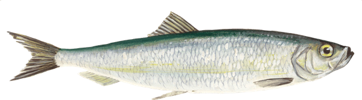
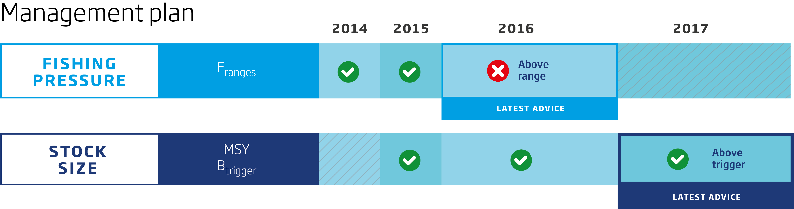
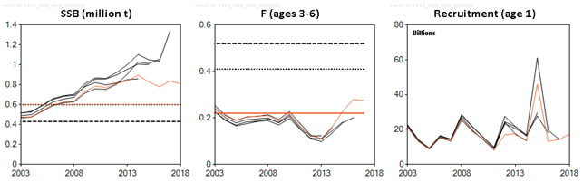
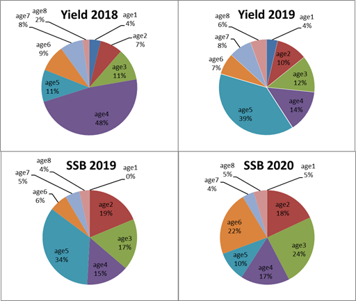

---
output:
  html_document:
    keep_md: true
    fig_height: 1
    fig_width: 1
    toc: yes
    toc_depth: 1
    toc_float: yes
  pdf_document:
    toc: yes
    toc_depth: '2'
    code_folding: hide
---
<style>
    
#TOC {
  background:url("images/iceslogo.png") ;
  background-size: contain;
  padding-top: 100px !important;
  background-repeat: no-repeat;
  position: fixed;
  font-size: 12px;
  left: 0;
  top: 0;
  width: 200px;
  height: 80%;
  overflow:auto;
}
---
<a id="top"></a>

# ICES advice 2018

## "Herring (Clupea harengus) in subdivisions 25–29 and 32, excluding the Gulf of Riga (central Baltic Sea)"


```{r setup, include=FALSE}
knitr::opts_chunk$set(
	echo = FALSE,
	message = FALSE,
	warning = FALSE
)
#<a href="#top">Back to top</a>
```

***
```{r  out.width = "50%"}

knitr::include_graphics("images/map.png")
```


[Go to latest advice](http://www.ices.dk/sites/pub/Publication%20Reports/Advice/2018/2018/her.27.25-2932.pdf)  
[Go to Standard Graphs page](http://standardgraphs.ices.dk/ViewCharts.aspx?key=9428)  
[Go to Transparent Assessment Framework page](https://github.com/ices-taf/2016_cod-347d)

***

# ICES advice on fishing opportunities
ICES advises that when the EU multiannual plan (MAP) is applied, catches in 2019 that correspond to the F ranges in the plan are between **115 591** tonnes and **192 787** tonnes. According to the MAP, catches higher than those corresponding to FMSY (155 333 tonnes) can only be taken under conditions specified in the MAP, whilst the entire range is considered precautionary when applying the ICES advice rule. This advice applies to all catches from the stock, including those taken in Subdivision 28.1.
 <br> 

***

# Stock development over time
Spawning-stock biomass (SSB) decreased until 2001 and then increased, and it has been above MSY Btrigger since 2007. Fishing mortality (F) increased until 2000 and then decreased, remaining below FMSY between 2004 to 2014. F has been above FMSY since 2015. Recruitment in 2015 is estimated to be the highest of the whole time-series.

<div class= "col2"
.col2 {
    columns: 2 220px;         /* number of columns and width in pixels*/
    -webkit-columns: 2 220px; /* chrome, safari */
    -moz-columns: 2 220px;    /* firefox */
  }>
```{r sag1, echo=FALSE, fig.height=3.5, fig.width=3.5}

 library(htmlwidgets)
 library(dplyr)
 library(ggplot2)
 library(dygraphs)
 library(htmltools)
 library(widgetframe)
library(icesSAG)
SAGsummary <- getSAG("her.27.25-2932", 2018, data = "summary", combine = TRUE, purpose = "Advice")
 # data <- read.csv("Data/her/herdata.csv")
data <- SAGsummary
 dyBarChart <- function(dygraph) {
  dyPlotter(dygraph = dygraph,
            name = "BarChart",
            path = system.file("examples/plotters/barchart.js",
                               package = "dygraphs"))
}

 catches <- data %>% select(Year, catches)
 catches$catches <- catches[, "catches"]/1000
 recruitment<- data %>% select(Year, low_recruitment, recruitment, high_recruitment)
 
 dygraph(catches, main = "Catches")%>%
   dyRangeSelector()%>%
   dyOptions(colors = RColorBrewer::brewer.pal(3, "Set2"), drawGrid = FALSE,maxNumberWidth = 4)%>%
   dyAxis("y")%>%
   dyBarChart()
 
 dygraph(recruitment, main = "Recruitment(age 0)") %>%
   dyRangeSelector()%>%
   # dyOptions(colors = RColorBrewer::brewer.pal(3, "Set2"))%>%
   dyAxis("y")%>%
   dyBarChart()

 
```
</div>
<div class="col2">
```{r sag3, echo = FALSE, fig.height = 3.5, fig.width = 3.5}
library(dygraphs)
library(htmlwidgets)
library(dplyr)
library(ggplot2)
library(gridExtra)
library(dygraphs)

dyBarChart <- function(dygraph) {
  dyPlotter(dygraph = dygraph,
            name = "BarChart",
            path = system.file("examples/plotters/barchart.js",
                               package = "dygraphs"))
} 

F <- data %>% select(Year, low_F, F,high_F, FLim, Fpa, FMSY )
 dygraph(F, main = "F") %>%
  dySeries(c("low_F", "F", "high_F"))%>%
   dyLimit(as.numeric(F[, 5]), color = "red")%>%
   dyRangeSelector()%>%
   dyOptions(colors = RColorBrewer::brewer.pal(3, "Set2"),
             drawGrid= FALSE,maxNumberWidth = 4)%>%
   dyAxis("y")
SSB <- data %>% select(Year, low_SSB, SSB,high_SSB, Blim, Bpa, MSYBtrigger)
 dygraph(SSB, main = "SSB") %>%
  dySeries(c("low_SSB", "SSB", "high_SSB"))%>%
   dyLimit(as.numeric(F[, 5]), color = "red")%>%
   dyRangeSelector()%>%
   dyOptions(colors = RColorBrewer::brewer.pal(3, "Set2"),
             drawGrid= FALSE,maxNumberWidth = 4)%>%
   dyAxis("y")
 
```
</div>


**Figure 1**  Herring in subdivisions 25–29 and 32, excluding the Gulf of Riga. Summary of the stock assessment. (SSB in 2018 is
predicted).
<br>

## Summary of the assessment

Herring in subdivisions 25–29 and 32, excluding the Gulf of Riga. Assessment summary. Weights are in tonnes.
Recruitment in thousands.

```{r summarysag, echo=FALSE}
library(icesSAG)
SAGsummary <- getSAG("her.27.25-2932", 2018, data = "summary", combine = TRUE, purpose = "Advice")
write.csv(SAGsummary, file = "SAGsummary.csv")

```

```{r download4}
library(magrittr)
 readLines("SAGsummary.csv") %>% 
   paste0(collapse="\n") %>% 
   openssl::base64_encode() -> encoded
```

[Download CSV](`r sprintf('data:text/csv;base64,%s', encoded)`)
 ***  
[Go to Top](#top)

# Stock and explotation status

<br>

ICES assesses that fishing pressure on the stock is above FMSY and below Fpa and Flim; spawning stock size is above MSY Btrigger, Bpa, and Blim.
<br>
**State of the stock and fishery relative to reference points**
<br>



***  

# Catch scenarios

<br>

** Assumptions made for the interim year and in the forecast for herring in subdivisions 25–29 and 32, excluding the Gulf of Riga.Weights are in tonnes. Recruitment is in thousands.**


<br>
```{r catchoptionsbasis, echo=FALSE}
library(knitr)
library(readr)
library(kableExtra)
dt <- read.csv("Data/her/hercatchoptionsbasis.csv",header = T)
# dt <- dt [,-1] 
kable(dt, "html")%>% 
  row_spec(0, bold = T, color = "black", background = "lightgrey", align = "c")%>%
  column_spec(1, width = "20em")%>%
  column_spec(2, width = "20em")%>%
  column_spec(3, width = "45em")%>%
  kable_styling(position = "center", full_width = F, font_size = 7)

```
* TAC constraint in 2018: EU share 229 355 tonnes + Russian quota 29 500 tonnes + central Baltic herring stock caught in Gulf of Riga 4 340 tonnes (mean 2012–2016) − Gulf of Riga herring stock caught in central Baltic Sea 260 tonnes (mean 2012 – 2016) = 262 935 tonnes .
<br>

***

**Table 3  Annual catch scenarios for herring in subdivisions 25–29 and 32, excluding the Gulf of Riga. All weights are in tonnes.**

<button class="btn btn-primary" data-toggle="collapse" data-target="#BlockName"> Show/Download Table </button>  
<div id="BlockName" class="collapse"> 
<br>
```{r catchoptionstable, echo=FALSE}
library(knitr)
library(readr)
library(kableExtra)
dt <- read.csv("Data/her/hercatchoptions.csv", header = T, row.names = 1)
# dt <- dt [,-1]
dt <- dt[complete.cases(dt),]
 kable(dt, "html") %>% kable_styling(position = "center")%>%
   row_spec(0, bold = T, color = "black", background = "lightgrey")%>%
   column_spec(1, width = "30em")%>%
         column_spec(2:7, width = "10em")%>%
   group_rows("ICES advice basis",1,1) %>%
   group_rows("Other options",2,9)
```
* SSB 2020 relative to SSB 2019.
** Advice value in 2019 relative to Advice value for EU MAP: FMSY 2018 (267 745 tonnes).
*** Advice value for  2019 relative to Advice value for EU MAP: Flower 2018 (200 236 tonnes).
^ Advice value for  2019 relative to Advice value for EU MAP: Fupper 2018 (331 510 tonnes).
^^ MAP multiannual plan (EU, 2016).
^^^ TAC = TAC in 2018: EU share 229 355 tonnes + Russian quota 29 500 tonnes + central Baltic herring stock caught in Gulf of Riga 4 340 tonnes (mean 2012–2016) − Gulf of Riga herring stock caught in central Baltic Sea 260 tonnes (mean 2012 – 2016) = 262 935 tonnes.


```{r download}
library(magrittr)
 readLines("Data/her/hercatchoptions.csv") %>% 
   paste0(collapse="\n") %>% 
   openssl::base64_encode() -> encoded
```

[Download CSV](`r sprintf('data:text/csv;base64,%s', encoded)`)
</div>
<br>
The decreased catch advice is due to a change in the perception of the stock size. The stock size was downscaled and fishing mortality was upscaled due to the low survey indices in the last two years. There is also a downward revision of the 2014 year class.
<br>
```{r catchscenariostable, echo=FALSE, fig.width=3}
library(knitr)
library(readr)
library(kableExtra)
dt <- read.csv("Data/her/herscenariosplot.csv") %>%
        select(Basis, F, Catch, SSB_2019, SSB_2020)
write.table (dt, "thing.txt",sep = ",")

colnames(dt)<- c("Basis", "F", "Catch_2018", "SSB_2019", "SSB_2020")
 kable(dt, "html") %>% kable_styling(position = "center")%>%
  kable_styling(bootstrap_options = "striped", full_width = F, font_size = 7)

```

## Version 1
```{r catchoptionsgraph, echo = FALSE,fig.height = 5, fig.width = 7}
library(ggplot2)
library(plotly)
 catchoptions <- read.csv("Data/her/herscenariosplot.csv")
 # labels <- catchoptions$Basis
 # labels <- as.character(labels)
 mypalette<-ggthemes::tableau_color_pal('tableau20')
 
 data <- catchoptions[order(catchoptions$F),] 
 
 
 p1 <- plot_ly(data, x = ~F) %>%
         layout(hovermode="TRUE", showlegend = TRUE,
           shapes = list(
             list(type = "line", fillcolor = "red", 
               line    = list(color = "red",
               width = 2,
               dash = "dot"),
               opacity = 0.5,
               x0      = 0.52,
               x1      = 0.52,
               xref    = "Flim",
               y0      = 0,
               y1      = 1000000,
               yref    = "y",
               name = "Flim"),
             list(type = "line", fillcolor = "green", 
               line    = list(color = "green",
               width = 2,
               dash = "dot"), 
               opacity = 0.2, 
               x0      = 0.22,
               x1      = 0.22,
               xref    = "Fmsy",
               y0      = 0,
               y1      = 1000000,
               yref    = "y",
               name = "Fmsy"),
             list(type = "line", fillcolor = "orange", 
               line    = list(color = "orange",
               width = 2,
               dash = "dot"), 
               opacity = 1, 
               x0      = 0.41,
               x1      = 0.41,
               xref    = "Fpa",
               y0      = 0,
               y1      = 1000000,
               yref    = "y",
               name = "Fpa"),
             list(type = "line", fillcolor = "blue", 
               line    = list(color = "blue",
               width = 2,
               dash = "dash"), 
               opacity = 0.3, 
               x0      = -0.3,
               x1      = 1,
               xref    = "x",
               y0      = 430000,
               y1      = 430000,
               yref    = "Blim",
               name = "Blim"),
             list(type = "line", fillcolor = "lightblue", 
               line    = list(color = "lightblue",
               width = 2,
               dash = "dash"), 
               opacity = 0.3, 
               x0      = -0.3,
               x1      = 1,
               xref    = "x",
               y0      = 600000,
               y1      = 600000,
               yref    = "Bpa = MSY Btrigger",
               text = "Bpa = MSY Btrigger",
               textposition = "bottom right"),
             list(type = "rect", fillcolor = "green", opacity = 0.2,
                  line = list(color = "green", opacity=0.2),
                  x0 = -0.3, x1 = 0.41, xref = "x",
                  y0 = 0, y1 = 1000000, yref = "y"),
             list(type = "rect", fillcolor = "orange", opacity = 0.2,
                  line = list(color = "orange", opacity=0.2),
                  x0 = 0.41, x1 = 0.52, y0 = 0, y1 = 1000000),
             list(type = "rect", fillcolor = "red", opacity = 0.2,
                  line = list(color = "red", opacity=0.2),
                  x0 = 0.52, x1 = 1, y0 = 0, y1 = 1000000)),
           yaxis= list(title = 'tonnes', showgrid =FALSE),
    xaxis=list(title = 'Fishing mortality according to catch scenarios', showgrid= FALSE, tickmode = "array",tickvals = c(0.22,0.41,0.52), ticktext = c("Fmsy","Fpa", "Flim"), tickangle = 45),
    annotations=
        list(
            x= 1,
            y=c(430000,600000),
            xref= '1',
            yref='y',
            text=c('Blim','Bpa = MSY Btrigger'),
            showarrow = TRUE,
            ax= 70,
            ay= 0
        ) 
    )%>%
         add_trace(y = ~ SSB_2019, name= 'SSB 2019', mode = 'lines+markers',opacity = 0.8, width= 0.2, text = data$Basis, hoverinfo = "text + x+ y") %>%
         add_trace(y = ~ SSB_2020, name= 'SSB 2020', mode = 'lines+markers',opacity = 0.8, width= 0.2, text = data$Basis, hoverinfo = "text + x+ y") %>%
          add_trace(y = ~ Catch, name = 'Catch 2018', mode = 'lines+markers',text = data$Basis, hoverinfo = "text + x+ y")
                  
  p1$elementId <- NULL
  p1
```
 
## Version 2:
 <div class="col2">
```{r catchoptionsgraphv2, fig.height=3.5, fig.width=3.5}
library(ggplot2)
library(plotly)
 catchoptions <- read.csv("Data/her/herscenariosplot.csv")
 # labels <- catchoptions$Basis
 # labels <- as.character(labels)
 mypalette<-ggthemes::tableau_color_pal('tableau20')
 
 data <- catchoptions[order(catchoptions$F),] 
 
 
 p1 <- plot_ly(data, x = ~F) %>%
         layout(hovermode="TRUE", showlegend = FALSE,
           shapes = list(
             list(type = "line", fillcolor = "red", 
               line    = list(color = "red",
               width = 2,
               dash = "dot"),
               opacity = 0.5,
               x0      = 0.52,
               x1      = 0.52,
               xref    = "Flim",
               y0      = 0,
               y1      = 1000000,
               yref    = "y",
               name = "Flim"),
             list(type = "line", fillcolor = "green", 
               line    = list(color = "green",
               width = 2,
               dash = "dot"), 
               opacity = 0.2, 
               x0      = 0.22,
               x1      = 0.22,
               xref    = "Fmsy",
               y0      = 0,
               y1      = 1000000,
               yref    = "y",
               name = "Fmsy"),
             list(type = "line", fillcolor = "orange", 
               line    = list(color = "orange",
               width = 2,
               dash = "dot"), 
               opacity = 1, 
               x0      = 0.41,
               x1      = 0.41,
               xref    = "Fpa",
               y0      = 0,
               y1      = 1000000,
               yref    = "y",
               name = "Fpa"),
             list(type = "line", fillcolor = "blue", 
               line    = list(color = "blue",
               width = 2,
               dash = "dash"), 
               opacity = 0.3, 
               x0      = -0.3,
               x1      = 1,
               xref    = "x",
               y0      = 430000,
               y1      = 430000,
               yref    = "Blim",
               name = "Blim"),
             list(type = "line", fillcolor = "lightblue", 
               line    = list(color = "lightblue",
               width = 2,
               dash = "dash"), 
               opacity = 0.3, 
               x0      = -0.3,
               x1      = 1,
               xref    = "x",
               y0      = 600000,
               y1      = 600000,
               yref    = "Bpa = MSY Btrigger",
               text = "Bpa = MSY Btrigger",
               textposition = "bottom right"),
             list(type = "rect", fillcolor = "green", opacity = 0.2,
                  line = list(color = "green", opacity=0.2),
                  x0 = -0.3, x1 = 0.41, xref = "x",
                  y0 = 0, y1 = 1000000, yref = "y"),
             list(type = "rect", fillcolor = "orange", opacity = 0.2,
                  line = list(color = "orange", opacity=0.2),
                  x0 = 0.41, x1 = 0.52, y0 = 0, y1 = 1000000),
             list(type = "rect", fillcolor = "red", opacity = 0.2,
                  line = list(color = "red", opacity=0.2),
                  x0 = 0.52, x1 = 1, y0 = 0, y1 = 1000000)),
           yaxis= list(title = 'tonnes', showgrid =FALSE),
    xaxis=list(title = 'F', showgrid= FALSE, tickmode = "array",tickvals = c(0.22,0.41,0.52), ticktext = c("Fmsy","Fpa", "Flim"), tickangle = 45)
    )%>%
         add_trace(y = ~ SSB_2019, name= 'SSB 2019', mode = 'lines+markers',opacity = 0.8, width= 0.2, text = data$Basis, hoverinfo = "text + x+ y") %>%
          add_trace(y = ~ Catch, name = 'Catch 2018', mode = 'lines+markers',text = data$Basis, hoverinfo = "text + x+ y")
                  
  p1$elementId <- NULL
  p1
  
  p2 <- plot_ly(data, x = ~F) %>%
         layout(hovermode="TRUE", showlegend = FALSE,
           shapes = list(
             list(type = "line", fillcolor = "red", 
               line    = list(color = "red",
               width = 2,
               dash = "dot"),
               opacity = 0.5,
               x0      = 0.52,
               x1      = 0.52,
               xref    = "Flim",
               y0      = 0,
               y1      = 1000000,
               yref    = "y",
               name = "Flim"),
             list(type = "line", fillcolor = "green", 
               line    = list(color = "green",
               width = 2,
               dash = "dot"), 
               opacity = 0.2, 
               x0      = 0.22,
               x1      = 0.22,
               xref    = "Fmsy",
               y0      = 0,
               y1      = 1000000,
               yref    = "y",
               name = "Fmsy"),
             list(type = "line", fillcolor = "orange", 
               line    = list(color = "orange",
               width = 2,
               dash = "dot"), 
               opacity = 1, 
               x0      = 0.41,
               x1      = 0.41,
               xref    = "Fpa",
               y0      = 0,
               y1      = 1000000,
               yref    = "y",
               name = "Fpa"),
             list(type = "line", fillcolor = "blue", 
               line    = list(color = "blue",
               width = 2,
               dash = "dash"), 
               opacity = 0.3, 
               x0      = -0.3,
               x1      = 1,
               xref    = "x",
               y0      = 430000,
               y1      = 430000,
               yref    = "Blim",
               name = "Blim"),
             list(type = "line", fillcolor = "lightblue", 
               line    = list(color = "lightblue",
               width = 2,
               dash = "dash"), 
               opacity = 0.3, 
               x0      = -0.3,
               x1      = 1,
               xref    = "x",
               y0      = 600000,
               y1      = 600000,
               yref    = "Bpa = MSY Btrigger",
               text = "Bpa = MSY Btrigger",
               textposition = "bottom right"),
             list(type = "rect", fillcolor = "green", opacity = 0.2,
                  line = list(color = "green", opacity=0.2),
                  x0 = -0.3, x1 = 0.41, xref = "x",
                  y0 = 0, y1 = 1000000, yref = "y"),
             list(type = "rect", fillcolor = "orange", opacity = 0.2,
                  line = list(color = "orange", opacity=0.2),
                  x0 = 0.41, x1 = 0.52, y0 = 0, y1 = 1000000),
             list(type = "rect", fillcolor = "red", opacity = 0.2,
                  line = list(color = "red", opacity=0.2),
                  x0 = 0.52, x1 = 1, y0 = 0, y1 = 1000000)),
           yaxis= list(title = 'tonnes', showgrid =FALSE),
    xaxis=list(title = 'F', showgrid= FALSE, tickmode = "array",tickvals = c(0.22,0.41,0.52), ticktext = c("Fmsy","Fpa", "Flim"), tickangle = 45)
    )%>%
         add_trace(y = ~ SSB_2020, name= 'SSB 2020', mode = 'lines+markers',opacity = 0.8, width= 0.2, text = data$Basis, hoverinfo = "text + x+ y") %>%
          add_trace(y = ~ Catch, name = 'Catch 2018', mode = 'lines+markers',text = data$Basis, hoverinfo = "text + x+ y")
                  
  p2$elementId <- NULL
  p2
  
```
</div>  
  
## Version 3: 
  <div class="col2">
```{r catchoptionsgraphv3, echo = FALSE,fig.height=3.5, fig.width=3.5}
library(ggplot2)
library(plotly)
 catchoptions <- read.csv("Data/her/herscenariosplot.csv")
 # labels <- catchoptions$Basis
 # labels <- as.character(labels)
 mypalette<-ggthemes::tableau_color_pal('tableau20')
 
 data <- catchoptions[order(catchoptions$F),] 
 
 
 p1 <- plot_ly(data, x = ~F) %>%
         layout(hovermode="TRUE", showlegend = FALSE,
           shapes = list(
             list(type = "line", fillcolor = "red", 
               line    = list(color = "red",
               width = 2,
               dash = "dot"),
               opacity = 0.5,
               x0      = 0.52,
               x1      = 0.52,
               xref    = "Flim",
               y0      = 0,
               y1      = 1000000,
               yref    = "y",
               name = "Flim"),
             list(type = "line", fillcolor = "green", 
               line    = list(color = "green",
               width = 2,
               dash = "dot"), 
               opacity = 0.2, 
               x0      = 0.22,
               x1      = 0.22,
               xref    = "Fmsy",
               y0      = 0,
               y1      = 1000000,
               yref    = "y",
               name = "Fmsy"),
             list(type = "line", fillcolor = "orange", 
               line    = list(color = "orange",
               width = 2,
               dash = "dot"), 
               opacity = 1, 
               x0      = 0.41,
               x1      = 0.41,
               xref    = "Fpa",
               y0      = 0,
               y1      = 1000000,
               yref    = "y",
               name = "Fpa"),
             list(type = "line", fillcolor = "blue", 
               line    = list(color = "blue",
               width = 2,
               dash = "dash"), 
               opacity = 0.3, 
               x0      = -0.3,
               x1      = 1,
               xref    = "x",
               y0      = 430000,
               y1      = 430000,
               yref    = "Blim",
               name = "Blim"),
             list(type = "line", fillcolor = "lightblue", 
               line    = list(color = "lightblue",
               width = 2,
               dash = "dash"), 
               opacity = 0.3, 
               x0      = -0.3,
               x1      = 1,
               xref    = "x",
               y0      = 600000,
               y1      = 600000,
               yref    = "Bpa = MSY Btrigger",
               text = "Bpa = MSY Btrigger",
               textposition = "bottom right"),
             list(type = "rect", fillcolor = "green", opacity = 0.2,
                  line = list(color = "green", opacity=0.2),
                  x0 = -0.3, x1 = 0.41, xref = "x",
                  y0 = 0, y1 = 1000000, yref = "y"),
             list(type = "rect", fillcolor = "orange", opacity = 0.2,
                  line = list(color = "orange", opacity=0.2),
                  x0 = 0.41, x1 = 0.52, y0 = 0, y1 = 1000000),
             list(type = "rect", fillcolor = "red", opacity = 0.2,
                  line = list(color = "red", opacity=0.2),
                  x0 = 0.52, x1 = 1, y0 = 0, y1 = 1000000)),
           yaxis= list(title = 'tonnes', showgrid =FALSE),
    xaxis=list(title = 'F', showgrid= FALSE, tickmode = "array",tickvals = c(0.22,0.41,0.52), ticktext = c("Fmsy","Fpa", "Flim"), tickangle = 45)
    )%>%
        add_trace(y = ~ SSB_2019, name= 'SSB 2019', type = 'bar',opacity = 0.8, width= 0.2, color = ~ SSB_2019,colors=c("darkblue","Yellow"), text = data$Basis, hoverinfo = "text + x+ y")%>%
          add_trace(y = ~ Catch, name = 'Catch 2018', mode = 'lines+markers',text = data$Basis, hoverinfo = "text + x+ y")
                  
  p1$elementId <- NULL
  p1
  
  p2 <- plot_ly(data, x = ~F) %>%
         layout(hovermode="TRUE", showlegend = FALSE,
           shapes = list(
             list(type = "line", fillcolor = "red", 
               line    = list(color = "red",
               width = 2,
               dash = "dot"),
               opacity = 0.5,
               x0      = 0.52,
               x1      = 0.52,
               xref    = "Flim",
               y0      = 0,
               y1      = 1000000,
               yref    = "y",
               name = "Flim"),
             list(type = "line", fillcolor = "green", 
               line    = list(color = "green",
               width = 2,
               dash = "dot"), 
               opacity = 0.2, 
               x0      = 0.22,
               x1      = 0.22,
               xref    = "Fmsy",
               y0      = 0,
               y1      = 1000000,
               yref    = "y",
               name = "Fmsy"),
             list(type = "line", fillcolor = "orange", 
               line    = list(color = "orange",
               width = 2,
               dash = "dot"), 
               opacity = 1, 
               x0      = 0.41,
               x1      = 0.41,
               xref    = "Fpa",
               y0      = 0,
               y1      = 1000000,
               yref    = "y",
               name = "Fpa"),
             list(type = "line", fillcolor = "blue", 
               line    = list(color = "blue",
               width = 2,
               dash = "dash"), 
               opacity = 0.3, 
               x0      = -0.3,
               x1      = 1,
               xref    = "x",
               y0      = 430000,
               y1      = 430000,
               yref    = "Blim",
               name = "Blim"),
             list(type = "line", fillcolor = "lightblue", 
               line    = list(color = "lightblue",
               width = 2,
               dash = "dash"), 
               opacity = 0.3, 
               x0      = -0.3,
               x1      = 1,
               xref    = "x",
               y0      = 600000,
               y1      = 600000,
               yref    = "Bpa = MSY Btrigger",
               text = "Bpa = MSY Btrigger",
               textposition = "bottom right"),
             list(type = "rect", fillcolor = "green", opacity = 0.2,
                  line = list(color = "green", opacity=0.2),
                  x0 = -0.3, x1 = 0.41, xref = "x",
                  y0 = 0, y1 = 1000000, yref = "y"),
             list(type = "rect", fillcolor = "orange", opacity = 0.2,
                  line = list(color = "orange", opacity=0.2),
                  x0 = 0.41, x1 = 0.52, y0 = 0, y1 = 1000000),
             list(type = "rect", fillcolor = "red", opacity = 0.2,
                  line = list(color = "red", opacity=0.2),
                  x0 = 0.52, x1 = 1, y0 = 0, y1 = 1000000)),
           yaxis= list(title = 'tonnes', showgrid =FALSE),
    xaxis=list(title = 'F', showgrid= FALSE, tickmode = "array",tickvals = c(0.22,0.41,0.52), ticktext = c("Fmsy","Fpa", "Flim"), tickangle = 45)
    )%>%
         add_trace(y = ~ SSB_2020, name= 'SSB 2020', type = 'bar',opacity = 0.8, width= 0.2, color = ~ SSB_2020,colors=c("darkblue","Yellow"), text = data$Basis, hoverinfo = "text + x+ y") %>%
          add_trace(y = ~ Catch, name = 'Catch 2018', mode = 'lines+markers',text = data$Basis, hoverinfo = "text + x+ y")
                  
  p2$elementId <- NULL
  p2
```
 </div> 
<br>

[Go to Top](#top)

# Basis of the advice  
***
<br>
**Table 4** The basis of the advice for hake in subareas 4, 6, and 7, and in divisions 3.a, 8.a–b, and 8.d, Northern stock.
```{r advicebasis, echo=FALSE}
library(knitr)
library(readr)
library(kableExtra)
dt <- read.csv("Data/hke/hkeadvicebasis.csv", header = FALSE)
#dt <- dt [-1,] 
colnames(dt) <- NULL
kable(dt, "html")%>%kable_styling(position = "center")%>%
  column_spec(1, bold = T, color = "black", background = "lightgrey")

```

<br>

# Quality of the assessment  
***
<br>
A high variability between years in the survey index, in particular in the last years due to the large year class of 2014, is the likely cause of the downward revision of SSB and upward revision of fishing mortality for the recent years. However, applying stochastic models (in this case SAM) to the data shows that these revisions are within the uncertainty bounds of these SAM estimates. 

Preliminary investigations indicate that the stocks of western Baltic spring-spawning herring (Division 3.a and subdivisions 22–24) and central Baltic herring (subdivisions 25–29 and 32, excluding Gulf of Riga herring) are mixing in subdivisions 24–26 (Gröhsler et al., 2013). The level of this mixing is presently unknown and its potential impact on the assessment should be investigated. 

Species misreporting of herring has occurred in the past (Hentati-Sundberg et al., 2014) and there are again indications that it is a problem in some nations.

```{r qualplots}

```

**Figure 2**  Historical assessment results for herring in subdivisions 25–29 and 32, excluding the Gulf of Riga.
<br>

***
# Issues relevant for the advice
The FMSY ranges in the EU Baltic Sea multiannual plan (MAP; EU, 2016) are consistent with the ranges provided by ICES (2015); these were evaluated to result in no more than 5% reduction in long-term yield compared with MSY. The ICES advice according to the MAP is based on the provisions of the plan and is considered precautionary. The ICES advice rule is used, i.e. F is adjusted by the factor SSB/MSY Btrigger when SSB is below MSY Btrigger. For this stock, the SSB in 2019 is above MSY Btrigger. In such a situation, catch scenarios applicable under the MAP correspond to fishing mortalities between Flower and Fupper. However, according to the MAP, catches corresponding to F higher than FMSY (i.e. Column B of Annex I in the MAP) can only be taken under conditions specified in the MAP. 

Under the EU landing obligation, which entered into force in 2015, up to 9% interspecies quota transfers are allowed for stocks that are considered to be within safe biological limits (EU, 2013 – Article 15). Quota transfers were not considered in this catch advice. To achieve FMSY exploitation, any transfer under this regulation should be accounted for in setting the TAC.

It should be noted that the large 2014 year class will be the main contributor to the yield in 2018 and 2019 and SSB in 2019 and 2020, and no substantial new incoming year classes are predicted. It is uncommon to see such large contribution of one year class to the SSB as seen in the short term prediction for 2019 and 2020. Three last year classes are below or at the average and if such a situation continues, a marked decline in biomass development can be expected.
<br>
```{r issueplots}

```

**Figure 3**  Contribution to yield and SSB of successive year classes (ages 1–8+) as estimated in the short-term forecast for 2018–2020 under the TAC constraint in 2018. Herring in subdivisions 25–29 and 32, excluding the Gulf of Riga.
<br>

A mixture of central Baltic herring (subdivisions 25–27, 28.2, 29, and 32) and the Gulf of Riga herring (Subdivision 28.1) is caught in the central Baltic Sea. In the assessment and the advice the central Baltic herring stock is considered to be caught both in and outside the central Baltic Sea. The TAC (sum of the EU and the Russian autonomous quotas) is set for herring caught in the central Baltic management area, which includes also a small amount of Gulf of Riga herring caught in the central Baltic Sea but excludes central Baltic herring caught outside the central Baltic Sea.

The TAC value proposed for the central Baltic area is based on the advised catch for the central Baltic herring stock, plus the assumed catch of the Gulf of Riga herring taken in the central Baltic, minus the assumed catch of herring from the central Baltic stock taken in the Gulf of Riga. The values of the two latter are given by the average over the last five years.

•	Central Baltic herring assumed to be taken in the Gulf of Riga in 2019 (Subdivision 28.1) is 4363 tonnes (average 2013–2017);
•	Gulf of Riga herring assumed to be taken in Subdivision 28.2 in 2019 is 251 tonnes (average 2013–2017).

As an example, following the ICES MSY approach (here identical to the MAP FMSY), catches from the central Baltic herring stock in 2019 should be no more than 155 335 tonnes. The corresponding TAC in the central Baltic management area for 2019 would be calculated as 155 335 tonnes + 251 tonnes – 4363 tonnes  = 151 221  tonnes .

# Reference Points  
***
<br>
** Table 5** Reference points, values, and their technical basis. Herring in Subarea 4 and divisions 3.a and 7.d, autumn spawners. 
```{r referencepoints, echo=FALSE}
library(knitr)
library(readr)
library(kableExtra)
dt <- read.csv("Data/hke/herreferencepoints.csv")
dt <- dt [,-1] 
kable(dt, "html")%>%kable_styling(position = "center")%>%
  row_spec(0, bold = T, color = "black", background = "lightgrey")

```
<br>
```{r download2}
library(magrittr)
 readLines("Data/hke/herreferencepoints.csv") %>% 
   paste0(collapse="\n") %>% 
   openssl::base64_encode() -> encoded
```
[Download CSV](`r sprintf('data:text/csv;base64,%s', encoded)`)

***
# Basis of the assessment  

<br>
** Table 6** Basis of the assessment and advice for herring in Subarea 4 and divisions 3.a and 7.d, autumn spawners. 
```{r advicebla, echo=FALSE}
library(knitr)
library(readr)
library(kableExtra)
dt <- read.csv("Data/hke/herassessmentbasis.csv")
dt <- dt [,-1] 
kable(dt, "html")%>%kable_styling(position = "center")%>%
  row_spec(0, bold = T, color = "black", background = "lightgrey")

```

```{r download3}
library(magrittr)
 readLines("Data/hke/herassessmentbasis.csv") %>% 
   paste0(collapse="\n") %>% 
   openssl::base64_encode() -> encoded
```
[Download CSV](`r sprintf('data:text/csv;base64,%s', encoded)`)
[Go to Top](#top)

***
# Information from stakeholders  

There is no additional information available.
<br>

***
# History of the advice, catch, and management    

**Table 7**  ICES advice and catch for herring in Subarea 4 and divisions 3.a and 7.d, autumn spawners. All weights are in tonnes. 

***

# History of the catch and landings  

**Table 8** Catch distribution by fleet in 2017 as estimated by ICES for herring in Subarea 4 and divisions 3.a and 7.d, autumn spawners. All weights are in tonnes.
<br>

***

**Table 9** History of commercial catch and landings of herring in Subarea 4 and divisions 3.a and 7.d, autumn spawners. Both the official and ICES estimated values are presented by area for each country participating in the fishery. All weights are in tonnes.

***

# Sources and references  

* EU. 2013. Regulation (EU) No 1380/2013 of the European Parliament and of the Council of 11 December 2013 on the Common Fisheries Policy, amending Council Regulations (EC) No 1954/2003 and (EC) No 1224/2009 and repealing Council Regulations (EC) No 2371/2002 and (EC) No 639/2004 and Council Decision 2004/585/EC. http://eur-lex.europa.eu/legal-content/EN/TXT/?uri=celex:32013R1380.
* EU. 2016. Regulation (EU) 2016/1139 of the European Parliament and of the Council of 6 July 2016 establishing a multiannual plan for the stocks of cod, herring and sprat in the Baltic Sea and the fisheries exploiting those stocks, amending Council Regulation (EC) No 2187/2005 and repealing Council Regulation (EC) No 1098/2007. http://eur-lex.europa.eu/legal-content/EN/TXT/PDF/?uri=CELEX:32016R1139&from=EN
* Gröhsler, T., Oeberst, R., Schaber, M., Larson, N., and Kornilovs, G. 2013. Discrimination of western Baltic spring-spawning and central Baltic herring (Clupea harengus L.) based on growth vs. natural tag information. ICES Journal of Marine Science, 70(6): 1108–1117. DOI: https://doi.org/10.1093/icesjms/fst064.
* Hentati-Sundberg, J., Hjelm, J., and Österblom, H. 2014. Does fisheries management incentivize non-compliance? Estimated misreporting in the Swedish Baltic Sea pelagic fishery based on commercial fishing effort. ICES Journal of Marine Science, 71(7): 1846–1853. DOI: https://doi.org/10.1093/icesjms/fsu036.
* ICES. 2013. Report of the Benchmark Workshop on Baltic Multispecies Assessments (WKBALT 2013), 4–8 February 2013, Copenhagen, Denmark. ICES CM 2013/ACOM:43. 399 pp.
* ICES. 2014. Second Interim Report of the Working Group on Maritime Systems (WGMARS), 2–5 December 2014, Copenhagen, Denmark. ICES CM 2014/SSGSUE:08. 35 pp.
* ICES 2015. EU request to ICES to provide FMSY ranges for selected North Sea and Baltic Sea stocks. In Report of the ICES Advisory Committee, 20125. ICES Advice 20125, Book 6, Section 6.2.3.1. http://www.ices.dk/sites/pub/Publication%20Reports/Advice/2015/Special_Requests/EU_FMSY_ranges_for_selected_NS_and_BS_stocks.pdf.
* ICES. 2016. Advice basis. In Report of the ICES Advisory Committee, 2016. ICES Advice 2016, Book 1, Section 1.2.
* ICES. 2018. Report of the Baltic Fisheries Assessment Working Group (WGBFAS), 6–13 April 2018, ICES Headquarters, Copenhagen, Denmark. ICES CM 2018/ACOM:11.

