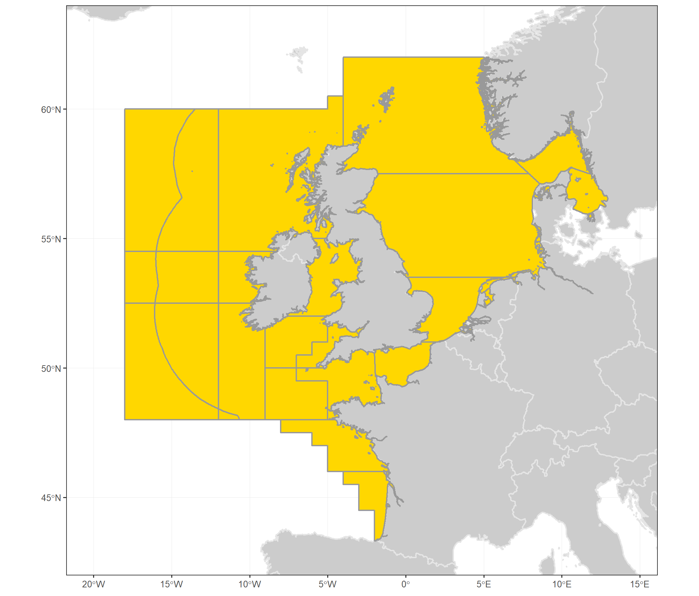

---
output:
  html_document:
    keep_md: true
    fig_height: 1
    fig_width: 1
    toc: yes
    toc_depth: 1
    toc_float: yes
    css: style.css
---

# ICES advice 2018  

## *hke.27.3a46-8abd*

## Hake (*Merluccius merluccius*) in subareas 4, 6, and 7, and in divisions 3.a, 8.a–b, and 8.d, Northern stock (Greater North Sea, Celtic Seas, and the northern Bay of Biscay)

Published 29 June 2018

***

[See PDF version of advice sheet](http://ices.dk/sites/pub/Publication%20Reports/Advice/2018/2018/hke.27.3a46-8abd.pdf)  
[More information about this stock](http://sd.ices.dk/ViewStock.aspx?key=1661)  
[Detailed data and graphs for this stock assessment](http://standardgraphs.ices.dk/ViewCharts.aspx?key=9763)  
[Go to Transparent Assessment Framework page](https://github.com/ices-taf/2016_cod-347d)  
[See this stock in the ICES Spatial facility](http://gis.ices.dk/sf/index.html?widget=visa&assessmentKey=9763)

***

# ICES advice on fishing opportunities
ICES advises that when the MSY approach is applied, catches in 2019 should be no more than **142 240** tonnes. 
   

***

# Stock development over time
The spawning-stock biomass (SSB) has increased substantially since 2006 and is well above historical estimates. Fishing mortality (F) has decreased markedly after 2005 and has been below FMSY since 2012. The two most recent recruitment (R) estimates are above the average of the time-series.

<table style="table-layout: fixed;width: 100%;">
<tr>
<td>

<!--html_preserve-->

<!--/html_preserve-->
</td>
<td>

<!--html_preserve-->

<!--/html_preserve-->
</td>
</tr>

<tr>
<td>
<!--html_preserve-->

<!--/html_preserve-->
</td>
<td>
<!--html_preserve-->

<!--/html_preserve-->
</td>
</tr>
</table>

**Figure 1** .Summary of the stock assessment of hake in subareas 4, 6, and 7, and in divisions 3.a, 8.a–b, and 8.d, Northern stock. Complete discard estimates are available only since 2003. Recruitment and SSB plots show 95% confidence intervals (shaded area). Assumed recruitment values are unshaded.
 

***

# Summary of the assessment

 

 Assessment summary for hake in subareas 4, 6, and 7, and in divisions 3.a, 8.a–b, and 8.d, Northern stock. Weights are in tonnes. Highs and lows are 95% confidence intervals
 
<button class="btn btn-primary" data-toggle="collapse" data-target="#BlockName1"> Show/Download Table </button>  

 
 

[Download CSV](data:text/csv;base64,IiIsIlllYXIiLCJyZWNydWl0bWVudCIsImhpZ2hfcmVjcnVpdG1lbnQiLCJsb3dfcmVjcnVpdG1lbnQiLCJsb3dfU1NCIiwiU1NCIiwiaGlnaF9TU0IiLCJjYXRjaGVzIiwibGFuZGluZ3MiLCJkaXNjYXJkcyIsImxvd19GIiwiRiIsImhpZ2hfRiIsIlN0b2NrUHVibGlzaE5vdGUiLCJQdXJwb3NlIiwiRmFnZSIsImZpc2hzdG9jayIsInJlY3J1aXRtZW50X2FnZSIsIkFzc2Vzc21lbnRZZWFyIiwidW5pdHMiLCJzdG9ja1NpemVEZXNjcmlwdGlvbiIsInN0b2NrU2l6ZVVuaXRzIiwiZmlzaGluZ1ByZXNzdXJlRGVzY3JpcHRpb24iLCJmaXNoaW5nUHJlc3N1cmVVbml0cyIKIjEiLDE5NjYsTkEsTkEsTkEsTkEsTkEsTkEsMTI4OSwxMjg5LE5BLE5BLE5BLE5BLCJTdG9jayBwdWJsaXNoZWQiLCJBZHZpY2UiLCI5LTE5IiwiYmxpLjI3LjViNjciLDksMjAxOCwidG9ubmVzIiwiU1NCIiwidG9ubmVzIiwiRiIsIlllYXItMSIKIjIiLDE5NjcsTkEsTkEsTkEsTkEsTkEsTkEsMTMxNiwxMzE2LE5BLE5BLE5BLE5BLCJTdG9jayBwdWJsaXNoZWQiLCJBZHZpY2UiLCI5LTE5IiwiYmxpLjI3LjViNjciLDksMjAxOCwidG9ubmVzIiwiU1NCIiwidG9ubmVzIiwiRiIsIlllYXItMSIKIjMiLDE5NjgsTkEsTkEsTkEsTkEsTkEsTkEsMjc4NywyNzg3LE5BLE5BLE5BLE5BLCJTdG9jayBwdWJsaXNoZWQiLCJBZHZpY2UiLCI5LTE5IiwiYmxpLjI3LjViNjciLDksMjAxOCwidG9ubmVzIiwiU1NCIiwidG9ubmVzIiwiRiIsIlllYXItMSIKIjQiLDE5NjksTkEsTkEsTkEsTkEsTkEsTkEsMTIxOSwxMjE5LE5BLE5BLE5BLE5BLCJTdG9jayBwdWJsaXNoZWQiLCJBZHZpY2UiLCI5LTE5IiwiYmxpLjI3LjViNjciLDksMjAxOCwidG9ubmVzIiwiU1NCIiwidG9ubmVzIiwiRiIsIlllYXItMSIKIjUiLDE5NzAsTkEsTkEsTkEsTkEsTkEsTkEsMzI0MiwzMjQyLE5BLE5BLE5BLE5BLCJTdG9jayBwdWJsaXNoZWQiLCJBZHZpY2UiLCI5LTE5IiwiYmxpLjI3LjViNjciLDksMjAxOCwidG9ubmVzIiwiU1NCIiwidG9ubmVzIiwiRiIsIlllYXItMSIKIjYiLDE5NzEsTkEsTkEsTkEsTkEsTkEsTkEsMTkzOSwxOTM5LE5BLE5BLE5BLE5BLCJTdG9jayBwdWJsaXNoZWQiLCJBZHZpY2UiLCI5LTE5IiwiYmxpLjI3LjViNjciLDksMjAxOCwidG9ubmVzIiwiU1NCIiwidG9ubmVzIiwiRiIsIlllYXItMSIKIjciLDE5NzIsTkEsTkEsTkEsTkEsTkEsTkEsNDY0Myw0NjQzLE5BLE5BLE5BLE5BLCJTdG9jayBwdWJsaXNoZWQiLCJBZHZpY2UiLCI5LTE5IiwiYmxpLjI3LjViNjciLDksMjAxOCwidG9ubmVzIiwiU1NCIiwidG9ubmVzIiwiRiIsIlllYXItMSIKIjgiLDE5NzMsTkEsTkEsTkEsTkEsTkEsTkEsMjUxNzIsMjUxNzIsTkEsTkEsTkEsTkEsIlN0b2NrIHB1Ymxpc2hlZCIsIkFkdmljZSIsIjktMTkiLCJibGkuMjcuNWI2NyIsOSwyMDE4LCJ0b25uZXMiLCJTU0IiLCJ0b25uZXMiLCJGIiwiWWVhci0xIgoiOSIsMTk3NCxOQSxOQSxOQSxOQSxOQSxOQSwyMDU3NSwyMDU3NSxOQSxOQSxOQSxOQSwiU3RvY2sgcHVibGlzaGVkIiwiQWR2aWNlIiwiOS0xOSIsImJsaS4yNy41YjY3Iiw5LDIwMTgsInRvbm5lcyIsIlNTQiIsInRvbm5lcyIsIkYiLCJZZWFyLTEiCiIxMCIsMTk3NSxOQSxOQSxOQSxOQSxOQSxOQSwxNDE5MywxNDE5MyxOQSxOQSxOQSxOQSwiU3RvY2sgcHVibGlzaGVkIiwiQWR2aWNlIiwiOS0xOSIsImJsaS4yNy41YjY3Iiw5LDIwMTgsInRvbm5lcyIsIlNTQiIsInRvbm5lcyIsIkYiLCJZZWFyLTEiCiIxMSIsMTk3NixOQSxOQSxOQSxOQSxOQSxOQSwxOTI0OCwxOTI0OCxOQSxOQSxOQSxOQSwiU3RvY2sgcHVibGlzaGVkIiwiQWR2aWNlIiwiOS0xOSIsImJsaS4yNy41YjY3Iiw5LDIwMTgsInRvbm5lcyIsIlNTQiIsInRvbm5lcyIsIkYiLCJZZWFyLTEiCiIxMiIsMTk3NyxOQSxOQSxOQSxOQSxOQSxOQSwzMDM0OSwzMDM0OSxOQSxOQSxOQSxOQSwiU3RvY2sgcHVibGlzaGVkIiwiQWR2aWNlIiwiOS0xOSIsImJsaS4yNy41YjY3Iiw5LDIwMTgsInRvbm5lcyIsIlNTQiIsInRvbm5lcyIsIkYiLCJZZWFyLTEiCiIxMyIsMTk3OCxOQSxOQSxOQSxOQSxOQSxOQSwxMzAwMCwxMzAwMCxOQSxOQSxOQSxOQSwiU3RvY2sgcHVibGlzaGVkIiwiQWR2aWNlIiwiOS0xOSIsImJsaS4yNy41YjY3Iiw5LDIwMTgsInRvbm5lcyIsIlNTQiIsInRvbm5lcyIsIkYiLCJZZWFyLTEiCiIxNCIsMTk3OSxOQSxOQSxOQSxOQSxOQSxOQSwxMDA4NywxMDA4NyxOQSxOQSxOQSxOQSwiU3RvY2sgcHVibGlzaGVkIiwiQWR2aWNlIiwiOS0xOSIsImJsaS4yNy41YjY3Iiw5LDIwMTgsInRvbm5lcyIsIlNTQiIsInRvbm5lcyIsIkYiLCJZZWFyLTEiCiIxNSIsMTk4MCxOQSxOQSxOQSxOQSxOQSxOQSwyMjI4NywyMjI4NyxOQSxOQSxOQSxOQSwiU3RvY2sgcHVibGlzaGVkIiwiQWR2aWNlIiwiOS0xOSIsImJsaS4yNy41YjY3Iiw5LDIwMTgsInRvbm5lcyIsIlNTQiIsInRvbm5lcyIsIkYiLCJZZWFyLTEiCiIxNiIsMTk4MSxOQSxOQSxOQSxOQSxOQSxOQSwxMzE5NSwxMzE5NSxOQSxOQSxOQSxOQSwiU3RvY2sgcHVibGlzaGVkIiwiQWR2aWNlIiwiOS0xOSIsImJsaS4yNy41YjY3Iiw5LDIwMTgsInRvbm5lcyIsIlNTQiIsInRvbm5lcyIsIkYiLCJZZWFyLTEiCiIxNyIsMTk4MixOQSxOQSxOQSxOQSxOQSxOQSwxMDkxMiwxMDkxMixOQSxOQSxOQSxOQSwiU3RvY2sgcHVibGlzaGVkIiwiQWR2aWNlIiwiOS0xOSIsImJsaS4yNy41YjY3Iiw5LDIwMTgsInRvbm5lcyIsIlNTQiIsInRvbm5lcyIsIkYiLCJZZWFyLTEiCiIxOCIsMTk4MyxOQSxOQSxOQSxOQSxOQSxOQSwxMTQzMiwxMTQzMixOQSxOQSxOQSxOQSwiU3RvY2sgcHVibGlzaGVkIiwiQWR2aWNlIiwiOS0xOSIsImJsaS4yNy41YjY3Iiw5LDIwMTgsInRvbm5lcyIsIlNTQiIsInRvbm5lcyIsIkYiLCJZZWFyLTEiCiIxOSIsMTk4NCxOQSxOQSxOQSxOQSxOQSxOQSwxNTQzNywxNTQzNyxOQSxOQSxOQSxOQSwiU3RvY2sgcHVibGlzaGVkIiwiQWR2aWNlIiwiOS0xOSIsImJsaS4yNy41YjY3Iiw5LDIwMTgsInRvbm5lcyIsIlNTQiIsInRvbm5lcyIsIkYiLCJZZWFyLTEiCiIyMCIsMTk4NSxOQSxOQSxOQSxOQSxOQSxOQSwxOTIwNSwxOTIwNSxOQSxOQSxOQSxOQSwiU3RvY2sgcHVibGlzaGVkIiwiQWR2aWNlIiwiOS0xOSIsImJsaS4yNy41YjY3Iiw5LDIwMTgsInRvbm5lcyIsIlNTQiIsInRvbm5lcyIsIkYiLCJZZWFyLTEiCiIyMSIsMTk4NixOQSxOQSxOQSxOQSxOQSxOQSwyMTAxOCwyMTAxOCxOQSxOQSxOQSxOQSwiU3RvY2sgcHVibGlzaGVkIiwiQWR2aWNlIiwiOS0xOSIsImJsaS4yNy41YjY3Iiw5LDIwMTgsInRvbm5lcyIsIlNTQiIsInRvbm5lcyIsIkYiLCJZZWFyLTEiCiIyMiIsMTk4NyxOQSxOQSxOQSxOQSxOQSxOQSwxNzQzMCwxNzQzMCxOQSxOQSxOQSxOQSwiU3RvY2sgcHVibGlzaGVkIiwiQWR2aWNlIiwiOS0xOSIsImJsaS4yNy41YjY3Iiw5LDIwMTgsInRvbm5lcyIsIlNTQiIsInRvbm5lcyIsIkYiLCJZZWFyLTEiCiIyMyIsMTk4OCxOQSxOQSxOQSxOQSxOQSxOQSwxODg0MiwxODg0MixOQSxOQSxOQSxOQSwiU3RvY2sgcHVibGlzaGVkIiwiQWR2aWNlIiwiOS0xOSIsImJsaS4yNy41YjY3Iiw5LDIwMTgsInRvbm5lcyIsIlNTQiIsInRvbm5lcyIsIkYiLCJZZWFyLTEiCiIyNCIsMTk4OSxOQSxOQSxOQSxOQSxOQSxOQSwxNTExNiwxNTExNixOQSxOQSxOQSxOQSwiU3RvY2sgcHVibGlzaGVkIiwiQWR2aWNlIiwiOS0xOSIsImJsaS4yNy41YjY3Iiw5LDIwMTgsInRvbm5lcyIsIlNTQiIsInRvbm5lcyIsIkYiLCJZZWFyLTEiCiIyNSIsMTk5MCxOQSxOQSxOQSxOQSxOQSxOQSwxMjQyNywxMjQyNyxOQSxOQSxOQSxOQSwiU3RvY2sgcHVibGlzaGVkIiwiQWR2aWNlIiwiOS0xOSIsImJsaS4yNy41YjY3Iiw5LDIwMTgsInRvbm5lcyIsIlNTQiIsInRvbm5lcyIsIkYiLCJZZWFyLTEiCiIyNiIsMTk5MSxOQSxOQSxOQSxOQSxOQSxOQSwxMjE4NSwxMjE4NSxOQSxOQSxOQSxOQSwiU3RvY2sgcHVibGlzaGVkIiwiQWR2aWNlIiwiOS0xOSIsImJsaS4yNy41YjY3Iiw5LDIwMTgsInRvbm5lcyIsIlNTQiIsInRvbm5lcyIsIkYiLCJZZWFyLTEiCiIyNyIsMTk5MixOQSxOQSxOQSxOQSxOQSxOQSwxMzY1OSwxMzY1OSxOQSxOQSxOQSxOQSwiU3RvY2sgcHVibGlzaGVkIiwiQWR2aWNlIiwiOS0xOSIsImJsaS4yNy41YjY3Iiw5LDIwMTgsInRvbm5lcyIsIlNTQiIsInRvbm5lcyIsIkYiLCJZZWFyLTEiCiIyOCIsMTk5MyxOQSxOQSxOQSxOQSxOQSxOQSwxMDc4OSwxMDc4OSxOQSxOQSxOQSxOQSwiU3RvY2sgcHVibGlzaGVkIiwiQWR2aWNlIiwiOS0xOSIsImJsaS4yNy41YjY3Iiw5LDIwMTgsInRvbm5lcyIsIlNTQiIsInRvbm5lcyIsIkYiLCJZZWFyLTEiCiIyOSIsMTk5NCxOQSxOQSxOQSxOQSxOQSxOQSw2MzE3LDYzMTcsTkEsTkEsTkEsTkEsIlN0b2NrIHB1Ymxpc2hlZCIsIkFkdmljZSIsIjktMTkiLCJibGkuMjcuNWI2NyIsOSwyMDE4LCJ0b25uZXMiLCJTU0IiLCJ0b25uZXMiLCJGIiwiWWVhci0xIgoiMzAiLDE5OTUsMzQ5Niw0MTEzLDI4ODAsNDcyMzQsNzA3NDgsOTQyNjEsNzU3MCw3NTcwLE5BLDAuMDg3LDAuMTEyLDAuMTM2LCJTdG9jayBwdWJsaXNoZWQiLCJBZHZpY2UiLCI5LTE5IiwiYmxpLjI3LjViNjciLDksMjAxOCwidG9ubmVzIiwiU1NCIiwidG9ubmVzIiwiRiIsIlllYXItMSIKIjMxIiwxOTk2LDM1MTQsNDE0MywyODg0LDQ4Njc5LDcxMjY1LDkzODUyLDg1MzEsODUzMSxOQSwwLjA5NSwwLjExNywwLjE0LCJTdG9jayBwdWJsaXNoZWQiLCJBZHZpY2UiLCI5LTE5IiwiYmxpLjI3LjViNjciLDksMjAxOCwidG9ubmVzIiwiU1NCIiwidG9ubmVzIiwiRiIsIlllYXItMSIKIjMyIiwxOTk3LDM1NjIsNDE5OSwyOTI0LDQ5OTQyLDcxNTMzLDkzMTI1LDEwMzY3LDEwMzY3LE5BLDAuMTMsMC4xNTYsMC4xODMsIlN0b2NrIHB1Ymxpc2hlZCIsIkFkdmljZSIsIjktMTkiLCJibGkuMjcuNWI2NyIsOSwyMDE4LCJ0b25uZXMiLCJTU0IiLCJ0b25uZXMiLCJGIiwiWWVhci0xIgoiMzMiLDE5OTgsMzUwNiw0MTI3LDI4ODUsNDkxODEsNjkyNzAsODkzNTksMTA2ODIsMTA2ODIsTkEsMC4xMzMsMC4xNTgsMC4xODQsIlN0b2NrIHB1Ymxpc2hlZCIsIkFkdmljZSIsIjktMTkiLCJibGkuMjcuNWI2NyIsOSwyMDE4LCJ0b25uZXMiLCJTU0IiLCJ0b25uZXMiLCJGIiwiWWVhci0xIgoiMzQiLDE5OTksMzU4Niw0MjIzLDI5NDksNDg3NDAsNjc1NzUsODY0MTAsMTI0MDYsMTI0MDYsTkEsMC4xNzEsMC4yMDIsMC4yMzIsIlN0b2NrIHB1Ymxpc2hlZCIsIkFkdmljZSIsIjktMTkiLCJibGkuMjcuNWI2NyIsOSwyMDE4LCJ0b25uZXMiLCJTU0IiLCJ0b25uZXMiLCJGIiwiWWVhci0xIgoiMzUiLDIwMDAsMzQ5OCw0MTA0LDI4OTMsNDY0MTksNjM2MTUsODA4MTEsMTExNjAsMTExNjAsTkEsMC4xNzQsMC4yMDUsMC4yMzYsIlN0b2NrIHB1Ymxpc2hlZCIsIkFkdmljZSIsIjktMTkiLCJibGkuMjcuNWI2NyIsOSwyMDE4LCJ0b25uZXMiLCJTU0IiLCJ0b25uZXMiLCJGIiwiWWVhci0xIgoiMzYiLDIwMDEsMzUzMSw0MTIyLDI5MzksNDQ2MjYsNjA0ODAsNzYzMzUsMTIxMjcsMTIxMjcsTkEsMC4xODcsMC4yMjEsMC4yNTUsIlN0b2NrIHB1Ymxpc2hlZCIsIkFkdmljZSIsIjktMTkiLCJibGkuMjcuNWI2NyIsOSwyMDE4LCJ0b25uZXMiLCJTU0IiLCJ0b25uZXMiLCJGIiwiWWVhci0xIgoiMzciLDIwMDIsMzM4MSw0MDQyLDI3MTksNDE5NDMsNTY4NjEsNzE3NzksODc1Myw4NzUzLE5BLDAuMTM4LDAuMTY1LDAuMTkyLCJTdG9jayBwdWJsaXNoZWQiLCJBZHZpY2UiLCI5LTE5IiwiYmxpLjI3LjViNjciLDksMjAxOCwidG9ubmVzIiwiU1NCIiwidG9ubmVzIiwiRiIsIlllYXItMSIKIjM4IiwyMDAzLDM0MDYsNDAzMCwyNzgxLDQyMDkyLDU2NjkyLDcxMjkyLDcyNzUsNzI3NSxOQSwwLjExOCwwLjE0MiwwLjE2NiwiU3RvY2sgcHVibGlzaGVkIiwiQWR2aWNlIiwiOS0xOSIsImJsaS4yNy41YjY3Iiw5LDIwMTgsInRvbm5lcyIsIlNTQiIsInRvbm5lcyIsIkYiLCJZZWFyLTEiCiIzOSIsMjAwNCwzNjMyLDQyMTIsMzA1Myw0MzkxNSw1ODM1MCw3Mjc4NSw2MjIyLDYyMjIsTkEsMC4wOTEsMC4xMDgsMC4xMjYsIlN0b2NrIHB1Ymxpc2hlZCIsIkFkdmljZSIsIjktMTkiLCJibGkuMjcuNWI2NyIsOSwyMDE4LCJ0b25uZXMiLCJTU0IiLCJ0b25uZXMiLCJGIiwiWWVhci0xIgoiNDAiLDIwMDUsMzc2NCw0NDIxLDMxMDcsNDcwODUsNjE4MzUsNzY1ODUsNTQ4MSw1NDgxLE5BLDAuMDgzLDAuMDk3LDAuMTEyLCJTdG9jayBwdWJsaXNoZWQiLCJBZHZpY2UiLCI5LTE5IiwiYmxpLjI3LjViNjciLDksMjAxOCwidG9ubmVzIiwiU1NCIiwidG9ubmVzIiwiRiIsIlllYXItMSIKIjQxIiwyMDA2LDM3MDIsNDI5NCwzMTEwLDUwMzAzLDY1MjAyLDgwMTAyLDU2NTAsNTY1MCxOQSwwLjA4NiwwLjEwMSwwLjExNiwiU3RvY2sgcHVibGlzaGVkIiwiQWR2aWNlIiwiOS0xOSIsImJsaS4yNy41YjY3Iiw5LDIwMTgsInRvbm5lcyIsIlNTQiIsInRvbm5lcyIsIkYiLCJZZWFyLTEiCiI0MiIsMjAwNywzNjQwLDQyMDMsMzA3Nyw1Mjc3MCw2NzcwNCw4MjYzNyw1NjQ4LDU2NDgsTkEsMC4wNzksMC4wOTIsMC4xMDYsIlN0b2NrIHB1Ymxpc2hlZCIsIkFkdmljZSIsIjktMTkiLCJibGkuMjcuNWI2NyIsOSwyMDE4LCJ0b25uZXMiLCJTU0IiLCJ0b25uZXMiLCJGIiwiWWVhci0xIgoiNDMiLDIwMDgsMzU5MSw0MTUwLDMwMzMsNTUxMzAsNzAyMTYsODUzMDIsMzk0MCwzOTQwLE5BLDAuMDU2LDAuMDY2LDAuMDc2LCJTdG9jayBwdWJsaXNoZWQiLCJBZHZpY2UiLCI5LTE5IiwiYmxpLjI3LjViNjciLDksMjAxOCwidG9ubmVzIiwiU1NCIiwidG9ubmVzIiwiRiIsIlllYXItMSIKIjQ0IiwyMDA5LDM0ODYsNDA1NSwyOTE3LDU4MTc3LDczNjU5LDg5MTQyLDQxMjEsNDEyMSxOQSwwLjA1NSwwLjA2NSwwLjA3NSwiU3RvY2sgcHVibGlzaGVkIiwiQWR2aWNlIiwiOS0xOSIsImJsaS4yNy41YjY3Iiw5LDIwMTgsInRvbm5lcyIsIlNTQiIsInRvbm5lcyIsIkYiLCJZZWFyLTEiCiI0NSIsMjAxMCwzNDA1LDQwMDcsMjgwNCw2MDUzOSw3NjUyOSw5MjUyMCw0NzU5LDQ3NTksTkEsMC4wNiwwLjA3MSwwLjA4MiwiU3RvY2sgcHVibGlzaGVkIiwiQWR2aWNlIiwiOS0xOSIsImJsaS4yNy41YjY3Iiw5LDIwMTgsInRvbm5lcyIsIlNTQiIsInRvbm5lcyIsIkYiLCJZZWFyLTEiCiI0NiIsMjAxMSwzNDI0LDQwMzIsMjgxNSw2MjI0Miw3ODcwNCw5NTE2NSwyODYxLDI4NjEsTkEsMC4wMzYsMC4wNDMsMC4wNDksIlN0b2NrIHB1Ymxpc2hlZCIsIkFkdmljZSIsIjktMTkiLCJibGkuMjcuNWI2NyIsOSwyMDE4LCJ0b25uZXMiLCJTU0IiLCJ0b25uZXMiLCJGIiwiWWVhci0xIgoiNDciLDIwMTIsMzMwMSwzOTc1LDI2MjcsNjQ5NTEsODIyNDIsOTk1MzIsMzAzMSwzMDMxLE5BLDAuMDM4LDAuMDQ2LDAuMDUzLCJTdG9jayBwdWJsaXNoZWQiLCJBZHZpY2UiLCI5LTE5IiwiYmxpLjI3LjViNjciLDksMjAxOCwidG9ubmVzIiwiU1NCIiwidG9ubmVzIiwiRiIsIlllYXItMSIKIjQ4IiwyMDEzLDMyMDMsMzk4OCwyNDE3LDY2NDI2LDg0ODQ5LDEwMzI3MiwyNTg4LDI1ODgsTkEsMC4wMywwLjAzNywwLjA0MywiU3RvY2sgcHVibGlzaGVkIiwiQWR2aWNlIiwiOS0xOSIsImJsaS4yNy41YjY3Iiw5LDIwMTgsInRvbm5lcyIsIlNTQiIsInRvbm5lcyIsIkYiLCJZZWFyLTEiCiI0OSIsMjAxNCwzMjk1LDQwMjksMjU2MCw2ODgxNCw4ODE0MywxMDc0NzEsMjk0OSwyOTQ5LE5BLDAuMDMzLDAuMDQsMC4wNDcsIlN0b2NrIHB1Ymxpc2hlZCIsIkFkdmljZSIsIjktMTkiLCJibGkuMjcuNWI2NyIsOSwyMDE4LCJ0b25uZXMiLCJTU0IiLCJ0b25uZXMiLCJGIiwiWWVhci0xIgoiNTAiLDIwMTUsMzYwNSw0MjMxLDI5ODAsNzIwNzcsOTE4MTIsMTExNTQ3LDI3NDgsMjc0OCxOQSwwLjAzLDAuMDM3LDAuMDQzLCJTdG9jayBwdWJsaXNoZWQiLCJBZHZpY2UiLCI5LTE5IiwiYmxpLjI3LjViNjciLDksMjAxOCwidG9ubmVzIiwiU1NCIiwidG9ubmVzIiwiRiIsIlllYXItMSIKIjUxIiwyMDE2LDM1NTEsNDE4MSwyOTIwLDc0OTY1LDk1MTg4LDExNTQxMiwzMDU5LDMwNTksTkEsMC4wMjksMC4wMzUsMC4wNDEsIlN0b2NrIHB1Ymxpc2hlZCIsIkFkdmljZSIsIjktMTkiLCJibGkuMjcuNWI2NyIsOSwyMDE4LCJ0b25uZXMiLCJTU0IiLCJ0b25uZXMiLCJGIiwiWWVhci0xIgoiNTIiLDIwMTcsMzU5OSw0MjQ4LDI5NTAsNzc3NDEsOTg1MTcsMTE5MjkzLDI2NjksMjY2OSxOQSwwLjAyNSwwLjAzLDAuMDM1LCJTdG9jayBwdWJsaXNoZWQiLCJBZHZpY2UiLCI5LTE5IiwiYmxpLjI3LjViNjciLDksMjAxOCwidG9ubmVzIiwiU1NCIiwidG9ubmVzIiwiRiIsIlllYXItMSIKIjUzIiwyMDE4LDM0NzksNDE0MiwyODE2LDgwMTYyLDEwMTUwMSwxMjI4NDEsTkEsTkEsTkEsTkEsTkEsTkEsIlN0b2NrIHB1Ymxpc2hlZCIsIkFkdmljZSIsIjktMTkiLCJibGkuMjcuNWI2NyIsOSwyMDE4LCJ0b25uZXMiLCJTU0IiLCJ0b25uZXMiLCJGIiwiWWVhci0xIg==)

<table class="table" style="margin-left: auto; margin-right: auto;">
 <thead>
  <tr>
   <th style="text-align:right;font-weight: bold;color: black;background-color: lightgrey;text-align: center;"> Year </th>
   <th style="text-align:right;font-weight: bold;color: black;background-color: lightgrey;text-align: center;"> recruitment </th>
   <th style="text-align:right;font-weight: bold;color: black;background-color: lightgrey;text-align: center;"> high_recruitment </th>
   <th style="text-align:right;font-weight: bold;color: black;background-color: lightgrey;text-align: center;"> low_recruitment </th>
   <th style="text-align:right;font-weight: bold;color: black;background-color: lightgrey;text-align: center;"> low_SSB </th>
   <th style="text-align:right;font-weight: bold;color: black;background-color: lightgrey;text-align: center;"> SSB </th>
   <th style="text-align:right;font-weight: bold;color: black;background-color: lightgrey;text-align: center;"> high_SSB </th>
   <th style="text-align:right;font-weight: bold;color: black;background-color: lightgrey;text-align: center;"> catches </th>
   <th style="text-align:right;font-weight: bold;color: black;background-color: lightgrey;text-align: center;"> landings </th>
   <th style="text-align:right;font-weight: bold;color: black;background-color: lightgrey;text-align: center;"> discards </th>
   <th style="text-align:right;font-weight: bold;color: black;background-color: lightgrey;text-align: center;"> low_F </th>
   <th style="text-align:right;font-weight: bold;color: black;background-color: lightgrey;text-align: center;"> F </th>
   <th style="text-align:right;font-weight: bold;color: black;background-color: lightgrey;text-align: center;"> high_F </th>
   <th style="text-align:left;font-weight: bold;color: black;background-color: lightgrey;text-align: center;"> StockPublishNote </th>
   <th style="text-align:left;font-weight: bold;color: black;background-color: lightgrey;text-align: center;"> Purpose </th>
   <th style="text-align:right;font-weight: bold;color: black;background-color: lightgrey;text-align: center;"> Fage </th>
   <th style="text-align:left;font-weight: bold;color: black;background-color: lightgrey;text-align: center;"> fishstock </th>
   <th style="text-align:right;font-weight: bold;color: black;background-color: lightgrey;text-align: center;"> recruitment_age </th>
   <th style="text-align:right;font-weight: bold;color: black;background-color: lightgrey;text-align: center;"> AssessmentYear </th>
   <th style="text-align:left;font-weight: bold;color: black;background-color: lightgrey;text-align: center;"> units </th>
   <th style="text-align:left;font-weight: bold;color: black;background-color: lightgrey;text-align: center;"> stockSizeDescription </th>
   <th style="text-align:left;font-weight: bold;color: black;background-color: lightgrey;text-align: center;"> stockSizeUnits </th>
   <th style="text-align:left;font-weight: bold;color: black;background-color: lightgrey;text-align: center;"> fishingPressureDescription </th>
   <th style="text-align:right;font-weight: bold;color: black;background-color: lightgrey;text-align: center;"> fishingPressureUnits </th>
  </tr>
 </thead>
<tbody>
  <tr>
   <td style="text-align:right;"> 1978 </td>
   <td style="text-align:right;"> 298362 </td>
   <td style="text-align:right;"> 356522 </td>
   <td style="text-align:right;"> 249690 </td>
   <td style="text-align:right;"> 66148 </td>
   <td style="text-align:right;"> 80488 </td>
   <td style="text-align:right;"> 94829 </td>
   <td style="text-align:right;"> 50551 </td>
   <td style="text-align:right;"> 50551 </td>
   <td style="text-align:right;"> NA </td>
   <td style="text-align:right;"> NA </td>
   <td style="text-align:right;"> 0.50 </td>
   <td style="text-align:right;"> NA </td>
   <td style="text-align:left;"> Stock published </td>
   <td style="text-align:left;"> Advice </td>
   <td style="text-align:right;"> NA </td>
   <td style="text-align:left;"> hke.27.3a46-8abd </td>
   <td style="text-align:right;"> 0 </td>
   <td style="text-align:right;"> 2018 </td>
   <td style="text-align:left;"> tonnes </td>
   <td style="text-align:left;"> SSB </td>
   <td style="text-align:left;"> tonnes </td>
   <td style="text-align:left;"> F </td>
   <td style="text-align:right;"> NA </td>
  </tr>
  <tr>
   <td style="text-align:right;"> 1979 </td>
   <td style="text-align:right;"> 274926 </td>
   <td style="text-align:right;"> 332948 </td>
   <td style="text-align:right;"> 227015 </td>
   <td style="text-align:right;"> 89676 </td>
   <td style="text-align:right;"> 101357 </td>
   <td style="text-align:right;"> 113038 </td>
   <td style="text-align:right;"> 51096 </td>
   <td style="text-align:right;"> 51096 </td>
   <td style="text-align:right;"> NA </td>
   <td style="text-align:right;"> NA </td>
   <td style="text-align:right;"> 0.54 </td>
   <td style="text-align:right;"> NA </td>
   <td style="text-align:left;"> Stock published </td>
   <td style="text-align:left;"> Advice </td>
   <td style="text-align:right;"> NA </td>
   <td style="text-align:left;"> hke.27.3a46-8abd </td>
   <td style="text-align:right;"> 0 </td>
   <td style="text-align:right;"> 2018 </td>
   <td style="text-align:left;"> tonnes </td>
   <td style="text-align:left;"> SSB </td>
   <td style="text-align:left;"> tonnes </td>
   <td style="text-align:left;"> F </td>
   <td style="text-align:right;"> NA </td>
  </tr>
  <tr>
   <td style="text-align:right;"> 1980 </td>
   <td style="text-align:right;"> 303736 </td>
   <td style="text-align:right;"> 362173 </td>
   <td style="text-align:right;"> 254726 </td>
   <td style="text-align:right;"> 92898 </td>
   <td style="text-align:right;"> 103838 </td>
   <td style="text-align:right;"> 114778 </td>
   <td style="text-align:right;"> 57265 </td>
   <td style="text-align:right;"> 57265 </td>
   <td style="text-align:right;"> NA </td>
   <td style="text-align:right;"> NA </td>
   <td style="text-align:right;"> 0.64 </td>
   <td style="text-align:right;"> NA </td>
   <td style="text-align:left;"> Stock published </td>
   <td style="text-align:left;"> Advice </td>
   <td style="text-align:right;"> NA </td>
   <td style="text-align:left;"> hke.27.3a46-8abd </td>
   <td style="text-align:right;"> 0 </td>
   <td style="text-align:right;"> 2018 </td>
   <td style="text-align:left;"> tonnes </td>
   <td style="text-align:left;"> SSB </td>
   <td style="text-align:left;"> tonnes </td>
   <td style="text-align:left;"> F </td>
   <td style="text-align:right;"> NA </td>
  </tr>
  <tr>
   <td style="text-align:right;"> 1981 </td>
   <td style="text-align:right;"> 579898 </td>
   <td style="text-align:right;"> 658580 </td>
   <td style="text-align:right;"> 510616 </td>
   <td style="text-align:right;"> 79078 </td>
   <td style="text-align:right;"> 89265 </td>
   <td style="text-align:right;"> 99451 </td>
   <td style="text-align:right;"> 53918 </td>
   <td style="text-align:right;"> 53918 </td>
   <td style="text-align:right;"> NA </td>
   <td style="text-align:right;"> NA </td>
   <td style="text-align:right;"> 0.64 </td>
   <td style="text-align:right;"> NA </td>
   <td style="text-align:left;"> Stock published </td>
   <td style="text-align:left;"> Advice </td>
   <td style="text-align:right;"> NA </td>
   <td style="text-align:left;"> hke.27.3a46-8abd </td>
   <td style="text-align:right;"> 0 </td>
   <td style="text-align:right;"> 2018 </td>
   <td style="text-align:left;"> tonnes </td>
   <td style="text-align:left;"> SSB </td>
   <td style="text-align:left;"> tonnes </td>
   <td style="text-align:left;"> F </td>
   <td style="text-align:right;"> NA </td>
  </tr>
  <tr>
   <td style="text-align:right;"> 1982 </td>
   <td style="text-align:right;"> 392556 </td>
   <td style="text-align:right;"> 458476 </td>
   <td style="text-align:right;"> 336114 </td>
   <td style="text-align:right;"> 63173 </td>
   <td style="text-align:right;"> 72684 </td>
   <td style="text-align:right;"> 82196 </td>
   <td style="text-align:right;"> 54994 </td>
   <td style="text-align:right;"> 54994 </td>
   <td style="text-align:right;"> NA </td>
   <td style="text-align:right;"> NA </td>
   <td style="text-align:right;"> 0.67 </td>
   <td style="text-align:right;"> NA </td>
   <td style="text-align:left;"> Stock published </td>
   <td style="text-align:left;"> Advice </td>
   <td style="text-align:right;"> NA </td>
   <td style="text-align:left;"> hke.27.3a46-8abd </td>
   <td style="text-align:right;"> 0 </td>
   <td style="text-align:right;"> 2018 </td>
   <td style="text-align:left;"> tonnes </td>
   <td style="text-align:left;"> SSB </td>
   <td style="text-align:left;"> tonnes </td>
   <td style="text-align:left;"> F </td>
   <td style="text-align:right;"> NA </td>
  </tr>
  <tr>
   <td style="text-align:right;"> 1983 </td>
   <td style="text-align:right;"> 139840 </td>
   <td style="text-align:right;"> 175996 </td>
   <td style="text-align:right;"> 111112 </td>
   <td style="text-align:right;"> 61740 </td>
   <td style="text-align:right;"> 70355 </td>
   <td style="text-align:right;"> 78970 </td>
   <td style="text-align:right;"> 57507 </td>
   <td style="text-align:right;"> 57507 </td>
   <td style="text-align:right;"> NA </td>
   <td style="text-align:right;"> NA </td>
   <td style="text-align:right;"> 0.62 </td>
   <td style="text-align:right;"> NA </td>
   <td style="text-align:left;"> Stock published </td>
   <td style="text-align:left;"> Advice </td>
   <td style="text-align:right;"> NA </td>
   <td style="text-align:left;"> hke.27.3a46-8abd </td>
   <td style="text-align:right;"> 0 </td>
   <td style="text-align:right;"> 2018 </td>
   <td style="text-align:left;"> tonnes </td>
   <td style="text-align:left;"> SSB </td>
   <td style="text-align:left;"> tonnes </td>
   <td style="text-align:left;"> F </td>
   <td style="text-align:right;"> NA </td>
  </tr>
  <tr>
   <td style="text-align:right;"> 1984 </td>
   <td style="text-align:right;"> 279464 </td>
   <td style="text-align:right;"> 325473 </td>
   <td style="text-align:right;"> 239959 </td>
   <td style="text-align:right;"> 75005 </td>
   <td style="text-align:right;"> 83045 </td>
   <td style="text-align:right;"> 91084 </td>
   <td style="text-align:right;"> 63286 </td>
   <td style="text-align:right;"> 63286 </td>
   <td style="text-align:right;"> NA </td>
   <td style="text-align:right;"> NA </td>
   <td style="text-align:right;"> 0.66 </td>
   <td style="text-align:right;"> NA </td>
   <td style="text-align:left;"> Stock published </td>
   <td style="text-align:left;"> Advice </td>
   <td style="text-align:right;"> NA </td>
   <td style="text-align:left;"> hke.27.3a46-8abd </td>
   <td style="text-align:right;"> 0 </td>
   <td style="text-align:right;"> 2018 </td>
   <td style="text-align:left;"> tonnes </td>
   <td style="text-align:left;"> SSB </td>
   <td style="text-align:left;"> tonnes </td>
   <td style="text-align:left;"> F </td>
   <td style="text-align:right;"> NA </td>
  </tr>
  <tr>
   <td style="text-align:right;"> 1985 </td>
   <td style="text-align:right;"> 619933 </td>
   <td style="text-align:right;"> 693907 </td>
   <td style="text-align:right;"> 553843 </td>
   <td style="text-align:right;"> 71897 </td>
   <td style="text-align:right;"> 78908 </td>
   <td style="text-align:right;"> 85918 </td>
   <td style="text-align:right;"> 56099 </td>
   <td style="text-align:right;"> 56099 </td>
   <td style="text-align:right;"> NA </td>
   <td style="text-align:right;"> NA </td>
   <td style="text-align:right;"> 0.82 </td>
   <td style="text-align:right;"> NA </td>
   <td style="text-align:left;"> Stock published </td>
   <td style="text-align:left;"> Advice </td>
   <td style="text-align:right;"> NA </td>
   <td style="text-align:left;"> hke.27.3a46-8abd </td>
   <td style="text-align:right;"> 0 </td>
   <td style="text-align:right;"> 2018 </td>
   <td style="text-align:left;"> tonnes </td>
   <td style="text-align:left;"> SSB </td>
   <td style="text-align:left;"> tonnes </td>
   <td style="text-align:left;"> F </td>
   <td style="text-align:right;"> NA </td>
  </tr>
  <tr>
   <td style="text-align:right;"> 1986 </td>
   <td style="text-align:right;"> 359882 </td>
   <td style="text-align:right;"> 403388 </td>
   <td style="text-align:right;"> 321068 </td>
   <td style="text-align:right;"> 52674 </td>
   <td style="text-align:right;"> 58963 </td>
   <td style="text-align:right;"> 65252 </td>
   <td style="text-align:right;"> 57092 </td>
   <td style="text-align:right;"> 57092 </td>
   <td style="text-align:right;"> NA </td>
   <td style="text-align:right;"> NA </td>
   <td style="text-align:right;"> 0.91 </td>
   <td style="text-align:right;"> NA </td>
   <td style="text-align:left;"> Stock published </td>
   <td style="text-align:left;"> Advice </td>
   <td style="text-align:right;"> NA </td>
   <td style="text-align:left;"> hke.27.3a46-8abd </td>
   <td style="text-align:right;"> 0 </td>
   <td style="text-align:right;"> 2018 </td>
   <td style="text-align:left;"> tonnes </td>
   <td style="text-align:left;"> SSB </td>
   <td style="text-align:left;"> tonnes </td>
   <td style="text-align:left;"> F </td>
   <td style="text-align:right;"> NA </td>
  </tr>
  <tr>
   <td style="text-align:right;"> 1987 </td>
   <td style="text-align:right;"> 434200 </td>
   <td style="text-align:right;"> 482468 </td>
   <td style="text-align:right;"> 390763 </td>
   <td style="text-align:right;"> 38269 </td>
   <td style="text-align:right;"> 43524 </td>
   <td style="text-align:right;"> 48780 </td>
   <td style="text-align:right;"> 63369 </td>
   <td style="text-align:right;"> 63369 </td>
   <td style="text-align:right;"> NA </td>
   <td style="text-align:right;"> NA </td>
   <td style="text-align:right;"> 0.98 </td>
   <td style="text-align:right;"> NA </td>
   <td style="text-align:left;"> Stock published </td>
   <td style="text-align:left;"> Advice </td>
   <td style="text-align:right;"> NA </td>
   <td style="text-align:left;"> hke.27.3a46-8abd </td>
   <td style="text-align:right;"> 0 </td>
   <td style="text-align:right;"> 2018 </td>
   <td style="text-align:left;"> tonnes </td>
   <td style="text-align:left;"> SSB </td>
   <td style="text-align:left;"> tonnes </td>
   <td style="text-align:left;"> F </td>
   <td style="text-align:right;"> NA </td>
  </tr>
  <tr>
   <td style="text-align:right;"> 1988 </td>
   <td style="text-align:right;"> 494257 </td>
   <td style="text-align:right;"> 545543 </td>
   <td style="text-align:right;"> 447792 </td>
   <td style="text-align:right;"> 41491 </td>
   <td style="text-align:right;"> 45994 </td>
   <td style="text-align:right;"> 50497 </td>
   <td style="text-align:right;"> 64825 </td>
   <td style="text-align:right;"> 64823 </td>
   <td style="text-align:right;"> 2 </td>
   <td style="text-align:right;"> NA </td>
   <td style="text-align:right;"> 1.00 </td>
   <td style="text-align:right;"> NA </td>
   <td style="text-align:left;"> Stock published </td>
   <td style="text-align:left;"> Advice </td>
   <td style="text-align:right;"> NA </td>
   <td style="text-align:left;"> hke.27.3a46-8abd </td>
   <td style="text-align:right;"> 0 </td>
   <td style="text-align:right;"> 2018 </td>
   <td style="text-align:left;"> tonnes </td>
   <td style="text-align:left;"> SSB </td>
   <td style="text-align:left;"> tonnes </td>
   <td style="text-align:left;"> F </td>
   <td style="text-align:right;"> NA </td>
  </tr>
  <tr>
   <td style="text-align:right;"> 1989 </td>
   <td style="text-align:right;"> 478272 </td>
   <td style="text-align:right;"> 524131 </td>
   <td style="text-align:right;"> 436425 </td>
   <td style="text-align:right;"> 41182 </td>
   <td style="text-align:right;"> 45086 </td>
   <td style="text-align:right;"> 48989 </td>
   <td style="text-align:right;"> 66546 </td>
   <td style="text-align:right;"> 66473 </td>
   <td style="text-align:right;"> 73 </td>
   <td style="text-align:right;"> NA </td>
   <td style="text-align:right;"> 1.07 </td>
   <td style="text-align:right;"> NA </td>
   <td style="text-align:left;"> Stock published </td>
   <td style="text-align:left;"> Advice </td>
   <td style="text-align:right;"> NA </td>
   <td style="text-align:left;"> hke.27.3a46-8abd </td>
   <td style="text-align:right;"> 0 </td>
   <td style="text-align:right;"> 2018 </td>
   <td style="text-align:left;"> tonnes </td>
   <td style="text-align:left;"> SSB </td>
   <td style="text-align:left;"> tonnes </td>
   <td style="text-align:left;"> F </td>
   <td style="text-align:right;"> NA </td>
  </tr>
  <tr>
   <td style="text-align:right;"> 1990 </td>
   <td style="text-align:right;"> 484780 </td>
   <td style="text-align:right;"> 529283 </td>
   <td style="text-align:right;"> 444019 </td>
   <td style="text-align:right;"> 39181 </td>
   <td style="text-align:right;"> 42352 </td>
   <td style="text-align:right;"> 45522 </td>
   <td style="text-align:right;"> 59954 </td>
   <td style="text-align:right;"> 59954 </td>
   <td style="text-align:right;"> NA </td>
   <td style="text-align:right;"> NA </td>
   <td style="text-align:right;"> 1.02 </td>
   <td style="text-align:right;"> NA </td>
   <td style="text-align:left;"> Stock published </td>
   <td style="text-align:left;"> Advice </td>
   <td style="text-align:right;"> NA </td>
   <td style="text-align:left;"> hke.27.3a46-8abd </td>
   <td style="text-align:right;"> 0 </td>
   <td style="text-align:right;"> 2018 </td>
   <td style="text-align:left;"> tonnes </td>
   <td style="text-align:left;"> SSB </td>
   <td style="text-align:left;"> tonnes </td>
   <td style="text-align:left;"> F </td>
   <td style="text-align:right;"> NA </td>
  </tr>
  <tr>
   <td style="text-align:right;"> 1991 </td>
   <td style="text-align:right;"> 270044 </td>
   <td style="text-align:right;"> 297953 </td>
   <td style="text-align:right;"> 244750 </td>
   <td style="text-align:right;"> 38350 </td>
   <td style="text-align:right;"> 41351 </td>
   <td style="text-align:right;"> 44352 </td>
   <td style="text-align:right;"> 58129 </td>
   <td style="text-align:right;"> 58129 </td>
   <td style="text-align:right;"> NA </td>
   <td style="text-align:right;"> NA </td>
   <td style="text-align:right;"> 0.96 </td>
   <td style="text-align:right;"> NA </td>
   <td style="text-align:left;"> Stock published </td>
   <td style="text-align:left;"> Advice </td>
   <td style="text-align:right;"> NA </td>
   <td style="text-align:left;"> hke.27.3a46-8abd </td>
   <td style="text-align:right;"> 0 </td>
   <td style="text-align:right;"> 2018 </td>
   <td style="text-align:left;"> tonnes </td>
   <td style="text-align:left;"> SSB </td>
   <td style="text-align:left;"> tonnes </td>
   <td style="text-align:left;"> F </td>
   <td style="text-align:right;"> NA </td>
  </tr>
  <tr>
   <td style="text-align:right;"> 1992 </td>
   <td style="text-align:right;"> 294630 </td>
   <td style="text-align:right;"> 324385 </td>
   <td style="text-align:right;"> 267604 </td>
   <td style="text-align:right;"> 36893 </td>
   <td style="text-align:right;"> 39836 </td>
   <td style="text-align:right;"> 42780 </td>
   <td style="text-align:right;"> 56617 </td>
   <td style="text-align:right;"> 56617 </td>
   <td style="text-align:right;"> NA </td>
   <td style="text-align:right;"> NA </td>
   <td style="text-align:right;"> 1.00 </td>
   <td style="text-align:right;"> NA </td>
   <td style="text-align:left;"> Stock published </td>
   <td style="text-align:left;"> Advice </td>
   <td style="text-align:right;"> NA </td>
   <td style="text-align:left;"> hke.27.3a46-8abd </td>
   <td style="text-align:right;"> 0 </td>
   <td style="text-align:right;"> 2018 </td>
   <td style="text-align:left;"> tonnes </td>
   <td style="text-align:left;"> SSB </td>
   <td style="text-align:left;"> tonnes </td>
   <td style="text-align:left;"> F </td>
   <td style="text-align:right;"> NA </td>
  </tr>
  <tr>
   <td style="text-align:right;"> 1993 </td>
   <td style="text-align:right;"> 517317 </td>
   <td style="text-align:right;"> 549711 </td>
   <td style="text-align:right;"> 486832 </td>
   <td style="text-align:right;"> 36177 </td>
   <td style="text-align:right;"> 38743 </td>
   <td style="text-align:right;"> 41310 </td>
   <td style="text-align:right;"> 52144 </td>
   <td style="text-align:right;"> 52144 </td>
   <td style="text-align:right;"> NA </td>
   <td style="text-align:right;"> NA </td>
   <td style="text-align:right;"> 1.05 </td>
   <td style="text-align:right;"> NA </td>
   <td style="text-align:left;"> Stock published </td>
   <td style="text-align:left;"> Advice </td>
   <td style="text-align:right;"> NA </td>
   <td style="text-align:left;"> hke.27.3a46-8abd </td>
   <td style="text-align:right;"> 0 </td>
   <td style="text-align:right;"> 2018 </td>
   <td style="text-align:left;"> tonnes </td>
   <td style="text-align:left;"> SSB </td>
   <td style="text-align:left;"> tonnes </td>
   <td style="text-align:left;"> F </td>
   <td style="text-align:right;"> NA </td>
  </tr>
  <tr>
   <td style="text-align:right;"> 1994 </td>
   <td style="text-align:right;"> 288462 </td>
   <td style="text-align:right;"> 309831 </td>
   <td style="text-align:right;"> 268567 </td>
   <td style="text-align:right;"> 28287 </td>
   <td style="text-align:right;"> 30489 </td>
   <td style="text-align:right;"> 32691 </td>
   <td style="text-align:right;"> 51615 </td>
   <td style="text-align:right;"> 51259 </td>
   <td style="text-align:right;"> 356 </td>
   <td style="text-align:right;"> NA </td>
   <td style="text-align:right;"> 1.06 </td>
   <td style="text-align:right;"> NA </td>
   <td style="text-align:left;"> Stock published </td>
   <td style="text-align:left;"> Advice </td>
   <td style="text-align:right;"> NA </td>
   <td style="text-align:left;"> hke.27.3a46-8abd </td>
   <td style="text-align:right;"> 0 </td>
   <td style="text-align:right;"> 2018 </td>
   <td style="text-align:left;"> tonnes </td>
   <td style="text-align:left;"> SSB </td>
   <td style="text-align:left;"> tonnes </td>
   <td style="text-align:left;"> F </td>
   <td style="text-align:right;"> NA </td>
  </tr>
  <tr>
   <td style="text-align:right;"> 1995 </td>
   <td style="text-align:right;"> 147553 </td>
   <td style="text-align:right;"> 160916 </td>
   <td style="text-align:right;"> 135299 </td>
   <td style="text-align:right;"> 27582 </td>
   <td style="text-align:right;"> 29596 </td>
   <td style="text-align:right;"> 31610 </td>
   <td style="text-align:right;"> 57621 </td>
   <td style="text-align:right;"> 57621 </td>
   <td style="text-align:right;"> NA </td>
   <td style="text-align:right;"> NA </td>
   <td style="text-align:right;"> 1.12 </td>
   <td style="text-align:right;"> NA </td>
   <td style="text-align:left;"> Stock published </td>
   <td style="text-align:left;"> Advice </td>
   <td style="text-align:right;"> NA </td>
   <td style="text-align:left;"> hke.27.3a46-8abd </td>
   <td style="text-align:right;"> 0 </td>
   <td style="text-align:right;"> 2018 </td>
   <td style="text-align:left;"> tonnes </td>
   <td style="text-align:left;"> SSB </td>
   <td style="text-align:left;"> tonnes </td>
   <td style="text-align:left;"> F </td>
   <td style="text-align:right;"> NA </td>
  </tr>
  <tr>
   <td style="text-align:right;"> 1996 </td>
   <td style="text-align:right;"> 362975 </td>
   <td style="text-align:right;"> 386197 </td>
   <td style="text-align:right;"> 341149 </td>
   <td style="text-align:right;"> 32726 </td>
   <td style="text-align:right;"> 34790 </td>
   <td style="text-align:right;"> 36855 </td>
   <td style="text-align:right;"> 47210 </td>
   <td style="text-align:right;"> 47210 </td>
   <td style="text-align:right;"> NA </td>
   <td style="text-align:right;"> NA </td>
   <td style="text-align:right;"> 0.97 </td>
   <td style="text-align:right;"> NA </td>
   <td style="text-align:left;"> Stock published </td>
   <td style="text-align:left;"> Advice </td>
   <td style="text-align:right;"> NA </td>
   <td style="text-align:left;"> hke.27.3a46-8abd </td>
   <td style="text-align:right;"> 0 </td>
   <td style="text-align:right;"> 2018 </td>
   <td style="text-align:left;"> tonnes </td>
   <td style="text-align:left;"> SSB </td>
   <td style="text-align:left;"> tonnes </td>
   <td style="text-align:left;"> F </td>
   <td style="text-align:right;"> NA </td>
  </tr>
  <tr>
   <td style="text-align:right;"> 1997 </td>
   <td style="text-align:right;"> 255130 </td>
   <td style="text-align:right;"> 277253 </td>
   <td style="text-align:right;"> 234770 </td>
   <td style="text-align:right;"> 28133 </td>
   <td style="text-align:right;"> 30089 </td>
   <td style="text-align:right;"> 32045 </td>
   <td style="text-align:right;"> 42465 </td>
   <td style="text-align:right;"> 42465 </td>
   <td style="text-align:right;"> NA </td>
   <td style="text-align:right;"> NA </td>
   <td style="text-align:right;"> 1.06 </td>
   <td style="text-align:right;"> NA </td>
   <td style="text-align:left;"> Stock published </td>
   <td style="text-align:left;"> Advice </td>
   <td style="text-align:right;"> NA </td>
   <td style="text-align:left;"> hke.27.3a46-8abd </td>
   <td style="text-align:right;"> 0 </td>
   <td style="text-align:right;"> 2018 </td>
   <td style="text-align:left;"> tonnes </td>
   <td style="text-align:left;"> SSB </td>
   <td style="text-align:left;"> tonnes </td>
   <td style="text-align:left;"> F </td>
   <td style="text-align:right;"> NA </td>
  </tr>
  <tr>
   <td style="text-align:right;"> 1998 </td>
   <td style="text-align:right;"> 422379 </td>
   <td style="text-align:right;"> 452354 </td>
   <td style="text-align:right;"> 394389 </td>
   <td style="text-align:right;"> 22700 </td>
   <td style="text-align:right;"> 24356 </td>
   <td style="text-align:right;"> 26012 </td>
   <td style="text-align:right;"> 35060 </td>
   <td style="text-align:right;"> 35060 </td>
   <td style="text-align:right;"> NA </td>
   <td style="text-align:right;"> NA </td>
   <td style="text-align:right;"> 0.98 </td>
   <td style="text-align:right;"> NA </td>
   <td style="text-align:left;"> Stock published </td>
   <td style="text-align:left;"> Advice </td>
   <td style="text-align:right;"> NA </td>
   <td style="text-align:left;"> hke.27.3a46-8abd </td>
   <td style="text-align:right;"> 0 </td>
   <td style="text-align:right;"> 2018 </td>
   <td style="text-align:left;"> tonnes </td>
   <td style="text-align:left;"> SSB </td>
   <td style="text-align:left;"> tonnes </td>
   <td style="text-align:left;"> F </td>
   <td style="text-align:right;"> NA </td>
  </tr>
  <tr>
   <td style="text-align:right;"> 1999 </td>
   <td style="text-align:right;"> 207423 </td>
   <td style="text-align:right;"> 225592 </td>
   <td style="text-align:right;"> 190718 </td>
   <td style="text-align:right;"> 25921 </td>
   <td style="text-align:right;"> 27703 </td>
   <td style="text-align:right;"> 29485 </td>
   <td style="text-align:right;"> 40163 </td>
   <td style="text-align:right;"> 39814 </td>
   <td style="text-align:right;"> 349 </td>
   <td style="text-align:right;"> NA </td>
   <td style="text-align:right;"> 0.97 </td>
   <td style="text-align:right;"> NA </td>
   <td style="text-align:left;"> Stock published </td>
   <td style="text-align:left;"> Advice </td>
   <td style="text-align:right;"> NA </td>
   <td style="text-align:left;"> hke.27.3a46-8abd </td>
   <td style="text-align:right;"> 0 </td>
   <td style="text-align:right;"> 2018 </td>
   <td style="text-align:left;"> tonnes </td>
   <td style="text-align:left;"> SSB </td>
   <td style="text-align:left;"> tonnes </td>
   <td style="text-align:left;"> F </td>
   <td style="text-align:right;"> NA </td>
  </tr>
  <tr>
   <td style="text-align:right;"> 2000 </td>
   <td style="text-align:right;"> 188288 </td>
   <td style="text-align:right;"> 203398 </td>
   <td style="text-align:right;"> 174300 </td>
   <td style="text-align:right;"> 28659 </td>
   <td style="text-align:right;"> 30600 </td>
   <td style="text-align:right;"> 32541 </td>
   <td style="text-align:right;"> 42109 </td>
   <td style="text-align:right;"> 42026 </td>
   <td style="text-align:right;"> 83 </td>
   <td style="text-align:right;"> NA </td>
   <td style="text-align:right;"> 0.91 </td>
   <td style="text-align:right;"> NA </td>
   <td style="text-align:left;"> Stock published </td>
   <td style="text-align:left;"> Advice </td>
   <td style="text-align:right;"> NA </td>
   <td style="text-align:left;"> hke.27.3a46-8abd </td>
   <td style="text-align:right;"> 0 </td>
   <td style="text-align:right;"> 2018 </td>
   <td style="text-align:left;"> tonnes </td>
   <td style="text-align:left;"> SSB </td>
   <td style="text-align:left;"> tonnes </td>
   <td style="text-align:left;"> F </td>
   <td style="text-align:right;"> NA </td>
  </tr>
  <tr>
   <td style="text-align:right;"> 2001 </td>
   <td style="text-align:right;"> 346704 </td>
   <td style="text-align:right;"> 369281 </td>
   <td style="text-align:right;"> 325507 </td>
   <td style="text-align:right;"> 34175 </td>
   <td style="text-align:right;"> 36341 </td>
   <td style="text-align:right;"> 38508 </td>
   <td style="text-align:right;"> 36675 </td>
   <td style="text-align:right;"> 36675 </td>
   <td style="text-align:right;"> NA </td>
   <td style="text-align:right;"> NA </td>
   <td style="text-align:right;"> 0.75 </td>
   <td style="text-align:right;"> NA </td>
   <td style="text-align:left;"> Stock published </td>
   <td style="text-align:left;"> Advice </td>
   <td style="text-align:right;"> NA </td>
   <td style="text-align:left;"> hke.27.3a46-8abd </td>
   <td style="text-align:right;"> 0 </td>
   <td style="text-align:right;"> 2018 </td>
   <td style="text-align:left;"> tonnes </td>
   <td style="text-align:left;"> SSB </td>
   <td style="text-align:left;"> tonnes </td>
   <td style="text-align:left;"> F </td>
   <td style="text-align:right;"> NA </td>
  </tr>
  <tr>
   <td style="text-align:right;"> 2002 </td>
   <td style="text-align:right;"> 274312 </td>
   <td style="text-align:right;"> 293177 </td>
   <td style="text-align:right;"> 256661 </td>
   <td style="text-align:right;"> 34885 </td>
   <td style="text-align:right;"> 37273 </td>
   <td style="text-align:right;"> 39660 </td>
   <td style="text-align:right;"> 40107 </td>
   <td style="text-align:right;"> 40107 </td>
   <td style="text-align:right;"> NA </td>
   <td style="text-align:right;"> NA </td>
   <td style="text-align:right;"> 0.81 </td>
   <td style="text-align:right;"> NA </td>
   <td style="text-align:left;"> Stock published </td>
   <td style="text-align:left;"> Advice </td>
   <td style="text-align:right;"> NA </td>
   <td style="text-align:left;"> hke.27.3a46-8abd </td>
   <td style="text-align:right;"> 0 </td>
   <td style="text-align:right;"> 2018 </td>
   <td style="text-align:left;"> tonnes </td>
   <td style="text-align:left;"> SSB </td>
   <td style="text-align:left;"> tonnes </td>
   <td style="text-align:left;"> F </td>
   <td style="text-align:right;"> NA </td>
  </tr>
  <tr>
   <td style="text-align:right;"> 2003 </td>
   <td style="text-align:right;"> 160600 </td>
   <td style="text-align:right;"> 173153 </td>
   <td style="text-align:right;"> 148957 </td>
   <td style="text-align:right;"> 35185 </td>
   <td style="text-align:right;"> 37656 </td>
   <td style="text-align:right;"> 40127 </td>
   <td style="text-align:right;"> 45272 </td>
   <td style="text-align:right;"> 43162 </td>
   <td style="text-align:right;"> 2110 </td>
   <td style="text-align:right;"> NA </td>
   <td style="text-align:right;"> 0.82 </td>
   <td style="text-align:right;"> NA </td>
   <td style="text-align:left;"> Stock published </td>
   <td style="text-align:left;"> Advice </td>
   <td style="text-align:right;"> NA </td>
   <td style="text-align:left;"> hke.27.3a46-8abd </td>
   <td style="text-align:right;"> 0 </td>
   <td style="text-align:right;"> 2018 </td>
   <td style="text-align:left;"> tonnes </td>
   <td style="text-align:left;"> SSB </td>
   <td style="text-align:left;"> tonnes </td>
   <td style="text-align:left;"> F </td>
   <td style="text-align:right;"> NA </td>
  </tr>
  <tr>
   <td style="text-align:right;"> 2004 </td>
   <td style="text-align:right;"> 340348 </td>
   <td style="text-align:right;"> 360546 </td>
   <td style="text-align:right;"> 321284 </td>
   <td style="text-align:right;"> 40191 </td>
   <td style="text-align:right;"> 42778 </td>
   <td style="text-align:right;"> 45364 </td>
   <td style="text-align:right;"> 48969 </td>
   <td style="text-align:right;"> 46417 </td>
   <td style="text-align:right;"> 2552 </td>
   <td style="text-align:right;"> NA </td>
   <td style="text-align:right;"> 0.83 </td>
   <td style="text-align:right;"> NA </td>
   <td style="text-align:left;"> Stock published </td>
   <td style="text-align:left;"> Advice </td>
   <td style="text-align:right;"> NA </td>
   <td style="text-align:left;"> hke.27.3a46-8abd </td>
   <td style="text-align:right;"> 0 </td>
   <td style="text-align:right;"> 2018 </td>
   <td style="text-align:left;"> tonnes </td>
   <td style="text-align:left;"> SSB </td>
   <td style="text-align:left;"> tonnes </td>
   <td style="text-align:left;"> F </td>
   <td style="text-align:right;"> NA </td>
  </tr>
  <tr>
   <td style="text-align:right;"> 2005 </td>
   <td style="text-align:right;"> 221565 </td>
   <td style="text-align:right;"> 237314 </td>
   <td style="text-align:right;"> 206861 </td>
   <td style="text-align:right;"> 38591 </td>
   <td style="text-align:right;"> 41195 </td>
   <td style="text-align:right;"> 43799 </td>
   <td style="text-align:right;"> 51226 </td>
   <td style="text-align:right;"> 46550 </td>
   <td style="text-align:right;"> 4676 </td>
   <td style="text-align:right;"> NA </td>
   <td style="text-align:right;"> 0.95 </td>
   <td style="text-align:right;"> NA </td>
   <td style="text-align:left;"> Stock published </td>
   <td style="text-align:left;"> Advice </td>
   <td style="text-align:right;"> NA </td>
   <td style="text-align:left;"> hke.27.3a46-8abd </td>
   <td style="text-align:right;"> 0 </td>
   <td style="text-align:right;"> 2018 </td>
   <td style="text-align:left;"> tonnes </td>
   <td style="text-align:left;"> SSB </td>
   <td style="text-align:left;"> tonnes </td>
   <td style="text-align:left;"> F </td>
   <td style="text-align:right;"> NA </td>
  </tr>
  <tr>
   <td style="text-align:right;"> 2006 </td>
   <td style="text-align:right;"> 302086 </td>
   <td style="text-align:right;"> 320024 </td>
   <td style="text-align:right;"> 285156 </td>
   <td style="text-align:right;"> 31204 </td>
   <td style="text-align:right;"> 33614 </td>
   <td style="text-align:right;"> 36023 </td>
   <td style="text-align:right;"> 43283 </td>
   <td style="text-align:right;"> 41467 </td>
   <td style="text-align:right;"> 1816 </td>
   <td style="text-align:right;"> NA </td>
   <td style="text-align:right;"> 0.84 </td>
   <td style="text-align:right;"> NA </td>
   <td style="text-align:left;"> Stock published </td>
   <td style="text-align:left;"> Advice </td>
   <td style="text-align:right;"> NA </td>
   <td style="text-align:left;"> hke.27.3a46-8abd </td>
   <td style="text-align:right;"> 0 </td>
   <td style="text-align:right;"> 2018 </td>
   <td style="text-align:left;"> tonnes </td>
   <td style="text-align:left;"> SSB </td>
   <td style="text-align:left;"> tonnes </td>
   <td style="text-align:left;"> F </td>
   <td style="text-align:right;"> NA </td>
  </tr>
  <tr>
   <td style="text-align:right;"> 2007 </td>
   <td style="text-align:right;"> 471269 </td>
   <td style="text-align:right;"> 499703 </td>
   <td style="text-align:right;"> 444453 </td>
   <td style="text-align:right;"> 36929 </td>
   <td style="text-align:right;"> 39797 </td>
   <td style="text-align:right;"> 42666 </td>
   <td style="text-align:right;"> 47219 </td>
   <td style="text-align:right;"> 45028 </td>
   <td style="text-align:right;"> 2191 </td>
   <td style="text-align:right;"> NA </td>
   <td style="text-align:right;"> 0.74 </td>
   <td style="text-align:right;"> NA </td>
   <td style="text-align:left;"> Stock published </td>
   <td style="text-align:left;"> Advice </td>
   <td style="text-align:right;"> NA </td>
   <td style="text-align:left;"> hke.27.3a46-8abd </td>
   <td style="text-align:right;"> 0 </td>
   <td style="text-align:right;"> 2018 </td>
   <td style="text-align:left;"> tonnes </td>
   <td style="text-align:left;"> SSB </td>
   <td style="text-align:left;"> tonnes </td>
   <td style="text-align:left;"> F </td>
   <td style="text-align:right;"> NA </td>
  </tr>
  <tr>
   <td style="text-align:right;"> 2008 </td>
   <td style="text-align:right;"> 765300 </td>
   <td style="text-align:right;"> 807080 </td>
   <td style="text-align:right;"> 725683 </td>
   <td style="text-align:right;"> 43214 </td>
   <td style="text-align:right;"> 46978 </td>
   <td style="text-align:right;"> 50743 </td>
   <td style="text-align:right;"> 50987 </td>
   <td style="text-align:right;"> 47739 </td>
   <td style="text-align:right;"> 3248 </td>
   <td style="text-align:right;"> NA </td>
   <td style="text-align:right;"> 0.60 </td>
   <td style="text-align:right;"> NA </td>
   <td style="text-align:left;"> Stock published </td>
   <td style="text-align:left;"> Advice </td>
   <td style="text-align:right;"> NA </td>
   <td style="text-align:left;"> hke.27.3a46-8abd </td>
   <td style="text-align:right;"> 0 </td>
   <td style="text-align:right;"> 2018 </td>
   <td style="text-align:left;"> tonnes </td>
   <td style="text-align:left;"> SSB </td>
   <td style="text-align:left;"> tonnes </td>
   <td style="text-align:left;"> F </td>
   <td style="text-align:right;"> NA </td>
  </tr>
  <tr>
   <td style="text-align:right;"> 2009 </td>
   <td style="text-align:right;"> 254872 </td>
   <td style="text-align:right;"> 278046 </td>
   <td style="text-align:right;"> 233630 </td>
   <td style="text-align:right;"> 65204 </td>
   <td style="text-align:right;"> 71072 </td>
   <td style="text-align:right;"> 76940 </td>
   <td style="text-align:right;"> 68689 </td>
   <td style="text-align:right;"> 58818 </td>
   <td style="text-align:right;"> 9871 </td>
   <td style="text-align:right;"> NA </td>
   <td style="text-align:right;"> 0.48 </td>
   <td style="text-align:right;"> NA </td>
   <td style="text-align:left;"> Stock published </td>
   <td style="text-align:left;"> Advice </td>
   <td style="text-align:right;"> NA </td>
   <td style="text-align:left;"> hke.27.3a46-8abd </td>
   <td style="text-align:right;"> 0 </td>
   <td style="text-align:right;"> 2018 </td>
   <td style="text-align:left;"> tonnes </td>
   <td style="text-align:left;"> SSB </td>
   <td style="text-align:left;"> tonnes </td>
   <td style="text-align:left;"> F </td>
   <td style="text-align:right;"> NA </td>
  </tr>
  <tr>
   <td style="text-align:right;"> 2010 </td>
   <td style="text-align:right;"> 270378 </td>
   <td style="text-align:right;"> 292668 </td>
   <td style="text-align:right;"> 249786 </td>
   <td style="text-align:right;"> 121027 </td>
   <td style="text-align:right;"> 131320 </td>
   <td style="text-align:right;"> 141613 </td>
   <td style="text-align:right;"> 82214 </td>
   <td style="text-align:right;"> 72799 </td>
   <td style="text-align:right;"> 9415 </td>
   <td style="text-align:right;"> NA </td>
   <td style="text-align:right;"> 0.36 </td>
   <td style="text-align:right;"> NA </td>
   <td style="text-align:left;"> Stock published </td>
   <td style="text-align:left;"> Advice </td>
   <td style="text-align:right;"> NA </td>
   <td style="text-align:left;"> hke.27.3a46-8abd </td>
   <td style="text-align:right;"> 0 </td>
   <td style="text-align:right;"> 2018 </td>
   <td style="text-align:left;"> tonnes </td>
   <td style="text-align:left;"> SSB </td>
   <td style="text-align:left;"> tonnes </td>
   <td style="text-align:left;"> F </td>
   <td style="text-align:right;"> NA </td>
  </tr>
  <tr>
   <td style="text-align:right;"> 2011 </td>
   <td style="text-align:right;"> 284226 </td>
   <td style="text-align:right;"> 310040 </td>
   <td style="text-align:right;"> 260563 </td>
   <td style="text-align:right;"> 198965 </td>
   <td style="text-align:right;"> 216114 </td>
   <td style="text-align:right;"> 233263 </td>
   <td style="text-align:right;"> 101315 </td>
   <td style="text-align:right;"> 87540 </td>
   <td style="text-align:right;"> 13775 </td>
   <td style="text-align:right;"> NA </td>
   <td style="text-align:right;"> 0.29 </td>
   <td style="text-align:right;"> NA </td>
   <td style="text-align:left;"> Stock published </td>
   <td style="text-align:left;"> Advice </td>
   <td style="text-align:right;"> NA </td>
   <td style="text-align:left;"> hke.27.3a46-8abd </td>
   <td style="text-align:right;"> 0 </td>
   <td style="text-align:right;"> 2018 </td>
   <td style="text-align:left;"> tonnes </td>
   <td style="text-align:left;"> SSB </td>
   <td style="text-align:left;"> tonnes </td>
   <td style="text-align:left;"> F </td>
   <td style="text-align:right;"> NA </td>
  </tr>
  <tr>
   <td style="text-align:right;"> 2012 </td>
   <td style="text-align:right;"> 540727 </td>
   <td style="text-align:right;"> 587750 </td>
   <td style="text-align:right;"> 497468 </td>
   <td style="text-align:right;"> 224485 </td>
   <td style="text-align:right;"> 247175 </td>
   <td style="text-align:right;"> 269865 </td>
   <td style="text-align:right;"> 97902 </td>
   <td style="text-align:right;"> 85677 </td>
   <td style="text-align:right;"> 12225 </td>
   <td style="text-align:right;"> NA </td>
   <td style="text-align:right;"> 0.24 </td>
   <td style="text-align:right;"> NA </td>
   <td style="text-align:left;"> Stock published </td>
   <td style="text-align:left;"> Advice </td>
   <td style="text-align:right;"> NA </td>
   <td style="text-align:left;"> hke.27.3a46-8abd </td>
   <td style="text-align:right;"> 0 </td>
   <td style="text-align:right;"> 2018 </td>
   <td style="text-align:left;"> tonnes </td>
   <td style="text-align:left;"> SSB </td>
   <td style="text-align:left;"> tonnes </td>
   <td style="text-align:left;"> F </td>
   <td style="text-align:right;"> NA </td>
  </tr>
  <tr>
   <td style="text-align:right;"> 2013 </td>
   <td style="text-align:right;"> 375538 </td>
   <td style="text-align:right;"> 416627 </td>
   <td style="text-align:right;"> 338502 </td>
   <td style="text-align:right;"> 225353 </td>
   <td style="text-align:right;"> 252407 </td>
   <td style="text-align:right;"> 279461 </td>
   <td style="text-align:right;"> 89390 </td>
   <td style="text-align:right;"> 77753 </td>
   <td style="text-align:right;"> 11637 </td>
   <td style="text-align:right;"> NA </td>
   <td style="text-align:right;"> 0.24 </td>
   <td style="text-align:right;"> NA </td>
   <td style="text-align:left;"> Stock published </td>
   <td style="text-align:left;"> Advice </td>
   <td style="text-align:right;"> NA </td>
   <td style="text-align:left;"> hke.27.3a46-8abd </td>
   <td style="text-align:right;"> 0 </td>
   <td style="text-align:right;"> 2018 </td>
   <td style="text-align:left;"> tonnes </td>
   <td style="text-align:left;"> SSB </td>
   <td style="text-align:left;"> tonnes </td>
   <td style="text-align:left;"> F </td>
   <td style="text-align:right;"> NA </td>
  </tr>
  <tr>
   <td style="text-align:right;"> 2014 </td>
   <td style="text-align:right;"> 217417 </td>
   <td style="text-align:right;"> 246976 </td>
   <td style="text-align:right;"> 191396 </td>
   <td style="text-align:right;"> 238518 </td>
   <td style="text-align:right;"> 271088 </td>
   <td style="text-align:right;"> 303658 </td>
   <td style="text-align:right;"> 96987 </td>
   <td style="text-align:right;"> 89940 </td>
   <td style="text-align:right;"> 7047 </td>
   <td style="text-align:right;"> NA </td>
   <td style="text-align:right;"> 0.23 </td>
   <td style="text-align:right;"> NA </td>
   <td style="text-align:left;"> Stock published </td>
   <td style="text-align:left;"> Advice </td>
   <td style="text-align:right;"> NA </td>
   <td style="text-align:left;"> hke.27.3a46-8abd </td>
   <td style="text-align:right;"> 0 </td>
   <td style="text-align:right;"> 2018 </td>
   <td style="text-align:left;"> tonnes </td>
   <td style="text-align:left;"> SSB </td>
   <td style="text-align:left;"> tonnes </td>
   <td style="text-align:left;"> F </td>
   <td style="text-align:right;"> NA </td>
  </tr>
  <tr>
   <td style="text-align:right;"> 2015 </td>
   <td style="text-align:right;"> 245139 </td>
   <td style="text-align:right;"> 284718 </td>
   <td style="text-align:right;"> 211062 </td>
   <td style="text-align:right;"> 272694 </td>
   <td style="text-align:right;"> 314983 </td>
   <td style="text-align:right;"> 357272 </td>
   <td style="text-align:right;"> 101066 </td>
   <td style="text-align:right;"> 93670 </td>
   <td style="text-align:right;"> 7396 </td>
   <td style="text-align:right;"> NA </td>
   <td style="text-align:right;"> 0.22 </td>
   <td style="text-align:right;"> NA </td>
   <td style="text-align:left;"> Stock published </td>
   <td style="text-align:left;"> Advice </td>
   <td style="text-align:right;"> NA </td>
   <td style="text-align:left;"> hke.27.3a46-8abd </td>
   <td style="text-align:right;"> 0 </td>
   <td style="text-align:right;"> 2018 </td>
   <td style="text-align:left;"> tonnes </td>
   <td style="text-align:left;"> SSB </td>
   <td style="text-align:left;"> tonnes </td>
   <td style="text-align:left;"> F </td>
   <td style="text-align:right;"> NA </td>
  </tr>
  <tr>
   <td style="text-align:right;"> 2016 </td>
   <td style="text-align:right;"> 593993 </td>
   <td style="text-align:right;"> 707487 </td>
   <td style="text-align:right;"> 498706 </td>
   <td style="text-align:right;"> 292792 </td>
   <td style="text-align:right;"> 346653 </td>
   <td style="text-align:right;"> 400514 </td>
   <td style="text-align:right;"> 119045 </td>
   <td style="text-align:right;"> 109106 </td>
   <td style="text-align:right;"> 9939 </td>
   <td style="text-align:right;"> NA </td>
   <td style="text-align:right;"> 0.23 </td>
   <td style="text-align:right;"> NA </td>
   <td style="text-align:left;"> Stock published </td>
   <td style="text-align:left;"> Advice </td>
   <td style="text-align:right;"> NA </td>
   <td style="text-align:left;"> hke.27.3a46-8abd </td>
   <td style="text-align:right;"> 0 </td>
   <td style="text-align:right;"> 2018 </td>
   <td style="text-align:left;"> tonnes </td>
   <td style="text-align:left;"> SSB </td>
   <td style="text-align:left;"> tonnes </td>
   <td style="text-align:left;"> F </td>
   <td style="text-align:right;"> NA </td>
  </tr>
  <tr>
   <td style="text-align:right;"> 2017 </td>
   <td style="text-align:right;"> 493394 </td>
   <td style="text-align:right;"> 645701 </td>
   <td style="text-align:right;"> 377011 </td>
   <td style="text-align:right;"> 261577 </td>
   <td style="text-align:right;"> 325230 </td>
   <td style="text-align:right;"> 388883 </td>
   <td style="text-align:right;"> 110287 </td>
   <td style="text-align:right;"> 104671 </td>
   <td style="text-align:right;"> 5616 </td>
   <td style="text-align:right;"> NA </td>
   <td style="text-align:right;"> 0.25 </td>
   <td style="text-align:right;"> NA </td>
   <td style="text-align:left;"> Stock published </td>
   <td style="text-align:left;"> Advice </td>
   <td style="text-align:right;"> NA </td>
   <td style="text-align:left;"> hke.27.3a46-8abd </td>
   <td style="text-align:right;"> 0 </td>
   <td style="text-align:right;"> 2018 </td>
   <td style="text-align:left;"> tonnes </td>
   <td style="text-align:left;"> SSB </td>
   <td style="text-align:left;"> tonnes </td>
   <td style="text-align:left;"> F </td>
   <td style="text-align:right;"> NA </td>
  </tr>
  <tr>
   <td style="text-align:right;"> 2018 </td>
   <td style="text-align:right;"> 303550 </td>
   <td style="text-align:right;"> NA </td>
   <td style="text-align:right;"> NA </td>
   <td style="text-align:right;"> 229915 </td>
   <td style="text-align:right;"> 306516 </td>
   <td style="text-align:right;"> 383117 </td>
   <td style="text-align:right;"> NA </td>
   <td style="text-align:right;"> NA </td>
   <td style="text-align:right;"> NA </td>
   <td style="text-align:right;"> NA </td>
   <td style="text-align:right;"> NA </td>
   <td style="text-align:right;"> NA </td>
   <td style="text-align:left;"> Stock published </td>
   <td style="text-align:left;"> Advice </td>
   <td style="text-align:right;"> NA </td>
   <td style="text-align:left;"> hke.27.3a46-8abd </td>
   <td style="text-align:right;"> 0 </td>
   <td style="text-align:right;"> 2018 </td>
   <td style="text-align:left;"> tonnes </td>
   <td style="text-align:left;"> SSB </td>
   <td style="text-align:left;"> tonnes </td>
   <td style="text-align:left;"> F </td>
   <td style="text-align:right;"> NA </td>
  </tr>
</tbody>
</table>

 
[Go to Top](#top)

***  
# Stock and explotation status

 

**Table 1** State of the stock and fishery relative to reference points for hake in subareas 4, 6, and 7, and in divisions 3.a, 8.a–b, and 8.d, Northern stock.

***  

# Catch scenarios

 
**Table 2**  Assumptions made for the interim year and in the forecast for hake in subareas 4, 6, and 7, and in divisions 3.a, 8.a–b, and 8.d, Northern stock. All weights are in tonnes.
 
<table class="table" style="margin-left: auto; margin-right: auto;">
 <thead>
  <tr>
   <th style="text-align:left;font-weight: bold;color: black;background-color: lightgrey;text-align: center;"> Variable </th>
   <th style="text-align:right;font-weight: bold;color: black;background-color: lightgrey;text-align: center;"> Value </th>
   <th style="text-align:left;font-weight: bold;color: black;background-color: lightgrey;text-align: center;"> Source </th>
  </tr>
 </thead>
<tbody>
  <tr>
   <td style="text-align:left;"> F(2018) </td>
   <td style="text-align:right;"> 0.23 </td>
   <td style="text-align:left;"> Mean F2015–2017 </td>
  </tr>
  <tr>
   <td style="text-align:left;"> R (2018 - 2019) </td>
   <td style="text-align:right;"> 303550.00 </td>
   <td style="text-align:left;"> GM 1990–2015 (in thousands) </td>
  </tr>
  <tr>
   <td style="text-align:left;"> SSB (2019) </td>
   <td style="text-align:right;"> 346616.00 </td>
   <td style="text-align:left;">  </td>
  </tr>
  <tr>
   <td style="text-align:left;"> Total catch (2018) </td>
   <td style="text-align:right;"> 103238.00 </td>
   <td style="text-align:left;"> Forecast catch from the assessment model (based on F2018 = mean F2015 – 2017) plus additional discards* </td>
  </tr>
  <tr>
   <td style="text-align:left;"> Unwanted** catch (2018) </td>
   <td style="text-align:right;"> 8426.00 </td>
   <td style="text-align:left;"> Based on average discards rate during 2015–2017 </td>
  </tr>
  <tr>
   <td style="text-align:left;"> Wanted** catch (2018) </td>
   <td style="text-align:right;"> 94812.00 </td>
   <td style="text-align:left;"> Based on average landings rate during 2015–2017 </td>
  </tr>
</tbody>
</table>

[Download CSV](data:text/csv;base64,LFZhcmlhYmxlLFZhbHVlLFNvdXJjZQoxLEYoMjAxOCksMC4yMyxNZWFuIEYyMDE1ljIwMTcKMixSICgyMDE4IC0gMjAxOSksMzAzNTUwLEdNIDE5OTCWMjAxNSAoaW4gdGhvdXNhbmRzKQozLFNTQiAoMjAxOSksMzQ2NjE2LAo0LFRvdGFsIGNhdGNoICgyMDE4KSwxMDMyMzgsRm9yZWNhc3QgY2F0Y2ggZnJvbSB0aGUgYXNzZXNzbWVudCBtb2RlbCAoYmFzZWQgb24gRjIwMTggPSBtZWFuIEYyMDE1IJYgMjAxNykgcGx1cyBhZGRpdGlvbmFsIGRpc2NhcmRzKgo1LFVud2FudGVkKiogY2F0Y2ggKDIwMTgpLDg0MjYsQmFzZWQgb24gYXZlcmFnZSBkaXNjYXJkcyByYXRlIGR1cmluZyAyMDE1ljIwMTcKNixXYW50ZWQqKiBjYXRjaCAoMjAxOCksOTQ4MTIsQmFzZWQgb24gYXZlcmFnZSBsYW5kaW5ncyByYXRlIGR1cmluZyAyMDE1ljIwMTc=)
 

\* Additional discards are the discards that were not included in the assessment, amounting to approximately 2.8% of the total catch.

\** “Wanted” and “unwanted” catch are used to describe fish that would be landed and discarded in the absence of the EU landing
obligation.

***

**Table 3**  Annual catch scenarios for hake in subareas 4, 6, and 7, and in divisions 3.a, 8.a–b, and 8.d, Northern stock. All weights are in tonnes. Note: The % change in TAC is not computed because the stock area does not correspond to the area for the TAC.
 
<button class="btn btn-primary" data-toggle="collapse" data-target="#BlockName2"> Show/Download Table </button>  

 

[Download CSV](data:text/csv;base64,QmFzaXMsVG90YWwgY2F0Y2ggKDIwMTkpLFdhbnRlZCBjYXRjaCAoMjAxOSksVW53YW50ZWQgY2F0Y2ggKDIwMTkpLEZ0b3RhbCAoMjAxOSksRndhbnRlZCAoMjAxOSksRnVud2FudGVkICgyMDE5KSxTU0IgKDIwMjApLCUgU1NCIGNoYW5nZSAKSUNFUyBhZHZpY2UgYmFzaXMsTkEsTkEsTkEsTkEsTkEsTkEsTkEsTkEKTVNZIGFwcHJvYWNoOiBGTVNZLDE0MjI0MCwxMjgyMzYsMTQwMDQsMC4yOCwwLjIzLDAuMDUyLDM2NTQ5Miw1LjUKT3RoZXIgc2NlbmFyaW9zLE5BLE5BLE5BLE5BLE5BLE5BLE5BLE5BCkZNU1kgbG93ZXIsOTY3OTIsODczNzEsOTQyMiwwLjE4LDAuMTQ3LDAuMDMzLDQwODAxOSwxNy43CkZNU1kgdXBwZXIsMjA4MjAwLDE4NzMxNywyMDg4MywwLjQ1LDAuMzcsMC4wODMsMzAzNzM5LC0xMi40CkYgPSAwLDAsMCwwLDAsMCwwLDQ5ODU5MCw0NApGcGEsMjYyMTc1LDIzNTQxMCwyNjc2NSwwLjYyLDAuNTEsMC4xMTUsMjUzMTQyLC0yNwpGbGltLDMyNDQzOSwyOTA1MDIsMzM5MzcsMC44NywwLjcxLDAuMTYxLDE5NDYxMiwtNDQKU1NCICgyMDIwKSA9IEJsaW0sNDkxMjIwLDQzMzAyNyw1ODE5MywyLjgsMi4zLDAuNTIsMzIwMzksLTkxClNTQiAoMjAyMCkgPSBCcGEsNDc5MjM5LDQyMzQ1Nyw1NTc4MiwyLjQsMS45NSwwLjQ0LDQ0OTc3LC04NwpTU0IgKDIwMjApID0gTVNZoEJ0cmlnZ2VyLDQ3OTIzOSw0MjM0NTcsNTU3ODIsMi40LDEuOTUsMC40NCw0NDk3NywtODc=)

<table class="table" style="margin-left: auto; margin-right: auto;">
 <thead>
  <tr>
   <th style="text-align:left;font-weight: bold;color: black;background-color: lightgrey;">   </th>
   <th style="text-align:right;font-weight: bold;color: black;background-color: lightgrey;"> Total catch (2019) </th>
   <th style="text-align:right;font-weight: bold;color: black;background-color: lightgrey;"> Wanted catch (2019) </th>
   <th style="text-align:right;font-weight: bold;color: black;background-color: lightgrey;"> Unwanted catch (2019) </th>
   <th style="text-align:right;font-weight: bold;color: black;background-color: lightgrey;"> Ftotal (2019) </th>
   <th style="text-align:right;font-weight: bold;color: black;background-color: lightgrey;"> Fwanted (2019) </th>
   <th style="text-align:right;font-weight: bold;color: black;background-color: lightgrey;"> Funwanted (2019) </th>
   <th style="text-align:right;font-weight: bold;color: black;background-color: lightgrey;"> SSB (2020) </th>
   <th style="text-align:right;font-weight: bold;color: black;background-color: lightgrey;"> % SSB change </th>
  </tr>
 </thead>
<tbody>
  <tr grouplength="1"><td colspan="9" style="border-bottom: 1px solid;"><strong>ICES advice basis</strong></td></tr>
<tr>
   <td style="text-align:left;width: 30em;  padding-left: 2em;" indentlevel="1"> MSY approach: FMSY </td>
   <td style="text-align:right;width: 10em; "> 142240 </td>
   <td style="text-align:right;width: 10em; "> 128236 </td>
   <td style="text-align:right;width: 10em; "> 14004 </td>
   <td style="text-align:right;width: 10em; "> 0.28 </td>
   <td style="text-align:right;width: 10em; "> 0.230 </td>
   <td style="text-align:right;width: 10em; "> 0.052 </td>
   <td style="text-align:right;width: 10em; "> 365492 </td>
   <td style="text-align:right;width: 10em; "> 5.5 </td>
  </tr>
  <tr grouplength="8"><td colspan="9" style="border-bottom: 1px solid;"><strong>Other scenarios</strong></td></tr>
<tr>
   <td style="text-align:left;width: 30em;  padding-left: 2em;" indentlevel="1"> FMSY lower </td>
   <td style="text-align:right;width: 10em; "> 96792 </td>
   <td style="text-align:right;width: 10em; "> 87371 </td>
   <td style="text-align:right;width: 10em; "> 9422 </td>
   <td style="text-align:right;width: 10em; "> 0.18 </td>
   <td style="text-align:right;width: 10em; "> 0.147 </td>
   <td style="text-align:right;width: 10em; "> 0.033 </td>
   <td style="text-align:right;width: 10em; "> 408019 </td>
   <td style="text-align:right;width: 10em; "> 17.7 </td>
  </tr>
  <tr>
   <td style="text-align:left;width: 30em;  padding-left: 2em;" indentlevel="1"> FMSY upper </td>
   <td style="text-align:right;width: 10em; "> 208200 </td>
   <td style="text-align:right;width: 10em; "> 187317 </td>
   <td style="text-align:right;width: 10em; "> 20883 </td>
   <td style="text-align:right;width: 10em; "> 0.45 </td>
   <td style="text-align:right;width: 10em; "> 0.370 </td>
   <td style="text-align:right;width: 10em; "> 0.083 </td>
   <td style="text-align:right;width: 10em; "> 303739 </td>
   <td style="text-align:right;width: 10em; "> -12.4 </td>
  </tr>
  <tr>
   <td style="text-align:left;width: 30em;  padding-left: 2em;" indentlevel="1"> F = 0 </td>
   <td style="text-align:right;width: 10em; "> 0 </td>
   <td style="text-align:right;width: 10em; "> 0 </td>
   <td style="text-align:right;width: 10em; "> 0 </td>
   <td style="text-align:right;width: 10em; "> 0.00 </td>
   <td style="text-align:right;width: 10em; "> 0.000 </td>
   <td style="text-align:right;width: 10em; "> 0.000 </td>
   <td style="text-align:right;width: 10em; "> 498590 </td>
   <td style="text-align:right;width: 10em; "> 44.0 </td>
  </tr>
  <tr>
   <td style="text-align:left;width: 30em;  padding-left: 2em;" indentlevel="1"> Fpa </td>
   <td style="text-align:right;width: 10em; "> 262175 </td>
   <td style="text-align:right;width: 10em; "> 235410 </td>
   <td style="text-align:right;width: 10em; "> 26765 </td>
   <td style="text-align:right;width: 10em; "> 0.62 </td>
   <td style="text-align:right;width: 10em; "> 0.510 </td>
   <td style="text-align:right;width: 10em; "> 0.115 </td>
   <td style="text-align:right;width: 10em; "> 253142 </td>
   <td style="text-align:right;width: 10em; "> -27.0 </td>
  </tr>
  <tr>
   <td style="text-align:left;width: 30em;  padding-left: 2em;" indentlevel="1"> Flim </td>
   <td style="text-align:right;width: 10em; "> 324439 </td>
   <td style="text-align:right;width: 10em; "> 290502 </td>
   <td style="text-align:right;width: 10em; "> 33937 </td>
   <td style="text-align:right;width: 10em; "> 0.87 </td>
   <td style="text-align:right;width: 10em; "> 0.710 </td>
   <td style="text-align:right;width: 10em; "> 0.161 </td>
   <td style="text-align:right;width: 10em; "> 194612 </td>
   <td style="text-align:right;width: 10em; "> -44.0 </td>
  </tr>
  <tr>
   <td style="text-align:left;width: 30em;  padding-left: 2em;" indentlevel="1"> SSB (2020) = Blim </td>
   <td style="text-align:right;width: 10em; "> 491220 </td>
   <td style="text-align:right;width: 10em; "> 433027 </td>
   <td style="text-align:right;width: 10em; "> 58193 </td>
   <td style="text-align:right;width: 10em; "> 2.80 </td>
   <td style="text-align:right;width: 10em; "> 2.300 </td>
   <td style="text-align:right;width: 10em; "> 0.520 </td>
   <td style="text-align:right;width: 10em; "> 32039 </td>
   <td style="text-align:right;width: 10em; "> -91.0 </td>
  </tr>
  <tr>
   <td style="text-align:left;width: 30em;  padding-left: 2em;" indentlevel="1"> SSB (2020) = Bpa </td>
   <td style="text-align:right;width: 10em; "> 479239 </td>
   <td style="text-align:right;width: 10em; "> 423457 </td>
   <td style="text-align:right;width: 10em; "> 55782 </td>
   <td style="text-align:right;width: 10em; "> 2.40 </td>
   <td style="text-align:right;width: 10em; "> 1.950 </td>
   <td style="text-align:right;width: 10em; "> 0.440 </td>
   <td style="text-align:right;width: 10em; "> 44977 </td>
   <td style="text-align:right;width: 10em; "> -87.0 </td>
  </tr>
  <tr>
   <td style="text-align:left;width: 30em;  padding-left: 2em;" indentlevel="1"> SSB (2020) = MSY Btrigger </td>
   <td style="text-align:right;width: 10em; "> 479239 </td>
   <td style="text-align:right;width: 10em; "> 423457 </td>
   <td style="text-align:right;width: 10em; "> 55782 </td>
   <td style="text-align:right;width: 10em; "> 2.40 </td>
   <td style="text-align:right;width: 10em; "> 1.950 </td>
   <td style="text-align:right;width: 10em; "> 0.440 </td>
   <td style="text-align:right;width: 10em; "> 44977 </td>
   <td style="text-align:right;width: 10em; "> -87.0 </td>
  </tr>
</tbody>
</table>

\* “Wanted” and “unwanted” catch are used to describe fish that would be landed and discarded in the absence of the EU landing obligation.

\** SSB 2020 relative to SSB 2019.

\*** Total catch 2019 relative to the catch advice for 2018 (115 335 tonnes).

\^ Unwanted catch includes forecast unwanted catch (discards included in the assessment) and additional unwanted catch (the discards that were not included in the assessment, amounting to approximately 2.8% of the total catch).

\^^ Catch option corresponds to F2018 = 0.25.

 

 
 

The catch for 2019 corresponding to the MSY framework is 23% higher than the advice given for 2018. The increase is mainly a consequence of the increase in SSB in 2019 as a result of strong incoming year classes.

 

***

## Catch scenarios plot

The following plot resumes Fishing mortality scenarios (see Table 3) and the related estimates of Catch and next years' Spawning Stock Biomass. Vertical and horizontal dashed lines show the available reference points (see also Reference Points section). 
In the hover text appearing in each point is indicated the value in tonnes (of Cath or of SSB) and the scenario represented. At the same time, in the horizontal axis will show up the corresponding F value.
 
<!--html_preserve-->

<!--/html_preserve-->

This plot is produced with plotly. Among available features, it can be downloaded as .png and it is possible to zoom in and out.

[Go to Top](#top)

***

# Basis of the advice  
 
**Table 4** The basis of the advice for hake in subareas 4, 6, and 7, and in divisions 3.a, 8.a–b, and 8.d, Northern stock.
<table class="table" style="margin-left: auto; margin-right: auto;">
<tbody>
  <tr>
   <td style="text-align:left;font-weight: bold;color: black;background-color: lightgrey;"> Advice basis </td>
   <td style="text-align:left;"> MSY approach. </td>
  </tr>
  <tr>
   <td style="text-align:left;font-weight: bold;color: black;background-color: lightgrey;"> Management plan </td>
   <td style="text-align:left;"> The current recovery plan (EU, 2004) is based on precautionary reference points that are no longer appropriate. ICES has not evaluated this plan. The European Commission has proposed a multiannual management plan (MAP) for the Western Waters, which is not yet finalized (EU, 2018). </td>
  </tr>
</tbody>
</table>
 

***
# Quality of the assessment  
 
The model confidence intervals underestimate uncertainty as they are narrower than interannual changes in estimates between consecutive assessments.

The historical FR-EVHOE-WIBTS-Q4 survey was revised and produced some minor changes in the perception of the stock. The FR-EVHOE-WIBTS-Q4 index value for 2017 was not available. However, the IE-IGFS-WIBTS-Q4 survey and the discards also provide information on recruitment. Both indices are consistent in the historical period, hence the recruitment estimate from last year is considered reliable.

Not all discards are included in the analytical assessment, but they are included in the final advice catch estimates. They represent approximately 2%–5% of the total stock catches. Discards have decreased substantially this year.

Given the expansion of the stock into northern areas (ICES, 2017a), biological sampling and discard quantification may be limited.

Owing to a lack of French market sampling of length in Q1 and Q2 of 2017 (biological and onboard sampling was unaffected), for some sampling strata length data were supplemented using data from previous years, which is considered to have limited impact (ICES, 2018).

There has been a tendency for the assessment to underestimate SSB and overestimate F in past years. However, estimates of SSB in the current assessment are close to those estimated in 2017.

 

**Figure 2**  Historical assessment results for hake in subareas 4, 6, and 7, and in divisions 3.a, 8.a–b, and 8.d, Northern stock.
 

***

# Issues relevant for the advice

Discarding of juvenile hake (undersized and above minimum size) can be substantial in some areas and fleets. In the most recent period, discarding of large individuals increased because of quota restrictions in certain fleets. In 2017, observed discards decreased.

Some fleets fishing this stock have been under the EU landing obligation since 2016.

***

# Reference Points  
 
**Table 5** Reference points, values, and their technical basis for hake in subareas 4, 6, and 7, and in divisions 3.a, 8.a–b, and 8.d, Northern stock.
 
<button class="btn btn-primary" data-toggle="collapse" data-target="#BlockName3"> Show/Download Table </button>  

 
 

 
[Download CSV](data:text/csv;base64,LEZyYW1ld29yayxSZWZlcmVuY2UgcG9pbnQsVmFsdWUsVGVjaG5pY2FsIGJhc2lzLFNvdXJjZQoxLE1TWSBhcHByb2FjaCxNU1mgQnRyaWdnZXIsNDUwMDCgICxCcGEsSUNFUyAoMjAxNmEpCjIsTVNZIGFwcHJvYWNoLEZNU1ksMC4yOCxTdG9jaGFzdGljIHNpbXVsYXRpb25zIG9uIGEgc2VnbWVudGVkIHJlZ3Jlc3Npb24gc3RvY2uWcmVjcnVpdCxJQ0VTICgyMDE2YSkKMyxQcmVjYXV0aW9uYXJ5IGFwcHJvYWNoLEJsaW0sMzIwMDCgICxBIGxvdyBiaW9tYXNzIHdoaWNoIHdhcyBmb2xsb3dlZCBieSBhIHF1aWNrIHJlY292ZXJ5LixJQ0VTICgyMDE2YikKNCxQcmVjYXV0aW9uYXJ5IGFwcHJvYWNoLEJwYSw0NTAwMKAgLDEuNCDXIEJsaW0sSUNFUyAoMjAxNmIpCjUsUHJlY2F1dGlvbmFyeSBhcHByb2FjaCxGbGltLDAuODcsRmlzaGluZyBtb3J0YWxpdHkgcmVzdWx0aW5nIGluIGEgNSUgcHJvYmFiaWxpdHkgb2YgU1NCIGZhbGxpbmcgYmVsb3cgQmxpbS4sSUNFUygyMDE2YikKNixQcmVjYXV0aW9uYXJ5IGFwcHJvYWNoLEZwYSwwLjYyLEZsaW0vMS40LElDRVMoMjAxNmIpCjcsUHJlY2F1dGlvbmFyeSBhcHByb2FjaCxGTUdULE5vIGRlZmluZWQsLAosUHJlY2F1dGlvbmFyeSBhcHByb2FjaCxTU0JNR1QsTm8gZGVmaW5lZCwsCixQcmVjYXV0aW9uYXJ5IGFwcHJvYWNoLE1BUCBNU1mgQnRyaWdnZXIsNDUwMDAsTVNZoEJ0cmlnZ2VyLAosUHJlY2F1dGlvbmFyeSBhcHByb2FjaCxNQVAgQmxpbSwzMjAwMCxCbGltLAosUHJlY2F1dGlvbmFyeSBhcHByb2FjaCxNQVAgRk1TWSwwLjI4LEZNU1ksCixQcmVjYXV0aW9uYXJ5IGFwcHJvYWNoLE1BUCByYW5nZSBGbG93ZXIsMC4xOCwiQ29uc2lzdGVudCB3aXRoIHJhbmdlcyByZXN1bHRpbmcgaW4gbm8gbW9yZSB0aGFuIDUlIHJlZHVjdGlvbiBpbiBsb25nLXRlcm0geWllbGQgY29tcGFyZWQgd2l0aCBNU1kgKElDRVMsIDIwMTZhKSIsCixQcmVjYXV0aW9uYXJ5IGFwcHJvYWNoLE1BUCByYW5nZSBGdXBwZXIsMC40NSxDb25zaXN0ZW50IHdpdGggcmFuZ2VzIHJlc3VsdGluZyBpbiBubyBtb3JlIHRoYW4gNSUgcmVkdWN0aW9uoCw=)

<table class="table" style="margin-left: auto; margin-right: auto;">
 <thead>
  <tr>
   <th style="text-align:left;font-weight: bold;color: black;background-color: lightgrey;"> Framework </th>
   <th style="text-align:left;font-weight: bold;color: black;background-color: lightgrey;"> Reference point </th>
   <th style="text-align:left;font-weight: bold;color: black;background-color: lightgrey;"> Value </th>
   <th style="text-align:left;font-weight: bold;color: black;background-color: lightgrey;"> Technical basis </th>
   <th style="text-align:left;font-weight: bold;color: black;background-color: lightgrey;"> Source </th>
  </tr>
 </thead>
<tbody>
  <tr>
   <td style="text-align:left;vertical-align: middle !important;" rowspan="2"> MSY approach </td>
   <td style="text-align:left;"> MSY Btrigger </td>
   <td style="text-align:left;"> 45000 </td>
   <td style="text-align:left;"> Bpa </td>
   <td style="text-align:left;"> ICES (2016a) </td>
  </tr>
  <tr>
   
   <td style="text-align:left;"> FMSY </td>
   <td style="text-align:left;"> 0.28 </td>
   <td style="text-align:left;"> Stochastic simulations on a segmented regression stock–recruit </td>
   <td style="text-align:left;"> ICES (2016a) </td>
  </tr>
  <tr>
   <td style="text-align:left;vertical-align: middle !important;" rowspan="11"> Precautionary approach </td>
   <td style="text-align:left;"> Blim </td>
   <td style="text-align:left;"> 32000 </td>
   <td style="text-align:left;"> A low biomass which was followed by a quick recovery. </td>
   <td style="text-align:left;"> ICES (2016b) </td>
  </tr>
  <tr>
   
   <td style="text-align:left;"> Bpa </td>
   <td style="text-align:left;"> 45000 </td>
   <td style="text-align:left;"> 1.4 × Blim </td>
   <td style="text-align:left;"> ICES (2016b) </td>
  </tr>
  <tr>
   
   <td style="text-align:left;"> Flim </td>
   <td style="text-align:left;"> 0.87 </td>
   <td style="text-align:left;"> Fishing mortality resulting in a 5% probability of SSB falling below Blim. </td>
   <td style="text-align:left;"> ICES(2016b) </td>
  </tr>
  <tr>
   
   <td style="text-align:left;"> Fpa </td>
   <td style="text-align:left;"> 0.62 </td>
   <td style="text-align:left;"> Flim/1.4 </td>
   <td style="text-align:left;"> ICES(2016b) </td>
  </tr>
  <tr>
   
   <td style="text-align:left;"> FMGT </td>
   <td style="text-align:left;"> No defined </td>
   <td style="text-align:left;">  </td>
   <td style="text-align:left;">  </td>
  </tr>
  <tr>
   
   <td style="text-align:left;"> SSBMGT </td>
   <td style="text-align:left;"> No defined </td>
   <td style="text-align:left;">  </td>
   <td style="text-align:left;">  </td>
  </tr>
  <tr>
   
   <td style="text-align:left;"> MAP MSY Btrigger </td>
   <td style="text-align:left;"> 45000 </td>
   <td style="text-align:left;"> MSY Btrigger </td>
   <td style="text-align:left;">  </td>
  </tr>
  <tr>
   
   <td style="text-align:left;"> MAP Blim </td>
   <td style="text-align:left;"> 32000 </td>
   <td style="text-align:left;"> Blim </td>
   <td style="text-align:left;">  </td>
  </tr>
  <tr>
   
   <td style="text-align:left;"> MAP FMSY </td>
   <td style="text-align:left;"> 0.28 </td>
   <td style="text-align:left;"> FMSY </td>
   <td style="text-align:left;">  </td>
  </tr>
  <tr>
   
   <td style="text-align:left;"> MAP range Flower </td>
   <td style="text-align:left;"> 0.18 </td>
   <td style="text-align:left;"> Consistent with ranges resulting in no more than 5% reduction in long-term yield compared with MSY (ICES, 2016a) </td>
   <td style="text-align:left;">  </td>
  </tr>
  <tr>
   
   <td style="text-align:left;"> MAP range Fupper </td>
   <td style="text-align:left;"> 0.45 </td>
   <td style="text-align:left;"> Consistent with ranges resulting in no more than 5% reduction </td>
   <td style="text-align:left;">  </td>
  </tr>
</tbody>
</table>

***
# Basis of the assessment  
 

**Table 6**  Basis of the assessment and advice for hake in subareas 4, 6, and 7, and in divisions 3.a, 8.a–b, and 8.d, Northern stock.
<table class="table" style="margin-left: auto; margin-right: auto;">
<tbody>
  <tr>
   <td style="text-align:left;width: 15em; font-weight: bold;color: black;background-color: lightgrey;"> ICES stock data category </td>
   <td style="text-align:left;"> 1 (ICES, 2016c). </td>
  </tr>
  <tr>
   <td style="text-align:left;width: 15em; font-weight: bold;color: black;background-color: lightgrey;"> Assessment type </td>
   <td style="text-align:left;"> Length-based model (SS3; ICES, 2018) that uses landings and some discards. Additional discards are then included to calculate a catch forecast </td>
  </tr>
  <tr>
   <td style="text-align:left;width: 15em; font-weight: bold;color: black;background-color: lightgrey;"> Input data </td>
   <td style="text-align:left;"> Commercial landings; four survey indices (FR-EVHOE-WIBTS-Q4, SP-PORC-WIBTS-Q3, IE-IGFS-WIBTS-Q4, and RESSGASC); maturity data: constant maturity (Martin, 1991); natural mortality: constant value of 0.4. </td>
  </tr>
  <tr>
   <td style="text-align:left;width: 15em; font-weight: bold;color: black;background-color: lightgrey;"> Discards and bycatch </td>
   <td style="text-align:left;"> Data series from most fleets are available; 75% of the observed discards are included in the assessment (ICES, 2017b, 2018). The discards not included in the assessment are used to top-up the catch advice. </td>
  </tr>
  <tr>
   <td style="text-align:left;width: 15em; font-weight: bold;color: black;background-color: lightgrey;"> Indicators </td>
   <td style="text-align:left;"> None. </td>
  </tr>
  <tr>
   <td style="text-align:left;width: 15em; font-weight: bold;color: black;background-color: lightgrey;"> Other information </td>
   <td style="text-align:left;"> Last benchmarked in 2014 WKSOUTH (ICES, 2014). </td>
  </tr>
  <tr>
   <td style="text-align:left;width: 15em; font-weight: bold;color: black;background-color: lightgrey;"> Working group </td>
   <td style="text-align:left;"> Working Group for the Bay of Biscay and the Iberian Waters Ecoregion (WGBIE) </td>
  </tr>
</tbody>
</table>

[Download CSV](data:text/csv;base64,LElDRVMgc3RvY2sgZGF0YSBjYXRlZ29yeSwiMSAoSUNFUywgMjAxNmMpLiIKMSxBc3Nlc3NtZW50IHR5cGUsIkxlbmd0aC1iYXNlZCBtb2RlbCAoU1MzOyBJQ0VTLCAyMDE4KSB0aGF0IHVzZXMgbGFuZGluZ3MgYW5kIHNvbWUgZGlzY2FyZHMuIEFkZGl0aW9uYWwgZGlzY2FyZHMgYXJlIHRoZW4gaW5jbHVkZWQgdG8gY2FsY3VsYXRlIGEgY2F0Y2ggZm9yZWNhc3QiCjIsSW5wdXQgZGF0YSwiQ29tbWVyY2lhbCBsYW5kaW5nczsgZm91ciBzdXJ2ZXkgaW5kaWNlcyAoRlItRVZIT0UtV0lCVFMtUTQsIFNQLVBPUkMtV0lCVFMtUTMsIElFLUlHRlMtV0lCVFMtUTQsIGFuZCBSRVNTR0FTQyk7IG1hdHVyaXR5IGRhdGE6IGNvbnN0YW50IG1hdHVyaXR5IChNYXJ0aW4sIDE5OTEpOyBuYXR1cmFsIG1vcnRhbGl0eTogY29uc3RhbnQgdmFsdWUgb2YgMC40LiIKMyxEaXNjYXJkcyBhbmQgYnljYXRjaCwiRGF0YSBzZXJpZXMgZnJvbSBtb3N0IGZsZWV0cyBhcmUgYXZhaWxhYmxlOyA3NSUgb2YgdGhlIG9ic2VydmVkIGRpc2NhcmRzIGFyZSBpbmNsdWRlZCBpbiB0aGUgYXNzZXNzbWVudCAoSUNFUywgMjAxN2IsIDIwMTgpLiBUaGUgZGlzY2FyZHMgbm90IGluY2x1ZGVkIGluIHRoZSBhc3Nlc3NtZW50IGFyZSB1c2VkIHRvIHRvcC11cCB0aGUgY2F0Y2ggYWR2aWNlLiIKNCxJbmRpY2F0b3JzLE5vbmUuCjUsT3RoZXIgaW5mb3JtYXRpb24sIkxhc3QgYmVuY2htYXJrZWQgaW4gMjAxNCBXS1NPVVRIIChJQ0VTLCAyMDE0KS4iCjYsV29ya2luZyBncm91cCxXb3JraW5nIEdyb3VwIGZvciB0aGUgQmF5IG9mIEJpc2NheSBhbmQgdGhlIEliZXJpYW4gV2F0ZXJzIEVjb3JlZ2lvbiAoV0dCSUUp)

*** 
# Information from stakeholders  

There is no information available

***
# History of the advice, catch, and management 

 

**Table 7**  ICES advice and catch for hake in subareas 4, 6, and 7, and in divisions 3.a, 8.a–b, and 8.d, Northern stock. All weights are in tonnes. 
 
<button class="btn btn-primary" data-toggle="collapse" data-target="#BlockName4"> Show/Download Table </button>  

 
 

[Download CSV](data:text/csv;base64,WWVhcixJQ0VTIGFkdmljZSxQcmVkaWN0ZWQgY2F0Y2ggY29ycmVzcG9uZGluZyB0byBhZHZpY2UsUHJlZGljdGVkIGxhbmRpbmdzIGNvcnJlc3BvbmRpbmcgdG8gYWR2aWNlLEFncmVlZCBUQUMqLElDRVMgbGFuZGluZ3MsRGlzY2FyZHMsSUNFUyBjYXRjaAoxOTg3LFByZWNhdXRpb25hcnkgVEFDOyBqdXZlbmlsZSBwcm90ZWN0aW9uLCwsNjM1MDAsNjMzNjksLAoxOTg4LFByZWNhdXRpb25hcnkgVEFDOyBqdXZlbmlsZSBwcm90ZWN0aW9uLCw1NDAwMCw2NjIwMCw2NDgyMywqKiwKMTk4OSxQcmVjYXV0aW9uYXJ5IFRBQzsganV2ZW5pbGUgcHJvdGVjdGlvbiwsNTQwMDAsNTk3MDAsNjY0NzMsKiosCjE5OTAsUHJlY2F1dGlvbmFyeSBUQUM7IGp1dmVuaWxlIHByb3RlY3Rpb24sLDU5MDAwLDY1MTAwLDU5OTU0LCwKMTk5MSxQcmVjYXV0aW9uYXJ5IFRBQzsganV2ZW5pbGUgcHJvdGVjdGlvbiwsNTkwMDAsNjcwMDAsNTgxMjksLAoxOTkyLCJJZiByZXF1aXJlZCwgcHJlY2F1dGlvbmFyeSBUQUMiLCw2MTUwMCw2OTAwMCw1NjYxNywsCjE5OTMsRW5mb3JjZSBqdXZlbmlsZSBwcm90ZWN0aW9uIGxlZ2lzbGF0aW9uLCwtLDcxNTAwLDUyMTQ0LCwKMTk5NCxGIHNpZ25pZmljYW50bHkgcmVkdWNlZCwsLSw2MDAwMCw1MTI1OSwqKiwKMTk5NSwzMCUgcmVkdWN0aW9uIGluIEYsLDMxMDAwLDU1MTAwLDU3NjIxLCwKMTk5NiwzMCUgcmVkdWN0aW9uIGluIEYsLDM5MDAwLDUxMTAwLDQ3MjEwLCwKMTk5NywyMCUgcmVkdWN0aW9uIGluIEYsLDU0MDAwLDYwMTAwLDQyNDY1LCwKMTk5OCwyMCUgcmVkdWN0aW9uIGluIEYsLDQ1MDAwLDU5MTAwLDM1MDYwLCwKMTk5OSxSZWR1Y2UgRiBiZWxvdyBGcGEsLC0sNTUxMDAsMzk4MTQsKiosCjIwMDAsNTAlIHJlZHVjdGlvbiBpbiBGLCwtLDQyMTAwLDQyMDI2LCoqLAoyMDAxLCJMb3dlc3QgcG9zc2libGUgY2F0Y2gsIHJlY292ZXJ5IHBsYW4iLCwtLDIyNjAwLDM2Njc1LCwKMjAwMixMb3dlc3QgcG9zc2libGUgY2F0Y2ggLyByZWNvdmVyeSBwbGFuLCwtLDI3MDAwLDQwMTA1LCwKMjAwMyxMb3dlc3QgcG9zc2libGUgY2F0Y2ggLyByZWNvdmVyeSBwbGFuLCwtLDMwMDAwLDQzMTYyLDEzOTMsNDQ1NTUKMjAwNCw3MCUgcmVkdWN0aW9uIGluIEYgb3IgcmVjb3ZlcnkgcGxhbiwsLSwzOTEwMCw0NjQxNiwyNjE0LDQ5MDI5CjIwMDUsRiA9IDAuMTksLDMzMDAwLDQyNjAwLDQ2NTUwLDQ1ODMsNTExMzMKMjAwNixGID0gMC4yNSwsNDQwMDAsNDM5MDAsNDE0NjksMTIyMiw0MjY5MQoyMDA3LFJlY292ZXJ5IHBsYW4gbGltaXRzLCw1MDUwMCw1MjcwMCw0NTA5MywyMTY1LDQ3MjU4CjIwMDgsUmVjb3ZlcnkgcGxhbiBsaW1pdHMsLDU0MDAwLDU0MDAwLDQ3ODIyLDMzNjgsNTExOTAKMjAwOSxGID0gMC4yNSA9IEZwYSwsNTE1MDAsNTE1MDAsNTg3ODEsMTEwMzMsNjk4MTQKMjAxMCxGID0gMC4yNSA9IEZwYSwsNTUyMDAsNTUxMDUsNzI3NjAsMTIxMTgsODQ4NzgKMjAxMSxTZWUgc2NlbmFyaW9zLCw1MDYwMCw1NTEwNSw4NzU0MCwxMzkwMywxMDE0NDMKMjAxMixNU1kgdHJhbnNpdGlvbiwsNTE5MDAsNTUxMDUsODU2NzcsMTQ4NzAsMTAwNTQ3CjIwMTMsTVNZIHRyYW5zaXRpb24sLDQ1NDAwLDY5NDQwLDc3NzA4LDE1NDAwLDkzMTA4CjIwMTQsTVNZIGFwcHJvYWNoLCw4MTg0Niw4MTg0Niw4OTkyOCw5ODAwLDk5NzI4CjIwMTUsTVNZIGFwcHJvYWNoLCw3ODQ1Nyw5MDg0OSw5NTAyMywxMDkwMCwxMDU5MjMKMjAxNixNU1kgYXBwcm9hY2gsPyAxMDk1OTIsPyA5NjY1MSwxMDg3NjQsMTA3NTMwLDExMTE0LDExODY0NAoyMDE3LE1TWSBhcHByb2FjaCw/IDEyMzc3NywsMTE5NzY1LDEwNDY3MKAsNzEwMKAsMTExNzcwoAoyMDE4LE1TWSBhcHByb2FjaCw/IDExNTMzNSwsMTExNzg1LCwsCjIwMTksTVNZIGFwcHJvYWNoLD8gMTQyMjQwLCwsLCw=) 

<table class="table" style="margin-left: auto; margin-right: auto;">
 <thead>
  <tr>
   <th style="text-align:right;font-weight: bold;color: black;background-color: lightgrey;"> Year </th>
   <th style="text-align:left;font-weight: bold;color: black;background-color: lightgrey;"> ICES advice </th>
   <th style="text-align:left;font-weight: bold;color: black;background-color: lightgrey;"> Predicted catch corresponding to advice </th>
   <th style="text-align:left;font-weight: bold;color: black;background-color: lightgrey;"> Predicted landings corresponding to advice </th>
   <th style="text-align:right;font-weight: bold;color: black;background-color: lightgrey;"> Agreed TAC* </th>
   <th style="text-align:right;font-weight: bold;color: black;background-color: lightgrey;"> ICES landings </th>
   <th style="text-align:left;font-weight: bold;color: black;background-color: lightgrey;"> Discards </th>
   <th style="text-align:right;font-weight: bold;color: black;background-color: lightgrey;"> ICES catch </th>
  </tr>
 </thead>
<tbody>
  <tr>
   <td style="text-align:right;"> 1987 </td>
   <td style="text-align:left;width: 20em; "> Precautionary TAC; juvenile protection </td>
   <td style="text-align:left;">  </td>
   <td style="text-align:left;">  </td>
   <td style="text-align:right;"> 63500 </td>
   <td style="text-align:right;"> 63369 </td>
   <td style="text-align:left;">  </td>
   <td style="text-align:right;"> NA </td>
  </tr>
  <tr>
   <td style="text-align:right;"> 1988 </td>
   <td style="text-align:left;width: 20em; "> Precautionary TAC; juvenile protection </td>
   <td style="text-align:left;">  </td>
   <td style="text-align:left;"> 54000 </td>
   <td style="text-align:right;"> 66200 </td>
   <td style="text-align:right;"> 64823 </td>
   <td style="text-align:left;"> ** </td>
   <td style="text-align:right;"> NA </td>
  </tr>
  <tr>
   <td style="text-align:right;"> 1989 </td>
   <td style="text-align:left;width: 20em; "> Precautionary TAC; juvenile protection </td>
   <td style="text-align:left;">  </td>
   <td style="text-align:left;"> 54000 </td>
   <td style="text-align:right;"> 59700 </td>
   <td style="text-align:right;"> 66473 </td>
   <td style="text-align:left;"> ** </td>
   <td style="text-align:right;"> NA </td>
  </tr>
  <tr>
   <td style="text-align:right;"> 1990 </td>
   <td style="text-align:left;width: 20em; "> Precautionary TAC; juvenile protection </td>
   <td style="text-align:left;">  </td>
   <td style="text-align:left;"> 59000 </td>
   <td style="text-align:right;"> 65100 </td>
   <td style="text-align:right;"> 59954 </td>
   <td style="text-align:left;">  </td>
   <td style="text-align:right;"> NA </td>
  </tr>
  <tr>
   <td style="text-align:right;"> 1991 </td>
   <td style="text-align:left;width: 20em; "> Precautionary TAC; juvenile protection </td>
   <td style="text-align:left;">  </td>
   <td style="text-align:left;"> 59000 </td>
   <td style="text-align:right;"> 67000 </td>
   <td style="text-align:right;"> 58129 </td>
   <td style="text-align:left;">  </td>
   <td style="text-align:right;"> NA </td>
  </tr>
  <tr>
   <td style="text-align:right;"> 1992 </td>
   <td style="text-align:left;width: 20em; "> If required, precautionary TAC </td>
   <td style="text-align:left;">  </td>
   <td style="text-align:left;"> 61500 </td>
   <td style="text-align:right;"> 69000 </td>
   <td style="text-align:right;"> 56617 </td>
   <td style="text-align:left;">  </td>
   <td style="text-align:right;"> NA </td>
  </tr>
  <tr>
   <td style="text-align:right;"> 1993 </td>
   <td style="text-align:left;width: 20em; "> Enforce juvenile protection legislation </td>
   <td style="text-align:left;">  </td>
   <td style="text-align:left;"> - </td>
   <td style="text-align:right;"> 71500 </td>
   <td style="text-align:right;"> 52144 </td>
   <td style="text-align:left;">  </td>
   <td style="text-align:right;"> NA </td>
  </tr>
  <tr>
   <td style="text-align:right;"> 1994 </td>
   <td style="text-align:left;width: 20em; "> F significantly reduced </td>
   <td style="text-align:left;">  </td>
   <td style="text-align:left;"> - </td>
   <td style="text-align:right;"> 60000 </td>
   <td style="text-align:right;"> 51259 </td>
   <td style="text-align:left;"> ** </td>
   <td style="text-align:right;"> NA </td>
  </tr>
  <tr>
   <td style="text-align:right;"> 1995 </td>
   <td style="text-align:left;width: 20em; "> 30% reduction in F </td>
   <td style="text-align:left;">  </td>
   <td style="text-align:left;"> 31000 </td>
   <td style="text-align:right;"> 55100 </td>
   <td style="text-align:right;"> 57621 </td>
   <td style="text-align:left;">  </td>
   <td style="text-align:right;"> NA </td>
  </tr>
  <tr>
   <td style="text-align:right;"> 1996 </td>
   <td style="text-align:left;width: 20em; "> 30% reduction in F </td>
   <td style="text-align:left;">  </td>
   <td style="text-align:left;"> 39000 </td>
   <td style="text-align:right;"> 51100 </td>
   <td style="text-align:right;"> 47210 </td>
   <td style="text-align:left;">  </td>
   <td style="text-align:right;"> NA </td>
  </tr>
  <tr>
   <td style="text-align:right;"> 1997 </td>
   <td style="text-align:left;width: 20em; "> 20% reduction in F </td>
   <td style="text-align:left;">  </td>
   <td style="text-align:left;"> 54000 </td>
   <td style="text-align:right;"> 60100 </td>
   <td style="text-align:right;"> 42465 </td>
   <td style="text-align:left;">  </td>
   <td style="text-align:right;"> NA </td>
  </tr>
  <tr>
   <td style="text-align:right;"> 1998 </td>
   <td style="text-align:left;width: 20em; "> 20% reduction in F </td>
   <td style="text-align:left;">  </td>
   <td style="text-align:left;"> 45000 </td>
   <td style="text-align:right;"> 59100 </td>
   <td style="text-align:right;"> 35060 </td>
   <td style="text-align:left;">  </td>
   <td style="text-align:right;"> NA </td>
  </tr>
  <tr>
   <td style="text-align:right;"> 1999 </td>
   <td style="text-align:left;width: 20em; "> Reduce F below Fpa </td>
   <td style="text-align:left;">  </td>
   <td style="text-align:left;"> - </td>
   <td style="text-align:right;"> 55100 </td>
   <td style="text-align:right;"> 39814 </td>
   <td style="text-align:left;"> ** </td>
   <td style="text-align:right;"> NA </td>
  </tr>
  <tr>
   <td style="text-align:right;"> 2000 </td>
   <td style="text-align:left;width: 20em; "> 50% reduction in F </td>
   <td style="text-align:left;">  </td>
   <td style="text-align:left;"> - </td>
   <td style="text-align:right;"> 42100 </td>
   <td style="text-align:right;"> 42026 </td>
   <td style="text-align:left;"> ** </td>
   <td style="text-align:right;"> NA </td>
  </tr>
  <tr>
   <td style="text-align:right;"> 2001 </td>
   <td style="text-align:left;width: 20em; "> Lowest possible catch, recovery plan </td>
   <td style="text-align:left;">  </td>
   <td style="text-align:left;"> - </td>
   <td style="text-align:right;"> 22600 </td>
   <td style="text-align:right;"> 36675 </td>
   <td style="text-align:left;">  </td>
   <td style="text-align:right;"> NA </td>
  </tr>
  <tr>
   <td style="text-align:right;"> 2002 </td>
   <td style="text-align:left;width: 20em; "> Lowest possible catch / recovery plan </td>
   <td style="text-align:left;">  </td>
   <td style="text-align:left;"> - </td>
   <td style="text-align:right;"> 27000 </td>
   <td style="text-align:right;"> 40105 </td>
   <td style="text-align:left;">  </td>
   <td style="text-align:right;"> NA </td>
  </tr>
  <tr>
   <td style="text-align:right;"> 2003 </td>
   <td style="text-align:left;width: 20em; "> Lowest possible catch / recovery plan </td>
   <td style="text-align:left;">  </td>
   <td style="text-align:left;"> - </td>
   <td style="text-align:right;"> 30000 </td>
   <td style="text-align:right;"> 43162 </td>
   <td style="text-align:left;"> 1393 </td>
   <td style="text-align:right;"> 44555 </td>
  </tr>
  <tr>
   <td style="text-align:right;"> 2004 </td>
   <td style="text-align:left;width: 20em; "> 70% reduction in F or recovery plan </td>
   <td style="text-align:left;">  </td>
   <td style="text-align:left;"> - </td>
   <td style="text-align:right;"> 39100 </td>
   <td style="text-align:right;"> 46416 </td>
   <td style="text-align:left;"> 2614 </td>
   <td style="text-align:right;"> 49029 </td>
  </tr>
  <tr>
   <td style="text-align:right;"> 2005 </td>
   <td style="text-align:left;width: 20em; "> F = 0.19 </td>
   <td style="text-align:left;">  </td>
   <td style="text-align:left;"> 33000 </td>
   <td style="text-align:right;"> 42600 </td>
   <td style="text-align:right;"> 46550 </td>
   <td style="text-align:left;"> 4583 </td>
   <td style="text-align:right;"> 51133 </td>
  </tr>
  <tr>
   <td style="text-align:right;"> 2006 </td>
   <td style="text-align:left;width: 20em; "> F = 0.25 </td>
   <td style="text-align:left;">  </td>
   <td style="text-align:left;"> 44000 </td>
   <td style="text-align:right;"> 43900 </td>
   <td style="text-align:right;"> 41469 </td>
   <td style="text-align:left;"> 1222 </td>
   <td style="text-align:right;"> 42691 </td>
  </tr>
  <tr>
   <td style="text-align:right;"> 2007 </td>
   <td style="text-align:left;width: 20em; "> Recovery plan limits </td>
   <td style="text-align:left;">  </td>
   <td style="text-align:left;"> 50500 </td>
   <td style="text-align:right;"> 52700 </td>
   <td style="text-align:right;"> 45093 </td>
   <td style="text-align:left;"> 2165 </td>
   <td style="text-align:right;"> 47258 </td>
  </tr>
  <tr>
   <td style="text-align:right;"> 2008 </td>
   <td style="text-align:left;width: 20em; "> Recovery plan limits </td>
   <td style="text-align:left;">  </td>
   <td style="text-align:left;"> 54000 </td>
   <td style="text-align:right;"> 54000 </td>
   <td style="text-align:right;"> 47822 </td>
   <td style="text-align:left;"> 3368 </td>
   <td style="text-align:right;"> 51190 </td>
  </tr>
  <tr>
   <td style="text-align:right;"> 2009 </td>
   <td style="text-align:left;width: 20em; "> F = 0.25 = Fpa </td>
   <td style="text-align:left;">  </td>
   <td style="text-align:left;"> 51500 </td>
   <td style="text-align:right;"> 51500 </td>
   <td style="text-align:right;"> 58781 </td>
   <td style="text-align:left;"> 11033 </td>
   <td style="text-align:right;"> 69814 </td>
  </tr>
  <tr>
   <td style="text-align:right;"> 2010 </td>
   <td style="text-align:left;width: 20em; "> F = 0.25 = Fpa </td>
   <td style="text-align:left;">  </td>
   <td style="text-align:left;"> 55200 </td>
   <td style="text-align:right;"> 55105 </td>
   <td style="text-align:right;"> 72760 </td>
   <td style="text-align:left;"> 12118 </td>
   <td style="text-align:right;"> 84878 </td>
  </tr>
  <tr>
   <td style="text-align:right;"> 2011 </td>
   <td style="text-align:left;width: 20em; "> See scenarios </td>
   <td style="text-align:left;">  </td>
   <td style="text-align:left;"> 50600 </td>
   <td style="text-align:right;"> 55105 </td>
   <td style="text-align:right;"> 87540 </td>
   <td style="text-align:left;"> 13903 </td>
   <td style="text-align:right;"> 101443 </td>
  </tr>
  <tr>
   <td style="text-align:right;"> 2012 </td>
   <td style="text-align:left;width: 20em; "> MSY transition </td>
   <td style="text-align:left;">  </td>
   <td style="text-align:left;"> 51900 </td>
   <td style="text-align:right;"> 55105 </td>
   <td style="text-align:right;"> 85677 </td>
   <td style="text-align:left;"> 14870 </td>
   <td style="text-align:right;"> 100547 </td>
  </tr>
  <tr>
   <td style="text-align:right;"> 2013 </td>
   <td style="text-align:left;width: 20em; "> MSY transition </td>
   <td style="text-align:left;">  </td>
   <td style="text-align:left;"> 45400 </td>
   <td style="text-align:right;"> 69440 </td>
   <td style="text-align:right;"> 77708 </td>
   <td style="text-align:left;"> 15400 </td>
   <td style="text-align:right;"> 93108 </td>
  </tr>
  <tr>
   <td style="text-align:right;"> 2014 </td>
   <td style="text-align:left;width: 20em; "> MSY approach </td>
   <td style="text-align:left;">  </td>
   <td style="text-align:left;"> 81846 </td>
   <td style="text-align:right;"> 81846 </td>
   <td style="text-align:right;"> 89928 </td>
   <td style="text-align:left;"> 9800 </td>
   <td style="text-align:right;"> 99728 </td>
  </tr>
  <tr>
   <td style="text-align:right;"> 2015 </td>
   <td style="text-align:left;width: 20em; "> MSY approach </td>
   <td style="text-align:left;">  </td>
   <td style="text-align:left;"> 78457 </td>
   <td style="text-align:right;"> 90849 </td>
   <td style="text-align:right;"> 95023 </td>
   <td style="text-align:left;"> 10900 </td>
   <td style="text-align:right;"> 105923 </td>
  </tr>
  <tr>
   <td style="text-align:right;"> 2016 </td>
   <td style="text-align:left;width: 20em; "> MSY approach </td>
   <td style="text-align:left;"> ? 109592 </td>
   <td style="text-align:left;"> ? 96651 </td>
   <td style="text-align:right;"> 108764 </td>
   <td style="text-align:right;"> 107530 </td>
   <td style="text-align:left;"> 11114 </td>
   <td style="text-align:right;"> 118644 </td>
  </tr>
  <tr>
   <td style="text-align:right;"> 2017 </td>
   <td style="text-align:left;width: 20em; "> MSY approach </td>
   <td style="text-align:left;"> ? 123777 </td>
   <td style="text-align:left;">  </td>
   <td style="text-align:right;"> 119765 </td>
   <td style="text-align:right;"> 104670 </td>
   <td style="text-align:left;"> 7100 </td>
   <td style="text-align:right;"> 111770 </td>
  </tr>
  <tr>
   <td style="text-align:right;"> 2018 </td>
   <td style="text-align:left;width: 20em; "> MSY approach </td>
   <td style="text-align:left;"> ? 115335 </td>
   <td style="text-align:left;">  </td>
   <td style="text-align:right;"> 111785 </td>
   <td style="text-align:right;"> NA </td>
   <td style="text-align:left;">  </td>
   <td style="text-align:right;"> NA </td>
  </tr>
  <tr>
   <td style="text-align:right;"> 2019 </td>
   <td style="text-align:left;width: 20em; "> MSY approach </td>
   <td style="text-align:left;"> ? 142240 </td>
   <td style="text-align:left;">  </td>
   <td style="text-align:right;"> NA </td>
   <td style="text-align:right;"> NA </td>
   <td style="text-align:left;">  </td>
   <td style="text-align:right;"> NA </td>
  </tr>
</tbody>
</table>

\* Sum of area TACs, corresponding to northern stock plus Division 2.a (EC zone only).

\** Partial discard estimates are available and used in the assessment. For remaining years for which no values are presented, some estimates are available but not considered valid and thus not used in the assessment.

 

***

# History of the catch and landings  

 

**Table 8** Catch distribution by fleet in 2017 as estimated by ICES for hake in subareas 4, 6, and 7, and in divisions 3.a, 8.a–b, and 8.d, Northern stock. All weights are in tonnes.
 
<table class="table" style="margin-left: auto; margin-right: auto;">
 <thead>
  <tr>
   <th style="text-align:right;font-weight: bold;color: black;background-color: lightgrey;"> Catch </th>
   <th style="text-align:left;font-weight: bold;color: black;background-color: lightgrey;"> Landings </th>
   <th style="text-align:right;font-weight: bold;color: black;background-color: lightgrey;"> Discards </th>
  </tr>
 </thead>
<tbody>
  <tr>
   <td style="text-align:right;"> NA </td>
   <td style="text-align:left;"> 7% unspecified gear | 34% longline | 24% gillnet   |  35% trawl </td>
   <td style="text-align:right;"> NA </td>
  </tr>
  <tr>
   <td style="text-align:right;"> 111770 </td>
   <td style="text-align:left;"> 104670 </td>
   <td style="text-align:right;"> 7100 </td>
  </tr>
</tbody>
</table>
                                
 

**Table 9** History of commercial catch and landings of hake in subareas 4, 6, and 7, and in divisions 3.a, 8.a–b, and 8.d, Northern stock. Both the official and ICES estimated values are presented by area for each country participating in the fishery. All weights are in tonnes.
 
<button class="btn btn-primary" data-toggle="collapse" data-target="#BlockName5"> Show/Download Table </button>  

 
 

[Download CSV](data:text/csv;base64,WWVhcixMYW5kaW5ncyosLCwsLCwsRGlzY2FyZHMqKiwsLCwsLFRvdGFsIGNhdGNoZXMqKioKLDMsNCw2LDcsOGFiZCxVbm4uLFRvdGFsLDMsNCw2LDcsOGFiZCxUb3RhbCwKMTk2MSwsLC0sLSwtLDk1NjAwLDk1NjAwLCwsLCwsLSw5NTYwMAoxOTYyLCwsLSwtLC0sODYzMDAsODYzMDAsLCwsLCwtLDg2MzAwCjE5NjMsLCwtLC0sLSw4NjIwMCw4NjIwMCwsLCwsLC0sODYyMDAKMTk2NCwsLC0sLSwtLDc2ODAwLDc2ODAwLCwsLCwsLSw3NjgwMAoxOTY1LCwsLSwtLC0sNjQ3MDAsNjQ3MDAsLCwsLCwtLDY0NzAwCjE5NjYsLCwtLC0sLSw2MDkwMCw2MDkwMCwsLCwsLC0sNjA5MDAKMTk2NywsLC0sLSwtLDYyMTAwLDYyMTAwLCwsLCwsLSw2MjEwMAoxOTY4LCwsLSwtLC0sNjIwMDAsNjIwMDAsLCwsLCwtLDYyMDAwCjE5NjksLCwtLC0sLSw1NDkwMCw1NDkwMCwsLCwsLC0sNTQ5MDAKMTk3MCwsLC0sLSwtLDY0OTAwLDY0OTAwLCwsLCwsLSw2NDkwMAoxOTcxLDg1MDAsLCwxOTQwMCwyMzQwMCwwLDUxMzAwLCwsLCwsLSw1MTMwMAoxOTcyLDk0MDAsLCwxNDkwMCw0MTIwMCwwLDY1NTAwLCwsLCwsLSw2NTUwMAoxOTczLDk1MDAsLCwzMTIwMCwzNzYwMCwwLDc4MzAwLCwsLCwsLSw3ODMwMAoxOTc0LDk3MDAsLCwyODkwMCwzNDUwMCwwLDczMTAwLCwsLCwsLSw3MzEwMAoxOTc1LDExMDAwLCwsMjkyMDAsMzI1MDAsMCw3MjcwMCwsLCwsLC0sNzI3MDAKMTk3NiwxMjkwMCwsLDI2NzAwLDI4NTAwLDAsNjgxMDAsLCwsLCwtLDY4MTAwCjE5NzcsODUwMCwsLDIxMDAwLDI0NzAwLDAsNTQyMDAsLCwsLCwtLDU0MjAwCjE5NzgsODAwMCwsLDIwMzAwLDI0NTAwLC0yMjQ5LDUwNTUxLCwsLCwsLSw1MDU1MQoxOTc5LDg3MDAsLCwxNzYwMCwyNzIwMCwtMjQwNCw1MTA5NiwsLCwsLC0sNTEwOTYKMTk4MCw5NzAwLCwsMjIwMDAsMjg0MDAsLTI4MzUsNTcyNjUsLCwsLCwtLDU3MjY1CjE5ODEsODgwMCwsLDI1NjAwLDIyMzAwLC0yNzgyLDUzOTE4LCwsLCwsLSw1MzkxOAoxOTgyLDU5MDAsLCwyNTIwMCwyNjIwMCwtMjMwNiw1NDk5NCwsLCwsLC0sNTQ5OTQKMTk4Myw2MjAwLCwsMjYzMDAsMjcxMDAsLTIwOTMsNTc1MDcsLCwsLCwtLDU3NTA3CjE5ODQsOTUwMCwsLDMzMDAwLDIyOTAwLC0yMTE0LDYzMjg2LCwsLCwsLSw2MzI4NgoxOTg1LDkyMjQsLCwyNzQ1OSwyMTA0NCwtMTYyOCw1NjA5OSwsLCwsLC0sNTYwOTkKMTk4Niw3MzIwLCwsMjc0MDgsMjM5MDMsLTE1MzksNTcwOTIsLCwsLCwtLDU3MDkyCjE5ODcsNzgwMCwsLDMyOTAwLDI0NzAwLC0yMDMxLDYzMzY5LCwsLCwsLSw2MzM2OQoxOTg4LDg4MDAsLCwzMDkwMCwyNjYwMCwtMTQ3Nyw2NDgyMywsLCwsLC0sNjQ4MjMKMTk4OSw3Mzc1LCwsMjY5MzgsMzE5NTcsMjAzLDY2NDczLCwsLCwsLSw2NjQ3MwoxOTkwLDY2ODAsLCwyMzAxMSwzNDQyNCwtNDE2MSw1OTk1NCwsLCwsLC0sNTk5NTQKMTk5MSw4MzI4LCwsMjE1NDYsMzE2MzUsLTMzODAsNTgxMjksLCwsLCwtLDU4MTI5CjE5OTIsODU2MSwsLDIyNDc1LDIzNDY1LDIxMTYsNTY2MTcsLCwsLCwtLDU2NjE3CjE5OTMsODQ4NCwsLDIwNDY1LDE5ODQ5LDMzNDYsNTIxNDQsLCwsLCwtLDUyMTQ0CjE5OTQsNTQyMSwsLDIxMDgwLDI0NzI3LDMxLDUxMjU5LCwsLCwsKiw1MTI1OQoxOTk1LDUzMzUsLCwyNDA1NiwyODE0NCw4Niw1NzYyMSwsLCwsLC0sNTc2MjEKMTk5Niw0NDQ1LCwsMjQ3MzgsMTgwMzYsLTksNDcyMTAsLCwsLCwtLDQ3MjEwCjE5OTcsMzMxMiwsLDE4OTQ5LDIwMzM5LC0xMzUsNDI0NjUsLCwsLCwtLDQyNDY1CjE5OTgsMzIwOCwsLDE4NzA1LDEzMTQ3LDAsMzUwNjAsLCwsLCwtLDM1MDYwCjE5OTksNDI1NiwsLDIzOTU1LDExNjA0LC0xLDM5ODE0LCwsLCwsKiwzOTgxNAoyMDAwLDQwMzMsLCwyNTk5MSwxMTk5OCw0LDQyMDI2LCwsLCwsKiw0MjAyNgoyMDAxLDQzNjcsLCwyMzA2NSw5MjQ0LDAsMzY2NzUsLCwsLCwtLDM2Njc1CjIwMDIsMjk0NCwsLDIxMjI2LDE1OTM1LDAsNDAxMDUsLCwsLCwtLDQwMTA1CjIwMDMjLDMyODQsLCwyNTQzOCwxNDQ0MCwwLDQzMTYyLCwsLCwsMTM5Myw0NDU1NQoyMDA0Iyw0NDM4LCwsMjc0ODMsMTQ0OTQsMCw0NjQxNiwsLCwsLDI2MTQsNDkwMjkKMjAwNSMsNTQ2MSwsLDI2NjIzLDE0NDY3LDAsNDY1NTAsLCwsLCw0NTgzLDUxMTMzCjIwMDYjLDYxMjcsLCwyNDcwOSwxMDYzMywwLDQxNDY5LCwsLCwsMTIyMiw0MjY5MQoyMDA3Iyw3MDE3LCwsMjc0NTYsMTA2MjAsMCw0NTA5MywsLCwsLDIxNjUsNDcyNTgKMjAwOCMsMTA2NTQsLCwyMjgzNCwxNDMzNCwwLDQ3ODIyLCwsLCwsMzM2OCw1MTE5MAoyMDA5IywxMzA1NywsLDI1MzAwLDIwNDI0LDAsNTg3ODEsLCwsLCwxMTAzMyw2OTgxNAoyMDEwIywxNDE4NywsLDMzNTAwLDI1MDczLDAsNzI3NjAsLCwsLCwxMjExOCw4NDg3OAoyMDExIywxODc4OSwsLDE4NTc0LDE2NjA0LDMyMDAwXiw4NzU0MCwsLCwsLDEzOTAzLDEwMTQ0MwoyMDEyIywyMjQxNSwsLDIyMTY2LDE2NzE2LDE5MzAwXiw4NTY3NywsLCwsLDE0ODcwLDEwMDU0NwoyMDEzIywyOTIsMTA2ODQsNTIzMiwyODUwMCwxOTkwMCwxMzEwMF4sNzc3MDgsMzEzLDI5NDIsMTU0NSw2NTgzLDQwNTksMTU0MDAsOTMxMDgKMjAxNCMsMzQ4LDEyMDc3LDExNDE1LDQwNTM2LDI1NTUyLDBeLDg5OTI4LDI4NywzMTA1LDk1MSw0MDIxLDE0NTgsOTgwMCw5OTcyOAoyMDE1Iyw0NDcsMTQ2MTgsNzA2NSw0NDM5NiwyODQ5NywwXiw5NTAyMyw5MywzNDQ0LDcxLDQyMDgsMzA5NiwxMDkwMCwxMDU5MjMKMjAxNiMsNjk1LDE5NjAzLDExMzY1LDQ5Mzc3LDI2NDkwLDAsMTA3NTMwLDE0Miw0MTg5LDM0NCwyMjgxLDQxNTAsMTExMTQsMTE4NjQ0CjIwMTcjLDc3NSwxOTY5MCw5NjE0LDQ1NzM3LDI4ODUzLDAsMTA0NjcwLDE0OCwxNzc3LDMxNCwxMTY4LDM2OTIsNzEwMCwxMTE3NzA=) 
 

<table class="table" style="margin-left: auto; margin-right: auto;">
 <thead>
  <tr>
   <th style="text-align:left;font-weight: bold;color: black;background-color: lightgrey;"> Year </th>
   <th style="text-align:right;font-weight: bold;color: black;background-color: lightgrey;"> Landings* </th>
   <th style="text-align:right;font-weight: bold;color: black;background-color: lightgrey;">  </th>
   <th style="text-align:left;font-weight: bold;color: black;background-color: lightgrey;">  </th>
   <th style="text-align:left;font-weight: bold;color: black;background-color: lightgrey;">  </th>
   <th style="text-align:left;font-weight: bold;color: black;background-color: lightgrey;">  </th>
   <th style="text-align:left;font-weight: bold;color: black;background-color: lightgrey;">  </th>
   <th style="text-align:left;font-weight: bold;color: black;background-color: lightgrey;">  </th>
   <th style="text-align:right;font-weight: bold;color: black;background-color: lightgrey;"> Discards** </th>
   <th style="text-align:right;font-weight: bold;color: black;background-color: lightgrey;">  </th>
   <th style="text-align:right;font-weight: bold;color: black;background-color: lightgrey;">  </th>
   <th style="text-align:right;font-weight: bold;color: black;background-color: lightgrey;">  </th>
   <th style="text-align:left;font-weight: bold;color: black;background-color: lightgrey;">  </th>
   <th style="text-align:left;font-weight: bold;color: black;background-color: lightgrey;">  </th>
   <th style="text-align:right;font-weight: bold;color: black;background-color: lightgrey;"> Total catches*** </th>
  </tr>
 </thead>
<tbody>
  <tr>
   <td style="text-align:left;">  </td>
   <td style="text-align:right;"> 3 </td>
   <td style="text-align:right;"> 4 </td>
   <td style="text-align:left;"> 6 </td>
   <td style="text-align:left;"> 7 </td>
   <td style="text-align:left;"> 8abd </td>
   <td style="text-align:left;"> Unn. </td>
   <td style="text-align:left;"> Total </td>
   <td style="text-align:right;"> 3 </td>
   <td style="text-align:right;"> 4 </td>
   <td style="text-align:right;"> 6 </td>
   <td style="text-align:right;"> 7 </td>
   <td style="text-align:left;"> 8abd </td>
   <td style="text-align:left;"> Total </td>
   <td style="text-align:right;"> NA </td>
  </tr>
  <tr>
   <td style="text-align:left;"> 1961 </td>
   <td style="text-align:right;"> NA </td>
   <td style="text-align:right;"> NA </td>
   <td style="text-align:left;"> - </td>
   <td style="text-align:left;"> - </td>
   <td style="text-align:left;"> - </td>
   <td style="text-align:left;"> 95600 </td>
   <td style="text-align:left;"> 95600 </td>
   <td style="text-align:right;"> NA </td>
   <td style="text-align:right;"> NA </td>
   <td style="text-align:right;"> NA </td>
   <td style="text-align:right;"> NA </td>
   <td style="text-align:left;">  </td>
   <td style="text-align:left;"> - </td>
   <td style="text-align:right;"> 95600 </td>
  </tr>
  <tr>
   <td style="text-align:left;"> 1962 </td>
   <td style="text-align:right;"> NA </td>
   <td style="text-align:right;"> NA </td>
   <td style="text-align:left;"> - </td>
   <td style="text-align:left;"> - </td>
   <td style="text-align:left;"> - </td>
   <td style="text-align:left;"> 86300 </td>
   <td style="text-align:left;"> 86300 </td>
   <td style="text-align:right;"> NA </td>
   <td style="text-align:right;"> NA </td>
   <td style="text-align:right;"> NA </td>
   <td style="text-align:right;"> NA </td>
   <td style="text-align:left;">  </td>
   <td style="text-align:left;"> - </td>
   <td style="text-align:right;"> 86300 </td>
  </tr>
  <tr>
   <td style="text-align:left;"> 1963 </td>
   <td style="text-align:right;"> NA </td>
   <td style="text-align:right;"> NA </td>
   <td style="text-align:left;"> - </td>
   <td style="text-align:left;"> - </td>
   <td style="text-align:left;"> - </td>
   <td style="text-align:left;"> 86200 </td>
   <td style="text-align:left;"> 86200 </td>
   <td style="text-align:right;"> NA </td>
   <td style="text-align:right;"> NA </td>
   <td style="text-align:right;"> NA </td>
   <td style="text-align:right;"> NA </td>
   <td style="text-align:left;">  </td>
   <td style="text-align:left;"> - </td>
   <td style="text-align:right;"> 86200 </td>
  </tr>
  <tr>
   <td style="text-align:left;"> 1964 </td>
   <td style="text-align:right;"> NA </td>
   <td style="text-align:right;"> NA </td>
   <td style="text-align:left;"> - </td>
   <td style="text-align:left;"> - </td>
   <td style="text-align:left;"> - </td>
   <td style="text-align:left;"> 76800 </td>
   <td style="text-align:left;"> 76800 </td>
   <td style="text-align:right;"> NA </td>
   <td style="text-align:right;"> NA </td>
   <td style="text-align:right;"> NA </td>
   <td style="text-align:right;"> NA </td>
   <td style="text-align:left;">  </td>
   <td style="text-align:left;"> - </td>
   <td style="text-align:right;"> 76800 </td>
  </tr>
  <tr>
   <td style="text-align:left;"> 1965 </td>
   <td style="text-align:right;"> NA </td>
   <td style="text-align:right;"> NA </td>
   <td style="text-align:left;"> - </td>
   <td style="text-align:left;"> - </td>
   <td style="text-align:left;"> - </td>
   <td style="text-align:left;"> 64700 </td>
   <td style="text-align:left;"> 64700 </td>
   <td style="text-align:right;"> NA </td>
   <td style="text-align:right;"> NA </td>
   <td style="text-align:right;"> NA </td>
   <td style="text-align:right;"> NA </td>
   <td style="text-align:left;">  </td>
   <td style="text-align:left;"> - </td>
   <td style="text-align:right;"> 64700 </td>
  </tr>
  <tr>
   <td style="text-align:left;"> 1966 </td>
   <td style="text-align:right;"> NA </td>
   <td style="text-align:right;"> NA </td>
   <td style="text-align:left;"> - </td>
   <td style="text-align:left;"> - </td>
   <td style="text-align:left;"> - </td>
   <td style="text-align:left;"> 60900 </td>
   <td style="text-align:left;"> 60900 </td>
   <td style="text-align:right;"> NA </td>
   <td style="text-align:right;"> NA </td>
   <td style="text-align:right;"> NA </td>
   <td style="text-align:right;"> NA </td>
   <td style="text-align:left;">  </td>
   <td style="text-align:left;"> - </td>
   <td style="text-align:right;"> 60900 </td>
  </tr>
  <tr>
   <td style="text-align:left;"> 1967 </td>
   <td style="text-align:right;"> NA </td>
   <td style="text-align:right;"> NA </td>
   <td style="text-align:left;"> - </td>
   <td style="text-align:left;"> - </td>
   <td style="text-align:left;"> - </td>
   <td style="text-align:left;"> 62100 </td>
   <td style="text-align:left;"> 62100 </td>
   <td style="text-align:right;"> NA </td>
   <td style="text-align:right;"> NA </td>
   <td style="text-align:right;"> NA </td>
   <td style="text-align:right;"> NA </td>
   <td style="text-align:left;">  </td>
   <td style="text-align:left;"> - </td>
   <td style="text-align:right;"> 62100 </td>
  </tr>
  <tr>
   <td style="text-align:left;"> 1968 </td>
   <td style="text-align:right;"> NA </td>
   <td style="text-align:right;"> NA </td>
   <td style="text-align:left;"> - </td>
   <td style="text-align:left;"> - </td>
   <td style="text-align:left;"> - </td>
   <td style="text-align:left;"> 62000 </td>
   <td style="text-align:left;"> 62000 </td>
   <td style="text-align:right;"> NA </td>
   <td style="text-align:right;"> NA </td>
   <td style="text-align:right;"> NA </td>
   <td style="text-align:right;"> NA </td>
   <td style="text-align:left;">  </td>
   <td style="text-align:left;"> - </td>
   <td style="text-align:right;"> 62000 </td>
  </tr>
  <tr>
   <td style="text-align:left;"> 1969 </td>
   <td style="text-align:right;"> NA </td>
   <td style="text-align:right;"> NA </td>
   <td style="text-align:left;"> - </td>
   <td style="text-align:left;"> - </td>
   <td style="text-align:left;"> - </td>
   <td style="text-align:left;"> 54900 </td>
   <td style="text-align:left;"> 54900 </td>
   <td style="text-align:right;"> NA </td>
   <td style="text-align:right;"> NA </td>
   <td style="text-align:right;"> NA </td>
   <td style="text-align:right;"> NA </td>
   <td style="text-align:left;">  </td>
   <td style="text-align:left;"> - </td>
   <td style="text-align:right;"> 54900 </td>
  </tr>
  <tr>
   <td style="text-align:left;"> 1970 </td>
   <td style="text-align:right;"> NA </td>
   <td style="text-align:right;"> NA </td>
   <td style="text-align:left;"> - </td>
   <td style="text-align:left;"> - </td>
   <td style="text-align:left;"> - </td>
   <td style="text-align:left;"> 64900 </td>
   <td style="text-align:left;"> 64900 </td>
   <td style="text-align:right;"> NA </td>
   <td style="text-align:right;"> NA </td>
   <td style="text-align:right;"> NA </td>
   <td style="text-align:right;"> NA </td>
   <td style="text-align:left;">  </td>
   <td style="text-align:left;"> - </td>
   <td style="text-align:right;"> 64900 </td>
  </tr>
  <tr>
   <td style="text-align:left;"> 1971 </td>
   <td style="text-align:right;"> 8500 </td>
   <td style="text-align:right;"> NA </td>
   <td style="text-align:left;">  </td>
   <td style="text-align:left;"> 19400 </td>
   <td style="text-align:left;"> 23400 </td>
   <td style="text-align:left;"> 0 </td>
   <td style="text-align:left;"> 51300 </td>
   <td style="text-align:right;"> NA </td>
   <td style="text-align:right;"> NA </td>
   <td style="text-align:right;"> NA </td>
   <td style="text-align:right;"> NA </td>
   <td style="text-align:left;">  </td>
   <td style="text-align:left;"> - </td>
   <td style="text-align:right;"> 51300 </td>
  </tr>
  <tr>
   <td style="text-align:left;"> 1972 </td>
   <td style="text-align:right;"> 9400 </td>
   <td style="text-align:right;"> NA </td>
   <td style="text-align:left;">  </td>
   <td style="text-align:left;"> 14900 </td>
   <td style="text-align:left;"> 41200 </td>
   <td style="text-align:left;"> 0 </td>
   <td style="text-align:left;"> 65500 </td>
   <td style="text-align:right;"> NA </td>
   <td style="text-align:right;"> NA </td>
   <td style="text-align:right;"> NA </td>
   <td style="text-align:right;"> NA </td>
   <td style="text-align:left;">  </td>
   <td style="text-align:left;"> - </td>
   <td style="text-align:right;"> 65500 </td>
  </tr>
  <tr>
   <td style="text-align:left;"> 1973 </td>
   <td style="text-align:right;"> 9500 </td>
   <td style="text-align:right;"> NA </td>
   <td style="text-align:left;">  </td>
   <td style="text-align:left;"> 31200 </td>
   <td style="text-align:left;"> 37600 </td>
   <td style="text-align:left;"> 0 </td>
   <td style="text-align:left;"> 78300 </td>
   <td style="text-align:right;"> NA </td>
   <td style="text-align:right;"> NA </td>
   <td style="text-align:right;"> NA </td>
   <td style="text-align:right;"> NA </td>
   <td style="text-align:left;">  </td>
   <td style="text-align:left;"> - </td>
   <td style="text-align:right;"> 78300 </td>
  </tr>
  <tr>
   <td style="text-align:left;"> 1974 </td>
   <td style="text-align:right;"> 9700 </td>
   <td style="text-align:right;"> NA </td>
   <td style="text-align:left;">  </td>
   <td style="text-align:left;"> 28900 </td>
   <td style="text-align:left;"> 34500 </td>
   <td style="text-align:left;"> 0 </td>
   <td style="text-align:left;"> 73100 </td>
   <td style="text-align:right;"> NA </td>
   <td style="text-align:right;"> NA </td>
   <td style="text-align:right;"> NA </td>
   <td style="text-align:right;"> NA </td>
   <td style="text-align:left;">  </td>
   <td style="text-align:left;"> - </td>
   <td style="text-align:right;"> 73100 </td>
  </tr>
  <tr>
   <td style="text-align:left;"> 1975 </td>
   <td style="text-align:right;"> 11000 </td>
   <td style="text-align:right;"> NA </td>
   <td style="text-align:left;">  </td>
   <td style="text-align:left;"> 29200 </td>
   <td style="text-align:left;"> 32500 </td>
   <td style="text-align:left;"> 0 </td>
   <td style="text-align:left;"> 72700 </td>
   <td style="text-align:right;"> NA </td>
   <td style="text-align:right;"> NA </td>
   <td style="text-align:right;"> NA </td>
   <td style="text-align:right;"> NA </td>
   <td style="text-align:left;">  </td>
   <td style="text-align:left;"> - </td>
   <td style="text-align:right;"> 72700 </td>
  </tr>
  <tr>
   <td style="text-align:left;"> 1976 </td>
   <td style="text-align:right;"> 12900 </td>
   <td style="text-align:right;"> NA </td>
   <td style="text-align:left;">  </td>
   <td style="text-align:left;"> 26700 </td>
   <td style="text-align:left;"> 28500 </td>
   <td style="text-align:left;"> 0 </td>
   <td style="text-align:left;"> 68100 </td>
   <td style="text-align:right;"> NA </td>
   <td style="text-align:right;"> NA </td>
   <td style="text-align:right;"> NA </td>
   <td style="text-align:right;"> NA </td>
   <td style="text-align:left;">  </td>
   <td style="text-align:left;"> - </td>
   <td style="text-align:right;"> 68100 </td>
  </tr>
  <tr>
   <td style="text-align:left;"> 1977 </td>
   <td style="text-align:right;"> 8500 </td>
   <td style="text-align:right;"> NA </td>
   <td style="text-align:left;">  </td>
   <td style="text-align:left;"> 21000 </td>
   <td style="text-align:left;"> 24700 </td>
   <td style="text-align:left;"> 0 </td>
   <td style="text-align:left;"> 54200 </td>
   <td style="text-align:right;"> NA </td>
   <td style="text-align:right;"> NA </td>
   <td style="text-align:right;"> NA </td>
   <td style="text-align:right;"> NA </td>
   <td style="text-align:left;">  </td>
   <td style="text-align:left;"> - </td>
   <td style="text-align:right;"> 54200 </td>
  </tr>
  <tr>
   <td style="text-align:left;"> 1978 </td>
   <td style="text-align:right;"> 8000 </td>
   <td style="text-align:right;"> NA </td>
   <td style="text-align:left;">  </td>
   <td style="text-align:left;"> 20300 </td>
   <td style="text-align:left;"> 24500 </td>
   <td style="text-align:left;"> -2249 </td>
   <td style="text-align:left;"> 50551 </td>
   <td style="text-align:right;"> NA </td>
   <td style="text-align:right;"> NA </td>
   <td style="text-align:right;"> NA </td>
   <td style="text-align:right;"> NA </td>
   <td style="text-align:left;">  </td>
   <td style="text-align:left;"> - </td>
   <td style="text-align:right;"> 50551 </td>
  </tr>
  <tr>
   <td style="text-align:left;"> 1979 </td>
   <td style="text-align:right;"> 8700 </td>
   <td style="text-align:right;"> NA </td>
   <td style="text-align:left;">  </td>
   <td style="text-align:left;"> 17600 </td>
   <td style="text-align:left;"> 27200 </td>
   <td style="text-align:left;"> -2404 </td>
   <td style="text-align:left;"> 51096 </td>
   <td style="text-align:right;"> NA </td>
   <td style="text-align:right;"> NA </td>
   <td style="text-align:right;"> NA </td>
   <td style="text-align:right;"> NA </td>
   <td style="text-align:left;">  </td>
   <td style="text-align:left;"> - </td>
   <td style="text-align:right;"> 51096 </td>
  </tr>
  <tr>
   <td style="text-align:left;"> 1980 </td>
   <td style="text-align:right;"> 9700 </td>
   <td style="text-align:right;"> NA </td>
   <td style="text-align:left;">  </td>
   <td style="text-align:left;"> 22000 </td>
   <td style="text-align:left;"> 28400 </td>
   <td style="text-align:left;"> -2835 </td>
   <td style="text-align:left;"> 57265 </td>
   <td style="text-align:right;"> NA </td>
   <td style="text-align:right;"> NA </td>
   <td style="text-align:right;"> NA </td>
   <td style="text-align:right;"> NA </td>
   <td style="text-align:left;">  </td>
   <td style="text-align:left;"> - </td>
   <td style="text-align:right;"> 57265 </td>
  </tr>
  <tr>
   <td style="text-align:left;"> 1981 </td>
   <td style="text-align:right;"> 8800 </td>
   <td style="text-align:right;"> NA </td>
   <td style="text-align:left;">  </td>
   <td style="text-align:left;"> 25600 </td>
   <td style="text-align:left;"> 22300 </td>
   <td style="text-align:left;"> -2782 </td>
   <td style="text-align:left;"> 53918 </td>
   <td style="text-align:right;"> NA </td>
   <td style="text-align:right;"> NA </td>
   <td style="text-align:right;"> NA </td>
   <td style="text-align:right;"> NA </td>
   <td style="text-align:left;">  </td>
   <td style="text-align:left;"> - </td>
   <td style="text-align:right;"> 53918 </td>
  </tr>
  <tr>
   <td style="text-align:left;"> 1982 </td>
   <td style="text-align:right;"> 5900 </td>
   <td style="text-align:right;"> NA </td>
   <td style="text-align:left;">  </td>
   <td style="text-align:left;"> 25200 </td>
   <td style="text-align:left;"> 26200 </td>
   <td style="text-align:left;"> -2306 </td>
   <td style="text-align:left;"> 54994 </td>
   <td style="text-align:right;"> NA </td>
   <td style="text-align:right;"> NA </td>
   <td style="text-align:right;"> NA </td>
   <td style="text-align:right;"> NA </td>
   <td style="text-align:left;">  </td>
   <td style="text-align:left;"> - </td>
   <td style="text-align:right;"> 54994 </td>
  </tr>
  <tr>
   <td style="text-align:left;"> 1983 </td>
   <td style="text-align:right;"> 6200 </td>
   <td style="text-align:right;"> NA </td>
   <td style="text-align:left;">  </td>
   <td style="text-align:left;"> 26300 </td>
   <td style="text-align:left;"> 27100 </td>
   <td style="text-align:left;"> -2093 </td>
   <td style="text-align:left;"> 57507 </td>
   <td style="text-align:right;"> NA </td>
   <td style="text-align:right;"> NA </td>
   <td style="text-align:right;"> NA </td>
   <td style="text-align:right;"> NA </td>
   <td style="text-align:left;">  </td>
   <td style="text-align:left;"> - </td>
   <td style="text-align:right;"> 57507 </td>
  </tr>
  <tr>
   <td style="text-align:left;"> 1984 </td>
   <td style="text-align:right;"> 9500 </td>
   <td style="text-align:right;"> NA </td>
   <td style="text-align:left;">  </td>
   <td style="text-align:left;"> 33000 </td>
   <td style="text-align:left;"> 22900 </td>
   <td style="text-align:left;"> -2114 </td>
   <td style="text-align:left;"> 63286 </td>
   <td style="text-align:right;"> NA </td>
   <td style="text-align:right;"> NA </td>
   <td style="text-align:right;"> NA </td>
   <td style="text-align:right;"> NA </td>
   <td style="text-align:left;">  </td>
   <td style="text-align:left;"> - </td>
   <td style="text-align:right;"> 63286 </td>
  </tr>
  <tr>
   <td style="text-align:left;"> 1985 </td>
   <td style="text-align:right;"> 9224 </td>
   <td style="text-align:right;"> NA </td>
   <td style="text-align:left;">  </td>
   <td style="text-align:left;"> 27459 </td>
   <td style="text-align:left;"> 21044 </td>
   <td style="text-align:left;"> -1628 </td>
   <td style="text-align:left;"> 56099 </td>
   <td style="text-align:right;"> NA </td>
   <td style="text-align:right;"> NA </td>
   <td style="text-align:right;"> NA </td>
   <td style="text-align:right;"> NA </td>
   <td style="text-align:left;">  </td>
   <td style="text-align:left;"> - </td>
   <td style="text-align:right;"> 56099 </td>
  </tr>
  <tr>
   <td style="text-align:left;"> 1986 </td>
   <td style="text-align:right;"> 7320 </td>
   <td style="text-align:right;"> NA </td>
   <td style="text-align:left;">  </td>
   <td style="text-align:left;"> 27408 </td>
   <td style="text-align:left;"> 23903 </td>
   <td style="text-align:left;"> -1539 </td>
   <td style="text-align:left;"> 57092 </td>
   <td style="text-align:right;"> NA </td>
   <td style="text-align:right;"> NA </td>
   <td style="text-align:right;"> NA </td>
   <td style="text-align:right;"> NA </td>
   <td style="text-align:left;">  </td>
   <td style="text-align:left;"> - </td>
   <td style="text-align:right;"> 57092 </td>
  </tr>
  <tr>
   <td style="text-align:left;"> 1987 </td>
   <td style="text-align:right;"> 7800 </td>
   <td style="text-align:right;"> NA </td>
   <td style="text-align:left;">  </td>
   <td style="text-align:left;"> 32900 </td>
   <td style="text-align:left;"> 24700 </td>
   <td style="text-align:left;"> -2031 </td>
   <td style="text-align:left;"> 63369 </td>
   <td style="text-align:right;"> NA </td>
   <td style="text-align:right;"> NA </td>
   <td style="text-align:right;"> NA </td>
   <td style="text-align:right;"> NA </td>
   <td style="text-align:left;">  </td>
   <td style="text-align:left;"> - </td>
   <td style="text-align:right;"> 63369 </td>
  </tr>
  <tr>
   <td style="text-align:left;"> 1988 </td>
   <td style="text-align:right;"> 8800 </td>
   <td style="text-align:right;"> NA </td>
   <td style="text-align:left;">  </td>
   <td style="text-align:left;"> 30900 </td>
   <td style="text-align:left;"> 26600 </td>
   <td style="text-align:left;"> -1477 </td>
   <td style="text-align:left;"> 64823 </td>
   <td style="text-align:right;"> NA </td>
   <td style="text-align:right;"> NA </td>
   <td style="text-align:right;"> NA </td>
   <td style="text-align:right;"> NA </td>
   <td style="text-align:left;">  </td>
   <td style="text-align:left;"> - </td>
   <td style="text-align:right;"> 64823 </td>
  </tr>
  <tr>
   <td style="text-align:left;"> 1989 </td>
   <td style="text-align:right;"> 7375 </td>
   <td style="text-align:right;"> NA </td>
   <td style="text-align:left;">  </td>
   <td style="text-align:left;"> 26938 </td>
   <td style="text-align:left;"> 31957 </td>
   <td style="text-align:left;"> 203 </td>
   <td style="text-align:left;"> 66473 </td>
   <td style="text-align:right;"> NA </td>
   <td style="text-align:right;"> NA </td>
   <td style="text-align:right;"> NA </td>
   <td style="text-align:right;"> NA </td>
   <td style="text-align:left;">  </td>
   <td style="text-align:left;"> - </td>
   <td style="text-align:right;"> 66473 </td>
  </tr>
  <tr>
   <td style="text-align:left;"> 1990 </td>
   <td style="text-align:right;"> 6680 </td>
   <td style="text-align:right;"> NA </td>
   <td style="text-align:left;">  </td>
   <td style="text-align:left;"> 23011 </td>
   <td style="text-align:left;"> 34424 </td>
   <td style="text-align:left;"> -4161 </td>
   <td style="text-align:left;"> 59954 </td>
   <td style="text-align:right;"> NA </td>
   <td style="text-align:right;"> NA </td>
   <td style="text-align:right;"> NA </td>
   <td style="text-align:right;"> NA </td>
   <td style="text-align:left;">  </td>
   <td style="text-align:left;"> - </td>
   <td style="text-align:right;"> 59954 </td>
  </tr>
  <tr>
   <td style="text-align:left;"> 1991 </td>
   <td style="text-align:right;"> 8328 </td>
   <td style="text-align:right;"> NA </td>
   <td style="text-align:left;">  </td>
   <td style="text-align:left;"> 21546 </td>
   <td style="text-align:left;"> 31635 </td>
   <td style="text-align:left;"> -3380 </td>
   <td style="text-align:left;"> 58129 </td>
   <td style="text-align:right;"> NA </td>
   <td style="text-align:right;"> NA </td>
   <td style="text-align:right;"> NA </td>
   <td style="text-align:right;"> NA </td>
   <td style="text-align:left;">  </td>
   <td style="text-align:left;"> - </td>
   <td style="text-align:right;"> 58129 </td>
  </tr>
  <tr>
   <td style="text-align:left;"> 1992 </td>
   <td style="text-align:right;"> 8561 </td>
   <td style="text-align:right;"> NA </td>
   <td style="text-align:left;">  </td>
   <td style="text-align:left;"> 22475 </td>
   <td style="text-align:left;"> 23465 </td>
   <td style="text-align:left;"> 2116 </td>
   <td style="text-align:left;"> 56617 </td>
   <td style="text-align:right;"> NA </td>
   <td style="text-align:right;"> NA </td>
   <td style="text-align:right;"> NA </td>
   <td style="text-align:right;"> NA </td>
   <td style="text-align:left;">  </td>
   <td style="text-align:left;"> - </td>
   <td style="text-align:right;"> 56617 </td>
  </tr>
  <tr>
   <td style="text-align:left;"> 1993 </td>
   <td style="text-align:right;"> 8484 </td>
   <td style="text-align:right;"> NA </td>
   <td style="text-align:left;">  </td>
   <td style="text-align:left;"> 20465 </td>
   <td style="text-align:left;"> 19849 </td>
   <td style="text-align:left;"> 3346 </td>
   <td style="text-align:left;"> 52144 </td>
   <td style="text-align:right;"> NA </td>
   <td style="text-align:right;"> NA </td>
   <td style="text-align:right;"> NA </td>
   <td style="text-align:right;"> NA </td>
   <td style="text-align:left;">  </td>
   <td style="text-align:left;"> - </td>
   <td style="text-align:right;"> 52144 </td>
  </tr>
  <tr>
   <td style="text-align:left;"> 1994 </td>
   <td style="text-align:right;"> 5421 </td>
   <td style="text-align:right;"> NA </td>
   <td style="text-align:left;">  </td>
   <td style="text-align:left;"> 21080 </td>
   <td style="text-align:left;"> 24727 </td>
   <td style="text-align:left;"> 31 </td>
   <td style="text-align:left;"> 51259 </td>
   <td style="text-align:right;"> NA </td>
   <td style="text-align:right;"> NA </td>
   <td style="text-align:right;"> NA </td>
   <td style="text-align:right;"> NA </td>
   <td style="text-align:left;">  </td>
   <td style="text-align:left;"> * </td>
   <td style="text-align:right;"> 51259 </td>
  </tr>
  <tr>
   <td style="text-align:left;"> 1995 </td>
   <td style="text-align:right;"> 5335 </td>
   <td style="text-align:right;"> NA </td>
   <td style="text-align:left;">  </td>
   <td style="text-align:left;"> 24056 </td>
   <td style="text-align:left;"> 28144 </td>
   <td style="text-align:left;"> 86 </td>
   <td style="text-align:left;"> 57621 </td>
   <td style="text-align:right;"> NA </td>
   <td style="text-align:right;"> NA </td>
   <td style="text-align:right;"> NA </td>
   <td style="text-align:right;"> NA </td>
   <td style="text-align:left;">  </td>
   <td style="text-align:left;"> - </td>
   <td style="text-align:right;"> 57621 </td>
  </tr>
  <tr>
   <td style="text-align:left;"> 1996 </td>
   <td style="text-align:right;"> 4445 </td>
   <td style="text-align:right;"> NA </td>
   <td style="text-align:left;">  </td>
   <td style="text-align:left;"> 24738 </td>
   <td style="text-align:left;"> 18036 </td>
   <td style="text-align:left;"> -9 </td>
   <td style="text-align:left;"> 47210 </td>
   <td style="text-align:right;"> NA </td>
   <td style="text-align:right;"> NA </td>
   <td style="text-align:right;"> NA </td>
   <td style="text-align:right;"> NA </td>
   <td style="text-align:left;">  </td>
   <td style="text-align:left;"> - </td>
   <td style="text-align:right;"> 47210 </td>
  </tr>
  <tr>
   <td style="text-align:left;"> 1997 </td>
   <td style="text-align:right;"> 3312 </td>
   <td style="text-align:right;"> NA </td>
   <td style="text-align:left;">  </td>
   <td style="text-align:left;"> 18949 </td>
   <td style="text-align:left;"> 20339 </td>
   <td style="text-align:left;"> -135 </td>
   <td style="text-align:left;"> 42465 </td>
   <td style="text-align:right;"> NA </td>
   <td style="text-align:right;"> NA </td>
   <td style="text-align:right;"> NA </td>
   <td style="text-align:right;"> NA </td>
   <td style="text-align:left;">  </td>
   <td style="text-align:left;"> - </td>
   <td style="text-align:right;"> 42465 </td>
  </tr>
  <tr>
   <td style="text-align:left;"> 1998 </td>
   <td style="text-align:right;"> 3208 </td>
   <td style="text-align:right;"> NA </td>
   <td style="text-align:left;">  </td>
   <td style="text-align:left;"> 18705 </td>
   <td style="text-align:left;"> 13147 </td>
   <td style="text-align:left;"> 0 </td>
   <td style="text-align:left;"> 35060 </td>
   <td style="text-align:right;"> NA </td>
   <td style="text-align:right;"> NA </td>
   <td style="text-align:right;"> NA </td>
   <td style="text-align:right;"> NA </td>
   <td style="text-align:left;">  </td>
   <td style="text-align:left;"> - </td>
   <td style="text-align:right;"> 35060 </td>
  </tr>
  <tr>
   <td style="text-align:left;"> 1999 </td>
   <td style="text-align:right;"> 4256 </td>
   <td style="text-align:right;"> NA </td>
   <td style="text-align:left;">  </td>
   <td style="text-align:left;"> 23955 </td>
   <td style="text-align:left;"> 11604 </td>
   <td style="text-align:left;"> -1 </td>
   <td style="text-align:left;"> 39814 </td>
   <td style="text-align:right;"> NA </td>
   <td style="text-align:right;"> NA </td>
   <td style="text-align:right;"> NA </td>
   <td style="text-align:right;"> NA </td>
   <td style="text-align:left;">  </td>
   <td style="text-align:left;"> * </td>
   <td style="text-align:right;"> 39814 </td>
  </tr>
  <tr>
   <td style="text-align:left;"> 2000 </td>
   <td style="text-align:right;"> 4033 </td>
   <td style="text-align:right;"> NA </td>
   <td style="text-align:left;">  </td>
   <td style="text-align:left;"> 25991 </td>
   <td style="text-align:left;"> 11998 </td>
   <td style="text-align:left;"> 4 </td>
   <td style="text-align:left;"> 42026 </td>
   <td style="text-align:right;"> NA </td>
   <td style="text-align:right;"> NA </td>
   <td style="text-align:right;"> NA </td>
   <td style="text-align:right;"> NA </td>
   <td style="text-align:left;">  </td>
   <td style="text-align:left;"> * </td>
   <td style="text-align:right;"> 42026 </td>
  </tr>
  <tr>
   <td style="text-align:left;"> 2001 </td>
   <td style="text-align:right;"> 4367 </td>
   <td style="text-align:right;"> NA </td>
   <td style="text-align:left;">  </td>
   <td style="text-align:left;"> 23065 </td>
   <td style="text-align:left;"> 9244 </td>
   <td style="text-align:left;"> 0 </td>
   <td style="text-align:left;"> 36675 </td>
   <td style="text-align:right;"> NA </td>
   <td style="text-align:right;"> NA </td>
   <td style="text-align:right;"> NA </td>
   <td style="text-align:right;"> NA </td>
   <td style="text-align:left;">  </td>
   <td style="text-align:left;"> - </td>
   <td style="text-align:right;"> 36675 </td>
  </tr>
  <tr>
   <td style="text-align:left;"> 2002 </td>
   <td style="text-align:right;"> 2944 </td>
   <td style="text-align:right;"> NA </td>
   <td style="text-align:left;">  </td>
   <td style="text-align:left;"> 21226 </td>
   <td style="text-align:left;"> 15935 </td>
   <td style="text-align:left;"> 0 </td>
   <td style="text-align:left;"> 40105 </td>
   <td style="text-align:right;"> NA </td>
   <td style="text-align:right;"> NA </td>
   <td style="text-align:right;"> NA </td>
   <td style="text-align:right;"> NA </td>
   <td style="text-align:left;">  </td>
   <td style="text-align:left;"> - </td>
   <td style="text-align:right;"> 40105 </td>
  </tr>
  <tr>
   <td style="text-align:left;"> 2003# </td>
   <td style="text-align:right;"> 3284 </td>
   <td style="text-align:right;"> NA </td>
   <td style="text-align:left;">  </td>
   <td style="text-align:left;"> 25438 </td>
   <td style="text-align:left;"> 14440 </td>
   <td style="text-align:left;"> 0 </td>
   <td style="text-align:left;"> 43162 </td>
   <td style="text-align:right;"> NA </td>
   <td style="text-align:right;"> NA </td>
   <td style="text-align:right;"> NA </td>
   <td style="text-align:right;"> NA </td>
   <td style="text-align:left;">  </td>
   <td style="text-align:left;"> 1393 </td>
   <td style="text-align:right;"> 44555 </td>
  </tr>
  <tr>
   <td style="text-align:left;"> 2004# </td>
   <td style="text-align:right;"> 4438 </td>
   <td style="text-align:right;"> NA </td>
   <td style="text-align:left;">  </td>
   <td style="text-align:left;"> 27483 </td>
   <td style="text-align:left;"> 14494 </td>
   <td style="text-align:left;"> 0 </td>
   <td style="text-align:left;"> 46416 </td>
   <td style="text-align:right;"> NA </td>
   <td style="text-align:right;"> NA </td>
   <td style="text-align:right;"> NA </td>
   <td style="text-align:right;"> NA </td>
   <td style="text-align:left;">  </td>
   <td style="text-align:left;"> 2614 </td>
   <td style="text-align:right;"> 49029 </td>
  </tr>
  <tr>
   <td style="text-align:left;"> 2005# </td>
   <td style="text-align:right;"> 5461 </td>
   <td style="text-align:right;"> NA </td>
   <td style="text-align:left;">  </td>
   <td style="text-align:left;"> 26623 </td>
   <td style="text-align:left;"> 14467 </td>
   <td style="text-align:left;"> 0 </td>
   <td style="text-align:left;"> 46550 </td>
   <td style="text-align:right;"> NA </td>
   <td style="text-align:right;"> NA </td>
   <td style="text-align:right;"> NA </td>
   <td style="text-align:right;"> NA </td>
   <td style="text-align:left;">  </td>
   <td style="text-align:left;"> 4583 </td>
   <td style="text-align:right;"> 51133 </td>
  </tr>
  <tr>
   <td style="text-align:left;"> 2006# </td>
   <td style="text-align:right;"> 6127 </td>
   <td style="text-align:right;"> NA </td>
   <td style="text-align:left;">  </td>
   <td style="text-align:left;"> 24709 </td>
   <td style="text-align:left;"> 10633 </td>
   <td style="text-align:left;"> 0 </td>
   <td style="text-align:left;"> 41469 </td>
   <td style="text-align:right;"> NA </td>
   <td style="text-align:right;"> NA </td>
   <td style="text-align:right;"> NA </td>
   <td style="text-align:right;"> NA </td>
   <td style="text-align:left;">  </td>
   <td style="text-align:left;"> 1222 </td>
   <td style="text-align:right;"> 42691 </td>
  </tr>
  <tr>
   <td style="text-align:left;"> 2007# </td>
   <td style="text-align:right;"> 7017 </td>
   <td style="text-align:right;"> NA </td>
   <td style="text-align:left;">  </td>
   <td style="text-align:left;"> 27456 </td>
   <td style="text-align:left;"> 10620 </td>
   <td style="text-align:left;"> 0 </td>
   <td style="text-align:left;"> 45093 </td>
   <td style="text-align:right;"> NA </td>
   <td style="text-align:right;"> NA </td>
   <td style="text-align:right;"> NA </td>
   <td style="text-align:right;"> NA </td>
   <td style="text-align:left;">  </td>
   <td style="text-align:left;"> 2165 </td>
   <td style="text-align:right;"> 47258 </td>
  </tr>
  <tr>
   <td style="text-align:left;"> 2008# </td>
   <td style="text-align:right;"> 10654 </td>
   <td style="text-align:right;"> NA </td>
   <td style="text-align:left;">  </td>
   <td style="text-align:left;"> 22834 </td>
   <td style="text-align:left;"> 14334 </td>
   <td style="text-align:left;"> 0 </td>
   <td style="text-align:left;"> 47822 </td>
   <td style="text-align:right;"> NA </td>
   <td style="text-align:right;"> NA </td>
   <td style="text-align:right;"> NA </td>
   <td style="text-align:right;"> NA </td>
   <td style="text-align:left;">  </td>
   <td style="text-align:left;"> 3368 </td>
   <td style="text-align:right;"> 51190 </td>
  </tr>
  <tr>
   <td style="text-align:left;"> 2009# </td>
   <td style="text-align:right;"> 13057 </td>
   <td style="text-align:right;"> NA </td>
   <td style="text-align:left;">  </td>
   <td style="text-align:left;"> 25300 </td>
   <td style="text-align:left;"> 20424 </td>
   <td style="text-align:left;"> 0 </td>
   <td style="text-align:left;"> 58781 </td>
   <td style="text-align:right;"> NA </td>
   <td style="text-align:right;"> NA </td>
   <td style="text-align:right;"> NA </td>
   <td style="text-align:right;"> NA </td>
   <td style="text-align:left;">  </td>
   <td style="text-align:left;"> 11033 </td>
   <td style="text-align:right;"> 69814 </td>
  </tr>
  <tr>
   <td style="text-align:left;"> 2010# </td>
   <td style="text-align:right;"> 14187 </td>
   <td style="text-align:right;"> NA </td>
   <td style="text-align:left;">  </td>
   <td style="text-align:left;"> 33500 </td>
   <td style="text-align:left;"> 25073 </td>
   <td style="text-align:left;"> 0 </td>
   <td style="text-align:left;"> 72760 </td>
   <td style="text-align:right;"> NA </td>
   <td style="text-align:right;"> NA </td>
   <td style="text-align:right;"> NA </td>
   <td style="text-align:right;"> NA </td>
   <td style="text-align:left;">  </td>
   <td style="text-align:left;"> 12118 </td>
   <td style="text-align:right;"> 84878 </td>
  </tr>
  <tr>
   <td style="text-align:left;"> 2011# </td>
   <td style="text-align:right;"> 18789 </td>
   <td style="text-align:right;"> NA </td>
   <td style="text-align:left;">  </td>
   <td style="text-align:left;"> 18574 </td>
   <td style="text-align:left;"> 16604 </td>
   <td style="text-align:left;"> 32000^ </td>
   <td style="text-align:left;"> 87540 </td>
   <td style="text-align:right;"> NA </td>
   <td style="text-align:right;"> NA </td>
   <td style="text-align:right;"> NA </td>
   <td style="text-align:right;"> NA </td>
   <td style="text-align:left;">  </td>
   <td style="text-align:left;"> 13903 </td>
   <td style="text-align:right;"> 101443 </td>
  </tr>
  <tr>
   <td style="text-align:left;"> 2012# </td>
   <td style="text-align:right;"> 22415 </td>
   <td style="text-align:right;"> NA </td>
   <td style="text-align:left;">  </td>
   <td style="text-align:left;"> 22166 </td>
   <td style="text-align:left;"> 16716 </td>
   <td style="text-align:left;"> 19300^ </td>
   <td style="text-align:left;"> 85677 </td>
   <td style="text-align:right;"> NA </td>
   <td style="text-align:right;"> NA </td>
   <td style="text-align:right;"> NA </td>
   <td style="text-align:right;"> NA </td>
   <td style="text-align:left;">  </td>
   <td style="text-align:left;"> 14870 </td>
   <td style="text-align:right;"> 100547 </td>
  </tr>
  <tr>
   <td style="text-align:left;"> 2013# </td>
   <td style="text-align:right;"> 292 </td>
   <td style="text-align:right;"> 10684 </td>
   <td style="text-align:left;"> 5232 </td>
   <td style="text-align:left;"> 28500 </td>
   <td style="text-align:left;"> 19900 </td>
   <td style="text-align:left;"> 13100^ </td>
   <td style="text-align:left;"> 77708 </td>
   <td style="text-align:right;"> 313 </td>
   <td style="text-align:right;"> 2942 </td>
   <td style="text-align:right;"> 1545 </td>
   <td style="text-align:right;"> 6583 </td>
   <td style="text-align:left;"> 4059 </td>
   <td style="text-align:left;"> 15400 </td>
   <td style="text-align:right;"> 93108 </td>
  </tr>
  <tr>
   <td style="text-align:left;"> 2014# </td>
   <td style="text-align:right;"> 348 </td>
   <td style="text-align:right;"> 12077 </td>
   <td style="text-align:left;"> 11415 </td>
   <td style="text-align:left;"> 40536 </td>
   <td style="text-align:left;"> 25552 </td>
   <td style="text-align:left;"> 0^ </td>
   <td style="text-align:left;"> 89928 </td>
   <td style="text-align:right;"> 287 </td>
   <td style="text-align:right;"> 3105 </td>
   <td style="text-align:right;"> 951 </td>
   <td style="text-align:right;"> 4021 </td>
   <td style="text-align:left;"> 1458 </td>
   <td style="text-align:left;"> 9800 </td>
   <td style="text-align:right;"> 99728 </td>
  </tr>
  <tr>
   <td style="text-align:left;"> 2015# </td>
   <td style="text-align:right;"> 447 </td>
   <td style="text-align:right;"> 14618 </td>
   <td style="text-align:left;"> 7065 </td>
   <td style="text-align:left;"> 44396 </td>
   <td style="text-align:left;"> 28497 </td>
   <td style="text-align:left;"> 0^ </td>
   <td style="text-align:left;"> 95023 </td>
   <td style="text-align:right;"> 93 </td>
   <td style="text-align:right;"> 3444 </td>
   <td style="text-align:right;"> 71 </td>
   <td style="text-align:right;"> 4208 </td>
   <td style="text-align:left;"> 3096 </td>
   <td style="text-align:left;"> 10900 </td>
   <td style="text-align:right;"> 105923 </td>
  </tr>
  <tr>
   <td style="text-align:left;"> 2016# </td>
   <td style="text-align:right;"> 695 </td>
   <td style="text-align:right;"> 19603 </td>
   <td style="text-align:left;"> 11365 </td>
   <td style="text-align:left;"> 49377 </td>
   <td style="text-align:left;"> 26490 </td>
   <td style="text-align:left;"> 0 </td>
   <td style="text-align:left;"> 107530 </td>
   <td style="text-align:right;"> 142 </td>
   <td style="text-align:right;"> 4189 </td>
   <td style="text-align:right;"> 344 </td>
   <td style="text-align:right;"> 2281 </td>
   <td style="text-align:left;"> 4150 </td>
   <td style="text-align:left;"> 11114 </td>
   <td style="text-align:right;"> 118644 </td>
  </tr>
  <tr>
   <td style="text-align:left;"> 2017# </td>
   <td style="text-align:right;"> 775 </td>
   <td style="text-align:right;"> 19690 </td>
   <td style="text-align:left;"> 9614 </td>
   <td style="text-align:left;"> 45737 </td>
   <td style="text-align:left;"> 28853 </td>
   <td style="text-align:left;"> 0 </td>
   <td style="text-align:left;"> 104670 </td>
   <td style="text-align:right;"> 148 </td>
   <td style="text-align:right;"> 1777 </td>
   <td style="text-align:right;"> 314 </td>
   <td style="text-align:right;"> 1168 </td>
   <td style="text-align:left;"> 3692 </td>
   <td style="text-align:left;"> 7100 </td>
   <td style="text-align:right;"> 111770 </td>
  </tr>
</tbody>
</table>

\* Spanish data for 1961–1972 are not revised; data for Subarea 8 for 1973–1978 include data for divisions 8.a,b only. Data for 1979–1981 are revised based on French surveillance data. Divisions 3.a and 4.b,c are included in the column "3.a, 4, and 6" only after 1976. There are some unallocated landings ( moreover for the period 1961–1970).

\** Discard estimates from observer programmes. In years marked with # partial discard estimates are available and used in the assessment. For the remaining years where no values are presented, some estimates are available but are not considered valid and thus not used in the assessment. In the years with data only Spanish discards, and discards from French Nephrops trawlers are included.

\*** The working group used total catches from 1978.

\^ Unallocated landings for the years 2011–2014 were revised in 2015.

***

# Sources and references  

 

* EU. 2018.  Proposal for a REGULATION OF THE EUROPEAN PARLIAMENT AND OF THE COUNCIL establishing a multiannual plan for fish stocks in the Western Waters and adjacent waters, and for fisheries exploiting those stocks, amending Regulation (EU) 2016/1139 establishing a multiannual plan for the Baltic Sea, and repealing Regulations (EC) No 811/2004, (EC) No 2166/2005, (EC) No 388/2006, (EC) 509/2007 and (EC) 1300/2008.  COM/2018/0149 final. https://eur-lex.europa.eu/legal-content/EN/TXT/PDF/?uri=CELEX:52018PC0149&from=EN
* EU. 2004. COUNCIL REGULATION (EC) No. 811/2004 of 21.4.2004 establishing measures for the recovery of the Northern hake stock. Official Journal of the European Union, L 150/1. http://eur-lex.europa.eu/LexUriServ/LexUriServ.do?uri=OJ:L:2004:150:0001:0011:EN:PDF.
* ICES. 2014. Report of the Benchmark Workshop on Southern Megrim and Hake (WKSOUTH), 3–7 February 2014, Copenhagen, Denmark. ICES CM 2014/ACOM:40. 236 pp.
* ICES. 2016a. EU request to ICES to provide FMSY ranges for selected stocks in ICES subareas 5 to 10. In Report of the ICES Advisory Committee, 2016. ICES Advice 2016, Book 5, Section 5.4.1.
* ICES. 2016b. Report of the Workshop to consider FMSY ranges for stocks in ICES categories 1 and 2 in Western Waters (WKMSYREF4), 13–16 October 2015, Brest, France. ICES CM 2015/ACOM:58. 183 pp.
* ICES. 2016c. Advice basis. In Report of the ICES Advisory Committee, 2016. ICES Advice 2016, Book 1, Section 1.2.
* ICES. 2017a. Report of the Working Group on Mixed-Fisheries Advice (WGMIXFISH-ADVICE), 22–26 May 2017, ICES Headquarters, Copenhagen, Denmark. ICES CM 2017/ACOM:18. In preparation.
* ICES. 2017b. Report of the Working Group for the Bay of Biscay and Iberian waters Ecoregion (WGBIE). 4-11 May 2017. Cadiz, Spain. ICES CM 2017/ACOM:12. 534 pp.
* ICES. 2018. Report of the Working Group for the Bay of Biscay and the Iberian Waters Ecoregion (WGBIE), 3 –10 May 2018, ICES HQ, Copenhagen, Denmark. ICES CM 2018/ACOM:12. 642 pp.
* Martin, I. 1991. A preliminary analysis of some biological aspects of hake (Merluccius merluccius L. 1758) in the Bay of Biscay. ICES CM 1991/G:54. 31 pp.

