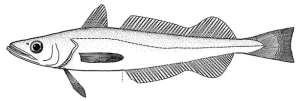
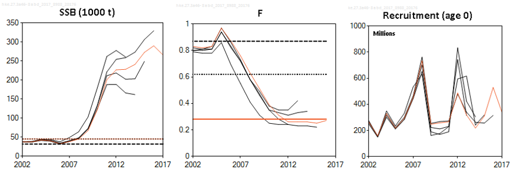

---
output:
  html_document:
    keep_md: true
    fig_height: 1
    fig_width: 1
    toc: yes
    toc_depth: 1
    toc_float: yes
    css: style.css
---
<style>
#TOC {
  background:url("images/iceslogo.png") ;
  background-size: contain;
  padding-top: 100px !important;
  background-repeat: no-repeat;
  position: fixed;
  font-size: 12px;
  left: 0;
  top: 0;
  width: 200px;
  height: 80%;
  overflow:auto;
}
</style>

# ICES advice 2018                              

## "Hake (*Merluccius merluccius*) in subareas 4, 6, and 7, and in divisions 3.a, 8.a–b, and 8.d, Northern stock (Greater North Sea, Celtic Seas, and the northern Bay of Biscay)"

Published 29 June 2018

```{r setup, include=FALSE}
knitr::opts_chunk$set(
	echo = FALSE,
	message = FALSE,
	warning = FALSE
)
#<a href="#top">Back to top</a>
```

***
```{r  out.width = "50%"}

knitr::include_graphics("images/hkemap.png")
```


[Go to latest advice](http://ices.dk/sites/pub/Publication%20Reports/Advice/2018/2018/hke.27.3a46-8abd.pdf)  
[Go to Standard Graphs page](http://standardgraphs.ices.dk/ViewCharts.aspx?key=9763)  
[Go to Transparent Assessment Framework page](https://github.com/ices-taf/2016_cod-347d)

***

# ICES advice on fishing opportunities
ICES advises that when the MSY approach is applied, catches in 2019 should be no more than **142 240** tonnes. 
 <br> 

***

# Stock development over time
The spawning-stock biomass (SSB) has increased substantially since 2006 and is well above historical estimates. Fishing mortality (F) has decreased markedly after 2005 and has been below FMSY since 2012. The two most recent recruitment (R) estimates are above the average of the time-series.

<div class= "col2"
.col2 {
    columns: 2 220px;         /* number of columns and width in pixels*/
    -webkit-columns: 2 220px; /* chrome, safari */
    -moz-columns: 2 220px;    /* firefox */
  }>
```{r sag1, echo=FALSE, fig.height=3.5, fig.width=3.5}

 library(htmlwidgets)
 library(dplyr)
 library(ggplot2)
 library(dygraphs)
 library(htmltools)
 library(widgetframe)
 library(icesSAG)
SAGsummary <- getSAG("hke.27.3a46-8abd", 2018, data = "summary", combine = TRUE, purpose = "Advice") 
data <- SAGsummary

 dyBarChart <- function(dygraph) {
  dyPlotter(dygraph = dygraph,
            name = "BarChart",
            path = system.file("examples/plotters/barchart.js",
                               package = "dygraphs"))
}

 catches <- data %>% select(Year, catches)
 catches$catches <- catches[, "catches"]/1000
 recruitment<- data %>% select(Year, low_recruitment, recruitment, high_recruitment)
 
 dygraph(catches, main = "Catches")%>%
   dyRangeSelector()%>%
   dyOptions(colors = RColorBrewer::brewer.pal(3, "Set2"), drawGrid = FALSE,maxNumberWidth = 4)%>%
   dyAxis("y")%>%
   dyBarChart()
 
 dygraph(recruitment, main = "Recruitment(age 0)") %>%
   dyRangeSelector()%>%
   # dyOptions(colors = RColorBrewer::brewer.pal(3, "Set2"))%>%
   dyAxis("y")%>%
   dyBarChart()

 
```
</div>
<div class="col2">
```{r sag3, echo = FALSE, fig.height = 3.5, fig.width = 3.5}
library(dygraphs)
library(htmlwidgets)
library(dplyr)
library(ggplot2)
library(gridExtra)
library(dygraphs)

dyBarChart <- function(dygraph) {
  dyPlotter(dygraph = dygraph,
            name = "BarChart",
            path = system.file("examples/plotters/barchart.js",
                               package = "dygraphs"))
} 

F <- data %>% select(Year, low_F, F,high_F, FLim, Fpa, FMSY )
 dygraph(F, main = "F (15-18cm length)") %>%
  dySeries(c("low_F", "F", "high_F"))%>%
   dyLimit(as.numeric(F[, 5]), color = "red")%>%
   dyRangeSelector()%>%
   dyOptions(colors = RColorBrewer::brewer.pal(3, "Set2"),
             drawGrid= FALSE,maxNumberWidth = 4)%>%
   dyAxis("y")
SSB <- data %>% select(Year, low_SSB, SSB,high_SSB, Blim, Bpa, MSYBtrigger)
 dygraph(SSB, main = "SSB") %>%
  dySeries(c("low_SSB", "SSB", "high_SSB"))%>%
   dyLimit(as.numeric(F[, 5]), color = "red")%>%
   dyRangeSelector()%>%
   dyOptions(colors = RColorBrewer::brewer.pal(3, "Set2"),
             drawGrid= FALSE,maxNumberWidth = 4)%>%
   dyAxis("y")
 
```
</div>


**Figure 1** .Summary of the stock assessment of hake in subareas 4, 6, and 7, and in divisions 3.a, 8.a–b, and 8.d, Northern stock. Complete discard estimates are available only since 2003. Recruitment and SSB plots show 95% confidence intervals (shaded area). Assumed recruitment values are unshaded.
<br>

# Summary of the assessment

 Assessment summary for hake in subareas 4, 6, and 7, and in divisions 3.a, 8.a–b, and 8.d, Northern stock. Weights are in tonnes. Highs and lows are 95% confidence intervals
<br>
<button class="btn btn-primary" data-toggle="collapse" data-target="#BlockName"> Show/Download Table </button>  
<div id="BlockName" class="collapse"> 
<br>
```{r summarysag, echo=FALSE, results= "asis"}

# library(icesSAG)
library(kableExtra)
# SAGsummary <- getSAG("hke.27.3a46-8abd", 2018, data = "summary", combine = TRUE, purpose = "Advice")
write.csv(SAGsummary, file = "SAGsummary.csv")
kable(SAGsummary, "html")%>% 
  row_spec(0, bold = T, color = "black", background = "lightgrey", align = "c")%>%
        
         kable_styling(bootstrap_options = "striped", font_size = 10)%>%
        scroll_box(width = "700px", height = "200px")


```

```{r download4}
library(magrittr)
 readLines("SAGsummary.csv") %>% 
   paste0(collapse="\n") %>% 
   openssl::base64_encode() -> encoded
```

[Download CSV](`r sprintf('data:text/csv;base64,%s', encoded)`)
</div>
<br>
<br>
[Go to Top](#top)

***  
# Stock and explotation status

<br>
**State of the stock and fishery relative to reference points**
<br>


***  

# Catch scenarios

<br>
**Table 2**  Assumptions made for the interim year and in the forecast for hake in subareas 4, 6, and 7, and in divisions 3.a, 8.a–b, and 8.d, Northern stock. All weights are in tonnes.
<br>
<style >   {
dataTable.css
}
```{r catchoptionsbasis, echo=FALSE}
library(knitr)
library(readr)
library(kableExtra)
dt <- read.csv("Data/hke/hkecatchoptionsbasis.csv",header = T, row.names = 1)
# dt <- dt [,-1] 
kable(dt, "html")%>% 
  row_spec(0, bold = T, color = "black", background = "lightgrey", align = "c")%>%
  column_spec(1, width = "20em")%>%
  column_spec(4, width = "45em")%>%
  column_spec(3, width = "15em")%>%
  kable_styling(position = "center", full_width = F, font_size = 10)

```

</style>

```{r download5}
library(magrittr)
 readLines("Data/hke/hkecatchoptionsbasis.csv") %>% 
   paste0(collapse="\n") %>% 
   openssl::base64_encode() -> encoded
```

[Download CSV](`r sprintf('data:text/csv;base64,%s', encoded)`)

<br>

***

**Table 3**  Annual catch scenarios for hake in subareas 4, 6, and 7, and in divisions 3.a, 8.a–b, and 8.d, Northern stock. All weights are in tonnes. Note: The % change in TAC is not computed because the stock area does not correspond to the area for the TAC.
<br>
<button class="btn btn-primary" data-toggle="collapse" data-target="#BlockName"> Show/Download Table </button>  
<div id="BlockName" class="collapse"> 
<br>
```{r catchoptionstable, echo=FALSE}
library(knitr)
library(readr)
library(kableExtra)
dt <- read.csv("Data/her/hkecatchoptions.csv", header = T, row.names = 1)
# dt <- dt [,-1]
dt <- dt[complete.cases(dt),]
 kable(dt, "html") %>% kable_styling(position = "center")%>%
   row_spec(0, bold = T, color = "black", background = "lightgrey")%>%
   column_spec(1, width = "30em")%>%
         column_spec(2:7, width = "10em")%>%
   group_rows("ICES advice basis",1,1) %>%
   group_rows("Other options",2,11)
```
* “Wanted” and “unwanted” catch are used to describe fish that would be landed and discarded in the absence of the EU landing obligation.
** SSB 2020 relative to SSB 2019.
*** Total catch 2019 relative to the catch advice for 2018 (115 335 tonnes).
^ Unwanted catch includes forecast unwanted catch (discards included in the assessment) and additional unwanted catch (the discards that were not included in the assessment, amounting to approximately 2.8% of the total catch).
^^ Catch option corresponds to F2018 = 0.25.
<br>
The catch for 2019 corresponding to the MSY framework is 23% higher than the advice given for 2018. The increase is mainly a consequence of the increase in SSB in 2019 as a result of strong incoming year classes.

```{r download}
library(magrittr)
 readLines("Data/hke/hkecatchoptions.csv") %>% 
   paste0(collapse="\n") %>% 
   openssl::base64_encode() -> encoded
```

[Download CSV](`r sprintf('data:text/csv;base64,%s', encoded)`)

## Catch scenarios Plots. Version 1
```{r catchoptionsgraph, echo = FALSE,fig.height = 5, fig.width = 7}
library(ggplot2)
library(plotly)
 catchoptions <- read.csv("Data/hke/hkescenariosplot.csv")
 labels <- catchoptions$Basis
 labels <- as.character(labels)
 mypalette<-ggthemes::tableau_color_pal('tableau20')
 
 data <- catchoptions[order(catchoptions$F),] 
 
 
 p1 <- plot_ly(data, x = ~F) %>%
         layout(hovermode="TRUE", showlegend = TRUE,
           shapes = list(
             list(type = "line", fillcolor = "red", 
               line    = list(color = "red",
               width = 2,
               dash = "dot"),
               opacity = 0.5,
               x0      = 0.87,
               x1      = 0.87,
               xref    = "Flim",
               y0      = 0,
               y1      = 450000,
               yref    = "y",
               name = "Flim"),
             list(type = "line", fillcolor = "green", 
               line    = list(color = "green",
               width = 2,
               dash = "dot"), 
               opacity = 0.2, 
               x0      = 0.28,
               x1      = 0.28,
               xref    = "Fmsy",
               y0      = 0,
               y1      = 450000,
               yref    = "y",
               name = "Fmsy"),
             list(type = "line", fillcolor = "orange", 
               line    = list(color = "orange",
               width = 2,
               dash = "dot"), 
               opacity = 1, 
               x0      = 0.62,
               x1      = 0.62,
               xref    = "Fpa",
               y0      = 0,
               y1      = 450000,
               yref    = "y",
               name = "Fpa"),
             list(type = "line", fillcolor = "blue", 
               line    = list(color = "blue",
               width = 2,
               dash = "dash"), 
               opacity = 0.3, 
               x0      = -0.3,
               x1      = 3,
               xref    = "x",
               y0      = 32000,
               y1      = 32000,
               yref    = "Blim",
               name = "Blim"),
             list(type = "line", fillcolor = "lightblue", 
               line    = list(color = "lightblue",
               width = 2,
               dash = "dash"), 
               opacity = 0.3, 
               x0      = -0.3,
               x1      = 3,
               xref    = "x",
               y0      = 45000,
               y1      = 45000,
               yref    = "Bpa = MSY Btrigger",
               text = "Bpa = MSY Btrigger",
               textposition = "bottom right"),
             list(type = "rect", fillcolor = "green", opacity = 0.2,
                  line = list(color = "green", opacity=0.2),
                  x0 = -0.3, x1 = 0.62, xref = "x",
                  y0 = 0, y1 = 450000, yref = "y"),
             list(type = "rect", fillcolor = "orange", opacity = 0.2,
                  line = list(color = "orange", opacity=0.2),
                  x0 = 0.62, x1 = 0.87, y0 = 0, y1 = 450000),
             list(type = "rect", fillcolor = "red", opacity = 0.2,
                  line = list(color = "red", opacity=0.2),
                  x0 = 0.87, x1 = 3, y0 = 0, y1 = 450000)),
           yaxis= list(title = 'tonnes', showgrid =FALSE),
    xaxis=list(title = 'F', showgrid= FALSE, tickmode = "array",tickvals = c(0.28,0.62,0.87), ticktext = c("Fmsy","Fpa", "Flim"), showarrow = TRUE, tickangle = 45),
    annotations=
        list(
            x= 3,
            y=c(32000,45000),
            xref= '1',
            yref='y',
            text=c('Blim','Bpa = MSY Btrigger'),
            showarrow = TRUE,
            ax= 70,
            ay= 0
        ),
        list(
            x= c(0.280, 0.620, 0.870),
            y= -10,
            xref= 'x',
            yref='1',
            text=c('Fmsy','Fpa', 'Flim'),
            showarrow = TRUE,
            ax= 30,
            ay= -50
        )
    )%>%
         add_trace(y = ~ SSB, name= 'SSB 2019', type = 'bar',opacity = 0.8, width= 0.2, color = ~ SSB,colors=c("darkblue","Yellow"), text = data$Basis, hoverinfo = "text + x+ y") %>%
          add_trace(y = ~ Catch, name = 'Catch 2018', mode = 'lines+markers',text = data$Basis, hoverinfo = "text + x+ y")
                  
  p1$elementId <- NULL
  p1
```

** Missing F legend, horizontal bar color ** 
 
## Version 2:
```{r catchoptionsgraphv2}
library(ggplot2)
library(plotly)
 catchoptions <- read.csv("Data/hke/hkescenariosplot.csv")
 labels <- catchoptions$Basis
 labels <- as.character(labels)
 mypalette<-ggthemes::tableau_color_pal('tableau20')
 
 data <- catchoptions[order(catchoptions$F),]
 p1 <- ggplot(catchoptions, aes(F, colour = )) + theme_bw() +
    geom_rect(xmin = -Inf, ymin = -Inf, xmax = 0.62, ymax = Inf,
              fill = "lightgreen", alpha=0.50)+theme_bw()+
    # geom_rect(xmin = 0.280, ymin = -Inf, xmax = 0.282, ymax = Inf,
    #           fill = "gold", alpha=0.50)+theme_bw()+
    geom_rect(xmin = 0.62, ymin = -Inf, xmax = 0.87, ymax = Inf,
              fill = "coral")+theme_bw()+
    geom_rect(xmin = 0.87, ymin = -Inf, xmax = Inf, ymax = Inf,
              fill = "brown1")+theme_bw()+
    geom_hline(yintercept=45000, linetype="dashed", color = "yellowgreen")+
    geom_hline(yintercept=32000, linetype="dashed", color = "yellow4")+
    geom_vline(xintercept = 0.28,linetype = "dotted",
               color = "violet", size = 0.5)+
    geom_vline(xintercept = 0.62, linetype="dotted",
               color = "violetred", size=0.5)+
    geom_vline(xintercept = 0.87, linetype="dotted",
               color = "violetred1", size=0.5)+
    # geom_col(aes(y = Catch), width = 0.15)+
    geom_point(aes(y = Catch),size = 2) +
    geom_line(aes(y = Catch),size = 0.5, colour= "orangered")+
    geom_point(aes(y=SSB), size = 2)+
    geom_line(aes(y = SSB),size = 0.5, colour= "lightskyblue")+
    scale_y_continuous("tonnes",sec.axis = sec_axis(~., name = "SSB"))+
    # scale_x_continuous(breaks = catchoptions$F)+
    xlab("Fish mortality")+
    ylab("Catches and SSB in tonnes")
 
  p2 <- p1 + theme(axis.text.x = element_text(face="bold", color="Black",
                             size=10, angle=45))+
    theme(legend.text = element_text(colour="blue", size = 16, face = "bold"))
  # p3<- p2+ guide_colorbar(title = "Spawning Stock Biomass", label= TRUE,barheight = )
 # p3<- p2 + geom_hline(yintercept=45000, linetype="dashed", color = "red")+
 #   geom_hline(yintercept=32000, linetype="dashed", color = "black")+
 #   geom_vline(xintercept = 0.28,
 #                 color = "yellow", size=3)+
 #   geom_vline(xintercept = 0.62, linetype="dotted",
 #                   color = "blue", size=0.5)+
 #   geom_vline(xintercept = 0.87, linetype="dotted",
 #                 color = "blue", size=0.5)


 ggplotly(p1, width = 600, height = 300)

```
  
<br>

[Go to Top](#top)

***

# Basis of the advice  
<br>
**Table 4** The basis of the advice for hake in subareas 4, 6, and 7, and in divisions 3.a, 8.a–b, and 8.d, Northern stock.
```{r advicebasis, echo=FALSE}
library(knitr)
library(readr)
library(kableExtra)
dt <- read.csv("Data/hke/hkeadvicebasis.csv", header = FALSE)
#dt <- dt [-1,] 
colnames(dt) <- NULL
kable(dt, "html")%>%kable_styling(position = "center")%>%
  column_spec(1, bold = T, color = "black", background = "lightgrey")

```
<br>

***
# Quality of the assessment  
<br>
The model confidence intervals underestimate uncertainty as they are narrower than interannual changes in estimates between consecutive assessments.

The historical FR-EVHOE-WIBTS-Q4 survey was revised and produced some minor changes in the perception of the stock. The FR-EVHOE-WIBTS-Q4 index value for 2017 was not available. However, the IE-IGFS-WIBTS-Q4 survey and the discards also provide information on recruitment. Both indices are consistent in the historical period, hence the recruitment estimate from last year is considered reliable.

Not all discards are included in the analytical assessment, but they are included in the final advice catch estimates. They represent approximately 2%–5% of the total stock catches. Discards have decreased substantially this year.

Given the expansion of the stock into northern areas (ICES, 2017a), biological sampling and discard quantification may be limited.

Owing to a lack of French market sampling of length in Q1 and Q2 of 2017 (biological and onboard sampling was unaffected), for some sampling strata length data were supplemented using data from previous years, which is considered to have limited impact (ICES, 2018).

There has been a tendency for the assessment to underestimate SSB and overestimate F in past years. However, estimates of SSB in the current assessment are close to those estimated in 2017.

<br>

```{r qualplots}

```

**Figure 2**  Historical assessment results for hake in subareas 4, 6, and 7, and in divisions 3.a, 8.a–b, and 8.d, Northern stock.
<br>

***

# Issues relevant for the advice

Discarding of juvenile hake (undersized and above minimum size) can be substantial in some areas and fleets. In the most recent period, discarding of large individuals increased because of quota restrictions in certain fleets. In 2017, observed discards decreased.

Some fleets fishing this stock have been under the EU landing obligation since 2016.


***

# Reference Points  
<br>
**Table 5** Reference points, values, and their technical basis for hake in subareas 4, 6, and 7, and in divisions 3.a, 8.a–b, and 8.d, Northern stock.
```{r referencepoints, echo=FALSE}
library(knitr)
library(readr)
library(kableExtra)
dt <- read.csv("Data/hke/hkereferencepoints.csv")
dt <- dt [,-1] 
kable(dt, "html")%>%kable_styling(position = "center")%>%
  row_spec(0, bold = T, color = "black", background = "lightgrey")%>%
        collapse_rows(columns = 1)

```
<br>

```{r download2}
library(magrittr)
 readLines("Data/hke/hkereferencepoints.csv") %>% 
   paste0(collapse="\n") %>% 
   openssl::base64_encode() -> encoded
```
[Download CSV](`r sprintf('data:text/csv;base64,%s', encoded)`)

***
# Basis of the assessment  
<br>

**Table 6**  Basis of the assessment and advice for hake in subareas 4, 6, and 7, and in divisions 3.a, 8.a–b, and 8.d, Northern stock.
```{r advicebla, echo=FALSE}
library(knitr)
library(readr)
library(kableExtra)
dt <- read.csv("Data/hke/hkeassessmentbasis.csv", header = FALSE)
dt <- dt [,-1] 
colnames(dt) <- NULL
kable(dt, "html")%>%kable_styling(position = "center")%>%
  column_spec(1, width = "15em",bold = T, color = "black", background = "lightgrey")
```

```{r download7}
library(magrittr)
 readLines("Data/hke/hkeassessmentbasis.csv") %>% 
   paste0(collapse="\n") %>% 
   openssl::base64_encode() -> encoded
```
[Download CSV](`r sprintf('data:text/csv;base64,%s', encoded)`)

*** 
# Information from stakeholders  

There is no information available

***
# History of the advice, catch, and management    

**Table 7**  ICES advice and catch for hake in subareas 4, 6, and 7, and in divisions 3.a, 8.a–b, and 8.d, Northern stock. All weights are in tonnes. 

** This table should be hidden**

<br>
```{r history, echo=FALSE }
library(icesSAG)
library(kableExtra)
dt <- read.csv("Data/hke/hkecatchhistory.csv")
# dt <- dt [,-1] 
colnames(dt) <- c("Year", "ICES advice", "Pred. Catch", "Pred. landings","TAC", "ICES landings", "Discards", "ICES catch")
kable(dt, "html")%>% 
  column_spec(2, width = "20em")%>%
        kable_styling(position = "center")%>%
        row_spec(0, bold = T, color = "black", background = "lightgrey")
```
* Sum of area TACs, corresponding to northern stock plus Division 2.a (EC zone only).
** Partial discard estimates are available and used in the assessment. For remaining years for which no values are presented, some estimates are available but not considered valid and thus not used in the assessment.

```{r downloadhistory}
library(magrittr)
 readLines("Data/hke/hkecatchhistory.csv") %>% 
   paste0(collapse="\n") %>% 
   openssl::base64_encode() -> encoded
```

[Download CSV](`r sprintf('data:text/csv;base64,%s', encoded)`) 
<br>
<br> 


***

# History of the catch and landings  

**Table 8** Catch distribution by fleet in 2017 as estimated by ICES for hake in subareas 4, 6, and 7, and in divisions 3.a, 8.a–b, and 8.d, Northern stock. All weights are in tonnes.
```{r catchlandings, echo = FALSE}
library(kableExtra)
dt <- read.csv("Data/hke/hkelandhist.csv", header = FALSE)
colnames(dt) <- NULL
# kable(dt, "html")%>%kable_styling(position = "center")%>%
#         add_header_above(c("Catch" = 1, "Landings" = 4, "Discards" = 1))%>%
#   row_spec(0, bold = T, color = "black", background = "lightgrey")%>%
#         collapse_rows(columns = 1)
```

** Missing small table**

<br>

***

**Table 9** History of commercial catch and landings of hake in subareas 4, 6, and 7, and in divisions 3.a, 8.a–b, and 8.d, Northern stock. Both the official and ICES estimated values are presented by area for each country participating in the fishery. All weights are in tonnes.

**Missing big table**

* Spanish data for 1961–1972 are not revised; data for Subarea 8 for 1973–1978 include data for divisions 8.a,b only. Data for 1979–1981 are revised based on French surveillance data. Divisions 3.a and 4.b,c are included in the column "3.a, 4, and 6" only after 1976. There are some unallocated landings ( moreover for the period 1961–1970).
** Discard estimates from observer programmes. In years marked with # partial discard estimates are available and used in the assessment. For the remaining years where no values are presented, some estimates are available but are not considered valid and thus not used in the assessment. In the years with data only Spanish discards, and discards from French Nephrops trawlers are included.
*** The working group used total catches from 1978.
^ Unallocated landings for the years 2011–2014 were revised in 2015.
# See ** footnote.

***

# Sources and references  


* EU. 2018.  Proposal for a REGULATION OF THE EUROPEAN PARLIAMENT AND OF THE COUNCIL establishing a multiannual plan for fish stocks in the Western Waters and adjacent waters, and for fisheries exploiting those stocks, amending Regulation (EU) 2016/1139 establishing a multiannual plan for the Baltic Sea, and repealing Regulations (EC) No 811/2004, (EC) No 2166/2005, (EC) No 388/2006, (EC) 509/2007 and (EC) 1300/2008.  COM/2018/0149 final. https://eur-lex.europa.eu/legal-content/EN/TXT/PDF/?uri=CELEX:52018PC0149&from=EN
* EU. 2004. COUNCIL REGULATION (EC) No. 811/2004 of 21.4.2004 establishing measures for the recovery of the Northern hake stock. Official Journal of the European Union, L 150/1. http://eur-lex.europa.eu/LexUriServ/LexUriServ.do?uri=OJ:L:2004:150:0001:0011:EN:PDF.
* ICES. 2014. Report of the Benchmark Workshop on Southern Megrim and Hake (WKSOUTH), 3–7 February 2014, Copenhagen, Denmark. ICES CM 2014/ACOM:40. 236 pp.
* ICES. 2016a. EU request to ICES to provide FMSY ranges for selected stocks in ICES subareas 5 to 10. In Report of the ICES Advisory Committee, 2016. ICES Advice 2016, Book 5, Section 5.4.1.
* ICES. 2016b. Report of the Workshop to consider FMSY ranges for stocks in ICES categories 1 and 2 in Western Waters (WKMSYREF4), 13–16 October 2015, Brest, France. ICES CM 2015/ACOM:58. 183 pp.
* ICES. 2016c. Advice basis. In Report of the ICES Advisory Committee, 2016. ICES Advice 2016, Book 1, Section 1.2.
* ICES. 2017a. Report of the Working Group on Mixed-Fisheries Advice (WGMIXFISH-ADVICE), 22–26 May 2017, ICES Headquarters, Copenhagen, Denmark. ICES CM 2017/ACOM:18. In preparation.
* ICES. 2017b. Report of the Working Group for the Bay of Biscay and Iberian waters Ecoregion (WGBIE). 4-11 May 2017. Cadiz, Spain. ICES CM 2017/ACOM:12. 534 pp.
* ICES. 2018. Report of the Working Group for the Bay of Biscay and the Iberian Waters Ecoregion (WGBIE), 3 –10 May 2018, ICES HQ, Copenhagen, Denmark. ICES CM 2018/ACOM:12. 642 pp.
* Martin, I. 1991. A preliminary analysis of some biological aspects of hake (Merluccius merluccius L. 1758) in the Bay of Biscay. ICES CM 1991/G:54. 31 pp.


