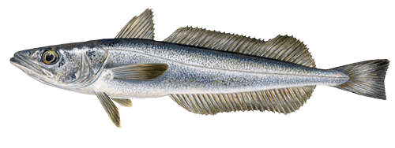
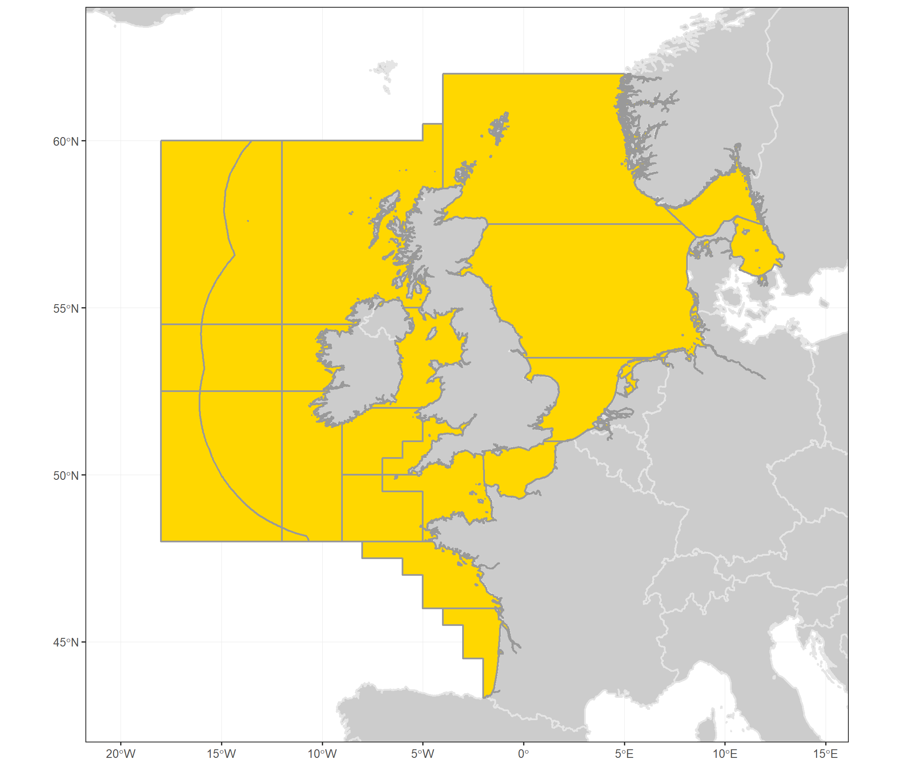
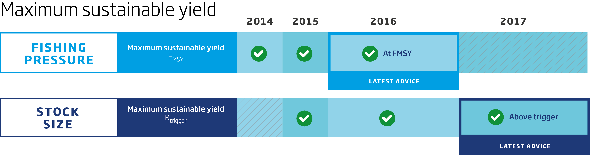

---
output:
  html_document:
    keep_md: true
    fig_height: 1
    fig_width: 1
    toc: yes
    toc_depth: 1
    toc_float: yes
  pdf_document:
    toc: yes
    toc_depth: '2'
    code_folding: hide
---

---

# ICES advice 2018

## "Hake (*Merluccius merluccius*) in subareas 4, 6, and 7, and in divisions 3.a, 8.a–b, and 8.d, Northern stock (Greater North Sea, Celtic Seas, and the northern Bay of Biscay)"

***

[Go to latest advice](http://ices.dk/sites/pub/Publication%20Reports/Advice/2017/2017/hke.27.3a46-8abd.pdf)  
[Go to Standard Graphs page](https://standardgraphs.ices.dk/manage/ViewGraphsAndTables.aspx?key=8988)  
[Go to Transparent Assessment Framework page](https://github.com/ices-taf/2016_cod-347d)

***

# ICES advice on fishing opportunities
ICES advises that when the MSY approach is applied, catches in 2018 should be no more than **115 335** tonnes.
   

***

# Stock development over time
The spawning-stock biomass (SSB) has increased significantly since 2006 and is well above historical estimates. Fishing mortality (F) has decreased significantly after 2005, and has been below FMSY since 2012. The recruitment (R) estimate for 2016 is above average

<!--html_preserve-->

<!--/html_preserve--><!--html_preserve-->

<!--/html_preserve-->

<!--html_preserve-->

<!--/html_preserve--><!--html_preserve-->

<!--/html_preserve-->

**Figure 1**  Hake in subareas 4, 6, and 7, and in divisions 3.a, 8.a–b, and 8.d, Northern stock. Summary of the stock assessment.Recruitment, F, and SSB plots show 95% confidence intervals (shaded area). Assumed recruitment values are unshaded.
 

## Summary of the assessment

Hake in subareas 4, 6, and 7, and in divisions 3.a, 8.a–b, and 8.d, Northern stock. Assessment summary. Weights are in tonnes. Highs and lows are 95% confidence intervals

[Download CSV](data:text/csv;base64,IiIsIlllYXIiLCJyZWNydWl0bWVudCIsImhpZ2hfcmVjcnVpdG1lbnQiLCJsb3dfcmVjcnVpdG1lbnQiLCJsb3dfU1NCIiwiU1NCIiwiaGlnaF9TU0IiLCJjYXRjaGVzIiwibGFuZGluZ3MiLCJkaXNjYXJkcyIsImxvd19GIiwiRiIsImhpZ2hfRiIsIlN0b2NrUHVibGlzaE5vdGUiLCJQdXJwb3NlIiwiRmFnZSIsImZpc2hzdG9jayIsInJlY3J1aXRtZW50X2FnZSIsIkFzc2Vzc21lbnRZZWFyIiwidW5pdHMiLCJzdG9ja1NpemVEZXNjcmlwdGlvbiIsInN0b2NrU2l6ZVVuaXRzIiwiZmlzaGluZ1ByZXNzdXJlRGVzY3JpcHRpb24iLCJmaXNoaW5nUHJlc3N1cmVVbml0cyIKIjEiLDE5NzgsMzA0MTEyLDM2MjcxMSwyNTQ5ODAsNjM4MTEsNzY2OTYsODk1ODEsNTA1NTEsNTA1NTEsMCwwLjQ3NSwwLjUyLDAuNTY1LCJTdG9jayBwdWJsaXNoZWQiLCJBZHZpY2UiLE5BLCJoa2UuMjcuM2E0Ni04YWJkIiwwLDIwMTcsInRvbm5lcyIsIlNTQiIsInRvbm5lcyIsIkYiLCJwZXIgeWVhciIKIjIiLDE5NzksMjgzNTM0LDM0MjUxMSwyMzQ3MTQsODczNDksOTc5MTEsMTA4NDczLDUxMDk2LDUxMDk2LDAsMC40OTksMC41NSwwLjYwMSwiU3RvY2sgcHVibGlzaGVkIiwiQWR2aWNlIixOQSwiaGtlLjI3LjNhNDYtOGFiZCIsMCwyMDE3LCJ0b25uZXMiLCJTU0IiLCJ0b25uZXMiLCJGIiwicGVyIHllYXIiCiIzIiwxOTgwLDMxNjQ4OSwzNzY3MzcsMjY1ODc0LDkwNDQwLDEwMDQ4MywxMTA1MjYsNTcyNjUsNTcyNjUsMCwwLjU4NywwLjY1LDAuNzEzLCJTdG9jayBwdWJsaXNoZWQiLCJBZHZpY2UiLE5BLCJoa2UuMjcuM2E0Ni04YWJkIiwwLDIwMTcsInRvbm5lcyIsIlNTQiIsInRvbm5lcyIsIkYiLCJwZXIgeWVhciIKIjQiLDE5ODEsNTk5NTQwLDY4MDMxMSw1MjgzNTksNzcwODYsODY0NzUsOTU4NjMsNTM5MTgsNTM5MTgsMCwwLjU4OCwwLjY3LDAuNzUyLCJTdG9jayBwdWJsaXNoZWQiLCJBZHZpY2UiLE5BLCJoa2UuMjcuM2E0Ni04YWJkIiwwLDIwMTcsInRvbm5lcyIsIlNTQiIsInRvbm5lcyIsIkYiLCJwZXIgeWVhciIKIjUiLDE5ODIsNDE4Mzk2LDQ4NzY4MiwzNTg5NTQsNjE1NzQsNzAzOTgsNzkyMjIsNTQ5OTQsNTQ5OTQsMCwwLjYzMSwwLjY5LDAuNzQ5LCJTdG9jayBwdWJsaXNoZWQiLCJBZHZpY2UiLE5BLCJoa2UuMjcuM2E0Ni04YWJkIiwwLDIwMTcsInRvbm5lcyIsIlNTQiIsInRvbm5lcyIsIkYiLCJwZXIgeWVhciIKIjYiLDE5ODMsMTUyMTYwLDE5MTEwOSwxMjExNDksNjExMTYsNjkxNTgsNzcyMDAsNTc1MDcsNTc1MDcsMCwwLjU4OSwwLjYzLDAuNjcxLCJTdG9jayBwdWJsaXNoZWQiLCJBZHZpY2UiLE5BLCJoa2UuMjcuM2E0Ni04YWJkIiwwLDIwMTcsInRvbm5lcyIsIlNTQiIsInRvbm5lcyIsIkYiLCJwZXIgeWVhciIKIjciLDE5ODQsMjk1OTAwLDM0MzgzMCwyNTQ2NTMsNzYwMjgsODM2MjAsOTEyMTMsNjMyODYsNjMyODYsMCwwLjYxNCwwLjY3LDAuNzI2LCJTdG9jayBwdWJsaXNoZWQiLCJBZHZpY2UiLE5BLCJoa2UuMjcuM2E0Ni04YWJkIiwwLDIwMTcsInRvbm5lcyIsIlNTQiIsInRvbm5lcyIsIkYiLCJwZXIgeWVhciIKIjgiLDE5ODUsNjg2NzAzLDc2NjUyNiw2MTUxOTIsNzM2MjgsODAzMTIsODY5OTUsNTYwOTksNTYwOTksMCwwLjY5NiwwLjgsMC45MDQsIlN0b2NrIHB1Ymxpc2hlZCIsIkFkdmljZSIsTkEsImhrZS4yNy4zYTQ2LThhYmQiLDAsMjAxNywidG9ubmVzIiwiU1NCIiwidG9ubmVzIiwiRiIsInBlciB5ZWFyIgoiOSIsMTk4Niw0MTIyODksNDYyOTgxLDM2NzE0Nyw1NDk1Myw2MTAxMiw2NzA3MSw1NzA5Miw1NzA5MiwwLDAuODQzLDAuOTEsMC45NzcsIlN0b2NrIHB1Ymxpc2hlZCIsIkFkdmljZSIsTkEsImhrZS4yNy4zYTQ2LThhYmQiLDAsMjAxNywidG9ubmVzIiwiU1NCIiwidG9ubmVzIiwiRiIsInBlciB5ZWFyIgoiMTAiLDE5ODcsNDg3MzI5LDU0MDg1OCw0MzkwOTgsNDIxNzgsNDcyMjgsNTIyNzgsNjMzNjksNjMzNjksMCwwLjk0MywxLDEuMDU3LCJTdG9jayBwdWJsaXNoZWQiLCJBZHZpY2UiLE5BLCJoa2UuMjcuM2E0Ni04YWJkIiwwLDIwMTcsInRvbm5lcyIsIlNTQiIsInRvbm5lcyIsIkYiLCJwZXIgeWVhciIKIjExIiwxOTg4LDUzMDkwMiw1ODM0MTEsNDgzMTE3LDQ1MjczLDQ5Njg4LDU0MTAzLDY0ODIzLDY0ODIzLDAsMC45NTMsMS4wMiwxLjA4NywiU3RvY2sgcHVibGlzaGVkIiwiQWR2aWNlIixOQSwiaGtlLjI3LjNhNDYtOGFiZCIsMCwyMDE3LCJ0b25uZXMiLCJTU0IiLCJ0b25uZXMiLCJGIiwicGVyIHllYXIiCiIxMiIsMTk4OSw1MDY0NjQsNTUyNTUwLDQ2NDIyMiw0MzkzNiw0Nzc2Miw1MTU4Nyw2NjQ3Myw2NjQ3MywwLDEuMDIyLDEuMDksMS4xNTgsIlN0b2NrIHB1Ymxpc2hlZCIsIkFkdmljZSIsTkEsImhrZS4yNy4zYTQ2LThhYmQiLDAsMjAxNywidG9ubmVzIiwiU1NCIiwidG9ubmVzIiwiRiIsInBlciB5ZWFyIgoiMTMiLDE5OTAsNTM4NDYzLDU4NTYyMiw0OTUxMDEsNDExODUsNDQyOTUsNDc0MDQsNTk5NTQsNTk5NTQsMCwwLjkyLDEsMS4wOCwiU3RvY2sgcHVibGlzaGVkIiwiQWR2aWNlIixOQSwiaGtlLjI3LjNhNDYtOGFiZCIsMCwyMDE3LCJ0b25uZXMiLCJTU0IiLCJ0b25uZXMiLCJGIiwicGVyIHllYXIiCiIxNCIsMTk5MSwzMTc4MjEsMzQ5MTE2LDI4OTMzMSw0MTU1MSw0NDUzOSw0NzUyNyw1ODEyOSw1ODEyOSwwLDAuODkxLDAuOTQsMC45ODksIlN0b2NrIHB1Ymxpc2hlZCIsIkFkdmljZSIsTkEsImhrZS4yNy4zYTQ2LThhYmQiLDAsMjAxNywidG9ubmVzIiwiU1NCIiwidG9ubmVzIiwiRiIsInBlciB5ZWFyIgoiMTUiLDE5OTIsMzMwNTU5LDM2MTU3MywzMDIyMDUsNDIyMTEsNDUyNjgsNDgzMjUsNTY2MTcsNTY2MTcsMCwwLjk1NiwxLjAxLDEuMDY0LCJTdG9jayBwdWJsaXNoZWQiLCJBZHZpY2UiLE5BLCJoa2UuMjcuM2E0Ni04YWJkIiwwLDIwMTcsInRvbm5lcyIsIlNTQiIsInRvbm5lcyIsIkYiLCJwZXIgeWVhciIKIjE2IiwxOTkzLDYwMjc1NCw2NDA1MDAsNTY3MjMwLDQwNTI1LDQzMjA1LDQ1ODg2LDUyMTQ0LDUyMTQ0LDAsMS4wMDksMS4wOCwxLjE1MSwiU3RvY2sgcHVibGlzaGVkIiwiQWR2aWNlIixOQSwiaGtlLjI3LjNhNDYtOGFiZCIsMCwyMDE3LCJ0b25uZXMiLCJTU0IiLCJ0b25uZXMiLCJGIiwicGVyIHllYXIiCiIxNyIsMTk5NCwzMjk3ODQsMzU0NDMzLDMwNjg1MSwzMTEwOSwzMzM2NiwzNTYyMiw1MTI1OSw1MTI1OSwwLDEuMDU0LDEuMSwxLjE0NiwiU3RvY2sgcHVibGlzaGVkIiwiQWR2aWNlIixOQSwiaGtlLjI3LjNhNDYtOGFiZCIsMCwyMDE3LCJ0b25uZXMiLCJTU0IiLCJ0b25uZXMiLCJGIiwicGVyIHllYXIiCiIxOCIsMTk5NSwxNjU2MDMsMTgwNjExLDE1MTg0MiwzMDEwNiwzMjEzNCwzNDE2Miw1NzYyMSw1NzYyMSwwLDEuMDg2LDEuMTMsMS4xNzQsIlN0b2NrIHB1Ymxpc2hlZCIsIkFkdmljZSIsTkEsImhrZS4yNy4zYTQ2LThhYmQiLDAsMjAxNywidG9ubmVzIiwiU1NCIiwidG9ubmVzIiwiRiIsInBlciB5ZWFyIgoiMTkiLDE5OTYsNDAxODgwLDQyNzE0MywzNzgxMDksMzUyMjksMzczMDYsMzkzODMsNDcyMTAsNDcyMTAsMCwwLjk1NywxLjAxLDEuMDYzLCJTdG9jayBwdWJsaXNoZWQiLCJBZHZpY2UiLE5BLCJoa2UuMjcuM2E0Ni04YWJkIiwwLDIwMTcsInRvbm5lcyIsIlNTQiIsInRvbm5lcyIsIkYiLCJwZXIgeWVhciIKIjIwIiwxOTk3LDI3NTg0OCwyOTkwNzIsMjU0NDI3LDI5NzI5LDMxNjUxLDMzNTc0LDQyNDY1LDQyNDY1LDAsMS4wMTcsMS4wNywxLjEyMywiU3RvY2sgcHVibGlzaGVkIiwiQWR2aWNlIixOQSwiaGtlLjI3LjNhNDYtOGFiZCIsMCwyMDE3LCJ0b25uZXMiLCJTU0IiLCJ0b25uZXMiLCJGIiwicGVyIHllYXIiCiIyMSIsMTk5OCw0NTI2NTYsNDgzNjc1LDQyMzYyNiwyNDM4MSwyNTk5NywyNzYxMywzNTA2MCwzNTA2MCwwLDAuOTQ1LDEuMDEsMS4wNzUsIlN0b2NrIHB1Ymxpc2hlZCIsIkFkdmljZSIsTkEsImhrZS4yNy4zYTQ2LThhYmQiLDAsMjAxNywidG9ubmVzIiwiU1NCIiwidG9ubmVzIiwiRiIsInBlciB5ZWFyIgoiMjIiLDE5OTksMjIzMzc4LDI0MjY5MCwyMDU2MDUsMjc0MDQsMjkxNDcsMzA4OTEsMzk4MTQsMzk4MTQsMCwwLjk0MywwLjk5LDEuMDM3LCJTdG9jayBwdWJsaXNoZWQiLCJBZHZpY2UiLE5BLCJoa2UuMjcuM2E0Ni04YWJkIiwwLDIwMTcsInRvbm5lcyIsIlNTQiIsInRvbm5lcyIsIkYiLCJwZXIgeWVhciIKIjIzIiwyMDAwLDE5OTEzNSwyMTQ3OTksMTg0NjEzLDMwMDk4LDMxOTcxLDMzODQ1LDQyMDI2LDQyMDI2LDAsMC44NzYsMC45MiwwLjk2NCwiU3RvY2sgcHVibGlzaGVkIiwiQWR2aWNlIixOQSwiaGtlLjI3LjNhNDYtOGFiZCIsMCwyMDE3LCJ0b25uZXMiLCJTU0IiLCJ0b25uZXMiLCJGIiwicGVyIHllYXIiCiIyNCIsMjAwMSwzNDE5MjYsMzY0MDI3LDMyMTE2OSwzNTQyOCwzNzUxNCwzOTYwMCwzNjY3NSwzNjY3NSwwLDAuNzMsMC43OCwwLjgzLCJTdG9jayBwdWJsaXNoZWQiLCJBZHZpY2UiLE5BLCJoa2UuMjcuM2E0Ni04YWJkIiwwLDIwMTcsInRvbm5lcyIsIlNTQiIsInRvbm5lcyIsIkYiLCJwZXIgeWVhciIKIjI1IiwyMDAyLDI2NTMyOCwyODM0NTUsMjQ4MzYwLDM1NDc3LDM3NzY5LDQwMDYxLDQwMTA1LDQwMTA1LDAsMC43ODYsMC44MywwLjg3NCwiU3RvY2sgcHVibGlzaGVkIiwiQWR2aWNlIixOQSwiaGtlLjI3LjNhNDYtOGFiZCIsMCwyMDE3LCJ0b25uZXMiLCJTU0IiLCJ0b25uZXMiLCJGIiwicGVyIHllYXIiCiIyNiIsMjAwMywxNTcxNDMsMTY5Mzc4LDE0NTc5MiwzNTE2MiwzNzU0MywzOTkyNSw0NDU1NSw0MzE2MiwxMzkzLDAuNzgyLDAuODIsMC44NTgsIlN0b2NrIHB1Ymxpc2hlZCIsIkFkdmljZSIsTkEsImhrZS4yNy4zYTQ2LThhYmQiLDAsMjAxNywidG9ubmVzIiwiU1NCIiwidG9ubmVzIiwiRiIsInBlciB5ZWFyIgoiMjciLDIwMDQsMzI5MDU1LDM0ODQ4OSwzMTA3MDUsMzk2MzEsNDIxMzksNDQ2NDcsNDkwMjksNDY0MTYsMjYxNCwwLjc3OSwwLjgzLDAuODgxLCJTdG9jayBwdWJsaXNoZWQiLCJBZHZpY2UiLE5BLCJoa2UuMjcuM2E0Ni04YWJkIiwwLDIwMTcsInRvbm5lcyIsIlNTQiIsInRvbm5lcyIsIkYiLCJwZXIgeWVhciIKIjI4IiwyMDA1LDIxNzI4NSwyMzI1ODksMjAyOTg4LDM3NTg3LDQwMTEzLDQyNjM4LDUxMTMzLDQ2NTUwLDQ1ODMsMC45MjMsMC45NywxLjAxNywiU3RvY2sgcHVibGlzaGVkIiwiQWR2aWNlIixOQSwiaGtlLjI3LjNhNDYtOGFiZCIsMCwyMDE3LCJ0b25uZXMiLCJTU0IiLCJ0b25uZXMiLCJGIiwicGVyIHllYXIiCiIyOSIsMjAwNiwyOTI2NzQsMzA5OTA0LDI3NjQwMywzMDE3NiwzMjQ3NSwzNDc3NCw0MjY5MSw0MTQ2OSwxMjIyLDAuODIzLDAuODcsMC45MTcsIlN0b2NrIHB1Ymxpc2hlZCIsIkFkdmljZSIsTkEsImhrZS4yNy4zYTQ2LThhYmQiLDAsMjAxNywidG9ubmVzIiwiU1NCIiwidG9ubmVzIiwiRiIsInBlciB5ZWFyIgoiMzAiLDIwMDcsNDUyNzIzLDQ3OTY5MCw0MjcyNzIsMzU1ODMsMzgyODEsNDA5NzksNDcyNTgsNDUwOTMsMjE2NSwwLjcxMiwwLjc2LDAuODA4LCJTdG9jayBwdWJsaXNoZWQiLCJBZHZpY2UiLE5BLCJoa2UuMjcuM2E0Ni04YWJkIiwwLDIwMTcsInRvbm5lcyIsIlNTQiIsInRvbm5lcyIsIkYiLCJwZXIgeWVhciIKIjMxIiwyMDA4LDczNDMyOCw3NzQwMDUsNjk2Njg1LDQxMjUzLDQ0NzMzLDQ4MjEyLDUxMTkwLDQ3ODIyLDMzNjgsMC41ODQsMC42MywwLjY3NiwiU3RvY2sgcHVibGlzaGVkIiwiQWR2aWNlIixOQSwiaGtlLjI3LjNhNDYtOGFiZCIsMCwyMDE3LCJ0b25uZXMiLCJTU0IiLCJ0b25uZXMiLCJGIiwicGVyIHllYXIiCiIzMiIsMjAwOSwyNDcxNzYsMjY5NTQyLDIyNjY2NCw2MTY4NSw2NzAzNCw3MjM4Myw2OTgxNCw1ODc4MSwxMTAzMywwLjQ3NSwwLjUxLDAuNTQ1LCJTdG9jayBwdWJsaXNoZWQiLCJBZHZpY2UiLE5BLCJoa2UuMjcuM2E0Ni04YWJkIiwwLDIwMTcsInRvbm5lcyIsIlNTQiIsInRvbm5lcyIsIkYiLCJwZXIgeWVhciIKIjMzIiwyMDEwLDI1NzUyOCwyNzkwNjgsMjM3NjQ5LDExMzc4MywxMjMwODksMTMyMzk1LDg0ODc4LDcyNzYwLDEyMTE4LDAuMzY1LDAuMzksMC40MTUsIlN0b2NrIHB1Ymxpc2hlZCIsIkFkdmljZSIsTkEsImhrZS4yNy4zYTQ2LThhYmQiLDAsMjAxNywidG9ubmVzIiwiU1NCIiwidG9ubmVzIiwiRiIsInBlciB5ZWFyIgoiMzQiLDIwMTEsMjY1NDg2LDI5MDY4MiwyNDI0NzQsMTg1NTI4LDIwMTA0OSwyMTY1NzAsMTAxNDAzLDg3NTAwLDEzOTAzLDAuMjg4LDAuMzEsMC4zMzIsIlN0b2NrIHB1Ymxpc2hlZCIsIkFkdmljZSIsTkEsImhrZS4yNy4zYTQ2LThhYmQiLDAsMjAxNywidG9ubmVzIiwiU1NCIiwidG9ubmVzIiwiRiIsInBlciB5ZWFyIgoiMzUiLDIwMTIsNDg3MzMwLDUzNTMxNyw0NDM2NDUsMjA2Mzc1LDIyNzAyNiwyNDc2NzcsMTAwNDcwLDg1NjAwLDE0ODcwLDAuMjM4LDAuMjYsMC4yODIsIlN0b2NrIHB1Ymxpc2hlZCIsIkFkdmljZSIsTkEsImhrZS4yNy4zYTQ2LThhYmQiLDAsMjAxNywidG9ubmVzIiwiU1NCIiwidG9ubmVzIiwiRiIsInBlciB5ZWFyIgoiMzYiLDIwMTMsMzE4ODM3LDM2MDM3NiwyODIwODgsMjAzMjcyLDIyODI0NiwyNTMyMjAsOTMxMDgsNzc3MDgsMTU0MDAsMC4yMzMsMC4yNiwwLjI4NywiU3RvY2sgcHVibGlzaGVkIiwiQWR2aWNlIixOQSwiaGtlLjI3LjNhNDYtOGFiZCIsMCwyMDE3LCJ0b25uZXMiLCJTU0IiLCJ0b25uZXMiLCJGIiwicGVyIHllYXIiCiIzNyIsMjAxNCwyMTc0ODksMjUxOTQ3LDE4Nzc0NCwyMTAxNTcsMjQxMTE3LDI3MjA3Nyw5OTcwMCw4OTkwMCw5ODAwLDAuMjI4LDAuMjYsMC4yOTIsIlN0b2NrIHB1Ymxpc2hlZCIsIkFkdmljZSIsTkEsImhrZS4yNy4zYTQ2LThhYmQiLDAsMjAxNywidG9ubmVzIiwiU1NCIiwidG9ubmVzIiwiRiIsInBlciB5ZWFyIgoiMzgiLDIwMTUsMzA5OTY4LDM2ODU0MCwyNjA3MDMsMjMwODg1LDI3Mjc5NSwzMTQ3MDUsMTA1OTAwLDk1MDAwLDEwOTAwLDAuMjEyLDAuMjUsMC4yODgsIlN0b2NrIHB1Ymxpc2hlZCIsIkFkdmljZSIsTkEsImhrZS4yNy4zYTQ2LThhYmQiLDAsMjAxNywidG9ubmVzIiwiU1NCIiwidG9ubmVzIiwiRiIsInBlciB5ZWFyIgoiMzkiLDIwMTYsNTI5NDU4LDY2OTk0OCw0MTg0MjksMjM0ODk4LDI5MDIzNCwzNDU1NzAsMTE4NjM0LDEwNzUzNCwxMTEwMCwwLjIxNiwwLjI3LDAuMzI0LCJTdG9jayBwdWJsaXNoZWQiLCJBZHZpY2UiLE5BLCJoa2UuMjcuM2E0Ni04YWJkIiwwLDIwMTcsInRvbm5lcyIsIlNTQiIsInRvbm5lcyIsIkYiLCJwZXIgeWVhciIKIjQwIiwyMDE3LDMzNTA3MSwzNzAxMTUsMzAzMzQ2LDE5NzAwMCwyNjU2NjYsMzM0MzMxLE5BLE5BLE5BLE5BLE5BLE5BLCJTdG9jayBwdWJsaXNoZWQiLCJBZHZpY2UiLE5BLCJoa2UuMjcuM2E0Ni04YWJkIiwwLDIwMTcsInRvbm5lcyIsIlNTQiIsInRvbm5lcyIsIkYiLCJwZXIgeWVhciI=)
 ***  
[Go to Top](#top)

# Stock and explotation status

 
**State of the stock and fishery relative to reference points**
 

***  

# Catch scenarios

 
**Table 2 Hake in subareas 4, 6, and 7, and in divisions 3.a, 8.a–b, and 8.d, Northern stock. The basis for the catch scenarios. All weights are in tonnes.**
 
<table class="table" style="font-size: 7px; margin-left: auto; margin-right: auto;">
 <thead>
  <tr>
   <th style="text-align:left;font-weight: bold;color: black;background-color: lightgrey;text-align: center;"> Variable </th>
   <th style="text-align:right;font-weight: bold;color: black;background-color: lightgrey;text-align: center;"> Value </th>
   <th style="text-align:left;font-weight: bold;color: black;background-color: lightgrey;text-align: center;"> Source </th>
   <th style="text-align:left;font-weight: bold;color: black;background-color: lightgrey;text-align: center;"> Notes </th>
  </tr>
 </thead>
<tbody>
  <tr>
   <td style="text-align:left;width: 20em; "> F (2017) </td>
   <td style="text-align:right;"> 0.26 </td>
   <td style="text-align:left;width: 15em; "> ICES (2017a) </td>
   <td style="text-align:left;width: 45em; "> Mean F(2014–2016). </td>
  </tr>
  <tr>
   <td style="text-align:left;width: 20em; "> SSB (2018) </td>
   <td style="text-align:right;"> 267673.00 </td>
   <td style="text-align:left;width: 15em; "> ICES (2017a) </td>
   <td style="text-align:left;width: 45em; ">  </td>
  </tr>
  <tr>
   <td style="text-align:left;width: 20em; "> R (2017/2018) </td>
   <td style="text-align:right;"> 335071.00 </td>
   <td style="text-align:left;width: 15em; "> ICES (2017a) </td>
   <td style="text-align:left;width: 45em; "> GM (1978–2014); in thousands. </td>
  </tr>
  <tr>
   <td style="text-align:left;width: 20em; "> Total catch (2017) </td>
   <td style="text-align:right;"> 105223.00 </td>
   <td style="text-align:left;width: 15em; "> ICES (2017a) </td>
   <td style="text-align:left;width: 45em; "> Forecasted catch from the assessment model (based on F(2017) = Mean F(2014–2016) plus additional discards. </td>
  </tr>
  <tr>
   <td style="text-align:left;width: 20em; "> Wanted catch (2017) </td>
   <td style="text-align:right;"> 93588.00 </td>
   <td style="text-align:left;width: 15em; "> ICES (2017a) </td>
   <td style="text-align:left;width: 45em; "> Based on average discard rates observed during 2014–2016. </td>
  </tr>
  <tr>
   <td style="text-align:left;width: 20em; "> Unwanted catch (2017) </td>
   <td style="text-align:right;"> 11635.00 </td>
   <td style="text-align:left;width: 15em; "> ICES (2017a) </td>
   <td style="text-align:left;width: 45em; "> Based on average discard rates observed during 2014–2016. </td>
  </tr>
</tbody>
</table>

 

***

**Table 3 Hake in subareas 4, 6, and 7, and in divisions 3.a, 8.a–b, and 8.d, Northern stock. Annual catch options. All weights are in tonnes.**

<button class="btn btn-primary" data-toggle="collapse" data-target="#BlockName"> Show/Download Table </button>  

 
 
<table class="table" style="margin-left: auto; margin-right: auto;">
 <thead>
  <tr>
   <th style="text-align:left;font-weight: bold;color: black;background-color: lightgrey;">   </th>
   <th style="text-align:right;font-weight: bold;color: black;background-color: lightgrey;"> Total.catch..2018. </th>
   <th style="text-align:right;font-weight: bold;color: black;background-color: lightgrey;"> Wanted.catch..2018. </th>
   <th style="text-align:right;font-weight: bold;color: black;background-color: lightgrey;"> Unwanted.catch..2018. </th>
   <th style="text-align:right;font-weight: bold;color: black;background-color: lightgrey;"> Ftotal..2018. </th>
   <th style="text-align:right;font-weight: bold;color: black;background-color: lightgrey;"> Fwanted..2018. </th>
   <th style="text-align:right;font-weight: bold;color: black;background-color: lightgrey;"> Funwanted..2018. </th>
   <th style="text-align:right;font-weight: bold;color: black;background-color: lightgrey;"> SSB..2019. </th>
   <th style="text-align:left;font-weight: bold;color: black;background-color: lightgrey;"> X..SSB.change </th>
   <th style="text-align:left;font-weight: bold;color: black;background-color: lightgrey;"> X..Advice.change </th>
  </tr>
 </thead>
<tbody>
  <tr grouplength="1"><td colspan="10" style="border-bottom: 1px solid;"><strong>ICES advice basis</strong></td></tr>
<tr>
   <td style="text-align:left;width: 30em;  padding-left: 2em;" indentlevel="1"> MSY approach: FMSY </td>
   <td style="text-align:right;width: 10em; "> 115335 </td>
   <td style="text-align:right;width: 10em; "> 104060 </td>
   <td style="text-align:right;width: 10em; "> 11275 </td>
   <td style="text-align:right;width: 10em; "> 0.280 </td>
   <td style="text-align:right;width: 10em; "> 0.233 </td>
   <td style="text-align:right;width: 10em; "> 0.047 </td>
   <td style="text-align:right;width: 10em; "> 295193 </td>
   <td style="text-align:left;width: 10em; "> 10% </td>
   <td style="text-align:left;width: 10em; "> -7% </td>
  </tr>
  <tr grouplength="8"><td colspan="10" style="border-bottom: 1px solid;"><strong>Other options</strong></td></tr>
<tr>
   <td style="text-align:left;width: 30em;  padding-left: 2em;" indentlevel="1"> F = 0 </td>
   <td style="text-align:right;width: 10em; "> 0 </td>
   <td style="text-align:right;width: 10em; "> 0 </td>
   <td style="text-align:right;width: 10em; "> 0 </td>
   <td style="text-align:right;width: 10em; "> 0.000 </td>
   <td style="text-align:right;width: 10em; "> 0.000 </td>
   <td style="text-align:right;width: 10em; "> 0.000 </td>
   <td style="text-align:right;width: 10em; "> 401929 </td>
   <td style="text-align:left;width: 10em; "> 50% </td>
   <td style="text-align:left;width: 10em; "> -100% </td>
  </tr>
  <tr>
   <td style="text-align:left;width: 30em;  padding-left: 2em;" indentlevel="1"> Fpa </td>
   <td style="text-align:right;width: 10em; "> 211827 </td>
   <td style="text-align:right;width: 10em; "> 190172 </td>
   <td style="text-align:right;width: 10em; "> 21655 </td>
   <td style="text-align:right;width: 10em; "> 0.620 </td>
   <td style="text-align:right;width: 10em; "> 0.515 </td>
   <td style="text-align:right;width: 10em; "> 0.105 </td>
   <td style="text-align:right;width: 10em; "> 206120 </td>
   <td style="text-align:left;width: 10em; "> -23% </td>
   <td style="text-align:left;width: 10em; "> 71% </td>
  </tr>
  <tr>
   <td style="text-align:left;width: 30em;  padding-left: 2em;" indentlevel="1"> Flim </td>
   <td style="text-align:right;width: 10em; "> 261716 </td>
   <td style="text-align:right;width: 10em; "> 234150 </td>
   <td style="text-align:right;width: 10em; "> 27566 </td>
   <td style="text-align:right;width: 10em; "> 0.870 </td>
   <td style="text-align:right;width: 10em; "> 0.723 </td>
   <td style="text-align:right;width: 10em; "> 0.147 </td>
   <td style="text-align:right;width: 10em; "> 160047 </td>
   <td style="text-align:left;width: 10em; "> -40% </td>
   <td style="text-align:left;width: 10em; "> 111% </td>
  </tr>
  <tr>
   <td style="text-align:left;width: 30em;  padding-left: 2em;" indentlevel="1"> SSB (2019) = Blim </td>
   <td style="text-align:right;width: 10em; "> 383469 </td>
   <td style="text-align:right;width: 10em; "> 337722 </td>
   <td style="text-align:right;width: 10em; "> 45746 </td>
   <td style="text-align:right;width: 10em; "> 2.293 </td>
   <td style="text-align:right;width: 10em; "> 1.904 </td>
   <td style="text-align:right;width: 10em; "> 0.389 </td>
   <td style="text-align:right;width: 10em; "> 44975 </td>
   <td style="text-align:left;width: 10em; "> -83% </td>
   <td style="text-align:left;width: 10em; "> 210% </td>
  </tr>
  <tr>
   <td style="text-align:left;width: 30em;  padding-left: 2em;" indentlevel="1"> SSB (2019) = Bpa </td>
   <td style="text-align:right;width: 10em; "> 395825 </td>
   <td style="text-align:right;width: 10em; "> 347392 </td>
   <td style="text-align:right;width: 10em; "> 48433 </td>
   <td style="text-align:right;width: 10em; "> 2.731 </td>
   <td style="text-align:right;width: 10em; "> 2.268 </td>
   <td style="text-align:right;width: 10em; "> 0.463 </td>
   <td style="text-align:right;width: 10em; "> 32001 </td>
   <td style="text-align:left;width: 10em; "> -88% </td>
   <td style="text-align:left;width: 10em; "> 220% </td>
  </tr>
  <tr>
   <td style="text-align:left;width: 30em;  padding-left: 2em;" indentlevel="1"> SSB (2019) = MSY Btrigger </td>
   <td style="text-align:right;width: 10em; "> 395825 </td>
   <td style="text-align:right;width: 10em; "> 347392 </td>
   <td style="text-align:right;width: 10em; "> 48433 </td>
   <td style="text-align:right;width: 10em; "> 2.731 </td>
   <td style="text-align:right;width: 10em; "> 2.268 </td>
   <td style="text-align:right;width: 10em; "> 0.463 </td>
   <td style="text-align:right;width: 10em; "> 32001 </td>
   <td style="text-align:left;width: 10em; "> -88% </td>
   <td style="text-align:left;width: 10em; "> 220% </td>
  </tr>
  <tr>
   <td style="text-align:left;width: 30em;  padding-left: 2em;" indentlevel="1"> F = F2017 </td>
   <td style="text-align:right;width: 10em; "> 108119 </td>
   <td style="text-align:right;width: 10em; "> 97580 </td>
   <td style="text-align:right;width: 10em; "> 10540 </td>
   <td style="text-align:right;width: 10em; "> 0.259 </td>
   <td style="text-align:right;width: 10em; "> 0.215 </td>
   <td style="text-align:right;width: 10em; "> 0.044 </td>
   <td style="text-align:right;width: 10em; "> 301860 </td>
   <td style="text-align:left;width: 10em; "> 13% </td>
   <td style="text-align:left;width: 10em; "> -13% </td>
  </tr>
  <tr>
   <td style="text-align:left;width: 30em;  padding-left: 2em;" indentlevel="1"> EU Recovery Plan^^ </td>
   <td style="text-align:right;width: 10em; "> 104736 </td>
   <td style="text-align:right;width: 10em; "> 94539 </td>
   <td style="text-align:right;width: 10em; "> 10196 </td>
   <td style="text-align:right;width: 10em; "> 0.250 </td>
   <td style="text-align:right;width: 10em; "> 0.208 </td>
   <td style="text-align:right;width: 10em; "> 0.042 </td>
   <td style="text-align:right;width: 10em; "> 304987 </td>
   <td style="text-align:left;width: 10em; "> 14% </td>
   <td style="text-align:left;width: 10em; "> -15% </td>
  </tr>
</tbody>
</table>

[Download CSV](data:text/csv;base64,QmFzaXMsVG90YWwgY2F0Y2ggKDIwMTgpLFdhbnRlZCBjYXRjaCAoMjAxOCksVW53YW50ZWQgY2F0Y2ggKDIwMTgpLEZ0b3RhbCAoMjAxOCksRndhbnRlZCAoMjAxOCksRnVud2FudGVkICgyMDE4KSxTU0IgKDIwMTkpLCUgU1NCIGNoYW5nZSAsJSBBZHZpY2UgY2hhbmdlIApJQ0VTIGFkdmljZSBiYXNpcyxOQSxOQSxOQSxOQSxOQSxOQSxOQSxOQSxOQQpNU1kgYXBwcm9hY2g6IEZNU1ksMTE1MzM1LDEwNDA2MCwxMTI3NSwwLjI4LDAuMjMzLDAuMDQ3LDI5NTE5MywxMCUsLTclCk90aGVyIG9wdGlvbnMsTkEsTkEsTkEsTkEsTkEsTkEsTkEsTkEsTkEKRiA9IDAsMCwwLDAsMCwwLDAsNDAxOTI5LDUwJSwtMTAwJQpGcGEsMjExODI3LDE5MDE3MiwyMTY1NSwwLjYyLDAuNTE1LDAuMTA1LDIwNjEyMCwtMjMlLDcxJQpGbGltLDI2MTcxNiwyMzQxNTAsMjc1NjYsMC44NywwLjcyMywwLjE0NywxNjAwNDcsLTQwJSwxMTElClNTQiAoMjAxOSkgPSBCbGltLDM4MzQ2OSwzMzc3MjIsNDU3NDYsMi4yOTMsMS45MDQsMC4zODksNDQ5NzUsLTgzJSwyMTAlClNTQiAoMjAxOSkgPSBCcGEsMzk1ODI1LDM0NzM5Miw0ODQzMywyLjczMSwyLjI2OCwwLjQ2MywzMjAwMSwtODglLDIyMCUKU1NCICgyMDE5KSA9IE1TWaBCdHJpZ2dlciwzOTU4MjUsMzQ3MzkyLDQ4NDMzLDIuNzMxLDIuMjY4LDAuNDYzLDMyMDAxLC04OCUsMjIwJQpGID0gRjIwMTcsMTA4MTE5LDk3NTgwLDEwNTQwLDAuMjU5LDAuMjE1LDAuMDQ0LDMwMTg2MCwxMyUsLTEzJQpFVSBSZWNvdmVyeSBQbGFuXl4sMTA0NzM2LDk0NTM5LDEwMTk2LDAuMjUsMC4yMDgsMC4wNDIsMzA0OTg3LDE0JSwtMTUl)

 
 
<table class="table table table-striped" style="margin-left: auto; margin-right: auto; font-size: 7px; margin-left: auto; margin-right: auto;">
 <thead>
  <tr>
   <th style="text-align:left;"> Basis </th>
   <th style="text-align:right;"> F </th>
   <th style="text-align:right;"> Catch 2018 </th>
   <th style="text-align:right;"> SSB 2019 </th>
  </tr>
 </thead>
<tbody>
  <tr>
   <td style="text-align:left;"> MSY approach: FMSY </td>
   <td style="text-align:right;"> 0.280 </td>
   <td style="text-align:right;"> 115335 </td>
   <td style="text-align:right;"> 295193 </td>
  </tr>
  <tr>
   <td style="text-align:left;"> F = 0 </td>
   <td style="text-align:right;"> 0.000 </td>
   <td style="text-align:right;"> 0 </td>
   <td style="text-align:right;"> 401929 </td>
  </tr>
  <tr>
   <td style="text-align:left;"> Fpa </td>
   <td style="text-align:right;"> 0.620 </td>
   <td style="text-align:right;"> 211827 </td>
   <td style="text-align:right;"> 206120 </td>
  </tr>
  <tr>
   <td style="text-align:left;"> Flim </td>
   <td style="text-align:right;"> 0.870 </td>
   <td style="text-align:right;"> 261716 </td>
   <td style="text-align:right;"> 160047 </td>
  </tr>
  <tr>
   <td style="text-align:left;"> SSB (2019) = Blim </td>
   <td style="text-align:right;"> 2.293 </td>
   <td style="text-align:right;"> 383469 </td>
   <td style="text-align:right;"> 44975 </td>
  </tr>
  <tr>
   <td style="text-align:left;"> SSB (2019) = Bpa </td>
   <td style="text-align:right;"> 2.731 </td>
   <td style="text-align:right;"> 395825 </td>
   <td style="text-align:right;"> 32001 </td>
  </tr>
  <tr>
   <td style="text-align:left;"> SSB (2019) = MSY Btrigger </td>
   <td style="text-align:right;"> 2.731 </td>
   <td style="text-align:right;"> 395825 </td>
   <td style="text-align:right;"> 32001 </td>
  </tr>
  <tr>
   <td style="text-align:left;"> F = F2017 </td>
   <td style="text-align:right;"> 0.259 </td>
   <td style="text-align:right;"> 108119 </td>
   <td style="text-align:right;"> 301860 </td>
  </tr>
  <tr>
   <td style="text-align:left;"> EU Recovery Plan^^ </td>
   <td style="text-align:right;"> 0.250 </td>
   <td style="text-align:right;"> 104736 </td>
   <td style="text-align:right;"> 304987 </td>
  </tr>
</tbody>
</table>

Basis | F | Catch 2018 | SSB2019
------|---|------------|--------
MSY approach: FMSY | 0.280 | 115335 | 295193
F = 0 | 0.000 | 0 | 401929
Fpa | 0.620 | 211827 | 206120
Flim | 0.870 | 261716 | 160047

## Version 1
<!--html_preserve-->

<!--/html_preserve-->
 
## Version 2:
 
<!--html_preserve-->

<!--/html_preserve-->
  
## Version 3: 
 
<!--html_preserve-->

<!--/html_preserve-->
 
 

[Go to Top](#top)

# Basis of the advice  
***
 
**Table 4** Hake in subareas 4, 6, and 7, and in divisions 3.a, 8.a–b, and 8.d, Northern stock. The basis of the advice.
<table class="table" style="margin-left: auto; margin-right: auto;">
<tbody>
  <tr>
   <td style="text-align:left;font-weight: bold;color: black;background-color: lightgrey;"> Advice basis </td>
   <td style="text-align:left;"> MSY approach. </td>
  </tr>
  <tr>
   <td style="text-align:left;font-weight: bold;color: black;background-color: lightgrey;"> Management plan </td>
   <td style="text-align:left;"> The current recovery plan (EU, 2004) is based on precautionary reference points that are no longer appropriate. ICES has not evaluated this plan. </td>
  </tr>
</tbody>
</table>

 

# Quality of the assessment  
***
 
The uncertainty in the assessment is relatively high, with large changes in biomass estimates in consecutive years. The model confidence intervals are an underestimate of uncertainty because they are narrower than interannual changes in estimates in consecutive years.
There is a lack of tuning data for the earlier years of the assessment, for some areas outside of subareas 7 and 8, and for the larger individuals in the population. Given the expansion of the stock into northern areas (ICES, 2017b), there is a potential that not all catches are reported for this stock. Biological sampling from these areas is also limited.
The data compilation of this stock is very complicated because it is exploited by several countries and the assessment model configuration is complex. In turn, the assessment model is very sensitive to the data and the settings used. Hence, it is extremely important for the quality of the assessment to have the complete data for all the countries on time and in the right format.

# Reference Points  
***
 
Herring in Subarea 4 and divisions 3.a and 7.d, autumn spawners. Reference points, values, and their technical basis.
<table class="table" style="margin-left: auto; margin-right: auto;">
 <thead>
  <tr>
   <th style="text-align:left;font-weight: bold;color: black;background-color: lightgrey;"> Framework </th>
   <th style="text-align:left;font-weight: bold;color: black;background-color: lightgrey;"> Reference.point </th>
   <th style="text-align:left;font-weight: bold;color: black;background-color: lightgrey;"> Value </th>
   <th style="text-align:left;font-weight: bold;color: black;background-color: lightgrey;"> Technical.basis </th>
   <th style="text-align:left;font-weight: bold;color: black;background-color: lightgrey;"> Source </th>
  </tr>
 </thead>
<tbody>
  <tr>
   <td style="text-align:left;"> MSY approach </td>
   <td style="text-align:left;"> MSY Btrigger </td>
   <td style="text-align:left;"> 45000 </td>
   <td style="text-align:left;"> Bpa </td>
   <td style="text-align:left;"> ICES (2016a) </td>
  </tr>
  <tr>
   <td style="text-align:left;"> NA </td>
   <td style="text-align:left;"> FMSY </td>
   <td style="text-align:left;"> 0.28 </td>
   <td style="text-align:left;"> Stochastic simulations on a segmented regression stock–recruitment relationship. </td>
   <td style="text-align:left;"> ICES (2016a) </td>
  </tr>
  <tr>
   <td style="text-align:left;"> Precautionary approach </td>
   <td style="text-align:left;"> Blim </td>
   <td style="text-align:left;"> 32000 </td>
   <td style="text-align:left;"> A low biomass which was followed by a quick recovery. </td>
   <td style="text-align:left;"> ICES (2016b) </td>
  </tr>
  <tr>
   <td style="text-align:left;"> NA </td>
   <td style="text-align:left;"> Bpa </td>
   <td style="text-align:left;"> 45000 </td>
   <td style="text-align:left;"> 1.4 × Blim </td>
   <td style="text-align:left;"> ICES (2016b) </td>
  </tr>
  <tr>
   <td style="text-align:left;"> NA </td>
   <td style="text-align:left;"> Flim </td>
   <td style="text-align:left;"> 0.87 </td>
   <td style="text-align:left;"> Fishing mortality resulting in a 5% probability of SSB falling below Blim. </td>
   <td style="text-align:left;"> ICES(2016b) </td>
  </tr>
  <tr>
   <td style="text-align:left;"> NA </td>
   <td style="text-align:left;"> Fpa </td>
   <td style="text-align:left;"> 0.62 </td>
   <td style="text-align:left;"> Flim/1.4 </td>
   <td style="text-align:left;"> ICES(2016b) </td>
  </tr>
  <tr>
   <td style="text-align:left;"> Management plan </td>
   <td style="text-align:left;"> SSBMGT </td>
   <td style="text-align:left;"> No  defined </td>
   <td style="text-align:left;">  </td>
   <td style="text-align:left;">  </td>
  </tr>
</tbody>
</table>
 

[Download CSV](data:text/csv;base64,IiIsIkZyYW1ld29yayIsIlJlZmVyZW5jZSBwb2ludCIsIlZhbHVlIiwiVGVjaG5pY2FsIGJhc2lzIiwiU291cmNlIgoiMSIsIk1TWSBhcHByb2FjaCIsIk1TWaBCdHJpZ2dlciIsIjQ1MDAwoCAiLCJCcGEiLCJJQ0VTICgyMDE2YSkiCiIyIixOQSwiRk1TWSIsIjAuMjgiLCJTdG9jaGFzdGljIHNpbXVsYXRpb25zIG9uIGEgc2VnbWVudGVkIHJlZ3Jlc3Npb24gc3RvY2uWcmVjcnVpdG1lbnQgcmVsYXRpb25zaGlwLiIsIklDRVMgKDIwMTZhKSIKIjMiLCJQcmVjYXV0aW9uYXJ5IGFwcHJvYWNoIiwiQmxpbSIsIjMyMDAwoCAiLCJBIGxvdyBiaW9tYXNzIHdoaWNoIHdhcyBmb2xsb3dlZCBieSBhIHF1aWNrIHJlY292ZXJ5LiIsIklDRVMgKDIwMTZiKSIKIjQiLE5BLCJCcGEiLCI0NTAwMKAgIiwiMS40INcgQmxpbSIsIklDRVMgKDIwMTZiKSIKIjUiLE5BLCJGbGltIiwiMC44NyIsIkZpc2hpbmcgbW9ydGFsaXR5IHJlc3VsdGluZyBpbiBhIDUlIHByb2JhYmlsaXR5IG9mIFNTQiBmYWxsaW5nIGJlbG93IEJsaW0uIiwiSUNFUygyMDE2YikiCiI2IixOQSwiRnBhIiwiMC42MiIsIkZsaW0vMS40IiwiSUNFUygyMDE2YikiCiI3IiwiTWFuYWdlbWVudCBwbGFuIiwiU1NCTUdUIiwiTm8gIGRlZmluZWQiLCIiLCIi)

# Basis of the assessment  
***
 
Herring in Subarea 4 and divisions 3.a and 7.d, autumn spawners. Basis of the assessment and advice
<table class="table" style="margin-left: auto; margin-right: auto;">
 <thead>
  <tr>
   <th style="text-align:left;font-weight: bold;color: black;background-color: lightgrey;"> ICES.stock.data.category </th>
   <th style="text-align:left;font-weight: bold;color: black;background-color: lightgrey;"> X1..ICES..2016c.. </th>
  </tr>
 </thead>
<tbody>
  <tr>
   <td style="text-align:left;"> Assessment type </td>
   <td style="text-align:left;"> Length-based model (SS3; ICES, 2017a) that uses landings and some discards in the model. Additional discards are then included to calculate a catch forecast. </td>
  </tr>
  <tr>
   <td style="text-align:left;"> Input data </td>
   <td style="text-align:left;"> Commercial landings; four survey indices (EVHOE-WIBTS-Q4, SpPGFS-WIBTS-Q3, IGFS-WIBTS-Q4, and RESSGASC); maturity data: constant maturity (Martin, 1991); natural mortality: constant value (0.4). </td>
  </tr>
  <tr>
   <td style="text-align:left;"> Discards and bycatch </td>
   <td style="text-align:left;"> Data series from most fleets are available; 75% of the observed discards are included in the assessment (ICES, 2017a). The discards not used in the assessment are used to top-up the catch advice. </td>
  </tr>
  <tr>
   <td style="text-align:left;"> Indicators </td>
   <td style="text-align:left;"> None. </td>
  </tr>
  <tr>
   <td style="text-align:left;"> Other information </td>
   <td style="text-align:left;"> Last benchmarked in 2014 WKSOUTH (ICES, 2014). </td>
  </tr>
  <tr>
   <td style="text-align:left;"> Working group </td>
   <td style="text-align:left;"> Working Group for the Bay of Biscay and the Iberian Waters Ecoregion (WGBIE) </td>
  </tr>
</tbody>
</table>

[Download CSV](data:text/csv;base64,IiIsIklDRVMgc3RvY2sgZGF0YSBjYXRlZ29yeSIsIjEgKElDRVMsIDIwMTZjKS4iCiIxIiwiQXNzZXNzbWVudCB0eXBlIiwiTGVuZ3RoLWJhc2VkIG1vZGVsIChTUzM7IElDRVMsIDIwMTdhKSB0aGF0IHVzZXMgbGFuZGluZ3MgYW5kIHNvbWUgZGlzY2FyZHMgaW4gdGhlIG1vZGVsLiBBZGRpdGlvbmFsIGRpc2NhcmRzIGFyZSB0aGVuIGluY2x1ZGVkIHRvIGNhbGN1bGF0ZSBhIGNhdGNoIGZvcmVjYXN0LiIKIjIiLCJJbnB1dCBkYXRhIiwiQ29tbWVyY2lhbCBsYW5kaW5nczsgZm91ciBzdXJ2ZXkgaW5kaWNlcyAoRVZIT0UtV0lCVFMtUTQsIFNwUEdGUy1XSUJUUy1RMywgSUdGUy1XSUJUUy1RNCwgYW5kIFJFU1NHQVNDKTsgbWF0dXJpdHkgZGF0YTogY29uc3RhbnQgbWF0dXJpdHkgKE1hcnRpbiwgMTk5MSk7IG5hdHVyYWwgbW9ydGFsaXR5OiBjb25zdGFudCB2YWx1ZSAoMC40KS4iCiIzIiwiRGlzY2FyZHMgYW5kIGJ5Y2F0Y2giLCJEYXRhIHNlcmllcyBmcm9tIG1vc3QgZmxlZXRzIGFyZSBhdmFpbGFibGU7IDc1JSBvZiB0aGUgb2JzZXJ2ZWQgZGlzY2FyZHMgYXJlIGluY2x1ZGVkIGluIHRoZSBhc3Nlc3NtZW50IChJQ0VTLCAyMDE3YSkuIFRoZSBkaXNjYXJkcyBub3QgdXNlZCBpbiB0aGUgYXNzZXNzbWVudCBhcmUgdXNlZCB0byB0b3AtdXAgdGhlIGNhdGNoIGFkdmljZS4iCiI0IiwiSW5kaWNhdG9ycyIsIk5vbmUuIgoiNSIsIk90aGVyIGluZm9ybWF0aW9uIiwiTGFzdCBiZW5jaG1hcmtlZCBpbiAyMDE0IFdLU09VVEggKElDRVMsIDIwMTQpLiIKIjYiLCJXb3JraW5nIGdyb3VwIiwiV29ya2luZyBHcm91cCBmb3IgdGhlIEJheSBvZiBCaXNjYXkgYW5kIHRoZSBJYmVyaWFuIFdhdGVycyBFY29yZWdpb24gKFdHQklFKSI=)
[Go to Top](#top)

# Historical trends

http://127.0.0.1:30673/custom/googleVis/MotionChartID7603b1f6d16.html

