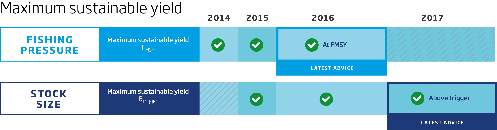

---
output:
  html_document:
    keep_md: true
    fig_height: 1
    fig_width: 1
    toc: yes
    toc_depth: 1
    toc_float: yes
  pdf_document:
    toc: yes
    toc_depth: '2'
    code_folding: hide
---
<style>
    body .main-container {
        width: 2000px;
        margin-left: 20px;
        margin-right: 20px;
    }
#TOC {
  background:url("images/iceslogo.png") ;
  background-size: contain;
  padding-top: 100px !important;
  background-repeat: no-repeat;
  position: fixed;
  font-size: 12px;
  left: 0;
  top: 0;
  width: 200px;
  height: 80%;
  overflow:auto;
}
</style>

<style type="text/css"> body, td { font-size: 16px; } width: 800px code.r{ font-size: 12px; } pre { font-size: 12px }

h1 { /* Header 1 */
  font-size: 24px;
  color: Grey;
}
h2 { /* Header 2 */
    font-size: 18px;
  color: Black;
}
 .col2 {
    columns: 2 220px;         /* number of columns and width in pixels*/
    -webkit-columns: 2 220px; /* chrome, safari */
    -moz-columns: 2 220px;    /* firefox */
  }
</style>

---
<a id="top"></a>

# ICES advice 2018

## "Hake (*Merluccius merluccius*) in subareas 4, 6, and 7, and in divisions 3.a, 8.a–b, and 8.d, Northern stock (Greater North Sea, Celtic Seas, and the northern Bay of Biscay)"


```{r setup, include=FALSE}
knitr::opts_chunk$set(
	echo = FALSE,
	message = FALSE,
	warning = FALSE
)
#<a href="#top">Back to top</a>
```

***
```{r  out.width = "50%"}
knitr::include_graphics("images/hake.png")
knitr::include_graphics("images/hkemap.png")
```


[Go to latest advice](http://ices.dk/sites/pub/Publication%20Reports/Advice/2017/2017/hke.27.3a46-8abd.pdf)  
[Go to Standard Graphs page](https://standardgraphs.ices.dk/manage/ViewGraphsAndTables.aspx?key=8988)  
[Go to Transparent Assessment Framework page](https://github.com/ices-taf/2016_cod-347d)

***

# ICES advice on fishing opportunities
ICES advises that when the MSY approach is applied, catches in 2018 should be no more than **115 335** tonnes.
 <br> 

***

# Stock development over time
The spawning-stock biomass (SSB) has increased significantly since 2006 and is well above historical estimates. Fishing mortality (F) has decreased significantly after 2005, and has been below FMSY since 2012. The recruitment (R) estimate for 2016 is above average

<div class="col2">
```{r sag1, echo=FALSE, fig.height=3.5, fig.width=3.5}

 library(htmlwidgets)
 library(dplyr)
 library(ggplot2)
 library(dygraphs)
 library(htmltools)
 library(widgetframe)
 data <- read.csv("Data/hke/hkedata.csv")

 dyBarChart <- function(dygraph) {
  dyPlotter(dygraph = dygraph,
            name = "BarChart",
            path = system.file("examples/plotters/barchart.js",
                               package = "dygraphs"))
}

 catches <- data %>% select(Year, catches)
 catches$catches <- catches[, "catches"]/1000
 recruitment<- data %>% select(Year, low_recruitment, recruitment, high_recruitment)
 
 dygraph(catches, main = "Catches")%>%
   dyRangeSelector()%>%
   dyOptions(colors = RColorBrewer::brewer.pal(3, "Set2"), drawGrid = FALSE,maxNumberWidth = 4)%>%
   dyAxis("y")%>%
   dyBarChart()
 
 dygraph(recruitment, main = "Recruitment(age 0)") %>%
   dyRangeSelector()%>%
   # dyOptions(colors = RColorBrewer::brewer.pal(3, "Set2"))%>%
   dyAxis("y")%>%
   dyBarChart()

 
```
</div>
<div class="col2">
```{r sag3, echo = FALSE, fig.height = 3.5, fig.width = 3.5}
library(dygraphs)
library(htmlwidgets)
library(dplyr)
library(ggplot2)
library(gridExtra)
library(dygraphs)

dyBarChart <- function(dygraph) {
  dyPlotter(dygraph = dygraph,
            name = "BarChart",
            path = system.file("examples/plotters/barchart.js",
                               package = "dygraphs"))
} 

F <- data %>% select(Year, low_F, F,high_F, FLim, Fpa, FMSY )
 dygraph(F, main = "F") %>%
  dySeries(c("low_F", "F", "high_F"))%>%
   dyLimit(as.numeric(F[, 5]), color = "red")%>%
   dyRangeSelector()%>%
   dyOptions(colors = RColorBrewer::brewer.pal(3, "Set2"),
             drawGrid= FALSE,maxNumberWidth = 4)%>%
   dyAxis("y")
SSB <- data %>% select(Year, low_SSB, SSB,high_SSB, Blim, Bpa, MSYBtrigger)
 dygraph(SSB, main = "SSB") %>%
  dySeries(c("low_SSB", "SSB", "high_SSB"))%>%
   dyLimit(as.numeric(F[, 5]), color = "red")%>%
   dyRangeSelector()%>%
   dyOptions(colors = RColorBrewer::brewer.pal(3, "Set2"),
             drawGrid= FALSE,maxNumberWidth = 4)%>%
   dyAxis("y")
 
```
</div>


**Figure 1**  Hake in subareas 4, 6, and 7, and in divisions 3.a, 8.a–b, and 8.d, Northern stock. Summary of the stock assessment.Recruitment, F, and SSB plots show 95% confidence intervals (shaded area). Assumed recruitment values are unshaded.
<br>

## Summary of the assessment

Hake in subareas 4, 6, and 7, and in divisions 3.a, 8.a–b, and 8.d, Northern stock. Assessment summary. Weights are in tonnes. Highs and lows are 95% confidence intervals

```{r summarysag, echo=FALSE}
library(icesSAG)

SAGsummary <- getSAG("hke.27.3a46-8abd", 2017, data = "summary", combine = TRUE, purpose = "Advice")
write.csv(SAGsummary, file = "SAGsummary.csv")

```

```{r download4}
library(magrittr)
 readLines("SAGsummary.csv") %>% 
   paste0(collapse="\n") %>% 
   openssl::base64_encode() -> encoded
```

[Download CSV](`r sprintf('data:text/csv;base64,%s', encoded)`)
 ***  
[Go to Top](#top)

# Stock and explotation status

<br>
**State of the stock and fishery relative to reference points**
<br>



***  

# Catch scenarios

<br>
**Table 2 Hake in subareas 4, 6, and 7, and in divisions 3.a, 8.a–b, and 8.d, Northern stock. The basis for the catch scenarios. All weights are in tonnes.**
<br>
```{r catchoptionsbasis, echo=FALSE}
library(knitr)
library(readr)
library(kableExtra)
dt <- read.csv("Data/hke/hkecatchoptionsbasis.csv",header = T, row.names = 1)
# dt <- dt [,-1] 
kable(dt, "html")%>% 
  row_spec(0, bold = T, color = "black", background = "lightgrey", align = "c")%>%
  column_spec(1, width = "20em")%>%
  column_spec(4, width = "45em")%>%
  column_spec(3, width = "15em")%>%
  kable_styling(position = "center", full_width = F, font_size = 7)

```

<br>

***

**Table 3 Hake in subareas 4, 6, and 7, and in divisions 3.a, 8.a–b, and 8.d, Northern stock. Annual catch options. All weights are in tonnes.**

<button class="btn btn-primary" data-toggle="collapse" data-target="#BlockName"> Show/Download Table </button>  
<div id="BlockName" class="collapse"> 
<br>
```{r catchoptionstable, echo=FALSE}
library(knitr)
library(readr)
library(kableExtra)
dt <- read.csv("Data/hke/hkecatchoptions.csv", header = T, row.names = 1)
# dt <- dt [,-1]
dt <- dt[complete.cases(dt),]
 kable(dt, "html") %>% kable_styling(position = "center")%>%
   row_spec(0, bold = T, color = "black", background = "lightgrey")%>%
   column_spec(1, width = "30em")%>%
         column_spec(2:10, width = "10em")%>%
   group_rows("ICES advice basis",1,1) %>%
   group_rows("Other options",2,9)
```

```{r download}
library(magrittr)
 readLines("Data/hke/hkecatchoptions.csv") %>% 
   paste0(collapse="\n") %>% 
   openssl::base64_encode() -> encoded
```

[Download CSV](`r sprintf('data:text/csv;base64,%s', encoded)`)
</div>
<br>
<br>
```{r catchscenariostable, echo=FALSE, fig.width=3}
library(knitr)
library(readr)
library(kableExtra)
dt <- read.csv("Data/hke/hkescenariosplot.csv") %>%
        select(Basis, F, Catch, SSB)
write.table (dt, "thing.txt",sep = ",")

colnames(dt)<- c("Basis", "F", "Catch 2018", "SSB 2019")
 kable(dt, "html") %>% kable_styling(position = "center")%>%
  kable_styling(bootstrap_options = "striped", full_width = F, font_size = 7)

```

Basis | F | Catch 2018 | SSB2019
------|---|------------|--------
MSY approach: FMSY | 0.280 | 115335 | 295193
F = 0 | 0.000 | 0 | 401929
Fpa | 0.620 | 211827 | 206120
Flim | 0.870 | 261716 | 160047


## Version 1
```{r catchoptionsgraph, echo = FALSE,fig.height = 5, fig.width = 7}
library(ggplot2)
library(plotly)
 catchoptions <- read.csv("Data/nepscenariosplot.csv")
 
 #for some reason the duplicates are added, ?
 data <- catchoptions [c(1,2,5),]
 plot_ly(data, x = ~ Harvest.rate)%>%
         add_trace(y = ~Wanted.catch, type = 'bar', name = 'Wanted catch') %>%
         add_trace(y = ~Dead.unwanted.catch,type = 'bar',name = 'Dead unwanted catch') %>%
         add_trace(y = ~Surviving.unwanted.catch, type = 'bar',name = 'Surviving unwanted catch')%>%      
  layout(yaxis = list(title = 'Tonnes'), barmode = 'stack')
 
 
```
 
## Version 2:
 
```{r catchoptionsgraphv2}
library(ggplot2)
library(plotly)
 catchoptions <- read.csv("Data/hke/hkescenariosplot.csv")
 labels <- catchoptions$Basis
 labels <- as.character(labels)
 mypalette<-ggthemes::tableau_color_pal('tableau20')
 
 data <- catchoptions[order(catchoptions$F),]
 p1 <- ggplot(catchoptions, aes(F, colour = )) + theme_bw() +
    geom_rect(xmin = -Inf, ymin = -Inf, xmax = 0.62, ymax = Inf,
              fill = "lightgreen", alpha=0.50)+theme_bw()+
    # geom_rect(xmin = 0.280, ymin = -Inf, xmax = 0.282, ymax = Inf,
    #           fill = "gold", alpha=0.50)+theme_bw()+
    geom_rect(xmin = 0.62, ymin = -Inf, xmax = 0.87, ymax = Inf,
              fill = "coral")+theme_bw()+
    geom_rect(xmin = 0.87, ymin = -Inf, xmax = Inf, ymax = Inf,
              fill = "brown1")+theme_bw()+
    geom_hline(yintercept=45000, linetype="dashed", color = "yellowgreen")+
    geom_hline(yintercept=32000, linetype="dashed", color = "yellow4")+
    geom_vline(xintercept = 0.28,linetype = "dotted",
               color = "violet", size = 0.5)+
    geom_vline(xintercept = 0.62, linetype="dotted",
               color = "violetred", size=0.5)+
    geom_vline(xintercept = 0.87, linetype="dotted",
               color = "violetred1", size=0.5)+
    # geom_col(aes(y = Catch), width = 0.15)+
    geom_point(aes(y = Catch),size = 2) +
    geom_line(aes(y = Catch),size = 0.5, colour= "orangered")+
    geom_point(aes(y=SSB), size = 2)+
    geom_line(aes(y = SSB),size = 0.5, colour= "lightskyblue")+
    scale_y_continuous("tonnes",sec.axis = sec_axis(~., name = "SSB"))+
    # scale_x_continuous(breaks = catchoptions$F)+
    xlab("Fish mortality")+
    ylab("Catches and SSB in tonnes")
 
  p2 <- p1 + theme(axis.text.x = element_text(face="bold", color="Black",
                             size=10, angle=45))+
    theme(legend.text = element_text(colour="blue", size = 16, face = "bold"))
  # p3<- p2+ guide_colorbar(title = "Spawning Stock Biomass", label= TRUE,barheight = )
 # p3<- p2 + geom_hline(yintercept=45000, linetype="dashed", color = "red")+
 #   geom_hline(yintercept=32000, linetype="dashed", color = "black")+
 #   geom_vline(xintercept = 0.28,
 #                 color = "yellow", size=3)+
 #   geom_vline(xintercept = 0.62, linetype="dotted",
 #                   color = "blue", size=0.5)+
 #   geom_vline(xintercept = 0.87, linetype="dotted",
 #                 color = "blue", size=0.5)


 ggplotly(p1, width = 600, height = 300)

```
  
## Version 3: 
 
```{r catchoptionsgraphv3, echo = FALSE}
library(ggplot2)
library(plotly)
 catchoptions <- read.csv("Data/hke/hkescenariosplot.csv")
 labels <- catchoptions$Basis
 labels <- as.character(labels)
 mypalette<-ggthemes::tableau_color_pal('tableau20')
 
 data <- catchoptions[order(catchoptions$F),]
 catchoptions <- catchoptions[!duplicated(catchoptions[,c('F')]),]
catch <- catchoptions %>% select(c(F,Catch))
ssb <- catchoptions %>% select(c(F,SSB))
labels <- catchoptions$F
labels <- as.character(labels)

 p1 <- ggplot(catchoptions, aes(F))+
    geom_col(data= ssb,aes(y = ssb$SSB, fill = SSB), width = 0.20)+
     scale_fill_gradient(low="gray90", high="blue")+
    geom_point(data= catch,aes(y= catch$Catch,size = Catch))+
    geom_line(aes(y = catch$Catch))+
    scale_x_continuous(breaks = round(seq(min(catchoptions$F), max(catchoptions$F), by = 0.5),3))+
    xlab("Fishing mortality")+
    ylab("tonnes")+
         theme(panel.grid.major = element_blank(), panel.grid.minor = element_blank(),
panel.background = element_blank(), axis.line = element_line(colour = "grey"))
 
  p2 <- p1 + theme(axis.text.x = element_text(face="bold", color="Black",
                             size=10, angle=45))+
    theme(legend.text = element_text(colour="blue", size = 16, face = "bold"))
  

 ggplotly(p2, width = 600, height = 300)

```
 
<br>

[Go to Top](#top)

# Basis of the advice  
***
<br>
**Table 4** Hake in subareas 4, 6, and 7, and in divisions 3.a, 8.a–b, and 8.d, Northern stock. The basis of the advice.
```{r advicebasis, echo=FALSE}
library(knitr)
library(readr)
library(kableExtra)
dt <- read.csv("Data/hke/hkeadvicebasis.csv", header = FALSE)
#dt <- dt [-1,] 
colnames(dt) <- NULL
kable(dt, "html")%>%kable_styling(position = "center")%>%
  column_spec(1, bold = T, color = "black", background = "lightgrey")

```

<br>

# Quality of the assessment  
***
<br>
The uncertainty in the assessment is relatively high, with large changes in biomass estimates in consecutive years. The model confidence intervals are an underestimate of uncertainty because they are narrower than interannual changes in estimates in consecutive years.
There is a lack of tuning data for the earlier years of the assessment, for some areas outside of subareas 7 and 8, and for the larger individuals in the population. Given the expansion of the stock into northern areas (ICES, 2017b), there is a potential that not all catches are reported for this stock. Biological sampling from these areas is also limited.
The data compilation of this stock is very complicated because it is exploited by several countries and the assessment model configuration is complex. In turn, the assessment model is very sensitive to the data and the settings used. Hence, it is extremely important for the quality of the assessment to have the complete data for all the countries on time and in the right format.

# Reference Points  
***
<br>
Herring in Subarea 4 and divisions 3.a and 7.d, autumn spawners. Reference points, values, and their technical basis.
```{r referencepoints, echo=FALSE}
library(knitr)
library(readr)
library(kableExtra)
dt <- read.csv("Data/hke/hkereferencepoints.csv")
dt <- dt [,-1] 
kable(dt, "html")%>%kable_styling(position = "center")%>%
  row_spec(0, bold = T, color = "black", background = "lightgrey")

```
<br>
```{r download2}
library(magrittr)
 readLines("Data/hke/hkereferencepoints.csv") %>% 
   paste0(collapse="\n") %>% 
   openssl::base64_encode() -> encoded
```
[Download CSV](`r sprintf('data:text/csv;base64,%s', encoded)`)

# Basis of the assessment  
***
<br>
Herring in Subarea 4 and divisions 3.a and 7.d, autumn spawners. Basis of the assessment and advice
```{r advicebla, echo=FALSE}
library(knitr)
library(readr)
library(kableExtra)
dt <- read.csv("Data/hke/hkeassessmentbasis.csv")
dt <- dt [,-1] 
kable(dt, "html")%>%kable_styling(position = "center")%>%
  row_spec(0, bold = T, color = "black", background = "lightgrey")

```

```{r download3}
library(magrittr)
 readLines("Data/hke/hkeassessmentbasis.csv") %>% 
   paste0(collapse="\n") %>% 
   openssl::base64_encode() -> encoded
```
[Download CSV](`r sprintf('data:text/csv;base64,%s', encoded)`)
[Go to Top](#top)

# Historical trends

```{r, echo=FALSE}
library(googleVis)
library(tidyr)
kobe <- read_csv("data/hke/kobe_data_2.csv")
hke <- kobe %>% filter(StockCode == "hke.27.3a46-8abd", EcoRegion == "Greater North Sea Ecoregion")
hke$StockCode <- NULL
hke$FisheriesGuild <- NULL
hke$EcoRegion <- NULL

bla <- hke %>% gather(Measures, value, -Year, -`F/Fmsy`, -`SSB/MSYBtrigger`)
# library(reshape2)
# hkelong <- melt(hke, id.vars = c("Year", "F", "SSB", "FMSY", "MSYBtrigger","catches", "landings", "discards"))

vis<- gvisMotionChart(bla, idvar= "Measures", timevar = "Year")
plot(vis)
```

http://127.0.0.1:30673/custom/googleVis/MotionChartID7603b1f6d16.html

