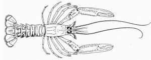

---
output:
  html_document:
    keep_md: true
    fig_height: 1
    fig_width: 1
    toc: yes
    toc_depth: 1
    toc_float: yes
    css: style.css
---

# ICES advice 2018

## *nep.fu.11*

## Norway lobster (*Nephrops norvegicus*) in Division 6.a, Functional Unit 11 (West of Scotland, North Minch)

Published 31 October 2018

***

[See PDF version of advice sheet](http://www.ices.dk/sites/pub/Publication%20Reports/Advice/2018/2018/nep.fu.11.pdf)  
[More information about this stock](http://sd.ices.dk/ViewStock.aspx?key=1641)   
[Detailed data and graphs for this stock assessment](https://standardgraphs.ices.dk/manage/ViewGraphsAndTables.aspx?key=10270)  
[Go to Transparent Assessment Framework page](https://github.com/ices-taf/2018_nep.fu.11)  
[See this stock in the ICES Spatial facility](http://gis.ices.dk/sf/index.html?widget=visa&assessmentKey=10270)

***

# ICES advice on fishing opportunities
 

ICES advises that when the MSY approach is applied, and assuming that discard rates and fishery selection patterns do not change from the average of 2015–2017, catches in 2019 should be no more than **3270** tonnes.

To ensure that the stock in Functional Unit 11 is exploited sustainably, management should be implemented at the functional unit level.

   

***

# Stock development over time
The historical harvest rate has fluctuated around FMSY and has been below FMSY since 2013. The stock has been above MSY Btrigger since 1998.

<table style="table-layout: fixed;width: 100%;">
<tr>
<td>

<!--html_preserve-->

<!--/html_preserve-->
</td>
<td>
</td>
</tr>

<tr>
<td>

<!--html_preserve-->

<!--/html_preserve-->
</td>
<td>

<!--html_preserve-->

<!--/html_preserve-->
</td>
</tr>
</table>

**Figure 1** Summary of the stock assessment of Norway lobster in Division 6.a, Functional Unit 11. Catches (discard data only available from 1990), harvest rate (sum of landings and dead discards in numbers, divided by total abundance), survey abundance (Underwater TV, millions; SSB proxy; approximate 95% confidence intervals). Harvest rates before 2006 may be unreliable due to underreporting of landings. Orange lines represent MSY Btrigger and the FMSY harvest rate proxy.
 

***

## Summary of the assessment

Assessment summary for Norway lobster in Division 6.a, Functional Unit 11. 
Recruitment in thousands.
 
<button class="btn btn-primary" data-toggle="collapse" data-target="#BlockName1"> Show/Download Table </button>  

 
 

[Download CSV](data:text/csv;base64,IiIsIlllYXIiLCJyZWNydWl0bWVudCIsImhpZ2hfcmVjcnVpdG1lbnQiLCJsb3dfcmVjcnVpdG1lbnQiLCJsb3dfU1NCIiwiU1NCIiwiaGlnaF9TU0IiLCJjYXRjaGVzIiwibGFuZGluZ3MiLCJkaXNjYXJkcyIsImxvd19GIiwiRiIsImhpZ2hfRiIsIlN0b2NrUHVibGlzaE5vdGUiLCJQdXJwb3NlIiwiRmFnZSIsImZpc2hzdG9jayIsInJlY3J1aXRtZW50X2FnZSIsIkFzc2Vzc21lbnRZZWFyIiwidW5pdHMiLCJzdG9ja1NpemVEZXNjcmlwdGlvbiIsInN0b2NrU2l6ZVVuaXRzIiwiZmlzaGluZ1ByZXNzdXJlRGVzY3JpcHRpb24iLCJmaXNoaW5nUHJlc3N1cmVVbml0cyIKIjEiLDE5NzgsMjk4MzYyLDM1NjUyMiwyNDk2OTAsNjYxNDgsODA0ODgsOTQ4MjksNTA1NTEsNTA1NTEsTkEsTkEsMC41LE5BLCJTdG9jayBwdWJsaXNoZWQiLCJBZHZpY2UiLE5BLCJoa2UuMjcuM2E0Ni04YWJkIiwwLDIwMTgsInRvbm5lcyIsIlNTQiIsInRvbm5lcyIsIkYiLE5BCiIyIiwxOTc5LDI3NDkyNiwzMzI5NDgsMjI3MDE1LDg5Njc2LDEwMTM1NywxMTMwMzgsNTEwOTYsNTEwOTYsTkEsTkEsMC41NCxOQSwiU3RvY2sgcHVibGlzaGVkIiwiQWR2aWNlIixOQSwiaGtlLjI3LjNhNDYtOGFiZCIsMCwyMDE4LCJ0b25uZXMiLCJTU0IiLCJ0b25uZXMiLCJGIixOQQoiMyIsMTk4MCwzMDM3MzYsMzYyMTczLDI1NDcyNiw5Mjg5OCwxMDM4MzgsMTE0Nzc4LDU3MjY1LDU3MjY1LE5BLE5BLDAuNjQsTkEsIlN0b2NrIHB1Ymxpc2hlZCIsIkFkdmljZSIsTkEsImhrZS4yNy4zYTQ2LThhYmQiLDAsMjAxOCwidG9ubmVzIiwiU1NCIiwidG9ubmVzIiwiRiIsTkEKIjQiLDE5ODEsNTc5ODk4LDY1ODU4MCw1MTA2MTYsNzkwNzgsODkyNjUsOTk0NTEsNTM5MTgsNTM5MTgsTkEsTkEsMC42NCxOQSwiU3RvY2sgcHVibGlzaGVkIiwiQWR2aWNlIixOQSwiaGtlLjI3LjNhNDYtOGFiZCIsMCwyMDE4LCJ0b25uZXMiLCJTU0IiLCJ0b25uZXMiLCJGIixOQQoiNSIsMTk4MiwzOTI1NTYsNDU4NDc2LDMzNjExNCw2MzE3Myw3MjY4NCw4MjE5Niw1NDk5NCw1NDk5NCxOQSxOQSwwLjY3LE5BLCJTdG9jayBwdWJsaXNoZWQiLCJBZHZpY2UiLE5BLCJoa2UuMjcuM2E0Ni04YWJkIiwwLDIwMTgsInRvbm5lcyIsIlNTQiIsInRvbm5lcyIsIkYiLE5BCiI2IiwxOTgzLDEzOTg0MCwxNzU5OTYsMTExMTEyLDYxNzQwLDcwMzU1LDc4OTcwLDU3NTA3LDU3NTA3LE5BLE5BLDAuNjIsTkEsIlN0b2NrIHB1Ymxpc2hlZCIsIkFkdmljZSIsTkEsImhrZS4yNy4zYTQ2LThhYmQiLDAsMjAxOCwidG9ubmVzIiwiU1NCIiwidG9ubmVzIiwiRiIsTkEKIjciLDE5ODQsMjc5NDY0LDMyNTQ3MywyMzk5NTksNzUwMDUsODMwNDUsOTEwODQsNjMyODYsNjMyODYsTkEsTkEsMC42NixOQSwiU3RvY2sgcHVibGlzaGVkIiwiQWR2aWNlIixOQSwiaGtlLjI3LjNhNDYtOGFiZCIsMCwyMDE4LCJ0b25uZXMiLCJTU0IiLCJ0b25uZXMiLCJGIixOQQoiOCIsMTk4NSw2MTk5MzMsNjkzOTA3LDU1Mzg0Myw3MTg5Nyw3ODkwOCw4NTkxOCw1NjA5OSw1NjA5OSxOQSxOQSwwLjgyLE5BLCJTdG9jayBwdWJsaXNoZWQiLCJBZHZpY2UiLE5BLCJoa2UuMjcuM2E0Ni04YWJkIiwwLDIwMTgsInRvbm5lcyIsIlNTQiIsInRvbm5lcyIsIkYiLE5BCiI5IiwxOTg2LDM1OTg4Miw0MDMzODgsMzIxMDY4LDUyNjc0LDU4OTYzLDY1MjUyLDU3MDkyLDU3MDkyLE5BLE5BLDAuOTEsTkEsIlN0b2NrIHB1Ymxpc2hlZCIsIkFkdmljZSIsTkEsImhrZS4yNy4zYTQ2LThhYmQiLDAsMjAxOCwidG9ubmVzIiwiU1NCIiwidG9ubmVzIiwiRiIsTkEKIjEwIiwxOTg3LDQzNDIwMCw0ODI0NjgsMzkwNzYzLDM4MjY5LDQzNTI0LDQ4NzgwLDYzMzY5LDYzMzY5LE5BLE5BLDAuOTgsTkEsIlN0b2NrIHB1Ymxpc2hlZCIsIkFkdmljZSIsTkEsImhrZS4yNy4zYTQ2LThhYmQiLDAsMjAxOCwidG9ubmVzIiwiU1NCIiwidG9ubmVzIiwiRiIsTkEKIjExIiwxOTg4LDQ5NDI1Nyw1NDU1NDMsNDQ3NzkyLDQxNDkxLDQ1OTk0LDUwNDk3LDY0ODI1LDY0ODIzLDIsTkEsMSxOQSwiU3RvY2sgcHVibGlzaGVkIiwiQWR2aWNlIixOQSwiaGtlLjI3LjNhNDYtOGFiZCIsMCwyMDE4LCJ0b25uZXMiLCJTU0IiLCJ0b25uZXMiLCJGIixOQQoiMTIiLDE5ODksNDc4MjcyLDUyNDEzMSw0MzY0MjUsNDExODIsNDUwODYsNDg5ODksNjY1NDYsNjY0NzMsNzMsTkEsMS4wNyxOQSwiU3RvY2sgcHVibGlzaGVkIiwiQWR2aWNlIixOQSwiaGtlLjI3LjNhNDYtOGFiZCIsMCwyMDE4LCJ0b25uZXMiLCJTU0IiLCJ0b25uZXMiLCJGIixOQQoiMTMiLDE5OTAsNDg0NzgwLDUyOTI4Myw0NDQwMTksMzkxODEsNDIzNTIsNDU1MjIsNTk5NTQsNTk5NTQsTkEsTkEsMS4wMixOQSwiU3RvY2sgcHVibGlzaGVkIiwiQWR2aWNlIixOQSwiaGtlLjI3LjNhNDYtOGFiZCIsMCwyMDE4LCJ0b25uZXMiLCJTU0IiLCJ0b25uZXMiLCJGIixOQQoiMTQiLDE5OTEsMjcwMDQ0LDI5Nzk1MywyNDQ3NTAsMzgzNTAsNDEzNTEsNDQzNTIsNTgxMjksNTgxMjksTkEsTkEsMC45NixOQSwiU3RvY2sgcHVibGlzaGVkIiwiQWR2aWNlIixOQSwiaGtlLjI3LjNhNDYtOGFiZCIsMCwyMDE4LCJ0b25uZXMiLCJTU0IiLCJ0b25uZXMiLCJGIixOQQoiMTUiLDE5OTIsMjk0NjMwLDMyNDM4NSwyNjc2MDQsMzY4OTMsMzk4MzYsNDI3ODAsNTY2MTcsNTY2MTcsTkEsTkEsMSxOQSwiU3RvY2sgcHVibGlzaGVkIiwiQWR2aWNlIixOQSwiaGtlLjI3LjNhNDYtOGFiZCIsMCwyMDE4LCJ0b25uZXMiLCJTU0IiLCJ0b25uZXMiLCJGIixOQQoiMTYiLDE5OTMsNTE3MzE3LDU0OTcxMSw0ODY4MzIsMzYxNzcsMzg3NDMsNDEzMTAsNTIxNDQsNTIxNDQsTkEsTkEsMS4wNSxOQSwiU3RvY2sgcHVibGlzaGVkIiwiQWR2aWNlIixOQSwiaGtlLjI3LjNhNDYtOGFiZCIsMCwyMDE4LCJ0b25uZXMiLCJTU0IiLCJ0b25uZXMiLCJGIixOQQoiMTciLDE5OTQsMjg4NDYyLDMwOTgzMSwyNjg1NjcsMjgyODcsMzA0ODksMzI2OTEsNTE2MTUsNTEyNTksMzU2LE5BLDEuMDYsTkEsIlN0b2NrIHB1Ymxpc2hlZCIsIkFkdmljZSIsTkEsImhrZS4yNy4zYTQ2LThhYmQiLDAsMjAxOCwidG9ubmVzIiwiU1NCIiwidG9ubmVzIiwiRiIsTkEKIjE4IiwxOTk1LDE0NzU1MywxNjA5MTYsMTM1Mjk5LDI3NTgyLDI5NTk2LDMxNjEwLDU3NjIxLDU3NjIxLE5BLE5BLDEuMTIsTkEsIlN0b2NrIHB1Ymxpc2hlZCIsIkFkdmljZSIsTkEsImhrZS4yNy4zYTQ2LThhYmQiLDAsMjAxOCwidG9ubmVzIiwiU1NCIiwidG9ubmVzIiwiRiIsTkEKIjE5IiwxOTk2LDM2Mjk3NSwzODYxOTcsMzQxMTQ5LDMyNzI2LDM0NzkwLDM2ODU1LDQ3MjEwLDQ3MjEwLE5BLE5BLDAuOTcsTkEsIlN0b2NrIHB1Ymxpc2hlZCIsIkFkdmljZSIsTkEsImhrZS4yNy4zYTQ2LThhYmQiLDAsMjAxOCwidG9ubmVzIiwiU1NCIiwidG9ubmVzIiwiRiIsTkEKIjIwIiwxOTk3LDI1NTEzMCwyNzcyNTMsMjM0NzcwLDI4MTMzLDMwMDg5LDMyMDQ1LDQyNDY1LDQyNDY1LE5BLE5BLDEuMDYsTkEsIlN0b2NrIHB1Ymxpc2hlZCIsIkFkdmljZSIsTkEsImhrZS4yNy4zYTQ2LThhYmQiLDAsMjAxOCwidG9ubmVzIiwiU1NCIiwidG9ubmVzIiwiRiIsTkEKIjIxIiwxOTk4LDQyMjM3OSw0NTIzNTQsMzk0Mzg5LDIyNzAwLDI0MzU2LDI2MDEyLDM1MDYwLDM1MDYwLE5BLE5BLDAuOTgsTkEsIlN0b2NrIHB1Ymxpc2hlZCIsIkFkdmljZSIsTkEsImhrZS4yNy4zYTQ2LThhYmQiLDAsMjAxOCwidG9ubmVzIiwiU1NCIiwidG9ubmVzIiwiRiIsTkEKIjIyIiwxOTk5LDIwNzQyMywyMjU1OTIsMTkwNzE4LDI1OTIxLDI3NzAzLDI5NDg1LDQwMTYzLDM5ODE0LDM0OSxOQSwwLjk3LE5BLCJTdG9jayBwdWJsaXNoZWQiLCJBZHZpY2UiLE5BLCJoa2UuMjcuM2E0Ni04YWJkIiwwLDIwMTgsInRvbm5lcyIsIlNTQiIsInRvbm5lcyIsIkYiLE5BCiIyMyIsMjAwMCwxODgyODgsMjAzMzk4LDE3NDMwMCwyODY1OSwzMDYwMCwzMjU0MSw0MjEwOSw0MjAyNiw4MyxOQSwwLjkxLE5BLCJTdG9jayBwdWJsaXNoZWQiLCJBZHZpY2UiLE5BLCJoa2UuMjcuM2E0Ni04YWJkIiwwLDIwMTgsInRvbm5lcyIsIlNTQiIsInRvbm5lcyIsIkYiLE5BCiIyNCIsMjAwMSwzNDY3MDQsMzY5MjgxLDMyNTUwNywzNDE3NSwzNjM0MSwzODUwOCwzNjY3NSwzNjY3NSxOQSxOQSwwLjc1LE5BLCJTdG9jayBwdWJsaXNoZWQiLCJBZHZpY2UiLE5BLCJoa2UuMjcuM2E0Ni04YWJkIiwwLDIwMTgsInRvbm5lcyIsIlNTQiIsInRvbm5lcyIsIkYiLE5BCiIyNSIsMjAwMiwyNzQzMTIsMjkzMTc3LDI1NjY2MSwzNDg4NSwzNzI3MywzOTY2MCw0MDEwNyw0MDEwNyxOQSxOQSwwLjgxLE5BLCJTdG9jayBwdWJsaXNoZWQiLCJBZHZpY2UiLE5BLCJoa2UuMjcuM2E0Ni04YWJkIiwwLDIwMTgsInRvbm5lcyIsIlNTQiIsInRvbm5lcyIsIkYiLE5BCiIyNiIsMjAwMywxNjA2MDAsMTczMTUzLDE0ODk1NywzNTE4NSwzNzY1Niw0MDEyNyw0NTI3Miw0MzE2MiwyMTEwLE5BLDAuODIsTkEsIlN0b2NrIHB1Ymxpc2hlZCIsIkFkdmljZSIsTkEsImhrZS4yNy4zYTQ2LThhYmQiLDAsMjAxOCwidG9ubmVzIiwiU1NCIiwidG9ubmVzIiwiRiIsTkEKIjI3IiwyMDA0LDM0MDM0OCwzNjA1NDYsMzIxMjg0LDQwMTkxLDQyNzc4LDQ1MzY0LDQ4OTY5LDQ2NDE3LDI1NTIsTkEsMC44MyxOQSwiU3RvY2sgcHVibGlzaGVkIiwiQWR2aWNlIixOQSwiaGtlLjI3LjNhNDYtOGFiZCIsMCwyMDE4LCJ0b25uZXMiLCJTU0IiLCJ0b25uZXMiLCJGIixOQQoiMjgiLDIwMDUsMjIxNTY1LDIzNzMxNCwyMDY4NjEsMzg1OTEsNDExOTUsNDM3OTksNTEyMjYsNDY1NTAsNDY3NixOQSwwLjk1LE5BLCJTdG9jayBwdWJsaXNoZWQiLCJBZHZpY2UiLE5BLCJoa2UuMjcuM2E0Ni04YWJkIiwwLDIwMTgsInRvbm5lcyIsIlNTQiIsInRvbm5lcyIsIkYiLE5BCiIyOSIsMjAwNiwzMDIwODYsMzIwMDI0LDI4NTE1NiwzMTIwNCwzMzYxNCwzNjAyMyw0MzI4Myw0MTQ2NywxODE2LE5BLDAuODQsTkEsIlN0b2NrIHB1Ymxpc2hlZCIsIkFkdmljZSIsTkEsImhrZS4yNy4zYTQ2LThhYmQiLDAsMjAxOCwidG9ubmVzIiwiU1NCIiwidG9ubmVzIiwiRiIsTkEKIjMwIiwyMDA3LDQ3MTI2OSw0OTk3MDMsNDQ0NDUzLDM2OTI5LDM5Nzk3LDQyNjY2LDQ3MjE5LDQ1MDI4LDIxOTEsTkEsMC43NCxOQSwiU3RvY2sgcHVibGlzaGVkIiwiQWR2aWNlIixOQSwiaGtlLjI3LjNhNDYtOGFiZCIsMCwyMDE4LCJ0b25uZXMiLCJTU0IiLCJ0b25uZXMiLCJGIixOQQoiMzEiLDIwMDgsNzY1MzAwLDgwNzA4MCw3MjU2ODMsNDMyMTQsNDY5NzgsNTA3NDMsNTA5ODcsNDc3MzksMzI0OCxOQSwwLjYsTkEsIlN0b2NrIHB1Ymxpc2hlZCIsIkFkdmljZSIsTkEsImhrZS4yNy4zYTQ2LThhYmQiLDAsMjAxOCwidG9ubmVzIiwiU1NCIiwidG9ubmVzIiwiRiIsTkEKIjMyIiwyMDA5LDI1NDg3MiwyNzgwNDYsMjMzNjMwLDY1MjA0LDcxMDcyLDc2OTQwLDY4Njg5LDU4ODE4LDk4NzEsTkEsMC40OCxOQSwiU3RvY2sgcHVibGlzaGVkIiwiQWR2aWNlIixOQSwiaGtlLjI3LjNhNDYtOGFiZCIsMCwyMDE4LCJ0b25uZXMiLCJTU0IiLCJ0b25uZXMiLCJGIixOQQoiMzMiLDIwMTAsMjcwMzc4LDI5MjY2OCwyNDk3ODYsMTIxMDI3LDEzMTMyMCwxNDE2MTMsODIyMTQsNzI3OTksOTQxNSxOQSwwLjM2LE5BLCJTdG9jayBwdWJsaXNoZWQiLCJBZHZpY2UiLE5BLCJoa2UuMjcuM2E0Ni04YWJkIiwwLDIwMTgsInRvbm5lcyIsIlNTQiIsInRvbm5lcyIsIkYiLE5BCiIzNCIsMjAxMSwyODQyMjYsMzEwMDQwLDI2MDU2MywxOTg5NjUsMjE2MTE0LDIzMzI2MywxMDEzMTUsODc1NDAsMTM3NzUsTkEsMC4yOSxOQSwiU3RvY2sgcHVibGlzaGVkIiwiQWR2aWNlIixOQSwiaGtlLjI3LjNhNDYtOGFiZCIsMCwyMDE4LCJ0b25uZXMiLCJTU0IiLCJ0b25uZXMiLCJGIixOQQoiMzUiLDIwMTIsNTQwNzI3LDU4Nzc1MCw0OTc0NjgsMjI0NDg1LDI0NzE3NSwyNjk4NjUsOTc5MDIsODU2NzcsMTIyMjUsTkEsMC4yNCxOQSwiU3RvY2sgcHVibGlzaGVkIiwiQWR2aWNlIixOQSwiaGtlLjI3LjNhNDYtOGFiZCIsMCwyMDE4LCJ0b25uZXMiLCJTU0IiLCJ0b25uZXMiLCJGIixOQQoiMzYiLDIwMTMsMzc1NTM4LDQxNjYyNywzMzg1MDIsMjI1MzUzLDI1MjQwNywyNzk0NjEsODkzOTAsNzc3NTMsMTE2MzcsTkEsMC4yNCxOQSwiU3RvY2sgcHVibGlzaGVkIiwiQWR2aWNlIixOQSwiaGtlLjI3LjNhNDYtOGFiZCIsMCwyMDE4LCJ0b25uZXMiLCJTU0IiLCJ0b25uZXMiLCJGIixOQQoiMzciLDIwMTQsMjE3NDE3LDI0Njk3NiwxOTEzOTYsMjM4NTE4LDI3MTA4OCwzMDM2NTgsOTY5ODcsODk5NDAsNzA0NyxOQSwwLjIzLE5BLCJTdG9jayBwdWJsaXNoZWQiLCJBZHZpY2UiLE5BLCJoa2UuMjcuM2E0Ni04YWJkIiwwLDIwMTgsInRvbm5lcyIsIlNTQiIsInRvbm5lcyIsIkYiLE5BCiIzOCIsMjAxNSwyNDUxMzksMjg0NzE4LDIxMTA2MiwyNzI2OTQsMzE0OTgzLDM1NzI3MiwxMDEwNjYsOTM2NzAsNzM5NixOQSwwLjIyLE5BLCJTdG9jayBwdWJsaXNoZWQiLCJBZHZpY2UiLE5BLCJoa2UuMjcuM2E0Ni04YWJkIiwwLDIwMTgsInRvbm5lcyIsIlNTQiIsInRvbm5lcyIsIkYiLE5BCiIzOSIsMjAxNiw1OTM5OTMsNzA3NDg3LDQ5ODcwNiwyOTI3OTIsMzQ2NjUzLDQwMDUxNCwxMTkwNDUsMTA5MTA2LDk5MzksTkEsMC4yMyxOQSwiU3RvY2sgcHVibGlzaGVkIiwiQWR2aWNlIixOQSwiaGtlLjI3LjNhNDYtOGFiZCIsMCwyMDE4LCJ0b25uZXMiLCJTU0IiLCJ0b25uZXMiLCJGIixOQQoiNDAiLDIwMTcsNDkzMzk0LDY0NTcwMSwzNzcwMTEsMjYxNTc3LDMyNTIzMCwzODg4ODMsMTEwMjg3LDEwNDY3MSw1NjE2LE5BLDAuMjUsTkEsIlN0b2NrIHB1Ymxpc2hlZCIsIkFkdmljZSIsTkEsImhrZS4yNy4zYTQ2LThhYmQiLDAsMjAxOCwidG9ubmVzIiwiU1NCIiwidG9ubmVzIiwiRiIsTkEKIjQxIiwyMDE4LDMwMzU1MCxOQSxOQSwyMjk5MTUsMzA2NTE2LDM4MzExNyxOQSxOQSxOQSxOQSxOQSxOQSwiU3RvY2sgcHVibGlzaGVkIiwiQWR2aWNlIixOQSwiaGtlLjI3LjNhNDYtOGFiZCIsMCwyMDE4LCJ0b25uZXMiLCJTU0IiLCJ0b25uZXMiLCJGIixOQQ==) 
 

<table class="table" style="margin-left: auto; margin-right: auto;">
 <thead>
  <tr>
   <th style="text-align:right;font-weight: bold;color: black;background-color: lightgrey;text-align: center;"> Year </th>
   <th style="text-align:right;font-weight: bold;color: black;background-color: lightgrey;text-align: center;"> recruitment </th>
   <th style="text-align:right;font-weight: bold;color: black;background-color: lightgrey;text-align: center;"> high_recruitment </th>
   <th style="text-align:right;font-weight: bold;color: black;background-color: lightgrey;text-align: center;"> low_recruitment </th>
   <th style="text-align:right;font-weight: bold;color: black;background-color: lightgrey;text-align: center;"> low_SSB </th>
   <th style="text-align:right;font-weight: bold;color: black;background-color: lightgrey;text-align: center;"> SSB </th>
   <th style="text-align:right;font-weight: bold;color: black;background-color: lightgrey;text-align: center;"> high_SSB </th>
   <th style="text-align:right;font-weight: bold;color: black;background-color: lightgrey;text-align: center;"> catches </th>
   <th style="text-align:right;font-weight: bold;color: black;background-color: lightgrey;text-align: center;"> landings </th>
   <th style="text-align:right;font-weight: bold;color: black;background-color: lightgrey;text-align: center;"> discards </th>
   <th style="text-align:right;font-weight: bold;color: black;background-color: lightgrey;text-align: center;"> low_F </th>
   <th style="text-align:right;font-weight: bold;color: black;background-color: lightgrey;text-align: center;"> F </th>
   <th style="text-align:right;font-weight: bold;color: black;background-color: lightgrey;text-align: center;"> high_F </th>
   <th style="text-align:left;font-weight: bold;color: black;background-color: lightgrey;text-align: center;"> StockPublishNote </th>
   <th style="text-align:left;font-weight: bold;color: black;background-color: lightgrey;text-align: center;"> Purpose </th>
   <th style="text-align:right;font-weight: bold;color: black;background-color: lightgrey;text-align: center;"> Fage </th>
   <th style="text-align:left;font-weight: bold;color: black;background-color: lightgrey;text-align: center;"> fishstock </th>
   <th style="text-align:right;font-weight: bold;color: black;background-color: lightgrey;text-align: center;"> recruitment_age </th>
   <th style="text-align:right;font-weight: bold;color: black;background-color: lightgrey;text-align: center;"> AssessmentYear </th>
   <th style="text-align:left;font-weight: bold;color: black;background-color: lightgrey;text-align: center;"> units </th>
   <th style="text-align:left;font-weight: bold;color: black;background-color: lightgrey;text-align: center;"> stockSizeDescription </th>
   <th style="text-align:left;font-weight: bold;color: black;background-color: lightgrey;text-align: center;"> stockSizeUnits </th>
   <th style="text-align:left;font-weight: bold;color: black;background-color: lightgrey;text-align: center;"> fishingPressureDescription </th>
   <th style="text-align:left;font-weight: bold;color: black;background-color: lightgrey;text-align: center;"> fishingPressureUnits </th>
  </tr>
 </thead>
<tbody>
  <tr>
   <td style="text-align:right;"> 1981 </td>
   <td style="text-align:right;"> NA </td>
   <td style="text-align:right;"> NA </td>
   <td style="text-align:right;"> NA </td>
   <td style="text-align:right;"> NA </td>
   <td style="text-align:right;"> NA </td>
   <td style="text-align:right;"> NA </td>
   <td style="text-align:right;"> 2861 </td>
   <td style="text-align:right;"> 2861 </td>
   <td style="text-align:right;"> NA </td>
   <td style="text-align:right;"> NA </td>
   <td style="text-align:right;"> NA </td>
   <td style="text-align:right;"> NA </td>
   <td style="text-align:left;"> Stock published </td>
   <td style="text-align:left;"> Advice </td>
   <td style="text-align:right;"> NA </td>
   <td style="text-align:left;"> nep.fu.11 </td>
   <td style="text-align:right;"> NA </td>
   <td style="text-align:right;"> 2018 </td>
   <td style="text-align:left;"> tonnes </td>
   <td style="text-align:left;"> UW TV index </td>
   <td style="text-align:left;"> individuals </td>
   <td style="text-align:left;"> Harvest rate </td>
   <td style="text-align:left;"> Percent </td>
  </tr>
  <tr>
   <td style="text-align:right;"> 1982 </td>
   <td style="text-align:right;"> NA </td>
   <td style="text-align:right;"> NA </td>
   <td style="text-align:right;"> NA </td>
   <td style="text-align:right;"> NA </td>
   <td style="text-align:right;"> NA </td>
   <td style="text-align:right;"> NA </td>
   <td style="text-align:right;"> 2799 </td>
   <td style="text-align:right;"> 2799 </td>
   <td style="text-align:right;"> NA </td>
   <td style="text-align:right;"> NA </td>
   <td style="text-align:right;"> NA </td>
   <td style="text-align:right;"> NA </td>
   <td style="text-align:left;"> Stock published </td>
   <td style="text-align:left;"> Advice </td>
   <td style="text-align:right;"> NA </td>
   <td style="text-align:left;"> nep.fu.11 </td>
   <td style="text-align:right;"> NA </td>
   <td style="text-align:right;"> 2018 </td>
   <td style="text-align:left;"> tonnes </td>
   <td style="text-align:left;"> UW TV index </td>
   <td style="text-align:left;"> individuals </td>
   <td style="text-align:left;"> Harvest rate </td>
   <td style="text-align:left;"> Percent </td>
  </tr>
  <tr>
   <td style="text-align:right;"> 1983 </td>
   <td style="text-align:right;"> NA </td>
   <td style="text-align:right;"> NA </td>
   <td style="text-align:right;"> NA </td>
   <td style="text-align:right;"> NA </td>
   <td style="text-align:right;"> NA </td>
   <td style="text-align:right;"> NA </td>
   <td style="text-align:right;"> 3197 </td>
   <td style="text-align:right;"> 3197 </td>
   <td style="text-align:right;"> NA </td>
   <td style="text-align:right;"> NA </td>
   <td style="text-align:right;"> NA </td>
   <td style="text-align:right;"> NA </td>
   <td style="text-align:left;"> Stock published </td>
   <td style="text-align:left;"> Advice </td>
   <td style="text-align:right;"> NA </td>
   <td style="text-align:left;"> nep.fu.11 </td>
   <td style="text-align:right;"> NA </td>
   <td style="text-align:right;"> 2018 </td>
   <td style="text-align:left;"> tonnes </td>
   <td style="text-align:left;"> UW TV index </td>
   <td style="text-align:left;"> individuals </td>
   <td style="text-align:left;"> Harvest rate </td>
   <td style="text-align:left;"> Percent </td>
  </tr>
  <tr>
   <td style="text-align:right;"> 1984 </td>
   <td style="text-align:right;"> NA </td>
   <td style="text-align:right;"> NA </td>
   <td style="text-align:right;"> NA </td>
   <td style="text-align:right;"> NA </td>
   <td style="text-align:right;"> NA </td>
   <td style="text-align:right;"> NA </td>
   <td style="text-align:right;"> 4143 </td>
   <td style="text-align:right;"> 4143 </td>
   <td style="text-align:right;"> NA </td>
   <td style="text-align:right;"> NA </td>
   <td style="text-align:right;"> NA </td>
   <td style="text-align:right;"> NA </td>
   <td style="text-align:left;"> Stock published </td>
   <td style="text-align:left;"> Advice </td>
   <td style="text-align:right;"> NA </td>
   <td style="text-align:left;"> nep.fu.11 </td>
   <td style="text-align:right;"> NA </td>
   <td style="text-align:right;"> 2018 </td>
   <td style="text-align:left;"> tonnes </td>
   <td style="text-align:left;"> UW TV index </td>
   <td style="text-align:left;"> individuals </td>
   <td style="text-align:left;"> Harvest rate </td>
   <td style="text-align:left;"> Percent </td>
  </tr>
  <tr>
   <td style="text-align:right;"> 1985 </td>
   <td style="text-align:right;"> NA </td>
   <td style="text-align:right;"> NA </td>
   <td style="text-align:right;"> NA </td>
   <td style="text-align:right;"> NA </td>
   <td style="text-align:right;"> NA </td>
   <td style="text-align:right;"> NA </td>
   <td style="text-align:right;"> 4060 </td>
   <td style="text-align:right;"> 4060 </td>
   <td style="text-align:right;"> NA </td>
   <td style="text-align:right;"> NA </td>
   <td style="text-align:right;"> NA </td>
   <td style="text-align:right;"> NA </td>
   <td style="text-align:left;"> Stock published </td>
   <td style="text-align:left;"> Advice </td>
   <td style="text-align:right;"> NA </td>
   <td style="text-align:left;"> nep.fu.11 </td>
   <td style="text-align:right;"> NA </td>
   <td style="text-align:right;"> 2018 </td>
   <td style="text-align:left;"> tonnes </td>
   <td style="text-align:left;"> UW TV index </td>
   <td style="text-align:left;"> individuals </td>
   <td style="text-align:left;"> Harvest rate </td>
   <td style="text-align:left;"> Percent </td>
  </tr>
  <tr>
   <td style="text-align:right;"> 1986 </td>
   <td style="text-align:right;"> NA </td>
   <td style="text-align:right;"> NA </td>
   <td style="text-align:right;"> NA </td>
   <td style="text-align:right;"> NA </td>
   <td style="text-align:right;"> NA </td>
   <td style="text-align:right;"> NA </td>
   <td style="text-align:right;"> 3381 </td>
   <td style="text-align:right;"> 3381 </td>
   <td style="text-align:right;"> NA </td>
   <td style="text-align:right;"> NA </td>
   <td style="text-align:right;"> NA </td>
   <td style="text-align:right;"> NA </td>
   <td style="text-align:left;"> Stock published </td>
   <td style="text-align:left;"> Advice </td>
   <td style="text-align:right;"> NA </td>
   <td style="text-align:left;"> nep.fu.11 </td>
   <td style="text-align:right;"> NA </td>
   <td style="text-align:right;"> 2018 </td>
   <td style="text-align:left;"> tonnes </td>
   <td style="text-align:left;"> UW TV index </td>
   <td style="text-align:left;"> individuals </td>
   <td style="text-align:left;"> Harvest rate </td>
   <td style="text-align:left;"> Percent </td>
  </tr>
  <tr>
   <td style="text-align:right;"> 1987 </td>
   <td style="text-align:right;"> NA </td>
   <td style="text-align:right;"> NA </td>
   <td style="text-align:right;"> NA </td>
   <td style="text-align:right;"> NA </td>
   <td style="text-align:right;"> NA </td>
   <td style="text-align:right;"> NA </td>
   <td style="text-align:right;"> 4084 </td>
   <td style="text-align:right;"> 4084 </td>
   <td style="text-align:right;"> NA </td>
   <td style="text-align:right;"> NA </td>
   <td style="text-align:right;"> NA </td>
   <td style="text-align:right;"> NA </td>
   <td style="text-align:left;"> Stock published </td>
   <td style="text-align:left;"> Advice </td>
   <td style="text-align:right;"> NA </td>
   <td style="text-align:left;"> nep.fu.11 </td>
   <td style="text-align:right;"> NA </td>
   <td style="text-align:right;"> 2018 </td>
   <td style="text-align:left;"> tonnes </td>
   <td style="text-align:left;"> UW TV index </td>
   <td style="text-align:left;"> individuals </td>
   <td style="text-align:left;"> Harvest rate </td>
   <td style="text-align:left;"> Percent </td>
  </tr>
  <tr>
   <td style="text-align:right;"> 1988 </td>
   <td style="text-align:right;"> NA </td>
   <td style="text-align:right;"> NA </td>
   <td style="text-align:right;"> NA </td>
   <td style="text-align:right;"> NA </td>
   <td style="text-align:right;"> NA </td>
   <td style="text-align:right;"> NA </td>
   <td style="text-align:right;"> 4035 </td>
   <td style="text-align:right;"> 4035 </td>
   <td style="text-align:right;"> NA </td>
   <td style="text-align:right;"> NA </td>
   <td style="text-align:right;"> NA </td>
   <td style="text-align:right;"> NA </td>
   <td style="text-align:left;"> Stock published </td>
   <td style="text-align:left;"> Advice </td>
   <td style="text-align:right;"> NA </td>
   <td style="text-align:left;"> nep.fu.11 </td>
   <td style="text-align:right;"> NA </td>
   <td style="text-align:right;"> 2018 </td>
   <td style="text-align:left;"> tonnes </td>
   <td style="text-align:left;"> UW TV index </td>
   <td style="text-align:left;"> individuals </td>
   <td style="text-align:left;"> Harvest rate </td>
   <td style="text-align:left;"> Percent </td>
  </tr>
  <tr>
   <td style="text-align:right;"> 1989 </td>
   <td style="text-align:right;"> NA </td>
   <td style="text-align:right;"> NA </td>
   <td style="text-align:right;"> NA </td>
   <td style="text-align:right;"> NA </td>
   <td style="text-align:right;"> NA </td>
   <td style="text-align:right;"> NA </td>
   <td style="text-align:right;"> 3205 </td>
   <td style="text-align:right;"> 3205 </td>
   <td style="text-align:right;"> NA </td>
   <td style="text-align:right;"> NA </td>
   <td style="text-align:right;"> NA </td>
   <td style="text-align:right;"> NA </td>
   <td style="text-align:left;"> Stock published </td>
   <td style="text-align:left;"> Advice </td>
   <td style="text-align:right;"> NA </td>
   <td style="text-align:left;"> nep.fu.11 </td>
   <td style="text-align:right;"> NA </td>
   <td style="text-align:right;"> 2018 </td>
   <td style="text-align:left;"> tonnes </td>
   <td style="text-align:left;"> UW TV index </td>
   <td style="text-align:left;"> individuals </td>
   <td style="text-align:left;"> Harvest rate </td>
   <td style="text-align:left;"> Percent </td>
  </tr>
  <tr>
   <td style="text-align:right;"> 1990 </td>
   <td style="text-align:right;"> NA </td>
   <td style="text-align:right;"> NA </td>
   <td style="text-align:right;"> NA </td>
   <td style="text-align:right;"> NA </td>
   <td style="text-align:right;"> NA </td>
   <td style="text-align:right;"> NA </td>
   <td style="text-align:right;"> 2745 </td>
   <td style="text-align:right;"> 2546 </td>
   <td style="text-align:right;"> 199 </td>
   <td style="text-align:right;"> NA </td>
   <td style="text-align:right;"> NA </td>
   <td style="text-align:right;"> NA </td>
   <td style="text-align:left;"> Stock published </td>
   <td style="text-align:left;"> Advice </td>
   <td style="text-align:right;"> NA </td>
   <td style="text-align:left;"> nep.fu.11 </td>
   <td style="text-align:right;"> NA </td>
   <td style="text-align:right;"> 2018 </td>
   <td style="text-align:left;"> tonnes </td>
   <td style="text-align:left;"> UW TV index </td>
   <td style="text-align:left;"> individuals </td>
   <td style="text-align:left;"> Harvest rate </td>
   <td style="text-align:left;"> Percent </td>
  </tr>
  <tr>
   <td style="text-align:right;"> 1991 </td>
   <td style="text-align:right;"> NA </td>
   <td style="text-align:right;"> NA </td>
   <td style="text-align:right;"> NA </td>
   <td style="text-align:right;"> NA </td>
   <td style="text-align:right;"> NA </td>
   <td style="text-align:right;"> NA </td>
   <td style="text-align:right;"> 3234 </td>
   <td style="text-align:right;"> 2793 </td>
   <td style="text-align:right;"> 441 </td>
   <td style="text-align:right;"> NA </td>
   <td style="text-align:right;"> NA </td>
   <td style="text-align:right;"> NA </td>
   <td style="text-align:left;"> Stock published </td>
   <td style="text-align:left;"> Advice </td>
   <td style="text-align:right;"> NA </td>
   <td style="text-align:left;"> nep.fu.11 </td>
   <td style="text-align:right;"> NA </td>
   <td style="text-align:right;"> 2018 </td>
   <td style="text-align:left;"> tonnes </td>
   <td style="text-align:left;"> UW TV index </td>
   <td style="text-align:left;"> individuals </td>
   <td style="text-align:left;"> Harvest rate </td>
   <td style="text-align:left;"> Percent </td>
  </tr>
  <tr>
   <td style="text-align:right;"> 1992 </td>
   <td style="text-align:right;"> NA </td>
   <td style="text-align:right;"> NA </td>
   <td style="text-align:right;"> NA </td>
   <td style="text-align:right;"> NA </td>
   <td style="text-align:right;"> NA </td>
   <td style="text-align:right;"> NA </td>
   <td style="text-align:right;"> 3912 </td>
   <td style="text-align:right;"> 3559 </td>
   <td style="text-align:right;"> 353 </td>
   <td style="text-align:right;"> NA </td>
   <td style="text-align:right;"> NA </td>
   <td style="text-align:right;"> NA </td>
   <td style="text-align:left;"> Stock published </td>
   <td style="text-align:left;"> Advice </td>
   <td style="text-align:right;"> NA </td>
   <td style="text-align:left;"> nep.fu.11 </td>
   <td style="text-align:right;"> NA </td>
   <td style="text-align:right;"> 2018 </td>
   <td style="text-align:left;"> tonnes </td>
   <td style="text-align:left;"> UW TV index </td>
   <td style="text-align:left;"> individuals </td>
   <td style="text-align:left;"> Harvest rate </td>
   <td style="text-align:left;"> Percent </td>
  </tr>
  <tr>
   <td style="text-align:right;"> 1993 </td>
   <td style="text-align:right;"> NA </td>
   <td style="text-align:right;"> NA </td>
   <td style="text-align:right;"> NA </td>
   <td style="text-align:right;"> NA </td>
   <td style="text-align:right;"> NA </td>
   <td style="text-align:right;"> NA </td>
   <td style="text-align:right;"> 3222 </td>
   <td style="text-align:right;"> 3193 </td>
   <td style="text-align:right;"> 29 </td>
   <td style="text-align:right;"> NA </td>
   <td style="text-align:right;"> NA </td>
   <td style="text-align:right;"> NA </td>
   <td style="text-align:left;"> Stock published </td>
   <td style="text-align:left;"> Advice </td>
   <td style="text-align:right;"> NA </td>
   <td style="text-align:left;"> nep.fu.11 </td>
   <td style="text-align:right;"> NA </td>
   <td style="text-align:right;"> 2018 </td>
   <td style="text-align:left;"> tonnes </td>
   <td style="text-align:left;"> UW TV index </td>
   <td style="text-align:left;"> individuals </td>
   <td style="text-align:left;"> Harvest rate </td>
   <td style="text-align:left;"> Percent </td>
  </tr>
  <tr>
   <td style="text-align:right;"> 1994 </td>
   <td style="text-align:right;"> NA </td>
   <td style="text-align:right;"> NA </td>
   <td style="text-align:right;"> NA </td>
   <td style="text-align:right;"> 698 </td>
   <td style="text-align:right;"> 820 </td>
   <td style="text-align:right;"> 942 </td>
   <td style="text-align:right;"> 5251 </td>
   <td style="text-align:right;"> 3614 </td>
   <td style="text-align:right;"> 1637 </td>
   <td style="text-align:right;"> NA </td>
   <td style="text-align:right;"> 31.5 </td>
   <td style="text-align:right;"> NA </td>
   <td style="text-align:left;"> Stock published </td>
   <td style="text-align:left;"> Advice </td>
   <td style="text-align:right;"> NA </td>
   <td style="text-align:left;"> nep.fu.11 </td>
   <td style="text-align:right;"> NA </td>
   <td style="text-align:right;"> 2018 </td>
   <td style="text-align:left;"> tonnes </td>
   <td style="text-align:left;"> UW TV index </td>
   <td style="text-align:left;"> individuals </td>
   <td style="text-align:left;"> Harvest rate </td>
   <td style="text-align:left;"> Percent </td>
  </tr>
  <tr>
   <td style="text-align:right;"> 1995 </td>
   <td style="text-align:right;"> NA </td>
   <td style="text-align:right;"> NA </td>
   <td style="text-align:right;"> NA </td>
   <td style="text-align:right;"> NA </td>
   <td style="text-align:right;"> NA </td>
   <td style="text-align:right;"> NA </td>
   <td style="text-align:right;"> 4511 </td>
   <td style="text-align:right;"> 3655 </td>
   <td style="text-align:right;"> 856 </td>
   <td style="text-align:right;"> NA </td>
   <td style="text-align:right;"> NA </td>
   <td style="text-align:right;"> NA </td>
   <td style="text-align:left;"> Stock published </td>
   <td style="text-align:left;"> Advice </td>
   <td style="text-align:right;"> NA </td>
   <td style="text-align:left;"> nep.fu.11 </td>
   <td style="text-align:right;"> NA </td>
   <td style="text-align:right;"> 2018 </td>
   <td style="text-align:left;"> tonnes </td>
   <td style="text-align:left;"> UW TV index </td>
   <td style="text-align:left;"> individuals </td>
   <td style="text-align:left;"> Harvest rate </td>
   <td style="text-align:left;"> Percent </td>
  </tr>
  <tr>
   <td style="text-align:right;"> 1996 </td>
   <td style="text-align:right;"> NA </td>
   <td style="text-align:right;"> NA </td>
   <td style="text-align:right;"> NA </td>
   <td style="text-align:right;"> 465 </td>
   <td style="text-align:right;"> 541 </td>
   <td style="text-align:right;"> 617 </td>
   <td style="text-align:right;"> 3195 </td>
   <td style="text-align:right;"> 2872 </td>
   <td style="text-align:right;"> 323 </td>
   <td style="text-align:right;"> NA </td>
   <td style="text-align:right;"> 23.5 </td>
   <td style="text-align:right;"> NA </td>
   <td style="text-align:left;"> Stock published </td>
   <td style="text-align:left;"> Advice </td>
   <td style="text-align:right;"> NA </td>
   <td style="text-align:left;"> nep.fu.11 </td>
   <td style="text-align:right;"> NA </td>
   <td style="text-align:right;"> 2018 </td>
   <td style="text-align:left;"> tonnes </td>
   <td style="text-align:left;"> UW TV index </td>
   <td style="text-align:left;"> individuals </td>
   <td style="text-align:left;"> Harvest rate </td>
   <td style="text-align:left;"> Percent </td>
  </tr>
  <tr>
   <td style="text-align:right;"> 1997 </td>
   <td style="text-align:right;"> NA </td>
   <td style="text-align:right;"> NA </td>
   <td style="text-align:right;"> NA </td>
   <td style="text-align:right;"> NA </td>
   <td style="text-align:right;"> NA </td>
   <td style="text-align:right;"> NA </td>
   <td style="text-align:right;"> 3332 </td>
   <td style="text-align:right;"> 3046 </td>
   <td style="text-align:right;"> 286 </td>
   <td style="text-align:right;"> NA </td>
   <td style="text-align:right;"> NA </td>
   <td style="text-align:right;"> NA </td>
   <td style="text-align:left;"> Stock published </td>
   <td style="text-align:left;"> Advice </td>
   <td style="text-align:right;"> NA </td>
   <td style="text-align:left;"> nep.fu.11 </td>
   <td style="text-align:right;"> NA </td>
   <td style="text-align:right;"> 2018 </td>
   <td style="text-align:left;"> tonnes </td>
   <td style="text-align:left;"> UW TV index </td>
   <td style="text-align:left;"> individuals </td>
   <td style="text-align:left;"> Harvest rate </td>
   <td style="text-align:left;"> Percent </td>
  </tr>
  <tr>
   <td style="text-align:right;"> 1998 </td>
   <td style="text-align:right;"> NA </td>
   <td style="text-align:right;"> NA </td>
   <td style="text-align:right;"> NA </td>
   <td style="text-align:right;"> 771 </td>
   <td style="text-align:right;"> 898 </td>
   <td style="text-align:right;"> 1025 </td>
   <td style="text-align:right;"> 2508 </td>
   <td style="text-align:right;"> 2441 </td>
   <td style="text-align:right;"> 67 </td>
   <td style="text-align:right;"> NA </td>
   <td style="text-align:right;"> 12.2 </td>
   <td style="text-align:right;"> NA </td>
   <td style="text-align:left;"> Stock published </td>
   <td style="text-align:left;"> Advice </td>
   <td style="text-align:right;"> NA </td>
   <td style="text-align:left;"> nep.fu.11 </td>
   <td style="text-align:right;"> NA </td>
   <td style="text-align:right;"> 2018 </td>
   <td style="text-align:left;"> tonnes </td>
   <td style="text-align:left;"> UW TV index </td>
   <td style="text-align:left;"> individuals </td>
   <td style="text-align:left;"> Harvest rate </td>
   <td style="text-align:left;"> Percent </td>
  </tr>
  <tr>
   <td style="text-align:right;"> 1999 </td>
   <td style="text-align:right;"> NA </td>
   <td style="text-align:right;"> NA </td>
   <td style="text-align:right;"> NA </td>
   <td style="text-align:right;"> 647 </td>
   <td style="text-align:right;"> 794 </td>
   <td style="text-align:right;"> 941 </td>
   <td style="text-align:right;"> 3530 </td>
   <td style="text-align:right;"> 3257 </td>
   <td style="text-align:right;"> 273 </td>
   <td style="text-align:right;"> NA </td>
   <td style="text-align:right;"> 20.7 </td>
   <td style="text-align:right;"> NA </td>
   <td style="text-align:left;"> Stock published </td>
   <td style="text-align:left;"> Advice </td>
   <td style="text-align:right;"> NA </td>
   <td style="text-align:left;"> nep.fu.11 </td>
   <td style="text-align:right;"> NA </td>
   <td style="text-align:right;"> 2018 </td>
   <td style="text-align:left;"> tonnes </td>
   <td style="text-align:left;"> UW TV index </td>
   <td style="text-align:left;"> individuals </td>
   <td style="text-align:left;"> Harvest rate </td>
   <td style="text-align:left;"> Percent </td>
  </tr>
  <tr>
   <td style="text-align:right;"> 2000 </td>
   <td style="text-align:right;"> NA </td>
   <td style="text-align:right;"> NA </td>
   <td style="text-align:right;"> NA </td>
   <td style="text-align:right;"> 1032 </td>
   <td style="text-align:right;"> 1166 </td>
   <td style="text-align:right;"> 1300 </td>
   <td style="text-align:right;"> 3347 </td>
   <td style="text-align:right;"> 3247 </td>
   <td style="text-align:right;"> 100 </td>
   <td style="text-align:right;"> NA </td>
   <td style="text-align:right;"> 12.1 </td>
   <td style="text-align:right;"> NA </td>
   <td style="text-align:left;"> Stock published </td>
   <td style="text-align:left;"> Advice </td>
   <td style="text-align:right;"> NA </td>
   <td style="text-align:left;"> nep.fu.11 </td>
   <td style="text-align:right;"> NA </td>
   <td style="text-align:right;"> 2018 </td>
   <td style="text-align:left;"> tonnes </td>
   <td style="text-align:left;"> UW TV index </td>
   <td style="text-align:left;"> individuals </td>
   <td style="text-align:left;"> Harvest rate </td>
   <td style="text-align:left;"> Percent </td>
  </tr>
  <tr>
   <td style="text-align:right;"> 2001 </td>
   <td style="text-align:right;"> NA </td>
   <td style="text-align:right;"> NA </td>
   <td style="text-align:right;"> NA </td>
   <td style="text-align:right;"> 959 </td>
   <td style="text-align:right;"> 1092 </td>
   <td style="text-align:right;"> 1225 </td>
   <td style="text-align:right;"> 3419 </td>
   <td style="text-align:right;"> 3259 </td>
   <td style="text-align:right;"> 160 </td>
   <td style="text-align:right;"> NA </td>
   <td style="text-align:right;"> 13.0 </td>
   <td style="text-align:right;"> NA </td>
   <td style="text-align:left;"> Stock published </td>
   <td style="text-align:left;"> Advice </td>
   <td style="text-align:right;"> NA </td>
   <td style="text-align:left;"> nep.fu.11 </td>
   <td style="text-align:right;"> NA </td>
   <td style="text-align:right;"> 2018 </td>
   <td style="text-align:left;"> tonnes </td>
   <td style="text-align:left;"> UW TV index </td>
   <td style="text-align:left;"> individuals </td>
   <td style="text-align:left;"> Harvest rate </td>
   <td style="text-align:left;"> Percent </td>
  </tr>
  <tr>
   <td style="text-align:right;"> 2002 </td>
   <td style="text-align:right;"> NA </td>
   <td style="text-align:right;"> NA </td>
   <td style="text-align:right;"> NA </td>
   <td style="text-align:right;"> 1188 </td>
   <td style="text-align:right;"> 1337 </td>
   <td style="text-align:right;"> 1486 </td>
   <td style="text-align:right;"> 3717 </td>
   <td style="text-align:right;"> 3440 </td>
   <td style="text-align:right;"> 277 </td>
   <td style="text-align:right;"> NA </td>
   <td style="text-align:right;"> 11.5 </td>
   <td style="text-align:right;"> NA </td>
   <td style="text-align:left;"> Stock published </td>
   <td style="text-align:left;"> Advice </td>
   <td style="text-align:right;"> NA </td>
   <td style="text-align:left;"> nep.fu.11 </td>
   <td style="text-align:right;"> NA </td>
   <td style="text-align:right;"> 2018 </td>
   <td style="text-align:left;"> tonnes </td>
   <td style="text-align:left;"> UW TV index </td>
   <td style="text-align:left;"> individuals </td>
   <td style="text-align:left;"> Harvest rate </td>
   <td style="text-align:left;"> Percent </td>
  </tr>
  <tr>
   <td style="text-align:right;"> 2003 </td>
   <td style="text-align:right;"> NA </td>
   <td style="text-align:right;"> NA </td>
   <td style="text-align:right;"> NA </td>
   <td style="text-align:right;"> 1540 </td>
   <td style="text-align:right;"> 1751 </td>
   <td style="text-align:right;"> 1962 </td>
   <td style="text-align:right;"> 3568 </td>
   <td style="text-align:right;"> 3269 </td>
   <td style="text-align:right;"> 299 </td>
   <td style="text-align:right;"> NA </td>
   <td style="text-align:right;"> 8.5 </td>
   <td style="text-align:right;"> NA </td>
   <td style="text-align:left;"> Stock published </td>
   <td style="text-align:left;"> Advice </td>
   <td style="text-align:right;"> NA </td>
   <td style="text-align:left;"> nep.fu.11 </td>
   <td style="text-align:right;"> NA </td>
   <td style="text-align:right;"> 2018 </td>
   <td style="text-align:left;"> tonnes </td>
   <td style="text-align:left;"> UW TV index </td>
   <td style="text-align:left;"> individuals </td>
   <td style="text-align:left;"> Harvest rate </td>
   <td style="text-align:left;"> Percent </td>
  </tr>
  <tr>
   <td style="text-align:right;"> 2004 </td>
   <td style="text-align:right;"> NA </td>
   <td style="text-align:right;"> NA </td>
   <td style="text-align:right;"> NA </td>
   <td style="text-align:right;"> 1576 </td>
   <td style="text-align:right;"> 1751 </td>
   <td style="text-align:right;"> 1926 </td>
   <td style="text-align:right;"> 3284 </td>
   <td style="text-align:right;"> 3082 </td>
   <td style="text-align:right;"> 202 </td>
   <td style="text-align:right;"> NA </td>
   <td style="text-align:right;"> 7.8 </td>
   <td style="text-align:right;"> NA </td>
   <td style="text-align:left;"> Stock published </td>
   <td style="text-align:left;"> Advice </td>
   <td style="text-align:right;"> NA </td>
   <td style="text-align:left;"> nep.fu.11 </td>
   <td style="text-align:right;"> NA </td>
   <td style="text-align:right;"> 2018 </td>
   <td style="text-align:left;"> tonnes </td>
   <td style="text-align:left;"> UW TV index </td>
   <td style="text-align:left;"> individuals </td>
   <td style="text-align:left;"> Harvest rate </td>
   <td style="text-align:left;"> Percent </td>
  </tr>
  <tr>
   <td style="text-align:right;"> 2005 </td>
   <td style="text-align:right;"> NA </td>
   <td style="text-align:right;"> NA </td>
   <td style="text-align:right;"> NA </td>
   <td style="text-align:right;"> 1376 </td>
   <td style="text-align:right;"> 1540 </td>
   <td style="text-align:right;"> 1704 </td>
   <td style="text-align:right;"> 3456 </td>
   <td style="text-align:right;"> 2949 </td>
   <td style="text-align:right;"> 507 </td>
   <td style="text-align:right;"> NA </td>
   <td style="text-align:right;"> 9.4 </td>
   <td style="text-align:right;"> NA </td>
   <td style="text-align:left;"> Stock published </td>
   <td style="text-align:left;"> Advice </td>
   <td style="text-align:right;"> NA </td>
   <td style="text-align:left;"> nep.fu.11 </td>
   <td style="text-align:right;"> NA </td>
   <td style="text-align:right;"> 2018 </td>
   <td style="text-align:left;"> tonnes </td>
   <td style="text-align:left;"> UW TV index </td>
   <td style="text-align:left;"> individuals </td>
   <td style="text-align:left;"> Harvest rate </td>
   <td style="text-align:left;"> Percent </td>
  </tr>
  <tr>
   <td style="text-align:right;"> 2006 </td>
   <td style="text-align:right;"> NA </td>
   <td style="text-align:right;"> NA </td>
   <td style="text-align:right;"> NA </td>
   <td style="text-align:right;"> 1597 </td>
   <td style="text-align:right;"> 1762 </td>
   <td style="text-align:right;"> 1927 </td>
   <td style="text-align:right;"> 4923 </td>
   <td style="text-align:right;"> 4166 </td>
   <td style="text-align:right;"> 757 </td>
   <td style="text-align:right;"> NA </td>
   <td style="text-align:right;"> 12.8 </td>
   <td style="text-align:right;"> NA </td>
   <td style="text-align:left;"> Stock published </td>
   <td style="text-align:left;"> Advice </td>
   <td style="text-align:right;"> NA </td>
   <td style="text-align:left;"> nep.fu.11 </td>
   <td style="text-align:right;"> NA </td>
   <td style="text-align:right;"> 2018 </td>
   <td style="text-align:left;"> tonnes </td>
   <td style="text-align:left;"> UW TV index </td>
   <td style="text-align:left;"> individuals </td>
   <td style="text-align:left;"> Harvest rate </td>
   <td style="text-align:left;"> Percent </td>
  </tr>
  <tr>
   <td style="text-align:right;"> 2007 </td>
   <td style="text-align:right;"> NA </td>
   <td style="text-align:right;"> NA </td>
   <td style="text-align:right;"> NA </td>
   <td style="text-align:right;"> 1056 </td>
   <td style="text-align:right;"> 1206 </td>
   <td style="text-align:right;"> 1356 </td>
   <td style="text-align:right;"> 4192 </td>
   <td style="text-align:right;"> 3978 </td>
   <td style="text-align:right;"> 214 </td>
   <td style="text-align:right;"> NA </td>
   <td style="text-align:right;"> 14.7 </td>
   <td style="text-align:right;"> NA </td>
   <td style="text-align:left;"> Stock published </td>
   <td style="text-align:left;"> Advice </td>
   <td style="text-align:right;"> NA </td>
   <td style="text-align:left;"> nep.fu.11 </td>
   <td style="text-align:right;"> NA </td>
   <td style="text-align:right;"> 2018 </td>
   <td style="text-align:left;"> tonnes </td>
   <td style="text-align:left;"> UW TV index </td>
   <td style="text-align:left;"> individuals </td>
   <td style="text-align:left;"> Harvest rate </td>
   <td style="text-align:left;"> Percent </td>
  </tr>
  <tr>
   <td style="text-align:right;"> 2008 </td>
   <td style="text-align:right;"> NA </td>
   <td style="text-align:right;"> NA </td>
   <td style="text-align:right;"> NA </td>
   <td style="text-align:right;"> 890 </td>
   <td style="text-align:right;"> 1047 </td>
   <td style="text-align:right;"> 1204 </td>
   <td style="text-align:right;"> 3993 </td>
   <td style="text-align:right;"> 3799 </td>
   <td style="text-align:right;"> 194 </td>
   <td style="text-align:right;"> NA </td>
   <td style="text-align:right;"> 16.5 </td>
   <td style="text-align:right;"> NA </td>
   <td style="text-align:left;"> Stock published </td>
   <td style="text-align:left;"> Advice </td>
   <td style="text-align:right;"> NA </td>
   <td style="text-align:left;"> nep.fu.11 </td>
   <td style="text-align:right;"> NA </td>
   <td style="text-align:right;"> 2018 </td>
   <td style="text-align:left;"> tonnes </td>
   <td style="text-align:left;"> UW TV index </td>
   <td style="text-align:left;"> individuals </td>
   <td style="text-align:left;"> Harvest rate </td>
   <td style="text-align:left;"> Percent </td>
  </tr>
  <tr>
   <td style="text-align:right;"> 2009 </td>
   <td style="text-align:right;"> NA </td>
   <td style="text-align:right;"> NA </td>
   <td style="text-align:right;"> NA </td>
   <td style="text-align:right;"> 968 </td>
   <td style="text-align:right;"> 1195 </td>
   <td style="text-align:right;"> 1422 </td>
   <td style="text-align:right;"> 3823 </td>
   <td style="text-align:right;"> 3496 </td>
   <td style="text-align:right;"> 327 </td>
   <td style="text-align:right;"> NA </td>
   <td style="text-align:right;"> 13.7 </td>
   <td style="text-align:right;"> NA </td>
   <td style="text-align:left;"> Stock published </td>
   <td style="text-align:left;"> Advice </td>
   <td style="text-align:right;"> NA </td>
   <td style="text-align:left;"> nep.fu.11 </td>
   <td style="text-align:right;"> NA </td>
   <td style="text-align:right;"> 2018 </td>
   <td style="text-align:left;"> tonnes </td>
   <td style="text-align:left;"> UW TV index </td>
   <td style="text-align:left;"> individuals </td>
   <td style="text-align:left;"> Harvest rate </td>
   <td style="text-align:left;"> Percent </td>
  </tr>
  <tr>
   <td style="text-align:right;"> 2010 </td>
   <td style="text-align:right;"> NA </td>
   <td style="text-align:right;"> NA </td>
   <td style="text-align:right;"> NA </td>
   <td style="text-align:right;"> 1062 </td>
   <td style="text-align:right;"> 1293 </td>
   <td style="text-align:right;"> 1524 </td>
   <td style="text-align:right;"> 2541 </td>
   <td style="text-align:right;"> 2413 </td>
   <td style="text-align:right;"> 128 </td>
   <td style="text-align:right;"> NA </td>
   <td style="text-align:right;"> 7.0 </td>
   <td style="text-align:right;"> NA </td>
   <td style="text-align:left;"> Stock published </td>
   <td style="text-align:left;"> Advice </td>
   <td style="text-align:right;"> NA </td>
   <td style="text-align:left;"> nep.fu.11 </td>
   <td style="text-align:right;"> NA </td>
   <td style="text-align:right;"> 2018 </td>
   <td style="text-align:left;"> tonnes </td>
   <td style="text-align:left;"> UW TV index </td>
   <td style="text-align:left;"> individuals </td>
   <td style="text-align:left;"> Harvest rate </td>
   <td style="text-align:left;"> Percent </td>
  </tr>
  <tr>
   <td style="text-align:right;"> 2011 </td>
   <td style="text-align:right;"> NA </td>
   <td style="text-align:right;"> NA </td>
   <td style="text-align:right;"> NA </td>
   <td style="text-align:right;"> 1500 </td>
   <td style="text-align:right;"> 1726 </td>
   <td style="text-align:right;"> 1952 </td>
   <td style="text-align:right;"> 2851 </td>
   <td style="text-align:right;"> 2697 </td>
   <td style="text-align:right;"> 154 </td>
   <td style="text-align:right;"> NA </td>
   <td style="text-align:right;"> 6.3 </td>
   <td style="text-align:right;"> NA </td>
   <td style="text-align:left;"> Stock published </td>
   <td style="text-align:left;"> Advice </td>
   <td style="text-align:right;"> NA </td>
   <td style="text-align:left;"> nep.fu.11 </td>
   <td style="text-align:right;"> NA </td>
   <td style="text-align:right;"> 2018 </td>
   <td style="text-align:left;"> tonnes </td>
   <td style="text-align:left;"> UW TV index </td>
   <td style="text-align:left;"> individuals </td>
   <td style="text-align:left;"> Harvest rate </td>
   <td style="text-align:left;"> Percent </td>
  </tr>
  <tr>
   <td style="text-align:right;"> 2012 </td>
   <td style="text-align:right;"> NA </td>
   <td style="text-align:right;"> NA </td>
   <td style="text-align:right;"> NA </td>
   <td style="text-align:right;"> 710 </td>
   <td style="text-align:right;"> 891 </td>
   <td style="text-align:right;"> 1072 </td>
   <td style="text-align:right;"> 3755 </td>
   <td style="text-align:right;"> 3542 </td>
   <td style="text-align:right;"> 213 </td>
   <td style="text-align:right;"> NA </td>
   <td style="text-align:right;"> 18.7 </td>
   <td style="text-align:right;"> NA </td>
   <td style="text-align:left;"> Stock published </td>
   <td style="text-align:left;"> Advice </td>
   <td style="text-align:right;"> NA </td>
   <td style="text-align:left;"> nep.fu.11 </td>
   <td style="text-align:right;"> NA </td>
   <td style="text-align:right;"> 2018 </td>
   <td style="text-align:left;"> tonnes </td>
   <td style="text-align:left;"> UW TV index </td>
   <td style="text-align:left;"> individuals </td>
   <td style="text-align:left;"> Harvest rate </td>
   <td style="text-align:left;"> Percent </td>
  </tr>
  <tr>
   <td style="text-align:right;"> 2013 </td>
   <td style="text-align:right;"> NA </td>
   <td style="text-align:right;"> NA </td>
   <td style="text-align:right;"> NA </td>
   <td style="text-align:right;"> 1197 </td>
   <td style="text-align:right;"> 1403 </td>
   <td style="text-align:right;"> 1609 </td>
   <td style="text-align:right;"> 3777 </td>
   <td style="text-align:right;"> 3413 </td>
   <td style="text-align:right;"> 364 </td>
   <td style="text-align:right;"> NA </td>
   <td style="text-align:right;"> 10.0 </td>
   <td style="text-align:right;"> NA </td>
   <td style="text-align:left;"> Stock published </td>
   <td style="text-align:left;"> Advice </td>
   <td style="text-align:right;"> NA </td>
   <td style="text-align:left;"> nep.fu.11 </td>
   <td style="text-align:right;"> NA </td>
   <td style="text-align:right;"> 2018 </td>
   <td style="text-align:left;"> tonnes </td>
   <td style="text-align:left;"> UW TV index </td>
   <td style="text-align:left;"> individuals </td>
   <td style="text-align:left;"> Harvest rate </td>
   <td style="text-align:left;"> Percent </td>
  </tr>
  <tr>
   <td style="text-align:right;"> 2014 </td>
   <td style="text-align:right;"> NA </td>
   <td style="text-align:right;"> NA </td>
   <td style="text-align:right;"> NA </td>
   <td style="text-align:right;"> 1080 </td>
   <td style="text-align:right;"> 1251 </td>
   <td style="text-align:right;"> 1422 </td>
   <td style="text-align:right;"> 3334 </td>
   <td style="text-align:right;"> 3257 </td>
   <td style="text-align:right;"> 77 </td>
   <td style="text-align:right;"> NA </td>
   <td style="text-align:right;"> 9.6 </td>
   <td style="text-align:right;"> NA </td>
   <td style="text-align:left;"> Stock published </td>
   <td style="text-align:left;"> Advice </td>
   <td style="text-align:right;"> NA </td>
   <td style="text-align:left;"> nep.fu.11 </td>
   <td style="text-align:right;"> NA </td>
   <td style="text-align:right;"> 2018 </td>
   <td style="text-align:left;"> tonnes </td>
   <td style="text-align:left;"> UW TV index </td>
   <td style="text-align:left;"> individuals </td>
   <td style="text-align:left;"> Harvest rate </td>
   <td style="text-align:left;"> Percent </td>
  </tr>
  <tr>
   <td style="text-align:right;"> 2015 </td>
   <td style="text-align:right;"> NA </td>
   <td style="text-align:right;"> NA </td>
   <td style="text-align:right;"> NA </td>
   <td style="text-align:right;"> 1075 </td>
   <td style="text-align:right;"> 1445 </td>
   <td style="text-align:right;"> 1815 </td>
   <td style="text-align:right;"> 3145 </td>
   <td style="text-align:right;"> 3002 </td>
   <td style="text-align:right;"> 143 </td>
   <td style="text-align:right;"> NA </td>
   <td style="text-align:right;"> 7.9 </td>
   <td style="text-align:right;"> NA </td>
   <td style="text-align:left;"> Stock published </td>
   <td style="text-align:left;"> Advice </td>
   <td style="text-align:right;"> NA </td>
   <td style="text-align:left;"> nep.fu.11 </td>
   <td style="text-align:right;"> NA </td>
   <td style="text-align:right;"> 2018 </td>
   <td style="text-align:left;"> tonnes </td>
   <td style="text-align:left;"> UW TV index </td>
   <td style="text-align:left;"> individuals </td>
   <td style="text-align:left;"> Harvest rate </td>
   <td style="text-align:left;"> Percent </td>
  </tr>
  <tr>
   <td style="text-align:right;"> 2016 </td>
   <td style="text-align:right;"> NA </td>
   <td style="text-align:right;"> NA </td>
   <td style="text-align:right;"> NA </td>
   <td style="text-align:right;"> 1132 </td>
   <td style="text-align:right;"> 1422 </td>
   <td style="text-align:right;"> 1712 </td>
   <td style="text-align:right;"> 3795 </td>
   <td style="text-align:right;"> 3529 </td>
   <td style="text-align:right;"> 266 </td>
   <td style="text-align:right;"> NA </td>
   <td style="text-align:right;"> 10.7 </td>
   <td style="text-align:right;"> NA </td>
   <td style="text-align:left;"> Stock published </td>
   <td style="text-align:left;"> Advice </td>
   <td style="text-align:right;"> NA </td>
   <td style="text-align:left;"> nep.fu.11 </td>
   <td style="text-align:right;"> NA </td>
   <td style="text-align:right;"> 2018 </td>
   <td style="text-align:left;"> tonnes </td>
   <td style="text-align:left;"> UW TV index </td>
   <td style="text-align:left;"> individuals </td>
   <td style="text-align:left;"> Harvest rate </td>
   <td style="text-align:left;"> Percent </td>
  </tr>
  <tr>
   <td style="text-align:right;"> 2017 </td>
   <td style="text-align:right;"> NA </td>
   <td style="text-align:right;"> NA </td>
   <td style="text-align:right;"> NA </td>
   <td style="text-align:right;"> 901 </td>
   <td style="text-align:right;"> 1050 </td>
   <td style="text-align:right;"> 1199 </td>
   <td style="text-align:right;"> 2512 </td>
   <td style="text-align:right;"> 2448 </td>
   <td style="text-align:right;"> 64 </td>
   <td style="text-align:right;"> NA </td>
   <td style="text-align:right;"> 9.3 </td>
   <td style="text-align:right;"> NA </td>
   <td style="text-align:left;"> Stock published </td>
   <td style="text-align:left;"> Advice </td>
   <td style="text-align:right;"> NA </td>
   <td style="text-align:left;"> nep.fu.11 </td>
   <td style="text-align:right;"> NA </td>
   <td style="text-align:right;"> 2018 </td>
   <td style="text-align:left;"> tonnes </td>
   <td style="text-align:left;"> UW TV index </td>
   <td style="text-align:left;"> individuals </td>
   <td style="text-align:left;"> Harvest rate </td>
   <td style="text-align:left;"> Percent </td>
  </tr>
</tbody>
</table>

\* Values prior to 2006 may be underestimates because of underreporting of landings.
\** Dead + surviving discards.

  
[Go to Top](#top)

**Figure 2**  Catch length–frequency distribution and mean size in catches and landings of Norway lobster in Division 6.a, Functional Unit 11. Vertical lines are minimum landing size (20 mm) and 35 mm.
 

***

# Stock and explotation status

 

ICES assesses that fishing pressure on the stock is below FMSY, while spawning stock size is above MSY Btrigger.

 

**Table 1** State of the stock and fishery relative to reference points for Norway lobster in Division 6.a, Functional Unit 11. 

***  

# Catch scenarios

 

**Table 2** The basis for the catch scenarios. Norway lobster in Division 6.a, Functional Unit 11. 
 
<table class="table" style="margin-left: auto; margin-right: auto;">
 <thead>
  <tr>
   <th style="text-align:left;font-weight: bold;color: black;background-color: lightgrey;text-align: center;"> Variable </th>
   <th style="text-align:left;font-weight: bold;color: black;background-color: lightgrey;text-align: center;"> Value </th>
   <th style="text-align:left;font-weight: bold;color: black;background-color: lightgrey;text-align: center;"> Notes </th>
  </tr>
 </thead>
<tbody>
  <tr>
   <td style="text-align:left;"> Stock abundance (2019) </td>
   <td style="text-align:left;"> 1215 million </td>
   <td style="text-align:left;"> UWTV Survey 2018 (number of individuals) </td>
  </tr>
  <tr>
   <td style="text-align:left;"> Mean weight in wanted catch </td>
   <td style="text-align:left;"> 25.83 g </td>
   <td style="text-align:left;"> Average 1999–2017 </td>
  </tr>
  <tr>
   <td style="text-align:left;"> Mean weight in unwanted catch </td>
   <td style="text-align:left;"> 10.97 g </td>
   <td style="text-align:left;"> Average 1999–2017 </td>
  </tr>
  <tr>
   <td style="text-align:left;"> Unwanted catch </td>
   <td style="text-align:left;"> 10.6% </td>
   <td style="text-align:left;"> Average 2015–2017 (proportion by number) </td>
  </tr>
  <tr>
   <td style="text-align:left;"> Discards survival </td>
   <td style="text-align:left;"> 25% </td>
   <td style="text-align:left;"> Proportion by number </td>
  </tr>
  <tr>
   <td style="text-align:left;"> Dead unwanted catch </td>
   <td style="text-align:left;"> 8.2% </td>
   <td style="text-align:left;"> Average 2015–2017 ( proportion by number) </td>
  </tr>
</tbody>
</table>

 

[Download CSV](data:text/csv;base64,IiIsIlZhcmlhYmxlIiwiVmFsdWUiLCJOb3RlcyIKIjEiLCJTdG9jayBhYnVuZGFuY2UgKDIwMTkpIiwiMTIxNSBtaWxsaW9uIiwiVVdUViBTdXJ2ZXkgMjAxOCAobnVtYmVyIG9mIGluZGl2aWR1YWxzKSIKIjIiLCJNZWFuIHdlaWdodCBpbiB3YW50ZWQgY2F0Y2giLCIyNS44MyBnIiwiQXZlcmFnZSAxOTk5ljIwMTciCiIzIiwiTWVhbiB3ZWlnaHQgaW4gdW53YW50ZWQgY2F0Y2giLCIxMC45NyBnIiwiQXZlcmFnZSAxOTk5ljIwMTciCiI0IiwiVW53YW50ZWQgY2F0Y2ggIiwiMTAuNiUiLCJBdmVyYWdlIDIwMTWWMjAxNyAocHJvcG9ydGlvbiBieSBudW1iZXIpIgoiNSIsIkRpc2NhcmRzIHN1cnZpdmFsICIsIjI1JSIsIlByb3BvcnRpb24gYnkgbnVtYmVyIgoiNiIsIkRlYWQgdW53YW50ZWQgY2F0Y2ggIiwiOC4yJSIsIkF2ZXJhZ2UgMjAxNZYyMDE3ICggcHJvcG9ydGlvbiBieSBudW1iZXIpIg==)
 

***

**Table 3**  Annual catch advice and scenarios for Norway lobster in Division 6.a, Functional Unit 11; discarding is assumed to continue at the recent average.  All weights are in tonnes.
 
<button class="btn btn-primary" data-toggle="collapse" data-target="#BlockName2"> Show/Download Table </button>  

 

[Download CSV](data:text/csv;base64,IiIsIkJhc2lzIiwiVG90YWwgY2F0Y2giLCJEZWFkIHJlbW92YWxzIiwiV2FudGVkIGNhdGNoIiwiRGVhZCB1bndhbnRlZCBjYXRjaCIsIlN1cnZpdmluZyB1bndhbnRlZCBjYXRjaCIsIkhhcnZlc3QgcmF0ZSolIiwiJSBhZHZpY2UgY2hhbmdlKioiCiIxIixOQSwiV0MrRFVDK1NVQyIsIldDK0RVQyIsIldDIiwiRFVDIiwiU1VDIiwiZm9yIFdDK0RVQyIsTkEKIjIiLCJJQ0VTIGFkdmljZSBiYXNpcyIsTkEsTkEsTkEsTkEsTkEsTkEsTkEKIjMiLCJNU1kgYXBwcm9hY2giLCIzMjcwIiwiMzIzMSIsIjMxMTMiLCIxMTgiLCIzOSIsIjEwLjgiLCIxNi4wIgoiNCIsIk90aGVyIG9wdGlvbnMiLE5BLE5BLE5BLE5BLE5BLE5BLE5BCiI1IiwiRk1TWSBsb3dlciIsIjI1NDIiLCIyNTEyIiwiMjQyMSIsIjkxIiwiMzAiLCI4LjQiLCItOS44IgoiNiIsIkZNU1kgdXBwZXIqKioiLCIzMjcwIiwiMzIzMSIsIjMxMTMiLCIxMTgiLCIzOSIsIjEwLjgiLCIxNi4wIgoiNyIsIkYyMDE3IiwiMjgxNSIsIjI3ODEiLCIyNjgwIiwiMTAxIiwiMzQiLCI5LjMiLCItMC4xIg==)
  

<table class="table" style="margin-left: auto; margin-right: auto;">
 <thead>
  <tr>
   <th style="text-align:left;font-weight: bold;color: black;background-color: lightgrey;">   </th>
   <th style="text-align:left;font-weight: bold;color: black;background-color: lightgrey;"> Basis </th>
   <th style="text-align:left;font-weight: bold;color: black;background-color: lightgrey;"> Total catch </th>
   <th style="text-align:left;font-weight: bold;color: black;background-color: lightgrey;"> Dead removals </th>
   <th style="text-align:left;font-weight: bold;color: black;background-color: lightgrey;"> Wanted catch </th>
   <th style="text-align:left;font-weight: bold;color: black;background-color: lightgrey;"> Dead unwanted catch </th>
   <th style="text-align:left;font-weight: bold;color: black;background-color: lightgrey;"> Surviving unwanted catch </th>
   <th style="text-align:left;font-weight: bold;color: black;background-color: lightgrey;"> Harvest rate*% </th>
   <th style="text-align:right;font-weight: bold;color: black;background-color: lightgrey;"> % advice change** </th>
  </tr>
 </thead>
<tbody>
  <tr grouplength="1"><td colspan="9" style="border-bottom: 1px solid;"><strong>ICES advice basis</strong></td></tr>
<tr>
   <td style="text-align:left;width: 30em;  padding-left: 2em;" indentlevel="1"> 3 </td>
   <td style="text-align:left;width: 10em; "> MSY approach </td>
   <td style="text-align:left;width: 10em; "> 3270 </td>
   <td style="text-align:left;width: 10em; "> 3231 </td>
   <td style="text-align:left;width: 10em; "> 3113 </td>
   <td style="text-align:left;width: 10em; "> 118 </td>
   <td style="text-align:left;width: 10em; "> 39 </td>
   <td style="text-align:left;width: 10em; "> 10.8 </td>
   <td style="text-align:right;"> 16.0 </td>
  </tr>
  <tr grouplength="3"><td colspan="9" style="border-bottom: 1px solid;"><strong>Other scenarios</strong></td></tr>
<tr>
   <td style="text-align:left;width: 30em;  padding-left: 2em;" indentlevel="1"> 5 </td>
   <td style="text-align:left;width: 10em; "> FMSY lower </td>
   <td style="text-align:left;width: 10em; "> 2542 </td>
   <td style="text-align:left;width: 10em; "> 2512 </td>
   <td style="text-align:left;width: 10em; "> 2421 </td>
   <td style="text-align:left;width: 10em; "> 91 </td>
   <td style="text-align:left;width: 10em; "> 30 </td>
   <td style="text-align:left;width: 10em; "> 8.4 </td>
   <td style="text-align:right;"> -9.8 </td>
  </tr>
  <tr>
   <td style="text-align:left;width: 30em;  padding-left: 2em;" indentlevel="1"> 6 </td>
   <td style="text-align:left;width: 10em; "> FMSY upper*** </td>
   <td style="text-align:left;width: 10em; "> 3270 </td>
   <td style="text-align:left;width: 10em; "> 3231 </td>
   <td style="text-align:left;width: 10em; "> 3113 </td>
   <td style="text-align:left;width: 10em; "> 118 </td>
   <td style="text-align:left;width: 10em; "> 39 </td>
   <td style="text-align:left;width: 10em; "> 10.8 </td>
   <td style="text-align:right;"> 16.0 </td>
  </tr>
  <tr>
   <td style="text-align:left;width: 30em;  padding-left: 2em;" indentlevel="1"> 7 </td>
   <td style="text-align:left;width: 10em; "> F2017 </td>
   <td style="text-align:left;width: 10em; "> 2815 </td>
   <td style="text-align:left;width: 10em; "> 2781 </td>
   <td style="text-align:left;width: 10em; "> 2680 </td>
   <td style="text-align:left;width: 10em; "> 101 </td>
   <td style="text-align:left;width: 10em; "> 34 </td>
   <td style="text-align:left;width: 10em; "> 9.3 </td>
   <td style="text-align:right;"> -0.1 </td>
  </tr>
</tbody>
</table>

\* By number.

\** Advice value 2019 relative to the advice value 2018.

\*** FMSY upper = FMSY for this stock.
 

 

The change in advice is a result of the inclusion of the 2018 survey and updating mean weights and discard rates.
 

## Catch scenarios plot

The following plot resumes Fishing mortality scenarios (see Table 3) and the related estimates of Catch and next years' Spawning Stock Biomass. Vertical and horizontal dashed lines show the available reference points (see also Reference Points section). 
In the hover text appearing in each point is indicated the value in tonnes (of Cath or of SSB) and the scenario represented. At the same time, in the horizontal axis will show up the corresponding F value.
 
<!--html_preserve-->

<!--/html_preserve-->
 This plot is produced with plotly. Among available features, it can be downloaded as .png and it is possible to zoom in and out.
  
 

[Go to Top](#top)

***

# Basis of the advice  
 

**Table 4** The basis of the advice for Norway lobster in Division 6.a, Functional Unit 11.
<table class="table" style="margin-left: auto; margin-right: auto;">
<tbody>
  <tr>
   <td style="text-align:left;font-weight: bold;color: black;background-color: lightgrey;"> Advice basis </td>
   <td style="text-align:left;"> MSY approach. </td>
  </tr>
  <tr>
   <td style="text-align:left;font-weight: bold;color: black;background-color: lightgrey;"> Management plan </td>
   <td style="text-align:left;"> The EU has proposed a multiannual management plan for the Western Waters, which is not yet finalized (EU, 2018). </td>
  </tr>
</tbody>
</table>

 

***

# Quality of the assessment  
 
Since 1994 the underwater TV survey (UWTV) has provided abundance estimates by functional unit (FU) with acceptable precision. The UWTV survey for FU 11 does not cover Nephrops grounds in the inshore waters and sea lochs, waters that are typically fished by smaller vessels. The total area of these grounds is estimated to be less than 5% of the total stock areas and therefore the exclusion of these inshore areas from the survey is not considered to impact the quality of the assessment.

In 2017, observer sampling from the Scottish Industry–Science observer sampling scheme was extended to include sampling of Norway lobster catches in FU 11. As a result the sampling levels have increased and discard proportions are more precisely estimated.

Biological sampling for this stock is considered sufficient.

The long-term average (rather than a three-year average) was considered more appropriate as input for the mean weight in landings and discards in the calculation of catch scenarios. This is due to interannual variation.
 

***

# Issues relevant for the advice

 

From 2016, the EU landing obligation was applied to all catches of Norway lobster fisheries in ICES Subarea 6, with several exemptions. Observations from the 2016–2017 fishery indicate that some discarding above the minimum conservation reference size (MCRS) continues and has not changed markedly (Figure 3). Consequently, ICES is providing advice for 2019 assuming average discard rates as observed over the last three years, which is considered to be a more realistic assumption.

For FU 11, the absolute density observed in the UWTV survey is intermediate compared to other Nephrops FUs, with an average density of around 0.6 individuals m−2. This suggests the stock may have a medium productivity capability. Historical harvest ratios in this FU have been around F35%SPR and landings have been relatively stable in the last thirty years. For these reasons, F35%SPR (combined between sexes) is considered to deliver high long-term yield with a low probability of recruitment overfishing and is therefore chosen as a proxy for FMSY.

A single TAC covers the entire ICES Subarea 6. Management should be implemented at the functional unit level to ensure that fishing opportunities are in line with the scale of the resource for each of the stocks and the corresponding MSY approach.

 

**Figure 2**  Norway lobster functional units in subareas 6 and 7.

 
  
***
# Reference Points
 

**Table 5** Reference points, values, and their technical basis. Norway lobster in Division 6.a, Functional Unit 11.
 
<button class="btn btn-primary" data-toggle="collapse" data-target="#BlockName3"> Show/Download Table </button>  

 
 

 
[Download CSV](data:text/csv;base64,LEZyYW1ld29yayxSZWZlcmVuY2UgcG9pbnQsVmFsdWUsVGVjaG5pY2FsIGJhc2lzLFNvdXJjZQoxLE1TWSBhcHByb2FjaCxNU1mgQnRyaWdnZXIsNTQwIG1pbGxpb24gaW5kaXZpZHVhbHMsTG93ZXN0IG9ic2VydmVkIGFidW5kYW5jZSBlc3RpbWF0ZSBmcm9tIFVXVFYgc3VydmV5IHRpbWUtc2VyaWVzLixJQ0VTICgyMDE2KQoyLE1TWSBhcHByb2FjaCxGTVNZLDEwLjglIGhhcnZlcyAgcmEgZSxGTVNZIHByb3h5IGVxdWl2YWxlbnQgdG8gRjM1JVNQUiBjb21iaW5lZCBzZXhlcyBkZXJpdmVkIGZyb20gbGVuZ3RoLWJhc2VkIHBlciByZWNydWl0IGFuYWx5c2lzLixJQ0VTICgyMDE2KQozLFByZWNhdXRpb25hcnkgYXBwcm9hY2gsQmxpbSxObyAgZGVmaW5lZCwsCjQsUHJlY2F1dGlvbmFyeSBhcHByb2FjaCxCcGEsTm8gIGRlZmluZWQsLAo1LFByZWNhdXRpb25hcnkgYXBwcm9hY2gsRmxpbSxObyAgZGVmaW5lZCwsCjYsUHJlY2F1dGlvbmFyeSBhcHByb2FjaCxGcGEsTm8gIGRlZmluZWQsLAo3LE1hbmFnZW1lbnQgcGxhbiosTUFQIE1TWaBCdHJpZ2dlciw1NDAgbWlsbGlvbiBpbmRpdmlkdWFscyxNU1mgQnRyaWdnZXIsRVUgKDIwMTgpCjgsTWFuYWdlbWVudCBwbGFuKixNQVAgQmxpbSxObyAgZGVmaW5lZCwsCjksTWFuYWdlbWVudCBwbGFuKixNQVAgRk1TWSwxMC44JSBoYXJ2ZXMgIHJhIGUsRk1TWSxFVSAoMjAxOCkKMTAsTWFuYWdlbWVudCBwbGFuKixNQVAgcmFuZ2UgRmxvd2VyLDguNJYxMC44JSBoYXJ2ZXMgIHJhIGUsIkNvbnNpc3RlbnQgd2l0aCByYW5nZXMgcHJvdmlkZWQgYnkgSUNFUyAoMjAxNiksIHJlc3VsdGluZyBpbiBubyBtb3JlIHRoYW4gNSUgcmVkdWN0aW9uIGluIGxvbmctdGVybSB5aWVsZCBjb21wYXJlZCB3aXRoIE1TWS4gIixFVSAoMjAxOCkKMTEsTWFuYWdlbWVudCBwbGFuKixNQVAgcmFuZ2UgRnVwcGVyLDEwLjiWMTAuOCUgaGFydmVzICByYSBlLCJGTVNZIHVwcGVyIHZhbHVlIGNhcHBlZCBhdCBGTVNZIGJlY2F1c2UgaXQgaGFzIG5vdCBiZWVuIHBvc3NpYmxlIHRvIGV2YWx1YXRlIHRoZSBwcm9iYWJpbGl0eSBvZiBTU0KgPKBCbGltIChJQ0VTLCAyMDE2KS4iLEVVICgyMDE4KQ==) 
  
<table class="table" style="margin-left: auto; margin-right: auto;">
 <thead>
  <tr>
   <th style="text-align:left;font-weight: bold;color: black;background-color: lightgrey;"> Framework </th>
   <th style="text-align:left;font-weight: bold;color: black;background-color: lightgrey;"> Reference point </th>
   <th style="text-align:left;font-weight: bold;color: black;background-color: lightgrey;"> Value </th>
   <th style="text-align:left;font-weight: bold;color: black;background-color: lightgrey;"> Technical basis </th>
   <th style="text-align:left;font-weight: bold;color: black;background-color: lightgrey;"> Source </th>
  </tr>
 </thead>
<tbody>
  <tr>
   <td style="text-align:left;vertical-align: middle !important;" rowspan="2"> MSY approach </td>
   <td style="text-align:left;"> MSY Btrigger </td>
   <td style="text-align:left;"> 540 million individuals </td>
   <td style="text-align:left;"> Lowest observed abundance estimate from UWTV survey time-series. </td>
   <td style="text-align:left;"> ICES (2016) </td>
  </tr>
  <tr>
   
   <td style="text-align:left;"> FMSY </td>
   <td style="text-align:left;"> 10.8% harves  ra e </td>
   <td style="text-align:left;"> FMSY proxy equivalent to F35%SPR combined sexes derived from length-based per recruit analysis. </td>
   <td style="text-align:left;"> ICES (2016) </td>
  </tr>
  <tr>
   <td style="text-align:left;vertical-align: middle !important;" rowspan="4"> Precautionary approach </td>
   <td style="text-align:left;"> Blim </td>
   <td style="text-align:left;"> No  defined </td>
   <td style="text-align:left;">  </td>
   <td style="text-align:left;">  </td>
  </tr>
  <tr>
   
   <td style="text-align:left;"> Bpa </td>
   <td style="text-align:left;"> No  defined </td>
   <td style="text-align:left;">  </td>
   <td style="text-align:left;">  </td>
  </tr>
  <tr>
   
   <td style="text-align:left;"> Flim </td>
   <td style="text-align:left;"> No  defined </td>
   <td style="text-align:left;">  </td>
   <td style="text-align:left;">  </td>
  </tr>
  <tr>
   
   <td style="text-align:left;"> Fpa </td>
   <td style="text-align:left;"> No  defined </td>
   <td style="text-align:left;">  </td>
   <td style="text-align:left;">  </td>
  </tr>
  <tr>
   <td style="text-align:left;vertical-align: middle !important;" rowspan="5"> Management plan* </td>
   <td style="text-align:left;"> MAP MSY Btrigger </td>
   <td style="text-align:left;"> 540 million individuals </td>
   <td style="text-align:left;"> MSY Btrigger </td>
   <td style="text-align:left;"> EU (2018) </td>
  </tr>
  <tr>
   
   <td style="text-align:left;"> MAP Blim </td>
   <td style="text-align:left;"> No  defined </td>
   <td style="text-align:left;">  </td>
   <td style="text-align:left;">  </td>
  </tr>
  <tr>
   
   <td style="text-align:left;"> MAP FMSY </td>
   <td style="text-align:left;"> 10.8% harves  ra e </td>
   <td style="text-align:left;"> FMSY </td>
   <td style="text-align:left;"> EU (2018) </td>
  </tr>
  <tr>
   
   <td style="text-align:left;"> MAP range Flower </td>
   <td style="text-align:left;"> 8.4–10.8% harves  ra e </td>
   <td style="text-align:left;"> Consistent with ranges provided by ICES (2016), resulting in no more than 5% reduction in long-term yield compared with MSY. </td>
   <td style="text-align:left;"> EU (2018) </td>
  </tr>
  <tr>
   
   <td style="text-align:left;"> MAP range Fupper </td>
   <td style="text-align:left;"> 10.8–10.8% harves  ra e </td>
   <td style="text-align:left;"> FMSY upper value capped at FMSY because it has not been possible to evaluate the probability of SSB &lt; Blim (ICES, 2016). </td>
   <td style="text-align:left;"> EU (2018) </td>
  </tr>
</tbody>
</table>
\*Proposed EU multiannual plan (MAP) for the Western Waters (EU, 2018).

  

***
# Basis of the assessment  

 
**Table 6** Basis of the assessment and advice for Norway lobster in Division 6.a, Functional Unit 11. 
<table class="table" style="margin-left: auto; margin-right: auto;">
<tbody>
  <tr>
   <td style="text-align:left;width: 15em; font-weight: bold;color: black;background-color: lightgrey;"> ICES stock data category </td>
   <td style="text-align:left;"> 1 (ICES, 2018a). </td>
  </tr>
  <tr>
   <td style="text-align:left;width: 15em; font-weight: bold;color: black;background-color: lightgrey;"> Assessment type </td>
   <td style="text-align:left;"> Underwater TV survey. </td>
  </tr>
  <tr>
   <td style="text-align:left;width: 15em; font-weight: bold;color: black;background-color: lightgrey;"> Input data </td>
   <td style="text-align:left;"> One survey index (UWTV-FU11); commercial catches (international landings, length frequencies from Scottish catch sampling); fixed maturity parameters from survey data; fixed natural mortalities. Discard survival rate. </td>
  </tr>
  <tr>
   <td style="text-align:left;width: 15em; font-weight: bold;color: black;background-color: lightgrey;"> Discards and bycatch </td>
   <td style="text-align:left;"> Included in the assessment since 1990, data series from the majority of the main fleets covering all landings. </td>
  </tr>
  <tr>
   <td style="text-align:left;width: 15em; font-weight: bold;color: black;background-color: lightgrey;"> Indicators </td>
   <td style="text-align:left;"> Size structure, mean size, and sex ratio of catches. </td>
  </tr>
  <tr>
   <td style="text-align:left;width: 15em; font-weight: bold;color: black;background-color: lightgrey;"> Other information </td>
   <td style="text-align:left;"> The latest benchmark (based on the UWTV survey) was performed in 2013 (ICES, 2013). </td>
  </tr>
  <tr>
   <td style="text-align:left;width: 15em; font-weight: bold;color: black;background-color: lightgrey;"> Working group </td>
   <td style="text-align:left;"> Working Group for the Celtic Seas Ecoregion (WGCSE) </td>
  </tr>
</tbody>
</table>

[Download CSV](data:text/csv;base64,IiIsIklDRVMgc3RvY2sgZGF0YSBjYXRlZ29yeSIsIjEgKElDRVMsIDIwMThhKS4iCiIxIiwiQXNzZXNzbWVudCB0eXBlIiwiVW5kZXJ3YXRlciBUViBzdXJ2ZXkuIgoiMiIsIklucHV0IGRhdGEiLCJPbmUgc3VydmV5IGluZGV4IChVV1RWLUZVMTEpOyBjb21tZXJjaWFsIGNhdGNoZXMgKGludGVybmF0aW9uYWwgbGFuZGluZ3MsIGxlbmd0aCBmcmVxdWVuY2llcyBmcm9tIFNjb3R0aXNoIGNhdGNoIHNhbXBsaW5nKTsgZml4ZWQgbWF0dXJpdHkgcGFyYW1ldGVycyBmcm9tIHN1cnZleSBkYXRhOyBmaXhlZCBuYXR1cmFsIG1vcnRhbGl0aWVzLiBEaXNjYXJkIHN1cnZpdmFsIHJhdGUuIgoiMyIsIkRpc2NhcmRzIGFuZCBieWNhdGNoIiwiSW5jbHVkZWQgaW4gdGhlIGFzc2Vzc21lbnQgc2luY2UgMTk5MCwgZGF0YSBzZXJpZXMgZnJvbSB0aGUgbWFqb3JpdHkgb2YgdGhlIG1haW4gZmxlZXRzIGNvdmVyaW5nIGFsbCBsYW5kaW5ncy4iCiI0IiwiSW5kaWNhdG9ycyIsIlNpemUgc3RydWN0dXJlLCBtZWFuIHNpemUsIGFuZCBzZXggcmF0aW8gb2YgY2F0Y2hlcy4iCiI1IiwiT3RoZXIgaW5mb3JtYXRpb24iLCJUaGUgbGF0ZXN0IGJlbmNobWFyayAoYmFzZWQgb24gdGhlIFVXVFYgc3VydmV5KSB3YXMgcGVyZm9ybWVkIGluIDIwMTMgKElDRVMsIDIwMTMpLiIKIjYiLCJXb3JraW5nIGdyb3VwIiwiV29ya2luZyBHcm91cCBmb3IgdGhlIENlbHRpYyBTZWFzIEVjb3JlZ2lvbiAoV0dDU0UpIg==)

[Go to Top](#top)

***

# Information from stakeholders  

No additional information is available for this stock.
 

***

# History of the advice, catch, and management    

**Table 7**  . ICES advice, landings and discards of Norway lobster in Division 6.a, Functional Unit 11. All weights are in tonnes.
 
<button class="btn btn-primary" data-toggle="collapse" data-target="#BlockName4"> Show/Download Table </button>  

 
 

[Download CSV](data:text/csv;base64,IiIsIlllYXIiLCJJQ0VTIGFkdmljZSIsIkxhbmRpbmdzIGFkdmljZSIsIkNhdGNoIGFkdmljZSIsIklDRVMgbGFuZGluZ3MiLCJUb3RhbCBkaXNjYXJkcyoiCiIxIiwiMTk4OSIsIqAiLCKgIiwioCIsIjMyMDUiLCKgIgoiMiIsIjE5OTAiLCKgIiwioCIsIqAiLCIyNTQ2IiwiMTk5IgoiMyIsIjE5OTEiLCKgIiwioCIsIqAiLCIyNzkzIiwiNDQxIgoiNCIsIjE5OTIiLCJNYWludGFpbiBjdXJyZW50IGVmZm9ydCIsIqAiLCKgIiwiMzU1OSIsIjM1MyIKIjUiLCIxOTkzIiwiTWFpbnRhaW4gY3VycmVudCBlZmZvcnQiLCKgIiwioCIsIjMxOTMiLCIyOSIKIjYiLCIxOTk0IiwiTWFpbnRhaW4gY3VycmVudCBlZmZvcnQiLCKgIiwioCIsIjM2MTQiLCIxNjM3IgoiNyIsIjE5OTUiLCJNYWludGFpbiBjdXJyZW50IGVmZm9ydCIsIqAiLCKgIiwiMzY1NSIsIjg1NiIKIjgiLCIxOTk2IiwiTWFpbnRhaW4gY3VycmVudCBlZmZvcnQiLCKgIiwioCIsIjI4NzIiLCIzMjMiCiI5IiwiMTk5NyIsIkFzIGZvciAxOTk2IiwioCIsIqAiLCIzMDQ2IiwiMjg2IgoiMTAiLCIxOTk4IiwiTWFpbnRhaW4gY3VycmVudCBlZmZvcnQiLCKgIiwioCIsIjI0NDEiLCI2NyIKIjExIiwiMTk5OSIsIkFzIGZvciAxOTk4IiwioCIsIqAiLCIzMjU3IiwiMjczIgoiMTIiLCIyMDAwIiwiTWFpbnRhaW4gY3VycmVudCBlZmZvcnQiLCKgIiwioCIsIjMyNDciLCIxMDAiCiIxMyIsIjIwMDEiLCJBcyBmb3IgMjAwMCIsIqAiLCKgIiwiMzI1OSIsIjE2MCIKIjE0IiwiMjAwMiIsIk1haW50YWluIGN1cnJlbnQgZWZmb3J0IiwioCIsIqAiLCIzNDQwIiwiMjc3IgoiMTUiLCIyMDAzIiwiQXMgZm9yIDIwMDIiLCKgIiwioCIsIjMyNjkiLCIyOTkiCiIxNiIsIjIwMDQiLCJNYWludGFpbiBjdXJyZW50IGVmZm9ydCIsIqAiLCKgIiwiMzA4MiIsIjIwMiIKIjE3IiwiMjAwNSIsIkFzIGZvciAyMDA0IiwioCIsIqAiLCIyOTQ5IiwiNTA3IgoiMTgiLCIyMDA2IiwiTm8gaW5jcmVhc2UgaW4gZWZmb3J0IiwioCIsIqAiLCI0MTY2IiwiNzU3IgoiMTkiLCIyMDA3IiwiTm8gaW5jcmVhc2UgaW4gZWZmb3J0IGFuZCBoYXJ2ZXN0IHJhdGUgb2YgMTUlIiwiMzIwMCIsIqAiLCIzOTc4IiwiMjE0IgoiMjAiLCIyMDA4IiwiQXMgZm9yIDIwMDciLCIzMjAwIiwioCIsIjM3OTkiLCIxOTQiCiIyMSIsIjIwMDkiLCJObyBpbmNyZWFzZSBpbiBlZmZvcnQgYW5kIHJlY2VudCBhdmVyYWdlIGNhdGNoIiwiPCA0MTAwIiwioCIsIjM0OTYiLCIzMjciCiIyMiIsIjIwMTAiLCJIYXJ2ZXN0IHJhdGUgbm8gZ3JlYXRlciB0aGFuIHRoYXQgZXF1aXZhbGVudCB0byBmaXNoaW5nIGF0IEYwLjEiLCI8IDEwMDAiLCKgIiwiMjQxMyIsIjEyOCIKIjIzIiwiMjAxMSIsIk1TWSB0cmFuc2l0aW9uIHNjaGVtZSIsIjwgMzEwMCIsIqAiLCIyNjk3IiwiMTU0IgoiMjQiLCIyMDEyIiwiTVNZIGFwcHJvYWNoIiwiPCAzMjAwIiwioCIsIjM1NDIiLCIyMTMiCiIyNSIsIjIwMTMiLCJNU1kgYXBwcm9hY2giLCI8IDQyMDAiLCKgIiwiMzQxMyIsIjM2NCIKIjI2IiwiMjAxNCIsIk1TWSBhcHByb2FjaCIsIjwgMzQ4NSIsIqAiLCIzMjU3IiwiNzciCiIyNyIsIjIwMTUiLCJNU1kgYXBwcm9hY2giLCI8IDMwOTIiLCKgIiwiMzAwMiIsIjE0MyIKIjI4IiwiMjAxNiIsIk1TWSBhcHByb2FjaCIsIiIsIj0gMzc3MCoqIiwiMzUyOSIsIjI2NiIKIjI5IiwiMjAxNyIsIk1TWSBhcHByb2FjaCIsIiIsIj0gMzgxNCoqKiIsIjI0NDgiLCI2NCIKIjMwIiwiMjAxOCIsIk1TWSBhcHByb2FjaCIsIiIsIj0gMjgxOSoqKiIsIiIsIqAiCiIzMSIsIjIwMTkiLCJNU1kgYXBwcm9hY2giLCIiLCI9oDMyNzAqKioiLCIiLCIi) 
  

<table class="table" style="margin-left: auto; margin-right: auto;">
 <thead>
  <tr>
   <th style="text-align:right;font-weight: bold;color: black;background-color: lightgrey;"> Year </th>
   <th style="text-align:left;font-weight: bold;color: black;background-color: lightgrey;"> ICES advice </th>
   <th style="text-align:left;font-weight: bold;color: black;background-color: lightgrey;"> Landings advice </th>
   <th style="text-align:left;font-weight: bold;color: black;background-color: lightgrey;"> Catch advice </th>
   <th style="text-align:right;font-weight: bold;color: black;background-color: lightgrey;"> ICES landings </th>
   <th style="text-align:right;font-weight: bold;color: black;background-color: lightgrey;"> Total discards* </th>
  </tr>
 </thead>
<tbody>
  <tr>
   <td style="text-align:right;"> 1989 </td>
   <td style="text-align:left;width: 20em; ">  </td>
   <td style="text-align:left;">  </td>
   <td style="text-align:left;">  </td>
   <td style="text-align:right;"> 3205 </td>
   <td style="text-align:right;"> NA </td>
  </tr>
  <tr>
   <td style="text-align:right;"> 1990 </td>
   <td style="text-align:left;width: 20em; ">  </td>
   <td style="text-align:left;">  </td>
   <td style="text-align:left;">  </td>
   <td style="text-align:right;"> 2546 </td>
   <td style="text-align:right;"> 199 </td>
  </tr>
  <tr>
   <td style="text-align:right;"> 1991 </td>
   <td style="text-align:left;width: 20em; ">  </td>
   <td style="text-align:left;">  </td>
   <td style="text-align:left;">  </td>
   <td style="text-align:right;"> 2793 </td>
   <td style="text-align:right;"> 441 </td>
  </tr>
  <tr>
   <td style="text-align:right;"> 1992 </td>
   <td style="text-align:left;width: 20em; "> Maintain current effort </td>
   <td style="text-align:left;">  </td>
   <td style="text-align:left;">  </td>
   <td style="text-align:right;"> 3559 </td>
   <td style="text-align:right;"> 353 </td>
  </tr>
  <tr>
   <td style="text-align:right;"> 1993 </td>
   <td style="text-align:left;width: 20em; "> Maintain current effort </td>
   <td style="text-align:left;">  </td>
   <td style="text-align:left;">  </td>
   <td style="text-align:right;"> 3193 </td>
   <td style="text-align:right;"> 29 </td>
  </tr>
  <tr>
   <td style="text-align:right;"> 1994 </td>
   <td style="text-align:left;width: 20em; "> Maintain current effort </td>
   <td style="text-align:left;">  </td>
   <td style="text-align:left;">  </td>
   <td style="text-align:right;"> 3614 </td>
   <td style="text-align:right;"> 1637 </td>
  </tr>
  <tr>
   <td style="text-align:right;"> 1995 </td>
   <td style="text-align:left;width: 20em; "> Maintain current effort </td>
   <td style="text-align:left;">  </td>
   <td style="text-align:left;">  </td>
   <td style="text-align:right;"> 3655 </td>
   <td style="text-align:right;"> 856 </td>
  </tr>
  <tr>
   <td style="text-align:right;"> 1996 </td>
   <td style="text-align:left;width: 20em; "> Maintain current effort </td>
   <td style="text-align:left;">  </td>
   <td style="text-align:left;">  </td>
   <td style="text-align:right;"> 2872 </td>
   <td style="text-align:right;"> 323 </td>
  </tr>
  <tr>
   <td style="text-align:right;"> 1997 </td>
   <td style="text-align:left;width: 20em; "> As for 1996 </td>
   <td style="text-align:left;">  </td>
   <td style="text-align:left;">  </td>
   <td style="text-align:right;"> 3046 </td>
   <td style="text-align:right;"> 286 </td>
  </tr>
  <tr>
   <td style="text-align:right;"> 1998 </td>
   <td style="text-align:left;width: 20em; "> Maintain current effort </td>
   <td style="text-align:left;">  </td>
   <td style="text-align:left;">  </td>
   <td style="text-align:right;"> 2441 </td>
   <td style="text-align:right;"> 67 </td>
  </tr>
  <tr>
   <td style="text-align:right;"> 1999 </td>
   <td style="text-align:left;width: 20em; "> As for 1998 </td>
   <td style="text-align:left;">  </td>
   <td style="text-align:left;">  </td>
   <td style="text-align:right;"> 3257 </td>
   <td style="text-align:right;"> 273 </td>
  </tr>
  <tr>
   <td style="text-align:right;"> 2000 </td>
   <td style="text-align:left;width: 20em; "> Maintain current effort </td>
   <td style="text-align:left;">  </td>
   <td style="text-align:left;">  </td>
   <td style="text-align:right;"> 3247 </td>
   <td style="text-align:right;"> 100 </td>
  </tr>
  <tr>
   <td style="text-align:right;"> 2001 </td>
   <td style="text-align:left;width: 20em; "> As for 2000 </td>
   <td style="text-align:left;">  </td>
   <td style="text-align:left;">  </td>
   <td style="text-align:right;"> 3259 </td>
   <td style="text-align:right;"> 160 </td>
  </tr>
  <tr>
   <td style="text-align:right;"> 2002 </td>
   <td style="text-align:left;width: 20em; "> Maintain current effort </td>
   <td style="text-align:left;">  </td>
   <td style="text-align:left;">  </td>
   <td style="text-align:right;"> 3440 </td>
   <td style="text-align:right;"> 277 </td>
  </tr>
  <tr>
   <td style="text-align:right;"> 2003 </td>
   <td style="text-align:left;width: 20em; "> As for 2002 </td>
   <td style="text-align:left;">  </td>
   <td style="text-align:left;">  </td>
   <td style="text-align:right;"> 3269 </td>
   <td style="text-align:right;"> 299 </td>
  </tr>
  <tr>
   <td style="text-align:right;"> 2004 </td>
   <td style="text-align:left;width: 20em; "> Maintain current effort </td>
   <td style="text-align:left;">  </td>
   <td style="text-align:left;">  </td>
   <td style="text-align:right;"> 3082 </td>
   <td style="text-align:right;"> 202 </td>
  </tr>
  <tr>
   <td style="text-align:right;"> 2005 </td>
   <td style="text-align:left;width: 20em; "> As for 2004 </td>
   <td style="text-align:left;">  </td>
   <td style="text-align:left;">  </td>
   <td style="text-align:right;"> 2949 </td>
   <td style="text-align:right;"> 507 </td>
  </tr>
  <tr>
   <td style="text-align:right;"> 2006 </td>
   <td style="text-align:left;width: 20em; "> No increase in effort </td>
   <td style="text-align:left;">  </td>
   <td style="text-align:left;">  </td>
   <td style="text-align:right;"> 4166 </td>
   <td style="text-align:right;"> 757 </td>
  </tr>
  <tr>
   <td style="text-align:right;"> 2007 </td>
   <td style="text-align:left;width: 20em; "> No increase in effort and harvest rate of 15% </td>
   <td style="text-align:left;"> 3200 </td>
   <td style="text-align:left;">  </td>
   <td style="text-align:right;"> 3978 </td>
   <td style="text-align:right;"> 214 </td>
  </tr>
  <tr>
   <td style="text-align:right;"> 2008 </td>
   <td style="text-align:left;width: 20em; "> As for 2007 </td>
   <td style="text-align:left;"> 3200 </td>
   <td style="text-align:left;">  </td>
   <td style="text-align:right;"> 3799 </td>
   <td style="text-align:right;"> 194 </td>
  </tr>
  <tr>
   <td style="text-align:right;"> 2009 </td>
   <td style="text-align:left;width: 20em; "> No increase in effort and recent average catch </td>
   <td style="text-align:left;"> &lt; 4100 </td>
   <td style="text-align:left;">  </td>
   <td style="text-align:right;"> 3496 </td>
   <td style="text-align:right;"> 327 </td>
  </tr>
  <tr>
   <td style="text-align:right;"> 2010 </td>
   <td style="text-align:left;width: 20em; "> Harvest rate no greater than that equivalent to fishing at F0.1 </td>
   <td style="text-align:left;"> &lt; 1000 </td>
   <td style="text-align:left;">  </td>
   <td style="text-align:right;"> 2413 </td>
   <td style="text-align:right;"> 128 </td>
  </tr>
  <tr>
   <td style="text-align:right;"> 2011 </td>
   <td style="text-align:left;width: 20em; "> MSY transition scheme </td>
   <td style="text-align:left;"> &lt; 3100 </td>
   <td style="text-align:left;">  </td>
   <td style="text-align:right;"> 2697 </td>
   <td style="text-align:right;"> 154 </td>
  </tr>
  <tr>
   <td style="text-align:right;"> 2012 </td>
   <td style="text-align:left;width: 20em; "> MSY approach </td>
   <td style="text-align:left;"> &lt; 3200 </td>
   <td style="text-align:left;">  </td>
   <td style="text-align:right;"> 3542 </td>
   <td style="text-align:right;"> 213 </td>
  </tr>
  <tr>
   <td style="text-align:right;"> 2013 </td>
   <td style="text-align:left;width: 20em; "> MSY approach </td>
   <td style="text-align:left;"> &lt; 4200 </td>
   <td style="text-align:left;">  </td>
   <td style="text-align:right;"> 3413 </td>
   <td style="text-align:right;"> 364 </td>
  </tr>
  <tr>
   <td style="text-align:right;"> 2014 </td>
   <td style="text-align:left;width: 20em; "> MSY approach </td>
   <td style="text-align:left;"> &lt; 3485 </td>
   <td style="text-align:left;">  </td>
   <td style="text-align:right;"> 3257 </td>
   <td style="text-align:right;"> 77 </td>
  </tr>
  <tr>
   <td style="text-align:right;"> 2015 </td>
   <td style="text-align:left;width: 20em; "> MSY approach </td>
   <td style="text-align:left;"> &lt; 3092 </td>
   <td style="text-align:left;">  </td>
   <td style="text-align:right;"> 3002 </td>
   <td style="text-align:right;"> 143 </td>
  </tr>
  <tr>
   <td style="text-align:right;"> 2016 </td>
   <td style="text-align:left;width: 20em; "> MSY approach </td>
   <td style="text-align:left;">  </td>
   <td style="text-align:left;"> = 3770** </td>
   <td style="text-align:right;"> 3529 </td>
   <td style="text-align:right;"> 266 </td>
  </tr>
  <tr>
   <td style="text-align:right;"> 2017 </td>
   <td style="text-align:left;width: 20em; "> MSY approach </td>
   <td style="text-align:left;">  </td>
   <td style="text-align:left;"> = 3814*** </td>
   <td style="text-align:right;"> 2448 </td>
   <td style="text-align:right;"> 64 </td>
  </tr>
  <tr>
   <td style="text-align:right;"> 2018 </td>
   <td style="text-align:left;width: 20em; "> MSY approach </td>
   <td style="text-align:left;">  </td>
   <td style="text-align:left;"> = 2819*** </td>
   <td style="text-align:right;"> NA </td>
   <td style="text-align:right;"> NA </td>
  </tr>
  <tr>
   <td style="text-align:right;"> 2019 </td>
   <td style="text-align:left;width: 20em; "> MSY approach </td>
   <td style="text-align:left;">  </td>
   <td style="text-align:left;"> = 3270*** </td>
   <td style="text-align:right;"> NA </td>
   <td style="text-align:right;"> NA </td>
  </tr>
</tbody>
</table>

\* Dead + surviving discards.

\** Assuming all catches are landed.

\*** Assuming recent discarding rates.

 
 

***

# History of the catch and landings  

**Table 8** Catch distribution by fleet in 2017 as estimated by ICES for Norway lobster in Division 6.a, Functional Unit 11.
 
<table class="table" style="margin-left: auto; margin-right: auto;">
 <thead>
  <tr>
   <th style="text-align:left;font-weight: bold;color: black;background-color: lightgrey;"> Catch </th>
   <th style="text-align:left;font-weight: bold;color: black;background-color: lightgrey;"> Landings </th>
   <th style="text-align:left;font-weight: bold;color: black;background-color: lightgrey;"> Total.discards </th>
  </tr>
 </thead>
<tbody>
  <tr>
   <td style="text-align:left;">  </td>
   <td style="text-align:left;"> Directed Nephrops fishery  |       Mixed Nephrops/demersal fishery </td>
   <td style="text-align:left;">  </td>
  </tr>
  <tr>
   <td style="text-align:left;"> 99.4% dead |   0.6% surviving </td>
   <td style="text-align:left;"> 83.4% trawl     14.8% creels         |  1.8% trawl </td>
   <td style="text-align:left;"> 75% dead        |  25% surviving </td>
  </tr>
  <tr>
   <td style="text-align:left;"> 2512 t </td>
   <td style="text-align:left;"> 2448 t </td>
   <td style="text-align:left;"> 64 t </td>
  </tr>
</tbody>
</table>

 

**Table 9** History of ICES estimates of landings (for Scotland by gear) and total discards of Norway lobster in Division 6.a, Functional Unit 11. All weights are in tonnes.
 
<button class="btn btn-primary" data-toggle="collapse" data-target="#BlockName5"> Show/Download Table </button>  

 
 

[Download CSV](data:text/csv;base64,WWVhcixVSyBTY290bGFuZCxVSyBTY290bGFuZCxVSyBTY290bGFuZCxVSyBTY290bGFuZCxVSyBTY290bGFuZCxPdGhlciBVSyAmIElyZWxhbmQsVG90YWwgbGFuZGluZ3MsVG90YWwgZGlzY2FyZHMqClllYXIsTmVwaHJvcHMgdHJhd2wsT3RoZXIgdHJhd2wsQ3JlZWwsQmVsb3cgbWluaW11bSBzaXplIChCTVMpLFN1YnRvdGFsLE90aGVyIFVLICYgSXJlbGFuZCxUb3RhbCBsYW5kaW5ncyxUb3RhbCBkaXNjYXJkcyoKMTk4MSwyMzIwLDE3MSwzNzAsMCwyODYxLDAsMjg2MSwgCjE5ODIsMjMyMywxMDUsMzcxLDAsMjc5OSwwLDI3OTksIAoxOTgzLDI3ODQsOTYsMzE3LDAsMzE5NywwLDMxOTcsIAoxOTg0LDM0NDksMTYwLDUzNCwwLDQxNDMsMCw0MTQzLCAKMTk4NSwzMjM1LDExNyw3MDgsMCw0MDYwLDAsNDA2MCwgCjE5ODYsMjY0MSwyMDMsNTM3LDAsMzM4MSwwLDMzODEsIAoxOTg3LDM0NTksMTQzLDQ4MiwwLDQwODQsMCw0MDg0LCAKMTk4OCwzNDUwLDE0OCw0MzcsMCw0MDM1LDAsNDAzNSwgCjE5ODksMjYwMywxMTIsNDkwLDAsMzIwNSwwLDMyMDUsIAoxOTkwLDE5NDEsMTM0LDQ3MSwwLDI1NDYsMCwyNTQ2LDE5OQoxOTkxLDIyMjksMTI2LDQzOCwwLDI3OTMsMCwyNzkzLDQ0MQoxOTkyLDI5NzgsMTQ5LDQzMiwwLDM1NTksMCwzNTU5LDM1MwoxOTkzLDI2OTksODYsNDA4LDAsMzE5MywwLDMxOTMsMjkKMTk5NCwyOTE2LDI0Niw0NTMsMCwzNjE0LDAsMzYxNCwxNjM3CjE5OTUsMjk0MCwxODMsNTMyLDAsMzY1NSwwLDM2NTUsODU2CjE5OTYsMjM1NCwxNDgsMzcwLDAsMjg3MiwwLDI4NzIsMzIzCjE5OTcsMjU1MywxMDIsMzkxLDAsMzA0NiwwLDMwNDYsMjg2CjE5OTgsMjAyMyw2OCwzNTAsMCwyNDQxLDAsMjQ0MSw2NwoxOTk5LDI3OTIsNTYsNDA5LDAsMzI1NywwLDMyNTcsMjczCjIwMDAsMjY5NSwyOCw1MjQsMCwzMjQ3LDAsMzI0NywxMDAKMjAwMSwyNjQ5LDQyLDU2OCwwLDMyNTksMCwzMjU5LDE2MAoyMDAyLDI3NzUsNzksNTg2LDAsMzQ0MCwwLDM0NDAsMjc3CjIwMDMsMjYwNiw0NSw2MTgsMCwzMjY5LDAsMzI2OSwyOTkKMjAwNCwyMzkxLDMwLDY2MSwwLDMwODIsMCwzMDgyLDIwMgoyMDA1LDIyNzAsMjMsNjU2LDAsMjk0OSwwLDI5NDksNTA3CjIwMDYsMzQ0NiwyMyw2OTcsMCw0MTY2LDAsNDE2Niw3NTcKMjAwNywzMzYxLDI2LDU5MSwwLDM5NzgsMCwzOTc4LDIxNAoyMDA4LDMyMjksMTMsNTU3LDAsMzc5OSwwLDM3OTksMTk0CjIwMDksMjg0OSwzNCw2MTMsMCwzNDk2LDAsMzQ5NiwzMjcKMjAxMCwxNzgzLDksNjIxLDAsMjQxMywwLDI0MTMsMTI4CjIwMTEsMjEwOSwxNyw1NzEsMCwyNjk3LDAsMjY5NywxNTQKMjAxMiwyOTYzLDEyLDU2NSwwLDM1NDAsMiwzNTQyLDIxMwoyMDEzLDIzNTYsNDgwLDU3NSwwLDM0MTEsMiwzNDEzLDM2NAoyMDE0LDI3NTIsMTMsNDkwLDAsMzI1NSwyLDMyNTcsNzcKMjAxNSwyNTYxLDIzLDQxOCwwLDMwMDIsMCwzMDAyLDE0MwoyMDE2LDMwMzksMTUsNDc1LDAuNCoqLDM1MjksMCwzNTI5LDI2NgoyMDE3LDIwNDEsNDUsMzYxLG5hLDI0NDcsMSwyNDQ4LDY0) 
 

<table class="table" style="margin-left: auto; margin-right: auto;">
 <thead>
  <tr>
   <th style="text-align:left;font-weight: bold;color: black;background-color: lightgrey;"> Year </th>
   <th style="text-align:left;font-weight: bold;color: black;background-color: lightgrey;"> UK Scotland </th>
   <th style="text-align:left;font-weight: bold;color: black;background-color: lightgrey;"> UK Scotland </th>
   <th style="text-align:left;font-weight: bold;color: black;background-color: lightgrey;"> UK Scotland </th>
   <th style="text-align:left;font-weight: bold;color: black;background-color: lightgrey;"> UK Scotland </th>
   <th style="text-align:left;font-weight: bold;color: black;background-color: lightgrey;"> UK Scotland </th>
   <th style="text-align:left;font-weight: bold;color: black;background-color: lightgrey;"> Other UK &amp; Ireland </th>
   <th style="text-align:left;font-weight: bold;color: black;background-color: lightgrey;"> Total landings </th>
   <th style="text-align:left;font-weight: bold;color: black;background-color: lightgrey;"> Total discards* </th>
  </tr>
 </thead>
<tbody>
  <tr>
   <td style="text-align:left;"> Year </td>
   <td style="text-align:left;"> Nephrops trawl </td>
   <td style="text-align:left;"> Other trawl </td>
   <td style="text-align:left;"> Creel </td>
   <td style="text-align:left;"> Below minimum size (BMS) </td>
   <td style="text-align:left;"> Subtotal </td>
   <td style="text-align:left;"> Other UK &amp; Ireland </td>
   <td style="text-align:left;"> Total landings </td>
   <td style="text-align:left;"> Total discards* </td>
  </tr>
  <tr>
   <td style="text-align:left;"> 1981 </td>
   <td style="text-align:left;"> 2320 </td>
   <td style="text-align:left;"> 171 </td>
   <td style="text-align:left;"> 370 </td>
   <td style="text-align:left;"> 0 </td>
   <td style="text-align:left;"> 2861 </td>
   <td style="text-align:left;"> 0 </td>
   <td style="text-align:left;"> 2861 </td>
   <td style="text-align:left;">  </td>
  </tr>
  <tr>
   <td style="text-align:left;"> 1982 </td>
   <td style="text-align:left;"> 2323 </td>
   <td style="text-align:left;"> 105 </td>
   <td style="text-align:left;"> 371 </td>
   <td style="text-align:left;"> 0 </td>
   <td style="text-align:left;"> 2799 </td>
   <td style="text-align:left;"> 0 </td>
   <td style="text-align:left;"> 2799 </td>
   <td style="text-align:left;">  </td>
  </tr>
  <tr>
   <td style="text-align:left;"> 1983 </td>
   <td style="text-align:left;"> 2784 </td>
   <td style="text-align:left;"> 96 </td>
   <td style="text-align:left;"> 317 </td>
   <td style="text-align:left;"> 0 </td>
   <td style="text-align:left;"> 3197 </td>
   <td style="text-align:left;"> 0 </td>
   <td style="text-align:left;"> 3197 </td>
   <td style="text-align:left;">  </td>
  </tr>
  <tr>
   <td style="text-align:left;"> 1984 </td>
   <td style="text-align:left;"> 3449 </td>
   <td style="text-align:left;"> 160 </td>
   <td style="text-align:left;"> 534 </td>
   <td style="text-align:left;"> 0 </td>
   <td style="text-align:left;"> 4143 </td>
   <td style="text-align:left;"> 0 </td>
   <td style="text-align:left;"> 4143 </td>
   <td style="text-align:left;">  </td>
  </tr>
  <tr>
   <td style="text-align:left;"> 1985 </td>
   <td style="text-align:left;"> 3235 </td>
   <td style="text-align:left;"> 117 </td>
   <td style="text-align:left;"> 708 </td>
   <td style="text-align:left;"> 0 </td>
   <td style="text-align:left;"> 4060 </td>
   <td style="text-align:left;"> 0 </td>
   <td style="text-align:left;"> 4060 </td>
   <td style="text-align:left;">  </td>
  </tr>
  <tr>
   <td style="text-align:left;"> 1986 </td>
   <td style="text-align:left;"> 2641 </td>
   <td style="text-align:left;"> 203 </td>
   <td style="text-align:left;"> 537 </td>
   <td style="text-align:left;"> 0 </td>
   <td style="text-align:left;"> 3381 </td>
   <td style="text-align:left;"> 0 </td>
   <td style="text-align:left;"> 3381 </td>
   <td style="text-align:left;">  </td>
  </tr>
  <tr>
   <td style="text-align:left;"> 1987 </td>
   <td style="text-align:left;"> 3459 </td>
   <td style="text-align:left;"> 143 </td>
   <td style="text-align:left;"> 482 </td>
   <td style="text-align:left;"> 0 </td>
   <td style="text-align:left;"> 4084 </td>
   <td style="text-align:left;"> 0 </td>
   <td style="text-align:left;"> 4084 </td>
   <td style="text-align:left;">  </td>
  </tr>
  <tr>
   <td style="text-align:left;"> 1988 </td>
   <td style="text-align:left;"> 3450 </td>
   <td style="text-align:left;"> 148 </td>
   <td style="text-align:left;"> 437 </td>
   <td style="text-align:left;"> 0 </td>
   <td style="text-align:left;"> 4035 </td>
   <td style="text-align:left;"> 0 </td>
   <td style="text-align:left;"> 4035 </td>
   <td style="text-align:left;">  </td>
  </tr>
  <tr>
   <td style="text-align:left;"> 1989 </td>
   <td style="text-align:left;"> 2603 </td>
   <td style="text-align:left;"> 112 </td>
   <td style="text-align:left;"> 490 </td>
   <td style="text-align:left;"> 0 </td>
   <td style="text-align:left;"> 3205 </td>
   <td style="text-align:left;"> 0 </td>
   <td style="text-align:left;"> 3205 </td>
   <td style="text-align:left;">  </td>
  </tr>
  <tr>
   <td style="text-align:left;"> 1990 </td>
   <td style="text-align:left;"> 1941 </td>
   <td style="text-align:left;"> 134 </td>
   <td style="text-align:left;"> 471 </td>
   <td style="text-align:left;"> 0 </td>
   <td style="text-align:left;"> 2546 </td>
   <td style="text-align:left;"> 0 </td>
   <td style="text-align:left;"> 2546 </td>
   <td style="text-align:left;"> 199 </td>
  </tr>
  <tr>
   <td style="text-align:left;"> 1991 </td>
   <td style="text-align:left;"> 2229 </td>
   <td style="text-align:left;"> 126 </td>
   <td style="text-align:left;"> 438 </td>
   <td style="text-align:left;"> 0 </td>
   <td style="text-align:left;"> 2793 </td>
   <td style="text-align:left;"> 0 </td>
   <td style="text-align:left;"> 2793 </td>
   <td style="text-align:left;"> 441 </td>
  </tr>
  <tr>
   <td style="text-align:left;"> 1992 </td>
   <td style="text-align:left;"> 2978 </td>
   <td style="text-align:left;"> 149 </td>
   <td style="text-align:left;"> 432 </td>
   <td style="text-align:left;"> 0 </td>
   <td style="text-align:left;"> 3559 </td>
   <td style="text-align:left;"> 0 </td>
   <td style="text-align:left;"> 3559 </td>
   <td style="text-align:left;"> 353 </td>
  </tr>
  <tr>
   <td style="text-align:left;"> 1993 </td>
   <td style="text-align:left;"> 2699 </td>
   <td style="text-align:left;"> 86 </td>
   <td style="text-align:left;"> 408 </td>
   <td style="text-align:left;"> 0 </td>
   <td style="text-align:left;"> 3193 </td>
   <td style="text-align:left;"> 0 </td>
   <td style="text-align:left;"> 3193 </td>
   <td style="text-align:left;"> 29 </td>
  </tr>
  <tr>
   <td style="text-align:left;"> 1994 </td>
   <td style="text-align:left;"> 2916 </td>
   <td style="text-align:left;"> 246 </td>
   <td style="text-align:left;"> 453 </td>
   <td style="text-align:left;"> 0 </td>
   <td style="text-align:left;"> 3614 </td>
   <td style="text-align:left;"> 0 </td>
   <td style="text-align:left;"> 3614 </td>
   <td style="text-align:left;"> 1637 </td>
  </tr>
  <tr>
   <td style="text-align:left;"> 1995 </td>
   <td style="text-align:left;"> 2940 </td>
   <td style="text-align:left;"> 183 </td>
   <td style="text-align:left;"> 532 </td>
   <td style="text-align:left;"> 0 </td>
   <td style="text-align:left;"> 3655 </td>
   <td style="text-align:left;"> 0 </td>
   <td style="text-align:left;"> 3655 </td>
   <td style="text-align:left;"> 856 </td>
  </tr>
  <tr>
   <td style="text-align:left;"> 1996 </td>
   <td style="text-align:left;"> 2354 </td>
   <td style="text-align:left;"> 148 </td>
   <td style="text-align:left;"> 370 </td>
   <td style="text-align:left;"> 0 </td>
   <td style="text-align:left;"> 2872 </td>
   <td style="text-align:left;"> 0 </td>
   <td style="text-align:left;"> 2872 </td>
   <td style="text-align:left;"> 323 </td>
  </tr>
  <tr>
   <td style="text-align:left;"> 1997 </td>
   <td style="text-align:left;"> 2553 </td>
   <td style="text-align:left;"> 102 </td>
   <td style="text-align:left;"> 391 </td>
   <td style="text-align:left;"> 0 </td>
   <td style="text-align:left;"> 3046 </td>
   <td style="text-align:left;"> 0 </td>
   <td style="text-align:left;"> 3046 </td>
   <td style="text-align:left;"> 286 </td>
  </tr>
  <tr>
   <td style="text-align:left;"> 1998 </td>
   <td style="text-align:left;"> 2023 </td>
   <td style="text-align:left;"> 68 </td>
   <td style="text-align:left;"> 350 </td>
   <td style="text-align:left;"> 0 </td>
   <td style="text-align:left;"> 2441 </td>
   <td style="text-align:left;"> 0 </td>
   <td style="text-align:left;"> 2441 </td>
   <td style="text-align:left;"> 67 </td>
  </tr>
  <tr>
   <td style="text-align:left;"> 1999 </td>
   <td style="text-align:left;"> 2792 </td>
   <td style="text-align:left;"> 56 </td>
   <td style="text-align:left;"> 409 </td>
   <td style="text-align:left;"> 0 </td>
   <td style="text-align:left;"> 3257 </td>
   <td style="text-align:left;"> 0 </td>
   <td style="text-align:left;"> 3257 </td>
   <td style="text-align:left;"> 273 </td>
  </tr>
  <tr>
   <td style="text-align:left;"> 2000 </td>
   <td style="text-align:left;"> 2695 </td>
   <td style="text-align:left;"> 28 </td>
   <td style="text-align:left;"> 524 </td>
   <td style="text-align:left;"> 0 </td>
   <td style="text-align:left;"> 3247 </td>
   <td style="text-align:left;"> 0 </td>
   <td style="text-align:left;"> 3247 </td>
   <td style="text-align:left;"> 100 </td>
  </tr>
  <tr>
   <td style="text-align:left;"> 2001 </td>
   <td style="text-align:left;"> 2649 </td>
   <td style="text-align:left;"> 42 </td>
   <td style="text-align:left;"> 568 </td>
   <td style="text-align:left;"> 0 </td>
   <td style="text-align:left;"> 3259 </td>
   <td style="text-align:left;"> 0 </td>
   <td style="text-align:left;"> 3259 </td>
   <td style="text-align:left;"> 160 </td>
  </tr>
  <tr>
   <td style="text-align:left;"> 2002 </td>
   <td style="text-align:left;"> 2775 </td>
   <td style="text-align:left;"> 79 </td>
   <td style="text-align:left;"> 586 </td>
   <td style="text-align:left;"> 0 </td>
   <td style="text-align:left;"> 3440 </td>
   <td style="text-align:left;"> 0 </td>
   <td style="text-align:left;"> 3440 </td>
   <td style="text-align:left;"> 277 </td>
  </tr>
  <tr>
   <td style="text-align:left;"> 2003 </td>
   <td style="text-align:left;"> 2606 </td>
   <td style="text-align:left;"> 45 </td>
   <td style="text-align:left;"> 618 </td>
   <td style="text-align:left;"> 0 </td>
   <td style="text-align:left;"> 3269 </td>
   <td style="text-align:left;"> 0 </td>
   <td style="text-align:left;"> 3269 </td>
   <td style="text-align:left;"> 299 </td>
  </tr>
  <tr>
   <td style="text-align:left;"> 2004 </td>
   <td style="text-align:left;"> 2391 </td>
   <td style="text-align:left;"> 30 </td>
   <td style="text-align:left;"> 661 </td>
   <td style="text-align:left;"> 0 </td>
   <td style="text-align:left;"> 3082 </td>
   <td style="text-align:left;"> 0 </td>
   <td style="text-align:left;"> 3082 </td>
   <td style="text-align:left;"> 202 </td>
  </tr>
  <tr>
   <td style="text-align:left;"> 2005 </td>
   <td style="text-align:left;"> 2270 </td>
   <td style="text-align:left;"> 23 </td>
   <td style="text-align:left;"> 656 </td>
   <td style="text-align:left;"> 0 </td>
   <td style="text-align:left;"> 2949 </td>
   <td style="text-align:left;"> 0 </td>
   <td style="text-align:left;"> 2949 </td>
   <td style="text-align:left;"> 507 </td>
  </tr>
  <tr>
   <td style="text-align:left;"> 2006 </td>
   <td style="text-align:left;"> 3446 </td>
   <td style="text-align:left;"> 23 </td>
   <td style="text-align:left;"> 697 </td>
   <td style="text-align:left;"> 0 </td>
   <td style="text-align:left;"> 4166 </td>
   <td style="text-align:left;"> 0 </td>
   <td style="text-align:left;"> 4166 </td>
   <td style="text-align:left;"> 757 </td>
  </tr>
  <tr>
   <td style="text-align:left;"> 2007 </td>
   <td style="text-align:left;"> 3361 </td>
   <td style="text-align:left;"> 26 </td>
   <td style="text-align:left;"> 591 </td>
   <td style="text-align:left;"> 0 </td>
   <td style="text-align:left;"> 3978 </td>
   <td style="text-align:left;"> 0 </td>
   <td style="text-align:left;"> 3978 </td>
   <td style="text-align:left;"> 214 </td>
  </tr>
  <tr>
   <td style="text-align:left;"> 2008 </td>
   <td style="text-align:left;"> 3229 </td>
   <td style="text-align:left;"> 13 </td>
   <td style="text-align:left;"> 557 </td>
   <td style="text-align:left;"> 0 </td>
   <td style="text-align:left;"> 3799 </td>
   <td style="text-align:left;"> 0 </td>
   <td style="text-align:left;"> 3799 </td>
   <td style="text-align:left;"> 194 </td>
  </tr>
  <tr>
   <td style="text-align:left;"> 2009 </td>
   <td style="text-align:left;"> 2849 </td>
   <td style="text-align:left;"> 34 </td>
   <td style="text-align:left;"> 613 </td>
   <td style="text-align:left;"> 0 </td>
   <td style="text-align:left;"> 3496 </td>
   <td style="text-align:left;"> 0 </td>
   <td style="text-align:left;"> 3496 </td>
   <td style="text-align:left;"> 327 </td>
  </tr>
  <tr>
   <td style="text-align:left;"> 2010 </td>
   <td style="text-align:left;"> 1783 </td>
   <td style="text-align:left;"> 9 </td>
   <td style="text-align:left;"> 621 </td>
   <td style="text-align:left;"> 0 </td>
   <td style="text-align:left;"> 2413 </td>
   <td style="text-align:left;"> 0 </td>
   <td style="text-align:left;"> 2413 </td>
   <td style="text-align:left;"> 128 </td>
  </tr>
  <tr>
   <td style="text-align:left;"> 2011 </td>
   <td style="text-align:left;"> 2109 </td>
   <td style="text-align:left;"> 17 </td>
   <td style="text-align:left;"> 571 </td>
   <td style="text-align:left;"> 0 </td>
   <td style="text-align:left;"> 2697 </td>
   <td style="text-align:left;"> 0 </td>
   <td style="text-align:left;"> 2697 </td>
   <td style="text-align:left;"> 154 </td>
  </tr>
  <tr>
   <td style="text-align:left;"> 2012 </td>
   <td style="text-align:left;"> 2963 </td>
   <td style="text-align:left;"> 12 </td>
   <td style="text-align:left;"> 565 </td>
   <td style="text-align:left;"> 0 </td>
   <td style="text-align:left;"> 3540 </td>
   <td style="text-align:left;"> 2 </td>
   <td style="text-align:left;"> 3542 </td>
   <td style="text-align:left;"> 213 </td>
  </tr>
  <tr>
   <td style="text-align:left;"> 2013 </td>
   <td style="text-align:left;"> 2356 </td>
   <td style="text-align:left;"> 480 </td>
   <td style="text-align:left;"> 575 </td>
   <td style="text-align:left;"> 0 </td>
   <td style="text-align:left;"> 3411 </td>
   <td style="text-align:left;"> 2 </td>
   <td style="text-align:left;"> 3413 </td>
   <td style="text-align:left;"> 364 </td>
  </tr>
  <tr>
   <td style="text-align:left;"> 2014 </td>
   <td style="text-align:left;"> 2752 </td>
   <td style="text-align:left;"> 13 </td>
   <td style="text-align:left;"> 490 </td>
   <td style="text-align:left;"> 0 </td>
   <td style="text-align:left;"> 3255 </td>
   <td style="text-align:left;"> 2 </td>
   <td style="text-align:left;"> 3257 </td>
   <td style="text-align:left;"> 77 </td>
  </tr>
  <tr>
   <td style="text-align:left;"> 2015 </td>
   <td style="text-align:left;"> 2561 </td>
   <td style="text-align:left;"> 23 </td>
   <td style="text-align:left;"> 418 </td>
   <td style="text-align:left;"> 0 </td>
   <td style="text-align:left;"> 3002 </td>
   <td style="text-align:left;"> 0 </td>
   <td style="text-align:left;"> 3002 </td>
   <td style="text-align:left;"> 143 </td>
  </tr>
  <tr>
   <td style="text-align:left;"> 2016 </td>
   <td style="text-align:left;"> 3039 </td>
   <td style="text-align:left;"> 15 </td>
   <td style="text-align:left;"> 475 </td>
   <td style="text-align:left;"> 0.4** </td>
   <td style="text-align:left;"> 3529 </td>
   <td style="text-align:left;"> 0 </td>
   <td style="text-align:left;"> 3529 </td>
   <td style="text-align:left;"> 266 </td>
  </tr>
  <tr>
   <td style="text-align:left;"> 2017 </td>
   <td style="text-align:left;"> 2041 </td>
   <td style="text-align:left;"> 45 </td>
   <td style="text-align:left;"> 361 </td>
   <td style="text-align:left;"> na </td>
   <td style="text-align:left;"> 2447 </td>
   <td style="text-align:left;"> 1 </td>
   <td style="text-align:left;"> 2448 </td>
   <td style="text-align:left;"> 64 </td>
  </tr>
</tbody>
</table>

\* Dead + surviving discards.

\** Below minimum size landings are not rounded, showing the reported values.

na = Not available

 

***

# Sources and references  

* EU. 2018. Proposal for a REGULATION OF THE EUROPEAN PARLIAMENT AND OF THE COUNCIL establishing a multiannual plan for fish stocks in the Western Waters and adjacent waters, and for fisheries exploiting those stocks, amending Regulation (EU) 2016/1139 establishing a multiannual plan for the Baltic Sea, and repealing Regulations (EC) No 811/2004, (EC) No 2166/2005, (EC) No 388/2006, (EC) 509/2007 and (EC) 1300/2008. COM/2018/0149 final. 30 pp. https://eur-lex.europa.eu/legal-content/EN/TXT/PDF/?uri=CELEX:52018PC0149&from=EN.
* ICES. 2013. Report of the Benchmark Workshop on Nephrops (WKNEPH), 25 February–1 March 2013, Lysekil, Sweden. ICES CM 2013/ACOM:45. 230 pp.
* ICES. 2016. EU request to ICES to provide FMSY ranges for selected stocks in ICES subareas 5 to 10. In Report of the ICES Advisory Committee, 2016. ICES Advice 2016, Book 5, Section 5.4.1. 13 pp.
* ICES. 2018a. Advice basis. In Report of the ICES Advisory Committee, 2018. ICES Advice 2018, Book 1, Section 1.2. https://doi.org/10.17895/ices.pub.4503.
* ICES. 2018b. Report of the Working Group for the Celtic Seas Ecoregion (WGCSE), 9–18 May 2018, ICES Headquarters, Copenhagen, Denmark. ICES CM 2018/ACOM:13. 1340 pp.

