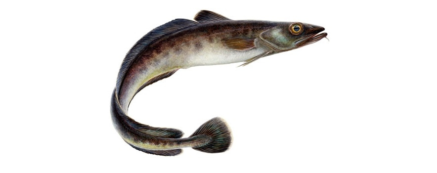

---
title: "VISA"
author: Adriana Villamor
date: May 2018
output:
  html_document:
    toc: true
runtime: shiny
---

```{r setup, include=FALSE}
knitr::opts_chunk$set(
	echo = FALSE,
	message = FALSE,
	warning = FALSE
)
```


# Blue ling (*Molva dypterygia*) in subareas 6–7 and Division 5.b (Celtic Seas, English Channel, and Faroes grounds)
***



[Link to latest advice](http://ices.dk/sites/pub/Publication%20Reports/Advice/2018/2018/bli-5b67.pdf)  
[Link to Standard Graphs page](https://standardgraphs.ices.dk/manage/ViewGraphsAndTables.aspx?key=9467)

***

# ICES advice on fishing opportunities
ICES advises that when the MSY approach is applied, catches should be no more than *11 778* tonnes in 2019 and no more than *11 150* tonnes in 2020.
 <br> 

***

# Stock development over time
The spawning-stock biomass (SSB) has increased since 2004 and has been above MSY Btrigger since 2010. Fishing mortality has decreased since 2002 and has been lower than FMSY since 2004. Recruitment is estimated to be stable.
 
 
```{r cars, echo = FALSE, fig.height = 4, fig.width = 5, fig.align = "top"}
 library(htmlwidgets)
 library(dplyr)
 library(ggplot2)
 library(gridExtra)
 library(dygraphs)
 library(htmltools)
 data <- read.csv("blidata.csv")
 
 dyBarChart <- function(dygraph) {
  dyPlotter(dygraph = dygraph,
            name = "BarChart",
            path = system.file("examples/plotters/barchart.js",
                               package = "dygraphs"))
}
 
 catches <- data %>% select(Year, catches)
 catches$catches <- catches[, "catches"]/1000
 recruitment<- data %>% select(Year, low_recruitment, recruitment, high_recruitment)
 
 dygraph(catches, main = "Catches") %>% 
   dyRangeSelector()%>%
   dyOptions(colors = RColorBrewer::brewer.pal(3, "Set2"), drawGrid = FALSE,maxNumberWidth = 4)%>%
   dyAxis("y", label = "Catches in 1000 t")%>%
   dyBarChart()
 dygraph(recruitment, main = "Recruitment(age 0)") %>%
   dyRangeSelector()%>%
   # dyOptions(colors = RColorBrewer::brewer.pal(3, "Set2"))%>%
   dyAxis("y", label = "Recruitment in millions")%>%
   dyBarChart()
 

```
 
  
 
```{r, echo = FALSE, fig.height = 4, fig.width = 6, fig.align = "left"}
library(dygraphs)
library(htmlwidgets)
library(dplyr)
library(ggplot2)
library(gridExtra)
library(dygraphs)

dyBarChart <- function(dygraph) {
  dyPlotter(dygraph = dygraph,
            name = "BarChart",
            path = system.file("examples/plotters/barchart.js",
                               package = "dygraphs"))
} 

F <- data %>% select(Year, low_F, F,high_F, FLim, Fpa, FMSY )
 dygraph(F, main = "F") %>% 
  dySeries(c("low_F", "F", "high_F"))%>%
   dyLimit(as.numeric(F[, 5]), color = "red")%>%
   dyRangeSelector()%>%
   dyOptions(colors = RColorBrewer::brewer.pal(3, "Set2"), 
             drawGrid= FALSE,maxNumberWidth = 4)%>%
   dyAxis("y", label = "F(15-80cm)")

SSB <- data %>% select(Year, low_SSB, SSB,high_SSB, Blim, Bpa, MSYBtrigger)
 dygraph(SSB, main = "SSB") %>%
  dySeries(c("low_SSB", "SSB", "high_SSB"))%>%
   dyLimit(as.numeric(F[, 5]), color = "red")%>%
   dyRangeSelector()%>%
   dyOptions(colors = RColorBrewer::brewer.pal(3, "Set2"),
             drawGrid= FALSE,maxNumberWidth = 4)%>%
   dyAxis("y", label = "SSB in 1000 t")

# p<- ggplot(data, aes(x = Year, y= F)) + geom_line(position = "stack")
#  p <- p + theme_bw()
#  c<- ggplotly(p)
#  q <- ggplot(data, aes(x = Year, y= SSB)) + geom_line(position = "stack")
#  q <- q + theme_bw()
#  d<- ggplotly(q)
#  subplot(c,d)

#Need to figure out how to order them, and make them all show up 
 
```

**Figure 1**  Blue ling in subareas 6–7 and Division 5.b. Summary of stock assessment (weights in thousand tonnes and recruitment in millions). Assumed recruitment values are unshaded.

<br>

 ***  

# Stock and explotation status

<br>

ICES assesses that fishing pressure on the stock is below FMSY and spawning stock size is above MSY Btrigger.

<br>

**Table 1** Blue ling in subareas 6–7 and Division 5.b. State of the stock and fishery relative to reference points.

```{r, echo = FALSE, fig.height = 2, fig.width = 8, fig.align = "center"}
 library(icesSAG)
 assessmentKey <- findAssessmentKey("bli-5b67", 2018)
 table <- getStockStatusTable(assessmentKey)
 plot(table)
 
 
 library(DT)
 datatable(data, extensions = c('Buttons','FixedColumns'),
          options = list(pageLength = 5, dom = 'Bfrtip',
            buttons = c('csv','excel','copy','print'),
            scrollX = TRUE,
            fixedColumns = TRUE))

```
<br> 

***  

# Catch scenarios

<br>

**Table 2** Blue ling in subareas 6–7 and Division 5.b. Assumptions made for the interim year and in the forecast.

<br>
```{r catchoptionsbasis, echo=FALSE}
library(knitr)
library(readr)
library(kableExtra)
dt <- read.csv("blicatchoptionsbasis.csv",header = T, row.names = 1)
# dt <- dt [,-1] 
kable(dt, "html")%>%kable_styling(position = "center", full_width = T, font_size = 12)%>%
  row_spec(0, bold = T, color = "black", background = "lightgrey", align = "c")%>%
  column_spec(1, width = "15em")%>%
  column_spec(3, width = "60em")%>%
  column_spec(2, width = "10em")
```
<br>

***

**Table 3** Blue ling in subareas 6–7 and Division 5.b. Annual catch scenarios for 2019. All weights are in tonnes.
```{r catchoptions, echo=FALSE}
library(knitr)
library(readr)
library(kableExtra)
dt <- read.csv("blicatchoptions.csv", header = T, row.names = 1)
# dt <- dt [,-1]
dt <- dt[complete.cases(dt),]
kable(dt, "html")%>%kable_styling(position = "center")%>%
  row_spec(0, bold = T, color = "black", background = "lightgrey")%>%
  column_spec(1, width = "60em")%>%
  group_rows("ICES advice basis",1,1) %>%
  group_rows("Other options",2,9)

```
<br>
<!--  -->

```{r, out.width = "600px"}
knitr::include_graphics("hkescenariosplot.png")

```

<br>
```{r echo = FALSE, fig.height = 4, fig.width = 6, fig.align = "left"}
library(ggplot2)
library(plotly)
 catchoptions <- read.csv("bliscenariosplot.csv")
 labels <- catchoptions$Rationale
 labels <- as.character(labels)
 p1 <- ggplot(catchoptions, aes(F))+
    geom_rect(xmin = -Inf, ymin = -Inf, xmax = 0.12, ymax = Inf,
              fill = "lightgreen", alpha=0.50)+theme_bw()+
    # geom_rect(xmin = 0.280, ymin = -Inf, xmax = 0.282, ymax = Inf,
    #           fill = "gold", alpha=0.50)+theme_bw()+
    geom_rect(xmin = 0.12, ymin = -Inf, xmax = 0.17, ymax = Inf,
              fill = "coral")+theme_bw()+
    geom_rect(xmin = 0.17, ymin = -Inf, xmax = Inf, ymax = Inf,
              fill = "brown1")+theme_bw()+
    geom_hline(yintercept=75037, linetype="dashed", color = "red")+
    geom_hline(yintercept=54000, linetype="dashed", color = "black")+
    geom_vline(xintercept = 0.12,
               color = "yellow", size=3)+
    geom_vline(xintercept = 0.12, linetype="dotted",
               color = "blue", size=0.5)+
    geom_vline(xintercept = 0.17, linetype="dotted",
               color = "blue", size=0.5)+
    # geom_col(aes(y = Catch), width = 0.15)+
    geom_point(aes(y = Catch),size = 2, colour= "Red") +
    geom_line(aes(y = Catch),size = 0.5, colour= "Red")+
    geom_point(aes(y=SSB), size = 2, colour= "Blue")+
    geom_line(aes(y = SSB),size = 0.5, colour= "Blue")+
    scale_y_continuous("tonnes",sec.axis = sec_axis(~., name = "SSB"))+
    scale_x_continuous(breaks = catchoptions$F, labels = labels)+
    xlab("Catch scenarios")+
    ylab("tonnes")
  p2 <- p1 + theme(axis.text.x = element_text(face="bold", color="Black",
                             size=10, angle=45))+
    theme(legend.text = element_text(colour="blue", size = 16, face = "bold"))
  # p3<- p2+ guide_colorbar(title = "Spawning Stock Biomass", label= TRUE,barheight = )
 # p3<- p2 + geom_hline(yintercept=45000, linetype="dashed", color = "red")+
 #   geom_hline(yintercept=32000, linetype="dashed", color = "black")+
 #   geom_vline(xintercept = 0.28,
 #                 color = "yellow", size=3)+
 #   geom_vline(xintercept = 0.62, linetype="dotted",
 #                   color = "blue", size=0.5)+
 #   geom_vline(xintercept = 0.87, linetype="dotted",
 #                 color = "blue", size=0.5)


 ggplotly(p2, width = 600, height = 300)


 p1 <- ggplot(catchoptions, aes(F))+
    geom_rect(xmin = -Inf, ymin = -Inf, xmax = 0.62, ymax = Inf,
              fill = "lightgreen", alpha=0.50)+theme_bw()+
    # geom_rect(xmin = 0.280, ymin = -Inf, xmax = 0.282, ymax = Inf,
    #           fill = "gold", alpha=0.50)+theme_bw()+
    geom_rect(xmin = 0.62, ymin = -Inf, xmax = 0.87, ymax = Inf,
              fill = "coral")+theme_bw()+
    geom_rect(xmin = 0.87, ymin = -Inf, xmax = Inf, ymax = Inf,
              fill = "brown1")+theme_bw()+
    geom_hline(yintercept=45000, linetype="dashed", color = "red")+
    geom_hline(yintercept=32000, linetype="dashed", color = "black")+
    geom_vline(xintercept = 0.28,
               color = "yellow", size=3)+
    geom_vline(xintercept = 0.62, linetype="dotted",
               color = "blue", size=0.5)+
    geom_vline(xintercept = 0.87, linetype="dotted",
               color = "blue", size=0.5)+
    geom_col(aes(y = Catch), width = 0.15)+
    # geom_point(aes(y = Catch),size = 2, colour= "Red") +
    # geom_line(aes(y = Catch),size = 0.5, colour= "Red")+
    geom_point(aes(y=SSB), size = 2, colour= "Blue")+
    geom_line(aes(y = SSB),size = 0.5, colour= "Blue")+
    scale_y_continuous("tonnes",sec.axis = sec_axis(~., name = "SSB"))+
    scale_x_continuous(breaks = catchoptions$F, labels = labels)+
    xlab("Catch scenarios for 2018")+
    ylab("tonnes")
  p2 <- p1 + theme(axis.text.x = element_text(face="bold", color="Black",
                             size=10, angle=45))+
    theme(legend.text = element_text(colour="blue", size = 16, face = "bold"))
  # p3<- p2+ guide_colorbar(title = "Spawning Stock Biomass", label= TRUE,barheight = )
 # p3<- p2 + geom_hline(yintercept=45000, linetype="dashed", color = "red")+
 #   geom_hline(yintercept=32000, linetype="dashed", color = "black")+
 #   geom_vline(xintercept = 0.28,
 #                 color = "yellow", size=3)+
 #   geom_vline(xintercept = 0.62, linetype="dotted",
 #                   color = "blue", size=0.5)+
 #   geom_vline(xintercept = 0.87, linetype="dotted",
 #                 color = "blue", size=0.5)


 ggplotly(p2, width = 600, height = 300)

```

 

The advised catch in 2019 is higher than the advice for 2018 because of an increase in biomass. However, between 2019 and 2020 the biomass declines, resulting in a decrease in advised catches.

<br>

***
```{r graph, echo=FALSE}


```


<br>

# Basis of the advice  
***
<br>
**Table 4** Blue ling in subareas 6–7 and Division 5.b. The basis of the advice.
```{r advicebasis, echo=FALSE}
library(knitr)
library(readr)
library(kableExtra)
dt <- read.csv("bliadvicebasis.csv", header = FALSE)
dt <- dt [,-1] 
kable(dt, "html")%>%kable_styling(position = "center")%>%
  column_spec(1, bold = T, color = "black", background = "lightgrey")

```

<br>

#Quality of the assessment  
***
<br>


# Reference Points  
***
<br>
**Table 5**	Blue ling in subareas 6–7 and Division 5.b. Reference points, values, and their technical basis.
```{r referencepoints, echo=FALSE}
library(knitr)
library(readr)
library(kableExtra)
dt <- read.csv("blireferencepoints.csv")
dt <- dt [,-1] 
kable(dt, "html")%>%kable_styling(position = "center")%>%
  row_spec(0, bold = T, color = "black", background = "lightgrey")

```
<br>

# Basis of the assessment  
***
<br>
**Table 6**	Blue ling in subareas 6–7 and Division 5.b. The basis of the assessment.
```{r advicebla, echo=FALSE}
library(knitr)
library(readr)
library(kableExtra)
dt <- read.csv("bliassessmentbasis.csv")
dt <- dt [,-1] 
kable(dt, "html")%>%kable_styling(position = "center")%>%
  row_spec(0, bold = T, color = "black", background = "lightgrey")

```

# Historical trends
```
<<insertHTML:[index.html]


```{r, echo=FALSE}
library(googleVis)
kobe <- read_csv("kobe_data_2.csv")
herring <- kobe %>% filter(StockCode =="her.27.3a47d")
vis<- gvisMotionChart(herring, idvar = "StockCode", timevar = "Year", xvar = "SSB.MSYBtrigger",
  yvar = "F.Fmsy", colorvar = "EcoRegion", sizevar = "", date.format = "%Y/%m/%d",
  options = list())
vis
```

```
D:\Adriana\Documents\Dissemination_tool\kobedynamic\index.html

## Including Plots

You can also embed plots, for example:

```{r pressure, echo=FALSE}
plot(pressure)
```

Note that the `echo = FALSE` parameter was added to the code chunk to prevent printing of the R code that generated the plot.
